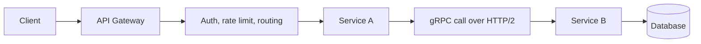
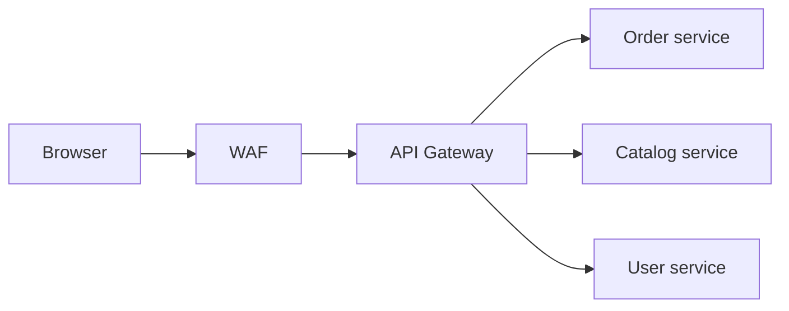
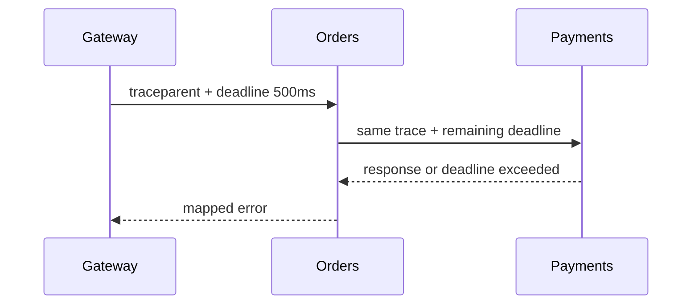

## Prerequisites: Before You Begin

You should already understand:

- REST APIs and HTTP status codes.
- Microservices and network failure.
- TLS, authentication, and JWT basics.
- Basic serialization with JSON.

---

# Phase 1: Ground Floor (Service Communication Reality)

A local method call stays inside one process. A service call crosses process, kernel, network, load balancer, TLS, parser, worker thread, and serialization boundaries.



The gateway handles traffic at the edge. gRPC handles strongly typed service-to-service calls. Protobuf defines compact schemas that can evolve safely when used correctly.

---

# Phase 2: Naive Architecture (The Gateway Becomes A Monolith)

Bad gateway:

```java
@RestController
class MegaGatewayController {

    @PostMapping("/checkout")
    OrderResponse checkout(@RequestBody CheckoutRequest request) {
        inventory.reserve(request.items());
        payment.charge(request.payment());
        orders.create(request);
        notifications.send(request.email());
        return new OrderResponse("OK");
    }
}
```

This is not a gateway. It is a distributed monolith controller. It owns business orchestration, calls every service synchronously, and becomes the hardest component to change.

Real gateway responsibilities:

| Gateway should do | Gateway should avoid |
| --- | --- |
| TLS termination | core domain rules |
| route requests | long business transactions |
| verify tokens | direct database ownership |
| rate limit | cross-service write orchestration |
| inject correlation IDs | compensating transactions |
| coarse authorization | hiding service failures with fake success |

---

# Phase 3: API Gateway Patterns

## Edge Gateway



Use for:

- External API routing.
- Authentication and token validation.
- Rate limiting.
- Request logging and correlation IDs.
- Cross-origin policy.

## BFF: Backend For Frontend

A BFF is a backend shaped for one client experience.

| Client | BFF responsibility |
| --- | --- |
| Web app | aggregate dashboard payloads |
| Mobile app | reduce round-trips and payload size |
| Admin panel | enforce admin-specific workflows |

Keep BFF logic presentation-oriented. Do not let it become the owner of core domain invariants.

---

# Phase 4: gRPC And Protobuf

gRPC defines services using `.proto` files and usually uses Protocol Buffers for messages.

```protobuf
syntax = "proto3";

package orders.v1;

service OrderQueryService {
  rpc GetOrder(GetOrderRequest) returns (OrderResponse);
  rpc StreamOrderEvents(StreamOrderEventsRequest) returns (stream OrderEvent);
}

message GetOrderRequest {
  string order_id = 1;
}

message OrderResponse {
  string order_id = 1;
  string status = 2;
  int64 total_cents = 3;
}

message StreamOrderEventsRequest {
  string customer_id = 1;
}

message OrderEvent {
  string order_id = 1;
  string status = 2;
  int64 occurred_at_epoch_ms = 3;
}
```

## RPC Types

| Type | Shape | Use case |
| --- | --- | --- |
| Unary | one request, one response | normal query or command |
| Server streaming | one request, many responses | event feed |
| Client streaming | many requests, one response | upload/aggregation |
| Bidirectional streaming | many both ways | realtime collaboration |

## REST vs gRPC

| Concern | REST/JSON | gRPC/Protobuf |
| --- | --- | --- |
| Browser support | native | usually needs gRPC-Web/proxy |
| Human debugging | easy with cURL | needs tooling |
| Schema | optional unless OpenAPI enforced | required `.proto` |
| Payload size | larger | compact binary |
| Streaming | limited | first-class |
| Public APIs | common | less common for browser/public APIs |
| Internal services | good | excellent for typed low-latency RPC |

---

# Phase 5: Production Rules

## Deadlines Are Not Optional

Without deadlines, one slow downstream can hold threads, connections, and memory until the caller collapses.

```java
OrderResponse response = orderClient
        .withDeadlineAfter(300, TimeUnit.MILLISECONDS)
        .getOrder(GetOrderRequest.newBuilder()
                .setOrderId(orderId.toString())
                .build());
```

Line-by-line reading:

- `orderClient` is the generated gRPC stub. It hides HTTP/2 frames, but it does not remove the network failure boundary.
- `.withDeadlineAfter(300, TimeUnit.MILLISECONDS)` puts a hard clock on the RPC. Without it, a slow downstream can hold the caller's thread, connection, and memory until an outer system times out.
- `.getOrder(...)` is a synchronous unary RPC. The calling thread waits until response, error, or deadline.
- `GetOrderRequest.newBuilder()` creates a typed protobuf request instead of hand-built JSON.
- `.setOrderId(orderId.toString())` converts the domain ID into the wire format expected by the `.proto` contract.
- `.build()` freezes the request message. Protobuf messages should be treated as immutable value objects once sent.

Proof habit: set the server to sleep for 500ms and assert the client receives `DEADLINE_EXCEEDED` in about 300ms. Then verify the gateway maps that status to a controlled HTTP error, not a generic 500 stack trace.

## Protobuf Compatibility

| Change | Safe? | Rule |
| --- | --- | --- |
| Add new field number | yes | old clients ignore unknown field |
| Rename field only | usually yes on wire | generated code names change for source users |
| Reuse deleted field number | no | can corrupt meaning |
| Change field type | no | breaks decoding semantics |
| Remove field | risky | reserve field number and name |

```protobuf
message OrderResponse {
  reserved 4;
  reserved "legacy_status";

  string order_id = 1;
  string status = 2;
  int64 total_cents = 3;
}
```

Line-by-line compatibility reading:

- `reserved 4;` permanently blocks reuse of old field number 4. This matters because protobuf encodes field numbers on the wire, not Java field names.
- `reserved "legacy_status";` prevents future source-level reuse of the old field name.
- `string order_id = 1;` means field number 1 is part of the binary contract. Renaming `order_id` later may be okay on the wire but can break generated-code callers.
- `int64 total_cents = 3;` stores money as integer cents. A floating-point `double` would introduce rounding bugs in billing and ledgers.

What breaks without reserves: an old mobile app can send field `4` with the old meaning while a new server interprets field `4` as a different concept. That is semantic data corruption, not a harmless decode error.

## Gateway Observability

Every gateway and RPC call should propagate:

- `traceparent`
- request ID
- authenticated subject
- tenant ID
- deadline/timeout
- route name



---

# Phase 6: Senior Interview Ace

| Junior answer | Senior answer |
| --- | --- |
| "Gateway routes requests." | "It handles edge concerns like auth, rate limits, routing, and observability, while domain invariants stay in services." |
| "gRPC is faster than REST." | "gRPC uses HTTP/2 and Protobuf, giving typed contracts, compact payloads, and streaming. The real choice depends on clients, debugging, browser needs, and compatibility." |
| "Protobuf fields can be changed." | "Field numbers are the wire contract. Never reuse removed numbers; reserve them." |
| "Retries fix failures." | "Retries need deadlines, idempotency, backoff, and budgets or they amplify outages." |

## Debug Checklist

- Is the gateway doing domain orchestration it should not own?
- Are deadlines configured on every gRPC call?
- Are retries limited and idempotent?
- Are Protobuf field numbers stable?
- Are gRPC errors mapped cleanly at public boundaries?
- Does tracing cross gateway, REST, gRPC, and Kafka boundaries?
- Is auth context propagated safely and verified by downstream services?

## Practice Tasks

1. Define an `OrderQueryService` proto.
2. Add a safe field and generate Java stubs.
3. Remove a field incorrectly, then fix it with `reserved`.
4. Add a 300 ms deadline to a gRPC client call.
5. Design which logic belongs in gateway, BFF, or domain service.

## Done Checklist

- [ ] You can explain API Gateway vs BFF vs service.
- [ ] You can compare REST and gRPC without hype.
- [ ] You can write a basic `.proto` file.
- [ ] You can evolve Protobuf schemas safely.
- [ ] You can explain deadlines, retries, tracing, and auth propagation.
