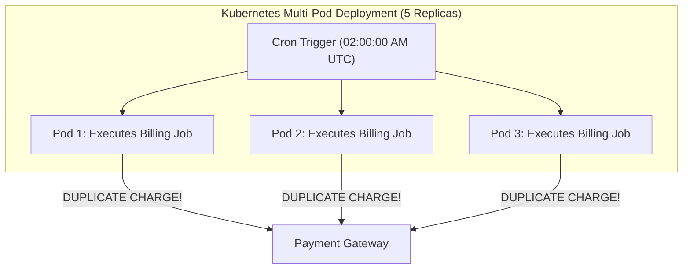
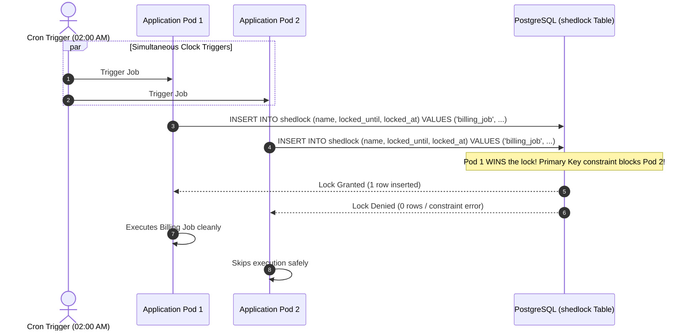
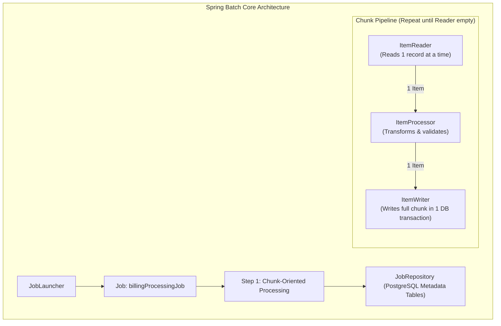
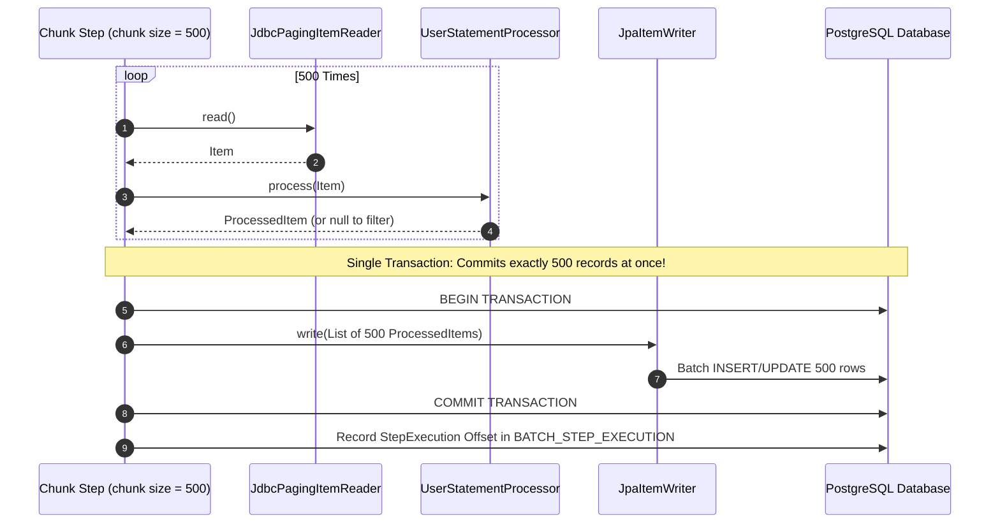
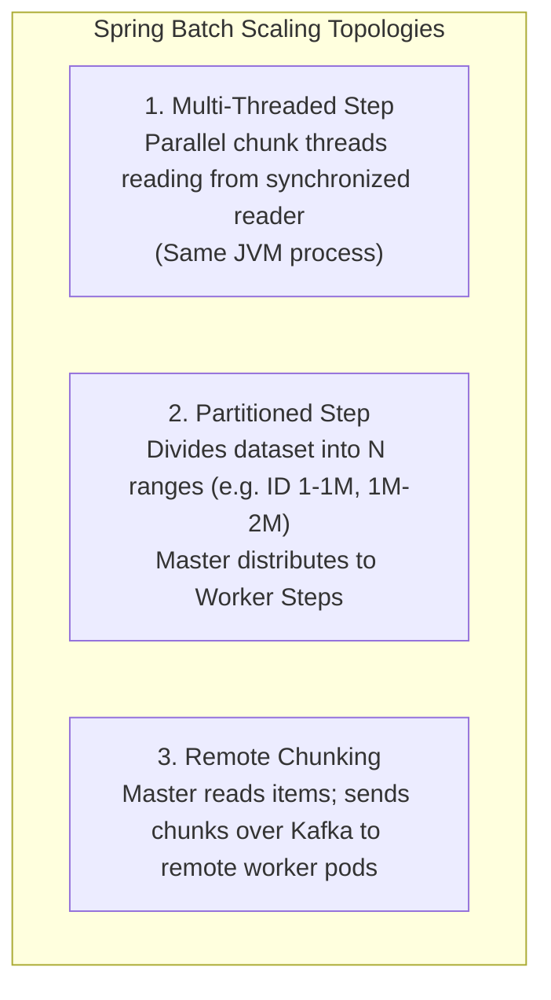

# Distributed Batch Processing & Job Scheduling

In enterprise backend engineering, workloads fall into two broad categories:
1. **Online Transaction Processing (OLTP)**: Interactive REST APIs serving user requests in under 100 milliseconds.
2. **Offline Batch Processing**: Scheduled, bulk data pipelines processing millions of records (nightly billing runs, end-of-month financial reconciliations, catalog synchronizations, and PDF invoice generation).

Running batch jobs in cloud environments introduces distributed coordination challenges: **preventing duplicate executions across multi-replica Kubernetes pods, processing multi-gigabyte datasets without JVM heap exhaustion, and ensuring that a single corrupt record does not abort an entire 10-hour job**.

---

## 1. The Multi-Pod Cron Problem: Why `@Scheduled` Fails

Spring Boot provides the `@Scheduled` annotation for executing recurring cron tasks:

```java
// DANGEROUS IN MULTI-POD KUBERNETES DEPLOYMENTS:
@Scheduled(cron = "0 0 2 * * *") // Runs nightly at 2:00 AM
public void runDailyBilling() {
    billingService.chargeCustomerSubscriptions();
}
```

### The Duplicate Execution Disaster
If your Kubernetes deployment runs 5 replicas of the application:
- At 02:00:00 AM, **all 5 pods simultaneously trigger the `runDailyBilling()` method**!
- Unless guarded by distributed locks, customers will be charged 5 times, and concurrent database updates will cause deadlock storms.



---

## 2. Distributed Scheduling with ShedLock

For lightweight periodic jobs, the production standard is **ShedLock**: an open-source library that uses a shared database table to guarantee that a scheduled task executes **at most once** across a multi-node cluster.



### 2.1 The Critical `@SchedulerLock` Parameters
ShedLock provides two essential safety guardrails:

```java
@Scheduled(cron = "0 0 2 * * *")
@SchedulerLock(
    name = "DailyBillingJob",
    lockAtMostFor = "PT15M",  // Maximum lock duration (safety net against pod crashes)
    lockAtLeastFor = "PT5M"   // Minimum lock duration (safety net against clock skew)
)
public void runDailyBilling() {
    billingService.chargeCustomerSubscriptions();
}
```

- `lockAtMostFor`: If Pod 1 acquires the lock and immediately suffers a kernel panic or OOMKill, the lock automatically expires after 15 minutes, preventing the job from being permanently locked out of future runs.
- `lockAtLeastFor`: If Pod 1 completes the job in 3 seconds, it **holds the lock for at least 5 minutes**. This prevents other pods whose physical clocks lag by 2 seconds from immediately re-acquiring the lock and executing the job a second time!

### 2.2 PostgreSQL ShedLock Table DDL

```sql
CREATE TABLE shedlock (
    name VARCHAR(64) NOT NULL PRIMARY KEY,
    lock_until TIMESTAMP WITH TIME ZONE NOT NULL,
    locked_at TIMESTAMP WITH TIME ZONE NOT NULL,
    locked_by VARCHAR(255) NOT NULL
);
```

---

## 3. Enterprise Spring Batch 5: Architecture & Concepts

When processing tens of millions of records, simple cron jobs fail. Storing millions of objects in a Java `List` causes `OutOfMemoryError: Java heap space`.

**Spring Batch** is a robust framework designed for enterprise bulk processing:



### 3.1 The 5 Core Concepts of Spring Batch
1. **Job**: An explicit state machine representing the end-to-end batch process (e.g. `MonthlyStatementJob`).
2. **Step**: An independent phase within a Job (e.g. Step 1: Validate Accounts $\rightarrow$ Step 2: Calculate Interest $\rightarrow$ Step 3: Send Invoices).
3. **ItemReader**: Reads records one by one from a cursor or paging stream without loading the entire dataset into memory.
4. **ItemProcessor**: Encapsulates business logic, transformations, and data enrichment. If an item is invalid, returning `null` skips the item.
5. **ItemWriter**: Accepts a batch of processed items (a **Chunk**) and writes them in a single database transaction.

---

## 4. Chunk-Oriented Processing & Transaction Boundaries

The defining feature of Spring Batch is **Chunk-Oriented Processing**:



### Why Chunk-Oriented Processing Is Mandatory for Large Datasets:
- **Constant Memory Footprint ($O(1)$ RAM)**: Even if the database contains 100 million rows, memory usage is capped at the size of one single chunk (e.g. 500 records).
- **Restartability**: If a failure occurs at record 4,500,210, the job stores its progress in the `BATCH_STEP_EXECUTION` metadata table. Upon restart, Spring Batch **skips the first 4.5 million records** and resumes from the exact failed chunk!

---

## 5. Fault Tolerance: Skip and Retry Policies

In enterprise data pipelines, dirty data (e.g. missing postal codes or malformed foreign keys) is common. If a batch pipeline processing 10 million records throws an unhandled exception at record 9,999,999, aborting the entire 8-hour run is unacceptable.

Spring Batch provides declarative **Skip and Retry Policies**:

```java
@Bean
public Step billingStep(JobRepository jobRepository, PlatformTransactionManager transactionManager) {
    return new StepBuilder("billingStep", jobRepository)
        .<Customer, Invoice>chunk(500, transactionManager)
        .reader(customerItemReader())
        .processor(customerInvoiceProcessor())
        .writer(invoiceItemWriter())
        .faultTolerant()
        // Skip specific non-fatal business exceptions
        .skip(InvalidCustomerAddressException.class)
        .skip(PaymentValidationException.class)
        .skipLimit(100) // Abort only if bad records exceed 100
        // Automatically retry transient network errors
        .retry(HttpTimeoutException.class)
        .retryLimit(3)
        .listener(new CustomSkipListener()) // Log skipped records for audit
        .build();
}
```

### Custom Skip Listener (Audit Trail)
When a record is skipped, it must be recorded in an audit table so developers can inspect and fix the dirty data:

```java
public class CustomSkipListener implements SkipListener<Customer, Invoice> {
    private static final Logger log = LoggerFactory.getLogger(CustomSkipListener.class);

    @Override
    public void onSkipInProcess(Customer customer, Throwable t) {
        log.warn("Skipping customer ID {} due to validation error: {}", 
                customer.getId(), t.getMessage());
        // Insert into batch_skipped_records table for manual triage
    }
}
```

---

## 6. Scaling Batch Pipelines to 50M+ Records

When single-threaded chunk processing is too slow to meet nightly batch SLAs (e.g. 50 million records taking 14 hours), Spring Batch provides three scaling strategies:



### 6.1 Partitioning by Primary Key Range
The most effective way to scale relational batch jobs is **Range Partitioning**:

```java
@Bean
public Step masterStep(JobRepository jobRepository, Step workerStep) {
    return new StepBuilder("masterStep", jobRepository)
        .partitioner("workerStep", new ColumnRangePartitioner("customers", "id"))
        .step(workerStep)
        .gridSize(8) // Split work across 8 parallel worker threads
        .taskExecutor(new SimpleAsyncTaskExecutor("batch-worker-"))
        .build();
}
```

The master step divides the table:
- Thread 1 processes IDs `1` to `6,250,000`.
- Thread 2 processes IDs `6,250,001` to `12,500,000`.
- Result: **Throughput scales linearly with available CPU cores and database connection pools!**

---

## 7. Active Recall Interview Mastery

<AccordionGroup>
  <Accordion title="1. Why does Spring @Scheduled fail in a Kubernetes cluster? How does ShedLock solve it?">
    In Kubernetes, multiple replica pods run identical copies of the application. At the designated cron time, all pods trigger the scheduled method simultaneously, resulting in duplicate work, double charges, and database deadlocks. 
    
    ShedLock coordinates execution using a shared database table. The first pod to reach the trigger time acquires an exclusive lock record in the `shedlock` table. All other pods fail to acquire the lock and exit cleanly without executing the job.
  </Accordion>

  <Accordion title="2. What is the purpose of lockAtMostFor and lockAtLeastFor in ShedLock?">
    - `lockAtMostFor`: Guarantees that if the pod holding the lock crashes or dies midway through execution, the lock automatically expires after this duration, preventing permanent deadlocks.
    - `lockAtLeastFor`: Guarantees that the lock is retained for a minimum time even if the job finishes in milliseconds. This prevents other pods whose clocks are slightly behind from re-acquiring the lock and running the job a second time within the same window.
  </Accordion>

  <Accordion title="3. How does Chunk-Oriented Processing in Spring Batch prevent OutOfMemoryErrors?">
    Instead of loading millions of database records into an in-memory collection (`List<Entity>`), an `ItemReader` streams records one by one. 
    
    Spring Batch accumulates records up to the configured chunk size (e.g. 500 records), processes them, and passes the 500-item batch to the `ItemWriter`. The writer commits the transaction and clears the persistence context. Memory usage remains constant regardless of whether the dataset contains 1,000 or 100,000,000 rows.
  </Accordion>

  <Accordion title="4. How does Spring Batch handle job restartability after a mid-process crash?">
    Spring Batch maintains job state inside metadata tables (`BATCH_JOB_EXECUTION`, `BATCH_STEP_EXECUTION`). Every time a chunk commits, Spring Batch records the reader's current offset and checkpoint index. 
    
    When a failed job is restarted with the same Job Parameters, Spring Batch reads the metadata, skips the millions of records that were already committed, and resumes execution from the exact chunk where the failure occurred.
  </Accordion>

  <Accordion title="5. What is the difference between Multi-Threaded Steps and Partitioned Steps in Spring Batch?">
    - **Multi-Threaded Step**: A single `ItemReader` reads items and distributes chunks across multiple worker threads in the same JVM. Crucial limitation: The `ItemReader` must be strictly thread-safe, and items are no longer processed in sequential order.
    - **Partitioned Step**: The dataset is divided into distinct, non-overlapping partitions (e.g. by customer ID ranges). Each worker thread runs its own independent Step with its own private `ItemReader`. This delivers superior scaling because worker steps operate completely independently without reader lock contention.
  </Accordion>
</AccordionGroup>

---

## 8. Done Checklist

<Check>
Recurring crons running across multiple container pods are guarded by ShedLock to ensure at-most-once execution.
</Check>
<Check>
`@SchedulerLock` configures both `lockAtMostFor` (crash protection) and `lockAtLeastFor` (clock skew protection).
</Check>
<Check>
Bulk data pipelines process data in constant-memory chunks via Spring Batch 5 rather than naive in-memory collections.
</Check>
<Check>
Batch jobs declare explicit skip and retry policies to prevent isolated dirty records from aborting multi-hour runs.
</Check>
<Check>
High-volume datasets (50M+ rows) utilize partitioned steps to scale linearly across CPU cores.
</Check>
<Check>
Failed batch records are logged to audit tables for developer triage and manual replay.
</Check>
