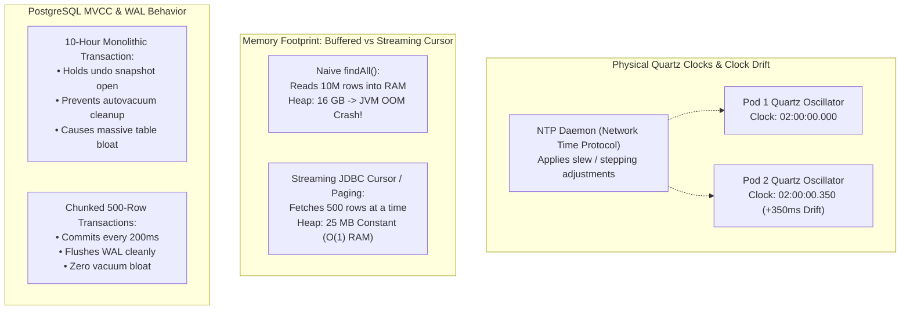
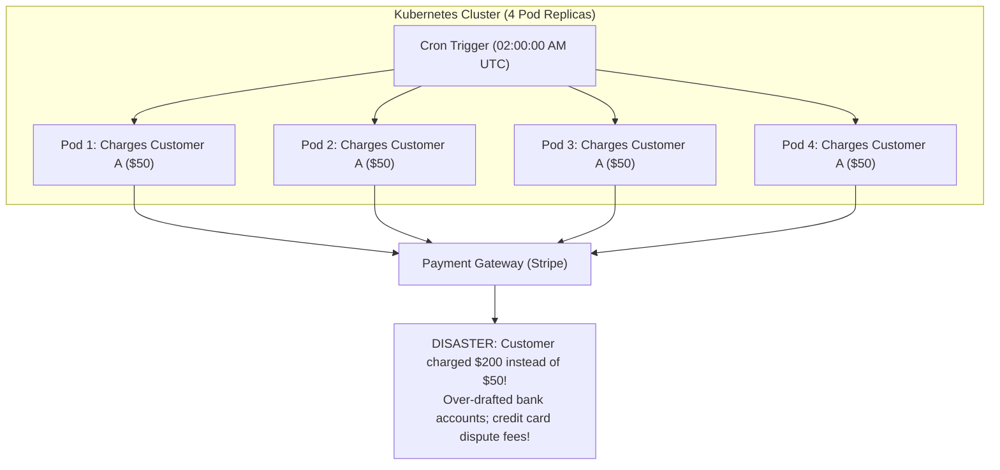
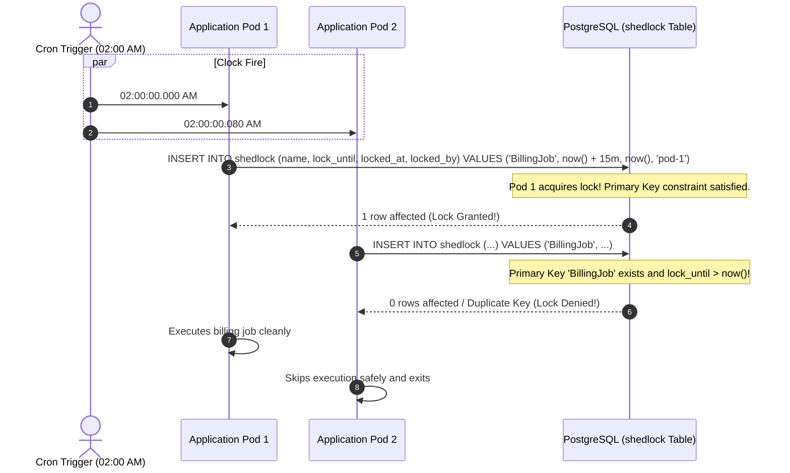
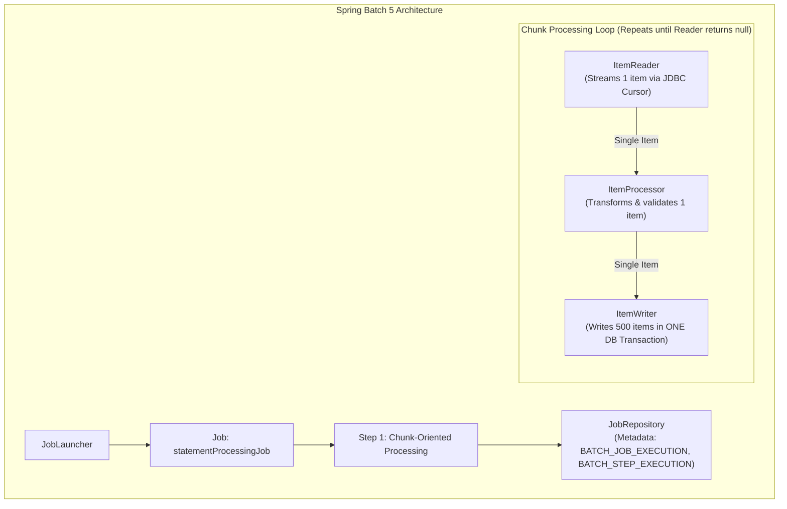
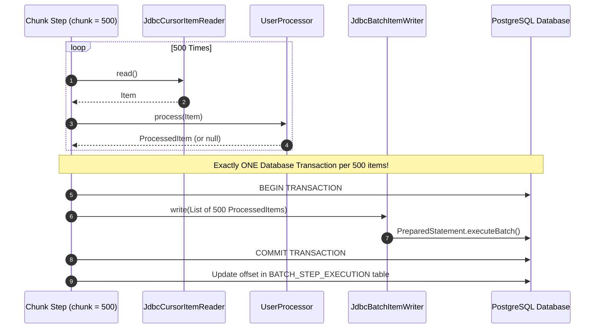
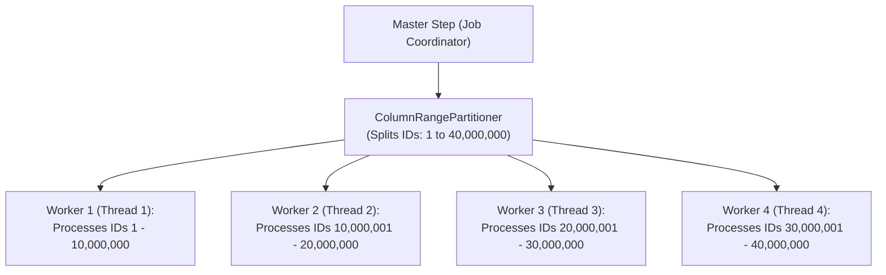

# Distributed Batch Processing & Job Scheduling

In enterprise backend engineering, system workloads fall into two fundamentally distinct categories:
1. **Online Transaction Processing (OLTP)**: Interactive, sub-100-millisecond REST APIs serving synchronous user actions (checkout, login, viewing product pages).
2. **Offline Batch Processing**: Scheduled, bulk data pipelines operating on millions of records (nightly credit card billing, payroll disbursement, monthly financial reconciliation, search index rebuilds, and regulatory tax reporting).

Running enterprise batch jobs in distributed, cloud-native environments introduces high-risk architectural failure modes:
- **The Multi-Pod Cron Disaster**: Running `@Scheduled` on a multi-replica Kubernetes deployment causes all pods to trigger simultaneously, charging customers multiple times and causing database deadlock storms.
- **The Heap Exhaustion Meltdown**: Fetching millions of records into memory (`findAll()`) crashes the JVM with `OutOfMemoryError: Java heap space` and freezes collocated web traffic.
- **The 10-Hour Rollback Failure**: A single corrupted record at item 4,999,999 causes an unhandled exception that rolls back a 10-hour monolithic database transaction.

Senior backend engineers do not write simple scripts or naive loops for bulk processing. They master **clock drift mechanics, distributed locking via ShedLock, Spring Batch 5 chunk-oriented state machines, and parallel partition scaling**.

---

## Phase 1: Ground Floor (Physical First Principles)

To design resilient scheduled batch systems, you must understand physical clock drift, streaming disk cursors, and database transaction undo logs.



### 1. The Physical Reality of Clock Drift
No two computer servers share the exact same physical time. Server hardware clocks rely on quartz crystals that vibrate at frequencies sensitive to ambient data center temperature, voltage fluctuations, and component age:
- Even when synchronized via the Network Time Protocol (NTP), physical servers in the same cluster routinely drift by **$10\text{ to }200\text{ milliseconds}$**.
- If a cron job finishes in $50\text{ ms}$ on Pod 1, Pod 2's clock might trigger $100\text{ ms}$ later, seeing the job as "ready to run again" within the same scheduled minute!
- This physical drift requires distributed locks to enforce a **minimum lock duration (`lockAtLeastFor`)** to prevent re-execution across drifting clocks.

### 2. Streaming Cursors vs In-Memory Buffering
- Loading 10,000,000 rows into a Java `List<Order>` requires allocating millions of HotSpot object headers, internal pointers, and string byte arrays. A 2GB database table balloons into **over 12GB of JVM heap memory**, triggering continuous Stop-The-World GC pauses.
- **Streaming Cursors**: Spring Batch opens a database cursor (`FETCH FORWARD 500`) or keyset pagination query. The JVM retains only the current **Chunk of 500 records** in memory ($O(1)$ memory consumption), processes them, writes them, commits the transaction, and reclaims heap space immediately.

### 3. MVCC Snapshot Duration & Vacuum Bloat
Holding a database transaction open for 6 hours while a batch job runs is catastrophic in PostgreSQL. Under Multi-Version Concurrency Control (MVCC), PostgreSQL cannot clean up dead tuples (`VACUUM`) created by concurrent OLTP web traffic if the dead tuples were modified after the batch job's transaction began (`xmin` horizon). The table bloats by gigabytes, degrading user-facing API queries.

---

## Phase 2: The Naive Code (The Production Crashes)

### Crash Scenario 1: The Multi-Pod Duplicate Billing Stampede

A development team implements a nightly subscription billing job using Spring's standard `@Scheduled` annotation:

```java
// DANGEROUS ANTI-PATTERN: @Scheduled in a multi-replica Kubernetes cluster
@Component
public class SubscriptionBillingCron {

    @Autowired
    private BillingService billingService;

    // Runs nightly at 02:00:00 AM UTC
    @Scheduled(cron = "0 0 2 * * *")
    public void executeNightlyBilling() {
        // FATAL: In Kubernetes with 4 pod replicas,
        // ALL 4 PODS TRIGGER SIMULTANEOUSLY AT 02:00:00 AM!
        billingService.chargeAllActiveSubscriptions();
    }
}
```



#### What Happened in Production:
- The service scaled to 4 replicas in production.
- At 02:00:00 AM, all 4 pods triggered the billing method within 15 milliseconds of each other.
- 50,000 customers were charged 4 times in parallel, generating thousands of furious support tickets, bank overdraft fees, and payment gateway chargeback penalties.

---

### Crash Scenario 2: The In-Memory `findAll()` Heap Meltdown

A developer writes a batch reconciliation script to verify ledger balances:

```java
// DANGEROUS ANTI-PATTERN: Loading entire dataset into JVM heap
@Service
public class LedgerReconciliationService {

    @Autowired
    private AccountRepository accountRepo;

    public void reconcileAllAccounts() {
        // IN STAGING (5,000 records): Takes 200ms. Everything looks fine!
        // IN PRODUCTION (12,000,000 records): FATAL HEAP EXHAUSTION!
        List<Account> accounts = accountRepo.findAll(); 

        for (Account account : accounts) {
            verifyBalanceIntegrity(account);
        }
    }
}
```

#### What Happened in Production:
- In production, the `accounts` table held 12 million records.
- Hibernate instantiated 12 million managed entity instances in the First-Level Cache (Persistence Context).
- Within 4 seconds, JVM heap consumption jumped from 1.2GB to 8GB.
- The JVM locked into continuous **Full GC pauses (99.8% GC CPU overhead)**, preventing health checks from responding.
- Kubernetes killed the pod with `Exit Code 137 (OOMKilled)`, causing the job to crash midway every night.

---

### Crash Scenario 3: The Unhandled Dirty Record 10-Hour Abort

A developer wraps a 5-million-row processing job in a single `@Transactional` method:

```java
// DANGEROUS ANTI-PATTERN: Monolithic transaction across millions of records
@Service
public class PayrollBatchService {

    @Transactional // A single database transaction!
    public void processPayrollBatch(List<Employee> employees) {
        for (Employee emp : employees) {
            // Processing takes 8 hours for 5 million employees...
            calculateTax(emp);
            generatePaystub(emp);
            updateDisbursementRecord(emp);
            // AT RECORD 4,999,998: emp.getBankDetails() is null!
            // Throws NullPointerException!
        }
        // FATAL: The entire 8-hour transaction rolls back!
        // All 4,999,997 previous records are discarded!
    }
}
```

#### What Happened in Production:
- The payroll run processed records for 7 hours and 45 minutes.
- At record 4,999,998, a legacy employee profile with corrupted foreign keys threw a `NullPointerException`.
- Spring's transaction interceptor caught the unchecked exception and issued a database `ROLLBACK`.
- **The entire 8 hours of work was undone in 30 seconds**. Zero employees received payroll that morning, causing an executive-level escalation.

---

## Phase 3: Under the Hood (Mechanics, State Machines & Spring Batch 5)

### 1. Distributed Scheduling with ShedLock

To guarantee that a recurring cron executes **at most once** across a multi-pod cluster, use **ShedLock**:



#### ShedLock Guardrails: `lockAtMostFor` and `lockAtLeastFor`

```java
@Scheduled(cron = "0 0 2 * * *")
@SchedulerLock(
    name = "NightlyBillingJob",
    lockAtMostFor = "PT30M", // Crash protection (max lock duration)
    lockAtLeastFor = "PT5M"  // Clock skew protection (min lock duration)
)
public void runBillingJob() {
    billingService.chargeCustomerSubscriptions();
}
```

- **`lockAtMostFor = "PT30M"`**: If Pod 1 acquires the lock and immediately suffers a kernel panic or container kill, the lock automatically expires after 30 minutes. This guarantees that tomorrow's run will not be permanently locked out.
- **`lockAtLeastFor = "PT5M"`**: If Pod 1 completes the entire job in 4 seconds, it **continues to hold the lock for at least 5 minutes**. This prevents other pods whose clocks lag by a few seconds from immediately re-acquiring the lock and running the job a second time!

#### PostgreSQL ShedLock Table DDL:
```sql
CREATE TABLE shedlock (
    name VARCHAR(64) NOT NULL PRIMARY KEY,
    lock_until TIMESTAMP WITH TIME ZONE NOT NULL,
    locked_at TIMESTAMP WITH TIME ZONE NOT NULL,
    locked_by VARCHAR(255) NOT NULL
);
```

---

### 2. Enterprise Spring Batch 5: Architecture & State Machine

Spring Batch is an enterprise framework designed to process millions of records with constant memory and full crash recovery.



#### The 5 Core Building Blocks:
1. **`Job`**: The end-to-end batch workflow (e.g. `MonthlyStatementJob`).
2. **`Step`**: An independent phase within the Job. A Job can execute sequential or conditional steps.
3. **`ItemReader`**: Reads records one by one using a database cursor or keyset pagination.
4. **`ItemProcessor`**: Applies transformations and business rules. Returning `null` discards the item cleanly.
5. **`ItemWriter`**: Receives an entire **Chunk** of processed items (e.g. 500 items) and writes them in a single batch database transaction (`addBatch()` / `executeBatch()`).

---

### 3. Chunk-Oriented Processing & Transaction Boundaries



#### Why Chunking Guarantees Constant Memory ($O(1)$ RAM)
Regardless of whether your table contains 10,000 or 100,000,000 records, the JVM heap holds at most 500 active records at any millisecond. When the writer commits, references are cleared and memory is reclaimed by the garbage collector.

---

### 4. Fault Tolerance: Declarative Skip & Retry Policies

To prevent a single corrupted record from aborting a multi-million row batch run:

```java
package com.backend.batch.config;

import com.backend.batch.exception.InvalidRecordException;
import org.springframework.batch.core.Step;
import org.springframework.batch.core.repository.JobRepository;
import org.springframework.batch.core.step.builder.StepBuilder;
import org.springframework.context.annotation.Bean;
import org.springframework.context.annotation.Configuration;
import org.springframework.transaction.PlatformTransactionManager;

import java.net.SocketTimeoutException;

@Configuration
public class BatchJobConfiguration {

    @Bean
    public Step paymentReconciliationStep(
            JobRepository jobRepository,
            PlatformTransactionManager transactionManager,
            CustomerItemReader reader,
            CustomerItemProcessor processor,
            InvoiceItemWriter writer,
            AuditSkipListener skipListener) {

        return new StepBuilder("paymentReconciliationStep", jobRepository)
            .<Customer, Invoice>chunk(500, transactionManager)
            .reader(reader)
            .processor(processor)
            .writer(writer)
            .faultTolerant()
            // 1. Skip non-fatal business data validation errors
            .skip(InvalidRecordException.class)
            .skipLimit(100) // Abort only if bad records exceed 100
            // 2. Retry transient network glitches
            .retry(SocketTimeoutException.class)
            .retryLimit(3)
            // 3. Log skipped records to audit table for manual triage
            .listener(skipListener)
            .build();
    }
}
```

---

### 5. Scaling to 50M+ Records: Partitioned Steps

When single-threaded batch processing cannot meet nightly SLAs (e.g. 50 million records taking 12 hours), scale execution using **Range Partitioning**:



```java
@Bean
public Step partitionedMasterStep(JobRepository jobRepository, Step workerStep) {
    return new StepBuilder("partitionedMasterStep", jobRepository)
        .partitioner("workerStep", new ColumnRangePartitioner("customer_orders", "id"))
        .step(workerStep)
        .gridSize(8) // 8 parallel worker threads
        .taskExecutor(new SimpleAsyncTaskExecutor("batch-worker-"))
        .build();
}
```
Each worker step operates completely independently on non-overlapping primary key ranges with its own private database connection, scaling throughput linearly with available CPU cores!

---

## Phase 4: Senior Interview Ace (Junior vs Staff Phrasing)

| Question / Scenario | Junior Developer Answer | Senior / Staff Backend Engineer Answer |
| :--- | :--- | :--- |
| **Why is `@Scheduled` dangerous in a multi-pod Kubernetes deployment?** | "Because it runs in the background and might use too much CPU on the server." | "In a multi-pod deployment, every pod runs an identical copy of the application context. At the scheduled cron time, **every pod triggers the method simultaneously**, causing duplicate processing, double charges on external gateways, and database deadlocks. We use **ShedLock** with a centralized database lock table: the first pod to acquire the lock row executes the job; all other pods fail the atomic `INSERT`/`UPDATE` check and exit cleanly." |
| **What is the difference between `lockAtMostFor` and `lockAtLeastFor` in ShedLock?** | "They specify how long the job is allowed to run." | "`lockAtMostFor` is a **crash safety net**: if the pod holding the lock dies midway through execution (e.g. OOMKill or hardware failure), the lock automatically expires after this duration, preventing future runs from being permanently blocked. `lockAtLeastFor` is a **clock skew safety net**: if the job finishes in 2 seconds, it holds the lock for a guaranteed minimum time to prevent other pods whose physical clocks lag by a few milliseconds from immediately re-acquiring the lock and executing a duplicate run." |
| **How does Chunk-Oriented Processing in Spring Batch prevent OutOfMemoryErrors?** | "It breaks the data into smaller pieces so it's easier to process." | "Traditional methods load an entire collection into RAM via `findAll()`, which scales memory consumption with dataset size ($O(N)$ RAM) and triggers OutOfMemoryErrors. Chunk-Oriented Processing uses an `ItemReader` backed by a streaming database cursor to stream items one by one. The engine accumulates items up to the configured chunk size (e.g. 500), processes them, passes the list to the `ItemWriter` to commit in a **single database transaction**, and clears the persistence context. Memory usage remains constant ($O(1)$ RAM) whether processing 1,000 or 100,000,000 rows." |
| **How does Spring Batch achieve job restartability after a crash?** | "It uses a try-catch block and logs where it stopped." | "Spring Batch maintains an internal relational state machine across dedicated metadata tables (`BATCH_JOB_EXECUTION`, `BATCH_STEP_EXECUTION`). Every time a chunk commits, the current reader offset and execution context are persisted transactionally. If the pod crashes at item 4,500,210, restarting the job with the same Job Parameters reads the metadata, skips the 4.5 million already-committed records, and **resumes execution from the exact chunk where the failure occurred**." |
| **What is the difference between a Multi-Threaded Step and a Partitioned Step in Spring Batch?** | "Both run threads in parallel to make the batch run faster." | "A **Multi-Threaded Step** uses a single shared `ItemReader` that distributes chunks across a thread pool within the same JVM; this requires the reader to be strictly synchronized/thread-safe, items lose sequential ordering, and restarts cannot guarantee precise chunk offsets. A **Partitioned Step** divides the dataset into independent, non-overlapping subsets (e.g. primary key ranges). Each worker thread runs its own isolated Step instance with its own dedicated reader, eliminating lock contention and enabling linear horizontal scaling across threads or remote nodes." |

---

## Production Debugging Checklist

<AccordionGroup>
  <Accordion title="1. ShedLock Duplicate Execution / Lock Failure">
    - [ ] Check server clock synchronization across Kubernetes nodes: `chronyc tracking` or `ntpstat`. Ensure clock skew is under $50\text{ ms}$.
    - [ ] Verify that `lockAtLeastFor` is configured and exceeds maximum possible clock drift between cluster nodes.
    - [ ] Check the `shedlock` table in PostgreSQL: Ensure `name` is the primary key and timestamps use UTC (`TIMESTAMP WITH TIME ZONE`).
  </Accordion>

  <Accordion title="2. Spring Batch Slow Performance / Transaction Bottlenecks">
    - [ ] Verify that chunk size is appropriately tuned: Chunks smaller than 100 incur excessive transaction commit overhead; chunks larger than 2,000 increase memory pressure. Ideal range is 500 to 1,000.
    - [ ] Ensure the `ItemWriter` uses JDBC batch execution (`PreparedStatement.executeBatch()`) rather than individual `INSERT` statements.
    - [ ] Check if the reader query has an index on the ordering column to prevent full table scans on every page fetch.
  </Accordion>

  <Accordion title="3. Investigating Skipped Records in Production">
    - [ ] Inspect the `BATCH_STEP_EXECUTION` table: Check `READ_COUNT`, `WRITE_COUNT`, `COMMIT_COUNT`, and `SKIP_COUNT`.
    - [ ] Query the custom `batch_skipped_records` audit table to identify validation error patterns and fix upstream dirty data.
  </Accordion>
</AccordionGroup>

---

## Done Checklist

<Check>
All scheduled crons running across multi-replica pods are guarded by ShedLock to ensure at-most-once execution.
</Check>
<Check>
`@SchedulerLock` configures both `lockAtMostFor` (crash protection) and `lockAtLeastFor` (clock drift defense).
</Check>
<Check>
Bulk pipelines process datasets in constant-memory chunks via Spring Batch 5 rather than naive in-memory collections.
</Check>
<Check>
Batch jobs define explicit Skip and Retry policies to prevent isolated bad records from aborting multi-hour runs.
</Check>
<Check>
High-volume datasets (10M+ rows) use Partitioned Steps to distribute work across CPU cores via key range partitioning.
</Check>
<Check>
Skipped records are captured by an audit listener and stored in a database table for developer triage.
</Check>
