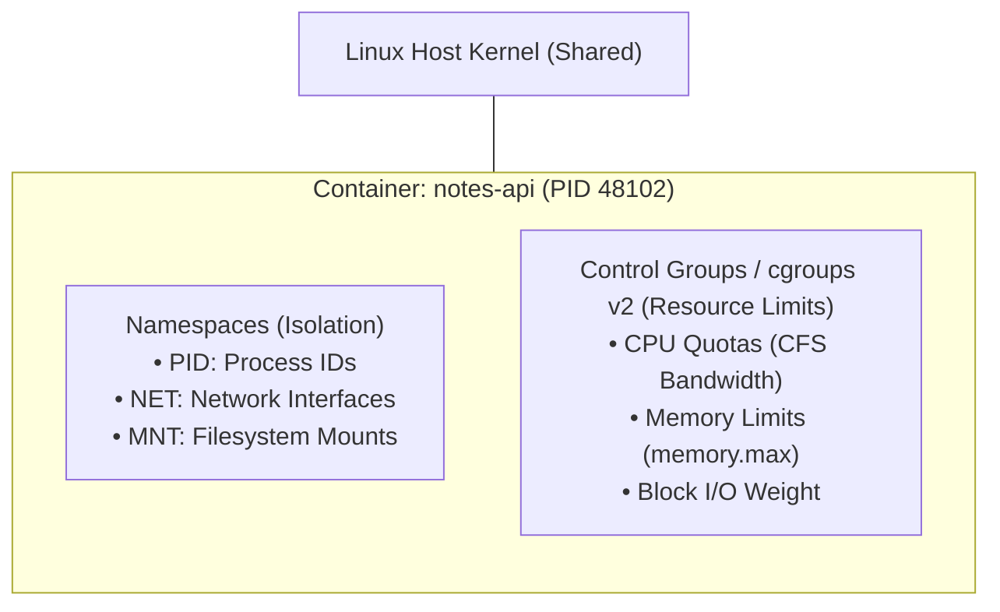
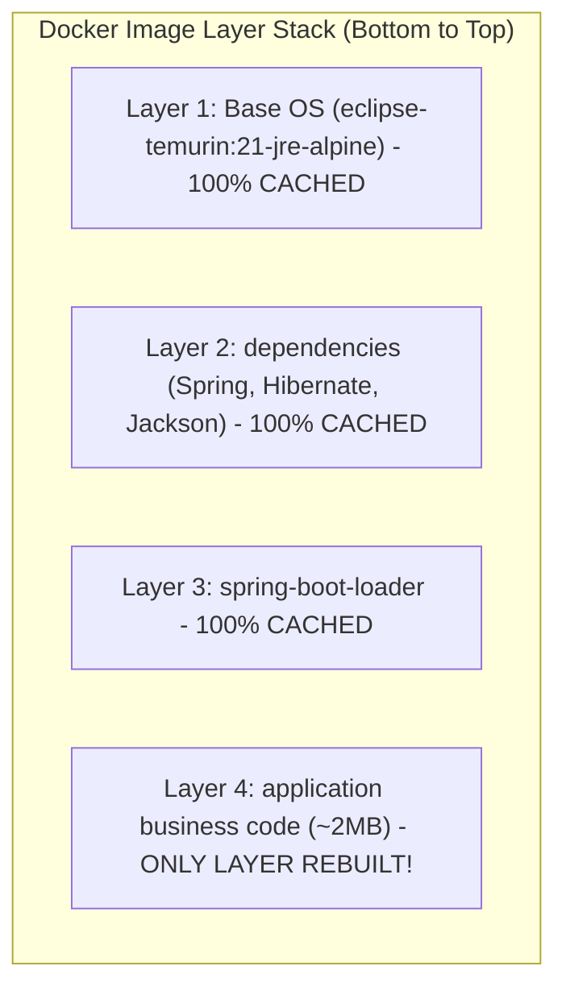
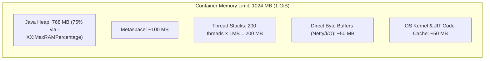
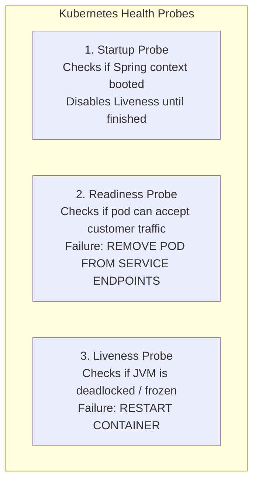
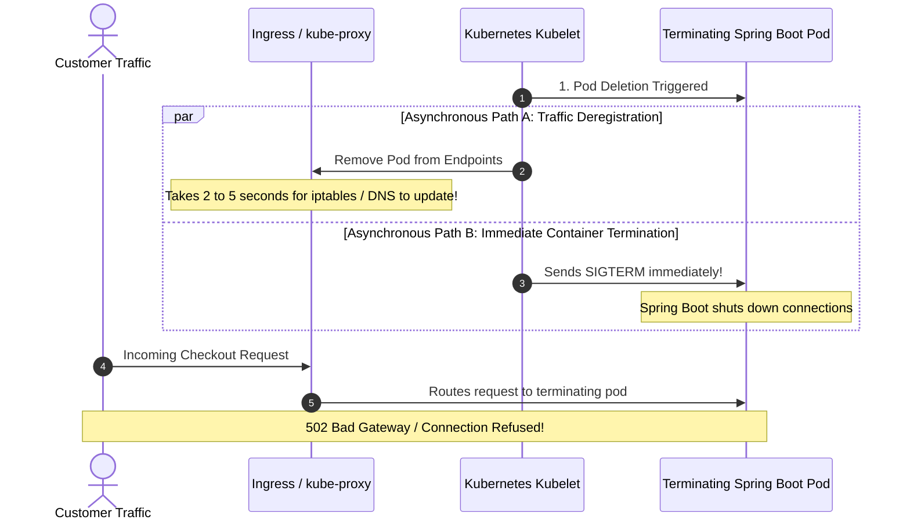

# Docker & Kubernetes Production Engineering

Containerization packages an application alongside its exact runtime dependencies, ensuring that software verified in local development runs identically in cloud staging and multi-node production clusters.

However, naive container setups for Spring Boot—such as running single-layer fat JARs as `root`, setting `-Xmx` equal to container memory limits, or binding liveness probes to database connections—cause hours of CI build delays, random kernel terminations (`Exit Code 137 OOMKilled`), and dropped customer requests during deployments.

---

## 1. Linux Container Internals: Namespaces & Cgroups

A Docker container is **not a lightweight virtual machine**. There is no guest operating system or hypervisor. A container is simply a standard Linux process running directly on the host kernel, constrained and isolated by two Linux kernel subsystems:



### 1.1 Namespaces (Isolation)
Namespaces provide isolation by restricting what a process can **see**:
- **PID Namespace**: Isolates process IDs. The container process thinks it is PID 1, but on the host machine it is PID 48102.
- **NET Namespace**: Provides an independent virtual network interface, IP address, and routing table.
- **MNT Namespace**: Mounts an isolated root filesystem, preventing the container from viewing host directories.

### 1.2 Control Groups (Resource Constraints)
Cgroups enforce how much hardware a process can **use**:
- **CPU Quota**: Enforced by the Completely Fair Scheduler (CFS). If a container is assigned `cpu: 500m`, the kernel gives the process 50ms of CPU runtime every 100ms CFS period.
- **Memory Limit (`memory.max`)**: When total physical memory used by all processes inside the cgroup exceeds this threshold, the kernel's Out-Of-Memory (OOM) Killer triggers immediately.

---

## 2. Production Multi-Stage Dockerfile with Layered JARs

A typical Spring Boot fat JAR is 60MB to 120MB. Over 90% of that payload consists of static, third-party libraries (`spring-boot-starter-web`, `hibernate-core`, `jackson-databind`). Your proprietary business code is usually under 2MB.

If you copy the fat JAR directly (`COPY target/app.jar app.jar`), Docker invalidates the layer cache on **every single commit**, forcing CI/CD to push 100MB over the network on every build.

### The Solution: Spring Boot Layered Extraction

Spring Boot includes `layertools`, which unpacks the fat JAR into 4 distinct physical layers ordered by change frequency:



### Production Multi-Stage Dockerfile (`Dockerfile`)

```dockerfile
# ==========================================
# STAGE 1: Extract JAR Layers
# ==========================================
FROM eclipse-temurin:21-jre-alpine AS extractor
WORKDIR /builder

ARG JAR_FILE=target/*.jar
COPY ${JAR_FILE} application.jar

# Spring Boot 3 layertools extraction command
RUN java -Djarmode=tools -jar application.jar extract --destination extracted

# ==========================================
# STAGE 2: Minimal, Hardened Runtime Image
# ==========================================
FROM eclipse-temurin:21-jre-alpine
WORKDIR /app

# Hardening Rule 1: Never run as root (UID 0) to prevent host kernel exploits
RUN addgroup -S spring && adduser -S spring -G spring
USER spring:spring

# Copy extracted layers in order of change frequency (Least frequent first)
COPY --from=extractor --chown=spring:spring /builder/extracted/dependencies/ ./
COPY --from=extractor --chown=spring:spring /builder/extracted/spring-boot-loader/ ./
COPY --from=extractor --chown=spring:spring /builder/extracted/snapshot-dependencies/ ./
COPY --from=extractor --chown=spring:spring /builder/extracted/application/ ./

# Expose service port
EXPOSE 8080

# Production JVM Container Flags
ENTRYPOINT ["java", \
  "-XX:+UseContainerSupport", \
  "-XX:MaxRAMPercentage=75.0", \
  "-XX:+ExitOnOutOfMemoryError", \
  "-Djava.security.egd=file:/dev/./urandom", \
  "org.springframework.boot.loader.launch.JarLauncher"]
```

---

## 3. JVM Container Memory Tuning & Eliminating OOMKills

When a container runs inside Kubernetes, the Linux kernel enforces hard memory limits via cgroups (`resources.limits.memory: 1Gi`).

### 3.1 The Exit Code 137 Mystery
When a process exceeds its cgroup memory limit, the Linux kernel terminates it with `SIGKILL` (signal 9):

$$\text{Exit Code} = 128 + \text{Signal Number} = 128 + 9 = 137$$

Because `SIGKILL` cannot be caught or handled by software, the JVM process dies instantly without generating a thread dump or `OutOfMemoryError` stack trace.

### 3.2 Total Process Memory Math
Total JVM process memory is **significantly larger** than the Java heap:

$$\text{Total Process Memory} = \text{Heap} + \text{Metaspace} + \text{Thread Stacks} + \text{Native Memory (Netty/Direct Buffers)} + \text{JIT Code Cache}$$



<Warning>
If your Kubernetes container memory limit is `1Gi` and you configure `-Xmx1024m`, your JVM heap alone claims 100% of the container allowance. As soon as the JVM allocates Metaspace, threads, or Netty direct byte buffers, total memory reaches ~1.3GB, and the Linux kernel triggers an immediate **Exit Code 137 OOMKill**!
</Warning>

### 3.3 The Production Formula
Configure Java to automatically adapt to container limits:
```text
-XX:+UseContainerSupport -XX:MaxRAMPercentage=75.0
```
This dynamically reserves 75% of container RAM for heap while leaving a generous 25% safety margin for thread stacks, Metaspace, and native memory allocations.

---

## 4. Kubernetes Health Probes: Liveness vs Readiness

Kubernetes relies on HTTP probes to manage the lifecycle of container pods:



### 4.1 The Fatal Liveness Probe Anti-Pattern
A widespread production disaster is pointing Kubernetes `livenessProbe` directly at `/actuator/health`:

```text
The Self-Inflicted Cascading Outage Scenario:
1. Under heavy load, PostgreSQL becomes slow or restarts.
2. Spring Boot's /actuator/health check marks the status DOWN because the database connection timed out.
3. The Kubernetes Liveness Probe detects DOWN and REBOOTS the container pod!
4. All 20 application pods reboot simultaneously.
5. While booting, all 20 pods hammer the database with new connection handshakes, keeping the database overloaded.
Result: The entire cluster enters an unrecoverable restart crash loop!
```

### 4.2 Production Standard: Dedicated Probes in Spring Boot 3
Spring Boot 3 natively exposes isolated probe endpoints:
- **Liveness Endpoint** (`/actuator/health/liveness`): Checks only internal JVM health (whether the application process is frozen or deadlocked). It **never checks external dependencies**.
- **Readiness Endpoint** (`/actuator/health/readiness`): Verifies whether the application is ready to receive network traffic (routing layer, database connectivity). If the database drops, readiness fails, causing Kubernetes to temporarily remove the pod from the Service load balancer without killing the container!

```yaml
# application.yml
management:
  endpoint:
    health:
      probes:
        enabled: true
  health:
    livenessstate:
      enabled: true
    readinessstate:
      enabled: true
```

---

## 5. Zero-Downtime Graceful Shutdown & The Dual-Path Race Condition

During a Kubernetes rolling deployment, updating a deployment creates a **dual-path race condition**:



### The Solution: `preStop` Sleep Hook + Graceful Shutdown

To eliminate dropped requests, combine Spring Boot graceful shutdown with a Kubernetes `preStop` lifecycle hook:

```yaml
# kubernetes-deployment.yml snippet:
spec:
  containers:
    - name: notes-api
      lifecycle:
        preStop:
          exec:
            command: ["/bin/sh", "-c", "sleep 15"]
```

```yaml
# application.yml
server:
  shutdown: graceful
spring:
  lifecycle:
    timeout-per-shutdown-phase: 30s
```

### Why This Guarantees Zero Dropped Requests:
1. When Kubernetes initiates pod termination, the `preStop` hook executes `sleep 15` **before** `SIGTERM` is delivered.
2. During these 15 seconds, Kubernetes updates `kube-proxy`, iptables, and ingress controllers, safely diverting all new customer traffic to other healthy pods.
3. After 15 seconds, zero new requests are arriving. Kubernetes delivers `SIGTERM`.
4. Spring Boot's graceful shutdown drains any remaining in-flight requests (allowing up to 30 seconds to finish) and cleanly closes database connections.

---

## 6. Complete Production Kubernetes Deployment Manifest

```yaml
apiVersion: apps/v1
kind: Deployment
metadata:
  name: notes-api
  labels:
    app: notes-api
spec:
  replicas: 3
  strategy:
    type: RollingUpdate
    rollingUpdate:
      maxSurge: 25%        # Create new pods before killing old ones
      maxUnavailable: 0     # Never drop below 100% capacity during deploy
  selector:
    matchLabels:
      app: notes-api
  template:
    metadata:
      labels:
        app: notes-api
    spec:
      terminationGracePeriodSeconds: 60 # Allow 15s preStop + 30s graceful shutdown + buffer
      containers:
        - name: notes-api
          image: ghcr.io/myorg/notes-api:1.4.0
          imagePullPolicy: IfNotPresent
          ports:
            - containerPort: 8080
          resources:
            requests:
              cpu: "500m"
              memory: "512Mi"
            limits:
              cpu: "1000m"
              memory: "1Gi"
          
          # Health Probes
          startupProbe:
            httpGet:
              path: /actuator/health/liveness
              port: 8080
            failureThreshold: 30
            periodSeconds: 2 # Give slow JVM cold starts up to 60s to boot
            
          livenessProbe:
            httpGet:
              path: /actuator/health/liveness
              port: 8080
            initialDelaySeconds: 10
            periodSeconds: 10
            failureThreshold: 3
            
          readinessProbe:
            httpGet:
              path: /actuator/health/readiness
              port: 8080
            initialDelaySeconds: 5
            periodSeconds: 5
            failureThreshold: 2
            
          # Zero-Downtime Traffic Drain Hook
          lifecycle:
            preStop:
              exec:
                command: ["/bin/sh", "-c", "sleep 15"]
```

---

## 7. Pod Disruption Budgets & Horizontal Autoscaling (HPA)

### 7.1 Pod Disruption Budget (PDB)
When cluster administrators perform node upgrades or maintenance drains, Kubernetes evicts pods from nodes. A **Pod Disruption Budget** prevents maintenance operations from taking down all your replicas at once:

```yaml
apiVersion: policy/v1
kind: PodDisruptionBudget
metadata:
  name: notes-api-pdb
spec:
  minAvailable: 2
  selector:
    matchLabels:
      app: notes-api
```

### 7.2 Horizontal Pod Autoscaler (HPA)

```yaml
apiVersion: autoscaling/v2
kind: HorizontalPodAutoscaler
metadata:
  name: notes-api-hpa
spec:
  scaleTargetRef:
    apiVersion: apps/v1
    kind: Deployment
    name: notes-api
  minReplicas: 3
  maxReplicas: 15
  metrics:
    - type: Resource
      resource:
        name: cpu
        target:
          type: Utilization
          averageUtilization: 70
```

---

## 8. Active Recall Interview Mastery

<AccordionGroup>
  <Accordion title="1. Why does an application crash with Exit Code 137 in Kubernetes? How do you fix it?">
    Exit Code 137 indicates that the Linux kernel terminated the process with `SIGKILL` ($128 + 9 = 137$) because the container exceeded its cgroup memory limit (`resources.limits.memory`). 
    
    This occurs when developers set `-Xmx` too close to the container limit. Process memory includes heap, Metaspace, thread stacks, direct byte buffers, and JIT code cache. 
    
    **The Fix**: Use `-XX:+UseContainerSupport` and `-XX:MaxRAMPercentage=75.0`. This dynamically restricts the Java heap to 75% of the container limit, preserving the remaining 25% for Metaspace, thread stacks, and OS overhead.
  </Accordion>

  <Accordion title="2. Why should you never point a Kubernetes livenessProbe at a database health check?">
    A liveness probe's failure action is to restart the container. 
    
    If the database experiences a momentary overload or brief network glitch, pointing the liveness probe at `/actuator/health` causes the probe to fail. Kubernetes will reboot all application pods simultaneously. When all pods reboot at once, they execute database startup connection pools and schema checks at the same time, worsening the database outage and causing a cluster-wide death spiral. Liveness probes should only check internal JVM responsiveness via `/actuator/health/liveness`.
  </Accordion>

  <Accordion title="3. Why is a preStop sleep hook necessary for zero-downtime rolling updates in Kubernetes?">
    During pod deletion, Kubernetes asynchronously updates network routing tables (iptables/kube-proxy) while sending `SIGTERM` to the container. 
    
    Because network propagation takes 2 to 5 seconds across nodes, ingress proxies continue sending customer HTTP requests to the terminating pod after `SIGTERM` has already been sent, causing `502 Bad Gateway` errors. A `preStop` hook executing `sleep 15` delays the `SIGTERM` signal, giving the network layer ample time to route traffic away before the application shuts down.
  </Accordion>

  <Accordion title="4. How do Spring Boot Layered JARs speed up Docker build and deployment pipelines?">
    Layered JARs unpack a fat JAR into separate physical layers: `dependencies`, `spring-boot-loader`, `snapshot-dependencies`, and `application`. 
    
    Because third-party dependencies rarely change, Docker caches the heavy ~100MB layer. On subsequent code commits, Docker only rebuilds the tiny ~2MB `application` layer. This cuts image build and CI registry upload times from minutes down to seconds while saving gigabytes of registry storage.
  </Accordion>

  <Accordion title="5. What is the difference between cpu requests and cpu limits in Kubernetes? What happens during a spike?">
    - `requests.cpu`: The guaranteed amount of CPU time allocated to the pod for scheduling onto a node.
    - `limits.cpu`: The hard ceiling enforced by the Linux Completely Fair Scheduler (CFS) bandwidth control.
    
    If a pod attempts to use more CPU than its limit, Linux **throttles** the process by withholding CPU cycles during the CFS period. The pod does not crash, but application latency spikes dramatically, causing timeouts and slow responses. Setting CPU limits too low is a common cause of mysterious p99 latency degradation.
  </Accordion>
</AccordionGroup>

---

## 9. Done Checklist

<Check>
Multi-stage Dockerfile unpacks layered JARs (`jarmode=tools`) for 90%+ CI layer cache hit rates.
</Check>
<Check>
Container executes as an unprivileged, non-root user (`USER spring:spring`).
</Check>
<Check>
JVM memory is dynamically governed by `-XX:+UseContainerSupport` and `-XX:MaxRAMPercentage=75.0` to eliminate Exit Code 137 OOMKills.
</Check>
<Check>
Kubernetes liveness probes use `/actuator/health/liveness` to avoid cascading restart loops on external dependency outages.
</Check>
<Check>
Rolling deployments use `maxUnavailable: 0` paired with `server.shutdown=graceful` and a `preStop: sleep 15` hook for zero dropped requests.
</Check>
<Check>
Pod Disruption Budgets (`minAvailable: 2`) protect critical services during node maintenance drains.
</Check>
