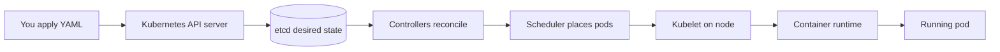
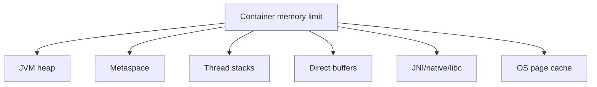

## Prerequisites: Before You Begin

You should already understand:

- Docker images and containers.
- Spring Boot Actuator health endpoints.
- Basic networking: IP, port, DNS, load balancing.
- JVM memory and thread behavior.
- CI/CD deployment basics.

---

# Phase 1: Ground Floor (What Kubernetes Really Controls)

Kubernetes is not your application. It is the control plane that keeps desired infrastructure state close to actual infrastructure state.



The core loop is reconciliation:

```markdown
desired state -> observe actual state -> calculate difference -> act -> repeat
```

If you say "run 4 replicas," Kubernetes keeps trying to make 4 matching pods exist. If one pod dies, a controller creates another.

---

# Phase 2: The Object Model

## Pod

A pod is the smallest deployable unit. It wraps one or more containers that share network namespace and can talk over `localhost`.

```yaml
apiVersion: v1
kind: Pod
metadata:
  name: orders-api
  labels:
    app: orders-api
spec:
  containers:
    - name: app
      image: ghcr.io/company/orders-api:2026.09.11
      ports:
        - containerPort: 8080
```

Important rule:

> You usually do not create pods directly for backend applications. You create Deployments, and the Deployment creates ReplicaSets, and the ReplicaSet creates Pods.

## Deployment

A Deployment manages rollout and replica count for stateless workloads.

```yaml
apiVersion: apps/v1
kind: Deployment
metadata:
  name: orders-api
spec:
  replicas: 4
  selector:
    matchLabels:
      app: orders-api
  strategy:
    type: RollingUpdate
    rollingUpdate:
      maxUnavailable: 0
      maxSurge: 1
  template:
    metadata:
      labels:
        app: orders-api
    spec:
      terminationGracePeriodSeconds: 45
      containers:
        - name: app
          image: ghcr.io/company/orders-api:2026.09.11
          ports:
            - containerPort: 8080
```

## Service

A Service gives stable networking to changing pods.

```yaml
apiVersion: v1
kind: Service
metadata:
  name: orders-api
spec:
  selector:
    app: orders-api
  ports:
    - name: http
      port: 80
      targetPort: 8080
```

The selector must match pod labels. If it does not, the Service has no endpoints.

```bash
kubectl get endpointslice -l kubernetes.io/service-name=orders-api
```

## Ingress

Ingress maps outside HTTP traffic to internal Services.

```yaml
apiVersion: networking.k8s.io/v1
kind: Ingress
metadata:
  name: orders-api
spec:
  rules:
    - host: api.example.com
      http:
        paths:
          - path: /orders
            pathType: Prefix
            backend:
              service:
                name: orders-api
                port:
                  number: 80
```

---

# Phase 3: Health Probes

Kubernetes has three major probes.

| Probe | Purpose | Failure result |
| --- | --- | --- |
| Startup | Gives slow apps time to boot. | container killed if startup never succeeds |
| Readiness | Decides whether pod should receive traffic. | pod removed from Service endpoints |
| Liveness | Decides whether container is stuck beyond recovery. | container restarted |

Spring Boot Actuator mapping:

```yaml
management:
  endpoint:
    health:
      probes:
        enabled: true
  health:
    readinessstate:
      enabled: true
    livenessstate:
      enabled: true
```

Kubernetes probe config:

```yaml
startupProbe:
  httpGet:
    path: /actuator/health/liveness
    port: 8080
  failureThreshold: 30
  periodSeconds: 10
readinessProbe:
  httpGet:
    path: /actuator/health/readiness
    port: 8080
  periodSeconds: 5
  timeoutSeconds: 2
  failureThreshold: 3
livenessProbe:
  httpGet:
    path: /actuator/health/liveness
    port: 8080
  periodSeconds: 10
  timeoutSeconds: 2
  failureThreshold: 6
```

Line-by-line probe reading:

- `startupProbe` answers "has the JVM finished booting yet?" While it is failing, Kubernetes suppresses liveness and readiness decisions for that container.
- `path: /actuator/health/liveness` should check process life, not database reachability.
- `failureThreshold: 30` with `periodSeconds: 10` gives a cold-start budget of about 300 seconds.
- `readinessProbe` answers "should Service endpoints route traffic here?"
- `timeoutSeconds: 2` prevents a stuck health endpoint from tying up kubelet probe workers.
- `failureThreshold: 3` means readiness changes after roughly three failed checks, not after the first brief hiccup.
- `livenessProbe` answers "should the container be restarted because it is wedged?"
- `failureThreshold: 6` deliberately makes liveness less sensitive than readiness. Remove traffic first; restart only when the process cannot recover.

Proof drill: block database access. Readiness may fail if your readiness group depends on the database, but liveness should stay up. If liveness fails because the database is down, Kubernetes will restart healthy pods into a worse outage.

<Warning>
A bad liveness probe can create a cascading outage. If the app is slow because the database is overloaded, killing pods may make the remaining pods receive more traffic and fail harder.
</Warning>

---

# Phase 4: Resource Requests, Limits & JVM Memory

Requests are scheduling promises. Limits are enforcement boundaries.

| Field | Meaning |
| --- | --- |
| CPU request | CPU amount scheduler assumes the pod needs. |
| CPU limit | CPU quota that can throttle the container. |
| Memory request | Memory amount scheduler reserves. |
| Memory limit | Hard cgroup boundary; crossing it can cause OOMKilled. |

```yaml
resources:
  requests:
    cpu: "500m"
    memory: "512Mi"
  limits:
    cpu: "2"
    memory: "1Gi"
```

For Spring Boot:

```yaml
env:
  - name: JAVA_TOOL_OPTIONS
    value: >-
      -XX:MaxRAMPercentage=75.0
      -XX:+ExitOnOutOfMemoryError
```

Line-by-line memory reading:

- `JAVA_TOOL_OPTIONS` is read by the JVM on startup, so the same container image can run with different memory policy per environment.
- `-XX:MaxRAMPercentage=75.0` sizes the maximum heap as a percentage of container-visible memory. It does not reserve memory for metaspace, stacks, direct buffers, or native libraries.
- `-XX:+ExitOnOutOfMemoryError` forces the JVM process to exit when it cannot recover from OOM. In Kubernetes, a clean process exit lets the pod restart instead of limping in a corrupted state.
- The proof is `kubectl top pod`, JVM Native Memory Tracking, and load tests under the real memory limit. A percentage value is a hypothesis until measured.

Why not give the heap 100% of container memory?



Heap is only one part of memory.

---

# Phase 5: HPA (Horizontal Pod Autoscaler)

HPA adds or removes pods based on metrics.

```yaml
apiVersion: autoscaling/v2
kind: HorizontalPodAutoscaler
metadata:
  name: orders-api
spec:
  scaleTargetRef:
    apiVersion: apps/v1
    kind: Deployment
    name: orders-api
  minReplicas: 4
  maxReplicas: 20
  metrics:
    - type: Resource
      resource:
        name: cpu
        target:
          type: Utilization
          averageUtilization: 65
```

Important mechanics:

- HPA is a periodic control loop, not an instant reaction.
- CPU utilization is based on CPU requests.
- If requests are wrong, scaling decisions are wrong.
- HPA cannot fix slow database queries if every new pod adds more database pressure.

Scaling trap:


---

# Phase 6: ConfigMap, Secret & Environment

ConfigMap:

```yaml
apiVersion: v1
kind: ConfigMap
metadata:
  name: orders-api-config
data:
  SPRING_PROFILES_ACTIVE: prod
  SERVER_SHUTDOWN: graceful
```

Secret:

```yaml
apiVersion: v1
kind: Secret
metadata:
  name: orders-api-secret
type: Opaque
stringData:
  DB_PASSWORD: change-me-in-real-secret-manager
```

Deployment usage:

```yaml
envFrom:
  - configMapRef:
      name: orders-api-config
  - secretRef:
      name: orders-api-secret
```

Rules:

- Do not put secrets in Git.
- Do not log environment variables.
- Rotate secrets with rollout plans.
- Prefer external secret managers for serious production.

---

# Phase 7: Volumes & Stateful Workloads

Most Spring Boot APIs should be stateless. Store durable state in databases, object storage, queues, and external systems.

Use volumes for:

- temporary files larger than memory,
- heap dumps,
- local cache with acceptable loss,
- stateful systems designed for Kubernetes storage.

Example heap dump volume:

```yaml
volumeMounts:
  - name: heap-dumps
    mountPath: /dumps
volumes:
  - name: heap-dumps
    emptyDir: {}
```

StatefulSet is for stable network identity and persistent storage. Do not casually run PostgreSQL in Kubernetes unless you have the operational maturity and operator support to handle backups, failover, storage, and upgrades.

---

# Phase 8: NetworkPolicy

By default, many clusters allow broad pod-to-pod traffic. NetworkPolicy lets you restrict traffic.

```yaml
apiVersion: networking.k8s.io/v1
kind: NetworkPolicy
metadata:
  name: allow-gateway-to-orders
spec:
  podSelector:
    matchLabels:
      app: orders-api
  policyTypes:
    - Ingress
  ingress:
    - from:
        - podSelector:
            matchLabels:
              app: api-gateway
      ports:
        - protocol: TCP
          port: 8080
```

Production rule:

> Authentication still matters. NetworkPolicy reduces network reachability; it does not prove caller identity at the application layer.

---

# Phase 9: Debugging Playbook

## CrashLoopBackOff

```bash
kubectl logs pod/orders-api-abc -n prod --previous
kubectl describe pod orders-api-abc -n prod
kubectl get events -n prod --sort-by=.lastTimestamp
```

| Evidence | Likely cause |
| --- | --- |
| `ConfigurationPropertiesBindException` | missing or invalid config |
| `OOMKilled` | memory limit exceeded |
| permission denied | non-root user cannot write |
| liveness failed | probe too aggressive |
| image pull error | registry or tag issue |

## Service Has No Traffic

```bash
kubectl describe svc orders-api -n prod
kubectl get pods -n prod --show-labels
kubectl get endpointslice -n prod -l kubernetes.io/service-name=orders-api
```

| Evidence | Cause |
| --- | --- |
| no endpoints | selector mismatch or readiness failure |
| endpoints exist, still failing | port mismatch, NetworkPolicy, ingress issue |
| endpoints flap | readiness endpoint unstable |

## Rollout Broken

```bash
kubectl rollout status deployment/orders-api -n prod
kubectl rollout history deployment/orders-api -n prod
kubectl rollout undo deployment/orders-api -n prod
```

Set a progress deadline:

```yaml
progressDeadlineSeconds: 300
```

---

# Phase 10: Senior Interview Ace

| Junior answer | Senior answer |
| --- | --- |
| "Kubernetes runs containers." | "Kubernetes reconciles desired state through controllers, scheduling pods onto nodes and using kubelet to keep containers running." |
| "Readiness and liveness are health checks." | "Readiness gates traffic; liveness restarts containers. Confusing them causes outages." |
| "HPA scales when CPU is high." | "HPA is a periodic controller using metrics relative to requests. It cannot solve shared bottlenecks like database saturation." |
| "A Service exposes pods." | "A Service selects pods by labels and routes to ready endpoints tracked by EndpointSlices." |
| "Use Secrets for passwords." | "Kubernetes Secrets are an API object, not a complete secret-management program. You still need access control, rotation, and log hygiene." |

## Practice Tasks

1. Deploy a Spring Boot app with readiness, liveness, and startup probes.
2. Break the Service selector and prove endpoints disappear.
3. Cause `CrashLoopBackOff` with a missing environment variable.
4. Tune memory so the JVM heap leaves room for native memory.
5. Add an HPA and explain why CPU requests matter.
6. Add a NetworkPolicy that only allows gateway-to-service traffic.
7. Perform a rollout and rollback.

## Done Checklist

- [ ] You can explain Pod, Deployment, ReplicaSet, Service, EndpointSlice, and Ingress.
- [ ] You can configure probes correctly for Spring Boot.
- [ ] You can explain requests, limits, OOMKilled, and CPU throttling.
- [ ] You can debug CrashLoopBackOff and 503 Service failures.
- [ ] You can explain why HPA can amplify database overload.
- [ ] You can perform safe rollout and rollback.
