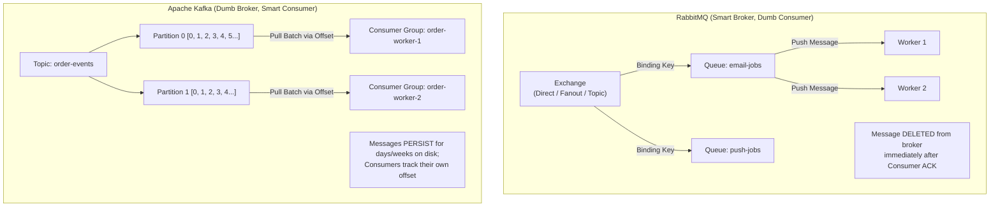
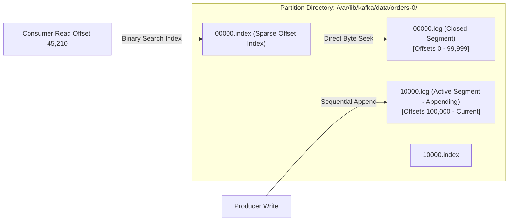
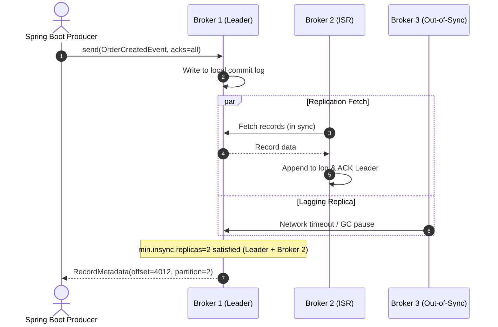
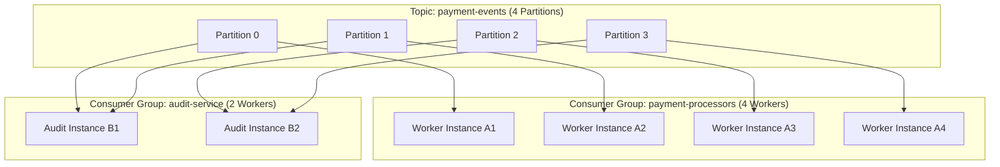
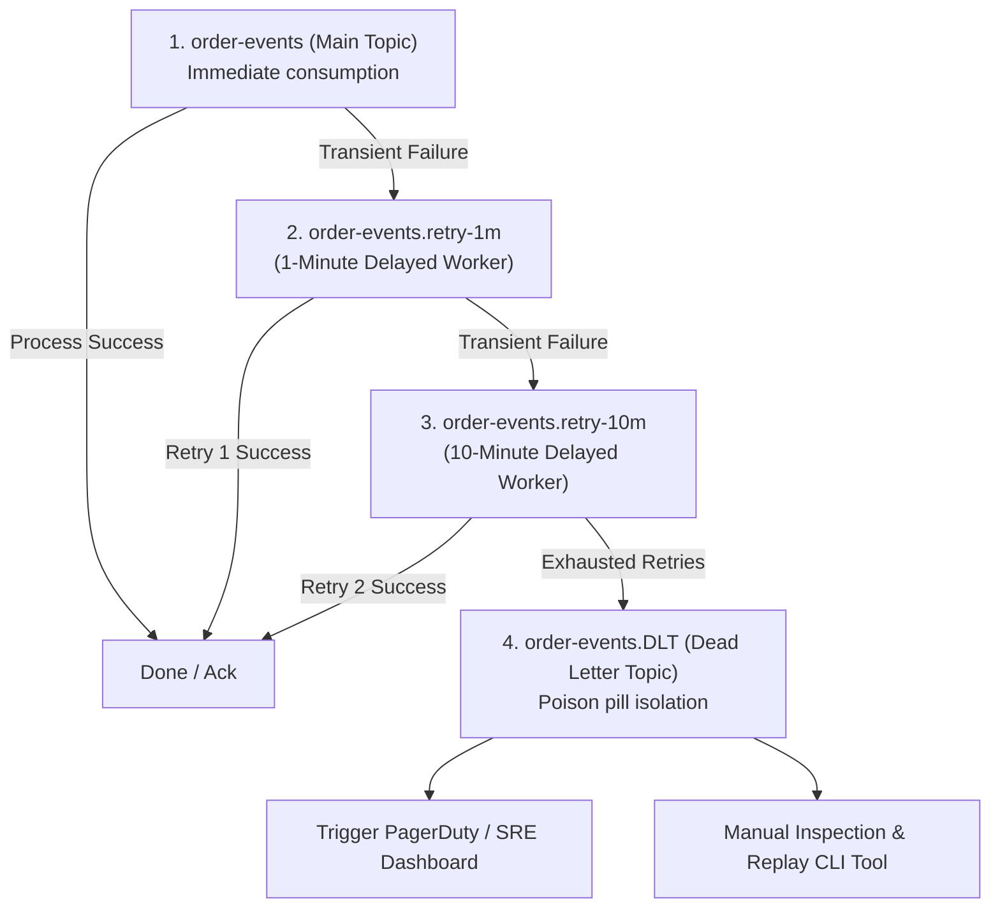

# Message Queues & Apache Kafka

In synchronous REST architectures, Service A makes an HTTP call to Service B and blocks while waiting for an answer. If Service B slows down, throws an error, or crashes, Service A holds its worker threads hostage. Within seconds, connection pools dry up, memory spikes, and cascading outages crash the entire platform.

Message queues and distributed event streaming platforms decouple services in **time** and **space**:
- **Decoupling in Time**: Service A publishes an event and finishes its request in under 5 milliseconds. Service B processes the event whenever it is ready—even hours later if Service B was temporarily offline for maintenance.
- **Decoupling in Space**: Service A does not know or care who consumes the event, what IP address Service B lives on, or how many subscribers exist.

---

## 1. RabbitMQ vs Apache Kafka: Architecture Comparison

Choosing between RabbitMQ and Kafka depends on whether your workload is a **transient task queue** or a **persistent distributed commit log**.



### Architectural Comparison Matrix

| Dimension | RabbitMQ (AMQP) | Apache Kafka |
| :--- | :--- | :--- |
| **Primary Mental Model** | Smart Broker, Dumb Consumer | Dumb Broker, Smart Consumer |
| **Data Structure** | In-memory queues (RAM-first, disk paging) | Append-only partitioned commit logs on disk |
| **Communication Model** | **Push-based**: Broker pushes messages to active workers | **Pull-based**: Consumers poll brokers for batches of messages |
| **Message Lifetime** | Deleted immediately after consumer acknowledgment | Retained on disk according to TTL policy (e.g. 7 days or infinite) |
| **Message Replay** | Not supported (once consumed, data is gone) | Fully supported; reset consumer offset to point in time and re-read |
| **Ordering Guarantee** | FIFO within a single queue | Strict FIFO **within a single partition only** |
| **Throughput Capacity** | 20,000 to 50,000 messages/sec per node | 1,000,000+ messages/sec across cluster partitions |
| **Routing Capability** | Complex routing (fanout, topic matching, headers) | Partition key hashing (`murmur2`) |
| **Ideal Production Use Case** | Async background jobs, email sending, RPC workflows | High-volume clickstreams, financial ledger audits, Event Sourcing, Sagas |

---

## 2. Kafka Storage Internals: Why Kafka Is Blazing Fast

A common myth is that writing to disk is slow compared to memory. Kafka proves that sequential disk I/O paired with modern operating system architecture is nearly as fast as raw RAM, while providing durable persistence.

### 2.1 The Append-Only Partition Log & Segments

In Kafka, every topic partition is physically represented as an append-only directory on the broker's filesystem. Inside that directory, the log is broken down into **Segments**:
- `00000000000000000000.log`: The raw binary data containing record payloads.
- `00000000000000000000.index`: Sparse index mapping message offsets to physical file byte offsets.
- `00000000000000000000.timeindex`: Sparse index mapping message timestamps to logical offsets.

When a segment reaches `log.segment.bytes` (default 1 GB) or `log.roll.hours` (default 7 days), Kafka rolls the segment, freezes it as read-only, and opens a fresh active segment for incoming writes.



Because Kafka **never modifies existing records** in place and only executes sequential appends at the tail of the active log, modern NVMe and SATA disks avoid costly random head seeks. Sequential disk writes routinely achieve 600+ MB/second.

### 2.2 The OS Page Cache & Zero-Copy Data Transfer

Traditional server applications read data from disk and send it over the network using 4 context switches and 3 memory buffer copies:

```console
Traditional File Transfer Path (Inefficient):
1. Disk -> OS Page Cache (DMA Copy)
2. OS Page Cache -> JVM User-Space Memory (CPU Copy & Context Switch)
3. JVM User-Space Memory -> OS Socket Buffer (CPU Copy & Context Switch)
4. OS Socket Buffer -> NIC Network Card Buffer (DMA Copy)
Total: 4 Context Switches + 3 Data Copies
```

Kafka bypasses the JVM heap entirely using the Linux `sendfile()` system call, known as **Zero-Copy**:

```mermaid
flowchart TD
    subgraph Traditional["1. Traditional Read & Network Write (3 Copies, 4 Context Switches)"]
        Disk1[(Disk)] -->|DMA Copy| PageCache1["OS Page Cache"]
        PageCache1 -->|CPU Copy| JVMHeap["JVM Heap Memory"]
        JVMHeap -->|CPU Copy| SocketBuf["OS Socket Buffer"]
        SocketBuf -->|DMA Copy| NIC1["NIC (Network Card)"]
    end

    subgraph ZeroCopy["2. Kafka Zero-Copy via sendfile() (0 CPU Copies, 2 Context Switches)"]
        Disk2[(Disk)] -->|DMA Copy| PageCache2["OS Page Cache"]
        PageCache2 -->|DMA Copy via Kernel Descriptor| NIC2["NIC (Network Card)"]
    end
```



By leveraging `sendfile()`:
1. Data moves directly from the OS Page Cache to the Network Interface Card (NIC) via Direct Memory Access (DMA).
2. The JVM heap never allocates byte buffers for outgoing records, eliminating Garbage Collection (GC) pauses entirely for data transfer.
3. If 10 consumer instances read the exact same message batch, the data is served directly out of the Linux OS Page Cache without a single read from physical disk.

---

## 3. Producer Architecture & Reliability Guarantees

Publishing messages safely requires configuring three interrelated settings: durability acknowledgments (`acks`), in-sync replica thresholds (`min.insync.replicas`), and idempotency.



### 3.1 Producer Acknowledgment Modes (`acks`)

- `acks=0`: The producer returns immediately after dispatching bytes to the socket buffer. If the broker crashes a millisecond later, the message is permanently lost. Used only for non-critical telemetry metrics.
- `acks=1`: The producer blocks until the partition leader broker writes the record to its local log. **Failure Hazard**: If the leader accepts the write and immediately suffers hardware failure before followers replicate it, the newly elected leader will not possess the record—causing silent data loss.
- `acks=all` (or `-1`): The producer blocks until the leader AND all current **In-Sync Replicas (ISR)** confirm write to disk.

<Warning>
Setting `acks=all` alone does not guarantee safety! If two follower brokers crash and only the leader remains in the ISR pool, `acks=all` will succeed with only 1 copy. You must set `min.insync.replicas=2` on the broker or topic. If the ISR drops below 2, the leader rejects new writes with `NotEnoughReplicasException`, rejecting writes that cannot meet the configured replica requirement. This does not protect against every correlated failure or unsafe leader-election setting.
</Warning>

### 3.2 The Idempotent Producer

When network glitches occur, a producer may retry sending a record that the broker actually wrote successfully. Naive brokers write the duplicate record twice.

Enabling `enable.idempotence=true` (the default in Spring Boot 3 / Kafka 3.0+) eliminates duplicates:
1. Every producer instance is assigned a unique 64-bit **Producer ID (PID)** by the broker upon connection.
2. Every record sent by the producer increments a 32-bit **Sequence Number** per topic partition.
3. The broker checks incoming sequence numbers against the highest recorded sequence for that PID:
   - If $\text{Seq}_{\text{new}} = \text{Seq}_{\text{last}} + 1$: The record is committed.
   - If $\text{Seq}_{\text{new}} \le \text{Seq}_{\text{last}}$: The record is acknowledged to the client but **discarded from the commit log**.
   - If $\text{Seq}_{\text{new}} > \text{Seq}_{\text{last}} + 1$: A gap exists (messages lost in transit); the broker rejects the batch with `OutOfOrderSequenceException`.

### 3.3 Partition Key Hashing & Strict Ordering

Kafka guarantees message ordering **only within a single partition**. Messages across different partitions can be processed in any arbitrary order.

To preserve strict lifecycle order for an entity (e.g. `OrderCreated` $\rightarrow$ `OrderPaid` $\rightarrow$ `OrderShipped`), pass the business entity ID as the **Partition Key**:

$$\text{Partition} = \text{toPositive}(\text{murmur2}(\text{key})) \pmod{\text{numPartitions}}$$

```java
// Spring Kafka Producer: Ensuring ordering per customer/order
kafkaTemplate.send("order-events", order.getOrderId().toString(), eventPayload);
```

With the same serializer and partitioner and an unchanged partition count, the same key maps to the same partition. Kafka orders records as appended there. Multiple producers, asynchronous processing, retry topics, key salting, and partition-count changes require separate ordering decisions.

---

## 4. Consumer Groups, Offsets & Rebalance Protocols

A **Consumer Group** coordinates a set of worker processes to divide and consume partitions in parallel.



### 4.1 The Golden Cardinality Rule of Kafka
- **One partition is consumed by at most one consumer instance within the same consumer group at any given time.**
- If you have 4 partitions and 6 consumer instances in the same group, **2 instances will sit idle**, consuming zero messages.
- To increase consumption concurrency, you must increase the partition count of the topic!

### 4.2 Offset Management & The Auto-Commit Trap

Consumers store their progress by committing **Offsets** to an internal, highly-compacted Kafka topic named `__consumer_offsets`.

The Kafka client defaults to auto-commit, while Spring Kafka listener containers normally disable it and manage commits. Auto-commit happens as the consumer polls; it is misleading to imagine a timer committing arbitrary in-flight synchronous processing independently of `poll()`.

The risky shape is: poll records, hand them to another thread, then poll again before that work finishes. Progress can be committed for work that later fails. Use `enable.auto.commit=false` and a clear completion boundary. `RECORD` and `BATCH` container acknowledgment modes are valid choices. This chapter uses `MANUAL_IMMEDIATE` to make **database commit before offset commit** explicit. See [Spring Kafka offset modes](https://docs.spring.io/spring-kafka/reference/3.3/kafka/receiving-messages/message-listener-container.html).

### 4.3 The Poll Loop & The Dreaded `CommitFailedException`

Kafka consumers operate an event loop driven by `poll(Duration timeout)`. The background heartbeat thread communicates with the group coordinator to prove liveness:

| Setting | Default Value | Purpose |
| :--- | :--- | :--- |
| `max.poll.interval.ms` | 300,000 ms (5 min) | Maximum time allowed between successive `poll()` invocations. |
| `max.poll.records` | 500 records | Maximum records returned in a single batch. |
| `heartbeat.interval.ms`| 3,000 ms | Frequency of liveness heartbeats sent to broker coordinator. |
| `session.timeout.ms` | 45,000 ms | Maximum time broker waits without receiving a heartbeat before declaring worker dead. |

<Alert type="warning">
**The `CommitFailedException` Trap**: If a batch of 500 records takes 5 minutes and 1 millisecond to process (e.g. slow database inserts or third-party HTTP timeouts), `max.poll.interval.ms` expires! The Kafka coordinator assumes the consumer thread has hung or deadlocked, evicts the consumer from the group, and triggers a violent cluster rebalance. When the consumer finally finishes and attempts to commit its offset, the broker rejects it with `CommitFailedException`.
</Alert>

**The Fix**:
1. Reduce `max.poll.records` to a small batch (e.g., 20 to 50 records).
2. Bound processing time with database and HTTP deadlines. Keep processing on the listener thread until you have designed partition ordering, backpressure, acknowledgments, and rebalance handling for asynchronous work. Virtual threads alone do not solve offset safety.

---

## 5. Non-Blocking Retry Topics & Dead-Letter Topic (DLT) Architecture

When a consumer encounters a temporary downstream failure (such as a database deadlock or a 503 from a payment gateway), naive implementations sleep and retry in place.

**In-place retries cause Head-of-Line Blocking**: While Worker 1 sleeps for 30 seconds retrying Order #501, 10,000 healthy orders behind Order #501 on Partition 2 are stuck waiting, driving consumer lag into the tens of thousands!

### 5.1 The Production Multi-Tier Retry Topic Topology

To achieve non-blocking retries, route failing records to dedicated delay topics with exponential backoff:



### 5.2 Short blocking retries followed by a DLT

The configuration below retries **in the listener container**, then publishes to a DLT. It does not create delay topics. Use this when short delays and the resulting partition stall fit your processing budget.

A DLT must have at least as many partitions as its source when routing to the same partition number. Configure compatible serializers for the recoverer; raw deserialization failures may require a `byte[]` serializer as well as the normal JSON serializer. See [Spring Kafka exception handling](https://docs.spring.io/spring-kafka/reference/3.3/kafka/annotation-error-handling.html).

```java
package com.example.infrastructure.kafka;

import org.apache.kafka.clients.consumer.ConsumerConfig;
import org.apache.kafka.common.TopicPartition;
import org.apache.kafka.common.serialization.StringDeserializer;
import org.springframework.beans.factory.annotation.Value;
import org.springframework.context.annotation.Bean;
import org.springframework.context.annotation.Configuration;
import org.springframework.kafka.annotation.EnableKafka;
import org.springframework.kafka.config.ConcurrentKafkaListenerContainerFactory;
import org.springframework.kafka.core.*;
import org.springframework.kafka.listener.ContainerProperties;
import org.springframework.kafka.listener.DeadLetterPublishingRecoverer;
import org.springframework.kafka.listener.DefaultErrorHandler;
import org.springframework.kafka.support.serializer.ErrorHandlingDeserializer;
import org.springframework.kafka.support.serializer.JsonDeserializer;
import org.springframework.util.backoff.FixedBackOff;

import java.util.HashMap;
import java.util.Map;

@Configuration
@EnableKafka
public class KafkaConsumerConfig {

    @Value("${spring.kafka.bootstrap-servers}")
    private String bootstrapServers;

    @Bean
    public DefaultErrorHandler kafkaErrorHandler(KafkaOperations<Object, Object> template) {
        // 1. Recoverer sends failed records to <topic_name>.DLT on the same partition index
        DeadLetterPublishingRecoverer recoverer = new DeadLetterPublishingRecoverer(
            template,
            (record, exception) -> new TopicPartition(record.topic() + ".DLT", record.partition())
        );

        // Do not declare recovery successful when publication fails.
        recoverer.setFailIfSendResultIsError(true);

        // Initial delivery + 2 retries, each delayed by 1 second.
        DefaultErrorHandler errorHandler = new DefaultErrorHandler(
                recoverer, new FixedBackOff(1000L, 2L));
        errorHandler.setCommitRecovered(true); // Required with MANUAL_IMMEDIATE

        // 3. Poison pill exceptions that should NEVER be retried (routed to DLT immediately)
        errorHandler.addNotRetryableExceptions(
            IllegalArgumentException.class,
            jakarta.validation.ValidationException.class,
            org.springframework.messaging.converter.MessageConversionException.class
        );

        return errorHandler;
    }

    @Bean
    public ConcurrentKafkaListenerContainerFactory<String, Object> kafkaListenerContainerFactory(
            ConsumerFactory<String, Object> consumerFactory,
            DefaultErrorHandler kafkaErrorHandler) {

        ConcurrentKafkaListenerContainerFactory<String, Object> factory =
                new ConcurrentKafkaListenerContainerFactory<>();
        factory.setConsumerFactory(consumerFactory);
        factory.setCommonErrorHandler(kafkaErrorHandler);
        
        // Manual immediate ACK: Acknowledge only after successful application processing
        factory.getContainerProperties().setAckMode(ContainerProperties.AckMode.MANUAL_IMMEDIATE);
        
        // Concurrency level: Number of consumer threads per container instance
        factory.setConcurrency(3);
        
        return factory;
    }
}
```

### 5.3 Longer delays with retry topics

For independent events, configure `@RetryableTopic` or `RetryTopicConfiguration` to create retry consumers. Later main-topic events can overtake a failed event. A stable partition key does **not** preserve business ordering after this handoff. See [Spring Kafka's retry-topic ordering warning](https://docs.spring.io/spring-kafka/reference/3.3/retrytopic/how-the-pattern-works.html).

```java
// Alternative listener configuration; do not also register the earlier listener.
@RetryableTopic(
    attempts = "4",
    backoff = @Backoff(delay = 1000, multiplier = 2.0),
    kafkaTemplate = "kafkaTemplate")
@KafkaListener(topics = "independent-notifications", groupId = "notification-workers")
public void receive(NotificationRequested event) {
    notificationService.recordDeliveryIntent(event);
}
```

Imports are `org.springframework.kafka.annotation.RetryableTopic` and `org.springframework.retry.annotation.Backoff`. This is a configuration shape; supply the event type, service, retry-topic infrastructure, and JSON serializers in the application. Use a separate consumer factory with `AckMode.RECORD` for this alternative. Nonblocking retry topics cannot be combined with Kafka container transactions; a local database service transaction is a separate boundary. See [supported retry configurations](https://docs.spring.io/spring-kafka/reference/3.3/retrytopic.html).


---

## 6. End-to-End Idempotent Consumer Implementation

In distributed systems, the network **will** occasionally drop an ACK packet, causing the broker to re-deliver an already processed record. Because Kafka provides **at-least-once delivery**, every production consumer must be strictly idempotent.

### 6.1 Database Deduplication Schema

```sql
CREATE TABLE processed_events (
    event_id UUID NOT NULL,
    topic VARCHAR(100) NOT NULL,
    consumer_group VARCHAR(100) NOT NULL,
    processed_at TIMESTAMP WITH TIME ZONE NOT NULL DEFAULT CURRENT_TIMESTAMP,
    PRIMARY KEY (consumer_group, event_id)
);

CREATE INDEX idx_processed_events_date ON processed_events(processed_at);
```

### 6.2 Commit the database before acknowledging Kafka

`@Transactional` commits after the annotated method returns. Calling `acknowledge()` inside that method can advance Kafka before the database commit fails. Use a transaction template so the commit finishes before control reaches the acknowledgment:

```java
package com.example.consumer;

import com.example.domain.order.OrderPaymentService;
import com.example.domain.order.event.OrderPaidEvent;
import org.springframework.jdbc.core.simple.JdbcClient;
import org.springframework.kafka.annotation.KafkaListener;
import org.springframework.kafka.support.Acknowledgment;
import org.springframework.stereotype.Component;
import org.springframework.transaction.PlatformTransactionManager;
import org.springframework.transaction.support.TransactionTemplate;

@Component
public class PaymentEventConsumer {
    private static final String GROUP = "payment-fulfillment-group";
    private final JdbcClient jdbc;
    private final OrderPaymentService paymentService;
    private final TransactionTemplate databaseTransaction;

    public PaymentEventConsumer(JdbcClient jdbc,
                                OrderPaymentService paymentService,
                                PlatformTransactionManager transactionManager) {
        this.jdbc = jdbc;
        this.paymentService = paymentService;
        this.databaseTransaction = new TransactionTemplate(transactionManager);
    }

    @KafkaListener(topics = "order-events", groupId = GROUP,
                   containerFactory = "kafkaListenerContainerFactory")
    public void onOrderPaid(OrderPaidEvent event, Acknowledgment ack) {
        databaseTransaction.executeWithoutResult(status -> {
            int inserted = jdbc.sql("""
                    INSERT INTO processed_events (event_id, topic, consumer_group)
                    VALUES (:id, :topic, :group)
                    ON CONFLICT (consumer_group, event_id) DO NOTHING
                    """)
                    .param("id", event.eventId())
                    .param("topic", "order-events")
                    .param("group", GROUP)
                    .update();

            if (inserted == 1) {
                // Local database changes using the SAME transaction manager.
                paymentService.fulfillPayment(event.orderId(), event.amountCents());
            }
        }); // Commit has succeeded here; failures propagate to the error handler.

        ack.acknowledge(); // Still on the consumer thread.
    }
}
```

This example assumes one database transaction manager, no outer listener transaction, and synchronous processing. If the application has multiple managers, qualify the database manager explicitly. `fulfillPayment` must join this transaction and must not call a remote payment provider. For external effects, insert an outbox intent here and use provider idempotency when delivering it.

A crash after database commit but before offset commit causes redelivery. The unique `(consumer_group, event_id)` key makes that redelivery a no-op for the same business handler. Do not catch every database integrity error as a duplicate: it may mean a different constraint failed, and PostgreSQL may already have aborted the transaction. See [Spring transaction-template semantics](https://docs.spring.io/spring-framework/reference/data-access/transaction/programmatic.html).

Prove the boundary with integration tests: fail the business write and assert no dedup row remains; deliver the same event twice and assert one business change; fail offset commit after the database commit and verify redelivery remains safe. The DLT smoke-test shape below does not establish those guarantees by itself.

---

## 7. Integration Testing with Spring Boot & Testcontainers Kafka

Never mock the Kafka broker in integration tests. In-memory mocks hide serialization bugs, partition assignment mismatches, and DLT routing failures. Use official Dockerized Kafka containers via **Testcontainers**:

```java
package com.example.consumer;

import com.example.domain.order.event.OrderPaidEvent;
import org.apache.kafka.clients.consumer.Consumer;
import org.apache.kafka.clients.consumer.ConsumerConfig;
import org.apache.kafka.clients.consumer.ConsumerRecord;
import org.apache.kafka.common.serialization.StringDeserializer;
import org.junit.jupiter.api.DisplayName;
import org.junit.jupiter.api.Test;
import org.springframework.beans.factory.annotation.Autowired;
import org.springframework.boot.test.context.SpringBootTest;
import org.springframework.boot.test.context.TestConfiguration;
import org.springframework.context.annotation.Bean;
import org.springframework.kafka.core.DefaultKafkaConsumerFactory;
import org.springframework.kafka.core.KafkaTemplate;
import org.springframework.test.context.DynamicPropertyRegistry;
import org.springframework.test.context.DynamicPropertySource;
import org.testcontainers.containers.PostgreSQLContainer;
import org.testcontainers.junit.jupiter.Container;
import org.testcontainers.junit.jupiter.Testcontainers;
import org.testcontainers.kafka.KafkaContainer;

import java.time.Duration;
import java.util.Collections;
import java.util.Map;
import java.util.UUID;
import java.util.concurrent.TimeUnit;

import static org.assertj.core.api.Assertions.assertThat;
import static org.awaitility.Awaitility.await;

@SpringBootTest
@Testcontainers
class PaymentEventConsumerIntegrationTest {

    @Container
    static KafkaContainer kafka = new KafkaContainer("apache/kafka-native:3.8.0");

    @Container
    static PostgreSQLContainer<?> postgres = new PostgreSQLContainer<>("postgres:16-alpine");

    @DynamicPropertySource
    static void configureProperties(DynamicPropertyRegistry registry) {
        registry.add("spring.kafka.bootstrap-servers", kafka::getBootstrapServers);
        registry.add("spring.datasource.url", postgres::getJdbcUrl);
        registry.add("spring.datasource.username", postgres::getUsername);
        registry.add("spring.datasource.password", postgres::getPassword);
    }

    @Autowired
    private KafkaTemplate<String, Object> kafkaTemplate;

    @Test
    @DisplayName("Poison pill record routes to Dead-Letter Topic (.DLT) after retries exhaust")
    void poisonedRecord_RoutesToDeadLetterTopic() {
        UUID eventId = UUID.randomUUID();
        // Negative amount triggers non-retryable IllegalArgumentException in domain service
        OrderPaidEvent poisonPill = new OrderPaidEvent(eventId, 999L, -5000L);

        kafkaTemplate.send("order-events", poisonPill.orderId().toString(), poisonPill);

        // Verify consumer for .DLT topic receives the poison pill
        Map<String, Object> consumerProps = Map.of(
            ConsumerConfig.BOOTSTRAP_SERVERS_CONFIG, kafka.getBootstrapServers(),
            ConsumerConfig.GROUP_ID_CONFIG, "test-dlt-verifier",
            ConsumerConfig.KEY_DESERIALIZER_CLASS_CONFIG, StringDeserializer.class,
            ConsumerConfig.VALUE_DESERIALIZER_CLASS_CONFIG, StringDeserializer.class,
            ConsumerConfig.AUTO_OFFSET_RESET_CONFIG, "earliest"
        );

        Consumer<String, String> dltConsumer = new DefaultKafkaConsumerFactory<String, String>(consumerProps)
                .createConsumer();
        dltConsumer.subscribe(Collections.singletonList("order-events.DLT"));

        await().atMost(10, TimeUnit.SECONDS).untilAsserted(() -> {
            var records = dltConsumer.poll(Duration.ofMillis(200));
            assertThat(records.count()).isGreaterThanOrEqualTo(1);
            ConsumerRecord<String, String> record = records.iterator().next();
            assertThat(record.value()).contains(eventId.toString());
        });

        dltConsumer.close();
    }
}
```

---

## 8. Production Failure Modes & Operational Runbook

### 8.1 Consumer Lag Explosion
- **Symptom**: Prometheus alert fires: `kafka_consumer_group_lag > 50000`. Downstream users experience delayed notifications and order processing.
- **Root Causes**:
  1. Downstream database or API latency spiked from 10ms to 800ms.
  2. A sudden burst of marketing traffic overloaded partition throughput.
  3. Consumer workers are deadlocked or pinned in GC pauses.
- **Runbook Remediation**:
  1. Inspect consumer lag per partition using the CLI:
     ```bash
     kafka-consumer-groups.sh --bootstrap-server kafka:9092 \
       --describe --group payment-fulfillment-group
     ```
  2. If all lag is concentrated on **one single partition**, a hot key (e.g. `orderId = null` or celebrity merchant ID) is bottlenecking a single worker. First decide whether per-key order is required. Salting a key splits its records across partitions and breaks that order; use it only when the business operation supports independent processing.
  3. If lag is distributed evenly across all partitions:
     - Check if consumer count is less than partition count. If so, scale the total number of consumer threads toward the partition count, accounting for each pod’s configured concurrency.
     - If consumer pods already match partition count, increase topic partitions dynamically (requires caution regarding key hashing) or redesign the workload after proving safe offset and ordering behavior.

### 8.2 The Rebalance Storm
- **Symptom**: Consumers spend 80% of their CPU cycles rebalancing instead of processing records. Log outputs repeat: `Member ... has been evicted from group ... due to max.poll.interval.ms timeout`.
- **Root Cause**: A worker encountered a record that took 6 minutes to process, exceeding `max.poll.interval.ms` (5 minutes). The coordinator declared the worker dead and triggered a rebalance. The worker completed, re-joined the group, triggering another rebalance.
- **Remediation**:
  1. Switch consumer partition assignment strategy to the cooperative incremental protocol:
     ```properties
     spring.kafka.consumer.properties.partition.assignment.strategy=org.apache.kafka.clients.consumer.CooperativeStickyAssignor
     ```
     `CooperativeStickyAssignor` only reassigns the specific affected partition without stopping consumption on all other healthy workers (eliminating "Stop-The-World" consumer rebalances).
  2. Drastically decrease `max.poll.records` from 500 down to 25.

---

## 9. Active Recall Interview Mastery

<AccordionGroup>
  <Accordion title="1. How does Kafka achieve high write and read throughput despite persisting all data to disk?">
    Kafka leverages three fundamental operating system and architecture optimizations:
    1. **Sequential I/O**: Kafka appends writes to the tail of immutable segment files on disk, avoiding random disk head seeks. Sequential disk writes match or exceed sequential memory writes.
    2. **Zero-Copy Data Transfer (`sendfile`)**: When transferring data to network consumers, the Linux kernel transfers bytes directly from the OS Page Cache to the Network Interface Card (NIC) via Direct Memory Access (DMA), bypassing the JVM heap and user space completely.
    3. **Batching and Compression**: Producers batch multiple records together before dispatch (`linger.ms` and `batch.size`) and compress them using algorithms like Snappy or Zstandard, drastically amortizing network packet overhead.
  </Accordion>

  <Accordion title="2. What is the difference between acks=1 and acks=all? What disastrous failure can occur with acks=1?">
    With `acks=1`, the partition leader acknowledges the write immediately after appending to its local commit log without waiting for followers. 
    
    **The Disaster**: If the leader sends the acknowledgment back to the producer and immediately dies (due to a power outage or hardware kernel panic) before follower replicas have fetched the new offset, the remaining replicas will elect a new leader that **does not possess that message**. The message is permanently lost, even though the producer was told the write was successful.
    
    With `acks=all`, acknowledgments wait for the current in-sync replicas, and `min.insync.replicas=2` rejects writes when too few replicas are available. Replication acknowledgments do not mean an `fsync` for every record. Durability also depends on replica failures and leader election. See [Kafka replication design](https://kafka.apache.org/38/design/design/).
  </Accordion>

  <Accordion title="3. What happens if you have 8 partitions in a Kafka topic and 12 consumer instances in the same consumer group?">
    Only **8 consumer instances** will actively receive and process messages. Exactly one partition is assigned to at most one consumer instance within a single consumer group. The remaining **4 consumer instances will sit completely idle** in standby mode. They only activate if one of the 8 active instances crashes or disconnects.
  </Accordion>

  <Accordion title="4. When should you use blocking retries or retry topics?">
    In-place sleeping causes **Head-of-Line Blocking**. Because a consumer reads messages from a partition in strict sequential order, pausing the consumer thread to retry a failing message prevents all subsequent healthy messages on that partition from being processed. 
    
    If processing prevents polling within `max.poll.interval.ms`, the consumer can lose its assignment. Short bounded retries are reasonable when order matters. Retry topics allow the main partition to progress during long delays, but later events can overtake failed ones.
  </Accordion>

  <Accordion title="5. How does Kafka guarantee idempotency at the Producer level?">
    When `enable.idempotence=true` is set, the broker assigns each producer a unique 64-bit Producer ID (PID). For every topic partition, the producer tags records with monotonically increasing sequence numbers (0, 1, 2...). 
    
    The broker stores the highest committed sequence number per PID. If network instability causes the producer to resend a batch, the broker detects that the sequence number has already been written, acknowledges the write to the producer, but does not append a duplicate entry into the commit log.
  </Accordion>
</AccordionGroup>

---

## 10. Done Checklist

<Check>
Configured `acks=all` paired with `min.insync.replicas=2` and `enable.idempotence=true` on all production event producers.
</Check>
<Check>
Partition keys are assigned to all domain events requiring strict sequential processing order.
</Check>
<Check>
Auto-commit is disabled (`enable.auto.commit=false`), and manual immediate acknowledgment (`AckMode.MANUAL_IMMEDIATE`) is executed only after local database transactions commit.
</Check>
<Check>
Consumer partitions use `CooperativeStickyAssignor` to eliminate stop-the-world rebalance storms.
</Check>
<Check>
Choose short blocking retries with `DefaultErrorHandler`, or retry topics with their ordering trade-off. Test DLT publication failure and offset recovery.
</Check>
<Check>
Consumers implement an atomic database deduplication check to enforce idempotency against duplicate at-least-once message deliveries.
</Check>
