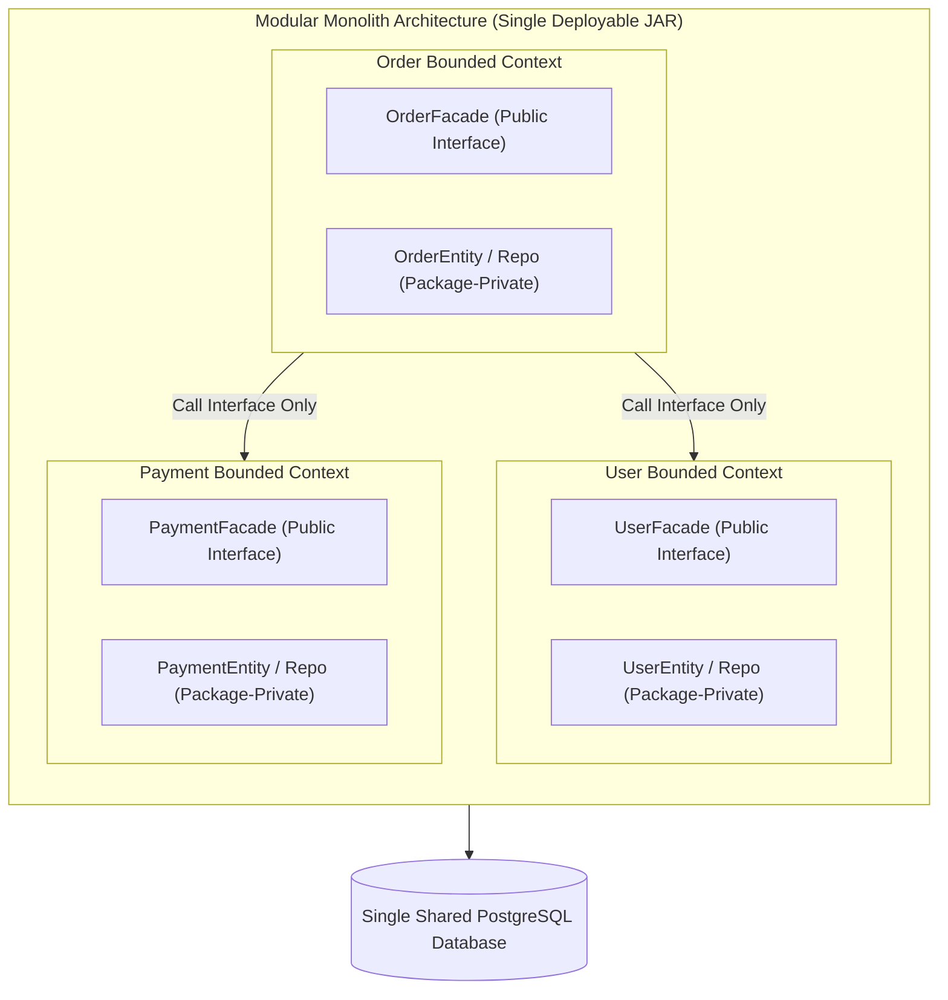
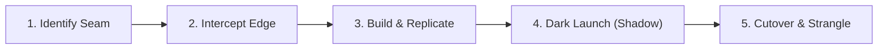
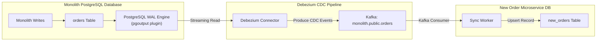
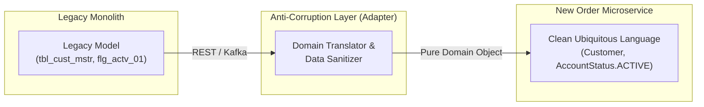

# Monolith to Microservices Migration

Decomposing a monolith into microservices is not an engineering status symbol—it is an architectural and organizational trade-off. 

According to **Conway's Law**, organizations design systems that mirror their communication structures. When an engineering organization grows past 50 to 100 developers, a single monolithic codebase creates team coordination bottlenecks: merge conflict gridlock, slow CI/CD test suites (taking 45+ minutes per build), and high blast radiuses where a bug in a billing module crashes the user catalog.

However, migrating prematurely or without disciplined bounded contexts guarantees the worst architectural failure in software engineering: the **Distributed Monolith**.

---

## 1. The Non-Negotiable Prerequisite: The Modular Monolith

Never attempt to decompose a "Big Ball of Mud" directly into microservices. If your code lacks internal boundaries inside a single JVM process, distributing it across network boundaries will amplify your problems by orders of magnitude.



### The 4 Rules of a Modular Monolith
1. **Package-Private Encapsulation**: Domain entities, JPA repositories, and internal services must use Java `default` (package-private) visibility. Other modules cannot import them.
2. **Public Facade APIs**: Modules communicate exclusively through clean Java interfaces (e.g. `UserFacade`, `InventoryFacade`) that accept and return immutable DTOs/Records.
3. **No Cross-Context Database Joins**: Never execute SQL joins across tables belonging to different bounded contexts, even though they reside in the same physical database.
4. **Automated Architectural Guardrails**: Enforce modular isolation in CI/CD using **Spring Modulith** or **ArchUnit** tests to prevent accidental coupling.

---

## 2. The Strangler Fig Pattern: Zero-Downtime Incremental Extraction

Named after Australian strangler fig vines that seed in the upper branches of a host tree, slowly envelop the trunk, and eventually replace the original tree, the **Strangler Fig Pattern** incrementally replaces monolithic functionality route-by-route without a risky "Big Bang" rewrite.

```mermaid
flowchart TD
    Client["Client Devices / Frontend Apps"] --> Edge["API Gateway / Envoy Reverse Proxy"]
    
    subgraph EdgeRouting["Gateway Path Routing"]
        Edge -->|/api/v1/notifications/* (Extracted)| NewService["Notification Microservice\n(New Database)"]
        Edge -->|/api/v1/* (Remaining Monolith Traffic)| Monolith["Legacy Monolith\n(Orders, Users, Billing)"]
    end
```

### The 5 Phases of Service Extraction



<AccordionGroup>
  <Accordion title="Phase 1: Identify the Seam (Domain Boundary)">
    Select a peripheral module with minimal inward dependencies. 
    - **Ideal First Candidates**: Notification services, PDF invoice generation, or read-only reporting endpoints.
    - **Poor First Candidates**: Core transactional engines (e.g., Ledger or Inventory Reservation) that are tightly coupled to dozens of database tables.
  </Accordion>

  <Accordion title="Phase 2: Intercept at the Perimeter (API Gateway)">
    Place an API Gateway (Spring Cloud Gateway, Envoy, or Nginx) in front of the production monolith. Route 100% of traffic through the gateway to the monolith. The clients now talk to the gateway URL rather than monolith hostnames.
  </Accordion>

  <Accordion title="Phase 3: Build the Microservice & Sync Data">
    Develop the new microservice with its own private database. Use Change Data Capture (CDC) with Debezium to continuously stream historical and real-time updates from the monolith database to the new service database.
  </Accordion>

  <Accordion title="Phase 4: Dark Launching & Traffic Shadowing">
    Configure the API Gateway to duplicate production traffic (shadowing). The gateway forwards incoming requests to both the monolith and the new microservice, but only returns the monolith's response to the client. Verify that the new microservice produces identical output, latency, and error profiles.
  </Accordion>

  <Accordion title="Phase 5: Cutover & Monolith Code Deletion">
    Shift 100% of live traffic for the extracted endpoints to the new microservice. Once stable in production, permanently delete the obsolete Java code and dropped tables from the monolith.
  </Accordion>
</AccordionGroup>

---

## 3. Database Decomposition Without Downtime

The single most challenging aspect of microservice migration is splitting a shared relational database.

### 3.1 Step 1: Breaking Physical Foreign Keys

In the monolith, `orders` has a hard foreign key constraint referencing `users(id)`:

```sql
-- MONOLITH SCHEMA:
CREATE TABLE orders (
    id BIGSERIAL PRIMARY KEY,
    user_id BIGINT NOT NULL REFERENCES users(id), -- Hard Foreign Key Constraint
    total_cents BIGINT NOT NULL
);
```

Before moving `orders` to a separate database, you must drop the physical constraint and enforce relational integrity inside application logic:

```sql
-- Step 1: Drop physical constraint in monolith DB
ALTER TABLE orders DROP CONSTRAINT fk_orders_users;
```

In the Java domain layer, change entity relationships from JPA entity references to scalar ID references:

```java
// BEFORE (Monolith JPA Entity with Object Association):
@Entity
public class Order {
    @ManyToOne(fetch = FetchType.LAZY)
    @JoinColumn(name = "user_id")
    private User user; // Hard entity coupling!
}

// AFTER (Microservice Domain Model with Soft Reference):
@Entity
public class Order {
    @Column(name = "user_id", nullable = false)
    private Long userId; // Loose coupling via scalar identifier
}
```

### 3.2 Step 2: Zero-Downtime Data Migration via CDC (Change Data Capture)

Never rely on dual-writing from application code during database migration. Application dual-writes suffer from network latency amplification, partial write failures, and out-of-order race conditions.

Use **PostgreSQL Logical Replication** and **Debezium** to stream database changes directly from the Write-Ahead Log (WAL):



### 3.3 The 4-Step Cutover Sequence
1. **Initial Snapshot**: Debezium performs an initial snapshot read of all historical rows from the monolith `orders` table.
2. **Continuous Streaming**: Debezium captures all incoming inserts, updates, and deletes from the WAL and replicates them to the new database in sub-50 milliseconds.
3. **Replication Lag Verification**: Monitor replication lag using Prometheus. When lag remains under 10 milliseconds during peak traffic, proceed to cutover.
4. **Cutover Window**:
   - Briefly switch the monolith's order endpoint to read-only mode for 2 seconds.
   - Wait for Debezium lag to hit 0.
   - Switch the API Gateway route to point all order writes directly to the new `OrderMicroservice`.

---

## 4. The Anti-Corruption Layer (ACL) Pattern

When extracting a new microservice, the legacy monolith's data model is often messy, filled with technical debt, historical naming quirks, and denormalized columns.

Do not let legacy domain models pollute your new microservice! Implement an **Anti-Corruption Layer (ACL)**:



### Production Spring Boot Anti-Corruption Layer

```java
package com.example.order.infrastructure.acl;

import com.example.order.domain.Customer;
import com.example.order.domain.CustomerStatus;
import org.springframework.stereotype.Component;
import org.springframework.web.client.RestClient;

@Component
public class LegacyCustomerAdapter {

    private final RestClient restClient;

    public LegacyCustomerAdapter(RestClient.Builder builder) {
        this.restClient = builder.baseUrl("http://legacy-monolith/internal-api").build();
    }

    // Monolith's legacy DTO with technical debt
    public record LegacyCustomerRecord(
        Long cust_id,
        String first_nm,
        String last_nm,
        String is_actv_flg, // "Y" or "N"
        String email_addr_txt
    ) {}

    // Translates legacy dirty model into pristine domain entity
    public Customer fetchCustomer(Long customerId) {
        LegacyCustomerRecord legacy = restClient.get()
            .uri("/customers/{id}", customerId)
            .retrieve()
            .body(LegacyCustomerRecord.class);

        if (legacy == null) {
            throw new IllegalArgumentException("Customer not found: " + customerId);
        }

        // Translation logic inside ACL
        CustomerStatus status = "Y".equalsIgnoreCase(legacy.is_actv_flg()) 
                ? CustomerStatus.ACTIVE 
                : CustomerStatus.SUSPENDED;

        String fullName = legacy.first_nm() + " " + legacy.last_nm();

        return new Customer(
            legacy.cust_id(),
            fullName,
            legacy.email_addr_txt(),
            status
        );
    }
}
```

---

## 5. Production Traffic Shadowing (Dark Launching)

Before routing live user traffic to your extracted microservice, run it in **Shadow Mode** using an Envoy or Nginx reverse proxy. 

Traffic shadowing clones incoming HTTP POST/GET requests and asynchronously replays them against the new service without impacting client response times:

```yaml
# Envoy Gateway Route Configuration with Traffic Mirroring:
routes:
  - match:
      prefix: "/api/v1/orders"
    route:
      cluster: monolith_service # Live primary response
      request_mirror_policies:
        - cluster: new_order_microservice # Shadow copy
          runtime_fraction:
            default_value:
              numerator: 100 # Mirror 100% of production traffic
              denominator: HUNDRED
```

### What to Validate During Shadowing
- **Response Parity**: Do responses from both systems return identical HTTP status codes and JSON response bodies?
- **Database Performance**: Does the new microservice's PostgreSQL database experience unexpected sequential scans or connection pool saturation?
- **Resource Consumption**: Does JVM memory or CPU spike unexpectedly under peak production load?

---

## 6. Active Recall Interview Mastery

<AccordionGroup>
  <Accordion title="1. What is the Strangler Fig pattern, and why is it preferred over a Big Bang rewrite?">
    The Strangler Fig pattern is an incremental migration strategy where specific endpoints of a legacy monolith are gradually intercepted by an API Gateway and routed to new microservices. 
    
    It is preferred over a Big Bang rewrite because Big Bang rewrites frequently fail: they take years to build, requirements drift during development, and the cutover carries catastrophic risk. The Strangler Fig pattern delivers continuous business value, allows rollback per route, and keeps the production system operational throughout the multi-year migration.
  </Accordion>

  <Accordion title="2. Why is dual-writing from application code an anti-pattern when splitting databases?">
    Dual-writing from application code (e.g., writing to Monolith DB and New DB in the same HTTP request) violates distributed transaction safety. 
    
    If the first write succeeds and the second fails (due to network timeout or database deadlock), the data enters a desynchronized split-brain state. Furthermore, concurrent updates can arrive out of order at the second database, overwriting newer data with older data. The standard approach is Change Data Capture (CDC) via the database Write-Ahead Log (WAL), which preserves strict transaction ordering and durability.
  </Accordion>

  <Accordion title="3. What is an Anti-Corruption Layer (ACL), and where does it sit?">
    An Anti-Corruption Layer (ACL) is a Domain-Driven Design (DDD) architectural pattern that sits between a new microservice and a legacy system. 
    
    It acts as a bidirectional translator that maps the legacy system's dirty schemas, ambiguous field names, and obsolete protocols into clean, modern domain models. This ensures that technical debt from the legacy monolith does not leak into and compromise the new microservice's architecture.
  </Accordion>

  <Accordion title="4. How do you handle cross-module database joins during the intermediate stages of a migration?">
    During intermediate stages, cross-module joins are eliminated using two primary techniques:
    1. **CQRS Read Projections**: Services publish domain events over Kafka; a dedicated projection service denormalizes and stores pre-joined views of the data in an optimized read store.
    2. **API Gateway / Backend-for-Frontend (BFF) Aggregation**: The gateway executes parallel non-blocking HTTP requests to the individual services and stitches together the final JSON response before delivering it to the client.
  </Accordion>

  <Accordion title="5. What are the key indicators that a team is building a 'Distributed Monolith'?">
    Key indicators include:
    - Microservices sharing a single physical PostgreSQL database and querying each other's tables directly.
    - Deep synchronous REST call chains (Service A calls B, which calls C, which calls D) where one failure cascades through all services.
    - Lockstep deployments where deploying Service A requires simultaneous deployments of Services B and C to prevent outages.
    - High coordination overhead where independent teams cannot release features without extensive cross-team meetings.
  </Accordion>
</AccordionGroup>

---

## 7. Done Checklist

<Check>
The monolithic application is organized into a clean Modular Monolith with package-private domain classes before extracting services.
</Check>
<Check>
Cross-context physical foreign keys in PostgreSQL have been removed and replaced with loose scalar ID references.
</Check>
<Check>
An API Gateway intercepts perimeter traffic and routes requests using the Strangler Fig pattern.
</Check>
<Check>
Database synchronization uses Change Data Capture (CDC) with Debezium instead of risky application-level dual writes.
</Check>
<Check>
New microservices employ an Anti-Corruption Layer (ACL) to insulate domain models from legacy monolithic schemas.
</Check>
<Check>
Traffic shadowing (dark launching) is performed via reverse proxy mirroring before live production cutover.
</Check>
