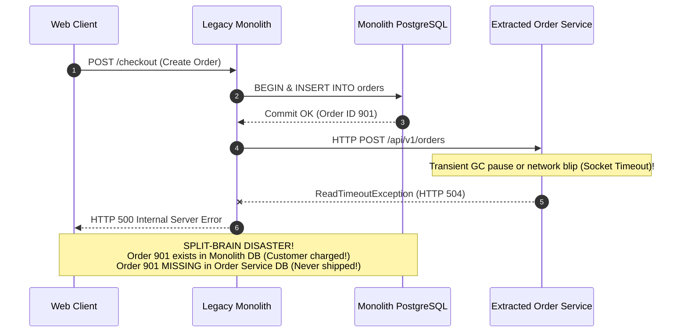
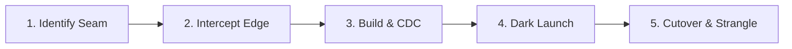
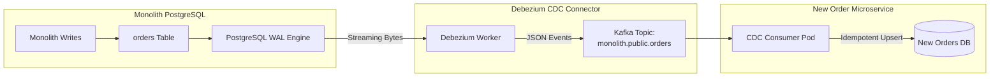
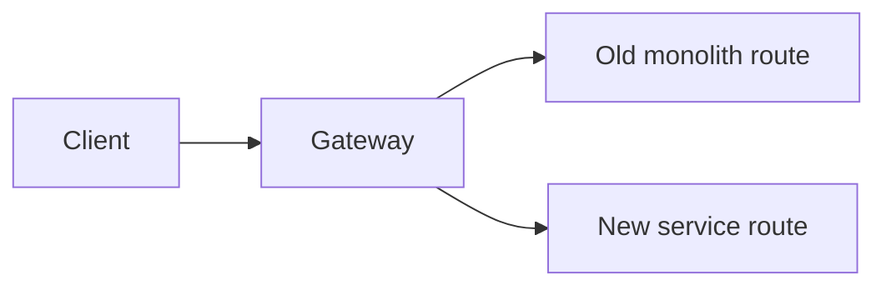

# Monolith to Microservices Migration

Decomposing a monolith into microservices is not an engineering status symbol—it is an architectural and organizational trade-off. 

According to **Conway's Law**, organizations design systems that mirror their internal communication structures. When an engineering organization grows beyond 50 to 100 developers, a single monolithic codebase creates organizational gridlock: merge conflict friction, 45-minute CI/CD build queues, and blast radiuses where a bug in an analytics report crashes customer checkouts.

However, migrating prematurely or without disciplined bounded contexts creates the most disastrous architecture in software engineering: the **Distributed Monolith**.

---

## Phase 1: Ground Floor (Physical First Principles & The Latency Penalty)

Before splitting services across network boundaries, an architect must confront the physical laws of compute and network latency.

```mermaid
graph LR
    subgraph InProcess ["In-Process Method Call (Monolith)"]
        CPU["CPU Core"] -->|0.5 - 2.0 ns<br/>(Register Jump / L1 Cache)| MEM["JVM Heap RAM"]
    end

    subgraph CrossNetwork ["Remote Network Call (Microservice)"]
        JVM1["Service A"] -->|TCP Handshake + TLS + Wire + Kernel Sockets<br/>2,000,000 - 10,000,000 ns (2 - 10 ms)| JVM2["Service B"]
    end
```

### The 5,000,000x Network Latency Penalty
- **In a Monolith**: Invoking `orderService.calculateTotal(cart)` is an in-memory method call. The CPU executes a register jump or vtable resolution in **0.5 to 2 nanoseconds**.
- **Across Microservices**: Invoking that same calculation across a network requires:
  1. Serializing Java objects to JSON/Protobuf bytes.
  2. Copying bytes through the Linux kernel socket buffer (`sk_buff`).
  3. TCP packet transmission across datacenter fiber switches.
  4. NIC interrupt processing and deserialization on the receiver.
  5. Total cost: **2 to 10 milliseconds (2,000,000 to 10,000,000 nanoseconds)**.

Moving code across a network boundary introduces a **5,000,000x latency penalty**, converts deterministic memory calls into unreliable network sockets, and introduces distributed partial failure modes. You must only decompose services when the organizational benefits of decoupled team autonomy outweigh this physical overhead.

---

## Phase 2: The Naive Code (The Production Crash)

An e-commerce company decided to break up its monolithic platform. To extract the `OrderService`, the engineering team scheduled a "Big Bang" rewrite. They built a new microservice with a separate PostgreSQL database and implemented application-level dual writes to keep both systems in sync.

Within 48 hours of deployment:
1. **The Dual-Write Split-Brain**: Network timeouts during order creation left orders saved in the monolith database but missing from the new microservice. Customers were charged, but warehouse fulfillment systems never received the shipment events.
2. **Cascading Latency Explosion**: The checkout endpoint, which previously executed in 15ms inside the monolith, now made synchronous REST calls to User Service, Inventory Service, and Tax Service. P99 latency degraded to 2,800ms, saturating worker thread pools.
3. **Lockstep Deployment Gridlock**: Deploying the new service required synchronized schema updates in the legacy database, causing an emergency rollback that corrupted in-flight shopping carts.

### The Naive Implementation

```java
@Service
public class NaiveDualWriteOrderService {

    private final MonolithOrderRepository monolithRepo;
    private final RestTemplate restTemplate;

    public NaiveDualWriteOrderService(MonolithOrderRepository monolithRepo, RestTemplate restTemplate) {
        this.monolithRepo = monolithRepo;
        this.restTemplate = restTemplate;
    }

    // NAIVE DISASTER: Application-level dual writing across two independent databases!
    @Transactional
    public OrderResponse createOrder(CreateOrderRequest request) {
        // Step 1: Write to legacy Monolith PostgreSQL database
        OrderEntity entity = new OrderEntity(request);
        OrderEntity saved = monolithRepo.save(entity);

        // Step 2: Attempt synchronous write over HTTP to extracted Microservice
        // DISASTER 1: Network timeout or 5xx here causes SPLIT-BRAIN!
        // Monolith transaction commits, but Microservice never receives the order!
        // DISASTER 2: Total request latency = Local DB time + Remote Network Round-Trip
        MicroserviceOrderPayload payload = new MicroserviceOrderPayload(saved);
        restTemplate.postForObject("http://order-microservice/api/v1/orders", payload, Void.class);

        return new OrderResponse(saved.getId(), "CREATED");
    }
}
```

### Why the System Collapsed



---

## Phase 3: Under the Hood (Mechanics, Bytecode & System Blueprints)

To safely extract services without downtime or data loss, follow the disciplined **Strangler Fig and CDC Architecture**:

```mermaid
flowchart TD
    Client["Client Devices / Frontend Apps"] --> Edge["API Gateway / Envoy Reverse Proxy"]
    
    subgraph RoutingTier ["Edge Path Routing (Strangler Fig)"]
        Edge -->|/api/v1/orders/* (Extracted)| OrderSvc["New Order Microservice<br/>(Dedicated Order DB)"]
        Edge -->|/api/v1/* (Remaining Monolith Traffic)| Monolith["Legacy Monolith<br/>(Users, Inventory, Catalog)"]
    end

    subgraph CDCPipeline ["Zero-Downtime Data Synchronization (CDC)"]
        MonolithDB[("Monolith DB<br/>(PostgreSQL)")] -->|WAL Logical Replication| Debezium["Debezium CDC Connector"]
        Debezium -->|Streaming Events| Kafka["Kafka: monolith.public.orders"]
        Kafka -->|Consumer Sync Worker| OrderDB[("Order Microservice DB")]
    end
```

---

### 1. The Strangler Fig Pattern: 5-Phase Extraction Lifecycle



1. **Phase 1: Identify the Seam (Domain Boundary)**: Select a peripheral module with minimal inward dependencies (e.g., Notification Service, PDF Invoice Generation, or Read-Only Reporting).
2. **Phase 2: Intercept at the Perimeter (API Gateway)**: Deploy an API Gateway (Envoy, Spring Cloud Gateway) in front of the monolith. Route 100% of traffic through the gateway to the monolith.
3. **Phase 3: Build & Replicate via CDC**: Develop the new microservice with its own private database. Stream data continuously from the monolith's Write-Ahead Log (WAL) using Debezium.
4. **Phase 4: Dark Launching (Traffic Shadowing)**: Use Envoy reverse proxy shadowing to mirror 100% of production traffic asynchronously to the new microservice, verifying latency and error parity without impacting users.
5. **Phase 5: Cutover & Strangle**: Shift 100% of live traffic to the new microservice. Permanently delete the obsolete Java code and database tables from the monolith.

---

### 2. Zero-Downtime Database Splitting via Change Data Capture (CDC)

Never use application-level dual writing. Use **Debezium CDC** reading directly from PostgreSQL's Write-Ahead Log (`pgoutput` plugin):



#### Breaking Physical Foreign Keys
Before migrating the `orders` table, drop physical database foreign key constraints referencing `users(id)`:

```sql
-- Step 1: Drop physical constraint in monolith DB
ALTER TABLE orders DROP CONSTRAINT fk_orders_users;
```

In the Java domain layer, replace JPA entity associations with scalar identifiers:

```java
// BEFORE: Tightly coupled object graph
@Entity
public class Order {
    @ManyToOne(fetch = FetchType.LAZY)
    @JoinColumn(name = "user_id")
    private User user; // Hard coupling to User entity!
}

// AFTER: Loosely coupled scalar identifier
@Entity
public class Order {
    @Column(name = "user_id", nullable = false)
    private Long userId; // Decoupled scalar reference
}
```

---

### 3. The Anti-Corruption Layer (ACL) Pattern

Legacy monolithic databases often feature cryptic column names, denormalized status flags, and obsolete protocols. An **Anti-Corruption Layer (ACL)** acts as a translator, ensuring legacy technical debt does not infect the new microservice's clean domain model:

```mermaid
flowchart LR
    Monolith["Legacy Monolith API"] -->|Dirty JSON:<br/>{cust_id, flg_actv_01}| ACL["Anti-Corruption Layer (Adapter)"]
    ACL -->|Pristine Domain Record:<br/>Customer(id, AccountStatus.ACTIVE)| DomainCore["New Microservice Domain Core"]
```

```java
package com.backend.mastery.order.infrastructure.acl;

import org.springframework.stereotype.Component;
import org.springframework.web.client.RestClient;

@Component
public class LegacyCustomerAdapter {

    private final RestClient restClient;

    public LegacyCustomerAdapter(RestClient.Builder builder) {
        this.restClient = builder.baseUrl("http://legacy-monolith.internal/api").build();
    }

    // Monolith's legacy DTO containing historical naming quirks
    public record LegacyCustomerRecord(
        Long cust_id,
        String first_nm,
        String last_nm,
        String is_actv_flg, // "Y" or "N"
        String email_addr_txt
    ) {}

    // Clean modern domain record
    public record CleanCustomer(
        Long id,
        String fullName,
        String email,
        CustomerStatus status
    ) {}

    public enum CustomerStatus { ACTIVE, SUSPENDED }

    public CleanCustomer fetchCustomer(Long customerId) {
        LegacyCustomerRecord legacy = restClient.get()
            .uri("/v1/customers/{id}", customerId)
            .retrieve()
            .body(LegacyCustomerRecord.class);

        if (legacy == null) {
            throw new IllegalArgumentException("Customer not found: " + customerId);
        }

        // Translation logic inside ACL
        CustomerStatus status = "Y".equalsIgnoreCase(legacy.is_actv_flg()) 
                ? CustomerStatus.ACTIVE 
                : CustomerStatus.SUSPENDED;

        String fullName = legacy.first_nm() + " " + legacy.last_nm();

        return new CleanCustomer(legacy.cust_id(), fullName, legacy.email_addr_txt(), status);
    }
}
```

---

### 4. Traffic Shadowing (Dark Launching) with Envoy

Before committing live user traffic to an extracted service, validate response parity in production using Envoy's `request_mirror_policies`:

```yaml
# envoy.yaml - Production Traffic Mirroring Configuration
routes:
  - match:
      prefix: "/api/v1/orders"
    route:
      cluster: monolith_service # Live user response
      request_mirror_policies:
        - cluster: new_order_microservice # Asynchronous shadow copy
          runtime_fraction:
            default_value:
              numerator: 100 # Mirror 100% of production traffic
              denominator: HUNDRED
```

The gateway forwards incoming requests to both systems simultaneously. The shadow response is discarded asynchronously, allowing engineers to verify CPU, memory, database query plans, and error rates under real production load without risking user transactions.

---

## Monolith Migration Fundamentals Interview Map

Migrating a monolith is not rewriting code. It is changing traffic, data ownership, and team boundaries while users keep using the system.

### 1. Modular monolith first

Before extraction, create internal boundaries:

- Package-private domain internals.
- Public facade interfaces.
- No cross-module repository access.
- No shared mutable database shortcuts.
- Architecture tests with ArchUnit or Spring Modulith.

If the monolith has no internal boundaries, extracted services will inherit chaos over the network.

### 2. Strangler pattern



Move one route at a time. Keep rollback easy.

### 3. Data migration is the dangerous part

Code can be deployed and rolled back. Data changes are harder.

Safe migration usually needs:

- Ownership decision.
- Backward-compatible schema.
- CDC sync.
- Dual-read comparison.
- Shadow traffic.
- Cutover plan.

### 4. Avoid shared database microservices

If two services write the same tables, they are not independent. They are a distributed monolith.

### Build-Break-Fix Lab

<Steps>
  <Step title="Build">
    Start with a modular monolith containing user, order, and billing modules.
  </Step>
  <Step title="Break">
    Extract billing but keep direct reads from the monolith database.
  </Step>
  <Step title="Observe">
    Watch schema changes require coordinated deployments.
  </Step>
  <Step title="Fix">
    Give billing owned tables, sync historical data with CDC, and route through an anti-corruption layer.
  </Step>
  <Step title="Prove">
    Mirror traffic, compare responses, then cut over one route with a rollback switch.
  </Step>
</Steps>

---

## Phase 4: Senior Interview Ace (Junior vs Staff Phrasing)

Decomposing a monolith is a classic staff-level systems interview topic. Interviewers listen for operational maturity and failure mitigation:

| Migration Dilemma | Junior Developer Answer | Senior / Staff Engineer Answer |
| :--- | :--- | :--- |
| **Migration Strategy** | *"We will freeze feature development for 6 months and rewrite the entire application into microservices."* | *"Big Bang rewrites fail because requirements drift and the cutover risk is catastrophic. We use the Strangler Fig pattern with an edge reverse proxy (Envoy). We extract low-dependency peripheral services first, migrating incrementally route-by-route while the production monolith remains fully operational."* |
| **Database Splitting** | *"We will write to both databases in our Spring service: first write to Postgres A, then write to Postgres B."* | *"Application dual-writing creates split-brain corruption when network glitches or timeouts occur. We use Change Data Capture (CDC) with Debezium streaming from PostgreSQL's Write-Ahead Log to Kafka. This preserves strict transaction ordering, avoids application write latency, and provides a recoverable sync pipeline."* |
| **Cross-Service Joins** | *"We will make REST calls from Service A to Service B and C, then join the JSON objects in Java."* | *"Deep synchronous HTTP call chains introduce severe latency amplification and cascading failure risks. We break cross-service joins using CQRS read projections: services emit domain events over Kafka, and a dedicated projection service maintains denormalized materialized views optimized for reads."* |
| **Legacy Schema Contamination** | *"We'll copy the monolith's entity classes into our new microservice repository."* | *"Copying legacy schemas imports years of technical debt and broken invariants into the new architecture. We deploy an Anti-Corruption Layer (ACL) that acts as an adapter, translating cryptic legacy DTOs into clean, typesafe domain records with strict validation."* |
| **Distributed Monolith Warning** | *"Microservices are always better than a monolith because they scale independently."* | *"Microservices trade code complexity for operational and network complexity. If services share a common database, require lockstep deployments, or communicate via deep synchronous REST call chains, you have built a Distributed Monolith—combining the fragility of microservices with the coupling of a monolith."* |

---

## Active Recall & Interview Mastery

<AccordionGroup>
  <Accordion title="1. What is the Strangler Fig pattern, and why is it preferred over a Big Bang rewrite?">
    The Strangler Fig pattern is an incremental migration architecture where specific API routes of a legacy monolith are gradually intercepted by an edge reverse proxy and routed to newly extracted microservices. It is preferred over a Big Bang rewrite because it eliminates high-risk cutovers, allows route-by-route rollbacks, delivers continuous business value, and keeps the production system operational throughout the migration.
  </Accordion>

  <Accordion title="2. Why is application-level dual writing an anti-pattern when migrating databases?">
    Dual-writing from application code violates distributed transaction safety. If the write to the first database succeeds but the subsequent network call to the second database fails (due to a socket timeout, network partition, or process crash), the databases diverge into a desynchronized split-brain state. Change Data Capture (CDC) via the database Write-Ahead Log (WAL) guarantees strict sequential ordering, zero application latency overhead, and at-least-once delivery durability.
  </Accordion>

  <Accordion title="3. What is an Anti-Corruption Layer (ACL) and where does it reside?">
    An Anti-Corruption Layer (ACL) is a Domain-Driven Design (DDD) adapter that sits between a new microservice and a legacy system. It translates the legacy system's ambiguous schemas, historical naming quirks, and deprecated protocols into clean, ubiquitous domain models, ensuring that legacy technical debt does not corrupt the new service's architecture.
  </Accordion>

  <Accordion title="4. How do you eliminate cross-service SQL joins in microservice architectures?">
    Cross-service database joins are eliminated using **CQRS Materialized Read Projections**. Upstream services publish state-change events over a message broker (e.g., Kafka). A dedicated read service consumes these events and maintains a denormalized, pre-joined read model in a fast storage engine (e.g., PostgreSQL or Elasticsearch), allowing clients to query connected data in a single $O(1)$ lookup without cross-network REST hops.
  </Accordion>

  <Accordion title="5. What are the key architectural symptoms of a 'Distributed Monolith'?">
    Key indicators include:
    1. Multiple microservices querying and mutating a single shared physical database.
    2. Deep synchronous REST call chains (Service A $\rightarrow$ B $\rightarrow$ C $\rightarrow$ D) causing cascading latency and single-point-of-failure outages.
    3. Lockstep deployments where deploying Service A requires simultaneous coordinated deployments of Services B and C.
    4. Code-sharing anti-patterns where domain classes are packaged in shared common JAR libraries, causing tight coupling.
  </Accordion>
</AccordionGroup>
