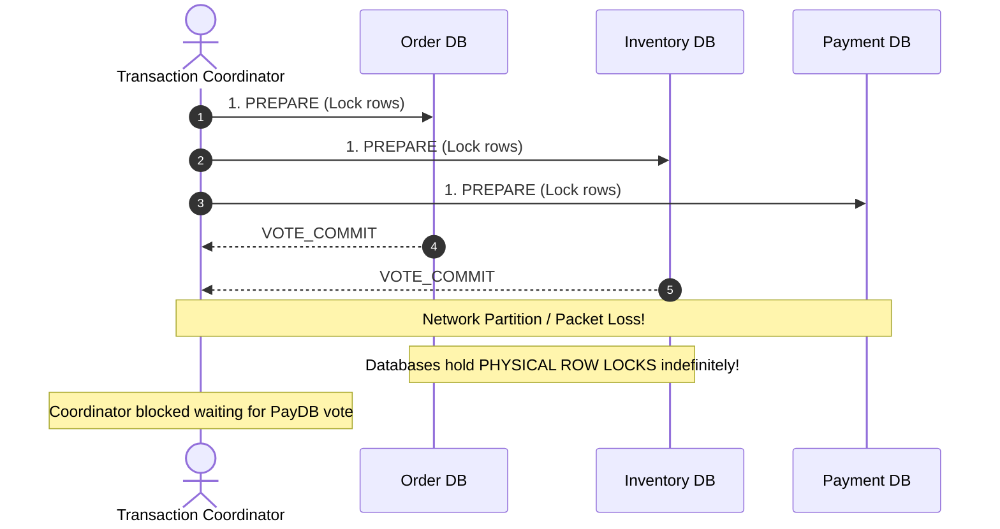
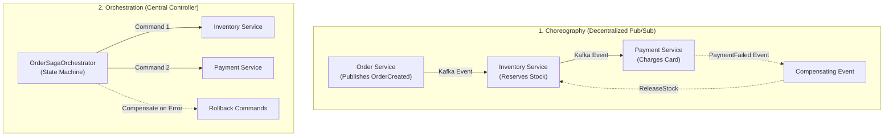
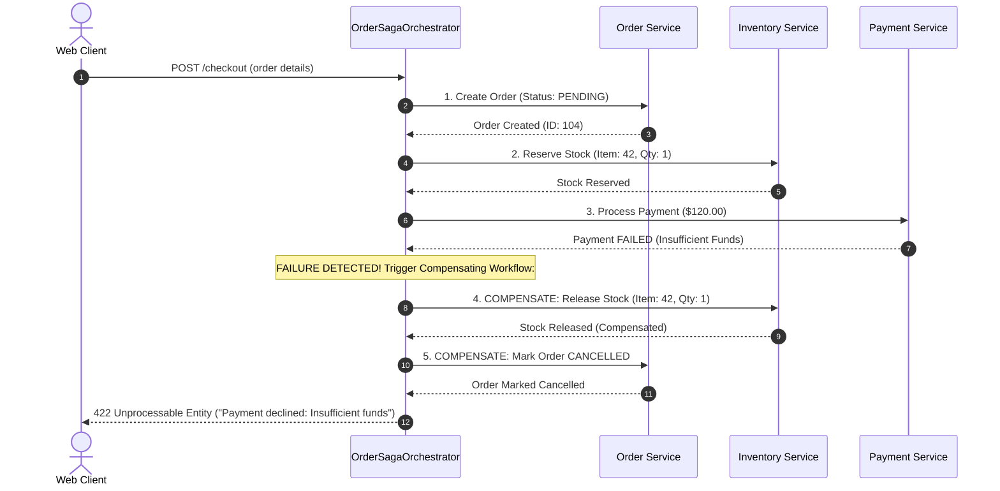
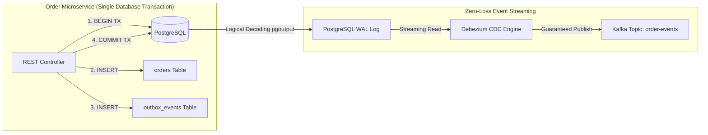
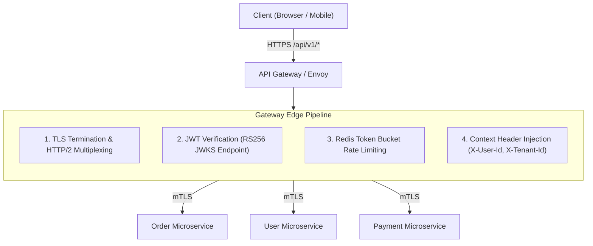
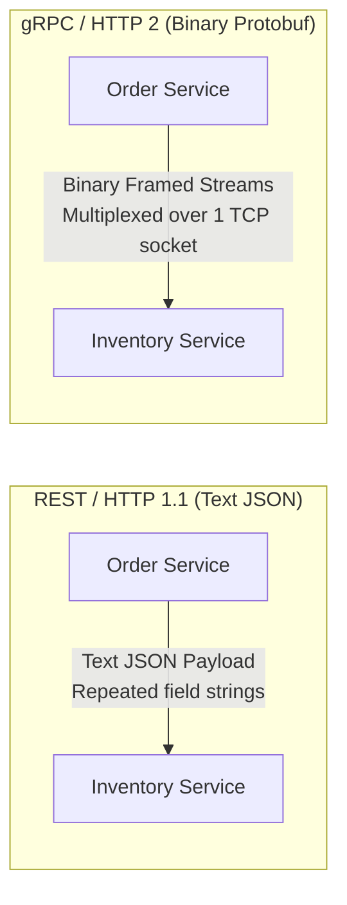

# Microservices Architecture & Distributed Patterns

A microservices architecture decomposes a monolithic application into small, independently deployable, domain-aligned services communicating over lightweight network protocols (HTTP REST, gRPC, or Apache Kafka).

While microservices enable independent team velocity, targeted horizontal scaling, and isolated blast radiuses, they trade monolithic simplicity for distributed systems realities: **unreliable networks, partial failures, asynchronous latency, and the loss of single-database ACID transactions**.

## Prerequisites: Before You Begin

Before designing microservices architectures, ensure you have mastered:
- Relational database ACID transactions and the Spring `@Transactional` lifecycle.
- RESTful HTTP APIs, status codes, and HTTP client connection pooling (`RestClient`).
- Event-driven message brokers (Kafka or RabbitMQ fundamentals).
- Containerization and Docker networking basics.

---

## 1. The Distributed Transaction Problem: Why 2PC Fails

In a monolithic architecture, a single PostgreSQL database transaction coordinates updates across orders, inventory, and payment. If an error occurs, the database executes an atomic rollback (`ROLLBACK`), guaranteeing absolute data consistency.

In microservices, **each service strictly owns its private database**. Attempting to coordinate transactions across multiple independent databases using **Two-Phase Commit (2PC)** or the XA protocol fails in cloud environments:



### Why 2PC Is an Anti-Pattern at Scale
1. **Blocking Protocol**: During the "Prepare" phase, all participating databases acquire physical row locks. If a network partition occurs before the "Commit" phase, rows remain locked, exhausting database connection pools and freezing web workers across the entire platform.
2. **Single Point of Failure (SPOF)**: If the coordinator crashes while holding prepared locks, nodes are left in doubt, unable to commit or abort safely.
3. **Availability Collapse (CAP Theorem)**: A 2PC transaction is only as available as its least reliable participant:

$$\text{Availability} = A_1 \times A_2 \times A_3 \times \dots \times A_n$$

If an enterprise operation spans 5 services, each with 99.9% uptime, total transaction availability drops to $99.9\%^5 \approx 99.5\%$ (over 43 hours of downtime per year).

---

## 2. The Saga Pattern: Distributed Eventual Consistency

Instead of attempting impossible physical ACID transactions across network boundaries, microservices rely on the **Saga Pattern** to achieve **Eventual Consistency**.

A Saga is an orchestrated sequence of local database transactions. Each local transaction updates data inside a single microservice, commits locally, and publishes an event or message to trigger the next step. If a step fails, the Saga executes **Compensating Transactions** to semantically undo preceding operations.



### 2.1 Choreography vs Orchestration

| Architecture | How It Operates | Advantages | Disadvantages |
| :--- | :--- | :--- | :--- |
| **Choreography** | Services publish domain events to Kafka; other services react independently. | Simple for small flows (2 to 3 services); no central orchestrator bottleneck. | **Cyclic dependency hell**; difficult to trace workflow state; debugging distributed failures is extremely complex. |
| **Orchestration** | A dedicated orchestrator service sends explicit commands to participants and monitors responses. | Single source of truth for workflow state; clear visibility; straightforward error handling and compensation. | Additional service to maintain; risk of concentrating too much business logic in the orchestrator. |

### 2.2 Orchestrated Saga with Compensating Transactions



### 2.3 The Pivot Transaction Rule
Every distributed saga contains three distinct classes of transactions:
1. **Compensable Transactions**: Steps preceding the pivot that can be rolled back via compensating actions (e.g., reserving inventory can be compensated by releasing inventory).
2. **Pivot Transaction**: The point of no return in the workflow. Once the pivot transaction commits successfully, the Saga is guaranteed to run to completion. (e.g., charging a non-refundable credit card).
3. **Retriable Transactions**: Steps following the pivot that **cannot fail** and must be retried until they succeed (e.g., sending an order confirmation email or generating a shipping label).

---

## 3. The Transactional Outbox Pattern with CDC

When a microservice mutates its database and publishes an event to a message broker, developers frequently write the following dangerous code:

```java
// DANGEROUS DUAL-WRITE ANTI-PATTERN:
@Transactional
public void placeOrder(OrderRequest request) {
    Order order = orderRepository.save(new Order(request)); // 1. DB Write
    kafkaTemplate.send("order-events", order.getId(), event); // 2. Network Call!
}
```

### The Dual-Write Disaster
- **Scenario A**: The database write commits, but the application server crashes before `kafkaTemplate.send()` executes. The event is permanently lost, causing downstream microservices to desynchronize.
- **Scenario B**: The database transaction throws an exception and rolls back, but Kafka already accepted the message. Downstream services fulfill orders that never existed in the database (ghost transactions).

### The Solution: Transactional Outbox + Debezium (CDC)

Write both the domain entity and the outbound event payload into the **same physical PostgreSQL database transaction**. An external Change Data Capture (CDC) engine (such as Debezium) streams events directly from the PostgreSQL Write-Ahead Log (WAL) to Kafka:



### 3.1 Outbox Table Schema

```sql
CREATE TABLE outbox_events (
    id UUID PRIMARY KEY DEFAULT gen_random_uuid(),
    aggregate_type VARCHAR(100) NOT NULL,
    aggregate_id VARCHAR(100) NOT NULL,
    event_type VARCHAR(100) NOT NULL,
    payload JSONB NOT NULL,
    traceparent VARCHAR(255),
    created_at TIMESTAMP WITH TIME ZONE NOT NULL DEFAULT CURRENT_TIMESTAMP
);

CREATE INDEX idx_outbox_unprocessed ON outbox_events(created_at);
```

### 3.2 Java Outbox Publisher Service

```java
package com.example.order.infrastructure.outbox;

import com.example.order.domain.Order;
import com.example.order.domain.OrderCreatedEvent;
import com.fasterxml.jackson.databind.ObjectMapper;
import io.micrometer.tracing.Tracer;
import org.springframework.jdbc.core.simple.JdbcClient;
import org.springframework.stereotype.Service;
import org.springframework.transaction.annotation.Transactional;

import java.util.UUID;

@Service
public class OutboxEventPublisher {

    private final JdbcClient jdbcClient;
    private final ObjectMapper objectMapper;
    private final Tracer tracer;

    public OutboxEventPublisher(JdbcClient jdbcClient, ObjectMapper objectMapper, Tracer tracer) {
        this.jdbcClient = jdbcClient;
        this.objectMapper = objectMapper;
        this.tracer = tracer;
    }

    @Transactional
    public void recordOrderCreated(Order order) {
        try {
            OrderCreatedEvent event = new OrderCreatedEvent(
                UUID.randomUUID(),
                order.getId(),
                order.getCustomerId(),
                order.getTotalCents()
            );

            String jsonPayload = objectMapper.writeValueAsString(event);
            
            // Extract current W3C traceparent header for distributed context propagation
            String traceparent = tracer.currentSpan() != null 
                    ? tracer.currentSpan().context().traceId() 
                    : null;

            jdbcClient.sql("""
                INSERT INTO outbox_events (id, aggregate_type, aggregate_id, event_type, payload, traceparent)
                VALUES (:id, 'Order', :aggregateId, 'OrderCreated', :payload::jsonb, :traceparent)
            """)
            .param("id", event.eventId())
            .param("aggregateId", order.getId().toString())
            .param("payload", jsonPayload)
            .param("traceparent", traceparent)
            .update();

        } catch (Exception ex) {
            throw new RuntimeException("Failed to serialize and write outbox event", ex);
        }
    }
}
```

---

## 4. CQRS: Command Query Responsibility Segregation

In a monolith, querying data across relationships is trivial:

```sql
SELECT o.id, o.total_amount, u.name, u.email, p.title
FROM orders o
JOIN users u ON o.user_id = u.id
JOIN products p ON o.product_id = p.id;
```

In microservices, `orders`, `users`, and `products` reside in separate, isolated databases across network boundaries. **SQL joins across independent microservices are physically impossible.**

Attempting to assemble this data by making 3 sequential HTTP calls in an API controller creates the **$N+1$ Network Call Anti-Pattern**, causing latency amplification and thread pool exhaustion.

### The CQRS Solution: Denormalized Read Projections

Separate the write model (commands) from the read model (queries):
1. **Command Side (Write)**: Optimized for transaction throughput and invariant enforcement. Uses normalized PostgreSQL schemas.
2. **Query Side (Read)**: Optimized for blazingly fast queries. Subscribes to domain events over Kafka and projects pre-joined, denormalized data into a dedicated read database (e.g. Read-Replica PostgreSQL, Elasticsearch, or MongoDB).

```mermaid
flowchart TD
    subgraph CommandPath["Command Side (Write - Normalized)"]
        User["User Action"] -->|POST /orders| OrderSvc["Order Service"]
        OrderSvc -->|ACID Write| OrderDB[(Order DB)]
        OrderSvc -->|Publish Event| Kafka["Kafka Topic: order-events"]
    end

    subgraph QueryPath["Query Side (Read - Denormalized)"]
        Kafka -->|Consume Event| ProjectionWorker["Order Read Projection Worker"]
        ProjectionWorker -->|Upsert Denormalized Record| ReadDB[(Order Read DB / Elasticsearch)]
        Client["Web / Mobile Client"] -->|GET /customer/orders| ReadSvc["Order Query Service"]
        ReadSvc -->|Single Table O(1) Fetch| ReadDB
    end
```

### CQRS Trade-Offs
- **Pros**: Read queries are instantaneous single-row fetches; read and write tiers can be scaled completely independently.
- **Cons**: **Eventual Consistency Window**. When a customer updates their address, there is a sub-second propagation lag before the read projection reflects the change. Applications handle this via optimistic client UI updates or version token checks.

---

## 5. API Gateway & Perimeter Architecture

In an enterprise microservices ecosystem, client applications (web, iOS, Android) never communicate directly with internal microservices. All traffic flows through an **API Gateway** (e.g., Spring Cloud Gateway, Envoy, or Kong).



### 5.1 Gateway Edge Responsibilities
1. **Centralized Authentication**: The gateway cryptographically verifies JWT signatures using the identity provider's JWKS public keys. Downstream internal services do not need to re-verify token signatures on every call.
2. **Context Header Injection**: Upon authenticating the token, the gateway strips external authorization headers and forwards trusted internal headers downstream:
   - `X-User-Id: 9814`
   - `X-User-Role: ROLE_CUSTOMER`
   - `X-Tenant-Id: tenant_us_west`
3. **Mutual TLS (mTLS)**: Communication between the gateway and internal services (and between services) is encrypted and mutually authenticated via service mesh sidecars (Envoy/Istio).

---

## 6. Distributed Tracing with W3C Trace Context

When an HTTP request triggers a chain of asynchronous service calls and Kafka events across 10 microservices, debugging an error without distributed tracing is impossible.

Modern microservices follow the **W3C Trace Context** specification:

```http
traceparent: 00-4bf92f3577b34da6a3ce929d0e0e4736-00f067aa0ba902b7-01
             |  |                                |                |
            Ver TraceId                          ParentId         Flags (01 = Sampled)
```

- **Trace ID**: Unique 128-bit identifier representing the entire end-to-end journey across all services.
- **Span ID**: Unique 64-bit identifier representing one specific unit of work (e.g., a single HTTP call or SQL query).

### Spring Boot 3 Micrometer Tracing Configuration

Spring Boot 3 natively integrates tracing via **Micrometer Tracing** and OpenTelemetry:

```xml
<!-- pom.xml dependencies for distributed tracing -->
<dependency>
    <groupId>io.micrometer</groupId>
    <artifactId>micrometer-tracing-bridge-otel</artifactId>
</dependency>
<dependency>
    <groupId>io.opentelemetry</groupId>
    <artifactId>opentelemetry-exporter-otlp</artifactId>
</dependency>
```

```yaml
# application.yml
management:
  tracing:
    sampling:
      probability: 0.1 # Sample 10% of production requests to conserve storage
  otlp:
    tracing:
      endpoint: "http://tempo-collector:4318/v1/traces"
```

When using Spring Boot 3's `RestClient`, `WebClient`, or `KafkaTemplate`, the trace context is **automatically propagated** across HTTP headers and Kafka record headers without manual intervention!

---

## 7. High-Performance Inter-Service Communication: gRPC & Protocol Buffers

While public-facing APIs typically use HTTP REST with JSON for browser compatibility, high-throughput internal microservice-to-microservice communication faces substantial overhead using JSON:
1. **JSON Parsing Tax**: Serializing and deserializing ASCII text into JVM heap objects is CPU-intensive.
2. **Bandwidth Inefficiency**: Verbose field names (`"transactionTimestamp": "2026-09-11T12:00:00Z"`) repeat on every message.
3. **HTTP/1.1 Connection Head-of-Line Blocking**: Each HTTP/1.1 connection handles one request at a time, requiring large connection pools.

### The Solution: gRPC over HTTP/2 with Protocol Buffers

**gRPC** replaces text-based JSON with strongly-typed binary **Protocol Buffers (Protobuf)** multiplexed over persistent HTTP/2 TCP connections:



#### 1. Defining the Binary Service Contract (`order_service.proto`)

```protobuf
syntax = "proto3";

package com.example.grpc;
option java_multiple_files = true;
option java_package = "com.example.grpc.order";

service OrderGrpcService {
  rpc CheckInventory (InventoryRequest) returns (InventoryResponse);
}

message InventoryRequest {
  string product_id = 1;
  int32 requested_quantity = 2;
}

message InventoryResponse {
  bool is_available = 1;
  int32 remaining_stock = 2;
  int64 unit_price_cents = 3;
}
```

#### 2. Spring Boot 3 gRPC Server Implementation

```java
@GrpcService
public class InventoryGrpcServiceImpl extends OrderGrpcServiceGrpc.OrderGrpcServiceImplBase {

    private final InventoryRepository inventoryRepository;

    public InventoryGrpcServiceImpl(InventoryRepository inventoryRepository) {
        this.inventoryRepository = inventoryRepository;
    }

    @Override
    public void checkInventory(InventoryRequest request, StreamObserver<InventoryResponse> responseObserver) {
        var stock = inventoryRepository.findByProductId(request.getProductId());
        
        boolean available = stock.isPresent() && stock.get().getQuantity() >= request.getRequestedQuantity();

        InventoryResponse response = InventoryResponse.newBuilder()
                .setIsAvailable(available)
                .setRemainingStock(stock.map(Inventory::getQuantity).orElse(0))
                .setUnitPriceCents(stock.map(Inventory::getPriceCents).orElse(0L))
                .build();

        responseObserver.onNext(response);
        responseObserver.onCompleted();
    }
}
```

#### 3. Spring Boot 3 gRPC Client with Deadlines

<Warning>
**The Distributed Zombie Call Trap**:
Never execute remote gRPC calls without an explicit **Deadline**. If a downstream service hangs, the calling thread remains blocked indefinitely.

Deadlines automatically propagate across microservice hops: if Service A has a 500ms deadline and calls Service B, and Service B calls Service C after 400ms, Service C automatically inherits a 100ms remaining budget!
</Warning>

```java
@Service
public class OrderProcessingService {

    @GrpcClient("inventory-service")
    private OrderGrpcServiceGrpc.OrderGrpcServiceBlockingStub inventoryStub;

    public boolean verifyStock(String productId, int quantity) {
        try {
            // Mandate a strict 500ms deadline
            var stubWithDeadline = inventoryStub.withDeadlineAfter(500, TimeUnit.MILLISECONDS);
            
            var request = InventoryRequest.newBuilder()
                    .setProductId(productId)
                    .setRequestedQuantity(quantity)
                    .build();

            InventoryResponse response = stubWithDeadline.checkInventory(request);
            return response.getIsAvailable();
        } catch (StatusRuntimeException e) {
            if (e.getStatus().getCode() == Status.Code.DEADLINE_EXCEEDED) {
                // Downstream timed out - trip circuit breaker or fail safe
                throw new DownstreamServiceTimeoutException("Inventory service deadline exceeded");
            }
            throw e;
        }
    }
}
```

#### Protocol Decision Matrix

| Dimension | HTTP REST (JSON) | gRPC (Protobuf) | Apache Kafka |
| :--- | :--- | :--- | :--- |
| **Communication Style** | Synchronous Request / Response | Synchronous or Bidirectional Streaming | Asynchronous Event Streaming |
| **Payload Format** | Human-readable UTF-8 JSON | Compact binary serialization | Binary (Protobuf, Avro, or JSON) |
| **Transport Protocol** | HTTP/1.1 or HTTP/2 | HTTP/2 multiplexed streams | Custom TCP protocol |
| **Ideal Production Use** | Public APIs, web and mobile clients | Internal synchronous service-to-service | Cross-service async events, audit, CDC |

---

## 8. The "Distributed Monolith" Anti-Pattern

If microservices are implemented incorrectly, you incur all the operational costs of distributed systems with none of the benefits. This disaster is known as a **Distributed Monolith**:

1. **Shared Database**:
   - Multiple microservices connect directly to the exact same PostgreSQL schema.
   - *Consequence*: A schema migration in Service A breaks Service B in production; eliminates database autonomy.
2. **Deep Synchronous Call Chains**:
   - Service A calls Service B $\rightarrow$ calls Service C $\rightarrow$ calls Service D.
   - *Consequence*: Latency is additive, and availability is multiplicative ($A_{\text{total}} = A_1 \times A_2 \times A_3$). If one service hiccups, all upstream callers crash with 504 timeouts.
3. **Distributed Transactions (2PC)**:
   - Attempting cross-service ACID locks across network boundaries.
   - *Consequence*: HikariCP connection pool exhaustion, blocking coordinator crashes, and deadlocks.
4. **Lockstep Deployments**:
   - Service A cannot be deployed unless Service B and C are deployed simultaneously.
   - *Consequence*: Completely eliminates independent team velocity and horizontal scaling autonomy.

---

## 9. Failure Modes & Edge Case Matrix

| Failure Mode | Root Cause | Impact | Production Defense |
| :--- | :--- | :--- | :--- |
| **Dual-Write Corruption** | Database update succeeds, but message publish fails | Downstream services never receive business event | Implement Transactional Outbox pattern with CDC. |
| **Saga Compensation Crash** | Participant node crashes during compensating transaction | System left in inconsistent state | Make compensations strictly idempotent; retry with dead-letter alerts. |
| **Cascading Gateway Timeout** | Unbounded thread pool calling slow downstream service | Entire API Gateway thread pool exhausts | Apply circuit breakers, thread pool bulkheads, and gRPC deadlines. |
| **Duplicate Event Ingestion** | Network blip causes Kafka consumer to re-read offset | Duplicate charges or duplicate inventory reservations | Deduplication table (`event_deduplication`) with unique message ID. |
| **Cyclic Choreography Storm** | Service A event triggers Service B, which triggers Service A | Infinite loop saturates broker and CPU | Switch to Saga Orchestration for complex circular flows. |

---

## 10. Hands-on Practice Challenge & Integration Tests

### The Lab: Idempotent Event Consumer with Deduplication

**Objective**: Implement an event consumer that guarantees exactly-once business outcomes even when Kafka delivers the same `OrderCreatedEvent` multiple times due to consumer rebalance.

#### 1. PostgreSQL Deduplication Table Migration

```sql
CREATE TABLE processed_events (
    event_id VARCHAR(64) PRIMARY KEY,
    event_type VARCHAR(64) NOT NULL,
    processed_at TIMESTAMPTZ NOT NULL DEFAULT NOW()
);
```

#### 2. The Idempotent Consumer Implementation

```java
@Component
public class InventoryEventConsumer {

    private final InventoryService inventoryService;
    private final JdbcTemplate jdbcTemplate;

    public InventoryEventConsumer(InventoryService inventoryService, JdbcTemplate jdbcTemplate) {
        this.inventoryService = inventoryService;
        this.jdbcTemplate = jdbcTemplate;
    }

    @Transactional
    public boolean processOrderEvent(String eventId, String orderId, String productId, int quantity) {
        // Atomic insert: Returns 0 if event was already processed (Unique Constraint)
        int inserted = jdbcTemplate.update(
            "INSERT INTO processed_events (event_id, event_type) VALUES (?, ?) ON CONFLICT (event_id) DO NOTHING",
            eventId, "ORDER_CREATED"
        );

        if (inserted == 0) {
            log.info("Duplicate event {} detected for order {}. Skipping.", eventId, orderId);
            return false; // Idempotent skip
        }

        inventoryService.reserveStock(productId, quantity);
        return true;
    }
}
```

#### 3. The Verification Test

```java
@SpringBootTest
class IdempotentConsumerTest {

    @Autowired
    private InventoryEventConsumer consumer;

    @Autowired
    private InventoryRepository inventoryRepository;

    @Test
    void duplicateEvent_executesBusinessLogicExactlyOnce() {
        String eventId = "EVT-998822";
        String productId = "PROD-A";
        
        // 1. First event arrival: Successfully reserves 5 units
        boolean firstProcessed = consumer.processOrderEvent(eventId, "ORD-1", productId, 5);
        assertTrue(firstProcessed);

        // 2. Duplicate event re-delivery (simulating network retry)
        boolean secondProcessed = consumer.processOrderEvent(eventId, "ORD-1", productId, 5);
        assertFalse(secondProcessed);

        // 3. Verify stock was only decremented ONCE (not twice)
        assertEquals(95, inventoryRepository.findByProductId(productId).get().getQuantity());
    }
}
```

---

## 11. Senior Interview Questions & Active Recall

<AccordionGroup>
  <Accordion title="1. Why is Two-Phase Commit (2PC) considered an anti-pattern in modern cloud-native microservices?">
    Two-Phase Commit (2PC) is a blocking protocol. During Phase 1 (Prepare), every participating database holds physical row locks until Phase 2 (Commit/Abort) finishes. 
    
    If any service experiences a network partition, hardware failure, or latency spike, locks are held indefinitely. This exhausts database connection pools, causes deadlocks, and reduces system availability to the product of all participating nodes ($A = A_1 \times A_2 \dots$). Modern microservices replace 2PC with the Saga pattern and eventual consistency.
  </Accordion>

  <Accordion title="2. What is the difference between Orchestration and Choreography in the Saga Pattern?">
    - **Choreography**: Fully decentralized. Services publish domain events to a broker (e.g. Kafka), and other services listen and react. There is no central coordinator. Ideal for simple 2 to 3-step workflows. Disadvantage: Difficult to track overall workflow state; prone to cyclic dependency loops.
    - **Orchestration**: A dedicated service acts as a centralized state machine coordinator. It explicitly commands participant services to execute transactions and handles compensating actions if a step fails. Ideal for complex multi-step enterprise business processes.
  </Accordion>

  <Accordion title="3. How does gRPC improve throughput over HTTP REST in internal service meshes?">
    gRPC operates over HTTP/2, allowing multiple concurrent requests and responses to be multiplexed across a single long-lived TCP connection without head-of-line blocking. 
    
    It serializes data using binary Protocol Buffers (Protobuf) instead of verbose text-based JSON. Protobuf payloads are up to 70% smaller and deserialize up to 10x faster because field names are replaced with lightweight numeric tags, dramatically reducing CPU consumption and network latency in high-traffic microservices.
  </Accordion>

  <Accordion title="4. How does the Transactional Outbox pattern eliminate the Dual-Write problem?">
    The Dual-Write problem occurs when an application attempts to write to a local database and publish a message to a network broker in the same method. Because these are two separate systems, one write can succeed while the other fails.
    
    The Transactional Outbox pattern solves this by writing both the domain entity and the outbound message into an `outbox_events` table inside the **exact same local ACID database transaction**. Because both writes are atomic within the local database, message loss is impossible. A Change Data Capture (CDC) tool like Debezium or an asynchronous polling worker then streams records reliably from the outbox table to Kafka.
  </Accordion>

  <Accordion title="5. What happens if a gRPC call does not specify a deadline?">
    Without an explicit deadline, gRPC requests wait indefinitely for the server to respond. If a downstream service hangs due to a deadlock or network issue, calling threads remain locked, eventually exhausting the client's thread pool and cascading into a complete platform outage. Deadlines also propagate down the call tree, preventing downstream services from continuing expensive processing after the root caller has already timed out.
  </Accordion>
</AccordionGroup>

---

## 12. Done Checklist

<Check>
- [ ] Cross-service physical database foreign keys and synchronous cross-database joins have been eliminated.
- [ ] Distributed workflows utilize the Saga pattern with explicit compensating transactions for rollback paths.
- [ ] The Transactional Outbox pattern with Change Data Capture (CDC) is implemented to prevent dual-write state corruption.
- [ ] High-throughput internal inter-service calls use gRPC over HTTP/2 with strict deadlines.
- [ ] Distributed consumers implement idempotent message handling using PostgreSQL deduplication tables.
- [ ] API Gateway verifies JWT signatures at the perimeter edge and injects validated context headers (`X-User-Id`, `X-Tenant-Id`) for internal services.
- [ ] CQRS read projections are used for high-performance aggregate queries across multiple bounded contexts.
- [ ] W3C `traceparent` distributed trace headers are propagated across all HTTP, gRPC, and Kafka network boundaries.
</Check>
