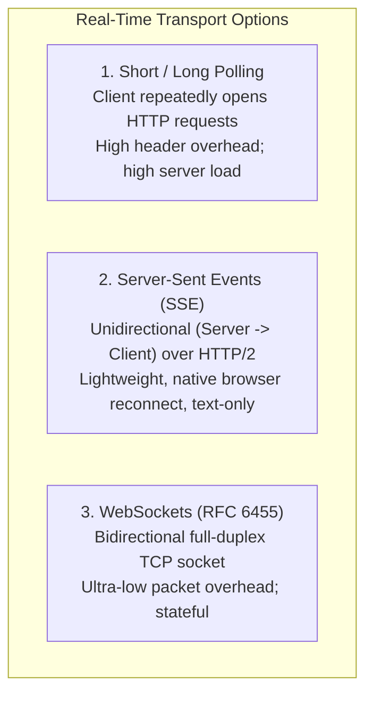
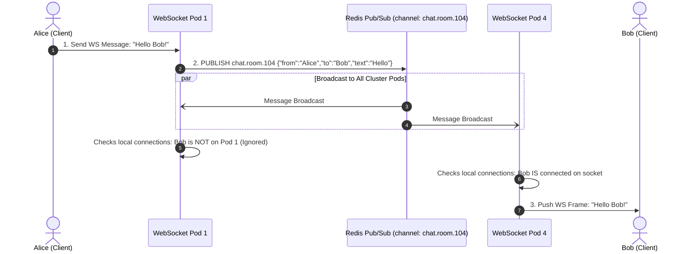

# Real-Time WebSockets & Event Streaming at Scale

Traditional REST APIs are fundamentally **stateless request-response** mechanisms: the client requests data, the server responds in a few milliseconds, and the underlying TCP connection is returned to the pool or closed.

However, modern interactive applications—chat platforms, live ride-hailing maps (Uber/Lyft), financial trading order books, multiplayer gaming, and collaborative editors—require **full-duplex, low-latency, bidirectional streaming**.

Holding hundreds of thousands of stateful TCP connections open simultaneously breaks traditional stateless scaling paradigms. Senior backend engineers must architect **horizontal WebSocket clusters backed by distributed message backplanes, tune Linux kernel socket memory, and mitigate reconnection stampedes**.

---

## 1. Transport Protocols Compared: Polling vs SSE vs WebSockets

Choosing the wrong real-time protocol wastes massive server bandwidth and exhausts battery on mobile devices:



### Architectural Comparison Matrix

| Protocol | Directionality | Protocol Base | Reconnection | Header Overhead | Ideal Production Use Case |
| :--- | :--- | :--- | :--- | :--- | :--- |
| **Short Polling** | Client $\rightarrow$ Server | HTTP/1.1 or HTTP/2 | New request each time | **Huge** (~1KB headers per poll) | Non-critical legacy dashboards |
| **Long Polling** | Client $\rightarrow$ Server | HTTP/1.1 (holds open) | Client immediately reconnects | Medium (headers on each event) | Fallback when WebSockets blocked by firewalls |
| **Server-Sent Events (SSE)**| **Server $\rightarrow$ Client** | HTTP/2 or HTTP/1.1 | Built-in browser auto-reconnect | Very low (single HTTP stream) | Stock price feeds, AI LLM token streaming, notifications |
| **WebSockets** | **Bidirectional** | Upgrades from HTTP to TCP | Must be implemented in client | **Minimal** (2 to 10 bytes framing per message) | Multiplayer games, instant chat, real-time whiteboards |

---

## 2. Horizontal Scaling: The Distributed Message Backplane

In a multi-pod Kubernetes cluster, WebSocket connections are **stateful and pinned to a specific server instance**:

<Warning>
**The Cross-Pod Routing Dilemma**:
- **Alice connects to Pod 1**: Her open TCP socket lives strictly in the RAM of Pod 1.
- **Bob connects to Pod 4**: His open TCP socket lives strictly in the RAM of Pod 4.
- **The Failure**: When Alice sends a direct message to Bob, Pod 1 has no connection to Bob and cannot directly write to Bob's socket!
</Warning>

### The Solution: Redis Pub/Sub Message Backplane

To route messages across independent pods, decouple client connections from message routing using an asynchronous **Distributed Message Backplane** (Redis Pub/Sub or Apache Kafka):



---

## 3. Linux Kernel & Socket Tuning (The C1000K Problem)

Running 100,000+ concurrent WebSockets on a single Linux server requires tuning operating system kernel limits:

### 3.1 File Descriptor Ceiling (`ulimit`)
Every open TCP socket is represented as a file descriptor in Linux. The default limit is usually `1024`:

```bash
# Set soft and hard file descriptor limits to 1,000,000 in /etc/security/limits.conf:
* soft nofile 1000000
* hard nofile 1000000
```

### 3.2 Ephemeral Port Exhaustion
When a server connects to outbound downstreams or acts as a proxy, it assigns an ephemeral port from the range `net.ipv4.ip_local_port_range` (default ~32,000 ports). 

```bash
# Expand ephemeral port range in /etc/sysctl.conf:
net.ipv4.ip_local_port_range = 1024 65535

# Enable reuse of TIME_WAIT sockets for outgoing connections:
net.ipv4.tcp_tw_reuse = 1
```

### 3.3 TCP Socket Memory Buffers
Linux allocates a read buffer (`rmem`) and write buffer (`wmem`) for every open socket. 
- If the default buffer size is 128KB, 500,000 connections will consume **64 GB of RAM purely in kernel socket buffers**!
- To scale to 1M connections, reduce default TCP buffers for lightweight chat frames:

```bash
# /etc/sysctl.conf
# min, default, max buffer sizes in bytes
net.ipv4.tcp_rmem = 4096 8192 4194304
net.ipv4.tcp_wmem = 4096 8192 4194304

# Increase listen queue backlog for burst connections:
net.core.somaxconn = 65535
net.ipv4.tcp_max_syn_backlog = 65535
```

---

## 4. Connection Lifecycle: Heartbeats & Reconnection Jitter

Mobile network connections (4G/5G, subways, Wi-Fi handoffs) fail silently. A phone can enter an elevator, lose cell service, and drop the connection without sending a TCP `FIN` or `RST` packet.

Without active heartbeats, the server will hold the dead socket open indefinitely, leaking memory and routing messages into a black hole!

### 4.1 Ping/Pong Heartbeats (Keep-Alive)
- The server sends a lightweight WebSocket `Ping` frame every 30 seconds.
- The client browser automatically responds with a `Pong` frame.
- If the server misses **2 consecutive heartbeats (60 seconds)**, it terminates the socket, cleans up internal session maps, and notifies other users that the client has gone offline.

```mermaid
sequenceDiagram
    autonumber
    participant Server as WebSocket Server
    participant Mobile as Mobile App (Elevator Ride)

    loop Every 30 Seconds
        Server->>Mobile: WS Ping Frame
        Mobile-->>Server: WS Pong Frame (Connection Healthy)
    end

    Note over Mobile: Enters elevator! Signal completely lost!
    Server->>Mobile: WS Ping Frame (Timeout 10s)
    Note over Server: Missed Heartbeat 1 (Warning)
    Server->>Mobile: WS Ping Frame (Timeout 10s)
    Note over Server: Missed Heartbeat 2 (Expired!)
    Server->>Server: Forcefully closes socket (TCP RST); cleans up session memory
```

### 4.2 Reconnection Stampedes (Thundering Herd)
When an Ingress controller or WebSocket pod restarts, 50,000 clients disconnect at the exact same millisecond. If all 50,000 clients immediately reconnect at `t = 0`, the server is slammed by an overwhelming wave of TLS handshakes and authentication checks, crashing the service repeatedly.

#### The Solution: Exponential Backoff with Full Jitter
Clients must never reconnect immediately. They must apply randomized exponential backoff:

$$\text{Sleep Time} = \text{Random}(0, \min(\text{MaxBackoff}, \text{BaseDelay} \times 2^{\text{attempt}}))$$

---

## 5. Production Spring Boot STOMP WebSocket Configuration

Below is the production-grade Spring Boot 3 configuration utilizing STOMP over WebSockets with a shared Redis Pub/Sub message broker:

```java
package com.example.websocket.config;

import org.springframework.context.annotation.Configuration;
import org.springframework.messaging.simp.config.MessageBrokerRegistry;
import org.springframework.web.socket.config.annotation.EnableWebSocketMessageBroker;
import org.springframework.web.socket.config.annotation.StompEndpointRegistry;
import org.springframework.web.socket.config.annotation.WebSocketMessageBrokerConfigurer;

@Configuration
@EnableWebSocketMessageBroker
public class WebSocketProductionConfig implements WebSocketMessageBrokerConfigurer {

    @Override
    public void configureMessageBroker(MessageBrokerRegistry registry) {
        // Application destination prefix for messages dispatched from clients
        registry.setApplicationDestinationPrefixes("/app");

        // Simple In-Memory Broker for local distribution
        // For multi-node production clusters, configure a dedicated Relay (RabbitMQ / Redis)
        registry.enableSimpleBroker("/topic", "/queue")
                .setHeartbeatValue(new long[]{25000, 25000}); // 25s ping/pong heartbeats
    }

    @Override
    public void registerStompEndpoints(StompEndpointRegistry registry) {
        registry.addEndpoint("/ws")
                .setAllowedOriginPatterns("https://*.company.com")
                .withSockJS() // Fallback to HTTP streaming / long-polling if WS blocked
                .setDisconnectDelay(30000);
    }
}
```

### Redis Broadcast Bridge Service

```java
package com.example.websocket.service;

import com.fasterxml.jackson.databind.ObjectMapper;
import org.springframework.data.redis.connection.Message;
import org.springframework.data.redis.connection.MessageListener;
import org.springframework.data.redis.core.StringRedisTemplate;
import org.springframework.messaging.simp.SimpMessagingTemplate;
import org.springframework.stereotype.Service;

@Service
public class RedisWebSocketBridge implements MessageListener {

    private final StringRedisTemplate redisTemplate;
    private final SimpMessagingTemplate messagingTemplate;
    private final ObjectMapper objectMapper;

    public RedisWebSocketBridge(
            StringRedisTemplate redisTemplate,
            SimpMessagingTemplate messagingTemplate,
            ObjectMapper objectMapper) {
        this.redisTemplate = redisTemplate;
        this.messagingTemplate = messagingTemplate;
        this.objectMapper = objectMapper;
    }

    // Called when a local client sends a message
    public void broadcastToCluster(String destinationTopic, Object payload) {
        try {
            String json = objectMapper.writeValueAsString(payload);
            redisTemplate.convertAndSend(destinationTopic, json);
        } catch (Exception e) {
            throw new RuntimeException("Failed to broadcast WebSocket frame to Redis", e);
        }
    }

    // Called when Redis Pub/Sub receives a frame from ANY pod in the cluster
    @Override
    public void onMessage(Message message, byte[] pattern) {
        String topic = new String(message.getChannel());
        String body = new String(message.getBody());

        // Forward to local WebSocket connections on this specific pod
        messagingTemplate.convertAndSend(topic, body);
    }
}
```

---

## 6. Active Recall Interview Mastery

<AccordionGroup>
  <Accordion title="1. When would you choose Server-Sent Events (SSE) over WebSockets?">
    Server-Sent Events (SSE) are ideal when the communication is **strictly unidirectional from server to client** (e.g., live stock price updates, social media notifications, or streaming tokens from an AI model like ChatGPT). 
    
    SSE operates over standard HTTP/2, works natively through corporate proxies and firewalls without special protocol upgrades, supports built-in browser reconnection, and is drastically simpler to load balance than bidirectional WebSockets. Choose WebSockets only when true full-duplex client-to-server messaging is required (e.g. collaborative editing or online gaming).
  </Accordion>

  <Accordion title="2. How do you scale a WebSocket application horizontally across 20 Kubernetes pods?">
    Because WebSockets are stateful TCP connections pinned to a single pod, User A on Pod 1 cannot directly communicate with User B on Pod 4. 
    
    The standard architecture places an **asynchronous Distributed Message Backplane** (such as Redis Pub/Sub or Apache Kafka) behind the web pods. When Pod 1 receives a message from User A, it publishes the event to the Redis topic. All 20 pods subscribe to the Redis topic; Pod 4 receives the broadcast, identifies that User B holds an open socket locally, and pushes the frame down to User B.
  </Accordion>

  <Accordion title="3. What is a Reconnection Stampede, and how do you protect your cluster from it?">
    A Reconnection Stampede occurs when a load balancer or server restarts, terminating tens of thousands of WebSocket sessions simultaneously. If clients attempt to reconnect immediately, the massive flood of concurrent TCP handshakes, TLS negotiations, and authentication queries crashes the server. 
    
    To mitigate this, clients must implement **Exponential Backoff with Full Jitter**: adding a randomized delay to reconnection attempts so traffic spreads evenly across a multi-second or multi-minute window.
  </Accordion>

  <Accordion title="4. Why are Ping/Pong heartbeats necessary for WebSockets over mobile networks?">
    Mobile devices frequently move through network dead zones, switch towers, or go to sleep without sending formal TCP disconnect packets (`FIN`). 
    
    Without application-level heartbeats, the server operating system keeps the TCP socket open in the `ESTABLISHED` state indefinitely, wasting memory and routing messages to a phantom connection. Periodic ping/pong frames detect unresponsive connections and allow the server to clean up resources promptly.
  </Accordion>

  <Accordion title="5. What kernel parameters must be tuned in Linux to support 500,000 concurrent WebSockets on a single instance?">
    1. **File Descriptors**: Increase `ulimit -n` and `fs.file-max` to 1,000,000+ so the OS does not reject new socket allocations.
    2. **Connection Backlog**: Increase `net.core.somaxconn` and `net.ipv4.tcp_max_syn_backlog` to 65,535 to absorb bursty connection handshakes.
    3. **TCP Buffer Memory**: Reduce default read/write socket buffers (`net.ipv4.tcp_rmem` and `tcp_wmem`) so each idle connection consumes minimal RAM (e.g. 4KB to 8KB instead of 128KB).
    4. **Ephemeral Ports**: Expand `net.ipv4.ip_local_port_range = 1024 65535` and enable `net.ipv4.tcp_tw_reuse = 1`.
  </Accordion>
</AccordionGroup>

---

## 7. Done Checklist

<Check>
Transport selection aligns with directionality requirements (SSE for server-to-client; WebSockets for full-duplex).
</Check>
<Check>
Multi-pod WebSocket deployments utilize a Redis Pub/Sub or Kafka message backplane for cross-pod routing.
</Check>
<Check>
Operating system file descriptor limits (`ulimit -n 1000000`) and TCP buffer sizes are tuned for high concurrency.
</Check>
<Check>
Periodic ping/pong heartbeats detect and clean up silent mobile socket disconnects.
</Check>
<Check>
Client applications apply exponential backoff with full jitter to eliminate reconnection stampedes upon gateway restarts.
</Check>
<Check>
WebSocket endpoints enforce origin checks and JWT authentication during the initial HTTP upgrade handshake.
</Check>
