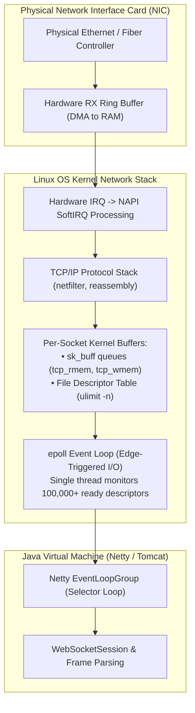
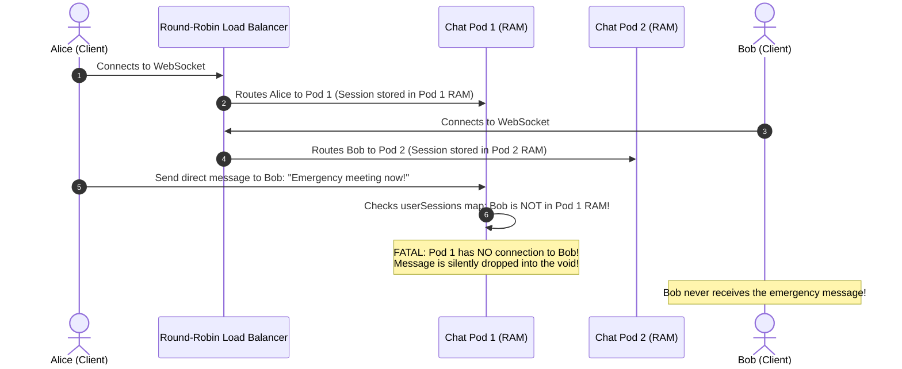
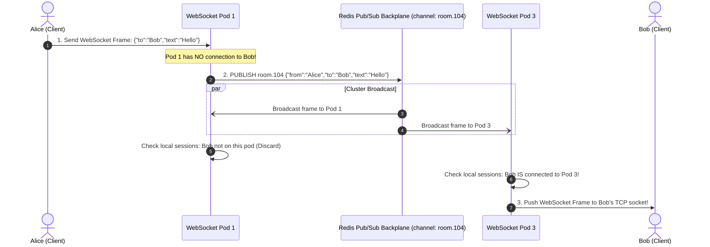

# Real-Time WebSockets & Event Streaming at Scale

Traditional REST APIs are fundamentally **stateless request-response** mechanisms: the client issues an HTTP request, the server responds within milliseconds, and the underlying TCP connection is returned to the pool or closed.

However, modern interactive platforms—collaborative document editors, financial trading order books, ride-hailing geolocation tracking (Uber/Lyft), multiplayer gaming, and live chat—require **continuous, bidirectional, low-latency communication**.

Holding hundreds of thousands of stateful TCP connections open simultaneously breaks traditional stateless microservice paradigms:
- Connecting to Pod 1 means your open socket lives strictly in the memory of Pod 1. Messages sent to users connected to Pod 4 disappear into a black hole without a **distributed message backplane**.
- 50,000 mobile devices entering tunnels or elevators lose network connectivity without sending TCP `FIN` packets, resulting in **zombie socket leaks** that exhaust OS file descriptors and RAM.
- A single pod restart triggers a **Reconnection Thundering Herd** where tens of thousands of clients reconnect at the exact same millisecond, crushing servers under TLS 1.3 cryptographic handshakes.

Senior backend engineers do not treat WebSockets like standard HTTP endpoints. They master **Linux kernel socket tuning, RFC 6455 binary framing, distributed Redis Pub/Sub backplanes, and jittered reconnection algorithms**.

---

## Phase 1: Ground Floor (Physical First Principles)

To scale persistent real-time connections, you must understand how the operating system kernel and physical Network Interface Cards (NIC) manage TCP sockets.



### 1. The Kernel Cost of a Persistent Connection
A TCP connection is not an active wire; it is a **logical state machine** maintained in operating system memory:
- **File Descriptors**: Every open socket consumes a slot in the process's file descriptor table. The default Linux limit is `1024`—attempting to hold 5,000 connections crashes with `java.io.IOException: Too many open files`.
- **Kernel Socket Memory (`sk_buff`)**: The kernel allocates dedicated send (`wmem`) and receive (`rmem`) buffers for every socket. If the default buffer is $128\text{ KB}$, holding $200,000$ idle connections consumes **$25.6\text{ GB}$ of RAM purely in OS kernel space**, before Java or application code allocates a single byte!
- **Event-Driven Non-Blocking I/O (`epoll`)**: In the early 2000s, servers assigned one OS thread per connection (the C10K problem). 10,000 connections meant 10,000 threads, consuming $10\text{ GB}$ of stack space and locking CPU cores in continuous thread context switches. Modern systems (Netty, Undertow) use the Linux `epoll` system call, allowing a **single I/O thread to monitor 100,000+ open sockets** and waking only when network packets physically arrive.

### 2. The WebSocket Protocol Upgrade (RFC 6455)
WebSockets do not invent a new transport layer; they begin as standard HTTP/1.1 and perform an atomic **Protocol Upgrade** over the existing TCP socket:

```http
GET /chat HTTP/1.1
Host: api.platform.com
Upgrade: websocket
Connection: Upgrade
Sec-WebSocket-Key: dGhlIHNhbXBsZSBub25jZQ==
Sec-WebSocket-Version: 13
```

The server validates authentication, hashes the key with the magic GUID string (`258EAFA5-E914-47DA-95CA-C5AB0DC85B11`), computes the SHA-1 digest, and returns:

```http
HTTP/1.1 101 Switching Protocols
Upgrade: websocket
Connection: Upgrade
Sec-WebSocket-Accept: s3pPLMBiTxaQ9kYGzzhZRbK+xOo=
```

From this instant forward, HTTP semantics cease. The raw TCP stream transmits ultra-compact **WebSocket binary frames** (overhead drops from $1,000\text{ bytes}$ of HTTP headers to **just $2\text{ to }10\text{ bytes}$ per frame**).

---

## Phase 2: The Naive Code (The Production Crashes)

### Crash Scenario 1: The Cross-Pod Silent Message Drop (Stateless Illusion)

A development team builds a chat microservice using Spring Boot. They store active sessions in an in-memory map:

```java
// DANGEROUS ANTI-PATTERN: In-memory session tracking in multi-instance clusters
@Component
public class NaiveChatHandler extends TextWebSocketHandler {

    // Thread-safe map storing active sessions on THIS specific pod
    private final Map<String, WebSocketSession> userSessions = new ConcurrentHashMap<>();

    @Override
    public void afterConnectionEstablished(WebSocketSession session) {
        String userId = getUserId(session);
        userSessions.put(userId, session);
    }

    public void sendDirectMessage(String targetUserId, String messageText) throws IOException {
        WebSocketSession targetSession = userSessions.get(targetUserId);
        
        if (targetSession != null && targetSession.isOpen()) {
            targetSession.sendMessage(new TextMessage(messageText));
        } else {
            // SILENT DISASTER: Target user is connected to Pod 3, but this is Pod 1!
            // The message is discarded silently without notifying the sender!
            log.warn("User {} not connected to this pod. Message dropped!", targetUserId);
        }
    }
}
```



#### What Happened in Production:
- In production, the service scaled from 1 pod to 6 pods behind an AWS Application Load Balancer (ALB).
- Users had a $\frac{1}{6}$ chance of landing on the same pod.
- **$83.3\%$ of all direct messages and real-time alerts were silently lost**, resulting in customer churn and emergency rollback.

---

### Crash Scenario 2: The Reconnection Thundering Herd Meltdown

A frontend developer configures an aggressive auto-reconnect handler:

```javascript
// DANGEROUS ANTI-PATTERN: Instant reconnection without backoff or jitter
const connect = () => {
    const ws = new WebSocket("wss://api.platform.com/ws");
    
    ws.onclose = () => {
        // FATAL: Reconnects IMMEDIATELY on connection drop!
        connect();
    };
};
connect();
```

#### What Happened in Production:
1. Kubernetes performed a routine rolling deployment of the WebSocket service. Pod 1 was terminated, cleanly dropping **45,000 active WebSocket connections**.
2. All 45,000 client browsers executed `ws.onclose()` within 50 milliseconds.
3. Every single client fired an instantaneous HTTPS request to upgrade to WebSockets on surviving Pod 2 and Pod 3.
4. **The Thundering Herd Collapse**:
   - Pod 2 and Pod 3 received 45,000 simultaneous TLS 1.3 cryptographic handshakes.
   - CPU utilization surged to $100\%$ on cryptographic math (`Diffie-Hellman` key exchange).
   - Kubernetes liveness probes failed (`HTTP 504 Gateway Timeout`), causing the orchestrator to kill Pod 2 and Pod 3.
   - Now **all 90,000 clients were disconnected**, slamming the remaining pods in an unrecoverable cascading cluster death spiral.

---

### Crash Scenario 3: The Zombie Socket Memory Leak (Ghost Connections)

A ride-hailing platform tracks driver GPS coordinates over WebSockets without enabling application-level ping/pong heartbeats:

```java
// DANGEROUS: No heartbeats or idle timeouts configured
@Configuration
@EnableWebSocket
public class WebSocketConfig implements WebSocketConfigurer {
    @Override
    public void registerWebSocketHandlers(WebSocketHandlerRegistry registry) {
        registry.addHandler(new DriverLocationHandler(), "/drivers/location")
                .setAllowedOrigins("*");
        // FATAL: No heartbeat interval, no idle timeout!
    }
}
```

#### What Happened in Production:
- Drivers routinely entered parking garages, rural dead zones, or tunnels, losing cellular service instantly.
- Because no TCP `FIN` or `RST` packet can be transmitted over a severed radio antenna, the Linux kernel and JVM held the TCP sockets in the `ESTABLISHED` state indefinitely.
- The server accumulated **180,000 "ghost connections"** over 48 hours.
- Operating system socket buffers consumed all available RAM, and the Linux kernel OOM Killer terminated the entire backend service with `Exit Code 137`.

---

## Phase 3: Under the Hood (Mechanics, Kernel Limits & Spring Architecture)

### 1. Transport Protocols Compared: Polling vs SSE vs WebSockets

| Dimension | Short Polling | Server-Sent Events (SSE) | WebSockets (RFC 6455) |
| :--- | :--- | :--- | :--- |
| **Directionality** | Client $\rightarrow$ Server | **Server $\rightarrow$ Client** (Unidirectional) | **Bidirectional** (Full-Duplex) |
| **Protocol Foundation**| Standard HTTP/1.1 | HTTP/2 or HTTP/1.1 | Upgraded raw TCP stream |
| **Framing Overhead** | **Massive** (~1KB HTTP headers per poll) | Very low (HTTP/2 stream framing) | **Ultra-low** (2 to 10 bytes per frame) |
| **Firewall / Proxy Safety**| 100% compatible | 100% compatible (Standard HTTP) | Can be blocked by strict corporate proxies |
| **Client Auto-Reconnect**| Manual implementation | **Native browser support** (`EventSource`) | Manual implementation required |
| **Best Production Use Case**| Legacy batch dashboards | Live stock tickers, AI LLM token streams | Multiplayer gaming, live chat, interactive canvas |

---

### 2. Linux Kernel Socket Tuning (The C1000K Configuration)

To support 200,000+ concurrent WebSockets on a single Linux instance without crashing the kernel, apply these production settings in `/etc/sysctl.conf` and `/etc/security/limits.conf`:

```ini
# 1. Expand Process File Descriptors (Default is 1024)
# /etc/security/limits.conf
*    soft    nofile    1000000
*    hard    nofile    1000000

# 2. Prevent Ephemeral Port Exhaustion on Outbound Proxies
# /etc/sysctl.conf
net.ipv4.ip_local_port_range = 1024 65535
net.ipv4.tcp_tw_reuse = 1

# 3. Optimize TCP Socket Buffer Memory (Crucial!)
# Reduce default buffer from 128KB to 8KB to prevent RAM exhaustion:
# Format: min default max (in bytes)
net.ipv4.tcp_rmem = 4096 8192 4194304
net.ipv4.tcp_wmem = 4096 8192 4194304

# 4. Maximize Connection Backlog Queues (Absorb Handshake Bursts)
net.core.somaxconn = 65535
net.ipv4.tcp_max_syn_backlog = 65535

# 5. Fast Dead Socket Reaping
net.ipv4.tcp_fin_timeout = 15
```

---

### 3. Distributed Architecture: Redis Pub/Sub Message Backplane

To decouple client connections from physical pods, route all cross-user messages through a **Distributed Message Backplane** (Redis Pub/Sub or Kafka):



---

### 4. Production Spring Boot STOMP & Redis Bridge

Below is the production implementation of Spring Boot 3 using STOMP over WebSockets with heartbeat keep-alives and Redis cluster fan-out:

#### 1. WebSocket & Message Broker Configuration:
```java
package com.backend.realtime.config;

import org.springframework.context.annotation.Configuration;
import org.springframework.messaging.simp.config.MessageBrokerRegistry;
import org.springframework.web.socket.config.annotation.EnableWebSocketMessageBroker;
import org.springframework.web.socket.config.annotation.StompEndpointRegistry;
import org.springframework.web.socket.config.annotation.WebSocketMessageBrokerConfigurer;

@Configuration
@EnableWebSocketMessageBroker
public class WebSocketProductionConfig implements WebSocketMessageBrokerConfigurer {

    @Override
    public void configureMessageBroker(MessageBrokerRegistry registry) {
        // Destination prefix for messages routed to @MessageMapping controller methods
        registry.setApplicationDestinationPrefixes("/app");

        // Enable in-memory broker with aggressive 25-second Ping/Pong heartbeats
        // Heartbeat format: {server-to-client, client-to-server} in milliseconds
        registry.enableSimpleBroker("/topic", "/queue")
                .setHeartbeatValue(new long[]{25000, 25000});
    }

    @Override
    public void registerStompEndpoints(StompEndpointRegistry registry) {
        registry.addEndpoint("/ws/connect")
                .setAllowedOriginPatterns("https://*.production-domain.com")
                .withSockJS()
                .setDisconnectDelay(30000); // 30s grace period for mobile network blips
    }
}
```

#### 2. Redis Message Backplane Listener:
```java
package com.backend.realtime.service;

import com.fasterxml.jackson.databind.ObjectMapper;
import org.springframework.data.redis.connection.Message;
import org.springframework.data.redis.connection.MessageListener;
import org.springframework.data.redis.core.StringRedisTemplate;
import org.springframework.messaging.simp.SimpMessagingTemplate;
import org.springframework.stereotype.Service;

import java.nio.charset.StandardCharsets;

@Service
public class RedisWebSocketBridge implements MessageListener {

    private final StringRedisTemplate redisTemplate;
    private final SimpMessagingTemplate localMessagingTemplate;
    private final ObjectMapper objectMapper;

    public RedisWebSocketBridge(
            StringRedisTemplate redisTemplate,
            SimpMessagingTemplate localMessagingTemplate,
            ObjectMapper objectMapper) {
        this.redisTemplate = redisTemplate;
        this.localMessagingTemplate = localMessagingTemplate;
        this.objectMapper = objectMapper;
    }

    // Called when a user connected to THIS pod sends a message
    public void publishToCluster(String destinationTopic, Object messagePayload) {
        try {
            String json = objectMapper.writeValueAsString(messagePayload);
            // Fan-out message to all pods across the cluster via Redis
            redisTemplate.convertAndSend(destinationTopic, json);
        } catch (Exception ex) {
            throw new RuntimeException("Failed to broadcast message to Redis backplane", ex);
        }
    }

    // Invoked when Redis broadcasts a message from ANY pod in the cluster
    @Override
    public void onMessage(Message message, byte[] pattern) {
        String topic = new String(message.getChannel(), StandardCharsets.UTF_8);
        String payload = new String(message.getBody(), StandardCharsets.UTF_8);

        // Forward to clients holding local WebSocket connections on THIS physical pod
        localMessagingTemplate.convertAndSend(topic, payload);
    }
}
```

---

### 5. Client Reconnection: Exponential Backoff with Full Jitter

To prevent the Reconnection Thundering Herd, client libraries must implement randomized exponential backoff:

$$\text{Sleep Time} = \text{Random}(0, \min(\text{MaxBackoff}, \text{BaseDelay} \times 2^{\text{attempt}}))$$

```javascript
// PRODUCTION CLIENT RECONNECTION ALGORITHM
class ResilientWebSocketClient {
    constructor(url) {
        this.url = url;
        this.attempt = 0;
        this.baseDelayMs = 1000;   // 1 second base delay
        this.maxDelayMs = 30000;   // 30 seconds max cap
        this.connect();
    }

    connect() {
        this.ws = new WebSocket(this.url);

        this.ws.onopen = () => {
            console.log("WebSocket connected successfully");
            this.attempt = 0; // Reset backoff counter on successful handshake
        };

        this.ws.onclose = () => {
            this.scheduleReconnect();
        };

        this.ws.onerror = (err) => {
            this.ws.close();
        };
    }

    scheduleReconnect() {
        this.attempt++;
        // Exponential backoff math: min(30s, 1s * 2^attempt)
        const exponentialDelay = Math.min(this.maxDelayMs, this.baseDelayMs * Math.pow(2, this.attempt));
        
        // FULL JITTER: Pick uniform random number between 0 and exponentialDelay
        const jitteredDelay = Math.random() * exponentialDelay;

        console.warn(`Connection lost. Reconnecting in ${Math.round(jitteredDelay)}ms (Attempt ${this.attempt})`);
        setTimeout(() => this.connect(), jitteredDelay);
    }
}
```

---

## Phase 4: Senior Interview Ace (Junior vs Staff Phrasing)

| Question / Scenario | Junior Developer Answer | Senior / Staff Backend Engineer Answer |
| :--- | :--- | :--- |
| **When would you choose Server-Sent Events (SSE) over WebSockets?** | "WebSockets are always better because they are newer and support bidirectional communication." | "WebSockets introduce significant architectural complexity: stateful sticky connections, protocol upgrades, non-standard load balancing, and manual reconnection logic. When requirements call for **strictly unidirectional server-to-client streaming** (e.g., live stock tickers, system alerts, or LLM token streaming), **Server-Sent Events (SSE)** is vastly superior. SSE runs over standard HTTP/2, traverses corporate proxies and firewalls effortlessly, supports native browser auto-reconnection via `EventSource`, and integrates cleanly with standard HTTP rate limiters." |
| **How do you route real-time messages between users connected to different Kubernetes pods?** | "We use an in-memory map of sessions on the server and use sticky sessions on the load balancer." | "Sticky sessions only ensure that a given client returns to the same pod; they do **not** allow User A on Pod 1 to write directly to User B on Pod 4. In a horizontal cluster, we place an asynchronous **Distributed Message Backplane** (Redis Pub/Sub or Kafka) behind the pods. When Pod 1 accepts a message from User A, it publishes the event to a Redis channel. Every pod in the cluster subscribes to the channel; Pod 4 receives the broadcast, checks its local connection registry, and writes the frame to User B's active socket." |
| **What causes a Reconnection Stampede and how do you mitigate it?** | "Too many users log in at the same time; we fix it by scaling up the pods." | "A Reconnection Stampede occurs when a gateway or pod restarts, terminating tens of thousands of connections simultaneously. If clients reconnect immediately, the massive spike in concurrent TCP handshakes, TLS 1.3 cryptographic key exchanges, and authentication database lookups locks CPU cores at 100%, cascading into cluster failure. We mitigate this by enforcing **Exponential Backoff with Full Jitter** on the client: randomizing reconnect intervals over a multi-second window to smooth the connection curve." |
| **Why are Ping/Pong heartbeats mandatory for mobile WebSockets?** | "Heartbeats let the client know that the server is still alive." | "Mobile devices regularly enter radio dead zones (elevators, tunnels) or experience battery-saver sleep without transmitting TCP `FIN` or `RST` packets. To the server's OS, the socket appears permanently `ESTABLISHED`. Without application-level heartbeats, the server accumulates **hundreds of thousands of ghost connections**, leaking kernel socket buffers and file descriptors. Bi-directional Ping/Pong frames with a strict missed-heartbeat timeout (e.g. 2 missed pings = terminate) allow the server to reclaim dead sockets promptly." |
| **What OS-level limits must be tuned to achieve 500,000 concurrent WebSockets on a single Linux host?** | "Give the machine more RAM and CPU." | "You must tune 4 critical kernel subsystems: (1) **File Descriptors**: Increase `ulimit -n` and `fs.file-max` to 1,000,000+. (2) **Socket Buffers**: Reduce default `net.ipv4.tcp_rmem` and `tcp_wmem` from 128KB to 8KB; otherwise, 500k idle sockets consume 64GB of kernel RAM. (3) **Listen Backlog**: Increase `net.core.somaxconn` and `net.ipv4.tcp_max_syn_backlog` to 65,535 to buffer connection bursts. (4) **Port Reuse**: Configure `net.ipv4.tcp_tw_reuse = 1` and expand `ip_local_port_range`." |

---

## Production Debugging Checklist

<AccordionGroup>
  <Accordion title="1. High Connection Failure Rate (Too Many Open Files)">
    - [ ] Inspect open file descriptors for the JVM process: `ls /proc/<PID>/fd | wc -l`.
    - [ ] Check system limit: `ulimit -n`.
    - [ ] If nearing limit, update `/etc/security/limits.conf` with `* soft nofile 1000000` and restart the process.
    - [ ] Verify that closed WebSocket sessions are calling `session.close()` to release underlying OS file handles.
  </Accordion>

  <Accordion title="2. Diagnosing Ghost Sockets & Memory Bloat">
    - [ ] Inspect total established TCP connections: `ss -s`.
    - [ ] Check kernel socket memory: `cat /proc/net/sockstat` (inspect `TCP: inuse` and `mem`).
    - [ ] Verify that Ping/Pong heartbeats are active in Spring config (`setHeartbeatValue(new long[]{25000, 25000})`).
    - [ ] Confirm that missed heartbeats trigger socket termination and session cleanup.
  </Accordion>

  <Accordion title="3. Investigating Dropped Cross-Pod Messages">
    - [ ] Monitor Redis Pub/Sub latency and dropped message counters: `redis-cli info stats`.
    - [ ] Verify that all WebSocket pods are subscribed to the appropriate Redis channels.
    - [ ] Check if JSON serialization/deserialization exceptions are silently swallowed inside `MessageListener` callbacks.
  </Accordion>
</AccordionGroup>

---

## Done Checklist

<Check>
Real-time transport selection is grounded in directionality (SSE for server-to-client; WebSockets for full-duplex).
</Check>
<Check>
Horizontal WebSocket clusters decouple pods using a distributed message backplane (Redis Pub/Sub or Kafka).
</Check>
<Check>
Linux kernel parameters (`nofile`, `tcp_rmem`, `tcp_wmem`, `somaxconn`) are tuned for high-density socket concurrency.
</Check>
<Check>
Application-level Ping/Pong heartbeats are configured to purge silent mobile zombie connections.
</Check>
<Check>
Clients implement Exponential Backoff with Full Jitter to eliminate Reconnection Stampedes.
</Check>
<Check>
WebSocket handshakes strictly validate CORS origins and authenticate JWT tokens during the initial HTTP upgrade.
</Check>
