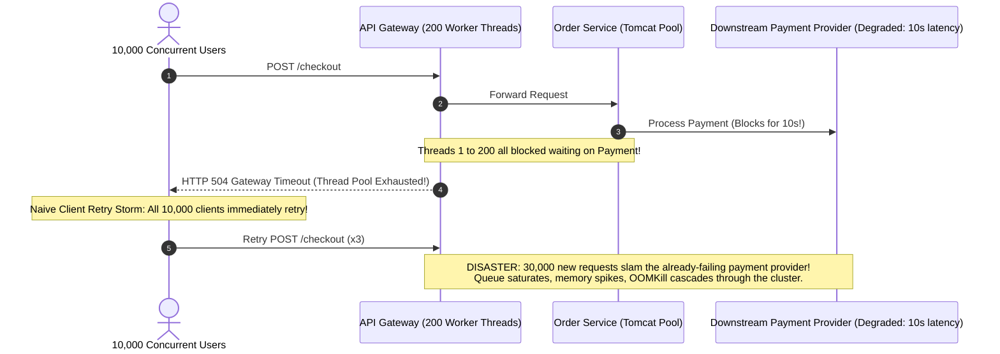
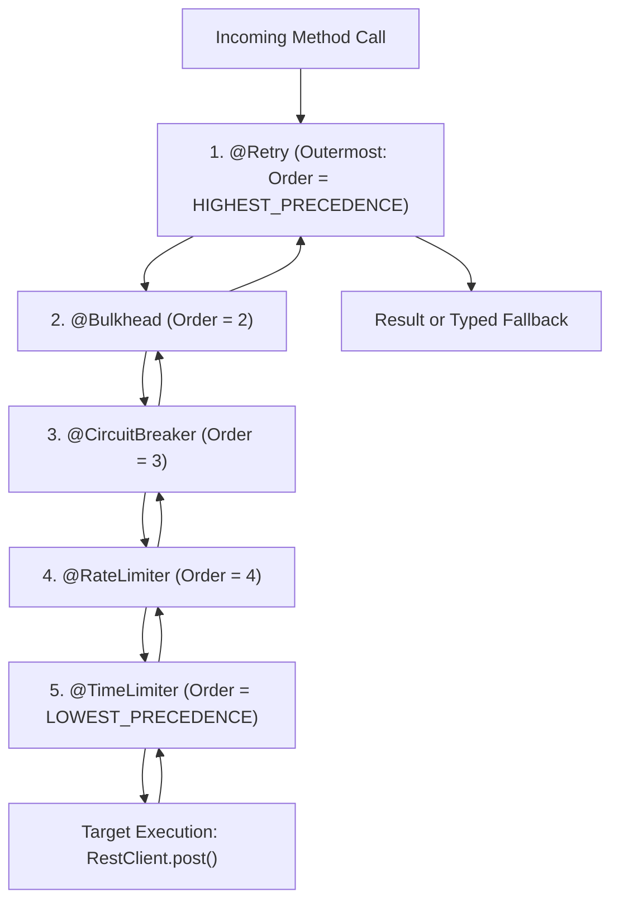
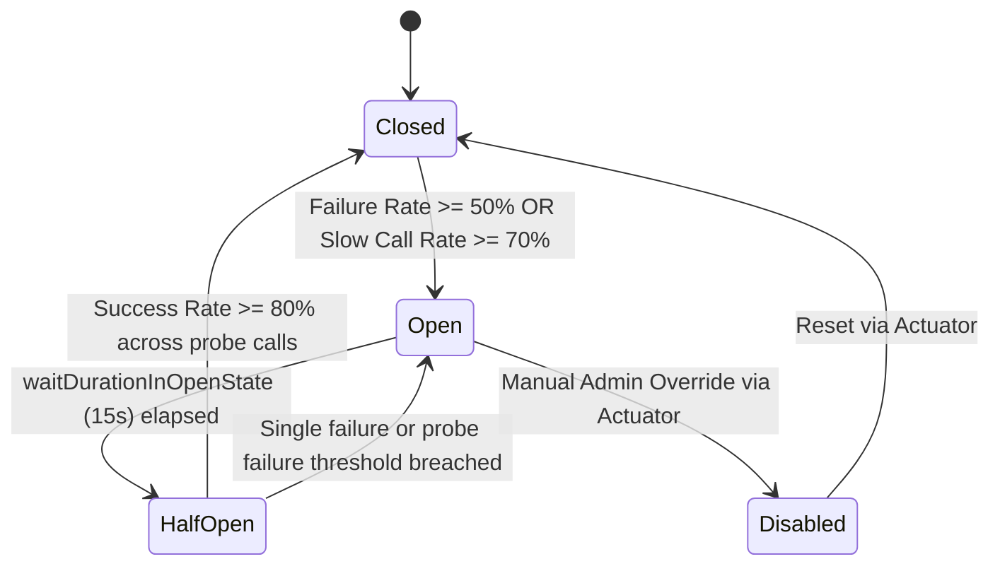
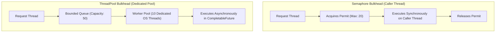
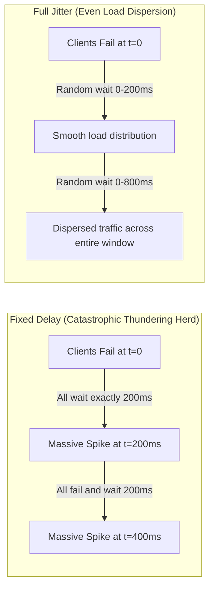
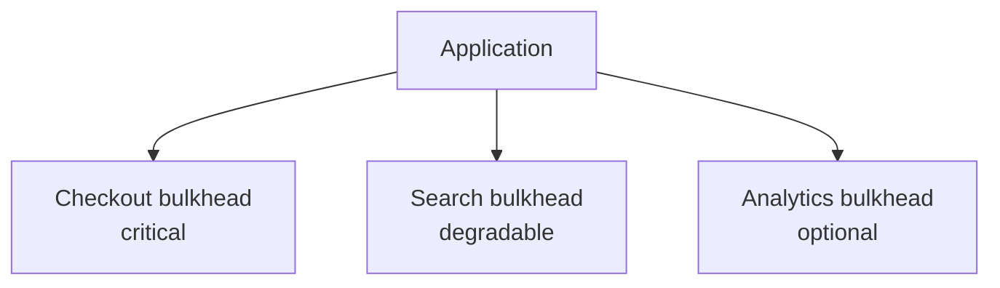

# Distributed Resilience: Circuit Breakers, Bulkheads & Adaptive Load Shedding

In a distributed backend, **remote dependency failure is an operational certainty**.
Third-party payment gateways experience socket timeouts, cloud cache clusters hit memory evictions, and downstream microservices stall under heavy garbage collection pauses.

When a downstream dependency degrades, the greatest danger is not the isolated failure itself—it is **Cascading Failure**:
A slow 2-second query in an auxiliary recommendation service can exhaust the upstream API Gateway's worker thread pool in less than 500 milliseconds, bringing down user authentication, checkout, and the entire platform.

This guide provides an exhaustive, production-grade manual for implementing distributed resilience in Spring Boot 3 using Resilience4j, adaptive concurrency limits, and chaos engineering.

---

## The Anatomy of a Cascading Outage & Retry Storms



### The 3 Amplifiers of System Collapse

1. **Unbounded Thread Blocking**: Waiting indefinitely for a remote socket without strict connection and read timeouts. In a synchronous servlet model (Tomcat), each blocked request ties up an entire operating system thread ($1\text{ MB}$ stack memory + CPU context-switching overhead).
2. **Thundering Herd Retry Storms**: When a transient network hiccup causes $N$ clients to fail, naive clients retrying on a fixed timer synchronize their retry spikes, multiplying downstream load:
   $$R_{\text{total}} = N \sum_{i=0}^k (1 - s)^i$$
   Where $N$ is initial request volume, $k$ is max retry attempts, and $s$ is the success rate ($0 \le s \le 1$). If $s = 0$ and $k = 3$, incoming traffic instantly multiplies by **$4\times$**, crushing an already degraded service.
3. **Resource Coupling**: Running critical checkout workflows and non-critical recommendation workflows in the same thread pool or database connection pool. A degradation in recommendations starves the checkout service of connections.

---

## Resilience4j Architecture & Aspect Ordering

Spring Boot integrates with **Resilience4j** via Spring AOP (Aspect-Oriented Programming). When multiple annotations (`@CircuitBreaker`, `@Retry`, `@Bulkhead`, `@RateLimiter`, `@TimeLimiter`) decorate the same method, **the execution order of the nested decorator chain dictates correctness**.



### Why Aspect Execution Order Matters

Resilience4j defines explicit AOP aspect precedence via `@Order` annotations in Spring:

```java
// Resilience4j Default Aspect Precedence Constants
RetryAspect.DEFAULT_ORDER = Ordered.LOWEST_PRECEDENCE - 4;          // 1. Outermost
BulkheadAspect.DEFAULT_ORDER = Ordered.LOWEST_PRECEDENCE - 3;       // 2.
CircuitBreakerAspect.DEFAULT_ORDER = Ordered.LOWEST_PRECEDENCE - 2; // 3.
RateLimiterAspect.DEFAULT_ORDER = Ordered.LOWEST_PRECEDENCE - 1;    // 4.
TimeLimiterAspect.DEFAULT_ORDER = Ordered.LOWEST_PRECEDENCE;        // 5. Innermost
```

| Aspect Position | Primitive | Architectural Rationale |
| :--- | :--- | :--- |
| **1. Outermost** | `@Retry` | Encompasses the entire invocation. If a transient error occurs, the retry triggers a new iteration through the bulkhead and circuit breaker. Crucially, if the Circuit Breaker is **OPEN**, the retry fails fast immediately without pounding the downstream dependency. |
| **2. Second** | `@Bulkhead` | Limits concurrent calls entering the circuit breaker. If the bulkhead queue is saturated, incoming calls are rejected immediately (`BulkheadFullException`). Because it sits outside the Circuit Breaker, bulkhead rejections **do not pollute** the circuit breaker's error statistics. |
| **3. Third** | `@CircuitBreaker` | Evaluates only requests that successfully acquired a bulkhead permit. Measures downstream failure rate and latency to make state transition decisions. |
| **4. Fourth** | `@RateLimiter` | Enforces rate caps right before execution. |
| **5. Innermost** | `@TimeLimiter` | Wraps the actual asynchronous execution. If the downstream HTTP call exceeds the timeout duration, `TimeLimiter` cancels the `CompletableFuture` and throws a `TimeoutException`, which the enclosing `CircuitBreaker` correctly records as a failure. |

<Warning>
### The Aspect Order Misconfiguration Trap
If you accidentally place `@CircuitBreaker` outside `@Retry`, every single retry attempt is hidden from the circuit breaker until all retries are exhausted. Worse, if `@Retry` is placed inside `@CircuitBreaker`, the circuit breaker records 3 failures for a single caller request, artificially tripping the circuit open prematurely!
</Warning>

---

## The 4 Resiliency Primitives Deep Dive

### 1. Circuit Breaker Internals

A Circuit Breaker operates as a state machine that monitors call outcomes and prevents calls to a failing remote dependency:



#### Sliding Window Algorithms: Count-Based vs Time-Based

Resilience4j implements two high-performance sliding window structures:

1. **COUNT_BASED**:
   - Implemented as a **Ring Bit Buffer**. If window size is 100, a bit array of 100 bits records outcomes (0 = success, 1 = failure).
   - Memory overhead is negligible (100 bits $\approx 13\text{ bytes}$).
   - Best for high-frequency, steady-volume production traffic.
2. **TIME_BASED**:
   - Implemented as a circular array of $N$ discrete time buckets (e.g., 60 1-second buckets for a 1-minute window).
   - Each bucket tracks failure count, slow call count, and total duration.
   - Prevents stale errors from 10 minutes ago from keeping a circuit breaker open during low-traffic overnight periods.

#### Key Metrics Evaluated
- **`failureRateThreshold`**: Percentage of failed calls (e.g., $\ge 50\%$) that trips the circuit.
- **`slowCallRateThreshold`**: Percentage of calls exceeding `slowCallDurationThreshold` (e.g., $2000\text{ ms}$) that trips the circuit. This prevents the "slow death" where calls succeed but take 10 seconds, exhausting upstream threads.
- **`minimumNumberOfCalls`**: Minimum sample size required in the current window before the circuit breaker calculates error rates. If set to 20, the circuit will never trip on calls 1 through 19, preventing false positives during startup.

---

### 2. Bulkhead: Semaphore vs ThreadPool vs Virtual Threads

The Bulkhead pattern partitions execution capacity so that an outage in one dependency cannot exhaust all resources on the host.



| Feature | Semaphore Bulkhead | ThreadPool Bulkhead | Virtual Threads (Java 21) |
| :--- | :--- | :--- | :--- |
| **Execution Thread** | Caller Thread (Synchronous) | Dedicated Pool Threads (Async) | Lightweight Virtual Thread per call |
| **Permit Enforcement** | `AtomicInteger` / `Semaphore` counter | Thread Pool Queue capacity | Semaphore limiting concurrency |
| **Context Switch Overhead** | Zero (no thread handoff) | Moderate to High | Negligible |
| **Memory Footprint** | Tiny ($\sim 64\text{ bytes}$) | High ($1\text{ MB}$ OS stack per thread) | Tiny ($\sim 1\text{ KB}$ per Virtual Thread) |
| **Timeout Cancellation** | Requires downstream socket timeout | Native via future cancellation | Native via structured concurrency |
| **Recommended Use Case** | Fast calls, internal DB queries, Java 21 | Slow, legacy 3rd-party blocking APIs | Modern Java 21 high-throughput I/O |

<Tip>
### Virtual Threads & Bulkheads in Java 21
In Java 21, running a `ThreadPoolBulkhead` with OS threads is an anti-pattern for pure I/O workloads. Instead, use a **Semaphore Bulkhead** over **Virtual Threads**. You get the lightweight concurrency limits of a semaphore without tying up expensive platform worker threads!
</Tip>

---

### 3. Retry with Exponential Backoff & Full Jitter Math

When multiple clients retry against a struggling server, fixed delays cause coordinated spikes. To break synchronization, we apply **Full Jitter**.



#### The Mathematical Comparison of Jitter Algorithms

AWS Architecture Research demonstrated the performance of 3 backoff strategies where $B$ is base interval ($200\text{ ms}$), $M$ is maximum backoff ($5000\text{ ms}$), and $i$ is attempt index:

1. **No Jitter**:
   $$T = \min(M, B \cdot 2^i)$$
   *Result*: Severe periodic thundering herds. Downstream services cannot recover.
2. **Equal Jitter**:
   $$T_{\text{half}} = \frac{T}{2}, \quad T_{\text{sleep}} = T_{\text{half}} + \text{random}(0, T_{\text{half}})$$
   *Result*: Partial dispersion, but still maintains synchronization around $T_{\text{half}}$.
3. **Full Jitter (Production Standard)**:
   $$T_{\text{sleep}} = \text{random}(0, \min(M, B \cdot 2^i))$$
   *Result*: Maximum load dispersion. Retries are uniformly distributed across $[0, \text{Backoff}]$, eliminating resonance spikes.

---

### 4. Adaptive Load Shedding & Little's Law

Traditional static rate limiters (e.g., 500 requests/sec) fail because service capacity is not static. When a database query slows from $10\text{ ms}$ to $200\text{ ms}$, capacity drops by $95\%$.

#### Little's Law
$$L = \lambda \times W$$
- $L$ = Number of concurrent requests in the system.
- $\lambda$ = Arrival rate (requests per second).
- $W$ = Average response time (seconds).

If arrival rate $\lambda = 1,000\text{ req/s}$ and latency $W = 0.05\text{ s}$ ($50\text{ ms}$), concurrency $L = 50$.
If downstream latency degrades to $W = 1.0\text{ s}$, concurrency explodes to $L = 1,000$. The server runs out of Tomcat threads, memory spikes, and the process dies.

**Adaptive Load Shedding** dynamically calculates maximum allowable concurrency ($L_{\text{max}}$) based on observed latency (using algorithms like TCP Vegas or Netflix Concurrency Limits). When current inflight requests exceed $L_{\text{max}}$, incoming requests are shed immediately with `HTTP 503 Service Unavailable` or `HTTP 429 Too Many Requests` at the filter layer in under $1\text{ ms}$.

---

## Production Spring Boot 3 Configuration

### Complete `application.yml`

```yaml
resilience4j:
  circuitbreaker:
    configs:
      default:
        register-health-indicator: true
        sliding-window-type: COUNT_BASED
        sliding-window-size: 50
        minimum-number-of-calls: 20
        failure-rate-threshold: 50.0 # Trip if >= 50% calls fail
        slow-call-rate-threshold: 70.0 # Trip if >= 70% calls exceed slow duration
        slow-call-duration-threshold: 2000ms
        wait-duration-in-open-state: 15000ms # Stay OPEN for 15s before HALF_OPEN
        permitted-number-of-calls-in-half-open-state: 10
        automatic-transition-from-open-to-half-open-enabled: true
        record-exceptions:
          - java.io.IOException
          - java.util.concurrent.TimeoutException
          - org.springframework.web.client.ResourceAccessException
          - org.springframework.web.client.HttpServerErrorException
        ignore-exceptions:
          - com.example.resilience.exception.ValidationException # 400 Bad Request is not a service outage!
          - com.example.resilience.exception.ResourceNotFoundException # 404 Not Found is business logic!

    instances:
      paymentClient:
        base-config: default
        sliding-window-size: 100

  retry:
    configs:
      default:
        max-attempts: 3
        wait-duration: 200ms
        enable-exponential-backoff: true
        exponential-backoff-multiplier: 2.0
        enable-randomized-wait: true # Applies Full Jitter
        retry-exceptions:
          - java.io.IOException
          - org.springframework.web.client.ResourceAccessException
        ignore-exceptions:
          - com.example.resilience.exception.NonRetryableBusinessException

    instances:
      paymentClient:
        base-config: default

  bulkhead:
    instances:
      paymentClientSemaphore:
        max-concurrent-calls: 30
        max-wait-duration: 20ms

  thread-pool-bulkhead:
    instances:
      paymentClientPool:
        core-thread-pool-size: 10
        max-thread-pool-size: 20
        queue-capacity: 50
        keep-alive-duration: 20ms

  timelimiter:
    instances:
      paymentClientPool:
        timeout-duration: 3000ms
        cancel-running-future: true

management:
  endpoints:
    web:
      exposure:
        include: "health,metrics,circuitbreakers,circuitbreakerevents"
  endpoint:
    health:
      show-details: always
  health:
    circuitbreakers:
      enabled: true
```

---

## Production Java Implementation: Resilient Payment Service

Here is a complete, enterprise-grade payment integration demonstrating aspect composition, typed fallback methods, custom event logging, and proper exception categorization.

### 1. Payment Domain Records & Exceptions

```java
package com.example.resilience.domain;

import java.math.BigDecimal;
import java.time.Instant;

public record PaymentChargeRequest(
    String orderId,
    String customerId,
    BigDecimal amount,
    String currency,
    String idempotencyKey
) {}

public record PaymentChargeResponse(
    String transactionId,
    String orderId,
    PaymentStatus status,
    String message,
    Instant timestamp
) {}

public enum PaymentStatus {
    SETTLED,
    QUEUED_FOR_OFFLINE_SETTLEMENT,
    FAILED
}
```

```java
package com.example.resilience.exception;

public sealed class PaymentException extends RuntimeException 
    permits PaymentException.TransientGatewayException, PaymentException.TerminalBusinessException {

    public PaymentException(String message) {
        super(message);
    }

    public static final class TransientGatewayException extends PaymentException {
        public TransientGatewayException(String message) {
            super(message);
        }
    }

    public static final class TerminalBusinessException extends PaymentException {
        public TerminalBusinessException(String message) {
            super(message);
        }
    }
}
```

---

### 2. The Resilient Client Implementation

```java
package com.example.resilience.adapter;

import com.example.resilience.domain.PaymentChargeRequest;
import com.example.resilience.domain.PaymentChargeResponse;
import com.example.resilience.domain.PaymentStatus;
import com.example.resilience.exception.PaymentException;
import io.github.resilience4j.bulkhead.annotation.Bulkhead;
import io.github.resilience4j.circuitbreaker.CallNotPermittedException;
import io.github.resilience4j.circuitbreaker.annotation.CircuitBreaker;
import io.github.resilience4j.retry.annotation.Retry;
import io.github.resilience4j.timelimiter.annotation.TimeLimiter;
import org.slf4j.Logger;
import org.slf4j.LoggerFactory;
import org.springframework.http.HttpStatusCode;
import org.springframework.stereotype.Service;
import org.springframework.web.client.RestClient;

import java.time.Instant;
import java.util.concurrent.CompletableFuture;

@Service
public class ResilientPaymentClient {

    private static final Logger log = LoggerFactory.getLogger(ResilientPaymentClient.class);
    private final RestClient restClient;

    public ResilientPaymentClient(RestClient.Builder builder) {
        this.restClient = builder
                .baseUrl("https://api.payment-gateway.internal/v1")
                .defaultStatusHandler(
                        HttpStatusCode::is4xxClientError,
                        (req, resp) -> {
                            throw new PaymentException.TerminalBusinessException(
                                "Payment rejected by upstream: HTTP " + resp.getStatusCode()
                            );
                        }
                )
                .defaultStatusHandler(
                        HttpStatusCode::is5xxServerError,
                        (req, resp) -> {
                            throw new PaymentException.TransientGatewayException(
                                "Payment provider internal server error: HTTP " + resp.getStatusCode()
                            );
                        }
                )
                .build();
    }

    /**
     * Executes payment processing decorated by:
     * 1. Retry (Outermost)
     * 2. ThreadPool Bulkhead (Permit isolation)
     * 3. CircuitBreaker (Failure rate tracking)
     * 4. TimeLimiter (Innermost timeout cancellation)
     */
    @Bulkhead(name = "paymentClientPool", type = Bulkhead.Type.THREADPOOL)
    @TimeLimiter(name = "paymentClientPool")
    @CircuitBreaker(name = "paymentClient", fallbackMethod = "chargeFallback")
    @Retry(name = "paymentClient")
    public CompletableFuture<PaymentChargeResponse> processChargeAsync(PaymentChargeRequest request) {
        return CompletableFuture.supplyAsync(() -> {
            log.info("Dispatching payment charge over network for orderId={}", request.orderId());

            return restClient.post()
                    .uri("/charges")
                    .header("Idempotency-Key", request.idempotencyKey())
                    .body(request)
                    .retrieve()
                    .body(PaymentChargeResponse.class);
        });
    }

    // =========================================================================
    // Typed Fallback Methods
    // =========================================================================

    /**
     * Specific Fallback when Circuit Breaker is OPEN.
     * Prevents hammering down dependency and queues for asynchronous reconciliation.
     */
    public CompletableFuture<PaymentChargeResponse> chargeFallback(
            PaymentChargeRequest request, CallNotPermittedException ex) {
        log.warn("Payment CircuitBreaker is OPEN. Degraded execution for orderId={}. Short-circuiting.", request.orderId());

        return CompletableFuture.completedFuture(
                new PaymentChargeResponse(
                        "DEGRADED-" + request.orderId(),
                        request.orderId(),
                        PaymentStatus.QUEUED_FOR_OFFLINE_SETTLEMENT,
                        "Payment gateway unavailable. Queued for asynchronous background settlement.",
                        Instant.now()
                )
        );
    }

    /**
     * Specific Fallback when Bulkhead queue is full.
     */
    public CompletableFuture<PaymentChargeResponse> chargeFallback(
            PaymentChargeRequest request, io.github.resilience4j.bulkhead.BulkheadFullException ex) {
        log.error("Payment Bulkhead saturated! Concurrency limit reached for orderId={}", request.orderId());

        return CompletableFuture.completedFuture(
                new PaymentChargeResponse(
                        "REJECTED-" + request.orderId(),
                        request.orderId(),
                        PaymentStatus.FAILED,
                        "Payment processing overloaded. Please retry in a few moments.",
                        Instant.now()
                )
        );
    }

    /**
     * Generic Catch-all Fallback for exhausted retries or network failures.
     */
    public CompletableFuture<PaymentChargeResponse> chargeFallback(
            PaymentChargeRequest request, Throwable ex) {
        log.error("Payment processing failed permanently after retries for orderId={}. Reason: {}", 
                request.orderId(), ex.getMessage());

        return CompletableFuture.completedFuture(
                new PaymentChargeResponse(
                        "FAILED-" + request.orderId(),
                        request.orderId(),
                        PaymentStatus.FAILED,
                        "Payment failed: " + ex.getMessage(),
                        Instant.now()
                )
        );
    }
}
```

---

### 3. Circuit Breaker Event Listener & Metrics Logging

```java
package com.example.resilience.listener;

import io.github.resilience4j.circuitbreaker.CircuitBreakerRegistry;
import jakarta.annotation.PostConstruct;
import org.slf4j.Logger;
import org.slf4j.LoggerFactory;
import org.springframework.stereotype.Component;

@Component
public class CircuitBreakerMetricsPublisher {

    private static final Logger log = LoggerFactory.getLogger(CircuitBreakerMetricsPublisher.class);
    private final CircuitBreakerRegistry registry;

    public CircuitBreakerMetricsPublisher(CircuitBreakerRegistry registry) {
        this.registry = registry;
    }

    @PostConstruct
    public void registerListeners() {
        registry.circuitBreaker("paymentClient").getEventPublisher()
                .onStateTransition(event -> log.warn("CIRCUIT BREAKER STATE CHANGE: {} -> {}", 
                        event.getCircuitBreakerName(), event.getStateTransition()))
                .onCallNotPermitted(event -> log.debug("Call short-circuited: {}", event.getCircuitBreakerName()))
                .onError(event -> log.warn("Call failed in {}: duration={}ms, error={}",
                        event.getCircuitBreakerName(), 
                        event.getElapsedDuration().toMillis(), 
                        event.getThrowable().toString()))
                .onSlowCallRateExceeded(event -> log.error("SLOW CALL RATE EXCEEDED on {}: rate={}%",
                        event.getCircuitBreakerName(), event.getSlowCallRate()));
    }
}
```

---

## Chaos Engineering with Testcontainers & Toxiproxy

Never deploy resilience configurations without verifying them under real simulated network chaos. Below is a production integration test using **Testcontainers** and **Shopify Toxiproxy** to prove that latency trips the circuit breaker and triggers fallbacks.

```java
package com.example.resilience;

import com.example.resilience.adapter.ResilientPaymentClient;
import com.example.resilience.domain.PaymentChargeRequest;
import com.example.resilience.domain.PaymentChargeResponse;
import com.example.resilience.domain.PaymentStatus;
import eu.rekawek.toxiproxy.Proxy;
import eu.rekawek.toxiproxy.ToxiproxyClient;
import eu.rekawek.toxiproxy.model.ToxicDirection;
import org.junit.jupiter.api.BeforeEach;
import org.junit.jupiter.api.DisplayName;
import org.junit.jupiter.api.Test;
import org.springframework.beans.factory.annotation.Autowired;
import org.springframework.boot.test.context.SpringBootTest;
import org.testcontainers.containers.GenericContainer;
import org.testcontainers.containers.Network;
import org.testcontainers.junit.jupiter.Container;
import org.testcontainers.junit.jupiter.Testcontainers;

import java.io.IOException;
import java.math.BigDecimal;
import java.util.UUID;
import java.util.concurrent.CompletableFuture;

import static org.assertj.core.api.Assertions.assertThat;

@SpringBootTest
@Testcontainers
class ResilientPaymentClientChaosTest {

    private static final Network NETWORK = Network.newNetwork();

    @Container
    private static final GenericContainer<?> TOXIPROXY = new GenericContainer<>("ghcr.io/shopify/toxiproxy:2.5.0")
            .withNetwork(NETWORK)
            .withExposedPorts(8474, 8666);

    @Autowired
    private ResilientPaymentClient paymentClient;

    private Proxy paymentProxy;

    @BeforeEach
    void setUp() throws IOException {
        ToxiproxyClient toxiClient = new ToxiproxyClient(
                TOXIPROXY.getHost(), 
                TOXIPROXY.getMappedPort(8474)
        );
        // Upstream mock server simulated at port 8080
        paymentProxy = toxiClient.getProxy("payment-service");
        if (paymentProxy != null) {
            paymentProxy.delete();
        }
        paymentProxy = toxiClient.createProxy("payment-service", "0.0.0.0:8666", "mock-payment-server:8080");
    }

    @Test
    @DisplayName("When downstream payment provider latency spikes to 4s, TimeLimiter cancels and Circuit Breaker trips OPEN")
    void testDownstreamLatencyTripsCircuitBreaker() throws Exception {
        // Inject 4000ms latency toxic (Threshold is 2000ms, Timeout is 3000ms)
        paymentProxy.toxics()
                .latency("high-latency", ToxicDirection.DOWNSTREAM, 4000)
                .setJitter(200);

        PaymentChargeRequest request = new PaymentChargeRequest(
                "ORD-9999",
                "CUST-123",
                BigDecimal.valueOf(149.99),
                "USD",
                UUID.randomUUID().toString()
        );

        // Execute call - will exceed TimeLimiter (3000ms) and fallback
        CompletableFuture<PaymentChargeResponse> futureResponse = paymentClient.processChargeAsync(request);
        PaymentChargeResponse response = futureResponse.get();

        assertThat(response).isNotNull();
        // Fallback kicks in and safely fails or queues the request
        assertThat(response.status()).isIn(PaymentStatus.FAILED, PaymentStatus.QUEUED_FOR_OFFLINE_SETTLEMENT);
    }
}
```

---

## Production Failure Modes & Operational Runbooks

### Resilience Failure Matrix

| Failure Mode | Root Cause | Blast Radius | Immediate Runbook Mitigation | Long-Term Fix |
| :--- | :--- | :--- | :--- | :--- |
| **Circuit Breaker Stuck in OPEN** | Stale error count or persistent health probe failure in half-open state. | 100% of calls fail fast; users cannot complete payment. | Execute Actuator transition override: `POST /actuator/circuitbreakers/paymentClient/transitions` with `{"state":"FORCED_OPEN"}` or reset to `CLOSED`. | Tune `permittedNumberOfCallsInHalfOpenState` and verify downstream health before allowing production traffic. |
| **Fallback Cascade (Thundering Reads)** | Fallback returns cached read from Redis, but Redis cluster is saturated by the massive fallback load. | Redis CPU reaches 100%; cache collapses. | Shed traffic via Edge API Gateway with HTTP 429. | Add local in-memory L1 cache (Caffeine) before querying L2 Redis in fallbacks. |
| **Deadlock on Nested Retries** | Service A retries Service B ($3\times$), which retries Service C ($3\times$), which retries Service D ($3\times$). | $3 \times 3 \times 3 = 27\times$ multiplicative amplification across microservice graph. | Trip upstream circuit breaker at API Gateway. | Strictly enforce retries **only at the edge** or mark downstream calls non-retryable via error response headers. |
| **Thread Pool Bulkhead Starvation** | Caller threads block waiting for available threads in the bulkhead pool. | Caller thread exhaustion in Tomcat. | Increase queue capacity or switch to Semaphore Bulkhead with Java 21 Virtual Threads. | Optimize downstream query latency; decouple long workflows using an asynchronous Event-Driven architecture (Kafka). |

---

### Operational Runbook: Manual Emergency Circuit Breaker Control via Actuator

When a downstream payment gateway has completed an emergency hotfix and is ready to receive traffic immediately without waiting for `waitDurationInOpenState` to expire:

#### 1. Inspect Current State
```bash
curl -X GET http://localhost:8080/actuator/circuitbreakers
```
*Response*:
```json
{
  "circuitBreakers": {
    "paymentClient": {
      "state": "OPEN",
      "failureRate": "82.4%",
      "slowCallRate": "91.2%",
      "bufferedCalls": 100,
      "failedCalls": 82,
      "slowCalls": 91
    }
  }
}
```

#### 2. Transition State to CLOSED
```bash
curl -X POST http://localhost:8080/actuator/circuitbreakers/paymentClient/transitions \
  -H "Content-Type: application/json" \
  -d '{"state": "CLOSED"}'
```

#### 3. Disable Circuit Breaker During Emergency Maintenance
```bash
curl -X POST http://localhost:8080/actuator/circuitbreakers/paymentClient/transitions \
  -H "Content-Type: application/json" \
  -d '{"state": "DISABLED"}'
```

---

## Resilience Fundamentals Interview Map

Resilience means limiting blast radius when something is slow, broken, overloaded, or lying.

### 1. Timeout vs retry vs circuit breaker vs bulkhead

| Pattern | Protects Against | Failure If Missing |
| :--- | :--- | :--- |
| Timeout | Infinite waits | Threads hang forever |
| Retry | Short transient failures | One packet loss becomes user-visible failure |
| Circuit breaker | Repeated known failures | App keeps hammering a dead dependency |
| Bulkhead | Shared resource exhaustion | One dependency consumes all threads/connections |
| Rate limiter | Too much incoming traffic | Server overload |

### 2. Retries can make outages worse

If 1,000 requests fail and each retries 3 times instantly, the downstream receives 4,000 attempts during the same failure window.


Always define:

- Which exceptions are retryable.
- Maximum attempts.
- Backoff.
- Jitter.
- Overall deadline.

### 3. Bulkheads protect critical flows

Do not let analytics, search, or recommendation calls consume the same concurrency budget as checkout.



### 4. Fallbacks must not fake successful writes

Safe fallback:

```java
return ProductCatalog.cachedFallback();
```

Unsafe fallback:

```java
return new PaymentResult("SUCCESS"); // card was not charged
```

Fallbacks may serve stale reads, queue work, or return explicit degraded states. They must not invent completed mutations.

### Build-Break-Fix Lab

<Steps>
  <Step title="Build">
    Call a payment service from checkout with timeout, retry, circuit breaker, and bulkhead.
  </Step>
  <Step title="Break">
    Make the payment service hang, then return intermittent `500` responses.
  </Step>
  <Step title="Observe">
    Watch thread usage, retry amplification, circuit state, and user-facing status.
  </Step>
  <Step title="Fix">
    Add bounded retries with full jitter, ignore client errors, and use a safe fallback state.
  </Step>
  <Step title="Prove">
    Add WireMock/Toxiproxy tests for timeout, retry count, circuit open, half-open recovery, and fallback correctness.
  </Step>
</Steps>

---

## Active Recall & System Design Interview Questions

<AccordionGroup>
  <Accordion title="1. Explain the difference between Semaphore Bulkheads and ThreadPool Bulkheads, and how Java 21 Virtual Threads impact this choice.">
    A **Semaphore Bulkhead** limits concurrency using an atomic permit counter (`Semaphore`) on the caller's existing thread. It has virtually zero memory overhead ($\sim 64\text{ bytes}$) and no context-switching latency, making it ideal for fast, high-throughput internal operations.
    
    A **ThreadPool Bulkhead** offloads execution to an isolated, dedicated operating system thread pool with a bounded queue. It completely isolates the caller thread and supports native async timeout cancellation, but incurs thread stack memory ($1\text{ MB}$ per thread) and CPU context-switching overhead.
    
    **In Java 21 with Virtual Threads**, the thread pool model becomes redundant for I/O bounds. You can dispatch calls on lightweight virtual threads while using a **Semaphore Bulkhead** to constrain downstream concurrency. This yields the protection of a bulkhead without the heavy resource footprint of platform thread pools.
  </Accordion>

  <Accordion title="2. Why is Full Jitter mathematically superior to Equal Jitter or No Jitter during client retries?">
    Under **No Jitter**, retries occur at fixed intervals:
    $$T = B \cdot 2^i$$
    Every client that failed at time $t_0$ will synchronize its retry at exactly $t_0 + 200\text{ ms}$, then $t_0 + 400\text{ ms}$, creating severe periodic spikes known as the **Thundering Herd**.
    
    **Equal Jitter** guarantees a minimum sleep duration ($T/2$) and randomizes the remainder. While better, it still creates clustering around the half-delay mark.
    
    **Full Jitter** selects uniformly from $[0, \min(M, B \cdot 2^i)]$:
    $$T_{\text{sleep}} = \text{random}(0, \min(M, B \cdot 2^i))$$
    This mathematically achieves maximum entropy, dispersing client retries evenly across the entire timeline and allowing the downstream server to process queued requests smoothly.
  </Accordion>

  <Accordion title="3. What is the execution order of Resilience4j aspects and what failure occurs if @Retry is placed inside @CircuitBreaker?">
    The default execution order is:
    $$\text{Retry} \rightarrow \text{Bulkhead} \rightarrow \text{CircuitBreaker} \rightarrow \text{RateLimiter} \rightarrow \text{TimeLimiter}$$
    `@Retry` must be the outermost decorator. If `@Retry` is improperly placed *inside* `@CircuitBreaker`, the circuit breaker intercepts each individual attempt. A single customer request that retries 3 times and fails will increment the circuit breaker's failure counter by **3**, artificially inflating the failure rate and tripping the circuit open prematurely on low traffic volumes.
  </Accordion>

  <Accordion title="4. How does Little's Law explain why a 100ms latency degradation causes upstream server crashes?">
    Little's Law states:
    $$L = \lambda \times W$$
    Where $L$ is concurrency, $\lambda$ is arrival rate, and $W$ is mean response time.
    
    Suppose a service handles $\lambda = 2,000\text{ req/s}$ with a normal response time of $W = 10\text{ ms}$ ($0.01\text{ s}$). The required concurrency is:
    $$L = 2,000 \times 0.01 = 20\text{ concurrent threads}$$
    If a downstream database query degrades to $W = 500\text{ ms}$ ($0.5\text{ s}$), required concurrency becomes:
    $$L = 2,000 \times 0.5 = 1,000\text{ concurrent threads}$$
    Because standard servlet containers (Tomcat) cap thread pools at 200 threads, the thread pool is completely exhausted in under $100\text{ ms}$. All subsequent requests wait in an unbounded queue, memory explodes, and the container experiences an OOMKill or Kubernetes liveness probe failure.
  </Accordion>

  <Accordion title="5. What are the dangers of returning a fake SUCCESS response in a Circuit Breaker fallback?">
    The **Fallback-As-Success Anti-Pattern** occurs when a developer writes:
    ```java
    public PaymentResponse fallback(PaymentRequest req, Throwable t) {
        return new PaymentResponse(req.orderId(), PaymentStatus.SUCCESS);
    }
    ```
    This corrupts distributed state. The user's credit card was never charged, yet the order service marks the order as paid and begins warehouse fulfillment.
    
    **Rule**: Fallbacks must only return safe, degraded read models (cached data, default static configs) or explicit deferred states (`QUEUED_FOR_OFFLINE_SETTLEMENT`). Never invent successful mutations or writes in a fallback.
  </Accordion>

  <Accordion title="6. What is the difference between COUNT_BASED and TIME_BASED sliding windows in Resilience4j?">
    A **COUNT_BASED** window evaluates the outcome of the last $N$ requests (e.g., 100 calls) using an in-memory Ring Bit Buffer. It is computationally lightweight and ideal for predictable, high-throughput endpoints.
    
    A **TIME_BASED** window evaluates requests across the last $N$ seconds (e.g., 60 seconds) broken into discrete 1-second buckets. It is essential for low-traffic or bursty endpoints: if an endpoint receives only 10 requests an hour, a `COUNT_BASED` window of 100 calls would preserve an error that occurred 10 hours ago, preventing the circuit breaker from closing. A `TIME_BASED` window naturally purges old errors once the time window elapses.
  </Accordion>

  <Accordion title="7. How does Adaptive Load Shedding differ from traditional static rate limiting?">
    Static rate limiting enforces a fixed ceiling (e.g., 1,000 req/s) based on guesswork. It fails when backend capacity fluctuates—for example, during database lock contention, where the server might crash at only 200 req/s.
    
    **Adaptive Load Shedding** dynamically measures internal server distress metrics:
    1. Queue wait latency (CoDel / Controlled Delay algorithm)
    2. CPU saturation ($\ge 85\%$)
    3. Concurrency limits adjusted via additive-increase/multiplicative-decrease (AIMD / TCP Vegas).
    
    When distress is detected, the load shedder immediately drops non-critical requests (search, analytics) with `HTTP 503` in under $1\text{ ms}$, reserving remaining CPU and connections for critical transactions (checkout, auth).
  </Accordion>

  <Accordion title="8. How should Resilience4j exceptions be categorized to prevent false-positive circuit breaker trips?">
    Exceptions must be strictly partitioned into two categories in configuration:
    1. **`record-exceptions`**: Infrastructure and system-level failures indicating remote dependency distress:
       - `IOException`, `TimeoutException`, `ResourceAccessException`, `HttpServerErrorException` (5xx).
    2. **`ignore-exceptions`**: Client errors and normal business domain exceptions:
       - `IllegalArgumentException`, `ValidationException`, `HttpClientErrorException.BadRequest` (400), `NotFoundException` (404).
    
    If client-side validation errors (400 Bad Request) are recorded as failures, malicious or buggy clients sending invalid payloads will trip the circuit breaker open, blocking legitimate users from accessing the service.
  </Accordion>
</AccordionGroup>
