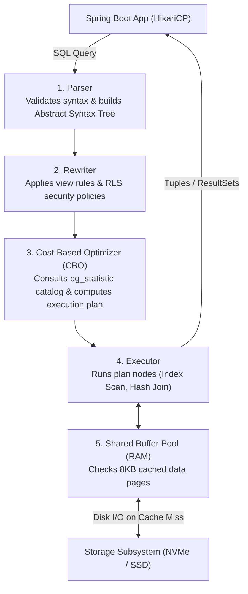
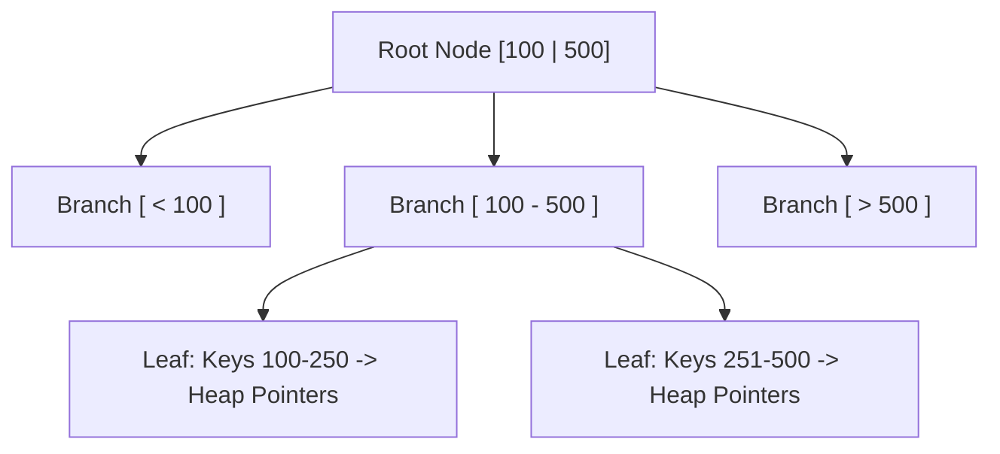
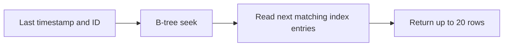

## 1. Mental Model: The Hardware Bottleneck Reality

In backend engineering, over 80% of application latency spikes, thread starvation incidents, and server outages trace directly back to the database tier.

When an application server degrades, scaling horizontally (adding more Kubernetes pods) often **worsens the problem**: each new pod opens additional database connections, increasing lock contention and saturating PostgreSQL's CPU and disk I/O.

True backend mastery requires understanding how the database engine executes queries under the hood:



---

## 2. Deep Dive: Index Internals & Types

An index is an auxiliary data structure that trades write throughput and storage space for fast read retrieval.

### B-Tree Indexes (Default)
Standard B-Trees are balanced multi-way search trees with high branching factors (fanout). Every leaf node sits at the exact same depth from the root and holds pointers (Tuple IDs / TIDs: block number + item offset) to actual table heap rows:



- **Lookup Complexity**: $O(\log N)$ disk page reads.
- **Page Splits**: When an 8KB leaf page fills during an insert, Postgres splits it into two 50% full pages. Frequent splits cause index bloat. Tuning `WITH (fillfactor = 90)` leaves headroom for in-place updates on write-heavy tables.

---

### GIN Indexes (Generalized Inverted Index)
Ideal for data types with internal multi-valued components: `JSONB`, PostgreSQL arrays (`VARCHAR[]`), and full-text search:

```sql
-- Fast lookup for JSONB metadata attributes
CREATE INDEX idx_orders_metadata ON orders USING gin (metadata jsonb_path_ops);

-- Query uses index directly via containment operator (@>):
SELECT id, total_cents FROM orders
WHERE metadata @> '{"source": "mobile", "campaign": "summer2026"}';
```

---

### Partial Indexes
Indexes only a subset of table rows matching a boolean condition. This saves RAM, reduces write overhead, and keeps cache hit rates high:

```sql
-- In an orders table with 10M rows, only 0.5% are unfulfilled:
CREATE INDEX idx_unfulfilled_orders 
ON orders(created_at) 
WHERE status IN ('PENDING', 'PROCESSING');
```
A query for pending orders scans a tiny 50,000-row index instead of a 10,000,000-row index!

---

### Covering Indexes with the `INCLUDE` Clause (Index-Only Scans)
An **Index-Only Scan** occurs when all requested columns exist directly within the index itself, completely eliminating physical heap table reads:

```sql
-- Normal composite index: All 3 columns stored in B-Tree search keys (higher split overhead)
-- Covering index: email is the search key; id and created_at are carried payloads!
CREATE INDEX idx_users_email_covering ON users (email) INCLUDE (id, created_at);

-- Completely bypasses heap table reads via Index-Only Scan:
SELECT id, created_at FROM users WHERE email = 'alice@example.com';
```

---

## 3. Execution Plan Anatomy: Deconstructing `EXPLAIN (ANALYZE, BUFFERS)`

Never guess how a database executes your query. Run `EXPLAIN (ANALYZE, BUFFERS)`:

```sql
EXPLAIN (ANALYZE, BUFFERS, COSTS)
SELECT u.id, u.email, o.total_cents
FROM users u
JOIN orders o ON u.id = o.user_id
WHERE u.status = 'ACTIVE' AND o.created_at > '2026-01-01';
```

### Deconstructing the Plan Output:
```sql
Hash Join  (cost=125.50..1420.30 rows=512 width=48) (actual time=1.210..14.350 rows=480 loops=1)
  Hash Cond: (o.user_id = u.id)
  Buffers: shared hit=840 read=12
  ->  Index Scan using idx_orders_created ON orders o  (cost=0.43..850.12 rows=1200 width=24) (actual time=0.045..5.120 rows=1100 loops=1)
        Index Cond: (created_at > '2026-01-01'::timestamptz)
        Buffers: shared hit=410 read=8
  ->  Hash  (cost=85.20..85.20 rows=2500 width=32) (actual time=1.120..1.120 rows=2480 loops=1)
        Buckets: 4096  Batches: 1  Memory Usage: 180kB
        Buffers: shared hit=430 read=4
        ->  Index Scan using idx_users_status ON users u  (cost=0.29..85.20 rows=2500 width=32) (actual time=0.030..0.850 rows=2480 loops=1)
              Index Cond: (status = 'ACTIVE'::text)
              Buffers: shared hit=430 read=4
Planning Time: 0.350 ms
Execution Time: 14.850 ms
```

### Key Metrics Decoded:
1. **`cost=125.50..1420.30`**:
   - `125.50`: **Startup Cost** (arbitrary cost units elapsed before returning the very first row).
   - `1420.30`: **Total Cost** (estimated cost to retrieve all matching rows).
2. **`actual time=1.210..14.350`**: Real clock time in milliseconds elapsed on hardware.
3. **`Buffers: shared hit=840 read=12`**:
   - `hit=840`: 840 8KB pages (6.72 MB) were retrieved instantly from RAM (**Shared Buffer Pool**).
   - `read=12`: 12 8KB pages (96 KB) suffered a cache miss and were fetched from physical NVMe disk.
   - **Buffer Cache Hit Ratio**:
     $$\text{Hit Ratio} = \frac{\text{Hits}}{\text{Hits} + \text{Reads}} = \frac{840}{840 + 12} = \mathbf{98.59\%}$$
     (Production target: $> 99\%$).

---

## 4. Scan Types & Physical Join Algorithms

### The 4 PostgreSQL Scan Types:
- **Sequential Scan (`Seq Scan`)**: Reads every 8KB disk page of the table from start to finish ($O(N)$). Fast for small tables ($< 500$ rows), disastrous for 10M-row tables.
- **Index Scan**: Walks the B-Tree index to find Tuple IDs, then performs random I/O lookups to the heap table for each row.
- **Index Only Scan**: Fetches data directly from the index leaf pages without touching the heap table (checked against the table **Visibility Map**).
- **Bitmap Index Scan**: Scans the index to build a memory bitmap of matching disk pages, sorts the page references sequentially, and reads heap pages in sequential order, eliminating random disk thrashing.

---

### The 3 Physical Join Algorithms:

| Join Algorithm | Mechanism | Optimal Use Case |
| :--- | :--- | :--- |
| **Nested Loop Join** | For every row in outer table, probes inner table via index | Small outer table joined with indexed inner table |
| **Hash Join** | Builds in-memory hash table of smaller table, probes it with larger table | Large, unsorted datasets with equality conditions (`=`) |
| **Merge Join** | Sorts both tables on join key and steps through them simultaneously | Both inputs are pre-sorted by index or large range queries |

---

## 5. HikariCP Connection Pool Sizing: Measure the Database Budget

A connection pool limits how many requests may use the database at once. More connections can improve utilization when queries wait for I/O. Too many can increase contention and make every query slower.

HikariCP documents this historical **starting point**:

$$\text{Active Connections} \approx (\text{CPU Cores} \times 2) + \text{Effective Spindle Count}$$

It is not a hardware law. Effective spindle count describes disk wait; it is zero for a fully cached workload and does not map directly to NVMe device count. Choose a starting value, then measure throughput, p95/p99 latency, pool wait, and database saturation under realistic traffic. See [HikariCP's pool-sizing guidance](https://github.com/brettwooldridge/HikariCP/wiki/About-Pool-Sizing).

Budget across **all replicas and background jobs**. Ten pods with a pool of 20 can open 200 connections. Reserve database capacity for migrations, operations, and failover. Match pool acquisition timeouts to the request deadline; waiting 20 seconds is not fast failure for a 1-second API budget.

### Production `application.yml` HikariCP Configuration:
```yaml
spring:
  datasource:
    hikari:
      maximum-pool-size: 20
      minimum-idle: 10
      idle-timeout: 300000       # 5 minutes
      connection-timeout: 500    # Example only: leave time within the request deadline
      max-lifetime: 1800000      # 30 minutes (retires old connections cleanly)
      leak-detection-threshold: 3000 # Alert if a thread holds connection > 3s!
```

---

## 6. Keyset (Cursor) Pagination vs The Offset Trap

### The `LIMIT / OFFSET` Disaster
A traditional pagination query:
```sql
-- ANTI-PATTERN: EXTREMELY SLOW FOR DEEP PAGES!
SELECT id, title, created_at 
FROM articles 
ORDER BY created_at DESC 
LIMIT 20 OFFSET 1000000;
```
#### Why deep offsets cost more
PostgreSQL must compute and discard the skipped rows. A matching index may avoid sorting, and cached pages may avoid disk reads, but neither removes the work of stepping over the offset. For offset $o$ and page size $k$, this typically means processing at least $o + k$ rows. See [PostgreSQL LIMIT and OFFSET](https://www.postgresql.org/docs/16/queries-limit.html).

### Keyset pagination: seek to a known position
A cursor stores the last row's sort keys. Use a unique tie-breaker so rows with equal timestamps have a stable order:

```sql
CREATE INDEX idx_articles_created_id ON articles (created_at DESC, id DESC);

SELECT id, title, created_at
FROM articles
WHERE (created_at, id) < ('2026-03-01 14:20:00+00', 98452)
ORDER BY created_at DESC, id DESC
LIMIT 20;
```

For a matching B-tree index and selective query, the useful model is **$O(\log N + k)$**: seek into the tree, then read a page of $k$ rows. The work does not grow with the page number as an offset does. Filters, visibility checks, cache state, and row width still affect cost. This is an inference from [PostgreSQL's ordered-index behavior](https://www.postgresql.org/docs/16/indexes-ordering.html), not a constant-time latency guarantee.



Use non-null, stable sort columns. Include tenant and filter constraints on every page. Encode the cursor as an API token and validate it on input. Keyset pagination supports next/previous navigation; arbitrary page numbers and consistent snapshots across separate requests need additional design.

### Spring Data JPA repository shape

```java
package com.backend.mastery.database.pagination;

import org.springframework.data.domain.Pageable;
import org.springframework.data.jpa.repository.JpaRepository;
import org.springframework.data.jpa.repository.Query;
import org.springframework.data.repository.query.Param;

import java.time.Instant;
import java.util.List;

public interface ArticleRepository extends JpaRepository<Article, Long> {

    // First page (no cursor)
    @Query("""
        SELECT a FROM Article a 
        ORDER BY a.createdAt DESC, a.id DESC 
        """)
    List<Article> findFirstPage(Pageable pageable);

    // Subsequent pages use a cursor predicate and a page-size limit
    @Query("""
        SELECT a FROM Article a 
        WHERE (a.createdAt < :lastCreatedAt) 
           OR (a.createdAt = :lastCreatedAt AND a.id < :lastId) 
        ORDER BY a.createdAt DESC, a.id DESC 
        """)
    List<Article> findNextPage(
            @Param("lastCreatedAt") Instant lastCreatedAt,
            @Param("lastId") Long lastId,
            Pageable pageable);
}
```

Pass `PageRequest.of(0, 20)` for **every** cursor query. Changing the page number would reintroduce an offset. A `List` return type avoids an extra total-count query. The `Article` entity must map `createdAt` and `id` to the indexed columns. Use `EXPLAIN (ANALYZE, BUFFERS)` on the emitted SQL; the expanded `OR` predicate may produce a different plan from the SQL row comparison.

---

## 7. Production Query Diagnostics with `pg_stat_statements`

Identify slow, expensive queries in production without enabling slow query logs on all queries:

```sql
-- 1. Enable extension (in postgresql.conf: shared_preload_libraries = 'pg_stat_statements')
CREATE EXTENSION IF NOT EXISTS pg_stat_statements;

-- 2. Top 5 queries by cumulative execution time:
SELECT 
    round(total_exec_time::numeric, 2) AS total_time_ms,
    calls,
    round(mean_exec_time::numeric, 2) AS avg_time_ms,
    round((100 * shared_blks_hit / nullif(shared_blks_hit + shared_blks_read, 0))::numeric, 2) AS hit_percent,
    substr(query, 1, 80) AS short_query
FROM pg_stat_statements
ORDER BY total_exec_time DESC
LIMIT 5;
```

---

## 8. Failure Modes & Edge Case Matrix

| Failure Mode | Root Cause | Impact | Production Defense |
| :--- | :--- | :--- | :--- |
| **Sequential Scan Spike** | Missing index or unindexed foreign key | 100% CPU utilization; queries take seconds | Inspect `EXPLAIN (ANALYZE)` and create covering indexes. |
| **HikariCP Starvation** | Connection pool oversized or long transaction holding socket | Application threads block waiting for connections | Load-test a shared connection budget across every application replica. |
| **Deep Offset Thrashing** | Client requests page 50,000 using `OFFSET` | Database scans 1,000,000 rows to return 20 | Use keyset pagination with a matching composite index. |
| **Index Bloat** | Frequent updates on tables with default `fillfactor=100` | Leaf page splits increase index size by 2-3x | Set `WITH (fillfactor = 90)` on update-heavy tables. |
| **Memory Sort Spill** | `work_mem` too small for large sorts | PostgreSQL spills sort to temporary disk files | Increase `work_mem` (e.g. 16MB - 64MB) per connection. |

---

## 9. Senior Interview Questions & Active Recall

<AccordionGroup>
  <Accordion title="1. Why does increasing HikariCP connection pool size from 20 to 100 often degrade throughput?">
    PostgreSQL processes queries using one OS backend process per connection. When 100 connections are active on an 8-core server, 100 processes contend for 8 CPU cores. The operating system spends more time performing expensive CPU context switches, thrashing L1/L2 hardware CPU caches, and queuing disk I/O requests than executing queries. A smaller pool may improve throughput, but measure the actual workload before choosing its size. Include all application replicas in the connection budget.
  </Accordion>

  <Accordion title="2. What is the difference between an Index Scan and an Index Only Scan?">
    An **Index Scan** walks the B-Tree index to locate matching keys, extracts the Tuple IDs (TIDs), and performs random heap lookups to fetch the table row data. An **Index Only Scan** finds all required columns directly within the index itself (e.g., using covering indexes with `INCLUDE`). If the visibility map marks the heap page **all-visible**, PostgreSQL can skip the heap visibility check. Otherwise an index-only scan still fetches heap pages. Measure `Heap Fetches`; there is no fixed I/O reduction.
  </Accordion>

  <Accordion title="3. When should you choose keyset pagination over OFFSET?">
    Choose keyset pagination for deep sequential navigation using stable, indexed sort keys. A typical indexed page costs $O(\log N + k)$ for $k$ returned rows. Offset pagination is simpler for small datasets and numbered pages, but work grows with the skipped row count. Neither approach alone freezes data across requests; concurrent edits can change what later pages contain.
  </Accordion>
</AccordionGroup>

---

## 10. Done Checklist

<Check>
- [ ] Understand the 5 stages of the PostgreSQL query engine lifecycle.
- [ ] Deconstruct `EXPLAIN (ANALYZE, BUFFERS)` output: cost math, buffer hit ratios, and execution times.
- [ ] Load-test the total HikariCP connection budget and explain the sizing trade-off.
- [ ] Implement indexed keyset pagination and compare deep-page plans against OFFSET.
- [ ] Create Covering Indexes with `INCLUDE` clauses to achieve zero-heap Index Only Scans.
- [ ] Diagnose slow production queries using the `pg_stat_statements` catalog.
</Check>
