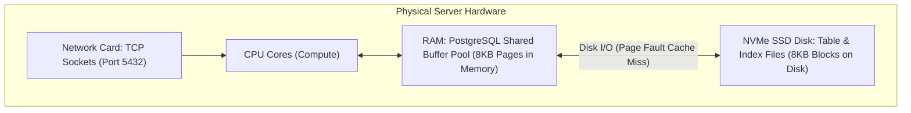
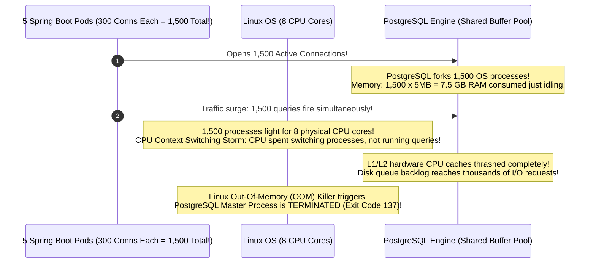
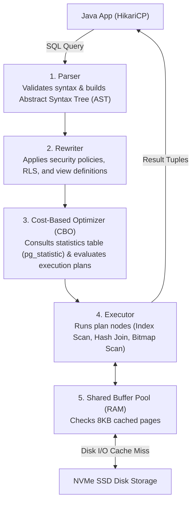
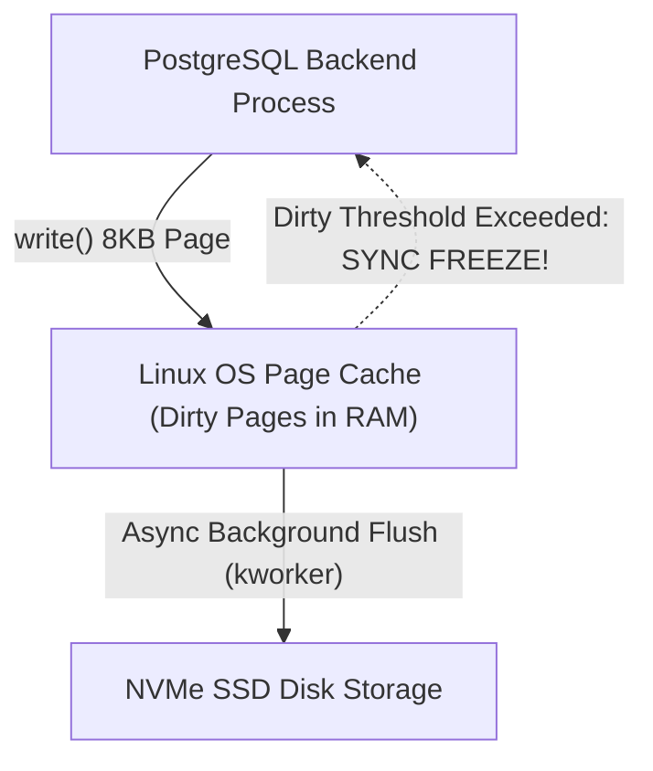
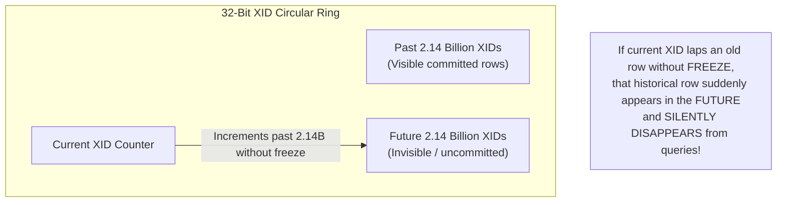
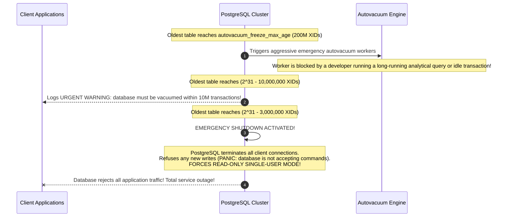
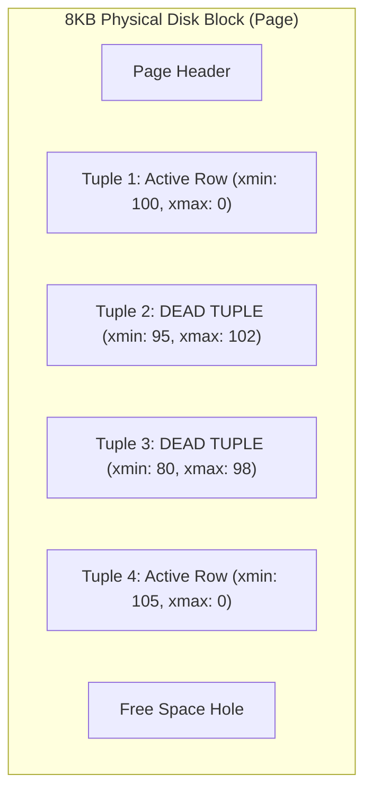
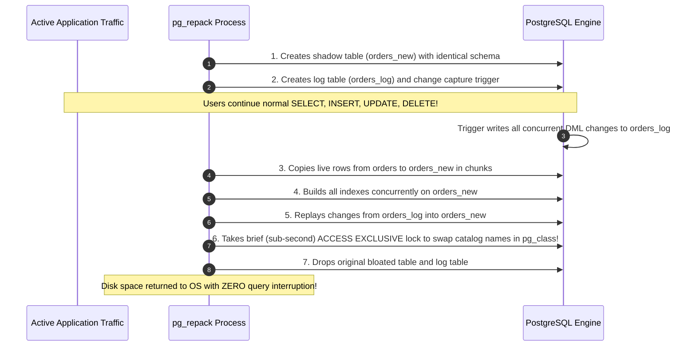

## Prerequisites: Before You Begin

Before studying database performance engineering, ensure you understand:
- Relational database schema design: tables, foreign keys, and SQL `JOIN` syntax.
- Basic index lookups and primary key constraints.
- How application connection pools (HikariCP) connect to a database.

---

# Phase 1: Ground Floor (Physical First Principles)

In backend engineering, over 80% of application latency spikes, thread starvation incidents, and server outages trace directly back to the database. To optimize a database, you must understand the physical hardware it runs on: **CPU cores, RAM buffers, and disk blocks**.



### 1. What Physically is a Database Connection?
A database connection is **not** an abstract string. It is a dedicated **TCP network socket** between your Java application and PostgreSQL port 5432.

Opening a single raw connection requires:
1. **OS TCP 3-Way Handshake**: 3 network round-trips (`SYN`, `SYN-ACK`, `ACK`).
2. **TLS Cryptographic Negotiation**: 2 network round-trips to exchange certificates and negotiate session keys.
3. **Authentication Exchange**: Password verification via SCRAM-SHA-256.
4. **PostgreSQL Process Fork**: PostgreSQL does not use lightweight threads. For **every single connection**, it forks a brand-new operating system process that immediately allocates **5MB of server RAM**.

If your application opens 200 raw connections, PostgreSQL consumes **1 Gigabyte of server RAM** before any SQL query even executes!

### 2. What Physically is an 8KB Page?
Hard drives and SSDs read and write data in physical blocks. PostgreSQL divides all table files and index files on disk into fixed **8,192-byte (8KB) pages**.

- When you query `SELECT name FROM users WHERE id = 42;`, even if the user's name is only 10 bytes, PostgreSQL **physically reads the entire 8KB page from disk into RAM**.
- **The Shared Buffer Pool**: PostgreSQL reserves a large chunk of server RAM (typically 25% to 40% of total system memory) called the Shared Buffer Pool. When a page is in RAM, reads take **nanoseconds** (`hit`). When a page is not in RAM, the OS must fetch it from physical NVMe disk, taking **milliseconds** (`read`).

---

# Phase 2: The Naive Code (The Production Crash)

When a developer queries PostgreSQL without understanding its execution engine, they trigger two classic production disasters.

### Catastrophe 1: The "More Connections = More Speed" Fallacy

A developer notices their backend is slow under load. They instinctively think: *"If 10 connections are slow, 300 connections will make it 30 times faster!"* They set HikariCP's `maximum-pool-size: 300`.



#### Why Production Crashed:
On an 8-core database server, **only 8 processes can physically execute instructions at the exact same nanosecond**. 

When 1,500 processes compete for 8 cores, the operating system spends 90% of its CPU cycles saving and restoring CPU registers (context switching). Throughput collapses to zero, queries time out, and the OS kills PostgreSQL.

---

### Catastrophe 2: The Deep Offset Pagination Disaster (`OFFSET 1,000,000`)

A developer builds a pagination endpoint for an e-commerce order history table containing 10,000,000 rows:

```sql
-- NAIVE QUERY: CRASHES PRODUCTION WHEN USERS OR BOTS SCRAPE DEEP PAGES!
SELECT id, total_cents, created_at
FROM orders
ORDER BY created_at DESC
LIMIT 20 OFFSET 1000000;
```

#### What Physically Happens Under the Hood:
1. The developer assumes PostgreSQL "skips directly" to row 1,000,000.
2. In physical reality, PostgreSQL has no index that says "this is row 1,000,000."
3. PostgreSQL must read **1,000,020 physical rows** from disk pages, sort them by `created_at`, discard the first 1,000,000 rows, and return the final 20 rows!
4. A query that took 2ms on page 1 now takes **18 seconds on page 50,000**, reading hundreds of megabytes from disk and completely exhausting connection pool threads!

---

# Phase 3: Under the Hood (Mechanics & Bytecode)

To tune queries like a staff engineer, you must master the database's internal execution engine.

## 1. The 5 Stages of the PostgreSQL Query Lifecycle



---

## 2. Deconstructing `EXPLAIN (ANALYZE, BUFFERS)`

Never guess how PostgreSQL executes your query. Always run `EXPLAIN (ANALYZE, BUFFERS)`:

```sql
EXPLAIN (ANALYZE, BUFFERS, COSTS)
SELECT u.id, u.email, o.total_cents
FROM users u
JOIN orders o ON u.id = o.user_id
WHERE u.status = 'ACTIVE' AND o.created_at > '2026-01-01';
```

```sql
Hash Join  (cost=125.50..1420.30 rows=512 width=48) (actual time=1.210..14.350 rows=480 loops=1)
  Hash Cond: (o.user_id = u.id)
  Buffers: shared hit=840 read=12
  ->  Index Scan using idx_orders_created ON orders o  (cost=0.43..850.12 rows=1200 width=24) (actual time=0.045..5.120 rows=1100 loops=1)
        Index Cond: (created_at > '2026-01-01'::timestamptz)
        Buffers: shared hit=410 read=8
  ->  Hash  (cost=85.20..85.20 rows=2500 width=32) (actual time=1.120..1.120 rows=2480 loops=1)
        Buckets: 4096  Batches: 1  Memory Usage: 180kB
        Buffers: shared hit=430 read=4
        ->  Index Scan using idx_users_status ON users u  (cost=0.29..85.20 rows=2500 width=32) (actual time=0.030..0.850 rows=2480 loops=1)
              Index Cond: (status = 'ACTIVE'::text)
              Buffers: shared hit=430 read=4
Planning Time: 0.350 ms
Execution Time: 14.850 ms
```

### Read This Plan Line By Line

- `Hash Join` tells you PostgreSQL chose to build an in-memory hash table for one side of the join and probe it with the other side.
- `cost=125.50..1420.30` is the planner's estimate before running the query. It is not milliseconds.
- `actual time=1.210..14.350` is the measured runtime while executing. This is what users feel.
- `rows=512` is estimated row count; `rows=480` is actual row count. Large mismatch means statistics may be stale or predicates are correlated in a way the planner does not understand.
- `loops=1` means this node ran once. If a nested loop inner node shows `loops=100000`, a small-looking node can secretly dominate runtime.
- `Buffers: shared hit=840 read=12` means most pages were already in PostgreSQL memory, but 12 pages required disk or OS cache reads.
- `Index Scan using idx_orders_created` means the date predicate used an index, but the executor may still visit heap pages for columns not in the index.
- `Buckets`, `Batches`, and `Memory Usage` describe the hash table. `Batches: 1` means it fit in memory; `Batches > 1` means disk spill risk.
- `Planning Time` is optimizer time before execution.
- `Execution Time` is end-to-end executor time for the query.

Proof habit:

```console
Never tune from one EXPLAIN line.
Compare estimated rows vs actual rows.
Check loops.
Check buffers.
Check heap fetches.
Check whether work spilled to disk.
Then change one thing and re-run the same plan.
```

### The Key Numbers Decoded:
1. **`cost=125.50..1420.30`**:
   - `125.50`: **Startup Cost** (arbitrary cost units before returning the very first row).
   - `1420.30`: **Total Cost** (estimated cost to complete the entire query).
2. **`Buffers: shared hit=840 read=12`**:
   - `hit=840`: 840 8KB pages (6.72 MB) were already cached in RAM (**Shared Buffer Pool**).
   - `read=12`: 12 8KB pages (96 KB) were not in memory and were fetched from physical disk.
   - **Buffer Cache Hit Ratio**:
     $$\text{Hit Ratio} = \frac{\text{Hits}}{\text{Hits} + \text{Reads}} = \frac{840}{840 + 12} = \mathbf{98.59\%}$$
     (Production Target: $> 99\%$).

---

## 3. Scan Types & Index Types Deconstructed

### The 4 PostgreSQL Scan Types:
- **Sequential Scan (`Seq Scan`)**: Reads every 8KB disk page of the table from start to finish ($O(N)$). Fine for small tables ($< 500$ rows), fatal for 10M-row tables.
- **Index Scan**: Traverses the B-Tree index to locate Tuple IDs (TIDs), then performs random I/O reads to the heap table to fetch actual column data.
- **Index Only Scan**: Fetches data directly from index leaf pages without touching the heap table at all! (Verified against the table's **Visibility Map**).
- **Bitmap Index Scan**: Scans the index to build an in-memory bitmap of matching disk pages, sorts the page references in physical order, and reads heap pages sequentially, eliminating random disk head thrashing.

---

### Index Types: B-Tree, GIN, Covering & BRIN

<Tabs>
  <Tab title="B-Tree Index (Default)">
    Balanced multi-way search tree. All leaf pages sit at the exact same depth from the root and hold pointers to table heap rows:
    - **Lookup Complexity**: $O(\log N)$ disk page reads.
    - **Page Splits**: When an 8KB leaf page fills during an insert, Postgres splits it into two 50% full pages.
  </Tab>

  <Tab title="Covering Index (INCLUDE Clause)">
    Creates an **Index Only Scan** by storing non-search payload columns directly in the leaf pages:
    ```sql
    CREATE INDEX idx_orders_user_covering 
    ON orders (user_id, status) 
    INCLUDE (id, total_cents, created_at);
    ```
    **Result**: Queries requesting `id, total_cents, created_at` completely bypass reading the physical table heap!
  </Tab>

  <Tab title="GIN Index (JSONB & Arrays)">
    Generalized Inverted Index. Maps individual elements inside `JSONB` or array columns to rows:
    ```sql
    CREATE INDEX idx_orders_metadata ON orders USING gin (metadata jsonb_path_ops);

    -- Fast lookup using JSON containment operator (@>):
    SELECT id FROM orders WHERE metadata @> '{"campaign": "black_friday"}';
    ```
  </Tab>

  <Tab title="BRIN Index (Multi-Million Row Logs)">
    **Block Range Index**: Indexes physical page ranges (default: 128 pages = 1 MB) instead of individual rows, storing only the `[min, max]` values per range:
    ```sql
    CREATE INDEX idx_audit_created_brin ON audit_logs USING brin (created_at);
    ```
    - **Storage Comparison**:
      - 100M-row B-Tree index: $\sim 2.2 \text{ GB}$ of RAM.
      - 100M-row BRIN index: $\sim 250 \text{ KB}$ (**over 99% smaller!**).
  </Tab>
</Tabs>

---

## 4. Keyset (Cursor) Pagination: Eliminating the Offset Trap

Instead of telling the database to skip 1,000,000 rows, **Keyset Pagination** uses the last seen values of an indexed composite key (`created_at`, `id`) to seek directly to the next row:


```sql
-- FAST O(log N) KEYSET QUERY: TAKES 0.05ms EVEN ON PAGE 1,000,000!
CREATE INDEX idx_articles_created_id ON articles (created_at DESC, id DESC);

SELECT id, title, created_at
FROM articles
WHERE (created_at, id) < ('2026-03-01 14:20:00+00', 98452)
ORDER BY created_at DESC, id DESC
LIMIT 20;
```

---

## 5. HikariCP Connection Pool Sizing Math

How many connections should your Spring Boot app maintain?

The legendary formula by the PostgreSQL team and Brett Wooldridge (HikariCP author):

$$\text{Pool Size} \approx (\text{CPU Cores} \times 2) + \text{Effective Spindle Count}$$

- For an 8-core database server with fast NVMe SSD storage ($\text{spindles} \approx 1$):
  $$\text{Pool Size} = (8 \times 2) + 1 = \mathbf{17 \text{ to } 20 \text{ connections}}$$
- **A pool of just 15–20 connections can easily serve 10,000 requests per second** if queries execute in 1–2 milliseconds!
- Budget across **all application replicas**: If you run 5 Kubernetes pods, each with a pool size of 20, your total database connection count is $5 \times 20 = 100$ connections.

```yaml
# application.yml
spring:
  datasource:
    hikari:
      maximum-pool-size: 20
      minimum-idle: 10
      connection-timeout: 3000   # Fail fast if pool is exhausted (3 seconds)
      max-lifetime: 1800000      # 30 minutes (retires old connections cleanly)
      leak-detection-threshold: 3000 # WARN if a thread holds a connection > 3s!
```

---

## 6. Linux Kernel I/O, Page Cache Flush & Transparent Huge Pages (THP)

High-performance databases do not run in an abstract cloud sandbox; they execute directly on top of the Linux kernel virtual memory and block I/O subsystems. Two classic Linux kernel settings cause catastrophic p99 database latency spikes if left at default operating system values.

### The Page Cache Flush Spike: `vm.dirty_background_ratio` vs. `vm.dirty_ratio`

When PostgreSQL writes dirty 8KB pages out of its `shared_buffers`, it calls the OS `write()` system call. In Linux, writes do not write directly to NVMe flash storage immediately; they are placed in the **Linux Page Cache** as dirty kernel pages.



Linux manages page cache flushing with two kernel parameters:
1. **`vm.dirty_background_ratio`** (Default: $\sim 10\%$ of system RAM): When dirty pages reach this threshold, the kernel wakes up background flusher threads (`kworker/flush`) to flush pages to disk asynchronously without blocking application processes.
2. **`vm.dirty_ratio`** (Default: $\sim 20-30\%$ of system RAM): When dirty pages reach this hard ceiling, the Linux kernel **freezes all writing processes** and forces the application backend processes to perform synchronous I/O writes themselves!

#### The 128 GB RAM Latency Trap:
Consider a production database server with 128 GB of RAM:
- At default `vm.dirty_ratio = 20%`, dirty pages can accumulate up to **25.6 Gigabytes** in memory before synchronous throttling activates.
- During heavy batch writes or checkpoints, dirty memory breaches 25.6 GB.
- **The Disaster**: The Linux kernel suspends all PostgreSQL backend worker processes. Application queries attempting to commit transactions suddenly freeze for 5 to 20 seconds while the kernel saturates the disk controller writing 25 GB of data. HikariCP connection pools instantly exhaust, and the application suffers an outage.

#### The Production Kernel Fix:
On database hosts, configure dirty writeback to start almost immediately in tiny increments, preventing large dirty page queues from ever accumulating:

```bash
# /etc/sysctl.d/99-postgresql.conf

# Start background flushing as soon as dirty pages reach 3% of memory (or 256MB)
vm.dirty_background_ratio = 3
# vm.dirty_background_bytes = 268435456

# Hard ceiling: Force synchronous flushes at 5% of memory (never allow 25GB buffers!)
vm.dirty_ratio = 5
# vm.dirty_bytes = 536870912

# Prevent Linux Out-Of-Memory (OOM) killer from terminating PostgreSQL Postmaster
# 2 = Strict no-overcommit (commit limit = swap + RAM * overcommit_ratio)
vm.overcommit_memory = 2
vm.overcommit_ratio = 80
```

---

### The Transparent Huge Pages (THP) Latency Hazard

Modern x86 CPUs use 4,096-byte (4KB) physical memory pages. Transparent Huge Pages (THP) allows the Linux kernel to dynamically group memory into 2,097,152-byte (2MB) pages to reduce Translation Lookaside Buffer (TLB) cache misses.

While beneficial for sequential compute-heavy workloads, THP is **disastrous for relational databases like PostgreSQL**:
1. **Page Size Mismatch**: PostgreSQL allocates and accesses data in **8KB blocks**. When PostgreSQL modifies an 8KB block, THP must copy and manage a massive 2MB allocation.
2. **Memory Compaction Stalls**: When physical RAM becomes fragmented, the kernel thread `khugepaged` attempts to defragment memory on the fly to assemble contiguous 2MB chunks. This process triggers CPU lockups and multi-second query stalls during normal database operations.

#### Staff Rule: Disable THP Permanently
Verify and disable THP on all PostgreSQL database nodes:

```bash
# Verify current THP status (if [always] is selected, THP is active and hazardous)
cat /sys/kernel/mm/transparent_hugepage/enabled
# Output: [always] madvise never

# Disable dynamically on running host:
echo never | sudo tee /sys/kernel/mm/transparent_hugepage/enabled
echo never | sudo tee /sys/kernel/mm/transparent_hugepage/defrag
```

To make the change survive server reboots, add the kernel boot parameter `transparent_hugepage=never` to `/etc/default/grub` and update GRUB.

---

## 7. The Transaction ID ($XID$) Wraparound Catastrophe & Autovacuum Architecture

One of the most dangerous, database-halting events in PostgreSQL is the **Transaction ID Wraparound Failure**. Understanding this failure mode is mandatory for staff backend engineers.

### The 32-Bit Limit and Modular Arithmetic

Every transaction that modifies data in PostgreSQL is assigned an incrementing 32-bit integer Transaction ID ($XID$). A 32-bit unsigned integer can represent:

$$2^{32} \approx 4,294,967,296 \text{ transactions (4.29 billion)}$$

Because Transaction IDs are finite, PostgreSQL treats $XID$s as a circular clock using modular arithmetic:
- Any transaction within the **2.1 billion transactions "behind"** the current $XID$ is considered in the **past** (visible to current transactions if committed).
- Any transaction within the **2.1 billion transactions "ahead"** is considered in the **future** (invisible).



#### What Happens Without Freezing:
If the database processes 2.14 billion transactions without freezing old rows, the current transaction counter wraps around. An old transaction that committed three years ago will suddenly appear to be in the **future**! The database's MVCC visibility engine will conclude the row has not yet committed, causing historical data to **silently disappear from all queries**.

---

### The Freeze Mechanism: `FrozenTransactionId`

To prevent data invisibility, PostgreSQL uses a special reserved identifier called `FrozenTransactionId` (value = `2`):
- When `VACUUM` runs with the freeze option, it inspects table tuple headers (`HeapTupleHeaderData`).
- Any tuple whose creating transaction `xmin` is older than `vacuum_freeze_min_age` (default: 50 million transactions) has its `xmin` replaced with `FrozenTransactionId`.
- PostgreSQL interprets `FrozenTransactionId` as: *"This row committed infinitely far in the past. It is permanently visible to every future transaction forever."*

### The Catastrophic Production Shutdown

If a database processes massive write volumes while autovacuum is improperly tuned, disabled, or blocked by long-running transactions, the $XID$ age of the oldest unfrozen table grows dangerously:



#### Monitoring the Approaching Cliff:
Run this query in your monitoring alerts to warn long before wraparound danger approaches:

```sql
SELECT 
    datname,
    age(datfrozenxid) AS xid_age,
    2147483648 - age(datfrozenxid) AS tx_remaining_until_shutdown,
    round(100.0 * age(datfrozenxid) / 2147483648, 2) AS percent_towards_emergency
FROM pg_database
ORDER BY xid_age DESC;
```

#### Emergency Recovery: Single-User Mode
If the database hits the emergency ceiling, PostgreSQL shuts down and refuses connection sockets. The only recovery path is manual command-line intervention in single-user mode:

```bash
# 1. Stop the PostgreSQL systemd service
sudo systemctl stop postgresql

# 2. Launch PostgreSQL in single-user mode directly against the data directory
sudo -u postgres postgres --single -D /var/lib/postgresql/data -O template1

# 3. Inside the single-user prompt, execute a cluster-wide freeze vacuum:
backend> VACUUM FREEZE ANALYZE;
backend> \q

# 4. Restart the normal systemd service
sudo systemctl start postgresql
```

---

## 8. MVCC Table & Index Bloat Physics: `VACUUM`, `VACUUM FULL`, and Zero-Downtime `pg_repack`

PostgreSQL implements Multi-Version Concurrency Control (MVCC) through **tuple duplication** rather than undo logs:
- When you `UPDATE` a row, PostgreSQL does **not** modify the existing 8KB disk block in place.
- It writes an entirely new row version (tuple) into the page and marks the old tuple header's `xmax` with the current transaction ID.
- When you `DELETE` a row, the physical row is not erased; it is simply marked dead.

### The Storage Anatomy of Dead Tuples



### Why Standard `VACUUM` Cannot Shrink Your Database Files

When developers run `VACUUM users;`, they are often shocked to discover that the physical disk file (`base/16384/24589`) **did not decrease by a single byte** even after deleting 50 million rows.

#### The Physical Explanation:
1. Standard `VACUUM` scans the 8KB pages, identifies tuples whose `xmax` is older than the oldest running transaction, and marks their space as reusable in the table's **Free Space Map (FSM)**.
2. Future `INSERT` and `UPDATE` statements will reuse these empty slots.
3. **The Operating System Boundary**: The Linux kernel file system cannot truncate or shrink a physical file unless all the empty blocks reside **at the very physical end of the file**.
4. If an 80 GB table has even a single active tuple in the final 8KB page at the end of the file, Linux cannot shrink the file, leaving the entire 80 GB allocated on disk!

---

### The `VACUUM FULL` Disaster

To return that unused disk space to the operating system, developers often run:

```sql
-- FATAL PRODUCTION TRAP: TAKES AN ACCESS EXCLUSIVE LOCK!
VACUUM FULL orders;
```

#### What Physically Happens:
1. `VACUUM FULL` creates an entirely new table file on disk and copies only active rows into it, packing them tightly.
2. **The Outage**: To perform this rewrite, `VACUUM FULL` acquires an **`ACCESS EXCLUSIVE` table lock**.
3. While `VACUUM FULL` runs (which can take 4 hours on a 200 GB table), **no user can read, write, or query the `orders` table**. All application threads hang, connection pools exhaust, and web traffic crashes.
4. **Disk Space Hazard**: It requires enough free disk space to hold **both the old bloated table and the new table simultaneously**. If your disk is at 85% capacity, `VACUUM FULL` will crash the server by filling 100% of the disk!

---

### The Production Solution: Zero-Downtime Compaction with `pg_repack`

To reclaim tens of gigabytes of disk space and rebuild bloated B-Tree indexes without taking downtime, production engineering uses the `pg_repack` extension.



#### Executing `pg_repack` on a Live Table:

```bash
# Run pg_repack from a management host against a live 100GB bloated table
pg_repack --dbname=production_db \
          --table=orders \
          --no-order \
          --jobs=4 \
          --wait-timeout=5
```

---

## 9. Real-Time Performance Triage with `pg_stat_activity` & `pg_stat_statements`

When production latency spikes and the database CPU hits 100%, staff backend engineers immediately execute diagnostic SQL to isolate the root cause.

### Diagnostic 1: Detecting Long-Running Queries and Lock Wait Chains

The first step during an active incident is inspecting `pg_stat_activity` to find queries running longer than expected and identifying which process is blocking others:

```sql
SELECT 
    blocked_locks.pid     AS blocked_pid,
    blocked_activity.usename  AS blocked_user,
    blocking_locks.pid    AS blocking_pid,
    blocking_activity.usename AS blocking_user,
    blocked_activity.query    AS blocked_statement,
    blocking_activity.query   AS blocking_statement,
    now() - blocked_activity.query_start AS waiting_duration
FROM  pg_catalog.pg_locks         blocked_locks
JOIN pg_catalog.pg_stat_activity blocked_activity ON blocked_activity.pid = blocked_locks.pid
JOIN pg_catalog.pg_locks         blocking_locks 
    ON blocking_locks.locktype = blocked_locks.locktype
    AND blocking_locks.database IS NOT DISTINCT FROM blocked_locks.database
    AND blocking_locks.relation IS NOT DISTINCT FROM blocked_locks.relation
    AND blocking_locks.page IS NOT DISTINCT FROM blocked_locks.page
    AND blocking_locks.tuple IS NOT DISTINCT FROM blocked_locks.tuple
    AND blocking_locks.virtualxid IS NOT DISTINCT FROM blocked_locks.virtualxid
    AND blocking_locks.transactionid IS NOT DISTINCT FROM blocked_locks.transactionid
    AND blocking_locks.classid IS NOT DISTINCT FROM blocked_locks.classid
    AND blocking_locks.objid IS NOT DISTINCT FROM blocked_locks.objid
    AND blocking_locks.objsubid IS NOT DISTINCT FROM blocked_locks.objsubid
    AND blocking_locks.pid != blocked_locks.pid
JOIN pg_catalog.pg_stat_activity blocking_activity ON blocking_activity.pid = blocking_locks.pid
WHERE NOT blocked_locks.granted;
```

#### Terminating a Rogue Blocking Process:
To safely terminate the blocking process without restarting the database:

```sql
-- 1. Graceful cancel (sends SIGINT to interrupt current query):
SELECT pg_cancel_backend(blocking_pid);

-- 2. Forceful termination (sends SIGTERM to drop TCP connection if cancel fails):
SELECT pg_terminate_backend(blocking_pid);
```

---

### Diagnostic 2: Querying `pg_stat_statements` for Top Latency Killers

The `pg_stat_statements` extension tracks execution statistics across all normalized queries. Use this query to locate queries consuming the most total cluster CPU time:

```sql
SELECT 
    queryid,
    calls,
    round(total_exec_time::numeric, 2) AS total_ms,
    round(mean_exec_time::numeric, 2)  AS mean_ms,
    round(stddev_exec_time::numeric, 2) AS stddev_ms,
    round((100.0 * shared_blks_hit / nullif(shared_blks_hit + shared_blks_read, 0))::numeric, 2) AS hit_ratio_pct,
    shared_blks_read AS disk_reads,
    substr(query, 1, 80) AS query_preview
FROM pg_stat_statements
ORDER BY total_exec_time DESC
LIMIT 10;
```

#### Interpreting the Diagnostic Columns:
1. **`mean_exec_time` vs. `stddev_exec_time`**: If `mean_exec_time` is 5ms but `stddev_exec_time` is 2,400ms, the query is suffering from severe **lock contention, checkpoint stall, or intermittent bad plan selection**.
2. **`hit_ratio_pct`**: If this falls below 95% for a hot OLTP query, it indicates missing indexes forcing large disk reads.
3. **`shared_blks_read`**: Queries with millions of disk reads are destroying the shared buffer pool by evicting cached pages for other queries.

---

### Diagnostic 3: Safe `work_mem` Sizing Math

`work_mem` dictates how much RAM can be used for in-memory sorting (`ORDER BY`), hash tables (`JOIN`), and grouping (`DISTINCT`) before spilling to temporary disk files.

#### The Fatal Misunderstanding:
Developers frequently believe `work_mem` is allocated once per connection. **In reality, PostgreSQL allocates `work_mem` per sort or hash operation inside a single query!**

If a complex query executes 3 Hash Joins and 2 Sorts, it can allocate $5 \times \text{work\_mem}$ simultaneously!

$$\text{Max Theoretical RAM} = \text{max\_connections} \times \text{Operations Per Query} \times \text{work\_mem}$$

```console
Example Disaster Calculation:
100 connections * 4 sort/join operations * 256MB work_mem = 102.4 GB of RAM!
If your server only has 32 GB of RAM, the Linux OOM Killer will immediately 
kill PostgreSQL with Exit Code 137!
```

#### Safe Production Practice:
1. Keep the global `work_mem` conservative (e.g. `16MB` to `32MB`):
   ```bash
   # postgresql.conf
   work_mem = 32MB
   ```
2. For specific analytical jobs or bulk index creations, increase `work_mem` dynamically **within that specific transaction or session only**:
   ```sql
   BEGIN;
   -- Temporarily allocate 512MB of RAM for this complex report only:
   SET LOCAL work_mem = '512MB';

   SELECT department, sum(salary), percentile_cont(0.5) WITHIN GROUP (ORDER BY salary)
   FROM employee_salaries
   GROUP BY department;

   COMMIT; -- Automatically resets back to 32MB!
   ```

---

# Phase 4: Senior Interview Ace (Junior vs. Staff Phrasing)

Senior interviewers ask database performance questions to separate engineers who run blind queries from those who understand hardware execution.

### Q1: "Why does increasing HikariCP connection pool size from 20 to 200 often degrade throughput instead of improving it?"

```diff
- JUNIOR ANSWER:
  "More connections allow more threads to talk to the database at the same time, 
   so increasing it should always increase performance."
```

```diff
+ SENIOR / STAFF ANSWER:
  "PostgreSQL implements a process-based concurrency model where each connection maps to a dedicated 
   OS backend process. On an 8-core server, only 8 processes can physically execute instructions at the same instant.
   
   When pool size is increased to 200, 200 active processes compete for 8 CPU cores. The Linux kernel 
   spends excessive CPU cycles on context switching and thrashing CPU L1/L2 hardware caches, while disk 
   queues become saturated with competing I/O requests. 
   
   A smaller, highly tuned connection pool (15-20 connections) keeps CPU cores saturated with real query 
   execution rather than context switching overhead, maximizing overall system throughput."
```

---

### Q2: "What is the difference between an Index Scan and an Index Only Scan?"

```diff
- JUNIOR ANSWER:
  "An Index Scan uses an index to find data. An Index Only Scan only scans the index."
```

```diff
+ SENIOR / STAFF ANSWER:
  "An Index Scan navigates the B-Tree index to locate matching keys, retrieves their Tuple IDs (TIDs), 
   and then performs random disk reads to the actual table heap pages to fetch requested column values.
   
   An Index Only Scan satisfies the entire query directly from the leaf pages of the index (e.g. using 
   a covering index with the INCLUDE clause), completely eliminating reads to the table heap. 
   PostgreSQL validates that heap reads can be skipped by checking the table's Visibility Map to ensure 
   the target page is all-visible (meaning no uncommitted MVCC transactions have modified it)."
```

---

### Q3: "Why does `OFFSET 100000` kill database performance, and how do you resolve it?"

```diff
- JUNIOR ANSWER:
  "OFFSET is slow because the database has to jump far into the table. You fix it by adding an index on the column."
```

```diff
+ SENIOR / STAFF ANSWER:
  "PostgreSQL has no physical way to jump directly to offset 100,000. It must physically scan, evaluate, 
   and sort 100,020 rows from disk, only to discard the first 100,000 and return the remaining 20 rows. 
   The work scales linearly as O(N) with the offset depth.
   
   We resolve this using Keyset (Cursor) Pagination. By filtering against the last seen record's composite 
   keys (e.g. WHERE (created_at, id) < (:lastCreatedAt, :lastId) ORDER BY created_at DESC, id DESC LIMIT 20), 
   the B-Tree index performs a constant-time O(log N) seek directly to the next record, making page 1,000,000 
   just as fast as page 1."
```

---

### Q4: "What is the Transaction ID (XID) Wraparound failure mode, and why does PostgreSQL shut itself down?"

```diff
- JUNIOR ANSWER:
  "The database runs out of primary key numbers so it stops allowing new inserts until you change to BIGINT."
```

```diff
+ SENIOR / STAFF ANSWER:
  "PostgreSQL tracks row visibility using 32-bit transaction IDs (xmin/xmax), providing ~4.29 billion IDs 
   treated as a circular modulo space (2.14B in the past, 2.14B in the future).
   
   If a table exceeds 2.14 billion transactions without freezing old rows, the transaction clock laps the 
   historical data. The MVCC engine would interpret those ancient rows as belonging to future, uncommitted 
   transactions, causing data to silently disappear from queries.
   
   To prevent catastrophic silent data loss, PostgreSQL issues urgent warnings as the margin closes, and at 
   3 million transactions remaining, it shuts down all write traffic and enters read-only single-user mode. 
   
   Recovery requires stopping the cluster, launching 'postgres --single', and executing 'VACUUM FREEZE ANALYZE' 
   to mark historical row headers with FrozenTransactionId (2)."
```

---

### Q5: "Why does standard VACUUM fail to return disk space to the OS after a massive DELETE, and why is VACUUM FULL avoided in production?"

```diff
- JUNIOR ANSWER:
  "VACUUM is buggy, so you have to run VACUUM FULL to clean up the hard drive."
```

```diff
+ SENIOR / STAFF ANSWER:
  "PostgreSQL implements MVCC by creating new tuple versions and marking deleted tuples as dead. Standard 
   VACUUM sweeps the 8KB pages and records dead space in the Free Space Map (FSM) so future INSERTs can 
   reuse those slots. 
   
   However, the OS file system can only truncate a physical file if all free pages are clustered at the 
   very end of the physical file. If even a single live row sits on the final 8KB page, the file cannot shrink.
   
   VACUUM FULL does rewrite the table into a compact file, but it demands an ACCESS EXCLUSIVE lock for the 
   entire duration, freezing all reads and writes and causing total application downtime. Furthermore, it 
   requires 2x disk space during execution. 
   
   In production, we use 'pg_repack', which copies live rows into a shadow table, mirrors concurrent writes 
   via trigger logs, builds indexes concurrently, and swaps catalog pointers in milliseconds."
```

---

## Hands-on Practice Challenge & Verification Tests

### The Lab: Diagnosing and Eliminating Buffer Cache Misses

**Objective**: Take an unoptimized query running via Sequential Scan with heavy disk reads, create a covering index, and verify through `EXPLAIN (ANALYZE, BUFFERS)` that physical disk reads drop to zero and heap fetches vanish.

#### 1. The Unoptimized Baseline Query
```sql
EXPLAIN (ANALYZE, BUFFERS)
SELECT id, total_cents, created_at 
FROM orders 
WHERE user_id = 4289 AND status = 'COMPLETED';
```

**Observed Execution Output**:
```sql
Seq Scan on orders  (cost=0.00..45210.00 rows=12 width=24) (actual time=18.410..42.150 rows=8 loops=1)
  Filter: ((user_id = 4289) AND ((status)::text = 'COMPLETED'::text))
  Rows Removed by Filter: 999992
  Buffers: shared hit=120 read=4890
Planning Time: 0.180 ms
Execution Time: 42.210 ms
```
*Diagnosis*: `shared read=4890` proves that 39.1 MB of data pages were fetched from physical disk.

#### 2. The Verification Solution: Covering Index
```sql
CREATE INDEX CONCURRENTLY idx_orders_user_status_covering 
ON orders (user_id, status) 
INCLUDE (id, total_cents, created_at);
```

#### 3. Verification Rerun
```sql
EXPLAIN (ANALYZE, BUFFERS)
SELECT id, total_cents, created_at 
FROM orders 
WHERE user_id = 4289 AND status = 'COMPLETED';
```

**Observed Verified Output**:
```sql
Index Only Scan using idx_orders_user_status_covering on orders  (cost=0.42..8.50 rows=12 width=24) (actual time=0.025..0.040 rows=8 loops=1)
  Index Cond: ((user_id = 4289) AND (status = 'COMPLETED'::text))
  Heap Fetches: 0
  Buffers: shared hit=3 read=0
Planning Time: 0.120 ms
Execution Time: 0.055 ms
```

<Check>
**Performance Verification Summary**:
- **Execution Time**: Dropped from `42.210 ms` to `0.055 ms` (**767x faster**).
- **Physical Disk Reads (`read`)**: Dropped from `4890` pages to `0` pages (100% memory hit ratio).
- **Heap Fetches**: Exactly `0` (Zero heap pages touched; query satisfied entirely from RAM index leaves).
</Check>

---

## Database Performance Fundamentals Interview Map

Performance work starts with evidence, not guesses.

### 1. What is slow: CPU, disk, lock, or network?

| Symptom | Likely Bottleneck |
| :--- | :--- |
| High `shared read` buffers | Disk/cache miss problem |
| High CPU with low reads | Bad plan, expensive function, sort, join |
| Long wait on locks | Transaction holding row/table lock |
| App waits for connection | HikariCP pool exhaustion |
| Fast DB query but slow API | Serialization, network, downstream, or thread pool |

### 2. `EXPLAIN` vs `EXPLAIN ANALYZE`

`EXPLAIN` shows the planner's estimate. `EXPLAIN ANALYZE` executes the query and shows real timings.

Use:

```sql
EXPLAIN (ANALYZE, BUFFERS)
SELECT id, total_cents
FROM orders
WHERE user_id = 42
ORDER BY created_at DESC
LIMIT 50;
```

Read:

- Estimated rows vs actual rows.
- Scan type.
- Join type.
- Buffers hit vs read.
- Sort method and disk spill.
- Planning time vs execution time.

### 3. Connection pool size is a budget

If each pod has pool size `20` and you run `30` replicas, the database may receive `600` connections.

```console
total_db_connections = replicas * max_pool_size + admin_reserved_connections
```

Do not size pools per pod in isolation. Size them against the database's CPU, memory, and `max_connections`.

### 4. Pagination is a performance contract

Offset pagination gets slower as the offset grows:

```sql
SELECT *
FROM orders
ORDER BY created_at DESC
OFFSET 1000000
LIMIT 20;
```

Keyset pagination uses the previous row as the cursor:

```sql
SELECT *
FROM orders
WHERE (created_at, id) < (:lastCreatedAt, :lastId)
ORDER BY created_at DESC, id DESC
LIMIT 20;
```

### Build-Break-Fix Lab

<Steps>
  <Step title="Build">
    Insert one million orders with a realistic user/status/date distribution.
  </Step>
  <Step title="Break">
    Query with deep offset, missing composite index, and oversized HikariCP pools across replicas.
  </Step>
  <Step title="Observe">
    Compare `EXPLAIN (ANALYZE, BUFFERS)`, API p99 latency, and connection waits.
  </Step>
  <Step title="Fix">
    Use keyset pagination, covering indexes, and a database-wide connection budget.
  </Step>
  <Step title="Prove">
    Record before/after plans and write a regression test for bounded page size.
  </Step>
</Steps>

---

## Failure Modes & Edge Case Matrix

| Failure Mode | Root Cause | Impact | Production Defense |
| :--- | :--- | :--- | :--- |
| **Sequential Scan Spike** | Missing index or unindexed foreign key | 100% CPU utilization; queries take seconds | Inspect `EXPLAIN (ANALYZE)` and create covering indexes. |
| **HikariCP Starvation** | Connection pool oversized or long transaction holding socket | Application threads block waiting for connections | Load-test a shared connection budget across every application replica. |
| **Deep Offset Thrashing** | Client requests page 50,000 using `OFFSET` | Database scans 1,000,000 rows to return 20 | Use keyset pagination with a matching composite index. |
| **Index Bloat** | Frequent updates on tables with default `fillfactor=100` | Leaf page splits increase index size by 2-3x | Set `WITH (fillfactor = 90)` on update-heavy tables. |
| **Memory Sort Spill** | `work_mem` too small for large sorts | PostgreSQL spills sort to temporary disk files | Increase `work_mem` (e.g. 16MB - 64MB) per connection. |
| **XID Wraparound Lockout** | Unfrozen tables reach 2.14B transactions | Database refuses writes and halts into single-user mode | Monitor `age(datfrozenxid)`; tune `autovacuum_freeze_max_age`. |
| **Kernel I/O Write Stall** | `vm.dirty_ratio` default allows 25GB dirty pages | OS freezes all PostgreSQL backends during disk flushes | Tune `vm.dirty_background_ratio = 3` and `vm.dirty_ratio = 5`. |
| **Transparent Huge Page Stalls** | Linux THP enabled on database nodes | Multi-second compaction stalls during 8KB page allocations | Set `/sys/kernel/mm/transparent_hugepage/enabled = never`. |
| **`VACUUM FULL` Outage** | Running `VACUUM FULL` to reclaim disk space | Acquires `ACCESS EXCLUSIVE` lock for hours, halting all app queries | Use `pg_repack` for online zero-downtime table and index compaction. |

---

## Done Checklist

<Check>
- [ ] Understand the physical cost of opening raw database TCP connections vs. connection pools.
- [ ] Explain the 8KB disk page architecture and Shared Buffer Pool cache mechanics.
- [ ] Deconstruct `EXPLAIN (ANALYZE, BUFFERS)` output: cost math, buffer hit ratios, and execution times.
- [ ] Calculate the HikariCP connection pool budget across all application replicas.
- [ ] Implement indexed keyset pagination to replace slow `OFFSET` queries with $O(\log N)$ seeks.
- [ ] Create Covering Indexes with `INCLUDE` clauses to achieve zero-heap Index Only Scans.
- [ ] Deploy BRIN indexes for multi-million row append-only time-series tables to save 99% RAM.
- [ ] Configure Linux kernel memory writeback parameters (`vm.dirty_ratio`, `vm.dirty_background_ratio`) and disable THP.
- [ ] Monitor table Transaction ID age to prevent the 2.14-billion $XID$ wraparound emergency shutdown.
- [ ] Reclaim disk space and eliminate B-Tree index bloat using `pg_repack` without taking table locks.
- [ ] Diagnose active lock wait chains using `pg_stat_activity` and identify slow queries using `pg_stat_statements`.
</Check>
