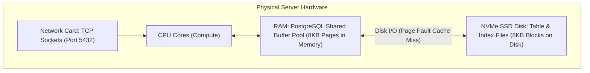
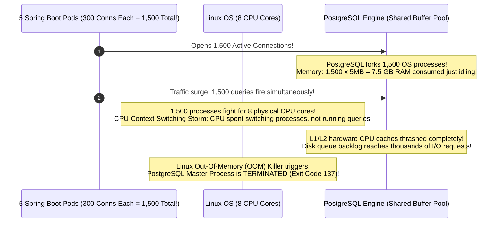
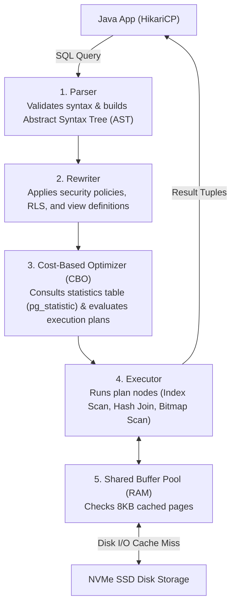

## Prerequisites: Before You Begin

Before studying database performance engineering, ensure you understand:
- Relational database schema design: tables, foreign keys, and SQL `JOIN` syntax.
- Basic index lookups and primary key constraints.
- How application connection pools (HikariCP) connect to a database.

---

# Phase 1: Ground Floor (Physical First Principles)

In backend engineering, over 80% of application latency spikes, thread starvation incidents, and server outages trace directly back to the database. To optimize a database, you must understand the physical hardware it runs on: **CPU cores, RAM buffers, and disk blocks**.



### 1. What Physically is a Database Connection?
A database connection is **not** an abstract string. It is a dedicated **TCP network socket** between your Java application and PostgreSQL port 5432.

Opening a single raw connection requires:
1. **OS TCP 3-Way Handshake**: 3 network round-trips (`SYN`, `SYN-ACK`, `ACK`).
2. **TLS Cryptographic Negotiation**: 2 network round-trips to exchange certificates and negotiate session keys.
3. **Authentication Exchange**: Password verification via SCRAM-SHA-256.
4. **PostgreSQL Process Fork**: PostgreSQL does not use lightweight threads. For **every single connection**, it forks a brand-new operating system process that immediately allocates **5MB of server RAM**.

If your application opens 200 raw connections, PostgreSQL consumes **1 Gigabyte of server RAM** before any SQL query even executes!

### 2. What Physically is an 8KB Page?
Hard drives and SSDs read and write data in physical blocks. PostgreSQL divides all table files and index files on disk into fixed **8,192-byte (8KB) pages**.

- When you query `SELECT name FROM users WHERE id = 42;`, even if the user's name is only 10 bytes, PostgreSQL **physically reads the entire 8KB page from disk into RAM**.
- **The Shared Buffer Pool**: PostgreSQL reserves a large chunk of server RAM (typically 25% to 40% of total system memory) called the Shared Buffer Pool. When a page is in RAM, reads take **nanoseconds** (`hit`). When a page is not in RAM, the OS must fetch it from physical NVMe disk, taking **milliseconds** (`read`).

---

# Phase 2: The Naive Code (The Production Crash)

When a developer queries PostgreSQL without understanding its execution engine, they trigger two classic production disasters.

### Catastrophe 1: The "More Connections = More Speed" Fallacy

A developer notices their backend is slow under load. They instinctively think: *"If 10 connections are slow, 300 connections will make it 30 times faster!"* They set HikariCP's `maximum-pool-size: 300`.



#### Why Production Crashed:
On an 8-core database server, **only 8 processes can physically execute instructions at the exact same nanosecond**. 

When 1,500 processes compete for 8 cores, the operating system spends 90% of its CPU cycles saving and restoring CPU registers (context switching). Throughput collapses to zero, queries time out, and the OS kills PostgreSQL.

---

### Catastrophe 2: The Deep Offset Pagination Disaster (`OFFSET 1,000,000`)

A developer builds a pagination endpoint for an e-commerce order history table containing 10,000,000 rows:

```sql
-- NAIVE QUERY: CRASHES PRODUCTION WHEN USERS OR BOTS SCRAPE DEEP PAGES!
SELECT id, total_cents, created_at
FROM orders
ORDER BY created_at DESC
LIMIT 20 OFFSET 1000000;
```

#### What Physically Happens Under the Hood:
1. The developer assumes PostgreSQL "skips directly" to row 1,000,000.
2. In physical reality, PostgreSQL has no index that says "this is row 1,000,000."
3. PostgreSQL must read **1,000,020 physical rows** from disk pages, sort them by `created_at`, discard the first 1,000,000 rows, and return the final 20 rows!
4. A query that took 2ms on page 1 now takes **18 seconds on page 50,000**, reading hundreds of megabytes from disk and completely exhausting connection pool threads!

---

# Phase 3: Under the Hood (Mechanics & Bytecode)

To tune queries like a staff engineer, you must master the database's internal execution engine.

## 1. The 5 Stages of the PostgreSQL Query Lifecycle



---

## 2. Deconstructing `EXPLAIN (ANALYZE, BUFFERS)`

Never guess how PostgreSQL executes your query. Always run `EXPLAIN (ANALYZE, BUFFERS)`:

```sql
EXPLAIN (ANALYZE, BUFFERS, COSTS)
SELECT u.id, u.email, o.total_cents
FROM users u
JOIN orders o ON u.id = o.user_id
WHERE u.status = 'ACTIVE' AND o.created_at > '2026-01-01';
```

```sql
Hash Join  (cost=125.50..1420.30 rows=512 width=48) (actual time=1.210..14.350 rows=480 loops=1)
  Hash Cond: (o.user_id = u.id)
  Buffers: shared hit=840 read=12
  ->  Index Scan using idx_orders_created ON orders o  (cost=0.43..850.12 rows=1200 width=24) (actual time=0.045..5.120 rows=1100 loops=1)
        Index Cond: (created_at > '2026-01-01'::timestamptz)
        Buffers: shared hit=410 read=8
  ->  Hash  (cost=85.20..85.20 rows=2500 width=32) (actual time=1.120..1.120 rows=2480 loops=1)
        Buckets: 4096  Batches: 1  Memory Usage: 180kB
        Buffers: shared hit=430 read=4
        ->  Index Scan using idx_users_status ON users u  (cost=0.29..85.20 rows=2500 width=32) (actual time=0.030..0.850 rows=2480 loops=1)
              Index Cond: (status = 'ACTIVE'::text)
              Buffers: shared hit=430 read=4
Planning Time: 0.350 ms
Execution Time: 14.850 ms
```

### Read This Plan Line By Line

- `Hash Join` tells you PostgreSQL chose to build an in-memory hash table for one side of the join and probe it with the other side.
- `cost=125.50..1420.30` is the planner's estimate before running the query. It is not milliseconds.
- `actual time=1.210..14.350` is the measured runtime while executing. This is what users feel.
- `rows=512` is estimated row count; `rows=480` is actual row count. Large mismatch means statistics may be stale or predicates are correlated in a way the planner does not understand.
- `loops=1` means this node ran once. If a nested loop inner node shows `loops=100000`, a small-looking node can secretly dominate runtime.
- `Buffers: shared hit=840 read=12` means most pages were already in PostgreSQL memory, but 12 pages required disk or OS cache reads.
- `Index Scan using idx_orders_created` means the date predicate used an index, but the executor may still visit heap pages for columns not in the index.
- `Buckets`, `Batches`, and `Memory Usage` describe the hash table. `Batches: 1` means it fit in memory; `Batches > 1` means disk spill risk.
- `Planning Time` is optimizer time before execution.
- `Execution Time` is end-to-end executor time for the query.

Proof habit:

```console
Never tune from one EXPLAIN line.
Compare estimated rows vs actual rows.
Check loops.
Check buffers.
Check heap fetches.
Check whether work spilled to disk.
Then change one thing and re-run the same plan.
```

### The Key Numbers Decoded:
1. **`cost=125.50..1420.30`**:
   - `125.50`: **Startup Cost** (arbitrary cost units before returning the very first row).
   - `1420.30`: **Total Cost** (estimated cost to complete the entire query).
2. **`Buffers: shared hit=840 read=12`**:
   - `hit=840`: 840 8KB pages (6.72 MB) were already cached in RAM (**Shared Buffer Pool**).
   - `read=12`: 12 8KB pages (96 KB) were not in memory and were fetched from physical disk.
   - **Buffer Cache Hit Ratio**:
     $$\text{Hit Ratio} = \frac{\text{Hits}}{\text{Hits} + \text{Reads}} = \frac{840}{840 + 12} = \mathbf{98.59\%}$$
     (Production Target: $> 99\%$).

---

## 3. Scan Types & Index Types Deconstructed

### The 4 PostgreSQL Scan Types:
- **Sequential Scan (`Seq Scan`)**: Reads every 8KB disk page of the table from start to finish ($O(N)$). Fine for small tables ($< 500$ rows), fatal for 10M-row tables.
- **Index Scan**: Traverses the B-Tree index to locate Tuple IDs (TIDs), then performs random I/O reads to the heap table to fetch actual column data.
- **Index Only Scan**: Fetches data directly from index leaf pages without touching the heap table at all! (Verified against the table's **Visibility Map**).
- **Bitmap Index Scan**: Scans the index to build an in-memory bitmap of matching disk pages, sorts the page references in physical order, and reads heap pages sequentially, eliminating random disk head thrashing.

---

### Index Types: B-Tree, GIN, Covering & BRIN

<Tabs>
  <Tab title="B-Tree Index (Default)">
    Balanced multi-way search tree. All leaf pages sit at the exact same depth from the root and hold pointers to table heap rows:
    - **Lookup Complexity**: $O(\log N)$ disk page reads.
    - **Page Splits**: When an 8KB leaf page fills during an insert, Postgres splits it into two 50% full pages.
  </Tab>

  <Tab title="Covering Index (INCLUDE Clause)">
    Creates an **Index Only Scan** by storing non-search payload columns directly in the leaf pages:
    ```sql
    CREATE INDEX idx_orders_user_covering 
    ON orders (user_id, status) 
    INCLUDE (id, total_cents, created_at);
    ```
    **Result**: Queries requesting `id, total_cents, created_at` completely bypass reading the physical table heap!
  </Tab>

  <Tab title="GIN Index (JSONB & Arrays)">
    Generalized Inverted Index. Maps individual elements inside `JSONB` or array columns to rows:
    ```sql
    CREATE INDEX idx_orders_metadata ON orders USING gin (metadata jsonb_path_ops);

    -- Fast lookup using JSON containment operator (@>):
    SELECT id FROM orders WHERE metadata @> '{"campaign": "black_friday"}';
    ```
  </Tab>

  <Tab title="BRIN Index (Multi-Million Row Logs)">
    **Block Range Index**: Indexes physical page ranges (default: 128 pages = 1 MB) instead of individual rows, storing only the `[min, max]` values per range:
    ```sql
    CREATE INDEX idx_audit_created_brin ON audit_logs USING brin (created_at);
    ```
    - **Storage Comparison**:
      - 100M-row B-Tree index: $\sim 2.2 \text{ GB}$ of RAM.
      - 100M-row BRIN index: $\sim 250 \text{ KB}$ (**over 99% smaller!**).
  </Tab>
</Tabs>

---

## 4. Keyset (Cursor) Pagination: Eliminating the Offset Trap

Instead of telling the database to skip 1,000,000 rows, **Keyset Pagination** uses the last seen values of an indexed composite key (`created_at`, `id`) to seek directly to the next row:


```sql
-- FAST O(log N) KEYSET QUERY: TAKES 0.05ms EVEN ON PAGE 1,000,000!
CREATE INDEX idx_articles_created_id ON articles (created_at DESC, id DESC);

SELECT id, title, created_at
FROM articles
WHERE (created_at, id) < ('2026-03-01 14:20:00+00', 98452)
ORDER BY created_at DESC, id DESC
LIMIT 20;
```

---

## 5. HikariCP Connection Pool Sizing Math

How many connections should your Spring Boot app maintain?

The legendary formula by the PostgreSQL team and Brett Wooldridge (HikariCP author):

$$\text{Pool Size} \approx (\text{CPU Cores} \times 2) + \text{Effective Spindle Count}$$

- For an 8-core database server with fast NVMe SSD storage ($\text{spindles} \approx 1$):
  $$\text{Pool Size} = (8 \times 2) + 1 = \mathbf{17 \text{ to } 20 \text{ connections}}$$
- **A pool of just 15–20 connections can easily serve 10,000 requests per second** if queries execute in 1–2 milliseconds!
- Budget across **all application replicas**: If you run 5 Kubernetes pods, each with a pool size of 20, your total database connection count is $5 \times 20 = 100$ connections.

```yaml
# application.yml
spring:
  datasource:
    hikari:
      maximum-pool-size: 20
      minimum-idle: 10
      connection-timeout: 3000   # Fail fast if pool is exhausted (3 seconds)
      max-lifetime: 1800000      # 30 minutes (retires old connections cleanly)
      leak-detection-threshold: 3000 # WARN if a thread holds a connection > 3s!
```

---

# Phase 4: Senior Interview Ace (Junior vs. Staff Phrasing)

Senior interviewers ask database performance questions to separate engineers who run blind queries from those who understand hardware execution.

### Q1: "Why does increasing HikariCP connection pool size from 20 to 200 often degrade throughput instead of improving it?"

```diff
- JUNIOR ANSWER:
  "More connections allow more threads to talk to the database at the same time, 
   so increasing it should always increase performance."
```

```diff
+ SENIOR / STAFF ANSWER:
  "PostgreSQL implements a process-based concurrency model where each connection maps to a dedicated 
   OS backend process. On an 8-core server, only 8 processes can physically execute instructions at the same instant.
   
   When pool size is increased to 200, 200 active processes compete for 8 CPU cores. The Linux kernel 
   spends excessive CPU cycles on context switching and thrashing CPU L1/L2 hardware caches, while disk 
   queues become saturated with competing I/O requests. 
   
   A smaller, highly tuned connection pool (15-20 connections) keeps CPU cores saturated with real query 
   execution rather than context switching overhead, maximizing overall system throughput."
```

---

### Q2: "What is the difference between an Index Scan and an Index Only Scan?"

```diff
- JUNIOR ANSWER:
  "An Index Scan uses an index to find data. An Index Only Scan only scans the index."
```

```diff
+ SENIOR / STAFF ANSWER:
  "An Index Scan navigates the B-Tree index to locate matching keys, retrieves their Tuple IDs (TIDs), 
   and then performs random disk reads to the actual table heap pages to fetch requested column values.
   
   An Index Only Scan satisfies the entire query directly from the leaf pages of the index (e.g. using 
   a covering index with the INCLUDE clause), completely eliminating reads to the table heap. 
   PostgreSQL validates that heap reads can be skipped by checking the table's Visibility Map to ensure 
   the target page is all-visible (meaning no uncommitted MVCC transactions have modified it)."
```

---

### Q3: "Why does `OFFSET 100000` kill database performance, and how do you resolve it?"

```diff
- JUNIOR ANSWER:
  "OFFSET is slow because the database has to jump far into the table. You fix it by adding an index on the column."
```

```diff
+ SENIOR / STAFF ANSWER:
  "PostgreSQL has no physical way to jump directly to offset 100,000. It must physically scan, evaluate, 
   and sort 100,020 rows from disk, only to discard the first 100,000 and return the remaining 20 rows. 
   The work scales linearly as O(N) with the offset depth.
   
   We resolve this using Keyset (Cursor) Pagination. By filtering against the last seen record's composite 
   keys (e.g. WHERE (created_at, id) < (:lastCreatedAt, :lastId) ORDER BY created_at DESC, id DESC LIMIT 20), 
   the B-Tree index performs a constant-time O(log N) seek directly to the next record, making page 1,000,000 
   just as fast as page 1."
```

---

## Hands-on Practice Challenge & Verification Tests

### The Lab: Diagnosing and Eliminating Buffer Cache Misses

**Objective**: Take an unoptimized query running via Sequential Scan with heavy disk reads, create a covering index, and verify through `EXPLAIN (ANALYZE, BUFFERS)` that physical disk reads drop to zero and heap fetches vanish.

#### 1. The Unoptimized Baseline Query
```sql
EXPLAIN (ANALYZE, BUFFERS)
SELECT id, total_cents, created_at 
FROM orders 
WHERE user_id = 4289 AND status = 'COMPLETED';
```

**Observed Execution Output**:
```sql
Seq Scan on orders  (cost=0.00..45210.00 rows=12 width=24) (actual time=18.410..42.150 rows=8 loops=1)
  Filter: ((user_id = 4289) AND ((status)::text = 'COMPLETED'::text))
  Rows Removed by Filter: 999992
  Buffers: shared hit=120 read=4890
Planning Time: 0.180 ms
Execution Time: 42.210 ms
```
*Diagnosis*: `shared read=4890` proves that 39.1 MB of data pages were fetched from physical disk.

#### 2. The Verification Solution: Covering Index
```sql
CREATE INDEX CONCURRENTLY idx_orders_user_status_covering 
ON orders (user_id, status) 
INCLUDE (id, total_cents, created_at);
```

#### 3. Verification Rerun
```sql
EXPLAIN (ANALYZE, BUFFERS)
SELECT id, total_cents, created_at 
FROM orders 
WHERE user_id = 4289 AND status = 'COMPLETED';
```

**Observed Verified Output**:
```sql
Index Only Scan using idx_orders_user_status_covering on orders  (cost=0.42..8.50 rows=12 width=24) (actual time=0.025..0.040 rows=8 loops=1)
  Index Cond: ((user_id = 4289) AND (status = 'COMPLETED'::text))
  Heap Fetches: 0
  Buffers: shared hit=3 read=0
Planning Time: 0.120 ms
Execution Time: 0.055 ms
```

<Check>
**Performance Verification Summary**:
- **Execution Time**: Dropped from `42.210 ms` to `0.055 ms` (**767x faster**).
- **Physical Disk Reads (`read`)**: Dropped from `4890` pages to `0` pages (100% memory hit ratio).
- **Heap Fetches**: Exactly `0` (Zero heap pages touched; query satisfied entirely from RAM index leaves).
</Check>

---

## Database Performance Fundamentals Interview Map

Performance work starts with evidence, not guesses.

### 1. What is slow: CPU, disk, lock, or network?

| Symptom | Likely Bottleneck |
| :--- | :--- |
| High `shared read` buffers | Disk/cache miss problem |
| High CPU with low reads | Bad plan, expensive function, sort, join |
| Long wait on locks | Transaction holding row/table lock |
| App waits for connection | HikariCP pool exhaustion |
| Fast DB query but slow API | Serialization, network, downstream, or thread pool |

### 2. `EXPLAIN` vs `EXPLAIN ANALYZE`

`EXPLAIN` shows the planner's estimate. `EXPLAIN ANALYZE` executes the query and shows real timings.

Use:

```sql
EXPLAIN (ANALYZE, BUFFERS)
SELECT id, total_cents
FROM orders
WHERE user_id = 42
ORDER BY created_at DESC
LIMIT 50;
```

Read:

- Estimated rows vs actual rows.
- Scan type.
- Join type.
- Buffers hit vs read.
- Sort method and disk spill.
- Planning time vs execution time.

### 3. Connection pool size is a budget

If each pod has pool size `20` and you run `30` replicas, the database may receive `600` connections.

```console
total_db_connections = replicas * max_pool_size + admin_reserved_connections
```

Do not size pools per pod in isolation. Size them against the database's CPU, memory, and `max_connections`.

### 4. Pagination is a performance contract

Offset pagination gets slower as the offset grows:

```sql
SELECT *
FROM orders
ORDER BY created_at DESC
OFFSET 1000000
LIMIT 20;
```

Keyset pagination uses the previous row as the cursor:

```sql
SELECT *
FROM orders
WHERE (created_at, id) < (:lastCreatedAt, :lastId)
ORDER BY created_at DESC, id DESC
LIMIT 20;
```

### Build-Break-Fix Lab

<Steps>
  <Step title="Build">
    Insert one million orders with a realistic user/status/date distribution.
  </Step>
  <Step title="Break">
    Query with deep offset, missing composite index, and oversized HikariCP pools across replicas.
  </Step>
  <Step title="Observe">
    Compare `EXPLAIN (ANALYZE, BUFFERS)`, API p99 latency, and connection waits.
  </Step>
  <Step title="Fix">
    Use keyset pagination, covering indexes, and a database-wide connection budget.
  </Step>
  <Step title="Prove">
    Record before/after plans and write a regression test for bounded page size.
  </Step>
</Steps>

---

## Failure Modes & Edge Case Matrix

| Failure Mode | Root Cause | Impact | Production Defense |
| :--- | :--- | :--- | :--- |
| **Sequential Scan Spike** | Missing index or unindexed foreign key | 100% CPU utilization; queries take seconds | Inspect `EXPLAIN (ANALYZE)` and create covering indexes. |
| **HikariCP Starvation** | Connection pool oversized or long transaction holding socket | Application threads block waiting for connections | Load-test a shared connection budget across every application replica. |
| **Deep Offset Thrashing** | Client requests page 50,000 using `OFFSET` | Database scans 1,000,000 rows to return 20 | Use keyset pagination with a matching composite index. |
| **Index Bloat** | Frequent updates on tables with default `fillfactor=100` | Leaf page splits increase index size by 2-3x | Set `WITH (fillfactor = 90)` on update-heavy tables. |
| **Memory Sort Spill** | `work_mem` too small for large sorts | PostgreSQL spills sort to temporary disk files | Increase `work_mem` (e.g. 16MB - 64MB) per connection. |

---

## Done Checklist

<Check>
- [ ] Understand the physical cost of opening raw database TCP connections vs. connection pools.
- [ ] Explain the 8KB disk page architecture and Shared Buffer Pool cache mechanics.
- [ ] Deconstruct `EXPLAIN (ANALYZE, BUFFERS)` output: cost math, buffer hit ratios, and execution times.
- [ ] Calculate the HikariCP connection pool budget across all application replicas.
- [ ] Implement indexed keyset pagination to replace slow `OFFSET` queries with $O(\log N)$ seeks.
- [ ] Create Covering Indexes with `INCLUDE` clauses to achieve zero-heap Index Only Scans.
- [ ] Deploy BRIN indexes for multi-million row append-only time-series tables to save 99% RAM.
</Check>
