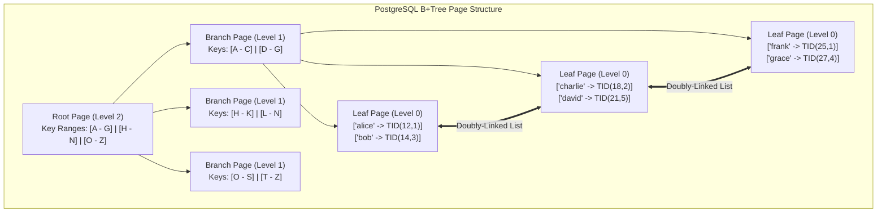
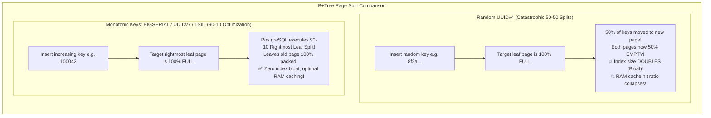
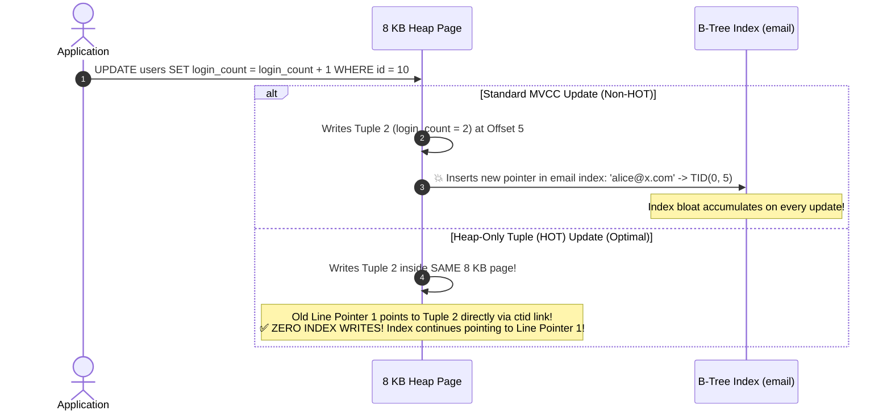
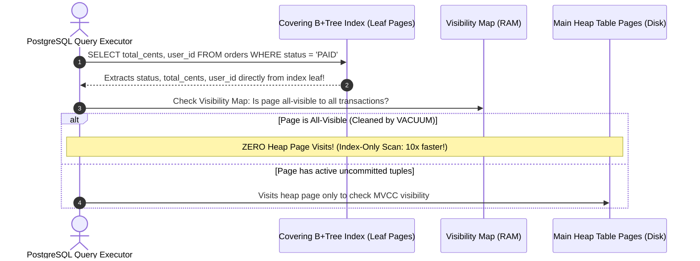
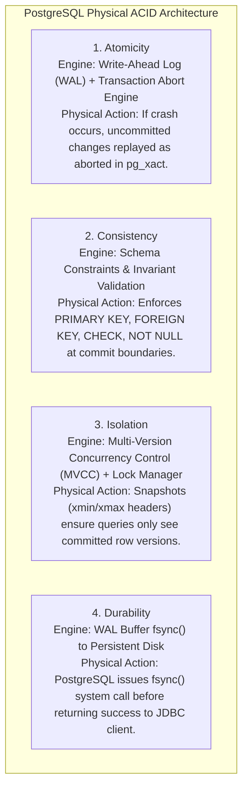

# Database Indexes, Transaction Isolation & ACID Internals

In backend engineering, database interactions are governed by two competing operational forces: **Speed** and **Safety**.

- **Indexes** provide speed: transforming slow $O(N)$ full table scans into lightning-fast $O(\log N)$ logarithmic tree lookups.
- **Transactions** provide safety: ensuring that concurrent operations execute correctly without data corruption or partial state loss.

A backend engineer who only understands syntax will build slow, fragile systems: adding redundant indexes that choke write throughput, misordering columns in composite indexes so the database ignores them, triggering index bloat because of non-sequential UUID primary keys, or setting isolation levels improperly and triggering data corruption during concurrent checkouts.

This masterclass provides an exhaustive, production-grade guide to B+Tree storage mechanics, leaf page split physics, Heap-Only Tuples (HOT) updates, composite index ordering, index selectivity math, covering indexes, and the mapping of ACID guarantees directly to PostgreSQL engine subsystems.

## Prerequisites: Before You Begin

Before exploring B+Tree indexing and transaction isolation internals, ensure you understand:
- Relational table schemas, primary keys, and foreign key constraints.
- Basic SQL querying (`SELECT`, `WHERE`, `ORDER BY`, `JOIN`).
- The fundamental concept of database transactions (`BEGIN`, `COMMIT`, `ROLLBACK`).

---

## The Fundamental Search Problem: Sequential Scan vs B+Tree Index

To understand why indexes exist, contrast how a database engine searches for a user record with and without an index across a 10,000,000 row table:

```mermaid
flowchart TD
    subgraph SequentialScan ["1. Sequential Scan (No Index) - O(N) Complexity"]
        Q1["Query: WHERE email = 'alice@example.com'"] --> Disk["Reads 10,000,000 rows from physical SSD disk blocks"]
        Disk --> Buffer["Fills PostgreSQL Shared Buffers / RAM"]
        Buffer --> CPU["CPU checks every row sequentially"]
        CPU --> Res1["Execution Time: 3,500 ms (Severe Disk I/O & Buffer Eviction!)"]
    end

    subgraph BTreeScan ["2. B+Tree Index Scan - O(log N) Complexity"]
        Q2["Query: WHERE email = 'alice@example.com'"] --> Root["Root Page (RAM): Evaluates search key range"]
        Root --> Branch["Branch Page (RAM): Directs to specific leaf page"]
        Branch --> Leaf["Leaf Page: Exact key found!"]
        Leaf --> Ptr["Direct Tuple Pointer (TID: Page 42, Item 7)"]
        Ptr --> Res2["Execution Time: 0.8 ms (Only 3 Page Reads!)"]
    end
```



### The Cost Comparison

| Metric | Sequential Scan ($O(N)$) | B+Tree Index Scan ($O(\log N)$) |
| :--- | :--- | :--- |
| **Algorithm** | Full table scan ($N$ rows inspected) | Binary search across tree levels ($\approx 3\text{ to }4$ page hops) |
| **Disk Pages Read** | Reads all $100,000+$ pages ($800\text{ MB}$ of data) | Reads $3\text{ index pages} + 1\text{ heap table page} = 4\text{ pages}$ ($32\text{ KB}$) |
| **RAM Cache Impact** | Flushes legitimate hot cached data out of buffer pool | Minimal buffer impact (keeps root & branch pages pinned in RAM) |
| **Execution Latency** | $3,000\text{ ms to }30,000\text{ ms}$ under load | $\le 1\text{ ms}$ ($0.001\text{ s}$) |

---

## B+Tree Storage Anatomy & Tree Fanout

PostgreSQL, MySQL (InnoDB), and Oracle implement indexes using the **B+Tree (Balanced Tree)** data structure:



### Why B+Trees Outperform Standard Binary Search Trees

1. **High Fanout Ratio**:
   In a binary search tree, each node has at most 2 children. Searching $10,000,000$ rows requires $\log_2(10^7) \approx 24$ levels (24 separate disk reads!).
   In a PostgreSQL B+Tree, each node is an **$8\text{ KB}$ database page**. If an indexed column and pointer take $20\text{ bytes}$, each page holds up to **$400\text{ child pointers}$ (fanout = 400)**:
   $$\text{Capacity at Level 0 (Leaves)} = 400^3 = 64,000,000\text{ rows!}$$
   A tree with a height of only **3** can index $64\text{ million records}$. The root and branch pages reside permanently in RAM, meaning any row lookup requires **at most 1 physical disk read**!
2. **Doubly-Linked Leaf Nodes for Range Queries**:
   All leaf pages are linked in a bidirectional doubly-linked list. When executing `WHERE created_at BETWEEN '2026-01-01' AND '2026-01-31'`, the engine navigates the tree once to find the first matching date, then simply walks the leaf chain horizontally without traversing the tree again.

---

## Page Split Physics: The Random UUID Disaster

When inserting a new key into a B+Tree leaf page that is already $100\%$ full:
- PostgreSQL must allocate a brand-new $8\text{ KB}$ page.
- It moves half of the keys from the full page to the new page (**50-50 Page Split**).
- It inserts a new routing key into the parent branch node.



<Warning>
### The Random UUID Primary Key Production Disaster
Never use random `UUIDv4` as an indexed primary key in high-throughput write systems!
Because `UUIDv4` values are randomly distributed, new inserts scatter across all millions of leaf pages. Every insert:
1. Causes a cache miss, forcing an $8\text{ KB}$ page read from SSD into RAM.
2. Triggers a 50-50 page split, leaving pages half-empty.
3. Produces massive WAL volume and balloons index size by $200\%$.

**Production Rule**: Always use time-ordered, monotonic keys such as **`BIGSERIAL`**, **`UUIDv7`** (PostgreSQL 17 / Java libraries), or **`TSID`** (Time-Sorted IDs).
</Warning>

---

## Heap-Only Tuples (HOT) Updates & `fillfactor` Tuning

In standard PostgreSQL MVCC, an `UPDATE` physically creates a brand-new tuple version on disk.
By default, **every single index on that table must be updated** to insert a pointer to the new tuple's physical `ctid`, even if the updated column was not indexed!



### The 2 Prerequisites for HOT Updates
A row update can execute as a zero-index HOT update if and only if:
1. **No indexed column is modified** by the `UPDATE` statement.
2. The target $8\text{ KB}$ heap page has **sufficient free space** to hold the new tuple version.

### Reserving Page Free Space via `fillfactor`
By default, PostgreSQL fills table heap pages to $100\%$ capacity (`fillfactor = 100`).
For update-heavy tables (e.g., account balances, user sessions, order counters), lower the table's `fillfactor` to reserve space on every page for future HOT updates:

```sql
-- Reserves 30% of each 8 KB page for in-page HOT updates:
ALTER TABLE accounts SET (fillfactor = 70);

-- Rebuild table to apply fillfactor to existing pages:
VACUUM FULL accounts;
```

---

## Composite Indexing & The Leftmost Prefix Rule

A **Composite Index** indexes multiple columns simultaneously:

```sql
CREATE INDEX idx_orders_status_created_user 
ON orders(status, created_at, user_id);
```


### Query Compatibility Matrix for `(status, created_at, user_id)`

| Query Shape | Index Usable? | Scan Type | Rationale |
| :--- | :--- | :--- | :--- |
| `WHERE status = 'PAID'` | **YES** | Index Seek | Uses leftmost leading column directly. |
| `WHERE status = 'PAID' AND created_at > '2026-01-01'` | **YES** | Index Seek + Range Scan | Uses first two prefix columns in order. |
| `WHERE status = 'PAID' AND created_at > ... AND user_id = 10` | **PARTIAL** | Index Seek + Filter | `status` and `created_at` are used for the seek; `user_id` cannot be used for range seeking because `created_at` is an inequality range. |
| `WHERE created_at > '2026-01-01'` | **NO** | Sequential Scan | Leading prefix `status` is missing! Cannot navigate tree root. |
| `WHERE user_id = 10` | **NO** | Sequential Scan | Leading prefixes `status` and `created_at` are both missing. |
| `WHERE status = 'PAID' ORDER BY created_at ASC` | **YES** | Index Seek + Zero Sort | Index provides pre-sorted order; avoids expensive in-memory sort. |

---

## Index Selectivity & Cardinality Mathematics

Before creating an index, you must calculate the column's **Selectivity**:

$$\text{Selectivity} = \frac{\text{Cardinality (Number of Distinct Values)}}{\text{Total Number of Rows}}$$

- **High Selectivity ($\approx 1.0$)**: Unique or near-unique columns (e.g., `email`, `uuid`, `order_id`). The query planner will always use this index.
- **Low Selectivity ($\approx 0.0001$)**: Low-cardinality columns (e.g., `boolean is_active`, `gender`, `status` with 3 values).

### When Does the Cost-Based Optimizer (CBO) Abandon an Index?
A common junior developer misconception is: *"If an index exists, PostgreSQL will always use it."*

In reality, an index scan incurs a **random I/O penalty**: for every matching row, it must read the B-Tree leaf page and then seek into the table heap page.
If a query matches more than **$5\%\text{ to }15\%$ of the total table rows**, the PostgreSQL optimizer calculates that a **Sequential Scan** (streaming large sequential $8\text{ KB}$ blocks into the OS read-ahead buffer) is cheaper than thousands of random index seeks!

### The Production Solution: Partial Indexes
```sql
-- Indexes ONLY the 1% of orders that are currently unfulfilled!
CREATE INDEX idx_orders_pending 
ON orders(created_at) 
WHERE status = 'PENDING_PAYMENT';
```

---

## Covering Indexes & Index-Only Scans (`INCLUDE`)

A **Covering Index** satisfies the query entirely from the index leaf pages, eliminating table heap page visits:

```sql
CREATE INDEX idx_orders_status_covering 
ON orders(status) 
INCLUDE (total_cents, user_id);
```



<Tip>
### Difference Between Composite Key and `INCLUDE`
Columns in `INCLUDE` are stored **only in leaf nodes**, not intermediate branch nodes. They do not increase tree height or consume branch page fanout, but they convert slow Index Scans into zero-heap **Index-Only Scans**.
</Tip>

---

## ACID Properties Mapped to PostgreSQL Engine Subsystems



---

## Failure Modes & Edge Case Matrix

| Failure Mode | Root Cause | Impact | Production Defense |
| :--- | :--- | :--- | :--- |
| **Unindexed Foreign Key Lock** | Child table FK column lacks an index | `DELETE` on parent acquires table-level share lock on child | Always create explicit B-Tree index on all foreign key columns. |
| **Random UUID Index Fragmentation** | Using `UUIDv4` as primary key | Inserts hit random 8 KB pages, causing constant 50-50 splits | Use sequential UUIDs (`UUIDv7`) or `BIGSERIAL` / TSID. |
| **Leftmost Prefix Bypass** | Query filters on 2nd or 3rd index column without 1st | Database ignores composite index; falls back to Seq Scan | Reorder index columns or create dedicated indexes. |
| **Index Bloat** | Frequent updates on indexed columns without HOT | Index size balloons; RAM buffer cache hit ratio drops | Tune table `fillfactor = 70` to enable in-page HOT updates. |

---

## Active Recall & Interview Mastery

<AccordionGroup>
  <Accordion title="1. How does a B+Tree fanout ratio allow a height-3 tree to index over 64 million records?">
    Each node in a PostgreSQL B+Tree is an 8 KB database page. With an average key and child pointer size of 20 bytes, each page holds up to 400 child pointers (fanout = 400). A tree of height 3 has $400^3 = 64,000,000$ leaf entries. Because root and branch pages are permanently cached in RAM, any row lookup across 64 million rows requires at most 1 physical disk read.
  </Accordion>

  <Accordion title="2. Why does using random UUIDv4 as a primary key degrade write performance over time?">
    UUIDv4 values are randomly distributed. As the table grows larger than RAM, each insert lands on an arbitrary 8 KB leaf page, causing cache misses and frequent 50-50 page splits. Both resulting pages are left half-empty, doubling index size (bloat) and generating massive WAL traffic. Sequential keys like UUIDv7 or BIGSERIAL enable the 90-10 rightmost split optimization, keeping pages densely packed.
  </Accordion>

  <Accordion title="3. What are Heap-Only Tuple (HOT) updates, and how does fillfactor facilitate them?">
    HOT updates allow PostgreSQL to update a row without updating any of the table's B-Tree indexes. When an update modifies only non-indexed columns and the new row version fits in the same 8 KB heap page, PostgreSQL chains line pointers within the heap page directly. By setting table `fillfactor = 70`, 30% of each 8 KB page is reserved for future in-page updates, maximizing HOT update success and eliminating index bloat.
  </Accordion>

  <Accordion title="4. What is the architectural difference between a composite index column and an INCLUDE column?">
    In a composite index `(a, b)`, both columns are stored in all B-Tree nodes (root, branch, leaf) and both can be used for index seeks and range filtering. In an index `(a) INCLUDE (b)`, column `b` is stored only in leaf pages. It cannot be used for range seeking, but it allows queries selecting `(a, b)` to execute as zero-heap Index-Only Scans while preserving branch node fanout.
  </Accordion>
</AccordionGroup>
