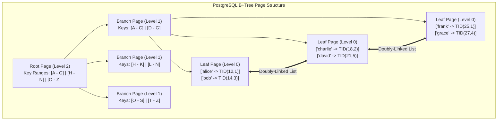
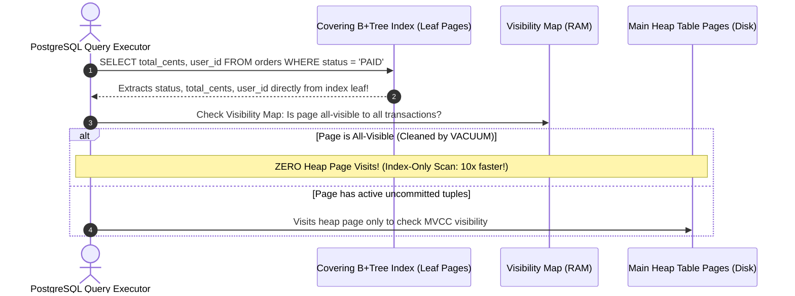
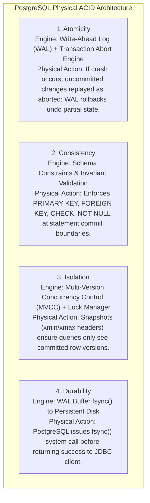
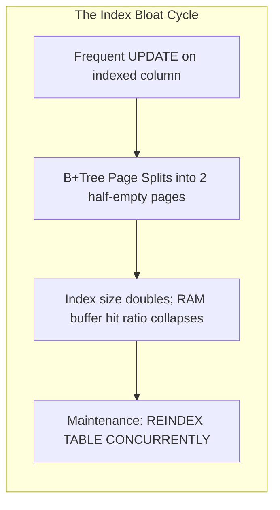

# Database Indexes, Transaction Isolation & ACID Internals

In backend engineering, database interactions are governed by two competing operational forces: **Speed** and **Safety**.

- **Indexes** provide speed: transforming slow $O(N)$ full table scans into lightning-fast $O(\log N)$ logarithmic tree lookups.
- **Transactions** provide safety: ensuring that concurrent operations execute correctly without data corruption or partial state loss.

A backend engineer who only understands syntax will build slow, fragile systems: adding redundant indexes that choke write throughput, misordering columns in composite indexes so the database ignores them, or setting isolation levels improperly and triggering data corruption during concurrent checkouts.

This masterclass provides an exhaustive, production-grade guide to B+Tree storage mechanics, the Leftmost Prefix rule, index selectivity math, covering indexes, and the mapping of ACID guarantees directly to PostgreSQL engine subsystems.

---

## The Fundamental Search Problem: Sequential Scan vs B+Tree Index

To understand why indexes exist, contrast how a database engine searches for a user record with and without an index across a 10,000,000 row table:

```mermaid
flowchart TD
    subgraph SequentialScan ["1. Sequential Scan (No Index) - O(N) Complexity"]
        Q1["Query: WHERE email = 'alice@example.com'"] --> Disk["Reads 10,000,000 rows from physical SSD disk blocks"]
        Disk --> Buffer["Fills PostgreSQL Shared Buffers / RAM"]
        Buffer --> CPU["CPU checks every row sequentially"]
        CPU --> Res1["Execution Time: 3,500 ms (Severe Disk I/O & Buffer Eviction!)"]
    end

    subgraph BTreeScan ["2. B+Tree Index Scan - O(log N) Complexity"]
        Q2["Query: WHERE email = 'alice@example.com'"] --> Root["Root Page (RAM): Evaluates search key range"]
        Root --> Branch["Branch Page (RAM): Directs to specific leaf page"]
        Branch --> Leaf["Leaf Page: Exact key found!"]
        Leaf --> Ptr["Direct Tuple Pointer (TID: Page 42, Item 7)"]
        Ptr --> Res2["Execution Time: 0.8 ms (Only 3 Page Reads!)"]
    end
```



### The Cost Comparison

| Metric | Sequential Scan ($O(N)$) | B+Tree Index Scan ($O(\log N)$) |
| :--- | :--- | :--- |
| **Algorithm** | Full table scan ($N$ rows inspected) | Binary search across tree levels ($\approx 3\text{ to }4$ page hops) |
| **Disk Pages Read** | Reads all $100,000+$ pages ($800\text{ MB}$ of data) | Reads $3\text{ index pages} + 1\text{ heap table page} = 4\text{ pages}$ ($32\text{ KB}$) |
| **RAM Cache Impact** | Flushes legitimate hot cached data out of buffer pool | Minimal buffer impact (keeps root & branch pages pinned in RAM) |
| **Execution Latency** | $3,000\text{ ms to }30,000\text{ ms}$ under load | $\le 1\text{ ms}$ ($0.001\text{ s}$) |

---

## B+Tree Storage Anatomy & Tree Fanout

PostgreSQL, MySQL (InnoDB), and Oracle implement indexes using the **B+Tree (Balanced Tree)** data structure:



### Why B+Trees Outperform Standard Binary Search Trees

1. **High Fanout Ratio**:
   In a binary search tree, each node has at most 2 children. Searching $10,000,000$ rows requires $\log_2(10^7) \approx 24$ levels (24 separate disk reads!).
   In a PostgreSQL B+Tree, each node is an **$8\text{ KB}$ database page**. If an indexed column and pointer take $20\text{ bytes}$, each page holds up to **$400\text{ child pointers}$ (fanout = 400)**:
   $$\text{Capacity at Level 0 (Leaves)} = 400^3 = 64,000,000\text{ rows!}$$
   A tree with a height of only **3** can index $64\text{ million records}$. The root and branch pages reside permanently in RAM, meaning any row lookup requires **at most 1 physical disk read**!
2. **Doubly-Linked Leaf Nodes for Range Queries**:
   All leaf pages are linked in a bidirectional doubly-linked list. When executing `WHERE created_at BETWEEN '2026-01-01' AND '2026-01-31'`, the engine navigates the tree once to find the first matching date, then simply walks the leaf chain horizontally without traversing the tree again.

---

## Composite Indexing & The Leftmost Prefix Rule

A **Composite Index** indexes multiple columns simultaneously. The physical ordering of columns in the `CREATE INDEX` statement dictates whether the database engine can use the index:

```sql
CREATE INDEX idx_orders_status_created_user 
ON orders(status, created_at, user_id);
```


### The Phonebook Analogy
Think of a composite index like a physical telephone directory sorted by `(LastName, FirstName, MiddleName)`:
- Finding everyone with `LastName = 'Smith'` is instantaneous (uses index seek).
- Finding everyone with `LastName = 'Smith' AND FirstName = 'John'` is instantaneous (uses index seek).
- Finding everyone with `FirstName = 'John'` without knowing the last name is **impossible** using the index; you must read the entire telephone book from page 1 to page 1,000 (Sequential Scan!).

### Query Compatibility Matrix for `(status, created_at, user_id)`

| Query Shape | Index Usable? | Scan Type | Rationale |
| :--- | :--- | :--- | :--- |
| `WHERE status = 'PAID'` | **YES** | Index Seek | Uses leftmost leading column directly. |
| `WHERE status = 'PAID' AND created_at > '2026-01-01'` | **YES** | Index Seek + Range Scan | Uses first two prefix columns in order. |
| `WHERE status = 'PAID' AND created_at > ... AND user_id = 10` | **PARTIAL** | Index Seek + Filter | `status` and `created_at` are used for the seek; `user_id` cannot be used for range seeking because `created_at` is an inequality range. |
| `WHERE created_at > '2026-01-01'` | **NO** | Sequential Scan | Leading prefix `status` is missing! Cannot navigate tree root. |
| `WHERE user_id = 10` | **NO** | Sequential Scan | Leading prefixes `status` and `created_at` are both missing. |
| `WHERE status = 'PAID' ORDER BY created_at ASC` | **YES** | Index Seek + Zero Sort | Index provides pre-sorted order; avoids expensive in-memory sort. |

---

## Index Selectivity & Cardinality Mathematics

Before creating an index, you must calculate the column's **Selectivity**:

$$\text{Selectivity} = \frac{\text{Cardinality (Number of Distinct Values)}}{\text{Total Number of Rows}}$$

- **High Selectivity ($\approx 1.0$)**: Unique or near-unique columns (e.g., `email`, `uuid`, `order_id`). The index filters the dataset down to $1$ or very few rows. **The query planner will always use this index**.
- **Low Selectivity ($\approx 0.0001$)**: Low-cardinality columns (e.g., `boolean is_active`, `gender`, `status` with 3 values). 

<Warning>
### The Low-Cardinality Indexing Anti-Pattern
Indexing a boolean column on a table where $90\%$ of rows are `active = true` is completely useless:
```sql
CREATE INDEX idx_users_active ON users(active); -- ANTI-PATTERN!
```
When querying `WHERE active = true`, the query planner calculates that it would have to visit $90\%$ of the index and then perform millions of random I/O seeks into the table pages. The query planner **abandons the index and executes a sequential scan instead**. The index wastes disk space and slows down every `INSERT` and `UPDATE`.
</Warning>

### The Production Solution: Partial Indexes
If you only care about querying a small fraction of rows (e.g., unpaid orders or soft-deleted records), create a **Partial Index**:

```sql
-- Indexes ONLY the 1% of orders that are currently unfulfilled!
-- Saves 99% of index disk space and memory!
CREATE INDEX idx_orders_pending 
ON orders(created_at) 
WHERE status = 'PENDING_PAYMENT';
```

---

## Covering Indexes & Index-Only Scans (`INCLUDE`)

In a standard index lookup, the database engine must perform two steps:
1. Traverse the B+Tree to find matching keys and extract Tuple IDs (`TID`).
2. Visit the main heap table pages on disk to fetch the remaining projected columns.

A **Covering Index** satisfies the query entirely from the index leaf pages, eliminating table heap page visits:

```sql
-- Standard Index: Engine must visit heap table to read 'total_cents' and 'user_id'
CREATE INDEX idx_orders_status ON orders(status);

-- Covering Index: Stores payload columns directly in B+Tree leaf nodes!
CREATE INDEX idx_orders_status_covering 
ON orders(status) 
INCLUDE (total_cents, user_id);
```



<Tip>
### Difference Between Composite Key and `INCLUDE`
Columns in `INCLUDE` are stored **only in leaf nodes**, not intermediate branch nodes. They do not increase the tree height and are not evaluated in `WHERE` clause searches, but they make queries **$10\times$ faster** by converting Index Scans into zero-heap **Index-Only Scans**.
</Tip>

---

## ACID Properties Mapped to PostgreSQL Engine Subsystems

ACID is not an abstract academic acronym; each letter maps to a concrete, physical subsystem in the PostgreSQL storage engine:



### Physical Subsystem Breakdown

1. **Atomicity (All or Nothing)**:
   - **Engine Subsystem**: Write-Ahead Logging (WAL) and Transaction Status logs (`pg_xact`).
   - If a transaction inserts 5 rows and fails on row 6, PostgreSQL marks the transaction status as `ABORTED` in `pg_xact`. Future queries reading those 8 KB pages inspect the tuple header's `xmin` and ignore the rows as if they never existed.
2. **Consistency (Valid State Transitions)**:
   - **Engine Subsystem**: Catalog Constraint Engine.
   - Enforces relational invariants (`CHECK (quantity > 0)`, unique constraints, and foreign key referential integrity).
3. **Isolation (Concurrent Independence)**:
   - **Engine Subsystem**: MVCC Snapshots (`SnapshotData`) and the Lock Manager.
   - Prevents transactions from seeing each other's uncommitted intermediate mutations.
4. **Durability (Committed Data Survives Crashes)**:
   - **Engine Subsystem**: WAL Flusher (`XLogFlush` and Linux `fsync()`).
   - PostgreSQL does not wait to write modified table heap pages to disk on `COMMIT`. Instead, it writes a compact sequential log entry to the WAL buffer and executes an `fsync()` system call to flush the WAL to non-volatile disk. If the server loses power 1 microsecond later, PostgreSQL recovers state upon reboot by replaying the WAL.

---

## ANSI SQL Isolation Levels vs PostgreSQL Reality

The ANSI SQL-92 standard defines 4 isolation levels based on three read anomalies:

1. **Dirty Read (P1)**: Transaction reads uncommitted changes from another transaction.
2. **Non-Repeatable Read (P2)**: Transaction re-reads a row and finds that another committed transaction modified its values.
3. **Phantom Read (P3)**: Transaction re-executes a range query and finds new rows added by another committed transaction.

### ANSI Standard vs PostgreSQL Implementation Reality

| Isolation Level | Dirty Read | Non-Repeatable Read | Phantom Read | PostgreSQL Physical Behavior |
| :--- | :--- | :--- | :--- | :--- |
| **Read Uncommitted** | Possible (ANSI) | Possible | Possible | **PostgreSQL does NOT support dirty reads**. It transparently promotes Read Uncommitted to **Read Committed**. |
| **Read Committed** (Default) | Prevented | Possible | Possible | Each individual SQL query creates a fresh **new MVCC snapshot**. Successive queries in the same transaction can see newly committed external changes. |
| **Repeatable Read** | Prevented | Prevented | Prevented | The MVCC snapshot is created **once** at the start of the transaction and held frozen. Prevents both non-repeatable reads and phantoms! Vulnerable to **Write Skew**. |
| **Serializable** (SSI) | Prevented | Prevented | Prevented | Uses **Serializable Snapshot Isolation (SSI)**. Tracks rw-antidependency locks (SIREAD locks in RAM). Aborts transactions with serialization failures (`40001`) if anomalies occur. |

---

## Index Maintenance & Production Bloat Monitoring

Indexes do not come for free. Every `INSERT`, `UPDATE`, and `DELETE` must physically update all corresponding B+Tree pages on disk. Over time, frequent updates cause **Index Bloat** (empty space in B+Tree pages that never gets reclaimed):



### Production Diagnostic Queries

#### 1. Identify Unused Indexes (Wasting Disk & Slowing Writes)
```sql
SELECT 
    schemaname,
    relname AS table_name,
    indexrelname AS index_name,
    pg_size_pretty(pg_relation_size(i.indexrelid)) AS index_size,
    idx_scan as number_of_scans
FROM pg_stat_user_indexes ui
JOIN pg_index i ON ui.indexrelid = i.indexrelid
WHERE idx_scan = 0 -- Index has NEVER been scanned by a query!
  AND indisunique = FALSE -- Exclude unique constraints
ORDER BY pg_relation_size(i.indexrelid) DESC;
```

#### 2. Rebuilding Bloated Indexes Without Table Locking
Never execute a raw `REINDEX TABLE` in production, as it acquires an `ACCESS EXCLUSIVE` lock, blocking all web traffic. Always use the concurrent non-blocking variant:

```sql
-- Rebuilds index in background without blocking reads or writes:
REINDEX INDEX CONCURRENTLY idx_orders_status_created_user;
```

---

## Active Recall & Interview Mastery

<AccordionGroup>
  <Accordion title="1. What is the difference between a Sequential Scan and a B+Tree Index Scan?">
    A **Sequential Scan** ($O(N)$) reads every single 8 KB page of a table from disk into RAM to evaluate the `WHERE` clause. It is expensive on large tables, causing high disk I/O and flushing hot data out of the database buffer pool.
    
    A **B+Tree Index Scan** ($O(\log N)$) traverses a balanced tree structure from root to branch to leaf pages using binary search. Because B+Tree pages have high fanout ($\approx 400$ pointers per 8 KB page), the engine locates any row in a 50-million-row table in only 3 to 4 page hops ($\le 1\text{ ms}$).
  </Accordion>

  <Accordion title="2. Explain the Leftmost Prefix Rule for composite indexes.">
    A composite index `(colA, colB, colC)` is physically sorted in the B+Tree primarily by `colA`, secondarily by `colB` within matching `colA` values, and tertiarily by `colC`.
    
    The **Leftmost Prefix Rule** states that a query can only navigate the index tree if it filters by the leading prefix column (`colA`). A query filtering `WHERE colB = 5` cannot use the index for seeking because values of `colB` are scattered across the entire tree depending on their parent `colA` values.
  </Accordion>

  <Accordion title="3. Why is indexing a boolean column typically an anti-pattern, and how do Partial Indexes solve this?">
    A boolean column has extremely low cardinality (only 2 distinct values) and low selectivity ($\approx 0.0001$). If 90% of rows have `is_active = true`, querying `WHERE is_active = true` would require reading 90% of the index plus millions of random table heap seeks. The query planner calculates this is slower than a sequential scan and ignores the index.
    
    A **Partial Index** solves this by adding a `WHERE` clause to the index definition:
    ```sql
    CREATE INDEX idx_inactive_users ON users(id) WHERE is_active = false;
    ```
    This indexes only the 10% of rows that are inactive, saving 90% of index RAM and disk space, while guaranteeing that queries targeting inactive users execute lightning-fast.
  </Accordion>

  <Accordion title="4. How does a Covering Index with the INCLUDE clause enable Index-Only Scans?">
    In a standard index scan, the engine reads the index to find matching row IDs (`TID`), then performs a secondary disk seek into the heap table to retrieve the projected columns.
    
    A **Covering Index** stores additional payload columns directly in the leaf pages using `INCLUDE (colX, colY)`. If a query only requests columns present in the index key and the `INCLUDE` payload, the engine executes an **Index-Only Scan**, returning the data directly from the index leaves without ever touching the heap table pages on disk.
  </Accordion>

  <Accordion title="5. How are the four ACID properties physically implemented inside PostgreSQL?">
    - **Atomicity**: Implemented via the Write-Ahead Log (WAL) and `pg_xact` commit status logs. Aborted transactions are marked as aborted, causing their row insertions (`xmin`) to be ignored by future queries.
    - **Consistency**: Implemented via catalog constraints (primary keys, foreign keys, `CHECK` constraints) verified at statement or transaction boundaries.
    - **Isolation**: Implemented via Multi-Version Concurrency Control (MVCC) snapshots (`SnapshotData`) and row/table locks.
    - **Durability**: Implemented via the Write-Ahead Log (WAL) buffer and the Linux `fsync()` system call, which guarantees that log records are flushed to persistent non-volatile disk before a transaction commit is acknowledged to the client.
  </Accordion>

  <Accordion title="6. What is the difference between Read Committed and Repeatable Read in PostgreSQL?">
    In **Read Committed** (PostgreSQL's default), each individual SQL statement within a transaction creates a fresh new MVCC snapshot. If another transaction commits changes between Statement 1 and Statement 2, Statement 2 will see those changes (Non-Repeatable Reads are possible).
    
    In **Repeatable Read**, the MVCC snapshot is created once when the first query in the transaction runs and remains frozen for the entire transaction lifecycle. All subsequent queries see the exact same historical snapshot, preventing Non-Repeatable Reads and Phantom Reads.
  </Accordion>
</AccordionGroup>
