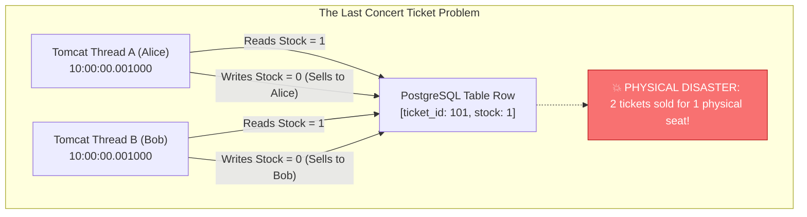
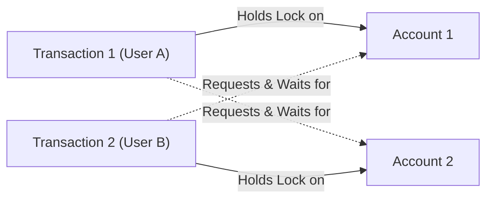
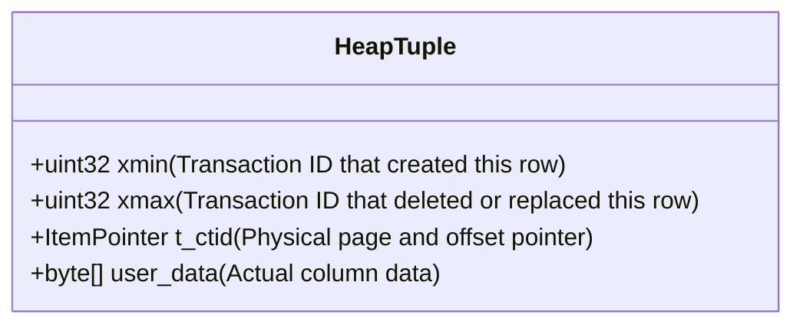
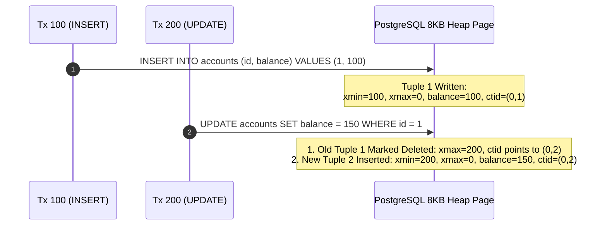
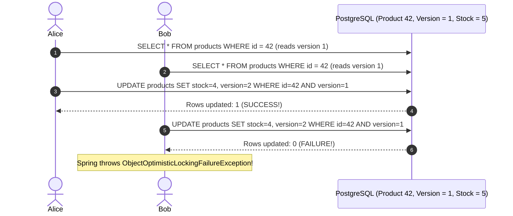
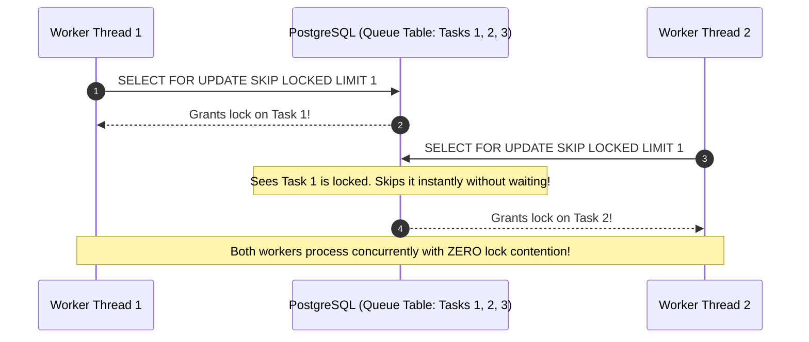
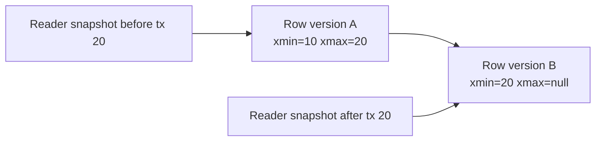

## Prerequisites: Before You Begin

Before studying database locking and isolation, ensure you understand:
- Relational database schema design and ACID transaction definitions.
- Java multithreading and how multiple CPU threads execute concurrent requests.
- Basic Spring Data JPA repositories and `@Transactional` boundaries.

---

# Phase 1: Ground Floor (Physical First Principles)

To understand database concurrency, you must understand what happens when two CPU cores try to manipulate the exact same physical byte of storage at the exact same microsecond.



### 1. The Concert Ticket Disaster
Imagine your application sells concert tickets. Exactly **1 ticket** remains for seat A-12:
1. At 10:00:00.001, Alice clicks "Buy Ticket." Thread A queries the database: `stock is 1`.
2. At 10:00:00.001, Bob clicks "Buy Ticket." Thread B queries the database: `stock is 1`.
3. Thread A decrements stock from 1 to 0 and issues ticket #101 to Alice.
4. Thread B decrements stock from 1 to 0 and issues ticket #101 to Bob!
5. **The Real-World Result**: Both Alice and Bob arrive at the concert venue holding valid receipts for the exact same physical seat!

This is a **Lost Update** anomaly. Without concurrency controls, concurrent threads overwrite each other's work blindly.

---

# Phase 2: The Naive Code (The Production Crash)

When developers encounter concurrency bugs, their instinctive fixes frequently cause worse catastrophes in production.

### Catastrophe 1: The "Read-Then-Update" Lost Update

```java
// NAIVE CODE: DESTROYS INVENTORY INTEGRITY UNDER TRAFFIC!
@Transactional
public void purchaseItem(Long productId, int quantity) {
    // Step 1: Read from database
    Product product = productRepository.findById(productId).orElseThrow();

    // Step 2: Check in-memory Java state
    if (product.getStock() < quantity) {
        throw new OutOfStockException("Insufficient inventory!");
    }

    // Step 3: Write back to database
    product.setStock(product.getStock() - quantity);
    productRepository.save(product);
}
```

#### Why Production Bleeds Inventory:
If 50 users attempt to purchase simultaneously, multiple threads read the exact same initial stock value. Each thread subtracts from that stale number and writes it back. 

Instead of deducting 50 items, the database might only deduct 5 items. **45 customer purchases vanished from inventory tracking**, resulting in massive stock overselling.

---

### Catastrophe 2: The Java `synchronized` Anti-Pattern

A developer thinks: *"I will just add Java's `synchronized` keyword to the controller method!"*

```java
// FATAL ARCHITECTURAL MISTAKE: synchronized IN WEB APIS!
@Service
public class TicketService {

    public synchronized void purchaseTicket(Long ticketId) {
        // ...
    }
}
```

#### Why `synchronized` Completely Fails in Production:
1. **Fails Across Kubernetes Pods**: `synchronized` only locks threads inside a **single JVM process**. As soon as you deploy 2 or more replicas in Kubernetes, threads on Pod 1 and Pod 2 execute concurrently with zero synchronization!
2. **Total Throughput Collapse**: On a single pod, `synchronized` serializes all incoming requests. If 1,000 users try to buy tickets for 100 different concerts, they are all forced into a single-file queue. The server throughput collapses to 5 requests per second, causing massive HTTP 504 Gateway Timeouts.

---

### Catastrophe 3: Deadlock Disasters with Inconsistent Lock Ordering

A developer decides to lock rows using `SELECT ... FOR UPDATE`. But they don't enforce lock order:

```java
// User A transfers from Account 1 to Account 2
public void transferA(Long from, Long to) {
    accountRepo.lock(1L); // Locks 1
    accountRepo.lock(2L); // Waits for 2
}

// User B transfers from Account 2 to Account 1
public void transferB(Long from, Long to) {
    accountRepo.lock(2L); // Locks 2
    accountRepo.lock(1L); // Waits for 1
}
```



#### The Production Deadlock:
Neither transaction can proceed because each holds a lock the other needs. 

PostgreSQL's background deadlock detector runs, detects the circular wait, and **violently kills one of the transactions**:
`ERROR: deadlock detected - Process 4281 waits for ExclusiveLock; blocked by process 4282.`

---

# Phase 3: Under the Hood (Mechanics & Bytecode)

To build bulletproof concurrent systems, you must understand how the database engine manages row versions and locks.

## 1. PostgreSQL MVCC Internals: How Snapshots Work

PostgreSQL implements concurrency through **Multi-Version Concurrency Control (MVCC)** under the core philosophy: **"Readers never block writers, and writers never block readers."**

### Tuple Header Anatomy: `xmin` and `xmax`
Every table row (tuple) on disk contains hidden system header columns:



- **`xmin`**: The Transaction ID ($XID$) that inserted this row version.
- **`xmax`**: The Transaction ID ($XID$) that deleted or updated this row (0 if active and un-deleted).
- **`t_ctid`**: The physical disk pointer `(page_number, tuple_offset)`.

### Why `UPDATE` is Physically `INSERT` + `DELETE`
In PostgreSQL, an `UPDATE` **never modifies disk bytes in place**. An `UPDATE` physically inserts a brand-new row version and sets `xmax` on the old row version!



<Tip>
**Why VACUUM is Mandatory**: Because old tuples remain on disk so long as older concurrent transactions might still see them, PostgreSQL runs a background process called **VACUUM** to clean up dead rows after all transactions that could see them have finished!
</Tip>

---

## 2. The 3 Production Concurrency Control Strategies

### Strategy 1: Atomic SQL Updates (Fastest & Simplest)
Eliminates Java-side race conditions by letting the database execute the subtraction and validation in a single atomic statement:

```sql
UPDATE inventory
SET available_quantity = available_quantity - :quantity
WHERE product_id = :productId
  AND available_quantity >= :quantity;
```

```java
@Modifying
@Query("""
    UPDATE Inventory i 
    SET i.availableQuantity = i.availableQuantity - :qty 
    WHERE i.productId = :productId AND i.availableQuantity >= :qty
""")
int reserveStock(@Param("productId") Long productId, @Param("qty") int qty);

// Usage: Check affected rows!
int updatedRows = inventoryRepository.reserveStock(101L, 2);
if (updatedRows == 0) {
    throw new InsufficientStockException("Item out of stock or insufficient quantity");
}
```

Line by line:

- `UPDATE inventory` moves the operation into PostgreSQL, where row locks and MVCC rules can protect the change.
- `SET available_quantity = available_quantity - :quantity` subtracts from the current committed row value, not from a stale Java copy.
- `WHERE product_id = :productId` scopes the update to one product.
- `AND available_quantity >= :quantity` turns the business invariant into a database guard.
- `@Modifying` tells Spring Data this query changes rows instead of selecting entities.
- The repository returns `int` because the affected-row count is the success signal.
- `updatedRows == 0` means the database refused the reservation because no row matched the product and stock condition at update time.

Proof test:

```console
Seed product 101 with available_quantity = 2.
Start 10 concurrent transactions, each reserving quantity 1.
Exactly 2 calls should return updatedRows = 1.
Exactly 8 calls should return updatedRows = 0.
Final available_quantity must be 0, never negative.
```

Senior phrasing: "I prefer atomic SQL for simple counters because it collapses read, validation, and write into one database statement. Java never observes a stale stock value and tries to write it back later."

---

### Strategy 2: Optimistic Locking with `@Version` (Best for Low Contention)
Assumes concurrent collisions are rare. Hibernate checks a version counter column upon update:



```java
@Entity
public class Product {
    @Id private Long id;
    private int stock;

    @Version // Hibernate increments this automatically on every update
    private Long version;
}
```

---

### Strategy 3: Pessimistic Locking with `SELECT ... FOR UPDATE` (Best for High Contention)
For flash sales or ticketing where 1,000 users fight over 10 items, optimistic locking causes 990 wasteful rollback retries. 

Pessimistic locking acquires an **exclusive row-level lock** at read time, forcing other transactions to wait in a clean queue:

```java
public interface InventoryRepository extends JpaRepository<Inventory, Long> {

    @Lock(LockModeType.PESSIMISTIC_WRITE)
    @QueryHints({
        @QueryHint(name = "jakarta.persistence.lock.timeout", value = "3000") // 3-second timeout
    })
    @Query("SELECT i FROM Inventory i WHERE i.productId = :productId")
    Optional<Inventory> findByIdForUpdate(@Param("productId") Long productId);
}
```

---

## 3. High-Throughput Worker Queues: `FOR UPDATE SKIP LOCKED`

If 50 background worker threads poll a database table for pending jobs:
- Regular `FOR UPDATE` causes all 50 workers to fight over Row 1, locking each other up.
- `SKIP LOCKED` tells PostgreSQL: *"If another worker is currently processing Row 1, skip it immediately and give me Row 2!"*

```sql
SELECT * 
FROM background_tasks
WHERE status = 'PENDING'
ORDER BY priority DESC, created_at ASC
LIMIT 1
FOR UPDATE SKIP LOCKED;
```



---

## 4. The Canonical Ordering Rule: Deadlock Elimination

To mathematically guarantee that two transactions can **never** deadlock:

```java
// ALWAYS sort IDs before acquiring multiple locks!
public void transferMoney(Long fromAccountId, Long toAccountId, BigDecimal amount) {
    Long firstLockId = Math.min(fromAccountId, toAccountId);
    Long secondLockId = Math.max(fromAccountId, toAccountId);

    // Guaranteed canonical lock acquisition order eliminates circular wait!
    Account first = accountRepository.findByIdForUpdate(firstLockId);
    Account second = accountRepository.findByIdForUpdate(secondLockId);
}
```

Because every transaction locks in ascending order ($1 \rightarrow 2$), a circular dependency ($1 \rightarrow 2$ vs $2 \rightarrow 1$) is mathematically impossible.

---

# Phase 4: Senior Interview Ace (Junior vs. Staff Phrasing)

Senior interviewers ask locking and isolation questions to see if you understand the boundary between application memory and database engine locks.

### Q1: "What is the difference between Optimistic Locking and Pessimistic Locking, and when do you choose each?"

```diff
- JUNIOR ANSWER:
  "Optimistic locking uses a version column. Pessimistic locking locks the database. 
   Optimistic locking is faster because it doesn't lock."
```

```diff
+ SENIOR / STAFF ANSWER:
  "Optimistic Locking assumes collisions are infrequent. It uses a @Version column and issues 
   conditional updates: 'UPDATE table SET ..., version = 2 WHERE id = 1 AND version = 1'. If another transaction 
   committed first, zero rows are updated, and Hibernate throws ObjectOptimisticLockingFailureException. 
   It has zero database lock overhead, making it ideal for low-to-moderate contention read-heavy systems.
   
   Pessimistic Locking uses SQL 'SELECT ... FOR UPDATE' to acquire an exclusive row-level write lock 
   at the database engine level, forcing concurrent transactions to block until commit or rollback. 
   We choose Pessimistic Locking in high-contention scenarios (such as flash sales or inventory checkouts) 
   where optimistic locking would trigger catastrophic retry storms and wasted CPU cycles."
```

---

### Q2: "How does PostgreSQL implement MVCC, and why do readers never block writers?"

```diff
- JUNIOR ANSWER:
  "PostgreSQL uses MVCC so readers don't block writers. It keeps copies of data in memory."
```

```diff
+ SENIOR / STAFF ANSWER:
  "PostgreSQL implements MVCC by maintaining multiple physical tuple versions on disk pages using 
   hidden system headers: 'xmin' (the creating transaction ID) and 'xmax' (the deleting/updating transaction ID).
   
   When a row is updated, PostgreSQL does not overwrite data in place; it inserts a new tuple with a new xmin 
   and marks the old tuple's xmax with the updating transaction ID. 
   
   When a reader executes, PostgreSQL takes a transaction snapshot recording active in-progress transaction IDs. 
   The reader evaluates tuple visibility by comparing xmin/xmax against its snapshot, seamlessly reading the 
   latest committed version without acquiring any row locks. Writers acquire row-level exclusive locks to mutate 
   new tuples, allowing readers and writers to operate concurrently with zero lock blocking."
```

---

### Q3: "What is Write Skew, and why does REPEATABLE READ fail to prevent it?"

```diff
- JUNIOR ANSWER:
  "Write skew is a concurrency bug where writes get messed up. You fix it with transactions."
```

```diff
+ SENIOR / STAFF ANSWER:
  "Write Skew (Anomaly A5B) occurs when two concurrent transactions read overlapping data, verify a shared 
   business invariant, make disjoint mutations to different rows, and both commit—destroying system integrity.
   
   A classic example is the Doctor On-Call Dilemma: The invariant requires at least 1 doctor on-call. 
   Both Dr. Alice and Dr. Bob request leave at the same time. Under REPEATABLE READ, Alice checks active doctors 
   (count=2) and takes leave. Bob checks active doctors (count=2) and takes leave. Both transactions commit! 
   Because Alice updated Alice's row and Bob updated Bob's row, neither row had conflicting row writes, 
   so REPEATABLE READ snapshots permitted both to commit, leaving zero doctors on duty!
   
   We prevent Write Skew by either materializing locks (locking the parent Department row with FOR UPDATE) 
   or elevating to SERIALIZABLE isolation, which uses Serializable Snapshot Isolation (SSI) to detect 
   read-write dependency cycles (si-locks) and abort the conflicting transaction."
```

---

### Q4: "How does `SELECT ... FOR UPDATE SKIP LOCKED` work, and why is it essential for distributed background workers?"

```diff
- JUNIOR ANSWER:
  "SKIP LOCKED skips locked rows so you don't get errors."
```

```diff
+ SENIOR / STAFF ANSWER:
  "Standard 'FOR UPDATE' causes concurrent worker threads to block on the same locked row, serializing 
   queue consumption and degrading throughput. 
   
   'SKIP LOCKED' instructs PostgreSQL to inspect row lock states and immediately bypass any tuple currently 
   locked by an active transaction, acquiring an exclusive lock on the next available unlocked row matching 
   the query predicate. 
   
   This enables a single database table to function as a distributed, high-throughput FIFO task queue where 
   hundreds of worker pods can poll and dequeue tasks concurrently with zero lock contention, zero waiting, 
   and zero duplicate task execution."
```

---

## Locking & Isolation Fundamentals Interview Map

Transactions are not enough unless you understand what they isolate.

### 1. Read phenomena in plain English

| Anomaly | Meaning |
| :--- | :--- |
| Dirty read | You read data another transaction has not committed |
| Non-repeatable read | You read the same row twice and get different values |
| Phantom read | You repeat a range query and new matching rows appear |
| Lost update | Two writers overwrite each other's change |
| Write skew | Two transactions update different rows but break one shared rule |

### 2. MVCC means readers do not block writers

PostgreSQL keeps row versions. A reader sees the version visible to its snapshot.



An `UPDATE` creates a new tuple version; it does not overwrite the old bytes in place.

### 3. Row locks protect rows, not ideas

`SELECT ... FOR UPDATE` locks selected rows. It does not automatically lock rows that do not exist or a count-based invariant.

For "at least one doctor must remain on call," two transactions can update different doctor rows and both commit unless you lock a shared parent row or use serializable isolation.

### 4. Atomic SQL is often the simplest correctness tool

Bad:

```java
Inventory inv = repo.findByProductId(id).orElseThrow();
if (inv.available() >= qty) {
    inv.decrease(qty);
}
```

Better:

```sql
UPDATE inventory
SET available_quantity = available_quantity - :qty
WHERE product_id = :productId
  AND available_quantity >= :qty;
```

If updated row count is `1`, the reservation succeeded. If `0`, it failed without overselling.

### Build-Break-Fix Lab

<Steps>
  <Step title="Build">
    Create an inventory reservation table with one product and limited stock.
  </Step>
  <Step title="Break">
    Use read-then-write logic from Java under 20 concurrent requests.
  </Step>
  <Step title="Observe">
    Reproduce lost update or overselling.
  </Step>
  <Step title="Fix">
    Replace it with atomic SQL or optimistic/pessimistic locking.
  </Step>
  <Step title="Prove">
    Add a concurrent integration test where exactly available stock count succeeds.
  </Step>
</Steps>

---

## Failure Modes & Edge Case Matrix

| Failure Mode | Root Cause | Impact | Production Defense |
| :--- | :--- | :--- | :--- |
| **Lost Update** | Blind read-then-update in Java | Concurrent updates overwrite each other silently | Use Atomic SQL updates, `@Version` optimistic locking, or `FOR UPDATE`. |
| **Application Deadlock** | Inconsistent lock acquisition order | Transactions abort with deadlock errors | Enforce the Canonical Ordering Rule (`Math.min()` before `Math.max()`). |
| **Lock Timeout Saturation** | Holding row lock while executing slow remote HTTP API | Connection pool starves; API blackouts | Never execute network calls while holding database row locks. |
| **Write Skew Invariant Loss** | Concurrent updates to different rows under REPEATABLE READ | Business rule violated despite ACID | Use `SERIALIZABLE` isolation or lock parent record with `FOR UPDATE`. |
| **Queue Worker Bottleneck** | Workers polling tasks with plain `FOR UPDATE` | All workers block waiting for one row | Use `SELECT ... FOR UPDATE SKIP LOCKED` for lock-free queue processing. |

---

## Done Checklist

<Check>
- [ ] Understand the physical hardware race condition when multiple CPU threads mutate shared storage.
- [ ] Diagram PostgreSQL MVCC tuple headers (`xmin`, `xmax`, `t_ctid`) and explain why `UPDATE` is `INSERT` + `DELETE`.
- [ ] Enforce Atomic SQL updates for simple counter and balance decrements.
- [ ] Implement Optimistic Locking with `@Version` for low-contention entities.
- [ ] Deploy Pessimistic Locking (`FOR UPDATE`) for high-contention flash sales and ticketing systems.
- [ ] Eliminate worker queue lock contention using `FOR UPDATE SKIP LOCKED`.
- [ ] Mathematically eliminate deadlocks using the Canonical Ordering Rule.
</Check>
