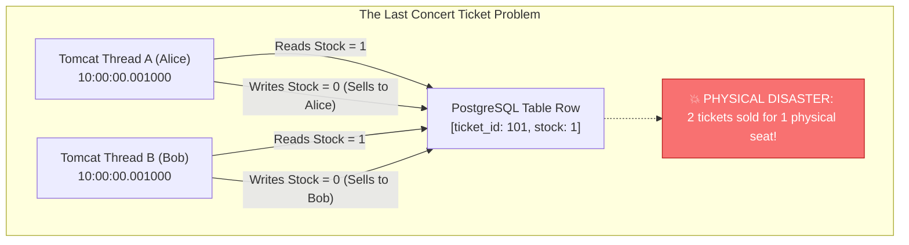
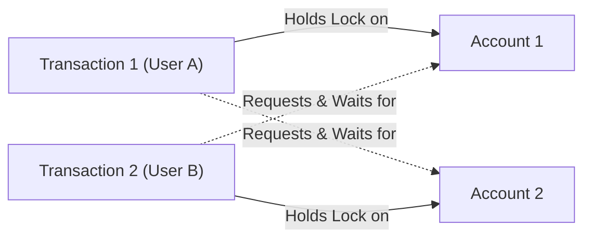
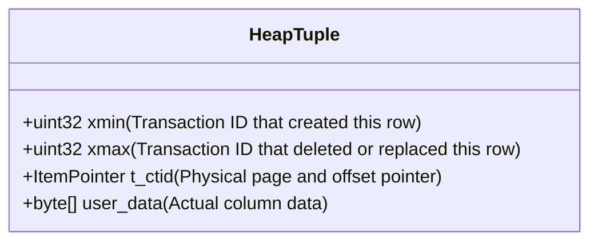
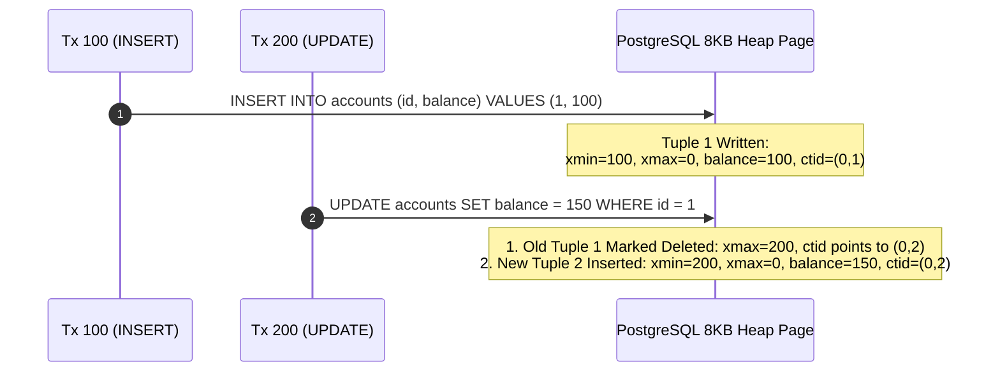
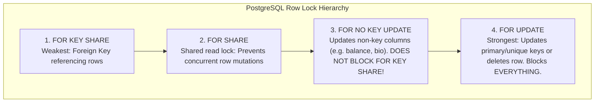
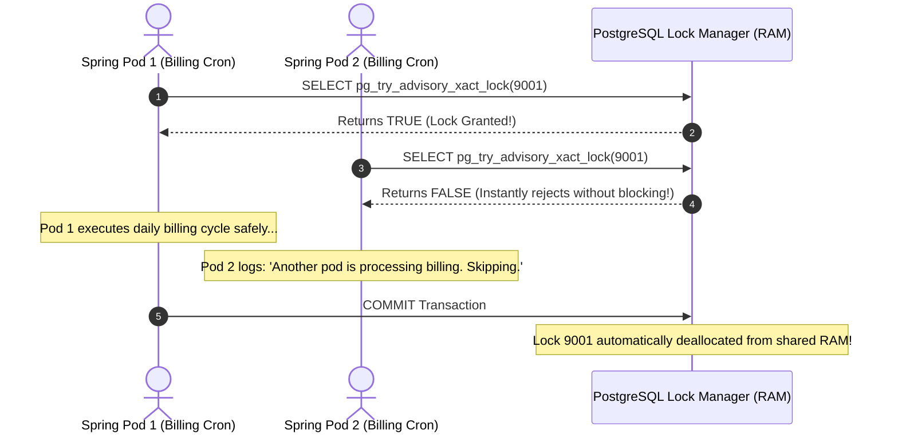
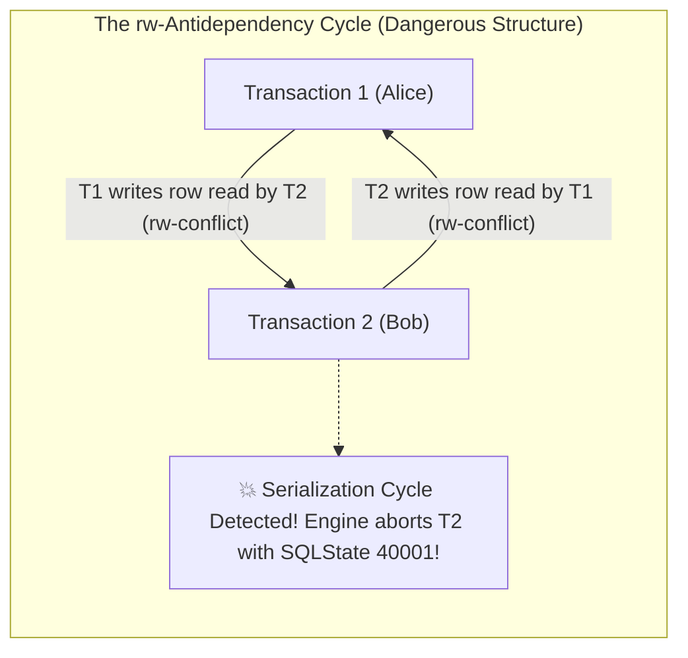

## Prerequisites: Before You Begin

Before studying database locking and isolation, ensure you understand:
- Relational database schema design and ACID transaction definitions.
- Java multithreading and how multiple CPU threads execute concurrent requests.
- Basic Spring Data JPA repositories and `@Transactional` boundaries.

---

# Phase 1: Ground Floor (Physical First Principles)

To understand database concurrency, you must understand what happens when two CPU cores try to manipulate the exact same physical byte of storage at the exact same microsecond.



### 1. The Concert Ticket Disaster
Imagine your application sells concert tickets. Exactly **1 ticket** remains for seat A-12:
1. At 10:00:00.001, Alice clicks "Buy Ticket." Thread A queries the database: `stock is 1`.
2. At 10:00:00.001, Bob clicks "Buy Ticket." Thread B queries the database: `stock is 1`.
3. Thread A decrements stock from 1 to 0 and issues ticket #101 to Alice.
4. Thread B decrements stock from 1 to 0 and issues ticket #101 to Bob!
5. **The Real-World Result**: Both Alice and Bob arrive at the concert venue holding valid receipts for the exact same physical seat!

This is a **Lost Update** anomaly. Without concurrency controls, concurrent threads overwrite each other's work blindly.

---

# Phase 2: The Naive Code (The Production Crash)

When developers encounter concurrency bugs, their instinctive fixes frequently cause worse catastrophes in production.

### Catastrophe 1: The "Read-Then-Update" Lost Update

```java
// NAIVE CODE: DESTROYS INVENTORY INTEGRITY UNDER TRAFFIC!
@Transactional
public void purchaseItem(Long productId, int quantity) {
    // Step 1: Read from database
    Product product = productRepository.findById(productId).orElseThrow();

    // Step 2: Check in-memory Java state
    if (product.getStock() < quantity) {
        throw new OutOfStockException("Insufficient inventory!");
    }

    // Step 3: Write back to database
    product.setStock(product.getStock() - quantity);
    productRepository.save(product);
}
```

#### Why Production Bleeds Inventory:
If 50 users attempt to purchase simultaneously, multiple threads read the exact same initial stock value. Each thread subtracts from that stale number and writes it back. 

Instead of deducting 50 items, the database might only deduct 5 items. **45 customer purchases vanished from inventory tracking**, resulting in massive stock overselling.

---

### Catastrophe 2: The Java `synchronized` Anti-Pattern

A developer thinks: *"I will just add Java's `synchronized` keyword to the controller method!"*

```java
// FATAL ARCHITECTURAL MISTAKE: synchronized IN WEB APIS!
@Service
public class TicketService {

    public synchronized void purchaseTicket(Long ticketId) {
        // ...
    }
}
```

#### Why `synchronized` Completely Fails in Production:
1. **Fails Across Kubernetes Pods**: `synchronized` only locks threads inside a **single JVM process**. As soon as you deploy 2 or more replicas in Kubernetes, threads on Pod 1 and Pod 2 execute concurrently with zero synchronization!
2. **Total Throughput Collapse**: On a single pod, `synchronized` serializes all incoming requests. If 1,000 users try to buy tickets for 100 different concerts, they are all forced into a single-file queue. The server throughput collapses to 5 requests per second, causing massive HTTP 504 Gateway Timeouts.

---

### Catastrophe 3: Deadlock Disasters with Inconsistent Lock Ordering

A developer decides to lock rows using `SELECT ... FOR UPDATE`. But they don't enforce lock order:

```java
// User A transfers from Account 1 to Account 2
public void transferA(Long from, Long to) {
    accountRepo.lock(1L); // Locks 1
    accountRepo.lock(2L); // Waits for 2
}

// User B transfers from Account 2 to Account 1
public void transferB(Long from, Long to) {
    accountRepo.lock(2L); // Locks 2
    accountRepo.lock(1L); // Waits for 1
}
```



#### The Production Deadlock:
Neither transaction can proceed because each holds a lock the other needs. 

PostgreSQL's background deadlock detector runs, detects the circular wait, and **violently kills one of the transactions**:
`ERROR: deadlock detected - Process 4281 waits for ExclusiveLock; blocked by process 4282.`

---

# Phase 3: Under the Hood (Mechanics & Bytecode)

To build bulletproof concurrent systems, you must understand how the database engine manages row versions, table locks, and memory structures.

---

## 1. PostgreSQL MVCC Internals: How Snapshots Work

PostgreSQL implements concurrency through **Multi-Version Concurrency Control (MVCC)** under the core philosophy: **"Readers never block writers, and writers never block readers."**

### Tuple Header Anatomy: `xmin` and `xmax`
Every table row (tuple) on disk contains hidden system header columns:



- **`xmin`**: The Transaction ID ($XID$) that inserted this row version.
- **`xmax`**: The Transaction ID ($XID$) that deleted or updated this row (0 if active and un-deleted).
- **`t_ctid`**: The physical disk pointer `(page_number, tuple_offset)`.

### Why `UPDATE` is Physically `INSERT` + `DELETE`
In PostgreSQL, an `UPDATE` **never modifies disk bytes in place**. An `UPDATE` physically inserts a brand-new row version and sets `xmax` on the old row version!



<Tip>
**Why VACUUM is Mandatory**: Because old tuples remain on disk so long as older concurrent transactions might still see them, PostgreSQL runs a background process called **VACUUM** to clean up dead rows after all transactions that could see them have finished!
</Tip>

---

## 2. PostgreSQL Table-Level Lock Modes & Conflict Matrix

In PostgreSQL, every SQL statement automatically acquires a **Table-Level Lock** in shared memory to protect against conflicting structural schema changes.

There are **8 Table Lock Modes**, arranged in ascending order of restrictiveness:

| Lock Mode | Acquired By Statements | Conflicts With |
| :--- | :--- | :--- |
| **`ACCESS SHARE`** | `SELECT` | `ACCESS EXCLUSIVE` |
| **`ROW SHARE`** | `SELECT FOR UPDATE / FOR SHARE` | `EXCLUSIVE`, `ACCESS EXCLUSIVE` |
| **`ROW EXCLUSIVE`** | `INSERT`, `UPDATE`, `DELETE` | `SHARE`, `SHARE ROW EXCLUSIVE`, `EXCLUSIVE`, `ACCESS EXCLUSIVE` |
| **`SHARE UPDATE EXCLUSIVE`** | `VACUUM (without FULL)`, `ANALYZE`, `CREATE INDEX CONCURRENTLY` | `SHARE UPDATE EXCLUSIVE`, `SHARE`, `SHARE ROW EXCLUSIVE`, `EXCLUSIVE`, `ACCESS EXCLUSIVE` |
| **`SHARE`** | `CREATE INDEX (non-concurrent)` | `ROW EXCLUSIVE`, `SHARE UPDATE EXCLUSIVE`, `SHARE ROW EXCLUSIVE`, `EXCLUSIVE`, `ACCESS EXCLUSIVE` |
| **`SHARE ROW EXCLUSIVE`** | `CREATE TRIGGER`, unindexed FK checks | `ROW EXCLUSIVE`, `SHARE UPDATE EXCLUSIVE`, `SHARE`, `SHARE ROW EXCLUSIVE`, `EXCLUSIVE`, `ACCESS EXCLUSIVE` |
| **`EXCLUSIVE`** | `REFRESH MATERIALIZED VIEW CONCURRENTLY` | `ROW SHARE`, `ROW EXCLUSIVE`, `SHARE UPDATE EXCLUSIVE`, `SHARE`, `SHARE ROW EXCLUSIVE`, `EXCLUSIVE`, `ACCESS EXCLUSIVE` |
| **`ACCESS EXCLUSIVE`** | `ALTER TABLE`, `DROP TABLE`, `TRUNCATE`, `VACUUM FULL`, `REINDEX TABLE` | **ALL OTHER LOCK MODES** (Blocks all reads and writes!) |

### The Table Lock Conflict Matrix

$$\begin{array}{l|cccccccc}
\textbf{Requested} \downarrow \;/\; \textbf{Existing} \rightarrow & \text{AS} & \text{RS} & \text{RE} & \text{SUE} & \text{S} & \text{SRE} & \text{E} & \text{AE} \\
\hline
\text{ACCESS SHARE (AS)} & & & & & & & & \mathbf{X} \\
\text{ROW SHARE (RS)} & & & & & & & \mathbf{X} & \mathbf{X} \\
\text{ROW EXCLUSIVE (RE)} & & & & & \mathbf{X} & \mathbf{X} & \mathbf{X} & \mathbf{X} \\
\text{SHARE UPDATE EXCL (SUE)} & & & & \mathbf{X} & \mathbf{X} & \mathbf{X} & \mathbf{X} & \mathbf{X} \\
\text{SHARE (S)} & & & \mathbf{X} & \mathbf{X} & & \mathbf{X} & \mathbf{X} & \mathbf{X} \\
\text{SHARE ROW EXCL (SRE)} & & & \mathbf{X} & \mathbf{X} & \mathbf{X} & \mathbf{X} & \mathbf{X} & \mathbf{X} \\
\text{EXCLUSIVE (E)} & & \mathbf{X} & \mathbf{X} & \mathbf{X} & \mathbf{X} & \mathbf{X} & \mathbf{X} & \mathbf{X} \\
\text{ACCESS EXCLUSIVE (AE)} & \mathbf{X} & \mathbf{X} & \mathbf{X} & \mathbf{X} & \mathbf{X} & \mathbf{X} & \mathbf{X} & \mathbf{X} \\
\end{array}$$

*(Where $\mathbf{X}$ denotes a blocking conflict).*

<Warning>
### The DDL Lock Queue Trap
Notice that `ACCESS EXCLUSIVE` conflicts with `ACCESS SHARE`. If an analytics query runs a 10-minute `SELECT` (`ACCESS SHARE`), and an engineer issues `ALTER TABLE users ADD COLUMN bio TEXT` (`ACCESS EXCLUSIVE`):
1. The `ALTER TABLE` blocks behind the `SELECT`.
2. **Every subsequent `SELECT` on `users` queues behind the `ALTER TABLE`!**
3. Within 15 seconds, all Tomcat threads freeze, and the entire backend crashes!

**Production Rule**: Always set a lock timeout before executing DDL:
```sql
SET lock_timeout = '2s';
ALTER TABLE users ADD COLUMN bio TEXT;
```
</Warning>

---

## 3. Row-Level Lock Modes & `FOR NO KEY UPDATE`

PostgreSQL provides **4 Row-Level Lock Modes**:



### Row Lock Conflict Matrix

| Requested $\downarrow$ / Current $\rightarrow$ | `FOR KEY SHARE` | `FOR SHARE` | `FOR NO KEY UPDATE` | `FOR UPDATE` |
| :--- | :---: | :---: | :---: | :---: |
| **`FOR KEY SHARE`** | No | No | **No (Permitted!)** | Conflict |
| **`FOR SHARE`** | No | No | Conflict | Conflict |
| **`FOR NO KEY UPDATE`** | **No (Permitted!)** | Conflict | Conflict | Conflict |
| **`FOR UPDATE`** | Conflict | Conflict | Conflict | Conflict |

### Why `FOR NO KEY UPDATE` Is Critical for High-Throughput APIs
When an order is created, PostgreSQL checks referential integrity on `users(id)` by acquiring a **`FOR KEY SHARE`** lock on the referenced user tuple.

If your user profile service locks the user row with standard `FOR UPDATE`:
```sql
-- DANGEROUS: Blocks ALL incoming orders for this user!
SELECT * FROM users WHERE id = 42 FOR UPDATE;
```
Concurrent order creations trying to verify the foreign key `REFERENCES users(id)` will **block** waiting for `FOR UPDATE` to release!

**The Production Fix**: If you are modifying non-primary-key columns (e.g. updating user balance or name), use **`FOR NO KEY UPDATE`**:
```sql
-- SAFE: Does NOT block foreign key validation on child tables!
SELECT * FROM users WHERE id = 42 FOR NO KEY UPDATE;
```

---

## 4. Distributed Advisory Locks in Spring Boot

Why introduce Redis (Redisson) for distributed locking when PostgreSQL provides kernel-level **Advisory Locks** for free?

An Advisory Lock is an application-defined lock stored in PostgreSQL's shared memory lock table:
- **No table or disk row is locked**.
- The lock target is an arbitrary 64-bit integer (`bigint`).
- **Session-level** (`pg_advisory_lock`): Survives transactions; released on socket disconnect.
- **Transaction-level** (`pg_advisory_xact_lock`): Released automatically when `@Transactional` commits or rolls back!



### Production Spring Boot Implementation
```java
package com.backendmastery.service;

import org.slf4j.Logger;
import org.slf4j.LoggerFactory;
import org.springframework.jdbc.core.JdbcTemplate;
import org.springframework.stereotype.Service;
import org.springframework.transaction.annotation.Transactional;

@Service
public class DistributedBillingService {

    private static final Logger log = LoggerFactory.getLogger(DistributedBillingService.class);
    private static final long BILLING_JOB_LOCK_ID = 8492041289410L;

    private final JdbcTemplate jdbcTemplate;

    public DistributedBillingService(JdbcTemplate jdbcTemplate) {
        this.jdbcTemplate = jdbcTemplate;
    }

    @Transactional
    public void executeNightlyBilling() {
        // Non-blocking try-lock: Returns false immediately if another pod holds the lock!
        Boolean acquired = jdbcTemplate.queryForObject(
                "SELECT pg_try_advisory_xact_lock(?)", 
                Boolean.class, 
                BILLING_JOB_LOCK_ID
        );

        if (Boolean.FALSE.equals(acquired)) {
            log.info("Nightly billing job is already being executed by another pod. Skipping execution.");
            return;
        }

        log.info("Advisory lock acquired. Beginning billing calculations...");
        // Execute mission-critical single-leader batch process...
    }
}
```

---

## 5. Serializable Snapshot Isolation (SSI) Internals

The ANSI standard defines `SERIALIZABLE` as the gold standard of consistency. Classic database engines achieved this using pessimistic Two-Phase Locking (S2PL), causing severe reader-writer stalls.

PostgreSQL uses **Serializable Snapshot Isolation (SSI)**:
- Readers **never block writers**, and writers **never block readers**.
- Transactions execute concurrently against standard MVCC snapshots.
- The PostgreSQL lock manager tracks **SIREAD locks** (Predicate Locks) in shared memory to detect **rw-antidependency cycles**.



### Handling Serialization Failures (`40001`) in Spring Boot
When using `Isolation.SERIALIZABLE`, applications **must expect and retry** transaction failures:

```java
@Service
public class DoctorShiftService {

    @Retryable(
        retryFor = { CannotAcquireLockException.class, ConcurrencyFailureException.class },
        maxAttempts = 5,
        backoff = @Backoff(delay = 50, multiplier = 2.0)
    )
    @Transactional(isolation = Isolation.SERIALIZABLE)
    public void requestLeave(Long doctorId) {
        // Business logic protected against write skew...
    }
}
```

---

## 6. Deadlock Detection Engine & Timeout Defenses

PostgreSQL runs a background deadlock detector thread. When a process blocks waiting for a lock, it sleeps until **`deadlock_timeout`** (default $1,000\text{ ms}$). If the lock is not granted after 1 second, the engine constructs a directed **Wait-For Graph** across all blocked processes in shared memory and searches for cycles.

If a cycle exists, PostgreSQL aborts the transaction with the fewest locks held:
`ERROR: 40P01: deadlock detected`.

### The Production Timeout Triad
Never run high-throughput enterprise databases without configuring the production timeout triad:

```ini
# postgresql.conf (Production Lock Defenses)
lock_timeout = 3s                         # Kill any statement waiting longer than 3s for a lock
statement_timeout = 30s                   # Kill any query running longer than 30s
idle_in_transaction_session_timeout = 10s # Terminate connections holding locks while idle!
```

---

## 7. The 3 Production Concurrency Control Strategies

### Strategy 1: Atomic SQL Updates (Fastest & Simplest)
```sql
UPDATE inventory
SET available_quantity = available_quantity - :quantity
WHERE product_id = :productId
  AND available_quantity >= :quantity;
```

```java
@Modifying
@Query("""
    UPDATE Inventory i 
    SET i.availableQuantity = i.availableQuantity - :qty 
    WHERE i.productId = :productId AND i.availableQuantity >= :qty
""")
int reserveStock(@Param("productId") Long productId, @Param("qty") int qty);
```

### Strategy 2: Optimistic Locking with `@Version`
```java
@Entity
public class Product {
    @Id private Long id;
    private int stock;

    @Version
    private Long version;
}
```

### Strategy 3: Pessimistic Locking with `SELECT ... FOR UPDATE`
```java
public interface InventoryRepository extends JpaRepository<Inventory, Long> {

    @Lock(LockModeType.PESSIMISTIC_WRITE)
    @QueryHints({
        @QueryHint(name = "jakarta.persistence.lock.timeout", value = "3000")
    })
    @Query("SELECT i FROM Inventory i WHERE i.productId = :productId")
    Optional<Inventory> findByIdForUpdate(@Param("productId") Long productId);
}
```

### High-Throughput Worker Queues: `FOR UPDATE SKIP LOCKED`
```sql
SELECT * 
FROM background_tasks
WHERE status = 'PENDING'
ORDER BY priority DESC, created_at ASC
LIMIT 1
FOR UPDATE SKIP LOCKED;
```

---

## 8. The Canonical Ordering Rule: Deadlock Elimination

```java
// ALWAYS sort IDs before acquiring multiple locks!
public void transferMoney(Long fromAccountId, Long toAccountId, BigDecimal amount) {
    Long firstLockId = Math.min(fromAccountId, toAccountId);
    Long secondLockId = Math.max(fromAccountId, toAccountId);

    // Guaranteed canonical lock acquisition order eliminates circular wait!
    Account first = accountRepository.findByIdForUpdate(firstLockId);
    Account second = accountRepository.findByIdForUpdate(secondLockId);
}
```

---

# Phase 4: Senior Interview Ace

### Q1: "What is the difference between Optimistic Locking and Pessimistic Locking, and when do you choose each?"

```diff
- JUNIOR ANSWER:
  "Optimistic locking uses a version column. Pessimistic locking locks the database."
```

```diff
+ SENIOR / STAFF ANSWER:
  "Optimistic Locking assumes collisions are infrequent. It uses a @Version column and issues 
   conditional updates: 'UPDATE table SET ..., version = 2 WHERE id = 1 AND version = 1'. If another transaction 
   committed first, zero rows are updated, and Hibernate throws ObjectOptimisticLockingFailureException. 
   It has zero database lock overhead, making it ideal for low-to-moderate contention read-heavy systems.
   
   Pessimistic Locking uses SQL 'SELECT ... FOR UPDATE' to acquire an exclusive row-level write lock 
   at the database engine level, forcing concurrent transactions to block until commit or rollback. 
   We choose Pessimistic Locking in high-contention scenarios (such as flash sales or inventory checkouts) 
   where optimistic locking would trigger catastrophic retry storms and wasted CPU cycles."
```

---

### Q2: "Why should you prefer `SELECT ... FOR NO KEY UPDATE` over `FOR UPDATE` in transactional APIs?"

```diff
- JUNIOR ANSWER:
  "FOR NO KEY UPDATE is a faster version of FOR UPDATE."
```

```diff
+ SENIOR / STAFF ANSWER:
  "Standard 'FOR UPDATE' acquires an exclusive row lock that blocks all other row-level locks, including 
   'FOR KEY SHARE'. When other transactions insert or delete rows in child tables with foreign keys referencing 
   this parent row, PostgreSQL must acquire a 'FOR KEY SHARE' lock to ensure referential integrity.
   
   If a parent row is locked with 'FOR UPDATE', all concurrent foreign key insertions on child tables block, 
   creating high lock contention and deadlock risks. 
   
   'FOR NO KEY UPDATE' locks the row for mutation of non-primary-key columns (like balance or status) but 
   explicitly permits concurrent 'FOR KEY SHARE' locks. This allows child tables to validate foreign keys 
   concurrently without blocking."
```

---

### Q3: "What is Write Skew, and why does REPEATABLE READ fail to prevent it?"

```diff
- JUNIOR ANSWER:
  "Write skew is a concurrency bug where writes get messed up. You fix it with transactions."
```

```diff
+ SENIOR / STAFF ANSWER:
  "Write Skew occurs when two concurrent transactions read overlapping data, verify a shared 
   business invariant, make disjoint mutations to different rows, and both commit—destroying system integrity.
   
   A classic example is the Doctor On-Call Dilemma: The invariant requires at least 1 doctor on-call. 
   Both Dr. Alice and Dr. Bob request leave at the same time. Under REPEATABLE READ, Alice checks active doctors 
   (count=2) and takes leave. Bob checks active doctors (count=2) and takes leave. Both transactions commit! 
   Because Alice updated Alice's row and Bob updated Bob's row, neither row had conflicting row writes, 
   so REPEATABLE READ snapshots permitted both to commit, leaving zero doctors on duty!
   
   We prevent Write Skew by either materializing locks (locking the parent Department row with FOR UPDATE) 
   or elevating to SERIALIZABLE isolation, which uses SSI to detect read-write dependency cycles and abort one transaction."
```

---

## Production Debug Checklist

```sql
-- 1. Inspect Blocked Processes and Lock Wait Queues
SELECT 
    blocked_locks.pid AS blocked_pid,
    blocked_activity.usename AS blocked_user,
    blocking_locks.pid AS blocking_pid,
    blocking_activity.usename AS blocking_user,
    blocked_activity.query AS blocked_statement,
    blocking_activity.query AS current_statement_in_blocking_process
FROM pg_catalog.pg_locks blocked_locks
JOIN pg_catalog.pg_stat_activity blocked_activity ON blocked_activity.pid = blocked_locks.pid
JOIN pg_catalog.pg_locks blocking_locks 
    ON blocking_locks.locktype = blocked_locks.locktype
    AND blocking_locks.database IS NOT DISTINCT FROM blocked_locks.database
    AND blocking_locks.relation IS NOT DISTINCT FROM blocked_locks.relation
    AND blocking_locks.page IS NOT DISTINCT FROM blocked_locks.page
    AND blocking_locks.tuple IS NOT DISTINCT FROM blocked_locks.tuple
    AND blocking_locks.virtualxid IS NOT DISTINCT FROM blocked_locks.virtualxid
    AND blocking_locks.transactionid IS NOT DISTINCT FROM blocked_locks.transactionid
    AND blocking_locks.classid IS NOT DISTINCT FROM blocked_locks.classid
    AND blocking_locks.objid IS NOT DISTINCT FROM blocked_locks.objid
    AND blocking_locks.objsubid IS NOT DISTINCT FROM blocked_locks.objsubid
    AND blocking_locks.pid != blocked_locks.pid
JOIN pg_catalog.pg_stat_activity blocking_activity ON blocking_activity.pid = blocking_locks.pid
WHERE NOT blocked_locks.granted;
```

---

## Failure Modes & Edge Case Matrix

| Failure Mode | Root Cause | Impact | Production Defense |
| :--- | :--- | :--- | :--- |
| **Lost Update** | Blind read-then-update in Java | Concurrent updates overwrite each other silently | Use Atomic SQL updates, `@Version` optimistic locking, or `FOR UPDATE`. |
| **Application Deadlock** | Inconsistent lock acquisition order | Transactions abort with deadlock errors | Enforce the Canonical Ordering Rule (`Math.min()` before `Math.max()`). |
| **DDL Queue Starvation** | `ALTER TABLE` queues behind slow analytical `SELECT` | All web traffic queues behind `ACCESS EXCLUSIVE` lock | Always execute `SET lock_timeout = '2s'` before running DDL. |
| **Child FK Lockout** | Locking parent row with `FOR UPDATE` instead of `FOR NO KEY UPDATE` | Concurrent child `INSERT`s stall on foreign key checks | Use `FOR NO KEY UPDATE` when primary/unique keys are not modified. |
| **Write Skew Invariant Loss** | Concurrent updates to different rows under REPEATABLE READ | Business rule violated despite ACID | Use `SERIALIZABLE` isolation or lock parent record with `FOR UPDATE`. |

---

## Done Checklist

<Check>
- [ ] You can construct the PostgreSQL 8 Table Lock conflict matrix from memory.
- [ ] You can explain why `ALTER TABLE` acquires `ACCESS EXCLUSIVE` and causes the DDL lock queue trap.
- [ ] You can choose between `FOR UPDATE` and `FOR NO KEY UPDATE` to prevent blocking foreign key checks.
- [ ] You can implement distributed cluster coordination using PostgreSQL transactional advisory locks in Spring Boot.
- [ ] You can explain how Serializable Snapshot Isolation (SSI) tracks `SIREAD` locks to detect dependency cycles.
- [ ] You can mathematically eliminate deadlocks using the Canonical Ordering Rule.
</Check>
