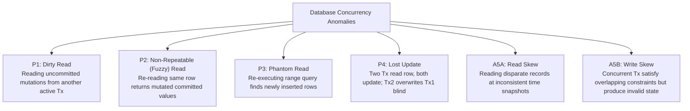
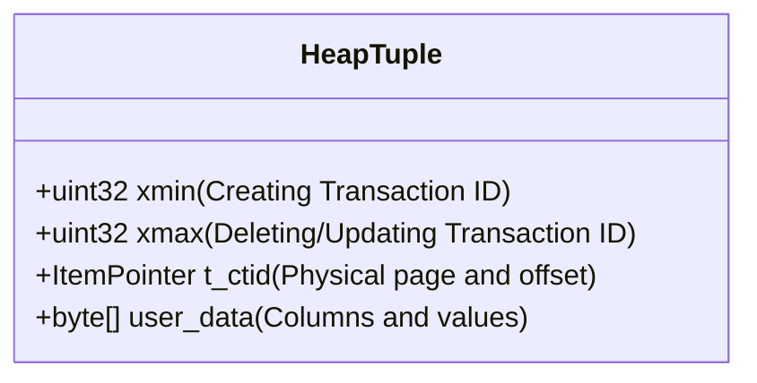
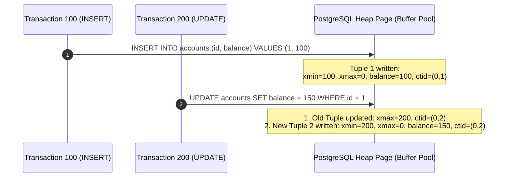
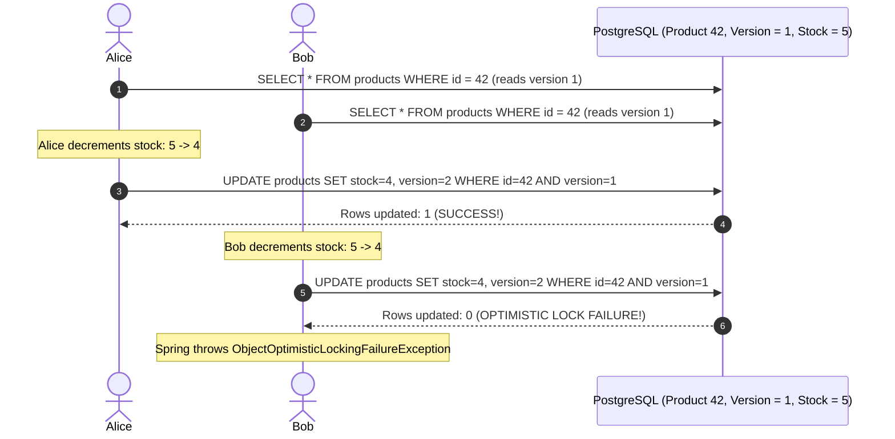
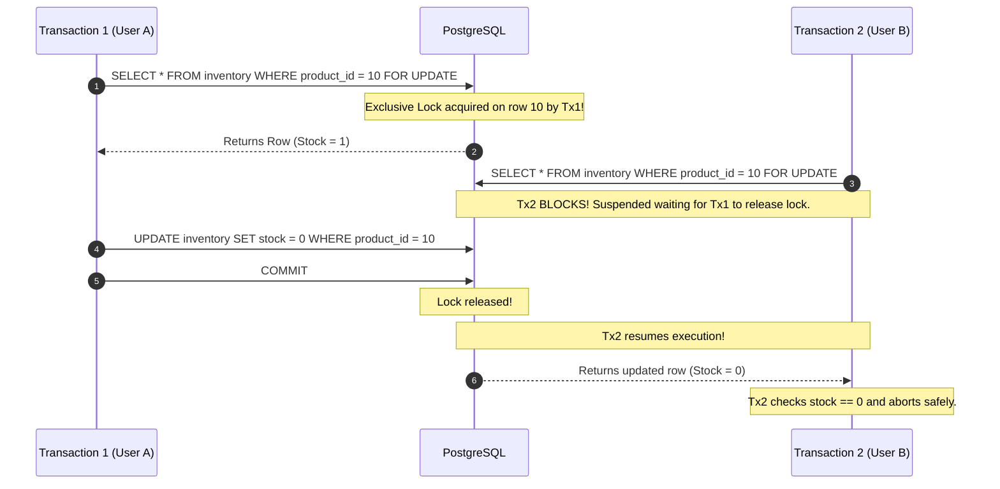
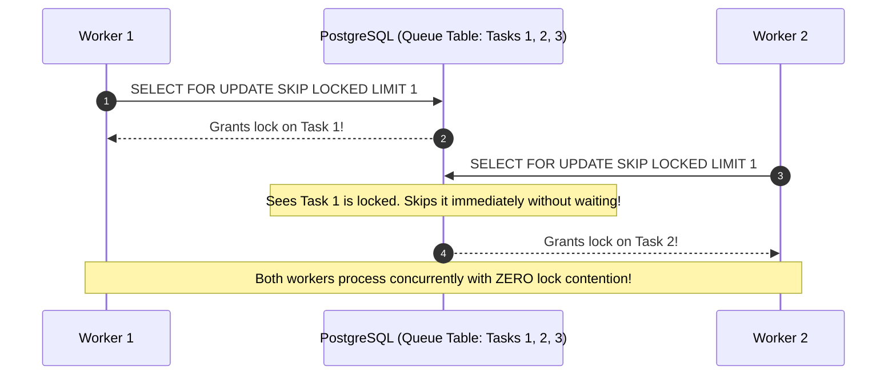
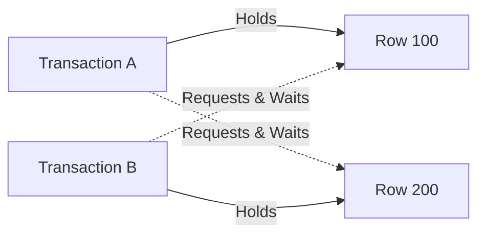

# Database Locking, Isolation Levels & MVCC Internals

In production backends, hundreds of concurrent application threads execute database transactions simultaneously. When multiple transactions read and mutate the exact same rows, uncoordinated execution leads to severe data corruption: balances going negative, inventory overselling, lost updates, and phantom reservations.

To solve this, relational databases provide **ACID Isolation** and **Locking Primitives**.

However, naive locking causes thread pool starvation, application deadlocks, and severe throughput bottlenecks. This guide provides an exhaustive, production-grade manual for concurrency control in modern PostgreSQL and Spring Boot backends.

---

## The Concurrency Anomaly Taxonomy

In 1992, the ANSI SQL standard defined transaction isolation in terms of three phenomena. In 1995, Microsoft and MIT researchers published the seminal paper *"A Critique of ANSI SQL Isolation Levels"*, proving that the ANSI definitions were incomplete and failed to account for modern Multi-Version Concurrency Control (MVCC) engines.

Here is the complete taxonomy of real-world database anomalies:



### Anomaly Descriptions

1. **Dirty Read (P1)**: Transaction 1 updates row $A$ to value 50. Transaction 2 reads row $A$ (sees 50). Transaction 1 rolls back! Transaction 2 acted on data that never officially existed.
2. **Non-Repeatable Read (P2)**: Transaction 1 reads row $A$ (balance = 100). Transaction 2 updates row $A$ (balance = 200) and commits. Transaction 1 re-reads row $A$ and sees 200.
3. **Phantom Read (P3)**: Transaction 1 queries `SELECT COUNT(*) WHERE department = 'IT'` (returns 5). Transaction 2 inserts a new IT employee and commits. Transaction 1 re-executes the count query and sees 6.
4. **Lost Update (P4)**: Transaction 1 reads stock = 10. Transaction 2 reads stock = 10. Transaction 1 writes `stock = 10 - 2 = 8`. Transaction 2 writes `stock = 10 - 3 = 7`. Result: Stock is 7 instead of 5! One customer's deduction vanished.
5. **Write Skew (A5B)**: The most subtle anomaly. Two transactions read distinct data items, verify a joint business invariant, make separate updates to different rows, and both commit—violating the system invariant! *(Detailed in the Doctor Shift example below)*.

---

## The 4 ANSI Isolation Levels vs Database Reality

| Isolation Level | Dirty Read (P1) | Non-Repeatable Read (P2) | Phantom Read (P3) | Lost Update (P4) | Write Skew (A5B) |
| :--- | :--- | :--- | :--- | :--- | :--- |
| **READ UNCOMMITTED** | Possible | Possible | Possible | Possible | Possible |
| **READ COMMITTED** | **Prevented** | Possible | Possible | Possible | Possible |
| **REPEATABLE READ** | **Prevented** | **Prevented** | Prevented (in Postgres) | **Prevented** | Possible |
| **SERIALIZABLE** | **Prevented** | **Prevented** | **Prevented** | **Prevented** | **Prevented** |

<Warning>
**PostgreSQL Isolation Reality**:
PostgreSQL does not support `READ UNCOMMITTED`. If you specify `SET TRANSACTION ISOLATION LEVEL READ UNCOMMITTED;`, PostgreSQL silently elevates it to `READ COMMITTED`. Furthermore, PostgreSQL's `REPEATABLE READ` implementation uses **Snapshot Isolation**, which automatically prevents Phantom Reads!
</Warning>

---

## PostgreSQL MVCC Internals: How Snapshots Work

PostgreSQL implements concurrency through **Multi-Version Concurrency Control (MVCC)**.
The fundamental design philosophy: **"Readers never block writers, and writers never block readers."**

### Tuple Header Anatomy: `xmin` and `xmax`
Every table row (tuple) on disk contains hidden system columns:



- **`xmin`**: The transaction ID ($XID$) that inserted this tuple.
- **`xmax`**: The transaction ID ($XID$) that deleted or replaced this tuple (0 if active and un-deleted).
- **`t_ctid`**: A pointer `(block, offset)` pointing to the physical disk location of this tuple. If updated, it points to the new version tuple.

### The Physical Update Lifecycle
In PostgreSQL, an `UPDATE` never overwrites bytes in-place. An `UPDATE` is physically an `INSERT` of a new row version plus setting `xmax` on the old version!



### Snapshot Visibility Checks
When a query executes, PostgreSQL takes a **Snapshot**:
`SnapshotData: (xmin:xmax:xip_list)`
- `xmin`: Lowest active transaction ID. Any transaction before this is committed and visible.
- `xmax`: Highest transaction ID assigned so far. Any transaction at or above this is uncommitted and invisible.
- `xip_list`: Array of active, in-progress transaction IDs between `xmin` and `xmax` (invisible to this snapshot).

#### Read Committed vs Repeatable Read
- **READ COMMITTED**: Generates a **fresh snapshot at the start of every single SQL query**. If Query A runs, then Tx2 commits, then Query B runs in the same transaction, Query B sees Tx2's updates.
- **REPEATABLE READ**: Generates a **single snapshot at the start of the first query** and reuses that identical snapshot for all subsequent queries until commit or rollback.

---

## Concurrency Control Strategies

### 1. Atomic SQL Updates (Best for Simple Deductions)
The simplest, fastest, and most scalable pattern for single-row decrement operations:

```sql
UPDATE inventory
SET available_quantity = available_quantity - :quantity
WHERE product_id = :productId
  AND available_quantity >= :quantity
RETURNING available_quantity;
```

```java
@Modifying
@Query("""
    UPDATE Inventory i 
    SET i.availableQuantity = i.availableQuantity - :qty 
    WHERE i.productId = :productId AND i.availableQuantity >= :qty
""")
int reserveStock(@Param("productId") Long productId, @Param("qty") int qty);

// Usage:
int updatedRows = inventoryRepository.reserveStock(101L, 2);
if (updatedRows == 0) {
    throw new InsufficientStockException("Item out of stock or insufficient quantity");
}
```
- **Pros**: Zero Java memory locking, zero optimistic retries, relies directly on PostgreSQL row-level write locks.
- **Cons**: Only works for simple mathematical checks that fit inside a single SQL statement.

---

### 2. Optimistic Locking with `@Version` (Best for Low Contention)
Assumes that concurrent collisions are rare. If a collision occurs, the database aborts the transaction, and the application either retries or prompts the user.



#### Entity Implementation
```java
@Entity
@Table(name = "products")
public class Product {
    @Id
    private Long id;

    private String name;
    private int stock;

    @Version // Managed automatically by Hibernate
    private Long version;

    // Rich domain method
    public void deductStock(int quantity) {
        if (this.stock < quantity) {
            throw new InsufficientStockException("Out of stock");
        }
        this.stock -= quantity;
    }
}
```

---

### 3. Pessimistic Locking: `FOR UPDATE` (Best for High Contention)
When contention is intense (flash sales, ticketing, flight seats), optimistic locking causes excessive retry storms. Pessimistic locking acquires an exclusive row lock at read time, forcing other transactions to queue.

```sql
SELECT * FROM inventory WHERE product_id = :productId FOR UPDATE;
```



#### Spring Data JPA Implementation
```java
public interface InventoryRepository extends JpaRepository<Inventory, Long> {

    @Lock(LockModeType.PESSIMISTIC_WRITE)
    @QueryHints({
        @QueryHint(name = "jakarta.persistence.lock.timeout", value = "3000") // 3-second timeout
    })
    @Query("SELECT i FROM Inventory i WHERE i.productId = :productId")
    Optional<Inventory> findByIdForUpdate(@Param("productId") Long productId);
}
```

---

### 4. High-Throughput Queue Processing: `SKIP LOCKED`
Traditional queues implemented in databases suffer from severe contention: workers constantly block each other trying to lock the next available task.
PostgreSQL provides `SKIP LOCKED` to let workers skip locked rows and grab the next available job without blocking:

```sql
-- Worker query: Atomic dequeue of next pending job
SELECT * 
FROM background_tasks
WHERE status = 'PENDING'
ORDER BY priority DESC, created_at ASC
LIMIT 1
FOR UPDATE SKIP LOCKED;
```



---

## Write Skew & Serializable Snapshot Isolation (SSI)

### The Doctor On-Call Dilemma
Write Skew occurs when two concurrent transactions read overlapping data, verify a global business rule, make separate updates to **different rows**, and both commit, destroying system integrity.

```text
Business Invariant: At least 1 doctor must be on-call at all times.
Initial State:
Doctor Alice: On-Call = TRUE
Doctor Bob:   On-Call = TRUE
```

```mermaid
sequenceDiagram
    autonumber
    actor Alice as Dr. Alice (Requests Leave)
    actor Bob as Dr. Bob (Requests Leave)
    participant DB as PostgreSQL (REPEATABLE READ Isolation)

    Alice->>DB: SELECT COUNT(*) FROM doctors WHERE on_call = TRUE; (Returns 2)
    Bob->>DB: SELECT COUNT(*) FROM doctors WHERE on_call = TRUE; (Returns 2)
    
    Note over Alice: Rule check: 2 >= 2. Safe to go off-call!
    Alice->>DB: UPDATE doctors SET on_call = FALSE WHERE name = 'Alice';
    
    Note over Bob: Rule check: 2 >= 2. Safe to go off-call!
    Bob->>DB: UPDATE doctors SET on_call = FALSE WHERE name = 'Bob';

    Alice->>DB: COMMIT; (Succeeds)
    Bob->>DB: COMMIT; (Succeeds)

    Note over DB: DISASTER! ZERO doctors are on call! Invariant destroyed.
```

#### Why Optimistic Locking Fails on Write Skew
- Alice updated Alice's row (`version: 1 -> 2`).
- Bob updated Bob's row (`version: 1 -> 2`).
- No individual row had concurrent writes, so `@Version` checks pass on both!

#### Solutions to Write Skew
1. **Explicit Lock Materialization**: Acquire a lock on a parent department record or dummy lock row (`SELECT * FROM departments WHERE id = 1 FOR UPDATE`).
2. **PostgreSQL Serializable Snapshot Isolation (SSI)**:
   ```sql
   SET TRANSACTION ISOLATION LEVEL SERIALIZABLE;
   ```
   PostgreSQL monitors read-write dependency cycles (si-locks). When Bob attempts to commit, PostgreSQL detects the dangerous structure and aborts Bob with:
   `ERROR: could not serialize access due to read/write dependencies among transactions`.

---

## Deadlocks: Detection and Elimination

### The Canonical Ordering Rule
A deadlock occurs when Transaction A holds Lock 1 and requests Lock 2, while Transaction B holds Lock 2 and requests Lock 1.



```java
// RESOLUTION: Always sort entity IDs before acquiring multiple locks!
public void transferMoney(Long fromAccountId, Long toAccountId, BigDecimal amount) {
    Long firstLockId = Math.min(fromAccountId, toAccountId);
    Long secondLockId = Math.max(fromAccountId, toAccountId);

    // Guaranteed canonical lock acquisition order eliminates circular wait!
    Account first = accountRepository.findByIdForUpdate(firstLockId);
    Account second = accountRepository.findByIdForUpdate(secondLockId);
    
    // Execute balance debit and credit...
}
```

---

## Production Concurrency Checklist & Anti-Patterns

<Warning>
### 1. The Sleep / Long HTTP Call Inside Lock Trap
Never execute remote HTTP calls (Stripe, Twilio, external microservices) while holding database row locks (`FOR UPDATE`):
```java
// ANTI-PATTERN: Disastrous lock duration
@Transactional
public void checkout(Long productId) {
    Inventory item = inventoryRepo.findByIdForUpdate(productId); // Row locked!
    stripeService.chargeCreditCard(); // Takes 3,000ms! All other buyers blocked!
}
```
</Warning>

<Warning>
### 2. Missing `lock_timeout` in Production
If an unindexed analytical query holds a table lock, an incoming `FOR UPDATE` query will queue indefinitely, saturating the HikariCP connection pool in seconds. Always configure a lock timeout:
```sql
SET lock_timeout = '3s';
```
</Warning>

---

## Active Recall & Interview Mastery

<AccordionGroup>
  <Accordion title="1. Explain the difference between Repeatable Read and Serializable isolation levels.">
    `Repeatable Read` (Snapshot Isolation in PostgreSQL) guarantees that all reads within a transaction see the same committed snapshot from the start of the transaction, eliminating dirty reads, non-repeatable reads, and phantom reads. However, it still permits **Write Skew**, where two transactions read overlapping data and update disparate records in ways that violate global constraints. `Serializable` eliminates all anomalies, including write skew, by using Serializable Snapshot Isolation (SSI) to detect read-write dependency cycles and abort conflicting transactions.
  </Accordion>

  <Accordion title="2. How does PostgreSQL MVCC handle updates without overwriting disk blocks?">
    In PostgreSQL, an `UPDATE` is physically executed as an `INSERT` of a new row version combined with a soft deletion of the old row. The old row's header has its `xmax` field set to the current transaction ID, and its `t_ctid` pointer updated to point to the new tuple's disk address. The new row has its `xmin` set to the transaction ID. Background `VACUUM` processes later reclaim space occupied by dead tuples once no active transaction snapshots can see them.
  </Accordion>

  <Accordion title="3. When should you use Optimistic Locking vs Pessimistic Locking?">
    Use **Optimistic Locking** (`@Version`) when write contention is low to moderate and read throughput must be maximized without database lock overhead. If collisions occur, the transaction aborts and retries. Use **Pessimistic Locking** (`FOR UPDATE`) when write contention is very high (flash sales, seat reservations), where optimistic locking would trigger thousands of wasteful rollbacks and retry loops.
  </Accordion>

  <Accordion title="4. How does SELECT ... FOR UPDATE SKIP LOCKED enable high-throughput task queues?">
    Standard `FOR UPDATE` forces concurrent workers to wait on locked rows, serializing task consumption. `SKIP LOCKED` instructs PostgreSQL to bypass any row currently locked by another active transaction and lock the next available matching row immediately. This allows hundreds of worker threads to dequeue jobs concurrently from a single database table with zero blocking or contention.
  </Accordion>

  <Accordion title="5. How does sorting entity IDs prevent database deadlocks?">
    Deadlocks require a circular wait condition (Transaction A holds Lock 1 and waits for Lock 2, while Transaction B holds Lock 2 and waits for Lock 1). By enforcing a **Canonical Ordering Rule** (e.g., always locking rows in ascending order of primary key: `Math.min(id1, id2)` first, then `Math.max(id1, id2)`), no two transactions can ever acquire locks in opposing sequences, mathematically eliminating circular wait conditions.
  </Accordion>
</AccordionGroup>
