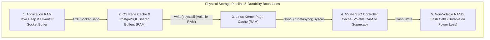
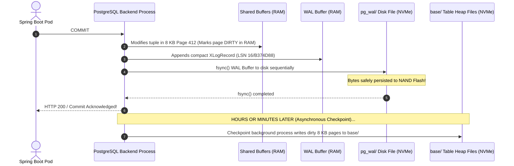
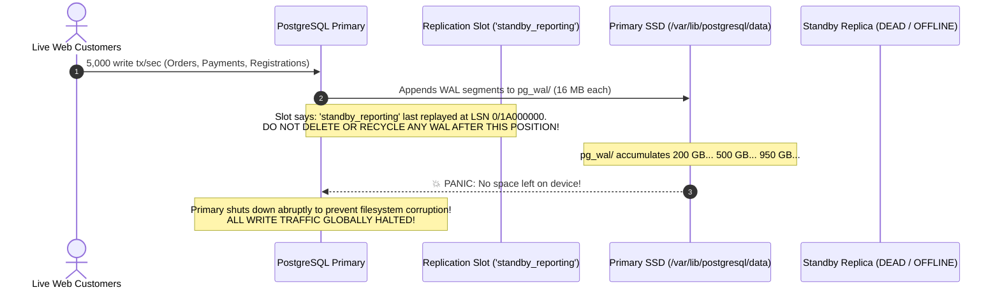
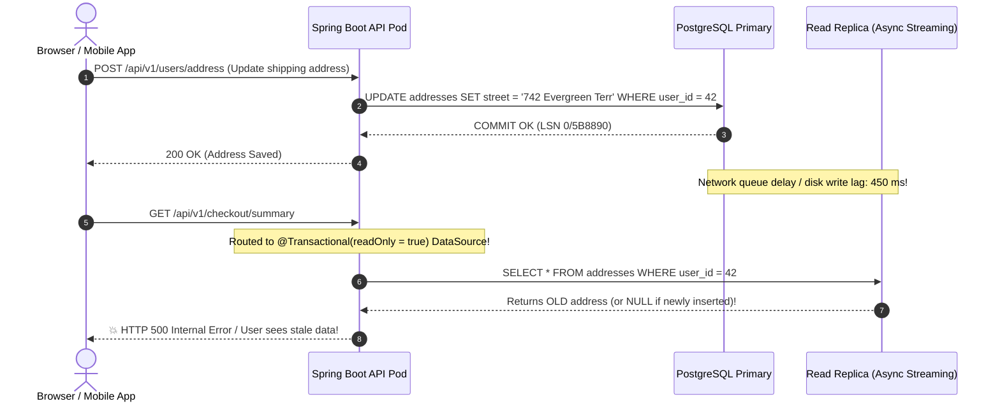
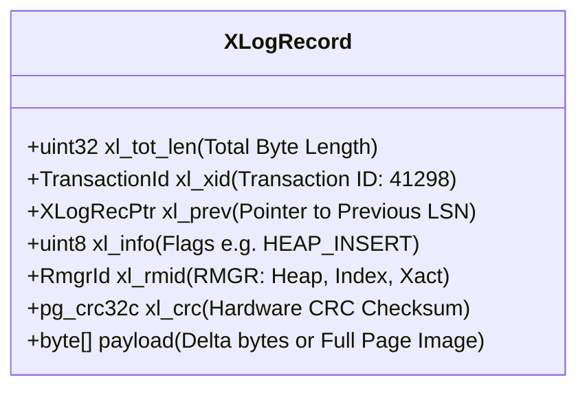
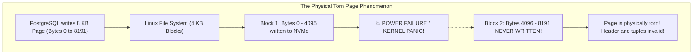
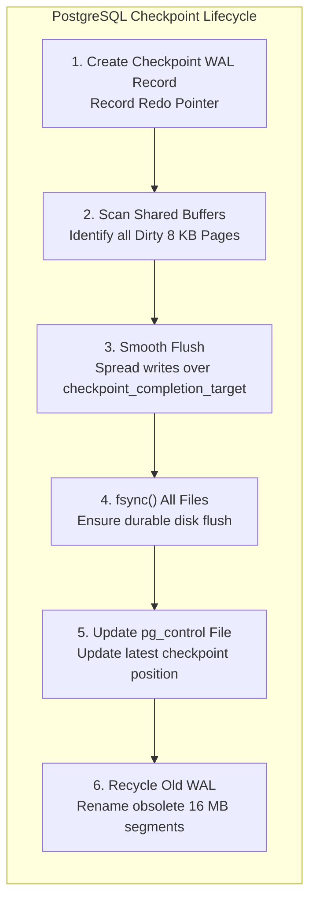
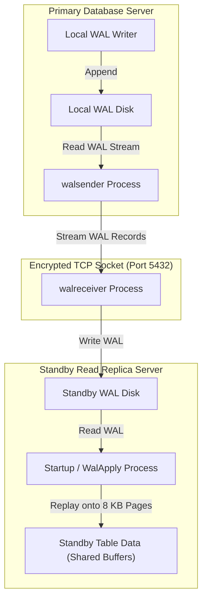

## Prerequisites: Before You Begin

Before studying PostgreSQL durability, streaming replication, and connection pooling, ensure you understand:
- Relational tables, B-Tree indexes, and ACID transaction semantics.
- Java multithreading and how Tomcat worker threads handle concurrent HTTP requests.
- Basic database connection pooling using HikariCP.
- Why modern cloud deployments separate read traffic from write traffic across primary and replica instances.

---

# Phase 1: Ground Floor (Physical First Principles)

To understand Write-Ahead Logging (WAL), replication, and connection proxies, you must first understand what happens physically when an operating system writes bytes to a non-volatile storage drive.



### 1. The Cost of Random Disk I/O vs. Sequential Append
A relational database table is stored as an unorganized collection of **$8\text{ KB}$ heap blocks (pages)**. When an application executes an `UPDATE` on a row:
- The target row may reside on block 4,120.
- Its secondary index entries reside on blocks 85, 312, and 9,401.
- Its visibility map resides on block 12.

If PostgreSQL had to synchronously write every modified $8\text{ KB}$ page directly to its permanent disk file on every `COMMIT`, the storage controller would be forced to execute **dozens of random disk seeks per transaction**. Even on enterprise PCIe 4.0 NVMe SSDs, random writes saturate the controller's flash translation layer (FTL), causing transaction commit latency to spike from $500\text{ µs}$ to over $50\text{ ms}$.

Furthermore, if the server suffers an abrupt power loss halfway through writing an $8\text{ KB}$ table page, the page is left partially written on disk—a catastrophic event known as a **torn page**, causing permanent unrecoverable data corruption.

### 2. The WAL Invariant: The Redo Log Contract
PostgreSQL solves both random I/O bottlenecks and torn-page corruption through the **Write-Ahead Log (WAL)**:

> **The Fundamental WAL Rule**:
> A database engine must append the binary description of a change to sequential, non-volatile WAL storage and flush it durably to disk **before** the modified table and index pages are allowed to be written to persistent table storage files.



When a transaction commits:
1. The modified $8\text{ KB}$ table pages in RAM are simply marked as **dirty**. They are **not** written to disk immediately.
2. A compact binary record describing the delta (e.g., 80 bytes describing the new column values) is appended to the WAL buffer.
3. PostgreSQL issues an `fdatasync()` or `fsync()` kernel system call strictly on the sequential WAL file.
4. As soon as the sequential WAL bytes are durable, PostgreSQL acknowledges success to the client!

If the physical server loses power 1 microsecond later:
- The modified table pages in RAM disappear.
- Upon reboot, PostgreSQL reads the WAL sequentially from the last known checkpoint and **replays every committed change (Redo)**, perfectly reconstructing the data pages in memory before writing them back to disk!

---

# Phase 2: The Naive Architectures (Production Crashes)

When backend teams scale databases from a single local instance to multi-pod Kubernetes clusters and cloud-hosted replicas, three architectural failures routinely cause total production blackouts.

---

### Crash 1: The Inactive Replication Slot Disk-Full Disaster

A development team configures an asynchronous read replica for reporting and analytics. To ensure the replica never misses transactions if the network drops, they create a **Physical Replication Slot**.

On Friday night, an engineer restarts the replica host to upgrade its kernel. The replica fails to reboot due to a network configuration error and remains offline all weekend.



#### Why Production Crashed:
A replication slot is a **durability promise**: the primary guarantees it will never delete or recycle WAL segment files until the connected replica confirms it has flushed them.

Because the replica was offline and had no retention boundary, the primary retained every single WAL file produced over 48 hours. The `pg_wal` filesystem reached $100\%$ capacity. When PostgreSQL cannot flush WAL because the physical disk is full, the database engine **panics and terminates immediately** to prevent unrecoverable WAL stream corruption.

#### Production Defense:
Never deploy a replication slot without setting an explicit retention ceiling:

```sql
-- Protects primary from disk exhaustion by invalidating lagging slots:
ALTER SYSTEM SET max_slot_wal_keep_size = '32GB';
SELECT pg_reload_conf();
```

If a disconnected replica lags by more than $32\text{ GB}$, PostgreSQL invalidates the slot and resumes normal WAL recycling, sacrificing the replica to protect the primary from catastrophic disk exhaustion.

---

### Crash 2: The Stale Read-After-Write Checkout Failure

A team splits database traffic across a primary node and two read replicas using Spring Boot. When a user updates their shipping address and clicks "Review Order," the application fails with `AddressNotFoundException`:



#### Why Production Failed:
Asynchronous streaming replication has a non-zero propagation delay (**Replication Lag**). When a customer mutates data on the primary and immediately redirects to a read-only endpoint, reading from an asynchronous replica guarantees a race condition where the client observes stale data.

#### Production Defense:
1. **Read-Your-Writes Consistency**: Any read request that occurs within a specific time window (e.g., 5 seconds) after a write by the same user session **must be pinned to the primary database**.
2. **Dynamic Context Routing**: Use ThreadLocal context variables to selectively route reads to the primary when strict consistency is required.

---

### Crash 3: PgBouncer Transaction Pooling Session Leaks

A backend team adopts **PgBouncer** in `pool_mode = transaction` to reduce database connection overhead. Within hours, customer security complaints flood in: User A occasionally sees User B's search preferences and tenant data!

```mermaid
sequenceDiagram
    autonumber
    participant AppA as Spring Pod A (Tenant Alpha)
    participant AppB as Spring Pod B (Tenant Beta)
    participant PB as PgBouncer (Transaction Pool)
    participant PG as PostgreSQL Server Process 9821

    AppA->>PB: BEGIN Tx 1
    PB->>PG: Assigns Server Process 9821
    AppA->>PG: SET LOCAL search_path TO tenant_alpha; -- WRONGLY EXECUTED AS: SET search_path TO tenant_alpha;
    AppA->>PG: SELECT * FROM documents;
    AppA->>PB: COMMIT Tx 1
    Note over PB: Transaction finished! Server connection 9821 returned to POOL!
    Note over PG: Server process 9821 STILL HAS search_path = tenant_alpha!
    
    AppB->>PB: BEGIN Tx 2
    PB->>PG: Assigns Server Process 9821 to Pod B!
    AppB->>PG: SELECT * FROM documents; -- NO search_path set!
    PG-->>AppB: 💥 CRITICAL SECURITY BREACH: Returns Tenant Alpha's documents!
```

#### Why Production Bleed Occurred:
In `transaction` pooling, PgBouncer assigns a PostgreSQL server connection to a client only for the duration of a single transaction. When the transaction commits, the physical connection is immediately handed to another client thread.

Any session-level state modified via raw `SET`, session advisory locks, or temporary tables **remains attached to the physical PostgreSQL connection** unless explicitly wiped.

---

# Phase 3: Under the Hood (Mechanics & Bytecode)

To build bulletproof, staff-level database architectures, you must understand the internal structures of WAL records, checkpoint flush math, streaming replication pipelines, and connection pooling proxies.

---

## 1. WAL Anatomy & The 16 MB Segment File Structure

PostgreSQL stores WAL in `$PGDATA/pg_wal/` as a series of contiguous **$16\text{ MB}$ binary files**.

### Segment File Naming Convention
Every WAL segment file name is exactly **24 hexadecimal characters** (96 bits) divided into three 8-character parts:

```console
00000001 00000016 000000B3
^^^^^^^^ ^^^^^^^^ ^^^^^^^^
Timeline LSN High Segment
  (8 hex)  (8 hex)  (8 hex)
```

1. **Timeline ID (8 hex digits)**: Tracks recovery history branches (e.g., `00000001`). When a standby replica is promoted to primary after a failover, it increments its timeline ID (e.g., to `00000002`) to prevent overwriting WAL from the old primary.
2. **Logical Log Number / LSN High**: The high 32 bits of the Log Sequence Number.
3. **Segment Number**: The sequential 16 MB chunk index within that logical log.

### Inside an 8 KB WAL Page: The `XLogRecord` Header
WAL files are internally divided into **$8\text{ KB}$ WAL pages**. Every transaction mutation creates one or more binary records with a physical C-struct header:

```c
typedef struct XLogRecord {
    uint32          xl_tot_len; /* Total length of entire record */
    TransactionId   xl_xid;     /* Transaction ID responsible for this change */
    XLogRecPtr      xl_prev;    /* LSN pointer to previous WAL record (backlink) */
    uint8           xl_info;    /* Resource-manager-specific flag bits */
    RmgrId          xl_rmid;    /* Resource Manager ID (HEAP, BTREE, TRANSACTION) */
    pg_crc32c       xl_crc;     /* Hardware-accelerated CRC-32C checksum */
} XLogRecord;
```



### Decoding Real WAL Records with `pg_waldump`
You can inspect raw binary WAL records in terminal using the `pg_waldump` utility:

```console
$ pg_waldump -p /var/lib/postgresql/data/pg_wal -s 16/B374000 -e 16/B375000

rmgr: Heap        len(rec):       79, tg: 0, desc: INSERT ... rel 1663/16384/24578 blk 42 off 3
rmgr: Btree       len(rec):       64, tg: 0, desc: INSERT_LEAF ... rel 1663/16384/24582 blk 8 off 12
rmgr: Transaction len(rec):       34, tg: 0, desc: COMMIT 2026-09-12 10:15:32.412 UTC
```

Line by line breakdown:
- `rmgr: Heap`: The Heap Resource Manager processed an `INSERT` of 79 bytes into table relation `24578` at block 42, line pointer offset 3.
- `rmgr: Btree`: The B-Tree Resource Manager updated the table's index at block 8, slot offset 12.
- `rmgr: Transaction`: The transaction officially committed and flushed its commit timestamp.

### The Log Sequence Number (LSN) Math
An **LSN** is an unsigned 64-bit integer (`uint64`) representing the exact byte offset within the database's continuous WAL history stream, printed as two hexadecimal numbers separated by a slash:

$$\text{LSN} = \mathtt{16/B374D88}$$

You can perform byte arithmetic directly in SQL to calculate the exact amount of WAL generated between two points in time:

```sql
SELECT pg_size_pretty(pg_wal_lsn_diff('16/B400000', '16/B374D88')) AS bytes_generated;
-- Output: 884 kB
```

---

## 2. The Torn-Page Hazard & Full Page Writes (`full_page_writes`)

Why does PostgreSQL generate massive bursts of WAL immediately following every checkpoint?



1. **The Block Size Mismatch**: PostgreSQL operates in $8\text{ KB}$ memory pages. However, underlying Linux filesystems (ext4/xfs) and SSD flash pages typically write in **$4\text{ KB}$ blocks**.
2. **The Power Failure**: If power is severed while writing an $8\text{ KB}$ page, the drive may persist the first $4\text{ KB}$ block while leaving the second $4\text{ KB}$ block stale. The page is now torn and corrupt. Normal WAL delta replay cannot fix a torn page because delta replay assumes the base page is mathematically intact!
3. **The Solution (`full_page_writes = on`)**:
   - The first time an $8\text{ KB}$ table or index page is modified in RAM **after a checkpoint**, PostgreSQL writes the **entire 8,192-byte page image** into the WAL stream!
   - Subsequent updates to that same page write only tiny delta records.
   - During crash recovery, if a page is torn on disk, PostgreSQL restores the complete $8\text{ KB}$ page image from WAL first, and then replays subsequent deltas safely on top.

<Tip>
**Tuning Hint**: In write-heavy OLTP databases, `full_page_writes` can account for over 60% of all WAL bandwidth! In PostgreSQL 15+, always enable WAL compression to reduce disk I/O and network replication bandwidth:
```sql
ALTER SYSTEM SET wal_compression = 'lz4'; -- Requires lz4 support compiled in PG15+
SELECT pg_reload_conf();
```
</Tip>

---

## 3. Checkpoints & I/O Smoothing

A **Checkpoint** is a point in the WAL sequence at which PostgreSQL guarantees that all table and index pages dirtied prior to that point have been flushed to persistent disk files.



### Why Naive Checkpoints Destroy Application Latency
If PostgreSQL wrote all 50,000 dirty buffers to disk as fast as possible, the disk controller queue depth would saturate at 100%, causing HTTP request latency to spike violently every 5 minutes (the "checkpoint spike").

### Checkpoint I/O Smoothing Math
PostgreSQL smooths writes across time using `checkpoint_completion_target`:

```ini
# postgresql.conf (Production Checkpoint Tuning)
checkpoint_timeout = 15min              # Maximum time between automatic checkpoints
max_wal_size = 32GB                     # Maximum WAL volume before triggering emergency checkpoint
min_wal_size = 4GB                      # Minimum WAL pool size to retain
checkpoint_completion_target = 0.9      # Spread dirty page writes over 90% of checkpoint_timeout
```

$$\text{Write Window} = \text{checkpoint\_timeout} \times \text{checkpoint\_completion\_target} = 15\text{ min} \times 0.9 = 13.5\text{ minutes}$$

Instead of flushing all dirty pages in 10 seconds, PostgreSQL spreads the writes across $13.5\text{ minutes}$, maintaining a smooth, steady background I/O profile that never starves incoming web traffic.

---

## 4. Physical Streaming Replication & `synchronous_commit`

PostgreSQL implements high-availability streaming replication via dedicated background worker processes:



### The 5 Levels of `synchronous_commit`
Durability and throughput exist on an engineering spectrum governed by `synchronous_commit`:

```mermaid
sequenceDiagram
    autonumber
    actor App as Client (Spring Boot)
    participant P_RAM as Primary RAM
    participant P_Disk as Primary Disk (WAL)
    participant R_Net as Standby Network (walreceiver)
    participant R_Disk as Standby Disk (WAL)
    participant R_RAM as Standby Buffer (Replay)

    App->>P_RAM: COMMIT
    P_RAM->>P_Disk: Flush WAL
    
    alt synchronous_commit = off
        P_RAM-->>App: Ack COMMIT immediately (RAM only; risk losing up to 3 x wal_writer_delay)
    else synchronous_commit = local (Default Async Replication)
        P_Disk-->>App: Ack COMMIT after Primary local fsync completes
    else synchronous_commit = remote_write
        P_Disk->>R_Net: Transmit WAL over network
        R_Net-->>App: Ack COMMIT after Standby OS kernel receives bytes
    else synchronous_commit = on (Synchronous Replication)
        P_Disk->>R_Net: Transmit WAL
        R_Net->>R_Disk: fsync() Standby WAL
        R_Disk-->>App: Ack COMMIT after Standby disk flushes bytes
    else synchronous_commit = remote_apply
        P_Disk->>R_Net: Transmit WAL
        R_Net->>R_Disk: fsync() Standby WAL
        R_Disk->>R_RAM: Replay change into Standby Shared Buffers
        R_RAM-->>App: Ack COMMIT after Standby can immediately read the change!
    end
```

| Level | Client Acknowledged When | Durability on Primary Crash | Write Latency |
| :--- | :--- | :--- | :--- |
| **`off`** | Bytes written to Primary RAM buffer | Potential loss of last $\approx 600\text{ ms}$ of commits | Ultra-low ($< 0.5\text{ ms}$) |
| **`local`** | Primary local `fsync()` completes (Async Standby) | Zero loss on primary disk; Standby may lag | Low ($1\text{ to }3\text{ ms}$) |
| **`remote_write`**| Standby OS kernel receives bytes | Data survives Primary hardware failure | Medium ($5\text{ to }15\text{ ms}$) |
| **`on`** | Standby `fsync()` completes to physical disk | Guaranteed durable on both nodes | Higher ($10\text{ to }30\text{ ms}$) |
| **`remote_apply`**| Standby finishes replaying change into RAM | Guaranteed read-your-writes on Standby! | Highest ($20\text{ to }60\text{ ms}$) |

---

## 5. Complete Spring Boot Dynamic Read/Write Routing

In modern production architectures, Spring Boot applications must route write operations (`INSERT`, `UPDATE`, `DELETE`) to the primary database while routing read operations (`SELECT`) to read replicas.

Standard Spring `@Transactional(readOnly = true)` **does not automatically switch physical datasources** without a custom dynamic routing implementation!

### 1. The DataSource Key Enumeration
```java
package com.backendmastery.config.routing;

public enum DataSourceType {
    PRIMARY,
    REPLICA
}
```

### 2. The ThreadLocal Context Holder
```java
package com.backendmastery.config.routing;

import org.slf4j.Logger;
import org.slf4j.LoggerFactory;

public final class DataSourceContextHolder {

    private static final Logger log = LoggerFactory.getLogger(DataSourceContextHolder.class);

    // Default to PRIMARY for absolute safety
    private static final ThreadLocal<DataSourceType> CONTEXT =
            ThreadLocal.withInitial(() -> DataSourceType.PRIMARY);

    private DataSourceContextHolder() {}

    public static void set(DataSourceType type) {
        if (type == null) {
            CONTEXT.set(DataSourceType.PRIMARY);
        } else {
            CONTEXT.set(type);
        }
    }

    public static DataSourceType get() {
        return CONTEXT.get();
    }

    public static void clear() {
        CONTEXT.remove();
    }
}
```

### 3. The Custom `AbstractRoutingDataSource`
```java
package com.backendmastery.config.routing;

import org.slf4j.Logger;
import org.slf4j.LoggerFactory;
import org.springframework.jdbc.datasource.lookup.AbstractRoutingDataSource;

public class DynamicRoutingDataSource extends AbstractRoutingDataSource {

    private static final Logger log = LoggerFactory.getLogger(DynamicRoutingDataSource.class);

    @Override
    protected Object determineCurrentLookupKey() {
        DataSourceType currentType = DataSourceContextHolder.get();
        log.trace("Routing database connection to: {}", currentType);
        return currentType;
    }
}
```

### 4. The Routing AOP Aspect
```java
package com.backendmastery.config.routing;

import org.aspectj.lang.ProceedingJoinPoint;
import org.aspectj.lang.annotation.Around;
import org.aspectj.lang.annotation.Aspect;
import org.springframework.core.Ordered;
import org.springframework.core.annotation.Order;
import org.springframework.stereotype.Component;
import org.springframework.transaction.annotation.Transactional;

@Aspect
@Component
// CRITICAL: Must execute BEFORE @Transactional begins its transaction boundary!
@Order(Ordered.HIGHEST_PRECEDENCE)
public class ReadOnlyRouteAspect {

    @Around("@annotation(transactional)")
    public Object routeTransaction(ProceedingJoinPoint joinPoint, Transactional transactional) throws Throwable {
        try {
            if (transactional.readOnly()) {
                DataSourceContextHolder.set(DataSourceType.REPLICA);
            } else {
                DataSourceContextHolder.set(DataSourceType.PRIMARY);
            }
            return joinPoint.proceed();
        } finally {
            // CRITICAL: Eliminate ThreadLocal memory leaks across reused Tomcat worker threads!
            DataSourceContextHolder.clear();
        }
    }
}
```

### 5. Multi-DataSource Configuration & Lazy Connection Binding
```java
package com.backendmastery.config.routing;

import com.zaxxer.hikari.HikariDataSource;
import org.springframework.beans.factory.annotation.Qualifier;
import org.springframework.boot.context.properties.ConfigurationProperties;
import org.springframework.boot.jdbc.DataSourceBuilder;
import org.springframework.context.annotation.Bean;
import org.springframework.context.annotation.Configuration;
import org.springframework.context.annotation.Primary;
import org.springframework.jdbc.datasource.LazyConnectionDataSourceProxy;

import javax.sql.DataSource;
import java.util.HashMap;
import java.util.Map;

@Configuration
public class RoutingDataSourceConfig {

    @Bean(name = "primaryDataSource")
    @ConfigurationProperties(prefix = "spring.datasource.primary")
    public DataSource primaryDataSource() {
        return DataSourceBuilder.create().type(HikariDataSource.class).build();
    }

    @Bean(name = "replicaDataSource")
    @ConfigurationProperties(prefix = "spring.datasource.replica")
    public DataSource replicaDataSource() {
        return DataSourceBuilder.create().type(HikariDataSource.class).build();
    }

    @Bean(name = "routingDataSource")
    public DynamicRoutingDataSource routingDataSource(
            @Qualifier("primaryDataSource") DataSource primaryDataSource,
            @Qualifier("replicaDataSource") DataSource replicaDataSource) {

        Map<Object, Object> targetDataSources = new HashMap<>();
        targetDataSources.put(DataSourceType.PRIMARY, primaryDataSource);
        targetDataSources.put(DataSourceType.REPLICA, replicaDataSource);

        DynamicRoutingDataSource routingDataSource = new DynamicRoutingDataSource();
        routingDataSource.setTargetDataSources(targetDataSources);
        routingDataSource.setDefaultTargetDataSource(primaryDataSource);
        return routingDataSource;
    }

    /**
     * CRITICAL: Spring's TransactionManager acquires a database connection BEFORE
     * entering the repository method. Without LazyConnectionDataSourceProxy,
     * the connection is acquired from the default datasource before the AOP aspect
     * has evaluated the @Transactional(readOnly = true) annotation!
     */
    @Bean
    @Primary
    public DataSource dataSource(@Qualifier("routingDataSource") DynamicRoutingDataSource routingDataSource) {
        return new LazyConnectionDataSourceProxy(routingDataSource);
    }
}
```

---

## 6. PgBouncer Architecture & Connection Pool Mastery

Why do hyperscale architectures insert PgBouncer between Spring Boot pods and PostgreSQL?

```mermaid
flowchart TD
    subgraph WithoutPgBouncer ["Without PgBouncer (Process-Per-Connection Thrashing)"]
        Pods1["50 Spring Pods (Hikari Max: 20 each)"] -->|"1,000 Direct TCP Connections"| PG1["PostgreSQL Engine"]
        PG1 -->|"Forks 1,000 OS Processes"| RAM1["RAM Consumed: 1,000 x 10 MB = 10 GB RAM!<br/>CPU Trashing: 1,000 processes fighting for 16 CPU cores!"]
    end

    subgraph WithPgBouncer ["With PgBouncer (Lightweight epoll Proxy)"]
        Pods2["50 Spring Pods (Hikari Max: 20 each)"] -->|"1,000 Client Sockets"| PB["PgBouncer (Single-Threaded epoll)"]
        PB -->|"Multiplexes down to 32 Persistent Server Sockets"| PG2["PostgreSQL Engine (16 Cores)"]
        PG2 -->|"Forks exactly 32 OS Processes"| RAM2["RAM Consumed: 32 x 10 MB = 320 MB RAM!<br/>CPU Efficiency: 32 processes match hardware cores perfectly!"]
    end
```



### Process Model: PostgreSQL vs. PgBouncer
1. **PostgreSQL Process Architecture**: PostgreSQL does not use lightweight OS threads. For **every incoming connection**, it calls `fork()` to spawn an independent operating system process. Each backend process allocates **$5\text{ to }10\text{ MB}$ of memory** for its private stack and catalog caches. Maintaining 1,500 idle connections consumes **$15\text{ GB}$ of RAM** while thrashing CPU L1/L2 caches with kernel context switches.
2. **PgBouncer Architecture**: PgBouncer is a lightweight, single-process asynchronous event loop built on Linux **`epoll`**. It can hold **10,000 open client connections** while consuming less than **$30\text{ MB}$ of total system RAM**, multiplexing thousands of client connections down to a handful of persistent PostgreSQL backend processes!

### The 3 Pool Modes
| Pool Mode | Server Connection Released When | Ideal For | Hazardous For |
| :--- | :--- | :--- | :--- |
| **`session`** | Client completely closes socket | Legacy apps requiring persistent state | High connection fan-in |
| **`transaction`** (Default) | Transaction commits or rolls back | High-throughput modern REST APIs | Session `SET`, advisory locks, temp tables |
| **`statement`** | Single SQL statement finishes | Simple atomic queries | Multi-statement transactions (Banned!) |

### The Transaction Pooling Prepared Statement Dilemma
In standard PostgreSQL, Prepared Statements are scoped strictly to the physical session. In `pool_mode = transaction`, if Thread A issues `PREPARE stmt` on connection 1, and the next query executes on connection 2, PostgreSQL fails with:
`ERROR: prepared statement "S_1" does not exist`.

#### Modern Solutions:
1. **PgBouncer 1.21+ Protocol-Level Prepared Statements**: Modern PgBouncer automatically intercepts binary protocol-level prepared statement messages (`Parse`, `Bind`, `Execute`) and tracks them across server connections transparently!
2. **Spring Boot / JDBC Configuration**: If running older PgBouncer versions, configure the PostgreSQL JDBC driver to disable client-side prepared statement caching:
   ```properties
   # application.properties
   spring.datasource.url=jdbc:postgresql://pgbouncer-host:6432/mydb?prepareThreshold=0&preparedStatementCacheQueries=0
   ```

### Production `pgbouncer.ini` Configuration File
```ini
[databases]
mydb = host=127.0.0.1 port=5432 dbname=mydb auth_user=pgbouncer_auth

[pgbouncer]
logfile = /var/log/postgresql/pgbouncer.log
pidfile = /var/run/postgresql/pgbouncer.pid

# Network settings
listen_addr = 0.0.0.0
listen_port = 6432
auth_type = scram-sha-256
auth_file = /etc/pgbouncer/userlist.txt

# Connection Pool Limits
pool_mode = transaction
max_client_conn = 5000       ; Max concurrent client connections from all pods
default_pool_size = 30       ; Persistent server connections maintained per database/user pair
min_pool_size = 10           ; Keep at least 10 connections warm to avoid reconnect latency
reserve_pool_size = 5        ; Emergency connections allowed when pool is exhausted
reserve_user_pool = 1

# Timeouts & Safety
server_idle_timeout = 600    ; Close unused server connections after 10 minutes
client_idle_timeout = 120    ; Drop dead client connections after 2 minutes
query_timeout = 30           ; Kill queries running longer than 30 seconds
server_reset_query = DISCARD ALL ; Clean up session state before returning connection to pool!
```

### PgBouncer Admin Console Runbook
PgBouncer provides an interactive administrative virtual database accessible via `psql`:

```bash
psql -p 6432 -U pgbouncer -d pgbouncer
```

```sql
-- 1. Inspect Active Pools and Waiting Clients
SHOW POOLS;

-- 2. Inspect Live Client Sockets
SHOW CLIENTS;

-- 3. Gracefully Pause Traffic for Upgrades (Holds clients in queue without dropping)
PAUSE mydb;

-- 4. Resume Traffic after Maintenance
RESUME mydb;

-- 5. Reload Configuration Without Restarting Process
RELOAD;
```

---

# Phase 4: Senior Interview Ace

Senior interviewers ask WAL, replication, and connection pooling questions to determine if you understand physical system boundaries rather than just library syntax.

### Q1: "Why does PostgreSQL write to WAL before writing to table files, and how can a committed transaction survive a crash if its table page wasn't saved to disk?"

```diff
- JUNIOR ANSWER:
  "WAL is the transaction log. It logs what you do so if the database crashes it can recover."
```

```diff
+ SENIOR / STAFF ANSWER:
  "Writing modified 8KB table pages directly to disk on every commit would trigger devastating random disk I/O 
   and risk torn pages if power fails mid-write. 
   
   PostgreSQL solves this by enforcing the Write-Ahead Logging contract: When a transaction commits, the engine 
   only writes a compact binary delta to the WAL buffer and executes an fsync() kernel call sequentially to disk. 
   Modified heap pages remain dirty in shared buffer RAM.
   
   If the physical host crashes immediately after, the dirty heap pages in RAM are lost, but the WAL records are 
   durably preserved on non-volatile flash. During startup crash recovery, PostgreSQL locates the last valid 
   checkpoint and executes the REDO phase, sequentially replaying all committed WAL records to reconstruct the 
   exact 8KB heap pages in memory before checkpointing them back to disk."
```

---

### Q2: "What is the difference between asynchronous streaming replication and synchronous replication, and what are the trade-offs of `synchronous_commit = remote_apply`?"

```diff
- JUNIOR ANSWER:
  "Async replication is faster, and sync replication is safer because it writes to two databases."
```

```diff
+ SENIOR / STAFF ANSWER:
  "In asynchronous replication (synchronous_commit = local), the primary acknowledges commit as soon as its 
   local disk fsync succeeds. The WAL is streamed concurrently via walsender to replicas. If the primary host 
   suffers a hardware destruction before the WAL is sent, committed transactions can be lost (RPO > 0), and 
   immediate read-after-write queries on replicas can return stale data.
   
   In synchronous replication with synchronous_commit = remote_apply, the primary blocks the client commit 
   acknowledgment until the standby replica's walreceiver receives the WAL, flushes it to durable storage, 
   AND the startup process replays the mutation into the standby's shared buffers. 
   
   This guarantees zero data loss (RPO = 0) and eliminates read-after-write consistency bugs across the replica, 
   but it forces write transactions to pay double network round-trip latencies plus standby CPU replay overhead, 
   severely capping write throughput and stalling writes entirely if the standby crashes without a fallback quorum."
```

---

### Q3: "Why can an inactive PostgreSQL replication slot cause the primary database to crash?"

```diff
- JUNIOR ANSWER:
  "Because the replica stops syncing and the database gets an error."
```

```diff
+ SENIOR / STAFF ANSWER:
  "A physical replication slot represents an explicit contractual promise: The primary database engine guarantees 
   it will retain every WAL segment file needed by that slot, never recycling or deleting segments during checkpoints 
   until the standby acknowledges receipt.
   
   If a replica dies, disconnects, or experiences extreme network lag while its slot remains active, the primary 
   continues generating WAL segments (16MB each) but cannot delete any of them. Eventually, the pg_wal/ directory 
   fills the entire physical disk partition (100% capacity). 
   
   Because PostgreSQL cannot execute WAL flushes without disk space, it triggers an immediate engine PANIC shutdown 
   to prevent filesystem corruption, taking down the entire database globally. 
   
   We prevent this in production by configuring 'max_slot_wal_keep_size', which automatically invalidates any slot 
   that retains more than a defined threshold (e.g., 32GB) of WAL, preserving primary availability."
```

---

### Q4: "Why does HikariCP alone fail to solve connection scaling in Kubernetes, and what breaks when moving to PgBouncer in transaction mode?"

```diff
- JUNIOR ANSWER:
  "HikariCP is for Java. PgBouncer is for Postgres. Transaction mode makes everything faster."
```

```diff
+ SENIOR / STAFF ANSWER:
  "HikariCP pools connections at the individual JVM pod level. In a dynamic Kubernetes cluster running 50 pods 
   with maximum-pool-size = 20, the cluster maintains 1,000 persistent TCP connections to PostgreSQL. Because 
   PostgreSQL uses a process-per-connection architecture, 1,000 backends consume 10GB+ of RAM and cause severe 
   OS context-switching thrashing on an 8-to-16 core server.
   
   PgBouncer acts as an intermediate epoll multiplexer, holding thousands of client sockets open while maintaining 
   only 20 to 50 active server connections to PostgreSQL. 
   
   However, adopting transaction pooling breaks any application feature that depends on session-level state: 
   session advisory locks, temporary tables, raw 'SET search_path' commands, and classic JDBC named prepared 
   statements without protocol-level translation. Any session state mutated during a transaction can either bleed 
   into another tenant's subsequent transaction or fail with missing statement errors."
```

---

## Production Debug Checklist

Run these queries in production to diagnose replication lag, WAL accumulation, and connection bottlenecks:

```sql
-- 1. Check Live Replication Lag (Bytes & Duration) Across Standbys
SELECT 
    client_addr AS replica_ip,
    application_name,
    state,
    sync_state,
    pg_size_pretty(pg_wal_lsn_diff(pg_current_wal_lsn(), sent_lsn)) AS sent_lag,
    pg_size_pretty(pg_wal_lsn_diff(sent_lsn, write_lsn)) AS write_lag,
    pg_size_pretty(pg_wal_lsn_diff(write_lsn, flush_lsn)) AS flush_lag,
    pg_size_pretty(pg_wal_lsn_diff(flush_lsn, replay_lsn)) AS replay_lag,
    ROUND(EXTRACT(EPOCH FROM (now() - reply_time))::numeric, 2) AS seconds_since_last_msg
FROM pg_stat_replication;
```

```sql
-- 2. Inspect Inactive or Dangerously Large Replication Slots
SELECT 
    slot_name,
    slot_type,
    active,
    wal_status,
    pg_size_pretty(pg_wal_lsn_diff(pg_current_wal_lsn(), restart_lsn)) AS retained_wal_bytes
FROM pg_replication_slots
ORDER BY pg_wal_lsn_diff(pg_current_wal_lsn(), restart_lsn) DESC;
```

```sql
-- 3. Checkpoint Performance & Dirty Page Pressure
SELECT 
    checkpoints_timed AS scheduled_checkpoints,
    checkpoints_req AS emergency_wal_triggered_checkpoints,
    checkpoint_write_time AS total_write_time_ms,
    checkpoint_sync_time AS total_fsync_time_ms,
    buffers_checkpoint AS buffers_flushed_by_checkpoints,
    buffers_clean AS buffers_flushed_by_bgwriter,
    buffers_backend AS buffers_flushed_by_client_backends -- DANGER: High value means backends doing dirty work!
FROM pg_stat_bgwriter;
```

---

## Common Mistakes & Failure Modes

| Mistake | Production Symptom | Root Cause | Architectural Defense |
| :--- | :--- | :--- | :--- |
| **Unbounded Replication Slot** | Disk reaches 100%; Primary terminates with engine PANIC | Standby crashes; primary retains WAL indefinitely | Configure `max_slot_wal_keep_size = '32GB'` and disk alerts. |
| **Naive Read-After-Write on Replica** | User updates profile, redirects, and sees old data | Asynchronous streaming lag | Pin read-after-write requests to primary via ThreadLocal context. |
| **Oversized HikariCP Pools in K8s** | 100% database server CPU; HTTP 504 Gateway Timeouts | 50 pods x 50 connections = 2,500 OS processes thrashing | Keep Hikari pool small ($\le 10$ per pod) and introduce PgBouncer. |
| **Transaction Pool Session State Bleed** | Tenant A accesses Tenant B's data or settings | Application used session-level `SET` or advisory locks | Use `SET LOCAL`, configure `server_reset_query = DISCARD ALL`. |
| **`checkpoint_completion_target` Left at Default (0.5)** | Periodic I/O spikes every 5 minutes | Checkpoint compresses dirty page flush into short window | Set `checkpoint_completion_target = 0.9` to smooth I/O writes. |
| **Missing `LazyConnectionDataSourceProxy`** | Spring Boot always reads from Primary even with `@Transactional(readOnly = true)` | Spring acquires DB connection before evaluating method annotations | Wrap `DynamicRoutingDataSource` with `LazyConnectionDataSourceProxy`. |

---

## Practice Tasks & Hands-on Verification

1. **Simulate Replication Slot Disk Saturation**:
   - Create a physical replication slot: `SELECT pg_create_physical_replication_slot('test_slot');`.
   - Generate write traffic using `pgbench` or an insertion loop.
   - Run `SELECT * FROM pg_replication_slots;` and watch `retained_wal_bytes` grow.
   - Drop the slot via `SELECT pg_drop_replication_slot('test_slot');` and verify WAL is recycled.
2. **Implement Dynamic Routing in Spring Boot**:
   - Build a Spring Boot application configuring primary and replica Hikari datasources.
   - Write an integration test using Testcontainers simulating primary and replica databases.
   - Verify that `@Transactional(readOnly = true)` hits the replica container while `@Transactional` hits the primary container.
3. **Inspect PgBouncer Transaction Mode**:
   - Deploy PgBouncer in Docker in `pool_mode = transaction`.
   - Open two concurrent connections and verify that prepared statements and session state behave according to transaction pool rules.

---

## Done Checklist

<Check>
- [ ] You can diagram the physical storage pipeline from RAM to OS page cache, `fsync()`, and NVMe NAND flash.
- [ ] You can explain why `full_page_writes` exists and how it protects against filesystem torn pages.
- [ ] You can calculate WAL generation volume between two LSNs using `pg_wal_lsn_diff()`.
- [ ] You can tune `checkpoint_timeout` and `checkpoint_completion_target` to eliminate disk I/O spikes.
- [ ] You can explain the 5 levels of `synchronous_commit` and choose the right trade-off for zero data loss vs. throughput.
- [ ] You can prevent replication slot disk exhaustion disasters using `max_slot_wal_keep_size`.
- [ ] You can implement a production-grade Spring Boot read/write routing datasource with `LazyConnectionDataSourceProxy`.
- [ ] You can configure PgBouncer in `pool_mode = transaction` and prevent session state leaks.
</Check>
