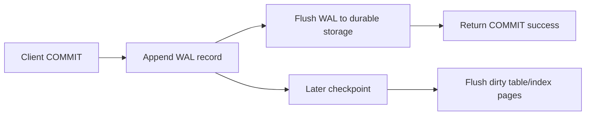
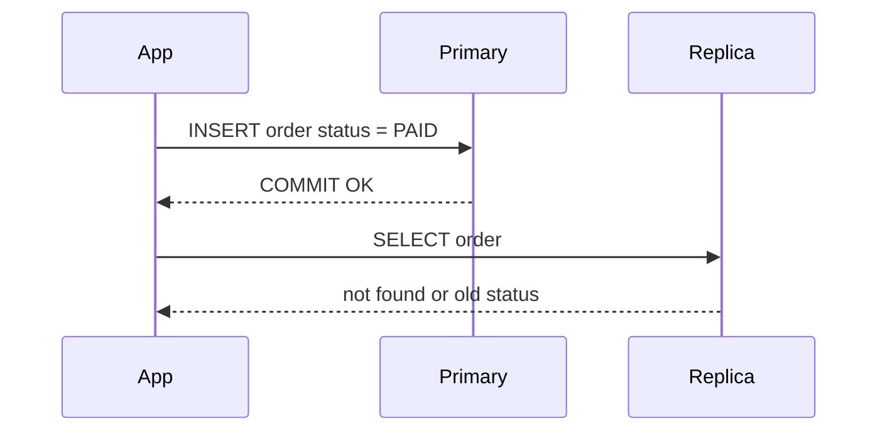
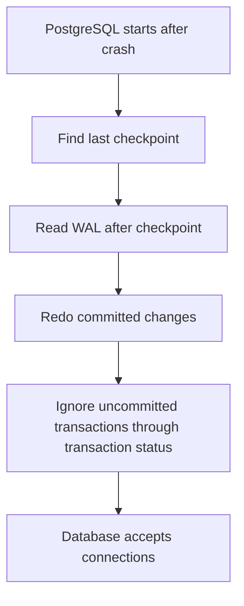
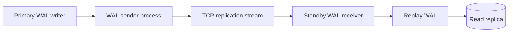
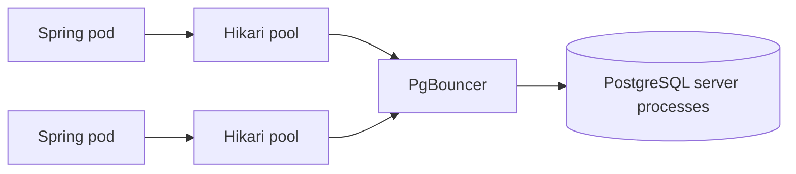

## Prerequisites: Before You Begin

You should already know:

- Tables, primary keys, indexes, and transactions.
- Basic PostgreSQL connection pooling with HikariCP.
- Why production systems need backups, replicas, and failover.

---

# Phase 1: Ground Floor (Physical First Principles)

PostgreSQL cannot safely update table files directly and hope for the best. Disks, kernels, containers, and power supplies can fail halfway through a write. The Write-Ahead Log (WAL) exists so PostgreSQL can recover after a crash and replay committed changes.



The rule is simple:

> PostgreSQL writes the log of the change before it relies on the data file containing the change.

## Why WAL Is Fast

Random table updates scatter across many disk pages. WAL is mostly sequential append. Sequential writes are friendlier to disks, SSD controllers, operating-system page cache, and replication.

| Operation | Physical shape |
| --- | --- |
| Update a row | Touch heap page, index pages, visibility metadata |
| Append WAL | Write bytes to the next WAL position |
| Checkpoint | Flush dirty pages later in controlled batches |
| Crash recovery | Replay WAL records after last checkpoint |

---

# Phase 2: The Naive Architecture (The Production Crash)

## Crash 1: Replica Slot Fills Disk

A team creates a physical replication slot for a read replica. The replica goes down over the weekend. The primary keeps WAL files because the slot says the replica still needs them. On Monday, `pg_wal` fills the disk and the primary stops accepting writes.

Defense:

```sql
SELECT slot_name,
       active,
       pg_size_pretty(pg_wal_lsn_diff(pg_current_wal_lsn(), restart_lsn)) AS retained_wal
FROM pg_replication_slots;
```

Set a maximum retained WAL policy:

```sql
ALTER SYSTEM SET max_slot_wal_keep_size = '20GB';
SELECT pg_reload_conf();
```

## Crash 2: Read Replica Used For Fresh Reads

The application writes an order and immediately reads it from a lagging replica.



Defense:

- Route read-your-writes flows to the primary.
- Measure replica lag.
- Use a session token or last-seen LSN for advanced routing.
- Keep correctness-critical reads off async replicas.

## Crash 3: PgBouncer Transaction Pooling Breaks Session State

Transaction pooling returns the server connection to the pool after each transaction. That is powerful, but anything stored in the session can disappear between statements.

Dangerous assumptions:

- Temporary tables survive across transactions.
- `SET search_path` stays forever.
- Session-level advisory locks remain attached.
- Prepared statements behave like a dedicated connection.

---

# Phase 3: Under The Hood

## WAL Terms You Must Know

| Term | Meaning |
| --- | --- |
| WAL record | Binary description of a change needed for redo. |
| LSN | Log Sequence Number: byte position in WAL stream. |
| Checkpoint | Point where dirty pages are flushed so recovery can start later. |
| `pg_wal` | Directory storing WAL segment files. |
| Full page write | First page image after checkpoint to protect against torn pages. |
| Replication slot | Retention promise that primary keeps WAL for a replica or decoder. |
| Timeline | History branch after recovery or failover. |

## Crash Recovery Flow



## Streaming Replication Flow



Important lag types:

| Lag type | Meaning |
| --- | --- |
| write lag | Replica has not received or written WAL. |
| flush lag | Replica has not flushed WAL durably. |
| replay lag | Replica has WAL but has not applied it to visible data pages. |

## Read Replica Routing In Spring

```java
public enum DataSourceRole {
    PRIMARY,
    REPLICA
}
```

```java
public final class DataSourceRoleContext {

    private static final ThreadLocal<DataSourceRole> CURRENT =
            ThreadLocal.withInitial(() -> DataSourceRole.PRIMARY);

    public static void useReplica() {
        CURRENT.set(DataSourceRole.REPLICA);
    }

    public static DataSourceRole current() {
        return CURRENT.get();
    }

    public static void clear() {
        CURRENT.remove();
    }
}
```

```java
public class RoutingDataSource extends AbstractRoutingDataSource {
    @Override
    protected Object determineCurrentLookupKey() {
        return DataSourceRoleContext.current();
    }
}
```

Use this carefully. A stale read is a correctness bug if the user expects the just-committed state.

## PgBouncer Pool Modes

| Mode | Server connection released when | Good for | Dangerous for |
| --- | --- | --- | --- |
| Session | Client disconnects | apps needing session state | many idle clients |
| Transaction | transaction finishes | high connection fan-in | session features |
| Statement | statement finishes | narrow simple workloads | multi-statement transactions |

## HikariCP Plus PgBouncer

HikariCP pools application-side connections. PgBouncer pools database-side connections. They solve different problems.



Rule of thumb:

- Keep Hikari pools modest per pod.
- Use PgBouncer when many pods would create too many PostgreSQL server processes.
- Understand pool mode before enabling transaction pooling.

---

# Phase 4: Senior Interview Ace

| Junior answer | Senior answer |
| --- | --- |
| "WAL is the transaction log." | "WAL is the durable redo stream. Commit returns after WAL is flushed, while dirty table pages can be checkpointed later." |
| "Read replicas scale reads." | "They scale stale reads. Correctness-critical read-after-write paths must route to primary or prove replica freshness." |
| "Replication slots prevent missing WAL." | "They retain WAL for consumers, but a dead slot can fill `pg_wal` and stop the primary." |
| "PgBouncer makes DB faster." | "PgBouncer reduces server connection pressure. Transaction pooling changes session semantics and can break session state." |

## Production Debug Checklist

```sql
SELECT now() - pg_last_xact_replay_timestamp() AS replica_delay;
```

```sql
SELECT application_name,
       state,
       sent_lsn,
       write_lsn,
       flush_lsn,
       replay_lsn
FROM pg_stat_replication;
```

```sql
SELECT slot_name, slot_type, active, restart_lsn
FROM pg_replication_slots;
```

```sql
SELECT checkpoints_timed,
       checkpoints_req,
       checkpoint_write_time,
       checkpoint_sync_time
FROM pg_stat_bgwriter;
```

## Common Mistakes

| Mistake | Production result | Fix |
| --- | --- | --- |
| Use replica for post-write reads | user sees missing or stale data | primary routing for read-your-writes |
| Ignore inactive slots | disk fills with retained WAL | slot monitoring and retention limit |
| Oversize Hikari pools | too many backend processes | pool math across all pods |
| Enable PgBouncer transaction pooling blindly | prepared statements/session state break | audit session features first |
| No checkpoint monitoring | latency spikes during dirty-page flush | tune and monitor checkpoint behavior |

## Practice Tasks

1. Create a physical replication slot and inspect it in `pg_replication_slots`.
2. Measure replica delay during a write-heavy load test.
3. Route read-only endpoints to a replica and force one endpoint back to primary.
4. Put PgBouncer in transaction mode and identify which session features break.
5. Explain why a committed transaction can survive a crash even before data pages are flushed.

## Done Checklist

- [ ] You can draw WAL commit, checkpoint, and crash recovery.
- [ ] You can explain LSN, replication slot, and replica lag.
- [ ] You can decide when a read replica is unsafe.
- [ ] You can compare HikariCP and PgBouncer accurately.
- [ ] You can debug a primary that is filling `pg_wal`.
