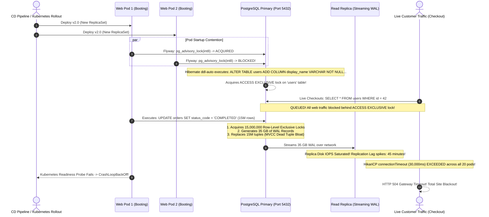
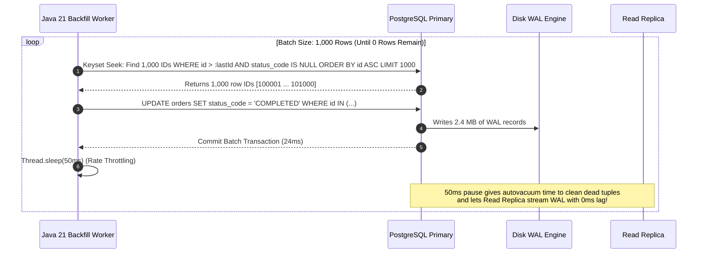
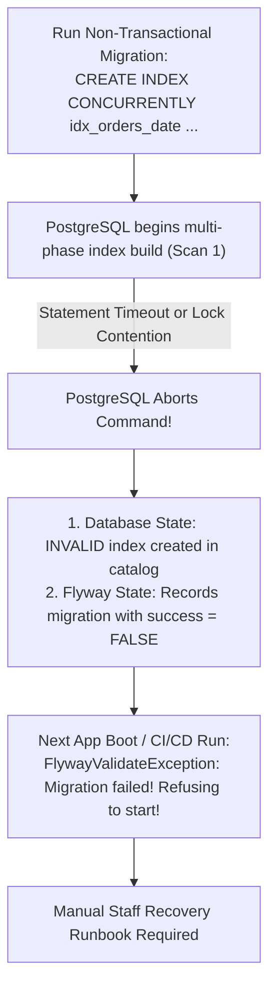

# Production Query Design, Index Tuning & Flyway Migrations

In modern backend engineering, an application's scalability, latency SLAs, and operational stability are almost always bounded by its database interaction.

Writing inefficient queries or executing uncoordinated schema migrations leads to severe production outages:
- **Full Table Heap Scans**: Queries selecting unused columns force the database engine to pull gigabytes of 8KB disk pages into memory, evicting the active working set from the buffer pool.
- **Migration Concurrency Collisions**: Multiple Kubernetes pods executing simultaneous Flyway migrations during startup, contending for locks and causing readiness probe timeouts.
- **The Giant `UPDATE` Disaster**: Running an un-chunked `UPDATE` statement on a 15-million row table locks rows for minutes, floods the Write-Ahead Log (WAL), blows up replication lag on read replicas, and crashes client web traffic.
- **Silent Schema Drift**: Running Hibernate's `ddl-auto: update` in production, allowing runtime entity changes to alter constraints or types unpredictably.

---

## 1. Phase 1: Ground Floor (Physical First Principles)

To design high-throughput database queries and safe schema migrations, you must first understand how database engines physically store and read information on persistent storage.

```mermaid
flowchart TD
    subgraph StorageHierarchy ["PostgreSQL Physical Disk Page Layout (8KB Blocks)"]
        Page["8KB Disk Block (Page Header)"]
        LP["Line Pointers: ItemIdData (lp_offset, lp_flags, lp_len)"]
        Free["Unallocated Free Space (pd_lower -> pd_upper)"]
        Tuples["Heap Tuples (xmin, xmax, t_ctid, user payload data)"]
        Page --> LP --> Free --> Tuples
    end

    subgraph IndexHeapInteraction ["Index vs Heap Access"]
        BTreeLeaf["B-Tree Leaf Node: Key Value + Tuple Pointer (ctid: Block 412, Offset 3)"]
        VM["Visibility Map (VM): 2 bits per 8KB page (All-Visible, All-Frozen)"]
        Heap["Physical Table Heap File: Block 412"]
        
        BTreeLeaf --> VM
        VM -->|Bit = 1 (All-Visible)| ReturnDirect["INDEX-ONLY SCAN: Return Directly from RAM! (0 Heap Fetches)"]
        VM -->|Bit = 0 (Unfrozen)| Heap
        Heap -->|Random Disk I/O| ReadHeap["INDEX SCAN: Fetch 8KB Page from Disk or OS Cache"]
    end
```

### The 8KB Page Architecture & Random Disk I/O
PostgreSQL and MySQL organize table data on disk into fixed-size blocks (typically **8KB in PostgreSQL**, **16KB in MySQL InnoDB**).
1. **Line Pointers & Tuples**: At the top of each 8KB page sits an array of 4-byte line pointers (`ItemIdData`) pointing to the physical byte offset of each tuple (`row`) stored from the bottom of the page upward.
2. **Tuple Identifiers (`ctid`)**: When an index indexes a table, it does not store the table's row data. A standard B-Tree index stores the indexed column key and a 6-byte pointer called a **`ctid`** (e.g., `(block_number: 412, item_offset: 3)`).
3. **The Random I/O Cost**: In a standard index scan, the database searches the B-Tree in memory ($O(\log N)$), finds the `ctid`, and then must issue an I/O request to load the physical 8KB heap page from disk or the buffer cache. If your query fetches 10,000 rows scattered across 10,000 different 8KB disk blocks, the storage controller must perform **10,000 random I/O operations** ($\approx 80\text{ MB}$ of data transferred just to read a few kilobytes of payload).

### The Visibility Map (VM) and Index-Only Scans
Why can't PostgreSQL satisfy `SELECT email FROM users WHERE id = 42` directly from an index on `(id, email)` without visiting the table heap?
- **Multi-Version Concurrency Control (MVCC)**: B-Tree index tuples do not contain MVCC transaction visibility headers (`xmin` / `xmax`). The index alone does not know whether a tuple has been deleted or updated by a concurrent uncommitted transaction!
- **The Visibility Map Solution**: PostgreSQL maintains a separate auxiliary bitmap file called the **Visibility Map (`_vm`)**. It stores two bits for every 8KB table page:
  - **All-Visible Bit**: If set to `1`, all tuples on this 8KB page are known to be visible to all current and future transactions. No concurrent transaction is modifying them.
  - **All-Frozen Bit**: If set to `1`, all tuples on this page have been frozen by `VACUUM` and will never require freeze processing.
- **The Index-Only Scan Rule**: When PostgreSQL executes an **Index-Only Scan**, it checks the Visibility Map. If the page's all-visible bit is `1`, it skips reading the 8KB heap page completely (`Heap Fetches: 0`). If the bit is `0`, it must fall back to reading the physical heap page to verify MVCC visibility!

### The Shared Memory Lock Table & Advisory Locks
PostgreSQL coordinates migrations and concurrent statements using an in-memory hash table in shared RAM (`LockMethodData`):
- When an application executes `ALTER TABLE`, the backend worker process requests an `ACCESS EXCLUSIVE` lock in shared memory.
- When an application requests an **Advisory Lock** via `SELECT pg_advisory_lock(142857)`:
  - No physical table or disk row is locked.
  - An application-defined 64-bit integer (`bigint`) is placed into PostgreSQL's shared lock table.
  - Other worker threads attempting to acquire the same 64-bit integer will block or fail immediately, providing an ideal mechanism for distributed cluster coordination across multi-pod Spring Boot deployments.

---

## 2. Phase 2: The Naive Code (The Production Crash)

Let us examine two naive implementations that frequently trigger SEV-1 production outages: uncoordinated startup migrations and un-chunked mass updates.

### Naive Implementation 1: Hibernate `ddl-auto: update` & Startup Migrations

```yaml
# application.yml (NAIVE CONFIGURATION - PRODUCTION HAZARD)
spring:
  jpa:
    hibernate:
      ddl-auto: update # Danger: Alters database schema dynamically on boot!
  flyway:
    enabled: true     # Danger: 20 web pods fight for migration locks on rollout!
```

```java
// Naive Entity: Developer renames a field
@Entity
@Table(name = "users")
public class User {
    @Id
    private Long id;

    // Developer changed column from 'fullName' to 'displayName'
    @Column(name = "display_name", nullable = false)
    private String displayName;
}
```

### Naive Implementation 2: The Giant Un-Chunked `UPDATE` Statement

```java
// Naive Service Method: Executing mass update in a single transaction
@Service
public class OrderMigrationService {

    @Autowired
    private JdbcTemplate jdbcTemplate;

    @Transactional
    public void migrateLegacyOrders() {
        // CATASTROPHIC HAZARD: Updating 15 million rows in one statement!
        String sql = "UPDATE orders SET status_code = 'COMPLETED' WHERE legacy_status = 1";
        jdbcTemplate.update(sql);
    }
}
```

### The Production Catastrophe Sequence



#### Why Production Collapsed:
1. **The Lock Queue Trap**: When Hibernate or Flyway ran `ALTER TABLE` to add columns without explicit timeouts, it requested an `ACCESS EXCLUSIVE` lock. All incoming customer checkouts (`SELECT`, `INSERT`, `UPDATE`) queued up in PostgreSQL's FIFO lock manager behind it.
2. **Row Lock Exclusivity & HikariCP Starvation**: The single `UPDATE` locked 15 million rows for 12 minutes. Every checkout thread trying to touch an existing order blocked, exhausting HikariCP connection pools in under 30 seconds.
3. **WAL Flooding & Replica Blackout**: PostgreSQL MVCC cannot update a row in-place without writing a new tuple version. Updating 15M rows created 15M new tuples and 15M dead tuples, generating **35 GB of Write-Ahead Log (WAL)**. Network bandwidth saturated, and streaming read replicas lagged by 45 minutes, serving severely stale data to users.
4. **Catastrophic Rollback**: When Kubernetes killed the unresponsive pod after a 60-second probe timeout, PostgreSQL spent 15 minutes rolling back the uncommitted 35GB transaction, holding exclusive table locks throughout the entire rollback!

---

## 3. Phase 3: Under the Hood (Mechanics, Bytecode & Solutions)

To eliminate downtime, senior engineers apply three production-hardened architectural pillars:
1. **Covering Indexes with `INCLUDE` & Visibility Map Priming**.
2. **Dedicated Pre-Deployment Kubernetes Migration Jobs with Advisory Locking**.
3. **Chunked Keyset Cursor Backfills with Dynamic Rate Throttling**.

---

### Pillar 1: Covering Indexes with `INCLUDE` & Index-Only Scans

When an index includes both search predicates and payload columns, PostgreSQL satisfies the query entirely from the B-Tree leaf nodes without touching the physical table heap:

```sql
-- Search key is (user_id, status); total_amount and created_at are carried as payload!
CREATE INDEX CONCURRENTLY idx_orders_user_status_covering 
ON orders (user_id, status) 
INCLUDE (total_amount, created_at);
```

Line by line:

- `CREATE INDEX CONCURRENTLY` avoids blocking normal reads and writes while the index is built. It takes longer than a normal index build but is safer for live systems.
- `idx_orders_user_status_covering` names the query shape the index serves.
- `ON orders (user_id, status)` makes `user_id` and `status` the searchable sorted key.
- `INCLUDE (total_amount, created_at)` stores payload columns in leaf pages so PostgreSQL can answer the query without visiting heap pages.
- `total_amount` and `created_at` are not useful for searching in this index; they are useful for returning the response cheaply.

Matching query:

```sql
SELECT total_amount, created_at
FROM orders
WHERE user_id = 42
  AND status = 'PAID';
```

Proof target:

```console
EXPLAIN should show Index Only Scan using idx_orders_user_status_covering.
Heap Fetches should be 0 or close to 0 after VACUUM marks pages all-visible.
Buffers should show mostly shared hits after warmup.
```

#### Anatomy of a Covering Index:
- **Search Key (`user_id`, `status`)**: Sorted in the upper B-Tree branch and interior nodes. Used for $O(\log N)$ binary search.
- **Payload (`INCLUDE (total_amount, created_at)`)**: Stored **only in the leaf nodes**. It is never evaluated during branch navigation, preventing B-Tree key size inflation and keeping the B-Tree shallow!

#### Verifying Zero Heap Fetches with `EXPLAIN (ANALYZE, BUFFERS)`:

```sql
EXPLAIN (ANALYZE, BUFFERS)
SELECT id, total_amount, created_at 
FROM orders 
WHERE user_id = 42 AND status = 'PAID';
```

```postgresql
                                                        QUERY PLAN
--------------------------------------------------------------------------------------------------------------------------
 Index Only Scan using idx_orders_user_status_covering on orders  (cost=0.43..12.85 rows=5 width=24) (actual time=0.021..0.028 rows=4 loops=1)
   Index Cond: ((user_id = 42) AND (status = 'PAID'::text))
   Heap Fetches: 0
   Buffers: shared hit=3
 Planning:
   Buffers: shared hit=2
 Planning Time: 0.112 ms
 Execution Time: 0.045 ms
```

<Tip>
**Notice `Heap Fetches: 0`**: PostgreSQL satisfied the entire query by reading only 3 buffer pages (`shared hit=3`) from RAM. It performed **zero random disk reads** to the table heap!
</Tip>

---

### Pillar 2: Flyway Engine Internals & Dedicated Kubernetes Migration Jobs

Flyway tracks and guarantees schema states using a dedicated catalog table `flyway_schema_history`:

```sql
-- Schema of Flyway's internal state tracker
CREATE TABLE flyway_schema_history (
    installed_rank INT NOT NULL PRIMARY KEY,
    version VARCHAR(50),
    description VARCHAR(200) NOT NULL,
    type VARCHAR(20) NOT NULL,
    script VARCHAR(1000) NOT NULL,
    checksum INT, -- CRC32 hash of the SQL script content
    installed_by VARCHAR(100) NOT NULL,
    installed_on TIMESTAMP NOT NULL DEFAULT now(),
    execution_time INT NOT NULL,
    success BOOLEAN NOT NULL
);
```

#### How Flyway Enforces Determinism:
1. **Advisory Lock Acquisition**: Flyway calls `pg_advisory_lock(int8)` derived from hashing the table name, preventing concurrent migrations.
2. **CRC32 Checksum Validation**: It hashes each local `.sql` script using CRC32. If a developer modified an already-applied migration file (`V2__add_index.sql`), the checksum mismatches and Flyway aborts with `FlywayValidateException: Validate failed: Checksum mismatch!`.
3. **Sequential Execution**: It applies unapplied scripts strictly in version order (`V1 -> V2 -> V3`), recording execution duration and success flags.

#### Multi-Pod Kubernetes Standard: The Pre-Install Migration Job

Web application pods should **never execute DDL migrations** at startup. Web pods should only validate that the database matches their entity schema.

```mermaid
flowchart TD
    subgraph K8sDeploymentLifecycle ["Kubernetes CD Pipeline Rollout"]
        CI["CI/CD Runner: git merge to main"] --> Job["Step 1: Run Dedicated Migration Job<br/>(flyway/flyway:10-alpine)"]
        Job -->|Acquires Lock & Applies SQL| DB[(PostgreSQL Database)]
        Job -->|Job Succeeds (Exit 0)| Rollout["Step 2: Trigger Rolling Deployment<br/>(kubectl set image deployment/web-api)"]
        Rollout --> PodA["Web Pod 1: Validate Schema (Exit 0)"]
        Rollout --> PodB["Web Pod 2: Validate Schema (Exit 0)"]
        
        Job -.->|Migration Fails (Exit 1)| Abort["Pipeline Aborts! Web pods never touched!"]
    end
```

#### Dedicated Kubernetes Migration Job Manifest:

```yaml
# kubernetes/migration-job.yml
apiVersion: batch/v1
kind: Job
metadata:
  name: flyway-schema-migration-v2-4
  namespace: production
spec:
  backoffLimit: 0 # Fail fast! Do not retry a corrupted or failing DDL script
  template:
    spec:
      restartPolicy: Never
      containers:
      - name: flyway
        image: flyway/flyway:10-alpine
        command: ["flyway", "-connectRetries=10", "migrate"]
        env:
        - name: FLYWAY_URL
          value: "jdbc:postgresql://postgres.internal:5432/app_db?sslmode=require"
        - name: FLYWAY_USER
          valueFrom:
            secretKeyRef:
              name: db-credentials
              key: username
        - name: FLYWAY_PASSWORD
          valueFrom:
            secretKeyRef:
              name: db-credentials
              key: password
```

#### Web Application Configuration (`application-production.yml`):

```yaml
spring:
  flyway:
    enabled: false # Web pods NEVER run DDL!
  jpa:
    hibernate:
      ddl-auto: validate # Fail fast on startup if database schema does not match entity model!
```

---

### Pillar 3: Non-Blocking Concurrent Indexing in Flyway

Standard `CREATE INDEX` takes a **`SHARE` lock**, blocking all `INSERT`, `UPDATE`, and `DELETE` queries on the table until the index build completes. On a 20-million row table, this causes a 10-minute site outage.

PostgreSQL provides `CREATE INDEX CONCURRENTLY`, which builds the index without blocking writes by performing **two separate table scans**:
1. First scan builds the index structure while allowing live concurrent writes.
2. Second scan catches up with all tuples inserted or modified during the first scan.

> [!IMPORTANT]
> `CREATE INDEX CONCURRENTLY` **cannot execute inside an active transaction block** (`ERROR: CREATE INDEX CONCURRENTLY cannot run inside a transaction block`).

#### Production Flyway Configuration:
Flyway allows per-script transaction disabling using a sibling `.conf` file:

```sql
-- src/main/resources/db/migration/V5__add_orders_created_at_idx.sql
CREATE INDEX CONCURRENTLY idx_orders_created_at 
ON orders (created_at);
```

```properties
# src/main/resources/db/migration/V5__add_orders_created_at_idx.sql.conf
# Instructs Flyway to execute this migration outside a BEGIN ... COMMIT block
executeInTransaction=false
```

#### Cleaning Up Failed `INVALID` Indexes:
If a concurrent index build is terminated or encounters a deadlock, PostgreSQL leaves behind an **`INVALID` index**. An invalid index is ignored by queries but continues to consume write IOPS on every `INSERT`:

```sql
-- 1. Identify invalid indexes in the database catalog
SELECT indexrelid::regclass AS index_name, indisvalid 
FROM pg_index 
WHERE indisvalid = false;

-- 2. Drop the invalid index concurrently without blocking writes
DROP INDEX CONCURRENTLY idx_orders_created_at;

-- 3. Recreate the index concurrently
CREATE INDEX CONCURRENTLY idx_orders_created_at ON orders (created_at);
```

---

### Pillar 4: Chunked Keyset Cursor Backfills in Java 21

When backfilling data or migrating column values across millions of rows, you must execute the changes in discrete, deterministic batches using **Keyset Pagination (Cursor Seek)**.



#### Complete Production-Grade Java 21 Backfill Service:

```java
package com.backend.mastery.database.migration;

import org.slf4j.Logger;
import org.slf4j.LoggerFactory;
import org.springframework.jdbc.core.namedparam.MapSqlParameterSource;
import org.springframework.jdbc.core.namedparam.NamedParameterJdbcTemplate;
import org.springframework.stereotype.Service;

import java.util.List;

@Service
public class ProductionDataBackfillService {

    private static final Logger log = LoggerFactory.getLogger(ProductionDataBackfillService.class);
    private final NamedParameterJdbcTemplate jdbcTemplate;

    private static final int BATCH_SIZE = 1_000;
    private static final long THROTTLE_SLEEP_MS = 50L;

    public ProductionDataBackfillService(NamedParameterJdbcTemplate jdbcTemplate) {
        this.jdbcTemplate = jdbcTemplate;
    }

    /**
     * Backfills orders in discrete, isolated batches using keyset pagination.
     * Each batch commits independently to prevent long-lived transactions and WAL bloat.
     */
    public void executeOrderMigration() {
        long lastProcessedId = 0L;
        long totalRowsUpdated = 0L;
        long batchNumber = 0L;

        log.info("Starting production order backfill. Batch size: {}, Pause: {}ms", 
                BATCH_SIZE, THROTTLE_SLEEP_MS);

        while (true) {
            batchNumber++;

            // Step 1: Keyset Seek to find the exact primary key bounds for the batch
            String selectBatchSql = """
                SELECT id FROM orders
                WHERE id > :lastId AND status_code IS NULL
                ORDER BY id ASC
                LIMIT :limit
                """;

            var selectParams = new MapSqlParameterSource()
                    .addValue("lastId", lastProcessedId)
                    .addValue("limit", BATCH_SIZE);

            List<Long> batchIds = jdbcTemplate.query(
                    selectBatchSql, 
                    selectParams, 
                    (rs, rowNum) -> rs.getLong("id")
            );

            if (batchIds.isEmpty()) {
                log.info("Backfill finished successfully! Total batches: {}, Total rows updated: {}", 
                        batchNumber - 1, totalRowsUpdated);
                break;
            }

            long currentMaxId = batchIds.get(batchIds.size() - 1);

            // Step 2: Update only the rows identified in this batch
            String updateBatchSql = """
                UPDATE orders
                SET status_code = 'COMPLETED'
                WHERE id IN (:ids)
                """;

            var updateParams = new MapSqlParameterSource()
                    .addValue("ids", batchIds);

            int updatedCount = jdbcTemplate.update(updateBatchSql, updateParams);
            totalRowsUpdated += updatedCount;
            lastProcessedId = currentMaxId;

            log.info("Batch #{} committed: {} rows updated. Last Processed ID: {}. Cumulative: {}", 
                    batchNumber, updatedCount, lastProcessedId, totalRowsUpdated);

            // Step 3: Defensive throttling pause to protect replication and autovacuum
            try {
                Thread.sleep(THROTTLE_SLEEP_MS);
            } catch (InterruptedException e) {
                Thread.currentThread().interrupt();
                log.error("Data backfill worker was interrupted at ID: {}", lastProcessedId);
                throw new IllegalStateException("Backfill interrupted", e);
            }
        }
    }
}
```

---

### Pillar 5: Non-Transactional DDL Failure Recovery & The `flyway repair` Lifecycle

When Flyway executes migrations inside a transaction (`executeInTransaction=true`), any error (syntax error, lock timeout) triggers an automatic rollback of the transaction block. The database schema remains clean, and the failed migration entry is not written to `flyway_schema_history`.

However, for **non-transactional migrations** (`executeInTransaction=false`, required for `CREATE INDEX CONCURRENTLY` and `DROP INDEX CONCURRENTLY`), partial failure creates a critical operational hazard.



#### The 3-Step Non-Transactional Recovery Runbook:
When a concurrent index migration fails, subsequent deployments will refuse to run until you execute this repair sequence:

1. **Step 1: Clean Up the Broken Database Catalog Object**:
   Drop the invalid index concurrently so writes to the table are not blocked:
   ```sql
   DROP INDEX CONCURRENTLY IF EXISTS idx_orders_date;
   ```
2. **Step 2: Run `flyway repair`**:
   The `repair` command performs two actions:
   - It deletes any failed migration entries (`success = false`) from `flyway_schema_history`.
   - It recalculates the CRC32 checksums of applied migrations against current disk files.
   ```bash
   flyway -url="jdbc:postgresql://..." -user="..." -password="..." repair
   ```
3. **Step 3: Make the Migration Script Idempotent & Re-run**:
   Always write non-transactional DDL using defensive clauses so retries succeed even if partially executed:
   ```sql
   -- src/main/resources/db/migration/V5__add_orders_date_idx.sql
   CREATE INDEX CONCURRENTLY IF NOT EXISTS idx_orders_date ON orders (created_at);
   ```

---

### Pillar 6: Large-Scale Keyset Deletion Physics: CTEs, Deadlock Prevention & WAL Throttling Math

In enterprise backends, data retention policies require purging hundreds of millions of historical logs, expired sessions, or soft-deleted records.

#### The Naive Mass Delete Catastrophe:
```sql
-- DANGEROUS IN PRODUCTION: LOCKS TABLE, FLOODS WAL, FREEZES REPLICAS!
DELETE FROM audit_logs WHERE created_at < '2024-01-01';
```

Executing this on a 50-million-row table triggers four simultaneous production failures:
1. **Millions of Exclusive Row Locks**: Blocks all active application transactions touching any of those rows.
2. **Gigabytes of WAL Records**: Generates 20+ GB of Write-Ahead Logs in seconds, saturating disk write IOPS and overwhelming read replica streaming replication links.
3. **Severe Dead Tuple Bloat**: Creates 50 million dead tuples instantly, starving the autovacuum engine.
4. **Out-of-Memory Risk**: PostgreSQL must track all deleted row identifiers in memory during the transaction.

---

#### The Staff Deletion Architecture: Monotonic CTEs with Deadlock Prevention
To purge massive datasets safely on a live OLTP database, use a **chunked Common Table Expression (CTE)** that deletes rows in strict monotonic primary key order:

```sql
WITH doomed_rows AS (
    SELECT id FROM audit_logs
    WHERE created_at < '2024-01-01'
    ORDER BY id ASC
    LIMIT 5000
)
DELETE FROM audit_logs
WHERE id IN (SELECT id FROM doomed_rows);
```

Line by line:
- `WITH doomed_rows AS (...)`: Isolates the candidate selection in a separate query stage. Keyset scanning stops reading disk pages as soon as 5,000 matching rows are found.
- `ORDER BY id ASC`: **Crucial for Deadlock Prevention**. If multiple cleanup jobs or live customer transactions update `audit_logs` concurrently, deleting rows in arbitrary disk order causes circular lock dependencies (Transaction A locks row 50 then wants row 10; Transaction B locks row 10 then wants row 50 $\rightarrow$ Deadlock!). Enforcing strict ascending primary key order guarantees all processes request row locks in the exact same direction, eliminating deadlocks!
- `LIMIT 5000`: Caps the transaction size to a deterministic, bounded memory footprint.
- `DELETE ... WHERE id IN (...)`: Deletes exactly 5,000 tuples, generating only $\sim 500\text{ KB}$ of WAL records before committing.

#### WAL Sizing & Throttle Pause Mathematics:
To prevent read replica lag during continuous purging, calculate the maximum allowable deletion throughput based on your read replica's network streaming budget:

$$\text{WAL Per Delete} \approx \text{Tuple Header (23 bytes)} + \text{Item Pointer (4 bytes)} + \text{WAL Record Header (24 bytes)} \approx 80\text{ bytes}$$

$$\text{Batch WAL Volume} = 5,000 \text{ rows} \times 80\text{ bytes} \approx 400\text{ KB}$$

$$\text{Throughput at 100ms Pause} = \frac{400\text{ KB}}{0.1\text{ s}} = 4.0\text{ MB/second of WAL}$$

Because a modern 1Gbps network connection can stream up to $125\text{ MB/second}$, a $4.0\text{ MB/second}$ deletion rate guarantees **zero read replica lag** and leaves 96% of network and disk I/O available for live customer checkout traffic!

---

## Query Design Fundamentals Interview Map

Query design is choosing the cheapest correct path through data.

### 1. Start from the access pattern

Do not create tables first and hope queries are fast. Write the questions the product asks:

```console
List the 50 newest paid orders for one user.
Find unprocessed outbox events in creation order.
Search active products by tenant and category.
```

Then design indexes that match filters, ordering, and pagination.

### 2. Composite index order

For this query:

```sql
SELECT id, created_at, total_cents
FROM orders
WHERE user_id = ?
  AND status = 'PAID'
ORDER BY created_at DESC
LIMIT 50;
```

Use:

```sql
CREATE INDEX idx_orders_user_status_created
ON orders(user_id, status, created_at DESC)
INCLUDE (total_cents);
```

Equality filters usually come first, then range/order columns, then included payload columns.

### 3. Backfills are workload, not just SQL

A large update creates WAL, locks rows, produces dead tuples, and can lag replicas.

Chunk it:

```sql
SELECT id
FROM orders
WHERE id > :lastId
ORDER BY id
LIMIT 1000;
```

Then update only that batch and commit.

### 4. Migrations need evidence

For every migration, ask:

- Is it metadata-only or table-rewriting?
- What lock does it require?
- Can old and new app versions both run?
- How will it behave on existing data?
- What is the rollback or roll-forward plan?

### Build-Break-Fix Lab

<Steps>
  <Step title="Build">
    Design a query and index for newest paid orders per user.
  </Step>
  <Step title="Break">
    Put `created_at` first in the index and omit `user_id`.
  </Step>
  <Step title="Observe">
    Use `EXPLAIN` to see missed index usage or excess scanning.
  </Step>
  <Step title="Fix">
    Reorder the composite index to match equality filters and sort order.
  </Step>
  <Step title="Prove">
    Add a regression note with expected plan shape and bounded execution rows.
  </Step>
</Steps>

---

## 4. Phase 4: Senior Interview Ace (Junior vs Staff Phrasing)

When interviewing for Senior or Staff Backend Engineer roles, interviewers evaluate whether you understand database internals and zero-downtime operational safety.

### Junior Answer vs. Staff Engineer Answer

| Scenario | Junior Engineer Answer | Staff / Principal Engineer Answer |
| :--- | :--- | :--- |
| **"How do you migrate database schemas across multiple pods?"** | *"I enable Flyway in `application.yml`. When Spring Boot boots up, Flyway runs the SQL migrations automatically."* | *"We disable Flyway in web pods (`spring.flyway.enabled: false`) and set Hibernate to `ddl-auto: validate`. Migrations run as a dedicated, pre-install Kubernetes Job with `backoffLimit: 0` before rolling deployment begins. This prevents pod startup contention, eliminates advisory lock timeouts, and guarantees that web pods only boot against a verified, backward-compatible schema."* |
| **"How do you index a 50-million row table without downtime?"** | *"I write a migration script with `CREATE INDEX idx_created_at ON orders(created_at);` and run it during low traffic hours."* | *"Standard `CREATE INDEX` takes a `SHARE` lock that blocks all concurrent writes. We use `CREATE INDEX CONCURRENTLY` configured in Flyway with a sibling `.conf` file setting `executeInTransaction=false`. Because concurrent indexing performs two full table scans to coordinate with active transactions, it cannot execute inside a transaction block. If an index build fails, we inspect `pg_index` for `indisvalid = false` and clean it up before recreating."* |
| **"How do you update a column value on 20 million rows?"** | *"I write an `UPDATE orders SET status = 'NEW'` script. It runs once in SQL."* | *"A single massive `UPDATE` acquires 20 million exclusive row locks, floods the Write-Ahead Log (WAL) with gigabytes of diffs, causes massive read replica lag, and creates 20 million MVCC dead tuples. We execute chunked keyset cursor backfills in batches of 1,000 rows ordered by primary key (`WHERE id > :lastId LIMIT 1000`), committing each batch independently with a 50ms sleep. This keeps transactions microsecond-short, allows autovacuum to recycle dead tuple space, and maintains zero replica lag."* |
| **"What is a covering index and how does it optimize queries?"** | *"It is an index that has multiple columns so the database finds rows faster."* | *"A covering index uses the `INCLUDE` clause to store auxiliary payload columns directly in the B-Tree leaf pages without indexing them in the search tree. When paired with a clean Visibility Map where the page's all-visible bit is `1`, PostgreSQL executes an Index-Only Scan (`Heap Fetches: 0`), retrieving all requested data directly from the index in memory without performing random disk I/O against the table heap."* |
| **"What happens when a non-transactional Flyway migration fails, and how do you recover?"** | *"Flyway rolls it back automatically."* | *"Non-transactional migrations (like `CREATE INDEX CONCURRENTLY` run with `executeInTransaction=false`) cannot roll back. The database is left with an `INVALID` index consuming write IOPS, and `flyway_schema_history` marks `success = false`, blocking all future deployments. Recovery requires a 3-step runbook: (1) Concurrently drop the invalid index object via manual DDL, (2) Run `flyway repair` to purge the failed record from schema history, and (3) Re-run the migration with `IF NOT EXISTS` guards."* |
| **"Why should large-scale batch DELETE operations enforce strict primary key sorting inside a CTE?"** | *"Sorting ensures that the oldest records are deleted first."* | *"Beyond business retention ordering, sorting candidate rows via `ORDER BY id ASC` inside the deletion CTE is a critical defense against database deadlocks. When multiple cleanup workers or live application transactions delete or update records concurrently, arbitrary row locking order causes circular lock dependencies. Forcing all operations to acquire row-level exclusive locks in identical ascending primary key order makes deadlocks mathematically impossible."* |

---

## 5. Active Recall & Self-Assessment

<AccordionGroup>
  <Accordion title="1. Why does CREATE INDEX CONCURRENTLY require two separate table scans?">
    Standard `CREATE INDEX` blocks writes so it only needs to scan the table once. In contrast, `CREATE INDEX CONCURRENTLY` allows live `INSERT`, `UPDATE`, and `DELETE` queries while building. To ensure consistency:
    1. **Scan 1**: Builds the initial index structure from all existing committed tuples.
    2. **Transaction Wait**: Waits for all active transactions that could modify the table to finish.
    3. **Scan 2**: Scans the table again to catch any modifications or newly inserted tuples made during Scan 1. Because it coordinates across independent transaction states, PostgreSQL forbids running it inside an active transaction block.
  </Accordion>

  <Accordion title="2. What physically causes read replica lag during a large un-chunked UPDATE?">
    PostgreSQL uses Multi-Version Concurrency Control (MVCC). An `UPDATE` does not overwrite data in-place; it inserts a new tuple version and marks the old tuple version as dead. When updating 10 million rows, PostgreSQL must write 10 million tuple header updates and new row records to the Write-Ahead Log (WAL). The primary database must stream these gigabytes of WAL records across the network to read replicas. The replica's single-threaded WAL replay worker cannot parse and apply the disk pages as fast as the primary generated them, causing replication lag to explode from milliseconds to hours.
  </Accordion>

  <Accordion title="3. Why can an Index-Only Scan still perform heap fetches?">
    PostgreSQL B-Tree leaf pages do not store MVCC transaction headers (`xmin` and `xmax`). To determine whether an indexed tuple is visible to the current transaction without reading the heap, PostgreSQL checks the **Visibility Map (`_vm`)**. If the 8KB page's `all-visible` bit is `1`, it skips the heap read. If the bit is `0` (e.g., because a recent update or un-vacuumed dead tuple exists on that 8KB page), PostgreSQL is forced to perform a **Heap Fetch** to read the tuple header from disk and verify its visibility.
  </Accordion>

  <Accordion title="4. How does pg_advisory_lock differ from table-level locks?">
    Standard table locks (like `ACCESS EXCLUSIVE` or `ROW EXCLUSIVE`) are tied directly to relational database objects (`tables`, `indexes`) and are automatically acquired and released by SQL queries within transaction boundaries. **Advisory locks** (`pg_advisory_lock`) are purely application-controlled locks operating on arbitrary 64-bit integers in PostgreSQL's shared memory hash table. They have zero relationship to table schemas or rows, can be held across transactions (session-level) or within transactions, and allow distributed microservices to coordinate cluster-wide operations using the database as a consensus engine.
  </Accordion>

  <Accordion title="5. What does the flyway repair command actually do under the hood?">
    The `flyway repair` command is an administrative maintenance tool that:
    1. **Removes Failed Migration Records**: Deletes any rows in `flyway_schema_history` marked with `success = false` (typically resulting from failed non-transactional migrations or syntax errors), unblocking the deployment pipeline.
    2. **Re-aligns Checksums**: Recalculates the CRC32 checksums of applied migrations against current migration files on disk, fixing false-alarm validation errors caused by modified whitespace, line endings, or comments.
  </Accordion>
</AccordionGroup>

---

## 6. Done Checklist

<Check>
- [ ] Understand 8KB PostgreSQL page anatomy and the random I/O cost of heap lookups.
- [ ] Verify `Heap Fetches: 0` using `EXPLAIN (ANALYZE, BUFFERS)` with covering indexes and `INCLUDE`.
- [ ] Understand how the Visibility Map (`_vm`) enables true Index-Only Scans.
- [ ] Dissect the Flyway migration engine lifecycle, `flyway_schema_history`, and CRC32 checksum validation.
- [ ] Separate database DDL execution from web application startup using dedicated Kubernetes Pre-Install Jobs.
- [ ] Enforce `spring.jpa.hibernate.ddl-auto: validate` in all production profiles.
- [ ] Configure Flyway with sibling `.conf` files (`executeInTransaction=false`) for `CREATE INDEX CONCURRENTLY`.
- [ ] Recover from failed non-transactional migrations using the 3-step catalog cleanup and `flyway repair` workflow.
- [ ] Execute large-scale batch purges using CTEs with ascending primary key ordering to mathematically prevent deadlocks.
- [ ] Size WAL throttle pauses to guarantee zero read replica lag during bulk backfills and purges.
- [ ] Detect and clean up failed `indisvalid = false` indexes from the database catalog.
- [ ] Implement production-grade Chunked Keyset Cursor Backfills in Java 21 with rate-limiting pauses.
</Check>
