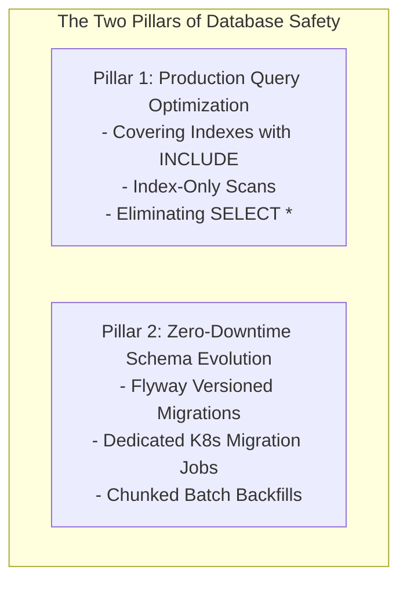
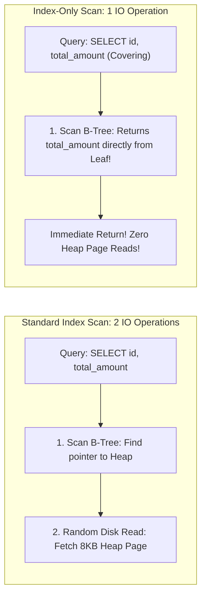
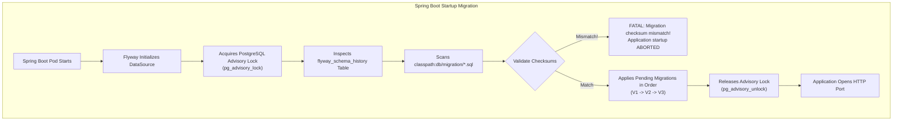

## 1. Mental Model: The Query & Migration Risk

In modern backend engineering, an application's scalability and stability are almost always bounded by its database interaction.

Writing inefficient queries or executing uncoordinated schema migrations leads to severe production outages:
- **Full Table Scans**: Single slow queries exhaust database CPU cores and saturate buffer pools.
- **Migration Concurrency Collisions**: Multiple Kubernetes pods executing simultaneous Flyway migrations, corrupting the migration state.
- **The Giant `UPDATE` Disaster**: Running an un-chunked `UPDATE` statement on a 10-million row table locks rows for minutes, saturates the Write-Ahead Log (WAL), and crashes replication replicas.
- **Silent Schema Drift**: Running Hibernate's `ddl-auto: update` in production, allowing runtime entity changes to modify database constraints unpredictably.



---

## 2. Query Design: The `SELECT *` Anti-Pattern vs Index-Only Scans

Selecting `*` forces PostgreSQL to visit the physical heap pages for every matched row, even if a B-Tree index already located the row pointer (`ctid`).

### Covering Indexes with the `INCLUDE` Clause
In PostgreSQL 11+, you can create **Covering Indexes** that store auxiliary payload columns directly in the B-Tree leaf nodes without adding them to the search key:

```sql
-- Search key is (user_id, status); total_amount and created_at are carried as payload!
CREATE INDEX idx_orders_user_status_covering 
ON orders (user_id, status) 
INCLUDE (total_amount, created_at);
```

When an API executes:
```sql
SELECT id, total_amount, created_at 
FROM orders 
WHERE user_id = 42 AND status = 'PAID';
```

PostgreSQL executes an **Index-Only Scan**: the entire query is satisfied directly from the B-Tree leaf nodes without reading a single byte from the underlying table heap pages!



---

## 3. Flyway Migration Engine Architecture

**Flyway** provides deterministic, version-controlled database schema evolution. It guarantees that every development machine, CI runner, staging cluster, and production database transitions through the exact same sequence of SQL states:



---

### Migration Naming Conventions & Rules
Flyway enforces a strict naming contract on `src/main/resources/db/migration/`:
- **Versioned Migrations (`V`)**: Run exactly once in version order (e.g., `V1__init_schema.sql`, `V2.1__add_order_discount.sql`). Once applied, their files are immutable.
- **Repeatable Migrations (`R`)**: Run whenever their checksum changes. Ideal for stored procedures, views, and functions (e.g., `R__create_analytics_view.sql`).
- **Undo Migrations (`U`)**: (Flyway Teams) Reverses changes made by corresponding version.

```sql
-- Querying migration history in PostgreSQL
SELECT installed_rank, version, description, type, script, checksum, installed_on, execution_time, success 
FROM flyway_schema_history;
```

---

## 4. Multi-Pod Kubernetes Deployment: The Dedicated Migration Job

In containerized environments (Kubernetes), deploying a new version spins up 10 pods simultaneously. 

If all 10 pods attempt to run Flyway migrations during Spring Boot startup:
1. All 10 pods contend for PostgreSQL advisory locks (`pg_advisory_lock`).
2. Pod startup latency increases, occasionally triggering Kubernetes readiness probe timeouts (`CrashLoopBackOff`).

### The Production Best Practice: Dedicated Kubernetes Pre-Install Job
Disable Flyway on web pods and run migrations as an isolated **Kubernetes Job** before rolling out web pods:

```yaml
# kubernetes/migration-job.yml
apiVersion: batch/v1
kind: Job
metadata:
  name: flyway-schema-migration-v2-4
  namespace: production
spec:
  template:
    spec:
      containers:
      - name: flyway
        image: flyway/flyway:10-alpine
        command: ["flyway", "migrate"]
        env:
        - name: FLYWAY_URL
          value: "jdbc:postgresql://postgres.internal:5432/app_db"
        - name: FLYWAY_USER
          valueFrom:
            secretKeyRef:
              name: db-credentials
              key: username
        - name: FLYWAY_PASSWORD
          valueFrom:
            secretKeyRef:
              name: db-credentials
              key: password
      restartPolicy: OnFailure
  backoffLimit: 2
```

```yaml
# application.yml on Web Application Pods
spring:
  flyway:
    enabled: false # Web pods verify schema; they NEVER execute DDL!
  jpa:
    hibernate:
      ddl-auto: validate # Fail fast if entity model does not match DB!
```

---

## 5. Non-Blocking Concurrent Indexing in Flyway

Creating an index on a multi-million row table using standard `CREATE INDEX` acquires a **`SHARE` lock**, blocking all incoming `INSERT`, `UPDATE`, and `DELETE` queries for minutes:

### The Solution: `CREATE INDEX CONCURRENTLY`
PostgreSQL allows non-blocking index creation using `CONCURRENTLY`. However, `CREATE INDEX CONCURRENTLY` **cannot execute inside an active transaction block**!

Flyway wraps every migration file in a transaction by default. To make it work, add the Flyway non-transactional directive at the top of the script:

```sql
-- src/main/resources/db/migration/V4__create_orders_created_at_idx.sql
-- flyway:transactional=false

CREATE INDEX CONCURRENTLY IF NOT EXISTS idx_orders_created_at 
ON orders (created_at);
```

### Cleaning Up `INVALID` Indexes
If a concurrent index creation fails (e.g., due to a disk space issue or dead lock cancellation), PostgreSQL leaves behind an **`INVALID` index** that wastes disk and degrades writes:

```sql
-- Identify invalid indexes:
SELECT indexrelid::regclass, indisvalid 
FROM pg_index 
WHERE indisvalid = false;

-- Drop and recreate:
DROP INDEX CONCURRENTLY idx_orders_created_at;
```

---

## 6. Zero-Downtime Data Migration: Chunked Cursor Backfills

Suppose you add a new column `status_code VARCHAR(32)` to an `orders` table containing 20 million rows, and you need to populate it based on legacy data:

```sql
-- CATASTROPHIC ANTI-PATTERN: DO NOT RUN THIS IN PRODUCTION!
UPDATE orders SET status_code = 'COMPLETED' WHERE legacy_status = 1;
```

### Why a Single Massive `UPDATE` Crashes Production:
1. **Row Lock Exclusivity**: It locks millions of rows, causing incoming checkout requests to freeze.
2. **Write-Ahead Log (WAL) Flood**: Generates gigabytes of WAL records in seconds, saturating disk write IOPS and spiking read replica replication lag.
3. **Out-of-Memory / Rollback Risks**: If the connection drops at row 9,999,999, the entire 2-hour operation rolls back!

---

### The Production Pattern: Chunked Keyset Cursor Backfills

Run the update in discrete, bounded batches (e.g., 1,000 rows at a time) ordered by primary key, sleeping briefly between batches:

```java
package com.backend.mastery.database.migration;

import org.slf4j.Logger;
import org.slf4j.LoggerFactory;
import org.springframework.jdbc.core.JdbcTemplate;
import org.springframework.stereotype.Service;

@Service
public class OrderDataBackfillService {

    private static final Logger log = LoggerFactory.getLogger(OrderDataBackfillService.class);
    private final JdbcTemplate jdbcTemplate;

    private static final int BATCH_SIZE = 1000;
    private static final long PAUSE_MS = 50; // Allows DB autovacuum and replication to catch up

    public OrderDataBackfillService(JdbcTemplate jdbcTemplate) {
        this.jdbcTemplate = jdbcTemplate;
    }

    public void backfillOrderStatusCodes() {
        long lastProcessedId = 0L;
        int totalUpdated = 0;

        while (true) {
            // 1. Keyset seek: Find the next batch of 1,000 IDs to update
            String updateSql = """
                WITH target_batch AS (
                    SELECT id FROM orders 
                    WHERE id > ? AND status_code IS NULL 
                    ORDER BY id ASC 
                    LIMIT ?
                )
                UPDATE orders o
                SET status_code = 'COMPLETED'
                FROM target_batch t
                WHERE o.id = t.id
                RETURNING o.id;
                """;

            var updatedIds = jdbcTemplate.query(
                updateSql,
                (rs, rowNum) -> rs.getLong("id"),
                lastProcessedId,
                BATCH_SIZE
            );

            if (updatedIds.isEmpty()) {
                log.info("Backfill completed! Total rows updated: {}", totalUpdated);
                break;
            }

            lastProcessedId = updatedIds.get(updatedIds.size() - 1);
            totalUpdated += updatedIds.size();
            log.info("Updated batch of {} orders (lastId: {}). Total: {}", 
                    updatedIds.size(), lastProcessedId, totalUpdated);

            try {
                // 2. Pause to allow replication lag and WAL flushing
                Thread.sleep(PAUSE_MS);
            } catch (InterruptedException e) {
                Thread.currentThread().interrupt();
                throw new RuntimeException("Backfill interrupted", e);
            }
        }
    }
}
```

---

## 7. Failure Modes & Edge Case Matrix

| Failure Mode | Root Cause | Impact | Production Defense |
| :--- | :--- | :--- | :--- |
| **`flyway_schema_history` Checksum Mismatch** | Modifying an already-applied migration file | Application fails to boot | Never edit applied files; create a new versioned migration (`V+1`). |
| **Migration Lock Timeout** | Multiple web pods boot simultaneously fighting for lock | Readiness probes fail; pods CrashLoop | Run migrations via dedicated **Kubernetes Pre-Install Job**. |
| **Concurrent Index Deadlock** | `CREATE INDEX CONCURRENTLY` without non-transactional directive | Flyway fails with `cannot run inside transaction block` | Add `-- flyway:transactional=false` to script header. |
| **Replication Lag Blackout** | Single giant `UPDATE` query on 10M rows | Replicas fall behind by 30 mins; reads serve stale data | Execute data migrations using **Chunked Cursor Backfills**. |
| **Accidental Production Drop** | Hibernate `ddl-auto: create-drop` or `update` enabled | Data corrupted or tables dropped on restart | Set `spring.jpa.hibernate.ddl-auto: validate` in production. |

---

## 8. Senior Interview Questions & Active Recall

<AccordionGroup>
  <Accordion title="1. Why is Hibernate's ddl-auto: update strictly forbidden in production environments?">
    `ddl-auto: update` performs heuristic schema comparisons at application startup. It can silently alter column types, drop constraints, create missing tables without optimal indexes, and fails to handle complex data migrations (like splitting a column or renaming without data loss). Furthermore, if multiple application instances boot concurrently, they can execute conflicting DDL alterations, corrupting database catalog metadata. Production schema evolution must be version-controlled and deterministic using Flyway or Liquibase.
  </Accordion>

  <Accordion title="2. How does CREATE INDEX CONCURRENTLY work, and why must it run outside a transaction?">
    Standard `CREATE INDEX` acquires an exclusive `SHARE` lock, blocking all concurrent writes for the entire duration of the build. `CREATE INDEX CONCURRENTLY` creates the index without blocking writes by performing **two separate table scans**: (1) scanning existing rows to build the index structure, and (2) waiting for all concurrent transactions to complete and scanning again to catch updates made during phase 1. Because it coordinates across independent transaction states, PostgreSQL forbids running it inside an active transaction block.
  </Accordion>

  <Accordion title="3. Why must large data backfills be executed in small chunked batches rather than a single UPDATE statement?">
    A single `UPDATE` on millions of rows locks all matched rows until the transaction commits, starving concurrent web requests. It floods the Write-Ahead Log (WAL), saturating disk bandwidth and causing extreme replication lag on read replicas. Additionally, if the connection drops before completion, the entire multi-hour operation rolls back. Chunking by primary key (e.g., 1,000 rows per batch) with small pauses keeps transactions short, allows autovacuum to clean dead tuples, and keeps replication lag near zero.
  </Accordion>
</AccordionGroup>

---

## 9. Done Checklist

<Check>
- [ ] Create Covering Indexes with `INCLUDE` clauses to eliminate physical table reads.
- [ ] Understand the Flyway migration lifecycle and inspect `flyway_schema_history`.
- [ ] Separate schema migrations from web pod startup using dedicated Kubernetes Jobs.
- [ ] Enforce `spring.jpa.hibernate.ddl-auto: validate` in all production profiles.
- [ ] Execute non-blocking index creation using `-- flyway:transactional=false` and `CREATE INDEX CONCURRENTLY`.
- [ ] Implement Chunked Keyset Cursor Backfills in Spring Boot for multi-million row table updates.
</Check>
