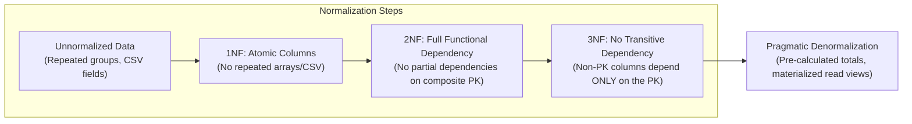
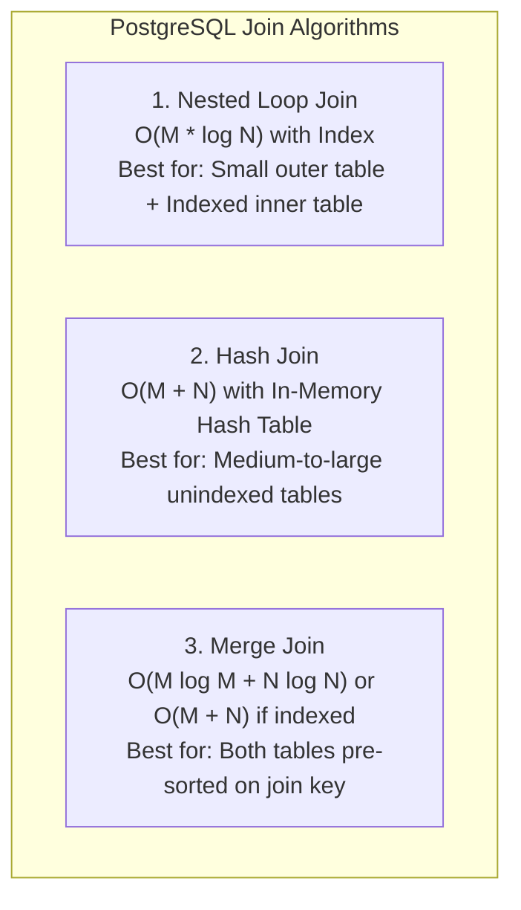
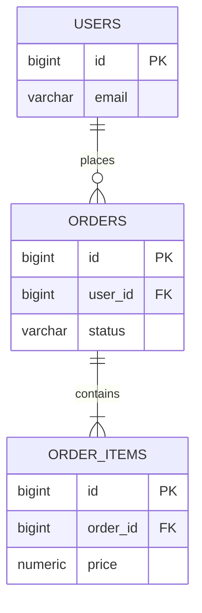
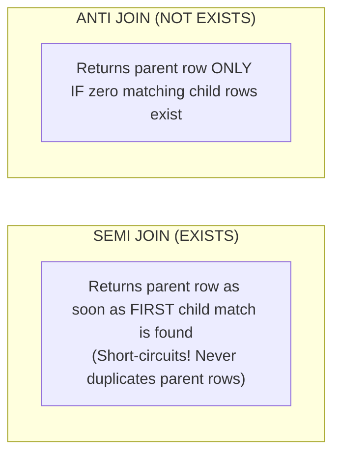
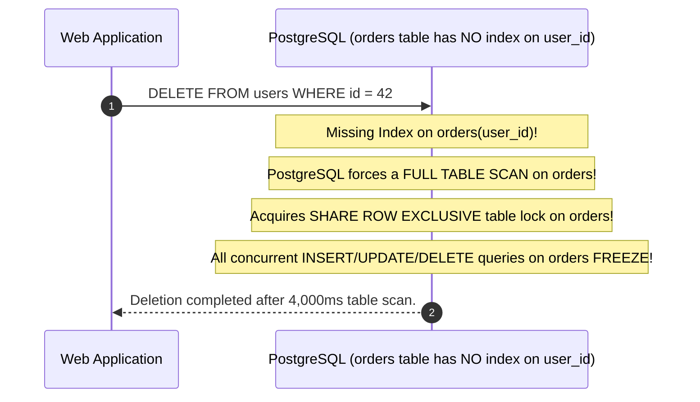
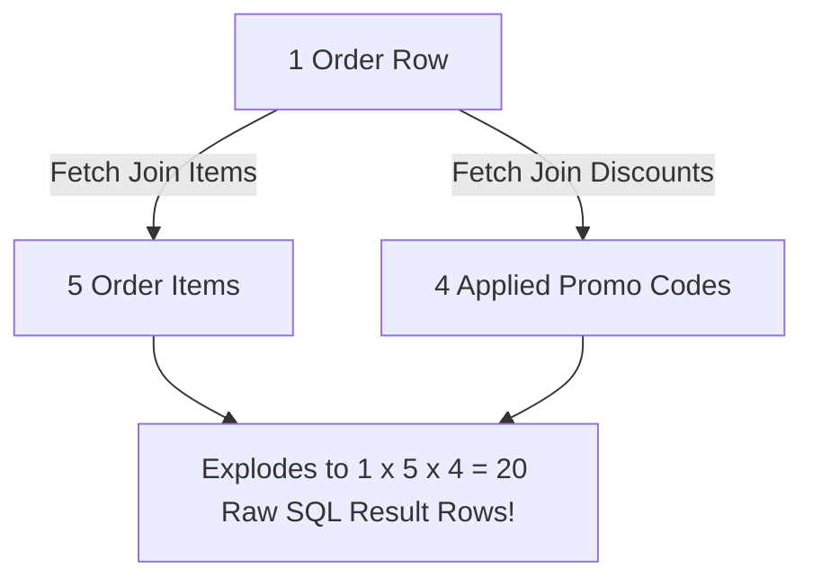

# Relational Modeling, Physical Join Internals & Referential Integrity

In relational databases, real-world data is inherently connected: users own orders, orders contain line items, items reference catalog products, and products link to inventory warehouses.

A superficial understanding of SQL joins (treating them as simple Venn diagrams) leads to catastrophic backend failures:
- Multi-million row table scans caused by optimizer fallback to unindexed Nested Loop joins.
- Disk spills and out-of-memory crashes when Hash Joins exhaust PostgreSQL `work_mem`.
- Database lock freezes during parent table deletions because foreign key columns lack indexes.
- Data leaks across users due to missing ownership scopes.

This guide provides an exhaustive, production-grade manual for relational data modeling, query optimizer join mechanics, referential integrity constraints, and multi-tenant row security in modern PostgreSQL.

---

## Relational Theory: Normalization vs Pragmatic Denormalization



### The Three Normal Forms (3NF)

1. **First Normal Form (1NF)**: Each column contains atomic (indivisible) values. Never store comma-separated IDs (`"1,4,9"`) in a `VARCHAR` column. Use an explicit join table.
2. **Second Normal Form (2NF)**: The table is in 1NF, and every non-key column depends on the **entire** primary key. (Relevant for composite primary keys like `(order_id, item_id)`).
3. **Third Normal Form (3NF)**: The table is in 2NF, and no non-key column depends on another non-key column (no transitive dependencies).
   - *Violation*: Storing `customer_id`, `customer_email`, and `customer_city` inside the `orders` table. If the customer changes their email, you must update 10,000 order rows.
   - *Fix*: Move customer details to a `customers` table and store only `customer_id` in `orders`.

### When to Denormalize in High-Scale Systems
In write-heavy OLTP databases, 3NF prevents update anomalies. However, in high-throughput read systems, joining 8 tables on every API call degrades latency. Pragmatic denormalization is justified when:
- **Snapshotted Historical State**: An invoice line item **must** duplicate the product name and price at the exact moment of purchase. If the product price changes next year, past invoices must not mutate!
- **Pre-Aggregated Counters**: Keeping `likes_count` on a post table updated via database triggers or background queues avoids running `COUNT(*)` over 10 million rows on every feed view.

---

## Physical Join Algorithms: Under the PostgreSQL Engine Hood

When you execute a `JOIN` in SQL, the database query optimizer selects one of three physical algorithms based on table statistics (`pg_statistic`), available indexes, and `work_mem`:



### 1. Nested Loop Join
The database iterates through the outer table row by row, and for each row, searches the inner table.
- **Index Nested Loop**: If the inner table has a B-Tree index on the join column, lookup is instantaneous ($O(M \times \log N)$).
- **Unindexed Disaster**: If no index exists, PostgreSQL performs a full sequential scan of the inner table for **every single row** of the outer table ($O(M \times N)$). A query joining 10,000 users with 100,000 unindexed notes will scan **1 billion rows**, pegging CPU at 100%!

### 2. Hash Join
PostgreSQL scans the smaller table (Build relation), constructs an in-memory hash table on the join key, and then scans the larger table (Probe relation), looking up matches in the hash table in $O(1)$ time.
- **Memory Limit Hazard (`work_mem`)**: If the hash table exceeds `work_mem` (default 4MB in PostgreSQL), PostgreSQL must partition the hash table into batches and spill intermediate buckets to physical disk.
- **Diagnostics**: `EXPLAIN (ANALYZE, BUFFERS)` reveals:
  `Hash Batch: 1  Memory Usage: 450kB` (Clean, in-memory) vs `Batches: 8  Disk Usage: 3240kB` (Spilled to disk, slow I/O).

### 3. Merge Join
Both tables are sorted by the join key (either via an explicit sort node or by reading directly from a pre-sorted B-Tree index). PostgreSQL then advances pointers through both streams simultaneously like a zipper in $O(M + N)$ linear time.

---

## Join Topologies: Advanced Semantics



### 1. INNER JOIN vs LEFT OUTER JOIN
- **INNER JOIN**: Returns only rows where the join predicate evaluates to `TRUE` on both sides. Users with zero orders are excluded.
- **LEFT OUTER JOIN**: Returns all rows from the left table. If no match exists on the right table, columns are padded with `NULL`.

```sql
-- Count orders per user including users with ZERO orders
SELECT u.id, u.email, COUNT(o.id) AS total_orders
FROM users u
LEFT JOIN orders o ON o.user_id = u.id
GROUP BY u.id, u.email;
```

<Warning>
**The COUNT(*) vs COUNT(column) Trap**:
In a `LEFT JOIN`, `COUNT(*)` counts the returned row itself, meaning a user with **zero** orders will return a count of **1** (because the `NULL`-padded row exists). Always count the foreign key: `COUNT(o.id)`, which correctly evaluates to **0** when `NULL`.
</Warning>

---

### 2. SEMI JOIN (`EXISTS`) vs ANTI JOIN (`NOT EXISTS`)



#### Why `EXISTS` is Faster than `DISTINCT JOIN`
When checking if a user has placed at least one order:
```sql
-- SLOW & WASTEFUL: Joins all 50 orders, sorts, and deduplicates
SELECT DISTINCT u.id, u.email
FROM users u
JOIN orders o ON o.user_id = u.id;

-- OPTIMAL SEMI-JOIN: Optimizer stops scanning inner table on first match
SELECT u.id, u.email
FROM users u
WHERE EXISTS (
    SELECT 1 FROM orders o WHERE o.user_id = u.id
);
```

#### The Deadly `NOT IN (NULL)` Anti-Join Trap
```sql
-- DANGEROUS ANTI-JOIN:
SELECT * FROM users 
WHERE id NOT IN (SELECT user_id FROM orders);
```
Under ANSI SQL three-valued logic (`TRUE`, `FALSE`, `UNKNOWN`), if even a **single row** in `orders.user_id` is `NULL`, the expression `id != NULL` evaluates to `UNKNOWN`. As a result, **the entire query returns 0 rows**, even if there are millions of users without orders!

**Always use `NOT EXISTS` instead**:
```sql
-- PRODUCTION-SAFE ANTI-JOIN:
SELECT u.* 
FROM users u
WHERE NOT EXISTS (
    SELECT 1 FROM orders o WHERE o.user_id = u.id
);
```

---

## Referential Integrity & The Foreign Key Locking Hazard

### Foreign Key Constraints and Delete Actions
When defining a foreign key, always specify the referential action:

```sql
CREATE TABLE orders (
    id BIGSERIAL PRIMARY KEY,
    user_id BIGINT NOT NULL REFERENCES users(id) ON DELETE RESTRICT,
    created_at TIMESTAMP WITH TIME ZONE DEFAULT CURRENT_TIMESTAMP
);

CREATE TABLE order_items (
    id BIGSERIAL PRIMARY KEY,
    order_id BIGINT NOT NULL REFERENCES orders(id) ON DELETE CASCADE,
    product_id BIGINT NOT NULL,
    quantity INT NOT NULL CHECK (quantity > 0)
);
```

- **`ON DELETE RESTRICT` / `NO ACTION`**: Prevents deletion of the user if active orders exist (Standard for audit/financial data).
- **`ON DELETE CASCADE`**: Deletes all child `order_items` automatically when the parent `order` is deleted.
- **`ON DELETE SET NULL`**: Keeps the child records but nullifies the reference (Child column must allow `NULL`).

### The Missing FK Index Lock Contention Hazard
When you delete a parent row (`DELETE FROM users WHERE id = 42;`), PostgreSQL must inspect the child `orders` table to verify that no rows reference `user_id = 42`.



<Tip>
**Golden Rule of Relational Databases**:
**Always add an explicit B-Tree index on foreign key columns** in child tables. Without an index, parent updates and deletes will acquire table-level locks or execute full sequential scans.
```sql
CREATE INDEX idx_orders_user_id ON orders(user_id);
CREATE INDEX idx_order_items_order_id ON order_items(order_id);
```
</Tip>

---

## Join Multiplication & Cartesian Explosions in ORMs

In Spring Data JPA / Hibernate, fetching multiple one-to-many collections in a single query triggers a **Cartesian Product Explosion**:



```java
// ANTI-PATTERN: Triggers MultipleBagFetchException in Hibernate
@Query("SELECT o FROM Order o JOIN FETCH o.items JOIN FETCH o.discounts WHERE o.id = :id")
Optional<Order> findOrderWithEverything(@Param("id") Long id);
```
Hibernate will either reject this query at startup (`MultipleBagFetchException`) or duplicate entity instances across memory, corrupting calculations.

### The Production Resolution: Split Fetching
Fetch the primary entity and its largest collection in the initial query, and let Hibernate batch-fetch the second collection using `@BatchSize`:

```java
@Entity
public class Order {
    @Id
    private Long id;

    @OneToMany(mappedBy = "order", cascade = CascadeType.ALL)
    private List<OrderItem> items = new ArrayList<>();

    @BatchSize(size = 50) // Eliminates N+1 without Cartesian explosion!
    @OneToMany(mappedBy = "order")
    private List<OrderDiscount> discounts = new ArrayList<>();
}
```

---

## Multi-Tenant Isolation: Row-Level Security (RLS)

In multi-tenant SaaS backends, failing to scope every query by `tenant_id` or `user_id` allows users to view other tenants' private data:

```sql
-- ANTI-PATTERN: Vulnerable to horizontal privilege escalation
SELECT * FROM notes WHERE id = :noteId;

-- PRODUCTION PATTERN: Enforce ownership in the WHERE clause
SELECT * FROM notes WHERE id = :noteId AND user_id = :currentUserId;
```

### PostgreSQL Native Row-Level Security (RLS)
To guarantee that developers can never accidentally omit the tenant filter, enforce multi-tenancy at the database kernel level:

```sql
-- 1. Enable RLS on the table
ALTER TABLE notes ENABLE ROW LEVEL SECURITY;

-- 2. Define security policy based on session variable
CREATE POLICY note_isolation_policy ON notes
    USING (user_id = NULLIF(current_setting('app.current_user_id', true), '')::bigint);
```

Before executing queries, the Spring Boot connection pool sets the current user context:
```sql
SET LOCAL app.current_user_id = '42';
SELECT * FROM notes; -- Automatically filtered to user 42 only!
```

---

## Common Database Modeling Anti-Patterns

<Warning>
### 1. Storing Delimited Lists in Columns (CSV in DB)
Storing tags or user permissions as `"ADMIN,USER,EDITOR"` in a single text column prevents indexing, breaks foreign key integrity, makes deletion of single elements complex, and destroys join performance.
</Warning>

<Warning>
### 2. Missing Composite Unique Constraints on Join Tables
In a many-to-many join table (`student_courses`), failing to define a composite primary key allows duplicate enrollments:
```sql
-- WRONG:
CREATE TABLE student_courses (student_id BIGINT, course_id BIGINT);

-- CORRECT:
CREATE TABLE student_courses (
    student_id BIGINT NOT NULL REFERENCES students(id),
    course_id BIGINT NOT NULL REFERENCES courses(id),
    PRIMARY KEY (student_id, course_id)
);
```
</Warning>

<Warning>
### 3. Circular Foreign Key Dependencies
Creating Table A with a foreign key to Table B, while Table B has a foreign key to Table A, creates an un-insertable deadlock unless constraints are declared as `DEFERRABLE INITIALLY DEFERRED`.
</Warning>

---

## Active Recall & Interview Mastery

<AccordionGroup>
  <Accordion title="1. Explain the three physical join algorithms used by PostgreSQL and when each is selected.">
    1. **Nested Loop Join**: Loops over the outer relation and executes lookups on the inner relation. Chosen when the outer relation is small and the inner relation has a B-Tree index on the join column.
    2. **Hash Join**: Builds an in-memory hash table on the join column of the smaller relation, then streams the larger relation through it in $O(1)$ lookup time. Chosen for medium-to-large unindexed relations when sufficient `work_mem` is available.
    3. **Merge Join**: Simultaneously scans both inputs in order (like a zipper). Chosen when both relations are large and already sorted by the join key (via an index scan or sort operation).
  </Accordion>

  <Accordion title="2. Why is SELECT ... WHERE id NOT IN (SELECT user_id FROM orders) dangerous when NULLs are present?">
    ANSI SQL adheres to three-valued logic (`TRUE`, `FALSE`, `UNKNOWN`). The `NOT IN` predicate expands to `id != val1 AND id != val2 AND id != NULL`. Because any comparison with `NULL` yields `UNKNOWN`, the entire logical `AND` chain evaluates to `UNKNOWN` (falsy). Consequently, if even a single row in the subquery contains a `NULL`, the query silently returns zero rows. Engineers should always use `NOT EXISTS` instead.
  </Accordion>

  <Accordion title="3. Why must foreign key columns in child tables always have an index?">
    When a row in the parent table is updated or deleted, PostgreSQL must verify referential integrity by checking if matching child records exist. Without an index on the child table's foreign key column, the engine must perform a full sequential scan on the child table and acquire an exclusive table-level lock, stalling all concurrent writes on that child table.
  </Accordion>

  <Accordion title="4. What is the difference between an INNER JOIN and a SEMI JOIN (EXISTS)?">
    An `INNER JOIN` matches and concatenates columns from both tables, returning multiple multiplied rows if a parent matches multiple child records. A `SEMI JOIN` (`EXISTS`) verifies only whether at least one matching child record exists, short-circuiting on the first match. It returns each parent row at most once without needing a wasteful `DISTINCT` deduplication pass.
  </Accordion>

  <Accordion title="5. How does Cartesian Explosion occur in ORM queries, and how do you prevent it?">
    A Cartesian explosion occurs when a query fetches multiple independent one-to-many collections (e.g., `Order` with `items` and `discounts`) using multiple `JOIN FETCH` statements. The database returns the Cartesian product ($N \times M$ rows), transferring duplicate data over the network and bloating memory. It is prevented by fetching only one collection via `JOIN FETCH` and relying on Hibernate `@BatchSize` or separate subselect queries for auxiliary collections.
  </Accordion>
</AccordionGroup>
