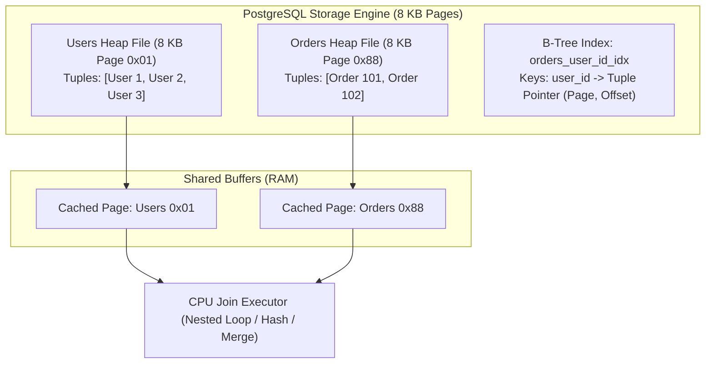
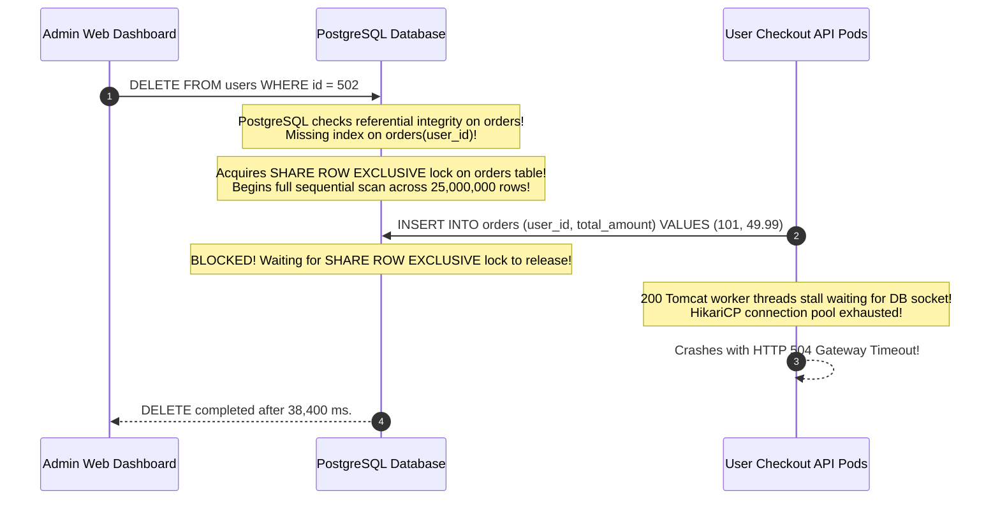
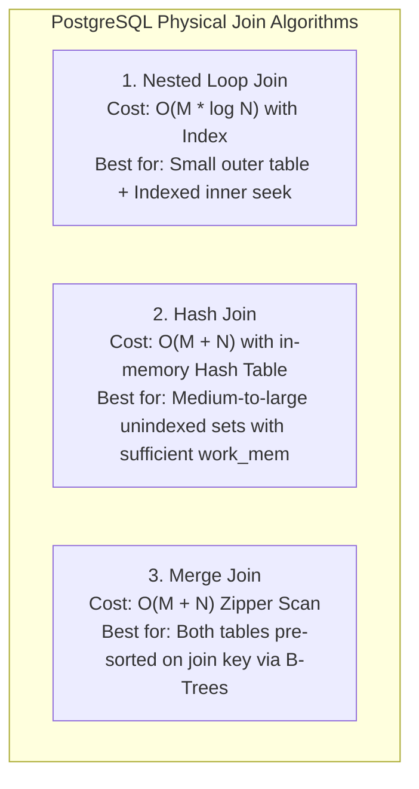
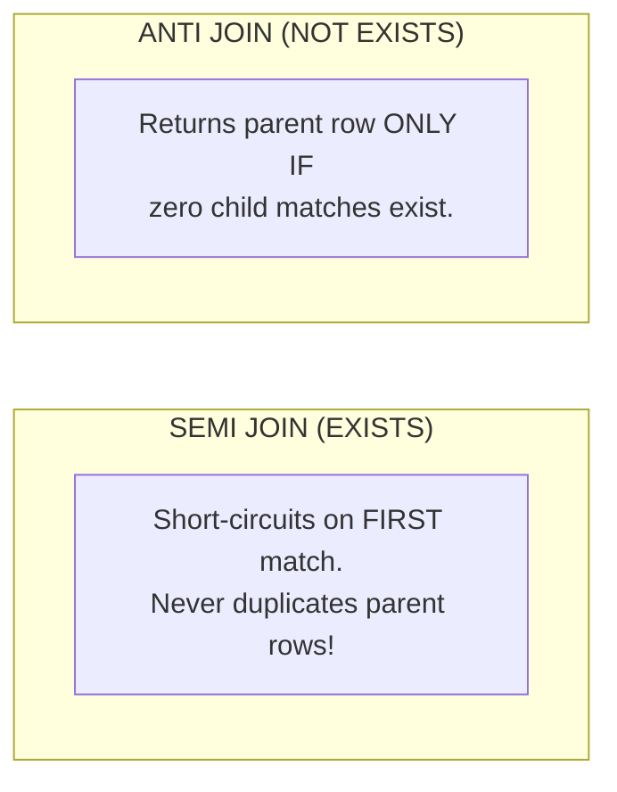

# Relational Modeling, Physical Join Internals & Referential Integrity

In relational databases, data is fundamentally connected: customers own accounts, accounts hold orders, orders contain line items, and line items link to warehouse inventories.

A superficial understanding of SQL joins (treating them as simple overlapping Venn diagrams) leads to devastating production outages:
- Multi-million row table locks freezing all checkouts because a child foreign key column lacked an index.
- Disk spills and out-of-memory crashes when Hash Joins exhaust PostgreSQL `work_mem`.
- Unindexed Nested Loop join fallbacks causing CPU utilization to peg at 100%.
- Silent query failures where dashboard metrics return zero rows due to SQL three-valued logic.

---

## Phase 1: Ground Floor (Physical First Principles & Relational Calculus)

Before writing SQL statements, consider how relational data is physically organized on disk and loaded into CPU caches.



### 1. Tables are Not Venn Diagrams
A relational table is not an abstract set; in PostgreSQL, it is a physical **Heap File** divided into contiguous **8 KB blocks (pages)**.
- Each page holds a page header, an array of line pointers, and raw tuple byte arrays.
- A foreign key is not an invisible link; it is a stored integer column in a child tuple referencing a primary key in a parent tuple.
- **The Physics of a Join**: Joining Table A and Table B requires reading pages from disk or buffer pool RAM, deserializing tuple bytes, and comparing join key values in CPU registers. If the required pages are not cached in RAM, the disk controller must execute mechanical or NVMe block reads ($100\text{ µs}$ to $10\text{ ms}$ per fetch).

### 2. Relational Theory: 3NF Normalization vs Pragmatic Denormalization
Normalization decomposes data to eliminate redundancy and update anomalies:
- **First Normal Form (1NF)**: All column values are atomic. No comma-separated strings or nested arrays stored in text columns.
- **Second Normal Form (2NF)**: Meets 1NF, and every non-key column depends on the *entire* composite primary key (eliminates partial dependencies).
- **Third Normal Form (3NF)**: Meets 2NF, and no non-key column depends on another non-key column (eliminates transitive dependencies like storing `customer_zip` and `customer_city` in `orders`).

#### When to Denormalize in High-Scale Systems
In write-heavy transactional systems (OLTP), 3NF is mandatory to avoid update corruption. However, in high-throughput read systems, joining 8 tables on every HTTP request saturates database CPU. Denormalization is required in two critical scenarios:
1. **Snapshotted Historical State**: An invoice line item **must copy and snapshot** the product price and description at the moment of checkout. If the product price increases tomorrow, past invoices must remain unchanged.
2. **High-Frequency Aggregation Counters**: Maintaining an atomic `comments_count` column on a `posts` table updated via database triggers or Kafka consumers eliminates scanning millions of comment rows during feed generation.

---

## Phase 2: The Naive Code (The Production Crash)

An e-commerce platform experienced two severe production outages within one week:
1. **The Unindexed Foreign Key Lockout**: An administrator deleted an inactive user account. The platform froze globally for 38 seconds, dropping 4,000 checkout transactions and causing connection pool exhaustion across 20 backend pods.
2. **The Cartesian Memory Explosion**: An engineer fetched orders and their associated item and promotion collections via an ORM join fetch, triggering an immediate JVM `OutOfMemoryError`.

### The Naive Schema & Code

```sql
-- NAIVE SCHEMA: Foreign key created WITHOUT a supporting B-Tree index!
CREATE TABLE users (
    id BIGSERIAL PRIMARY KEY,
    email VARCHAR(255) NOT NULL
);

CREATE TABLE orders (
    id BIGSERIAL PRIMARY KEY,
    user_id BIGINT NOT NULL REFERENCES users(id) ON DELETE CASCADE,
    total_amount NUMERIC(12, 2) NOT NULL,
    created_at TIMESTAMPTZ DEFAULT CURRENT_TIMESTAMP
    -- DANGER: No index on user_id!
);
```

```java
// NAIVE ORM QUERY: Multiplying one-to-many collections in a single JPQL query
@Repository
public interface OrderRepository extends JpaRepository<Order, Long> {

    // DISASTER: Cartesian Product Explosion!
    @Query("SELECT o FROM Order o JOIN FETCH o.items JOIN FETCH o.discounts WHERE o.id = :id")
    Optional<Order> findOrderWithDetails(@Param("id") Long id);
}
```

### Why the System Collapsed



1. **The Missing FK Index Lock Contention Hazard**:
   When deleting a user, PostgreSQL must ensure no child `orders` violate referential integrity. Because `orders.user_id` lacked an index, the optimizer could not perform an index seek. It acquired a **`SHARE ROW EXCLUSIVE` lock on the entire `orders` table** and initiated a full sequential scan across 25 million rows. Every concurrent checkout `INSERT` was blocked, exhausting the API thread pools.
2. **The Cartesian Product Memory Explosion**:
   An order with 15 line items and 4 promo codes produced $1 \times 15 \times 4 = 60\text{ SQL result rows}$. When querying a batch of 2,000 orders for an analytics report, the query returned $2,000 \times 60 = 120,000$ hydrated entities, exhausting the JVM heap and triggering a fatal OutOfMemoryError.

---

## Phase 3: Under the Hood (Mechanics, Bytecode & Kernel Interfaces)

When you write `SELECT * FROM a JOIN b ON a.id = b.a_id`, the PostgreSQL Cost-Based Optimizer (CBO) evaluates table statistics (`pg_statistic`) and selects one of **three physical join algorithms**:



---

### 1. Nested Loop Join Internals
The database iterates through the outer relation row by row, and for each row, searches the inner relation.
- **Index Nested Loop (Fast)**: If the inner relation has a B-Tree index on the join key, lookup cost is $O(M \times \log N)$. This is the fastest join for single-record lookups.
- **Unindexed Disaster**: If no index exists, PostgreSQL scans the entire inner table for **every single row** of the outer table ($O(M \times N)$). Joining 10,000 users against 100,000 unindexed orders scans **1 billion rows**, causing 100% CPU lockup.

### 2. Hash Join Internals & The `work_mem` Disk Spill
1. **Build Phase**: The engine scans the smaller table (the *Build relation*) and hashes the join key into an in-memory hash table in RAM.
2. **Probe Phase**: It streams the larger table (the *Probe relation*), hashes each join key, and performs $O(1)$ lookups into the in-memory hash table.

#### The `work_mem` Spill Hazard
If the hash table exceeds the session's allocated `work_mem` (default 4MB), PostgreSQL partitions the data into multiple batches and **spills temporary files to disk** (`pgsql_tmp/`):

```sql
-- EXPLAIN (ANALYZE, BUFFERS) Output:
Hash Join  (cost=420.00..18500.00 rows=50000 width=128)
  Hash Cond: (orders.user_id = users.id)
  -- IN-MEMORY HASH JOIN (Fast):
  -> Hash  (cost=250.00..250.00 rows=10000 width=64)
       Buckets: 16384  Batches: 1  Memory Usage: 850kB
       
  -- DISK SPILL HASH JOIN (Slow I/O Bottleneck):
  -> Hash  (cost=1250.00..1250.00 rows=100000 width=64)
       Buckets: 32768  Batches: 8  Disk Usage: 4200kB
```

When `Batches > 1`, PostgreSQL must execute repeated disk reads and writes, driving query latency from 10ms to over 2,500ms.

---

### 3. Merge Join Internals (The Zipper Algorithm)
Both relations are sorted by the join key. PostgreSQL maintains two pointers and advances through both streams simultaneously like a zipper in $O(M + N)$ linear time.
- If both relations already possess B-Tree indexes on the join columns, the optimizer bypasses sorting entirely, making Merge Join the most CPU-efficient join algorithm for bulk data sets.

---

### 4. Advanced Join Semantics: Semi Join vs Anti Join



#### Why `EXISTS` Beats `DISTINCT JOIN`
When checking whether users have placed at least one order:

```sql
-- ANTI-PATTERN: Slow and wasteful. Joins all 50 orders per user, then sorts to deduplicate!
SELECT DISTINCT u.id, u.email
FROM users u
JOIN orders o ON o.user_id = u.id;

-- OPTIMAL SEMI-JOIN: Execution halts on the first match per user!
SELECT u.id, u.email
FROM users u
WHERE EXISTS (
    SELECT 1 FROM orders o WHERE o.user_id = u.id
);
```

#### The Deadly `NOT IN (NULL)` Anti-Join Trap
```sql
-- DANGEROUS: If even ONE row in orders has user_id = NULL, this returns 0 rows!
SELECT * FROM users 
WHERE id NOT IN (SELECT user_id FROM orders);
```
**Why it fails**: ANSI SQL operates on **Three-Valued Logic (`TRUE`, `FALSE`, `UNKNOWN`)**.
The expression `id NOT IN (1, 2, NULL)` expands to:
`id != 1 AND id != 2 AND id != NULL`.
Because any comparison with `NULL` yields `UNKNOWN`, the logical `AND` chain evaluates to `UNKNOWN` (falsy). The query silently returns **zero rows**.

**Production Defense**: Always use `NOT EXISTS`:
```sql
-- PRODUCTION SAFE ANTI-JOIN:
SELECT u.* 
FROM users u
WHERE NOT EXISTS (
    SELECT 1 FROM orders o WHERE o.user_id = u.id
);
```

---

### 5. Multi-Tenant Security: PostgreSQL Row-Level Security (RLS)

In multi-tenant SaaS systems, relying on developers to manually write `WHERE tenant_id = :id` on every query inevitably leads to data breaches. Enforce isolation at the database kernel level with **Row-Level Security (RLS)**:

```sql
-- 1. Enable RLS on the sensitive table
ALTER TABLE documents ENABLE ROW LEVEL SECURITY;

-- 2. Define a security policy backed by a session variable
CREATE POLICY tenant_isolation_policy ON documents
    AS RESTRICTIVE
    USING (tenant_id = NULLIF(current_setting('app.current_tenant_id', true), '')::bigint);
```

In Spring Boot, configure an interceptor or connection decorator to set the session variable before executing queries:

```java
@Component
public class TenantInterceptor implements HandlerInterceptor {

    private final DataSource dataSource;

    public TenantInterceptor(DataSource dataSource) {
        this.dataSource = dataSource;
    }

    @Override
    public boolean preHandle(HttpServletRequest request, HttpServletResponse response, Object handler) throws Exception {
        String tenantId = request.getHeader("X-Tenant-ID");
        try (Connection conn = dataSource.getConnection();
             PreparedStatement stmt = conn.prepareStatement("SET LOCAL app.current_tenant_id = ?")) {
            stmt.setString(1, tenantId);
            stmt.execute();
        }
        return true;
    }
}
```

Even if a developer executes `SELECT * FROM documents`, PostgreSQL automatically appends the tenant security filter, making cross-tenant data leaks physically impossible.

---

## Phase 4: Senior Interview Ace (Junior vs Staff Phrasing)

When discussing relational modeling and joins in technical interviews, interviewers listen for physical system awareness:

| Architectural Concept | Junior Developer Answer | Senior / Staff Engineer Answer |
| :--- | :--- | :--- |
| **Join Explanation** | Explains SQL joins using Venn diagrams: *"An inner join is the intersection of two circles."* | *"Venn diagrams are misleading because joins multiply rows when keys are not unique. Physically, PostgreSQL selects between an Index Nested Loop for small sets, a Hash Join in `work_mem` for medium sets, or a Merge Join for pre-sorted streams. Joins are row-multiplication operators governed by relational algebra."* |
| **Foreign Key Indexing** | *"We don't need an index on the child table's foreign key unless we run `WHERE child.fk = :val` queries."* | *"Omitting an index on child foreign key columns is a major production hazard. When parent rows are updated or deleted, PostgreSQL must verify referential integrity. Without a child index, the engine acquires a `SHARE ROW EXCLUSIVE` table lock and executes a full sequential scan, stalling all concurrent writes on the child table."* |
| **ORM Multi-Collection Fetching** | *"I use `JOIN FETCH` on all child collections to avoid the N+1 query problem."* | *"Fetching multiple one-to-many collections via `JOIN FETCH` triggers a Cartesian Product Explosion ($M \times N$ rows), corrupting pagination and exhausting JVM heap. We fetch the primary relationship via `JOIN FETCH` and use Hibernate `@BatchSize` or separate subselect queries for secondary collections."* |
| **Anti-Join Queries** | *"I use `WHERE id NOT IN (SELECT foreign_id FROM other_table)` to find records that have no matches."* | *"`NOT IN` with a subquery is dangerous because of ANSI SQL three-valued logic. If the subquery contains even a single `NULL`, the comparison evaluates to `UNKNOWN`, causing the entire query to return zero rows. I always use `WHERE NOT EXISTS` or an anti-join pattern."* |
| **Multi-Tenant SaaS Isolation** | *"We append `WHERE tenant_id = :id` to every query in our Spring Data repository interfaces."* | *"Manual application-level filtering is prone to human error and authorization bypass bugs. We enforce multi-tenancy at the database kernel level using PostgreSQL Row-Level Security (RLS) paired with session variables (`SET LOCAL app.current_tenant_id`), ensuring data isolation is invariant regardless of application queries."* |

---

## Active Recall & Interview Mastery

<AccordionGroup>
  <Accordion title="1. Explain the three physical join algorithms used by PostgreSQL and when each is selected.">
    1. **Nested Loop Join**: Iterates over the outer relation and executes lookups on the inner relation. Chosen when the outer relation is small and the inner relation has a supporting B-Tree index ($O(M \log N)$).
    2. **Hash Join**: Hashes the smaller relation into an in-memory hash table, then probes it using rows from the larger relation ($O(M + N)$). Chosen for unindexed, medium-to-large datasets when `work_mem` is sufficient.
    3. **Merge Join**: Advances pointers through both relations simultaneously like a zipper ($O(M + N)$). Chosen when both relations are large and pre-sorted on the join key (via B-Tree index scans).
  </Accordion>

  <Accordion title="2. Why is SELECT ... WHERE id NOT IN (SELECT user_id FROM orders) dangerous when NULLs are present?">
    ANSI SQL operates on three-valued logic (`TRUE`, `FALSE`, `UNKNOWN`). The `NOT IN` predicate expands to `id != v1 AND id != v2 AND id != NULL`. In SQL, any comparison against `NULL` evaluates to `UNKNOWN`. A logical `AND` chain containing `UNKNOWN` never evaluates to `TRUE`. Consequently, if even a single row in the subquery has `user_id = NULL`, the query silently returns zero rows. Always use `NOT EXISTS` instead.
  </Accordion>

  <Accordion title="3. Why must foreign key columns in child tables always have an explicit B-Tree index?">
    When a row in the parent table is deleted or its primary key updated, PostgreSQL must enforce referential integrity by checking for existing child records. Without an index on the child table's foreign key column, PostgreSQL must execute a full sequential scan of the child table while holding an exclusive table lock, blocking all concurrent `INSERT`, `UPDATE`, and `DELETE` operations on the child table.
  </Accordion>

  <Accordion title="4. What is the difference between an INNER JOIN and a SEMI JOIN (EXISTS)?">
    An `INNER JOIN` evaluates all matching pairs, returning multiplied rows if a parent matches multiple child records. A `SEMI JOIN` (`EXISTS`) verifies only whether at least one matching child record exists, short-circuiting on the first match. It returns each parent row at most once without requiring a wasteful `DISTINCT` deduplication sort pass.
  </Accordion>

  <Accordion title="5. How does Cartesian Explosion occur in ORM queries, and how do you prevent it?">
    A Cartesian explosion occurs when a query fetches multiple independent one-to-many collections (e.g., `Order` with `items` and `discounts`) using multiple `JOIN FETCH` statements. The database produces the Cartesian product ($N \times M$ rows), transferring duplicate entity data across the network and bloating JVM heap memory. It is prevented by fetching only one collection via `JOIN FETCH` and leveraging Hibernate `@BatchSize` or separate subselect queries for auxiliary collections.
  </Accordion>
</AccordionGroup>
