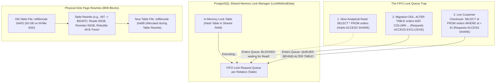
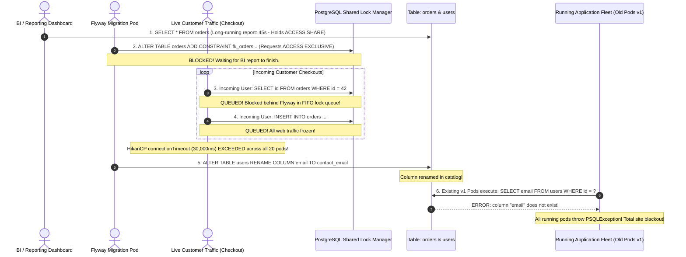
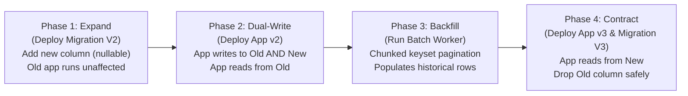
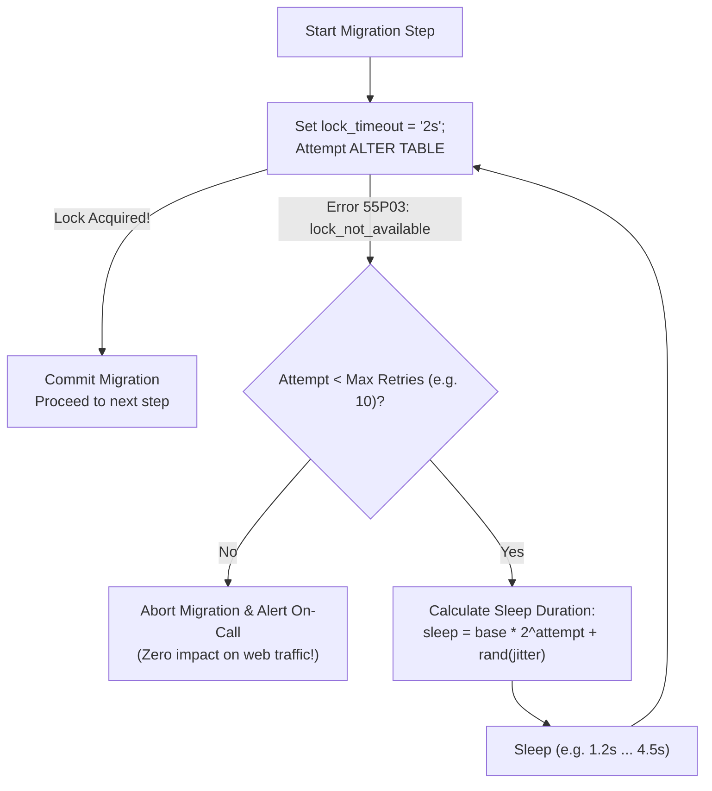
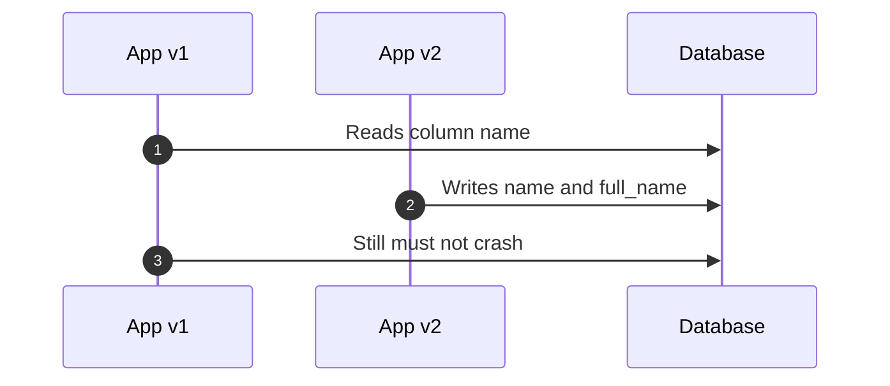

# Zero-Downtime Schema Migrations & PostgreSQL Lock Mastery

In cloud environments with automated continuous deployment, application code rollbacks take seconds (`kubectl rollout undo`).

Database schema rollbacks, however, are **fundamentally destructive**. If a migration renames a column, alters a data type, or rewrites a 50-million-row table, rolling back the application code will crash because the physical 8KB disk pages and database catalog structures have already been permanently altered.

Achieving true zero-downtime schema evolution requires mastering **PostgreSQL lock hierarchies, shared memory lock queues, the 4-phase Expand and Contract pattern, safe DDL execution, and non-blocking concurrent indexing**.

---

## 1. Phase 1: Ground Floor (Physical First Principles)

To alter database tables in production without dropping web requests, you must understand how PostgreSQL physically handles locks and physical disk pages during DDL statements.



### The PostgreSQL Shared Memory Lock Manager
PostgreSQL coordinates all concurrent table access using an in-memory lock table located in shared memory (`LockMethodData`):
1. **Lock Modes & Conflicts**: Every SQL statement requests a lock on the target table:
   - `SELECT` acquires `ACCESS SHARE`.
   - `INSERT`, `UPDATE`, `DELETE` acquire `ROW EXCLUSIVE`.
   - `ALTER TABLE`, `DROP TABLE`, `TRUNCATE` acquire `ACCESS EXCLUSIVE`.
   - An `ACCESS EXCLUSIVE` lock conflicts with **every other lock mode**, including lightweight reads.
2. **The FIFO Lock Queue Rule**: When a transaction requests a lock that cannot be granted immediately, it is placed into a **strict First-In, First-Out (FIFO) queue**.
3. **The Lock Queue Trap**: Once an `ACCESS EXCLUSIVE` request enters the queue, **no new lock request of any kind can pass it**—even lightweight `SELECT` queries that would otherwise be compatible with the currently executing query! All incoming customer web traffic queues up behind the migration, freezing the application.

### Physical Disk Page Rewrites vs. Metadata-Only Updates
When executing DDL, PostgreSQL operates in one of two modes:
- **$O(1)$ Metadata-Only Update**: Modifies only the database catalog tables (`pg_class`, `pg_attribute`). No table heap pages are touched. The operation executes in sub-millisecond time (e.g., adding a nullable column, or adding a column with a non-volatile `DEFAULT` in PostgreSQL 11+).
- **$O(N)$ Physical Table Rewrite**: Allocates a brand-new physical file on disk (a new `relfilenode`), reads every single 8KB page from the old file, rewrites every tuple into the new file, and rebuilds every single B-Tree index on the table from scratch (e.g., changing a column type from `INT` to `BIGINT`). On a 50GB table, this rewrites 50GB of disk data and holds an `ACCESS EXCLUSIVE` lock for 15 minutes!

---

## 2. Phase 2: The Naive Code (The Production Crash)

Let us examine the common beginner migration script that brings down production databases during peak daytime traffic.

### The Naive Migration Script & Entity Code

```sql
-- src/main/resources/db/migration/V3__rename_and_default.sql
-- NAIVE MIGRATION SCRIPT - CRITICAL PRODUCTION HAZARD
-- 1. Breaking column rename: Old pods instantly crash!
ALTER TABLE users RENAME COLUMN email TO contact_email;

-- 2. Non-timed DDL adding a foreign key: Scans entire 20M-row table!
ALTER TABLE orders 
ADD CONSTRAINT fk_orders_customer_id 
FOREIGN KEY (customer_id) REFERENCES customers(id);
```

```java
// Naive Spring Boot Entity updated simultaneously with migration
@Entity
@Table(name = "users")
public class User {
    @Id
    private Long id;

    // Developer renamed 'email' to 'contactEmail'
    @Column(name = "contact_email", nullable = false)
    private String contactEmail;
}
```

### The Production Catastrophe Sequence



#### Why Production Collapsed:
1. **The Lock Queue Pile-Up**: The migration requested an `ACCESS EXCLUSIVE` lock to add the foreign key while an analytical query was reading the table. Because PostgreSQL uses a FIFO queue, all incoming checkout requests queued behind the migration. Within 30 seconds, HikariCP connection pools exhausted across all 20 web pods.
2. **The Breaking Schema Collision**: The migration renamed `email` to `contact_email`. During a rolling deployment, older v1 pods run alongside newer v2 pods for 10-15 minutes. The moment the column was renamed, all existing v1 pods crashed with `PSQLException: column "email" does not exist`.
3. **Un-Rollbackable State**: Rolling back the application code could not restore service because the database schema was already permanently mutated.

---

## 3. Phase 3: Under the Hood (Mechanics & Zero-Downtime Playbooks)

To guarantee zero downtime, senior database engineers follow five battle-tested architectural practices:
1. **Explicit Lock and Statement Timeouts**.
2. **The 4-Phase Expand and Contract Pattern**.
3. **Safe Two-Step Foreign Key & `NOT NULL` Constraints**.
4. **Non-Blocking Concurrent Indexing (`CREATE INDEX CONCURRENTLY`)**.
5. **Detection and Cleanup of Failed `INVALID` Indexes**.

---

### Practice 1: Explicit Lock Timeouts (The Circuit Breaker for DDL)

Never execute production DDL without explicit `lock_timeout` and `statement_timeout` configurations. 

If an `ALTER TABLE` cannot acquire its lock within 2 seconds because a long-running query is active, PostgreSQL aborts the migration immediately rather than queueing up live customer traffic:

```sql
-- PRODUCTION DDL SAFETY WRAPPER
SET lock_timeout = '2s';       -- Abort if lock cannot be acquired within 2 seconds
SET statement_timeout = '5s';  -- Abort if total execution exceeds 5 seconds

-- If a slow query holds an ACCESS SHARE lock, this statement aborts fast
-- without blocking incoming web traffic!
ALTER TABLE orders ADD COLUMN fulfillment_center_id INT;
```

Line by line:

- `SET lock_timeout = '2s'` means PostgreSQL will give up if it cannot acquire the needed table lock quickly. This prevents the migration from sitting in the FIFO lock queue and blocking live traffic behind it.
- `SET statement_timeout = '5s'` limits total execution time after the statement starts. It is a second circuit breaker for unexpectedly slow DDL.
- `ALTER TABLE orders ADD COLUMN fulfillment_center_id INT` is safe only if it can complete as a metadata change quickly. The timeout settings make the safety assumption enforceable.

Failure behavior:

```console
If a BI query is holding ACCESS SHARE for 45 seconds,
the migration tries to acquire its lock,
PostgreSQL waits 2 seconds,
then aborts the migration instead of freezing checkout traffic.
```

Proof task:

```console
Session A: BEGIN; SELECT * FROM orders; keep the transaction open.
Session B: SET lock_timeout='2s'; ALTER TABLE orders ADD COLUMN test_col INT;
Expected: Session B fails fast with lock timeout.
Session C: SELECT id FROM orders LIMIT 1 should not sit blocked behind the failed DDL.
```

---

### Practice 2: The Expand and Contract Pattern

Never execute breaking schema modifications in a single deployment. Always decompose the change across four backward-compatible phases across separate deployments:



#### Case Study: Renaming `name` to `full_name`

##### Step 1: Expand (Flyway Migration `V2__add_full_name.sql`)
Add the new column as nullable. Running v1 pods continue operating unaffected:

```sql
SET lock_timeout = '2s';
ALTER TABLE users ADD COLUMN full_name VARCHAR(150);
```

##### Step 2: Dual-Write (Application Release v2)
Deploy Spring Boot application v2. The domain entity writes to both fields upon mutation, but continues reading from the legacy column:

```java
@Entity
@Table(name = "users")
public class User {
    @Id
    private Long id;

    @Column(name = "name")
    private String name; // Legacy column (still read by app)

    @Column(name = "full_name")
    private String fullName; // New column (dual-written)

    public void updateName(String newName) {
        this.name = newName;        // Legacy field
        this.fullName = newName;    // New field (dual-write sync)
    }

    public String getName() {
        return this.name;
    }
}
```

##### Step 3: Backfill (Chunked Keyset Pagination Worker)
Populate `full_name` for historical rows created prior to deployment v2. Run in discrete cursor batches with pauses to avoid lock contention and WAL replication lag:

```sql
DO $$
DECLARE
    last_processed_id BIGINT := 0;
    batch_size INT := 2000;
    rows_updated INT := 1;
BEGIN
    WHILE rows_updated > 0 LOOP
        -- Keyset cursor pagination using primary key index
        WITH batch AS (
            SELECT id, name FROM users
            WHERE id > last_processed_id AND full_name IS NULL
            ORDER BY id ASC
            LIMIT batch_size
        )
        UPDATE users u
        SET full_name = b.name
        FROM batch b
        WHERE u.id = b.id;

        GET DIAGNOSTICS rows_updated = ROW_COUNT;

        SELECT COALESCE(MAX(id), last_processed_id) INTO last_processed_id
        FROM (
            SELECT id FROM users
            WHERE id > last_processed_id
            ORDER BY id ASC
            LIMIT batch_size
        ) sub;

        COMMIT;
        PERFORM pg_sleep(0.05); -- 50ms pause gives autovacuum and replication time to catch up
    END LOOP;
END $$;
```

##### Step 4: Contract (Application Release v3 & Migration `V3__drop_legacy_name.sql`)
Deploy application v3 reading exclusively from `full_name`. Monitor error rates for 48 hours. Once verified, permanently drop the legacy column:

```sql
SET lock_timeout = '2s';
ALTER TABLE users DROP COLUMN name;
```

---

### Practice 3: Safe DDL Operations Reference

#### 1. Adding Foreign Keys Safely (Two-Step Technique)
Standard foreign key creation requires a full table scan under a `SHARE ROW EXCLUSIVE` lock, blocking all concurrent updates.

```sql
-- Step 1: Add constraint marked NOT VALID (Instantaneous O(1) catalog lock)
SET lock_timeout = '2s';
ALTER TABLE orders 
ADD CONSTRAINT fk_orders_customer_id 
FOREIGN KEY (customer_id) REFERENCES customers(id) NOT VALID;

-- Step 2: Validate historical rows concurrently (Acquires SHARE UPDATE EXCLUSIVE - writes proceed!)
ALTER TABLE orders VALIDATE CONSTRAINT fk_orders_customer_id;
```

#### 2. Adding `NOT NULL` Constraints Safely (PostgreSQL 12+)
Standard `ALTER COLUMN SET NOT NULL` requires an `ACCESS EXCLUSIVE` table scan.

```sql
-- Step 1: Add check constraint marked NOT VALID (Instantaneous)
SET lock_timeout = '2s';
ALTER TABLE users ADD CONSTRAINT chk_users_email_not_null CHECK (email IS NOT NULL) NOT VALID;

-- Step 2: Validate constraint concurrently (Reads and writes continue!)
ALTER TABLE users VALIDATE CONSTRAINT chk_users_email_not_null;

-- Step 3: Convert validated check constraint to formal NOT NULL (Instantaneous metadata update)
SET lock_timeout = '2s';
ALTER TABLE users ALTER COLUMN email SET NOT NULL;
ALTER TABLE users DROP CONSTRAINT chk_users_email_not_null;
```

---

### Practice 4: Non-Blocking Concurrent Indexing & Failed Index Cleanup

Standard `CREATE INDEX` acquires a `SHARE` lock that **blocks all concurrent writes (`INSERT`, `UPDATE`, `DELETE`)** until the index build completes.

PostgreSQL provides `CREATE INDEX CONCURRENTLY`, which performs two separate table scans without blocking concurrent writes:

```sql
-- src/main/resources/db/migration/V6__add_orders_customer_idx.sql
CREATE INDEX CONCURRENTLY idx_orders_customer_date 
ON orders (customer_id, created_at DESC);
```

```properties
# src/main/resources/db/migration/V6__add_orders_customer_idx.sql.conf
# Sibling configuration file telling Flyway to run outside a transaction block
executeInTransaction=false
```

#### Cleaning Up Failed `INVALID` Indexes:
If a concurrent index creation is cancelled or encounters a duplicate key error, PostgreSQL leaves behind an **`INVALID` index**. 

> [!WARNING]
> An `INVALID` index is **disastrous for write performance**: PostgreSQL continues updating the invalid index on every `INSERT` and `UPDATE`, yet the query planner **never uses it for reads**!

```sql
-- Step 1: Query database catalogs for broken invalid indexes
SELECT 
    c.relname AS index_name,
    t.relname AS table_name,
    i.indisvalid AS is_valid
FROM pg_index i
JOIN pg_class c ON c.oid = i.indexrelid
JOIN pg_class t ON t.oid = i.indrelid
WHERE NOT i.indisvalid;

-- Step 2: Drop the broken invalid index concurrently without blocking writes
DROP INDEX CONCURRENTLY idx_orders_customer_date;
```

---

### Practice 5: Table Rewrites Deep Dive: Volatile vs. Non-Volatile Defaults & Shadow Type Migrations

When altering tables, you must know whether PostgreSQL will complete in milliseconds via catalog modification ($O(1)$) or execute a full table rewrite ($O(N)$) that locks the table and churns disk I/O.

#### The Catalog Magic: `attmissingval` in PostgreSQL 11+
In PostgreSQL 10 and older, running `ALTER TABLE t ADD COLUMN status VARCHAR(20) DEFAULT 'ACTIVE';` required rewriting every single 8KB disk page to physically insert `'ACTIVE'` into existing row tuples.

PostgreSQL 11 eliminated this rewrite for **non-volatile (constant) defaults**:
1. It updates `pg_attribute` in the system catalogs, setting `atthasmissing = true` and storing `'ACTIVE'` in the `attmissingval` column.
2. The physical table heap is completely untouched ($O(1)$ execution).
3. When subsequent queries read older tuples from disk, the PostgreSQL executor sees that the tuple header is missing the column, inspects `pg_attribute.attmissingval`, and substitutes `'ACTIVE'` in memory!

#### The Volatile Default Trap:
A default expression is **volatile** if it returns different values across invocations (e.g., `random()`, `clock_timestamp()`, or `gen_random_uuid()`):

```sql
-- DANGEROUS IN PRODUCTION: FULL TABLE REWRITE UNDER ACCESS EXCLUSIVE!
ALTER TABLE orders ADD COLUMN idempotency_key UUID DEFAULT gen_random_uuid();
```

Because every single existing row requires a unique UUID, PostgreSQL **cannot** use `attmissingval`. It immediately triggers an $O(N)$ physical table rewrite, locking customer traffic out for minutes!

##### The Production Safe Alternative:
```sql
-- Step 1: Add the column as nullable with NO default (Instantaneous O(1) metadata update)
SET lock_timeout = '2s';
ALTER TABLE orders ADD COLUMN idempotency_key UUID;

-- Step 2: Set the default for future inserts (Instantaneous metadata update)
ALTER TABLE orders ALTER COLUMN idempotency_key SET DEFAULT gen_random_uuid();

-- Step 3: Backfill historical rows in small keyset cursor batches
-- (Run via background worker, updating 2,000 rows per transaction with 50ms pauses)
```

---

#### Zero-Downtime Type Migrations: Upgrading `INT` to `BIGINT` Primary Keys
Changing a column data type (e.g. `ALTER TABLE orders ALTER COLUMN id TYPE BIGINT;`) physically rewrites every single tuple and rebuilds all dependent foreign keys and indexes under an `ACCESS EXCLUSIVE` lock. On high-volume tables reaching the 2.14-billion integer ceiling, this causes catastrophic downtime.

##### The 5-Step Shadow Column Technique:
```sql
-- Step 1: Add shadow column
SET lock_timeout = '2s';
ALTER TABLE orders ADD COLUMN id_new BIGINT;

-- Step 2: Create a trigger function to synchronize concurrent inserts and updates
CREATE OR REPLACE FUNCTION sync_orders_id_new()
RETURNS TRIGGER AS $$
BEGIN
    NEW.id_new := NEW.id;
    RETURN NEW;
END;
$$ LANGUAGE plpgsql;

CREATE TRIGGER trg_sync_orders_id_new
BEFORE INSERT OR UPDATE ON orders
FOR EACH ROW EXECUTE FUNCTION sync_orders_id_new();

-- Step 3: Backfill historical rows in throttled keyset chunks
-- UPDATE orders SET id_new = id WHERE id > :cursor AND id <= :cursor + 5000;

-- Step 4: Build primary key index concurrently on the shadow column
CREATE UNIQUE INDEX CONCURRENTLY idx_orders_id_new ON orders (id_new);

-- Step 5: Atomic metadata swap in a lock-timed transaction
BEGIN;
SET LOCAL lock_timeout = '2s';
ALTER TABLE orders ALTER COLUMN id DROP DEFAULT;
-- Swap sequence ownership if applicable
ALTER SEQUENCE orders_id_seq OWNED BY orders.id_new;
ALTER TABLE orders ALTER COLUMN id_new SET DEFAULT nextval('orders_id_seq');
-- Promote shadow column and drop trigger
DROP TRIGGER trg_sync_orders_id_new ON orders;
ALTER TABLE orders DROP CONSTRAINT orders_pkey CASCADE;
ALTER TABLE orders ADD CONSTRAINT orders_pkey PRIMARY KEY USING INDEX idx_orders_id_new;
ALTER TABLE orders DROP COLUMN id;
ALTER TABLE orders RENAME COLUMN id_new TO id;
COMMIT;
```

---

### Practice 6: PostgreSQL `ENUM` Traps vs. Validated Check Constraints

PostgreSQL native `ENUM` types provide compile-time safety inside SQL, but introduce severe operational hazards in zero-downtime continuous deployment environments:

1. **Transaction Block Incompatibility**: Prior to PostgreSQL 12, `ALTER TYPE ... ADD VALUE` could **not** be executed inside a multi-statement transaction (`BEGIN ... COMMIT`).
2. **Same-Transaction Usage Trap**: Even in modern PostgreSQL, a newly added enum value **cannot be referenced in queries within the exact same transaction block** that added it:
   ```sql
   BEGIN;
   ALTER TYPE order_status ADD VALUE 'REFUNDED';
   -- ERROR: unsafe use of new value "REFUNDED" of enum type order_status
   INSERT INTO orders (status) VALUES ('REFUNDED');
   COMMIT;
   ```
3. **Irreversibility**: PostgreSQL does **not** support removing values from an enum (`ALTER TYPE status DROP VALUE` does not exist). Renaming values requires complex catalog hacking.

#### The Staff Production Standard: `VARCHAR` with Validated Check Constraints
Senior database architects prefer `VARCHAR` bounded by validated check constraints over native enums. They offer identical data integrity without the operational lockouts:

```sql
-- Step 1: Add new status value by updating the check constraint with NOT VALID
SET lock_timeout = '2s';
ALTER TABLE orders DROP CONSTRAINT chk_orders_status;
ALTER TABLE orders ADD CONSTRAINT chk_orders_status 
    CHECK (status IN ('PENDING', 'PROCESSING', 'SHIPPED', 'DELIVERED', 'REFUNDED')) 
    NOT VALID;

-- Step 2: Validate concurrently without blocking writes
ALTER TABLE orders VALIDATE CONSTRAINT chk_orders_status;
```

---

### Practice 7: Automated Lock-Timeout Retry Loops with Exponential Backoff & Jitter

Setting `SET lock_timeout = '2s'` guarantees that a migration will not freeze incoming web requests. However, on a high-throughput database, a single 2-second attempt might fail if a transaction happened to touch the table during that window.

If your migration tool fails and crashes the deployment container, engineers are woken up. The production solution is an **automated lock acquisition retry loop with exponential backoff and randomized jitter**.



#### Production Python / Bash Retry Driver Pattern:

```python
import time
import random
import psycopg2

def execute_safe_ddl(conn, ddl_statement, max_retries=10, base_backoff_sec=1.0):
    for attempt in range(1, max_retries + 1):
        try:
            with conn.cursor() as cur:
                # 1. Protect customer traffic: Abort if lock cannot be acquired within 2 seconds
                cur.execute("SET lock_timeout = '2s';")
                cur.execute(ddl_statement)
                conn.commit()
                print(f"Migration succeeded on attempt {attempt}")
                return True
        except psycopg2.errors.LockNotAvailable:
            conn.rollback()
            if attempt == max_retries:
                print(f"FATAL: Could not acquire lock after {max_retries} attempts.")
                raise
            
            # Full jitter exponential backoff: sleep between 0 and base * 2^attempt
            sleep_duration = random.uniform(0.5, base_backoff_sec * (2 ** attempt))
            print(f"Lock contended on attempt {attempt}. Retrying in {sleep_duration:.2f}s...")
            time.sleep(sleep_duration)
```

---

## Schema Migration Fundamentals Interview Map

Schema changes are production deployments. Treat them like code releases with compatibility windows.

### 1. Why `ddl-auto: update` is dangerous

Hibernate `ddl-auto: update` mutates schema at app startup. In production, many pods can start together, race for metadata locks, and apply unexpected changes without review.

Production:

```yaml
spring:
  jpa:
    hibernate:
      ddl-auto: validate
  flyway:
    enabled: false # in web pods when migrations run as a separate job
```

### 2. Backward compatibility during rolling deploys

During a rolling deploy, old and new app versions run at the same time.



A schema change is safe only if both versions can operate during the transition.

### 3. Expand and contract

1. Expand: add new nullable column/table/index.
2. Dual-write: new app writes old and new shapes.
3. Backfill: migrate old data in chunks.
4. Read switch: app reads new shape.
5. Contract: later remove old shape.

### 4. Lock timeout is a safety valve

Every DDL script should fail fast if it cannot acquire locks:

```sql
SET lock_timeout = '2s';
SET statement_timeout = '5s';
```

Failing a migration is better than blocking every web request behind a queued `ACCESS EXCLUSIVE` lock.

### Build-Break-Fix Lab

<Steps>
  <Step title="Build">
    Add `full_name` while old code still reads `name`.
  </Step>
  <Step title="Break">
    Rename the column in one step during a simulated rolling deploy.
  </Step>
  <Step title="Observe">
    Watch either old or new pods fail depending on deployment order.
  </Step>
  <Step title="Fix">
    Use expand/contract, dual-write, chunked backfill, and delayed cleanup.
  </Step>
  <Step title="Prove">
    Run tests with both old and new application versions against the transitional schema.
  </Step>
</Steps>

---

## 4. Phase 4: Senior Interview Ace (Junior vs Staff Phrasing)

When interviewing for Senior or Staff Database Architect roles, interviewers evaluate whether you understand lock hierarchies, transaction isolation, and backward-compatible schema changes.

### Junior Answer vs. Staff Engineer Answer

| Scenario | Junior Engineer Answer | Staff / Principal Engineer Answer |
| :--- | :--- | :--- |
| **"How do you rename a column on a table with 50 million rows?"** | *"I run `ALTER TABLE users RENAME COLUMN name TO full_name;` during our deployment maintenance window."* | *"A single-step column rename immediately breaks either the old or new application fleet during a rolling deployment. We use the 4-phase Expand and Contract pattern: (1) Expand: add `full_name` as nullable via DDL with a 2-second `lock_timeout`, (2) Dual-Write: deploy app v2 writing to both fields but reading from legacy `name`, (3) Backfill: run a chunked keyset cursor batch script to populate historical rows in 2,000-row chunks with pauses to allow autovacuum and replication to keep up, and (4) Contract: deploy app v3 reading from `full_name` and drop the legacy column in a subsequent release."* |
| **"What is the PostgreSQL Lock Queue Trap?"** | *"It is when two queries deadlock each other in PostgreSQL."* | *"It is not a deadlock; it is an artifact of PostgreSQL's FIFO lock manager. An `ALTER TABLE` requires an `ACCESS EXCLUSIVE` lock. If an analytical read or slow transaction is currently holding an `ACCESS SHARE` lock, the migration queues up in the FIFO lock queue. Because `ACCESS EXCLUSIVE` conflicts with all lock modes, all subsequent incoming web traffic (`SELECT`, `INSERT`, `UPDATE`) queues up behind the migration. Within seconds, connection pools saturate across all web pods, causing a site-wide blackout. We defend against this by setting `SET lock_timeout = '2s'` on all migration scripts."* |
| **"How do you safely add a Foreign Key constraint without downtime?"** | *"I write an `ALTER TABLE orders ADD FOREIGN KEY ...` statement in Flyway."* | *"Standard foreign key creation scans the entire table under a `SHARE ROW EXCLUSIVE` lock, freezing concurrent writes. We use the two-step technique: (1) Add the constraint with `NOT VALID`, which requires only a brief metadata update under an exclusive lock with a 2-second timeout, then (2) Run `ALTER TABLE orders VALIDATE CONSTRAINT fk_name`, which validates historical rows under a weak `SHARE UPDATE EXCLUSIVE` lock that allows live reads and writes to proceed."* |
| **"Why must CREATE INDEX CONCURRENTLY run outside a transaction block?"** | *"Because Flyway requires it."* | *"PostgreSQL's engine forbids running concurrent indexing inside a user transaction (`BEGIN ... COMMIT`) because `CREATE INDEX CONCURRENTLY` coordinates across multiple independent transaction states: it registers the index, performs an initial table scan, waits for active transactions to complete, and executes a second scan to catch modifications. In Flyway, we configure a sibling `.sql.conf` with `executeInTransaction=false`."* |
| **"Why does adding a column with DEFAULT gen_random_uuid() rewrite the table, while DEFAULT 'ACTIVE' is instant in PostgreSQL 11+?"** | *"Both add a default, so they take the same time."* | *"PostgreSQL 11 optimizes constant (non-volatile) defaults to $O(1)$ by updating `pg_attribute.attmissingval` in catalog RAM without touching heap blocks. However, `gen_random_uuid()` is volatile; every row requires a distinct value generated at runtime. PostgreSQL cannot use `attmissingval` and must physically rewrite every 8KB disk page under an `ACCESS EXCLUSIVE` lock. In production, we add the column as nullable without a default, set the default for future rows, and backfill historical rows via throttled keyset batches."* |
| **"Why do staff engineers avoid native PostgreSQL ENUM types in continuous deployment architectures?"** | *"Because ENUMs take more storage than integers."* | *"Native enums create severe operational deployment hazards: (1) Added enum values cannot be referenced in queries within the same transaction block, (2) PostgreSQL does not support dropping enum values without table rewrites, and (3) Altering enums historically required transactional bypasses. We instead use `VARCHAR` backed by validated `CHECK (status IN (...))` constraints using the two-step `NOT VALID` / `VALIDATE CONSTRAINT` pattern, enabling zero-downtime additions and removals without locking."* |

---

## 5. Active Recall & Self-Assessment

<AccordionGroup>
  <Accordion title="1. What is the difference between an O(1) metadata update and an O(N) table rewrite in PostgreSQL?">
    An **$O(1)$ metadata update** modifies only the PostgreSQL system catalog tables (`pg_class`, `pg_attribute`). It executes in milliseconds regardless of whether the table contains 10 rows or 100 million rows (e.g., adding a nullable column, or adding a column with a non-volatile default in PG 11+). An **$O(N)$ table rewrite** creates a brand-new physical table file on disk (`relfilenode`), reads every 8KB heap page, copies tuples, and rebuilds all indexes (e.g., changing `INT` to `BIGINT`). It consumes massive disk I/O and locks the table for minutes.
  </Accordion>

  <Accordion title="2. Why is setting lock_timeout mandatory for all production DDL scripts?">
    PostgreSQL manages lock acquisition using a strict FIFO queue. If a DDL statement requesting an `ACCESS EXCLUSIVE` lock waits behind a slow analytical query, all subsequent incoming web traffic (`SELECT`, `INSERT`, `UPDATE`) lines up behind the DDL statement in the queue. Without `lock_timeout`, web requests queue up until connection pools exhaust, causing a total site outage. Setting `SET lock_timeout = '2s'` instructs PostgreSQL to abort the DDL statement if it cannot acquire the lock within 2 seconds, freeing the queue for web traffic.
  </Accordion>

  <Accordion title="3. How do you safely add a NOT NULL constraint on an existing multi-million row column?">
    Running `ALTER TABLE t ALTER COLUMN c SET NOT NULL;` scans the table under an `ACCESS EXCLUSIVE` lock, blocking all reads and writes. 
    
    The safe 3-step pattern:
    1. Add a check constraint marked `NOT VALID`: `ALTER TABLE t ADD CONSTRAINT chk_not_null CHECK (c IS NOT NULL) NOT VALID;` ($O(1)$ metadata lock).
    2. Validate the constraint concurrently: `ALTER TABLE t VALIDATE CONSTRAINT chk_not_null;` (Scans table under `SHARE UPDATE EXCLUSIVE` without blocking writes).
    3. In PostgreSQL 12+, convert the validated check constraint to a formal `NOT NULL`: `ALTER TABLE t ALTER COLUMN c SET NOT NULL;` (Instantaneous catalog update because the validated constraint already proves no nulls exist), then drop the check constraint.
  </Accordion>

  <Accordion title="4. What causes an INVALID index in PostgreSQL and how do you resolve it?">
    An `INVALID` index occurs when a `CREATE INDEX CONCURRENTLY` command fails midway (e.g., due to a lock timeout, unique constraint violation, or cancellation). PostgreSQL leaves the index marked as `indisvalid = false`. The engine continues updating this index on every `INSERT` and `UPDATE` (consuming write CPU and I/O), but the query planner never uses it for `SELECT` queries. It must be detected via `pg_index` and dropped concurrently using `DROP INDEX CONCURRENTLY`.
  </Accordion>

  <Accordion title="5. How do you upgrade an INT column to BIGINT without downtime on a 100M-row table?">
    Directly altering the type rewrites the entire table under `ACCESS EXCLUSIVE`. We use the shadow column pattern:
    1. Add a shadow column `id_new BIGINT`.
    2. Attach a database trigger to replicate all incoming inserts and updates into `id_new`.
    3. Backfill existing records in throttled keyset batches.
    4. Build the unique index/primary key concurrently on `id_new`.
    5. In a brief lock-timed transaction, drop the trigger, drop the legacy column, and rename `id_new` to `id`.
  </Accordion>
</AccordionGroup>

---

## 6. Done Checklist

<Check>
- [ ] Understand the PostgreSQL Shared Memory Lock Manager and the FIFO Lock Queue Trap.
- [ ] Prepend all production DDL scripts with `SET lock_timeout = '2s'` and `SET statement_timeout = '5s'`.
- [ ] Execute breaking column renames and splits using the 4-phase Expand and Contract pattern.
- [ ] Distinguish between $O(1)$ non-volatile defaults (`attmissingval`) and $O(N)$ volatile default table rewrites.
- [ ] Migrate `INT` to `BIGINT` primary keys using shadow columns, triggers, and keyset backfills.
- [ ] Replace native PostgreSQL `ENUM` types with `VARCHAR` and two-step validated `CHECK` constraints.
- [ ] Implement automated lock acquisition retry loops with exponential backoff and randomized full jitter.
- [ ] Add foreign keys safely using the two-step `NOT VALID` and `VALIDATE CONSTRAINT` workflow.
- [ ] Add `NOT NULL` constraints safely using check constraints in PostgreSQL 12+.
- [ ] Build indexes non-blockingly using `CREATE INDEX CONCURRENTLY` and sibling `.conf` files in Flyway.
- [ ] Query system catalogs for `indisvalid = false` to detect and drop broken invalid indexes.
- [ ] Enforce `spring.jpa.hibernate.ddl-auto: validate` across all production environments.
</Check>
