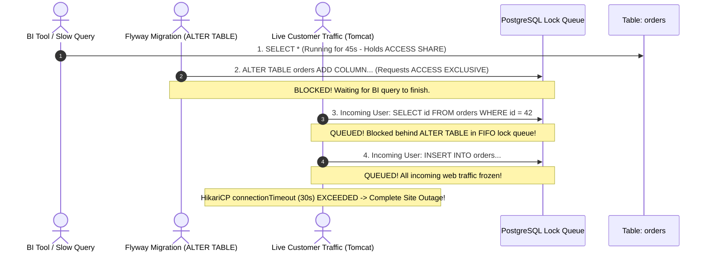
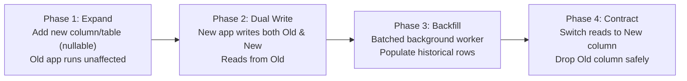

# Zero-Downtime Schema Migrations & PostgreSQL Lock Mastery

In cloud environments with continuous deployment, application code rollbacks take seconds (`kubectl rollout undo`).

Database schema rollbacks, however, are fundamentally destructive. If a migration drops a column or rewrites a 50-million-row table, rolling back the application will crash because the underlying physical disk pages and schema definitions have already been permanently altered.

Achieving true zero-downtime schema evolution requires **deep understanding of the PostgreSQL lock hierarchy, explicit lock timeouts, phased deployment patterns (Expand and Contract), and concurrent DDL techniques**.

---

## 1. The PostgreSQL Lock Hierarchy & The Lock Queue Trap

Every SQL statement in PostgreSQL acquires a lock on the target table. While reads (`SELECT`) acquire non-conflicting `ACCESS SHARE` locks, DDL operations (`ALTER TABLE`, `DROP TABLE`, `TRUNCATE`) require the strongest lock: `ACCESS EXCLUSIVE`.

### 1.1 PostgreSQL Lock Conflict Matrix

| Lock Mode | Acquired By | Conflicts With |
| :--- | :--- | :--- |
| **ACCESS SHARE** | `SELECT` | `ACCESS EXCLUSIVE` |
| **ROW EXCLUSIVE** | `INSERT`, `UPDATE`, `DELETE` | `SHARE`, `SHARE ROW EXCLUSIVE`, `EXCLUSIVE`, `ACCESS EXCLUSIVE` |
| **SHARE UPDATE EXCLUSIVE** | `VACUUM`, `ANALYZE`, `CREATE INDEX CONCURRENTLY` | `SHARE UPDATE EXCLUSIVE` through `ACCESS EXCLUSIVE` (Allows live reads and writes!) |
| **SHARE** | Standard `CREATE INDEX` (without CONCURRENTLY) | `ROW EXCLUSIVE`, `SHARE ROW EXCLUSIVE`, `EXCLUSIVE`, `ACCESS EXCLUSIVE` (Blocks writes!) |
| **ACCESS EXCLUSIVE** | `ALTER TABLE`, `DROP TABLE`, `TRUNCATE`, `REINDEX` | **ALL OTHER LOCKS** (Blocks all reads and writes!) |

### 1.2 The Lock Queue Disaster

PostgreSQL processes lock requests using a strict First-In, First-Out (FIFO) queue. 

If an `ALTER TABLE` request arrives while a slow analytical report or complex query is running on that table, the migration cannot acquire its `ACCESS EXCLUSIVE` lock and waits in line.

**The Disaster**: Once an `ACCESS EXCLUSIVE` lock request enters the queue, **all subsequent incoming web queries (`SELECT`, `INSERT`, `UPDATE`) line up behind it**, waiting for the lock request to be resolved. Within seconds, the HikariCP connection pool exhausts, web workers stall, and the entire application platform goes down!



### 1.3 The Production Defense: Explicit Lock Timeouts

Never execute production DDL without explicit lock and statement timeouts. If the table lock cannot be acquired within 2 seconds, abort the migration immediately, allowing customer web traffic to proceed without interruption:

```sql
-- Production DDL Safety Template:
SET lock_timeout = '2s';
SET statement_timeout = '5s';

-- If a slow query holds an ACCESS SHARE lock, this statement aborts after 2 seconds
-- instead of queuing incoming web traffic!
ALTER TABLE orders ADD COLUMN fulfillment_center_id INT;
```

---

## 2. The Expand and Contract Pattern

Never execute breaking schema changes in a single deployment. Always divide migrations into four backward-compatible phases across separate deployments:



### Case Study: Renaming `name` to `full_name`

#### Step 1: Expand (Flyway Migration `V2__add_full_name.sql`)
Add the new column as nullable. The running application code is unaware of this column and continues operating unaffected:

```sql
SET lock_timeout = '2s';
ALTER TABLE users ADD COLUMN full_name VARCHAR(150);
```

#### Step 2: Dual Write (Application Release v2)
Deploy Spring Boot application version 2. The domain entity writes to both fields upon update, but continues reading from the legacy column:

```java
@Entity
@Table(name = "users")
public class User {
    @Id
    private Long id;

    @Column(name = "name")
    private String name;

    @Column(name = "full_name")
    private String fullName;

    public void updateName(String newName) {
        this.name = newName;        // Legacy field
        this.fullName = newName;    // New field (dual-write)
    }
}
```

#### Step 3: Backfill (Chunked Cursor Pagination)
Populate `full_name` for historical rows created prior to deployment v2. Run in small, bounded cursor batches with explicit sleeps to avoid lock contention and WAL replication lag:

```sql
DO $$
DECLARE
    last_processed_id BIGINT := 0;
    batch_size INT := 5000;
    rows_updated INT := 1;
BEGIN
    WHILE rows_updated > 0 LOOP
        -- Cursor pagination using primary key index
        WITH batch AS (
            SELECT id, name FROM users
            WHERE id > last_processed_id AND full_name IS NULL
            ORDER BY id ASC
            LIMIT batch_size
        )
        UPDATE users u
        SET full_name = b.name
        FROM batch b
        WHERE u.id = b.id;

        GET DIAGNOSTICS rows_updated = ROW_COUNT;

        SELECT COALESCE(MAX(id), last_processed_id) INTO last_processed_id
        FROM (
            SELECT id FROM users
            WHERE id > last_processed_id
            ORDER BY id ASC
            LIMIT batch_size
        ) sub;

        COMMIT;
        PERFORM pg_sleep(0.05); -- 50ms pause yields CPU and prevents replication lag
    END LOOP;
END $$;
```

#### Step 4: Contract (Flyway Migration `V3__drop_old_name.sql` & App v3)
Deploy application version 3 reading exclusively from `full_name`. Monitor error rates for 48 hours. Once verified, permanently drop the legacy column:

```sql
SET lock_timeout = '2s';
ALTER TABLE users DROP COLUMN name;
```

---

## 3. Safe DDL Operations Reference (PostgreSQL 11 to 16+)

Understanding how PostgreSQL physically handles different schema modifications prevents accidental multi-minute table locks on tables with millions of rows.

### 3.1 Adding Columns with Default Values
- **PostgreSQL 11+**: Adding a column with a default value (e.g. `ALTER TABLE orders ADD COLUMN status VARCHAR(20) NOT NULL DEFAULT 'PENDING';`) is **instantaneous** ($O(1)$). It records the default value in PostgreSQL table metadata (`pg_attribute`) without rewriting heap pages.
- **Legacy Databases**: Rewrites every physical page on disk, holding an `ACCESS EXCLUSIVE` lock for minutes on large tables.

### 3.2 Adding Foreign Keys Safely
Adding a standard foreign key constraint requires a sequential table scan under a `SHARE ROW EXCLUSIVE` lock, blocking all concurrent updates.

**The Production Two-Step Technique**:
```sql
-- Step 1: Add constraint without validating historical rows (Instantaneous lock)
SET lock_timeout = '2s';
ALTER TABLE orders 
ADD CONSTRAINT fk_orders_customer_id 
FOREIGN KEY (customer_id) REFERENCES customers(id) NOT VALID;

-- Step 2: Validate historical rows concurrently (Acquires SHARE UPDATE EXCLUSIVE - writes proceed!)
ALTER TABLE orders VALIDATE CONSTRAINT fk_orders_customer_id;
```

### 3.3 Adding `NOT NULL` Constraints Safely
Executing `ALTER TABLE users ALTER COLUMN email SET NOT NULL;` triggers a full table scan under an `ACCESS EXCLUSIVE` lock to verify that no null values exist.

**The Production Safe Technique (PostgreSQL 12+)**:
```sql
-- Step 1: Add check constraint marked NOT VALID (Instantaneous)
ALTER TABLE users ADD CONSTRAINT chk_users_email_not_null CHECK (email IS NOT NULL) NOT VALID;

-- Step 2: Validate constraint concurrently (Does not block reads or writes)
ALTER TABLE users VALIDATE CONSTRAINT chk_users_email_not_null;

-- Step 3: Convert validated check constraint to formal NOT NULL (Instantaneous metadata update)
ALTER TABLE users ALTER COLUMN email SET NOT NULL;
ALTER TABLE users DROP CONSTRAINT chk_users_email_not_null;
```

---

## 4. Concurrent Index Creation (`CREATE INDEX CONCURRENTLY`)

Standard `CREATE INDEX` acquires a `SHARE` lock that **blocks all concurrent writes (`INSERT`, `UPDATE`, `DELETE`)** until the index build completes. On a 20-million-row table, an index build can take 15 minutes, knocking your application offline.

### 4.1 The Solution: `CONCURRENTLY`
```sql
CREATE INDEX CONCURRENTLY idx_orders_customer_date 
ON orders(customer_id, created_at DESC);
```

#### How Concurrent Indexing Operates (3-Phase Scan):
1. **Phase 1**: Registers the index in PostgreSQL system catalogs (`pg_index`). Live writes begin updating the new index structure.
2. **Phase 2 (Table Scan 1)**: Scans all existing table pages to build the initial B-Tree. Reads and writes proceed normally!
3. **Phase 3 (Table Scan 2)**: Executes a second scan to catch up with changes made during Phase 2, then marks the index valid (`indisvalid = true`).

### 4.2 Flyway Multi-Statement Rule
`CREATE INDEX CONCURRENTLY` **cannot execute inside a multi-statement transaction block**. 

You must instruct Flyway to execute the migration outside a transaction using the special comment header:

```sql
-- V5__add_orders_customer_idx.sql
-- flyway:transactional=false

SET lock_timeout = '5s';
CREATE INDEX CONCURRENTLY IF NOT EXISTS idx_orders_customer_date 
ON orders(customer_id, created_at DESC);
```

### 4.3 Detecting and Cleaning Up Broken `INVALID` Indexes
If a concurrent index build fails (e.g., query cancellation, timeout, or duplicate key violation on unique index), PostgreSQL leaves behind an `INVALID` index. 

**The Danger**: An `INVALID` index **slows down every subsequent write** because the database continues inserting keys into it, yet the query planner **never uses it for reads**!

```sql
-- Step 1: Query for broken/invalid indexes across the database
SELECT 
    c.relname AS index_name,
    t.relname AS table_name,
    i.indisvalid AS is_valid
FROM pg_index i
JOIN pg_class c ON c.oid = i.indexrelid
JOIN pg_class t ON t.oid = i.indrelid
WHERE NOT i.indisvalid;

-- Step 2: Concurrently drop the broken invalid index
DROP INDEX CONCURRENTLY idx_orders_customer_date;
```

---

## 5. Spring Data JPA & Hibernate Alignment

In production environments, never allow Hibernate to manage your database schema.

### 5.1 The Fatal `ddl-auto: update` Anti-Pattern
Setting `spring.jpa.hibernate.ddl-auto: update` in production is a critical liability:
- Hibernate attempts to execute un-timed DDL during application startup.
- It silently alters data types and drops column constraints.
- In a multi-pod cluster, all starting pods execute competing DDL statements, leading to deadlocks.

```yaml
# application-prod.yml
spring:
  jpa:
    hibernate:
      # Strictly VALIDATE that domain entities match Flyway schema; NEVER auto-modify!
      ddl-auto: validate
  flyway:
    enabled: true
    baseline-on-migrate: true
```

---

## 6. Active Recall Interview Mastery

<AccordionGroup>
  <Accordion title="1. What is the PostgreSQL Lock Queue Trap, and how does a slow SELECT query cause a complete site outage during a migration?">
    PostgreSQL manages lock acquisition using a strict First-In, First-Out (FIFO) queue. 
    
    When an `ALTER TABLE` statement requests an `ACCESS EXCLUSIVE` lock on a table where a slow analytical query is holding an `ACCESS SHARE` lock, the migration is forced to wait. However, because `ACCESS EXCLUSIVE` conflicts with all other lock types, any new incoming customer queries (`SELECT`, `INSERT`, `UPDATE`) line up behind the waiting migration in the queue. 
    
    All incoming web traffic is completely frozen until the slow analytical query finishes. Connection pools exhaust within seconds, resulting in total application outage.
  </Accordion>

  <Accordion title="2. How does the Expand and Contract pattern achieve zero-downtime column renames?">
    A single-step column rename immediately breaks either the old or new running application version. The Expand and Contract pattern splits the rename across 4 distinct phases:
    1. **Expand**: Add the new column as nullable.
    2. **Dual-Write**: Deploy application code that writes to both columns but reads from the old one.
    3. **Backfill**: Run a chunked background job to copy data from the old column to the new column for historical rows.
    4. **Contract**: Switch the application to read from the new column, and subsequently drop the old column in a later release.
  </Accordion>

  <Accordion title="3. Why can CREATE INDEX CONCURRENTLY not run inside a Flyway transaction?">
    Concurrent index creation requires PostgreSQL to execute multiple distinct transactions and table scans under the hood (registering the index, building the B-tree, and catching up with concurrent modifications). 
    
    PostgreSQL explicitly forbids running `CREATE INDEX CONCURRENTLY` inside an existing user transaction block (`BEGIN ... COMMIT`). To run it via Flyway, the migration file must include `-- flyway:transactional=false` as the very first line.
  </Accordion>

  <Accordion title="4. What is an INVALID index in PostgreSQL, and why is it dangerous?">
    If a `CREATE INDEX CONCURRENTLY` command fails midway (due to a lock timeout, unique constraint collision, or manual cancellation), PostgreSQL does not automatically clean it up. It leaves behind an index marked with `indisvalid = false`.
    
    This is dangerous because PostgreSQL continues to execute write updates on the invalid index on every `INSERT` and `UPDATE`, consuming CPU and disk I/O, yet the query planner refuses to use it for `SELECT` queries. It degrades write throughput without delivering any read benefit.
  </Accordion>

  <Accordion title="5. How do you safely add a NOT NULL constraint to a 50-million-row table in PostgreSQL?">
    Executing `ALTER TABLE t ALTER COLUMN c SET NOT NULL;` scans the entire 50-million-row table under an `ACCESS EXCLUSIVE` lock, freezing all reads and writes. 
    
    **The Safe Technique**:
    1. Add a check constraint with `NOT VALID` (instantaneous metadata change):
       `ALTER TABLE t ADD CONSTRAINT chk_c_not_null CHECK (c IS NOT NULL) NOT VALID;`
    2. Validate the constraint concurrently without blocking live traffic:
       `ALTER TABLE t VALIDATE CONSTRAINT chk_c_not_null;`
    3. Set the column to `NOT NULL` formally (instantaneous in PG 12+ because the database recognizes the already-validated check constraint), then drop the check constraint.
  </Accordion>
</AccordionGroup>

---

## 7. Done Checklist

<Check>
Every production DDL migration script sets `SET lock_timeout = '2s'` and `SET statement_timeout = '5s'`.
</Check>
<Check>
Breaking schema changes strictly follow the 4-phase Expand and Contract lifecycle across separate deployments.
</Check>
<Check>
All large table indexing uses `CREATE INDEX CONCURRENTLY` with `-- flyway:transactional=false`.
</Check>
<Check>
Automated monitoring queries check for `indisvalid = false` to detect and drop broken index leftovers.
</Check>
<Check>
Foreign key constraints are added using the two-step `NOT VALID` followed by `VALIDATE CONSTRAINT` pattern.
</Check>
<Check>
`spring.jpa.hibernate.ddl-auto` is set to `validate` in all non-local environments.
</Check>
