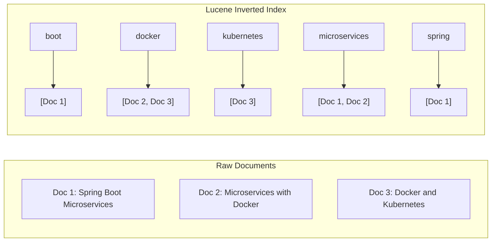
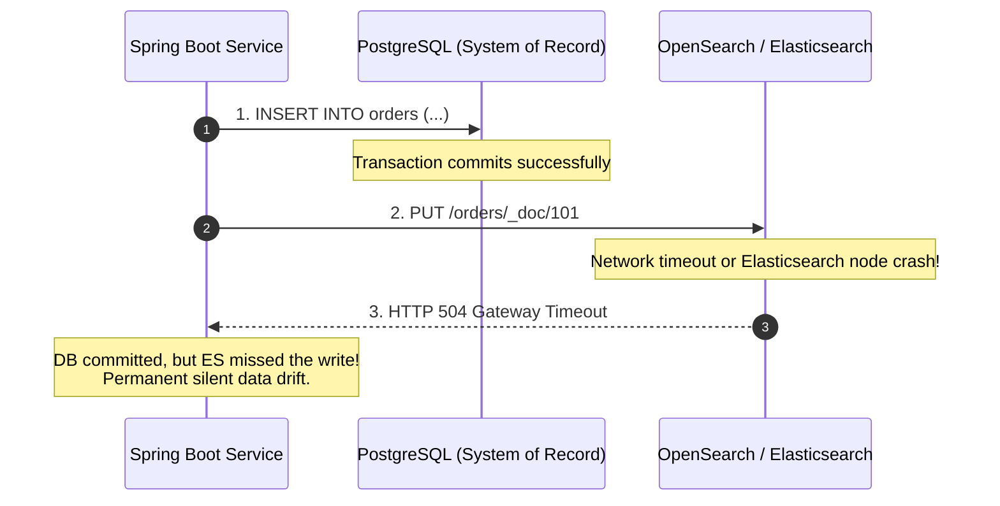
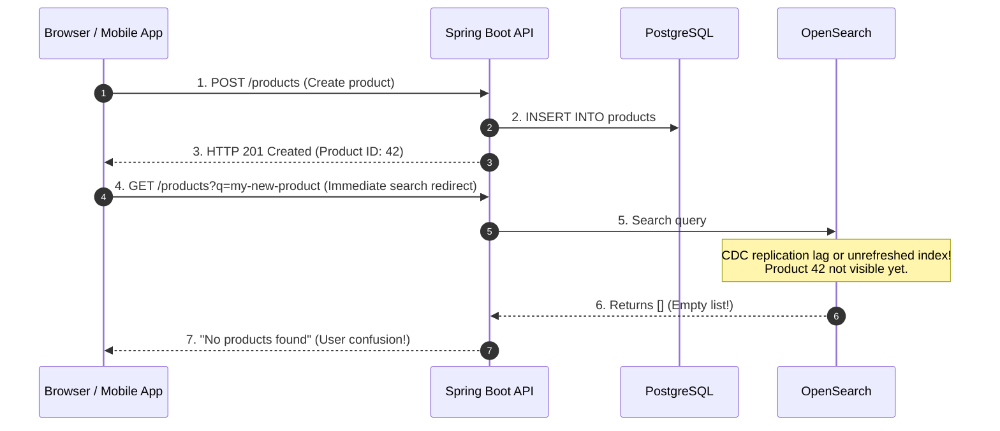
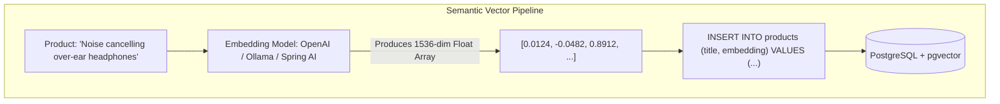
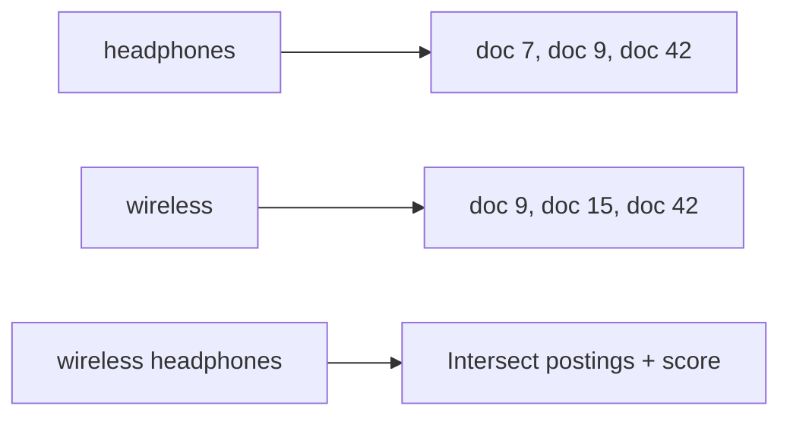

## 1. Mental Model: Why Relational Databases Fail at Search

Relational databases like PostgreSQL are optimized for point lookups and range scans on structured data using B-Trees. However, when users type unstructured queries into a search bar:
- `SELECT * FROM products WHERE description LIKE '%wireless headphones%'`
- `SELECT * FROM articles WHERE content ILIKE '%kubernetes cluster%'`

A standard B-Tree index is **completely useless**. Because the search term contains a leading wildcard (`%`), the PostgreSQL query planner must perform a **Sequential Scan** (`Seq Scan`) across every single 8KB disk page in the multi-gigabyte table:

```mermaid
flowchart TD
    subgraph Relational Table Scan: O(N) Disk IO
        Q["User Query: 'wireless headphones'"] --> Scan[PostgreSQL Seq Scan]
        Scan --> P1["Row 1: Read full text from disk"]
        Scan --> P2["Row 2: Read full text from disk"]
        Scan --> PN["Row 10,000,000: Full Disk Read"]
        PN --> Match["Filter matches with zero relevance ranking<br/>Latency: 4,200ms"]
    end
```

Furthermore, relational databases lack:
1. **Relevance Ranking**: Calculating how central a keyword is to a document (TF-IDF / BM25).
2. **Linguistic Processing**: Stemming (`running` $\rightarrow$ `run`), lemmatization, synonym expansion, and typo tolerance (fuzzy Levenshtein distance).
3. **Semantic Understanding**: Knowing that `laptop sleeve` is conceptually related to `computer case`.

To solve this, modern backends pair relational systems of record with **Inverted Index Search Engines** (Elasticsearch / OpenSearch) and **Vector Databases** (`pgvector`).

---

## 2. Apache Lucene Storage Internals

Elasticsearch and OpenSearch are distributed wrappers around **Apache Lucene**. Lucene turns the relational data model upside down: instead of mapping documents to text fields, an **Inverted Index** maps vocabulary words to the list of documents containing them:



### The Three Core Structures of an Inverted Index

```console
+-------------------------------------------------------------+
| 1. Term Dictionary (FST - Finite State Transducer in RAM)   |
|    "docker" -> Pointer to Term Index                        |
+-------------------------------------------------------------+
                              |
                              v
+-------------------------------------------------------------+
| 2. Postings List (Roaring Bitmaps on Disk)                  |
|    Doc IDs: [2, 3]                                          |
|    Term Frequencies: [Doc 2: 1, Doc 3: 1]                   |
|    Positions: [Doc 2: pos 3, Doc 3: pos 1]                  |
+-------------------------------------------------------------+
                              |
                              v
+-------------------------------------------------------------+
| 3. Stored Fields & Doc Values (Columnar Storage)            |
|    Fast sorting, aggregations, and original source payload  |
+-------------------------------------------------------------+
```

1. **Term Dictionary & Finite State Transducer (FST)**:
   - Stores all unique terms sorted alphabetically.
   - Compressed into memory using a Finite State Transducer (FST), enabling $O(\text{term length})$ prefix and wildcard lookups without loading terms from disk.
2. **Postings List with Roaring Bitmaps**:
   - An array of Document IDs containing the term, along with term frequency and byte offsets for phrase matching.
   - Compressed using **Roaring Bitmaps** for ultra-fast bitwise intersections (`AND` queries) and unions (`OR` queries).
3. **Doc Values (Columnar Format)**:
   - While inverted indexes map `term -> docs` (ideal for search), aggregations and sorting require `doc -> terms`. Doc Values provide a columnar on-disk layout enabling instant sorting by price, date, or category.

### BM25: The Relevance Scoring Math
Lucene ranks search results using **BM25 (Best Matching 25)**:

$$\text{Score}(D, Q) = \sum_{i=1}^{N} \text{IDF}(q_i) \cdot \frac{f(q_i, D) \cdot (k_1 + 1)}{f(q_i, D) + k_1 \cdot \left(1 - b + b \cdot \frac{|D|}{\text{avgdl}}\right)}$$

- **$\text{IDF}(q_i)$ (Inverse Document Frequency)**: Rare words (e.g., `kubernetes`) carry high weight; common stop words (e.g., `the`, `and`) carry near-zero weight.
- **$f(q_i, D)$ (Term Frequency)**: How many times term $q_i$ appears in document $D$, throttled by saturation parameter $k_1$ so repeating a word 100 times doesn't break relevance.
- **$\frac{|D|}{\text{avgdl}}$ (Document Length Normalization)**: Penalizes long, spammy documents so concise, highly relevant documents rank higher.

---

## 3. The Dual-Write Anti-Pattern & Disaster

How do you keep PostgreSQL (your transactional source of truth) synchronized with Elasticsearch?

### The Naive Approach (Application Dual-Writes):
```java
// DANGEROUS ANTI-PATTERN: DO NOT USE IN PRODUCTION
@Transactional
public Order createOrder(OrderRequest request) {
    Order order = orderRepository.save(new Order(request)); // Write 1: PostgreSQL
    searchClient.index(new OrderSearchDoc(order));          // Write 2: Elasticsearch
    return order;
}
```



### Why Dual-Writes Inevitably Corrupt Data:
1. **Partial Failures**: If Step 1 succeeds and Step 2 fails, your database has an order that never appears in search.
2. **Rollback Desynchronization**: If Step 1 succeeds, Step 2 succeeds, but a downstream database constraint triggers a transaction rollback, Elasticsearch contains a **phantom document** that physically does not exist in the database!
3. **Out-of-Order Race Conditions**: Two concurrent threads update the same record. Thread A writes to DB at $T_1$ and Thread B writes to DB at $T_2$. Due to network jitter, Thread A's search update arrives at Elasticsearch **after** Thread B's update, permanently overwriting the newer state with stale data.

---

## 4. Rock-Solid CDC Pipeline: PostgreSQL WAL to OpenSearch

To eliminate dual-writes, production systems decouple writes using **Change Data Capture (CDC)** reading directly from the PostgreSQL Write-Ahead Log (WAL):


### 1. PostgreSQL Logical Replication Configuration (`postgresql.conf`)
```ini
wal_level = logical
max_wal_senders = 4
max_replication_slots = 4
```

### 2. Idempotent Indexing with Versioning
To prevent out-of-order Kafka message deliveries from overwriting newer records, configure Elasticsearch external versioning:

```http
PUT /products/_doc/1001?version=1740837190000&version_type=external_gte
{
  "title": "Noise Cancelling Headphones",
  "price": 299.99,
  "updated_at": 1740837190000
}
```
If an out-of-order event arrives with a `version` (timestamp) lower than the version currently stored in Elasticsearch, Elasticsearch rejects the write with `409 Conflict`, guaranteeing eventual consistency.

---

## 5. Mitigating "Search After Write" Eventual Consistency

Because CDC pipelines are asynchronous, there is a replication lag (typically 50ms - 500ms) between committing to PostgreSQL and appearing in Elasticsearch. Additionally, Elasticsearch has a default **Refresh Interval** of 1 second (`index.refresh_interval: 1s`) before newly indexed documents become visible to queries.



### Production Mitigations for Search-After-Write:
1. **Optimistic Local UI State**: The client SPA immediately appends the newly created item to its local UI list, bypassing an immediate full-text search query.
2. **Read-Your-Own-Writes Fallback**: If a search query is accompanied by a recently created ID header, query PostgreSQL by primary key directly if the search index returns empty.
3. **Targeted Refresh**: In low-throughput administrative back-offices (CMS tools), pass `?refresh=wait_for` on individual writes to block the client response until the Lucene segment refreshes.

---

## 6. Modern AI Semantic Search with `pgvector`

What if you want semantic vector similarity search without managing a dedicated multi-node Elasticsearch cluster?

PostgreSQL provides **`pgvector`**, allowing high-dimensional vector embeddings to live directly alongside relational tables.



### PostgreSQL Vector DDL & Distance Metrics

```sql
-- 1. Enable pgvector extension
CREATE EXTENSION IF NOT EXISTS vector;

-- 2. Create products table with 1536-dimensional vector column
CREATE TABLE product_embeddings (
    id BIGINT PRIMARY KEY,
    title VARCHAR(255) NOT NULL,
    description TEXT,
    embedding vector(1536) NOT NULL
);

-- 3. Create Hierarchical Navigable Small World (HNSW) Index
CREATE INDEX idx_products_embedding_hnsw 
ON product_embeddings 
USING hnsw (embedding vector_cosine_ops)
WITH (m = 16, ef_construction = 64);
```

### HNSW vs IVFFlat Indexing Comparison

| Vector Index Type | Build Speed | Query Latency | Recall Accuracy | Memory Footprint |
| :--- | :--- | :--- | :--- | :--- |
| **IVFFlat (Inverted File Flat)** | Fast | Moderate | ~85-90% | Low |
| **HNSW (Hierarchical Navigable Small World)** | Slow | **Ultra-Fast (sub-5ms)** | **~98-99%** | High (Entire graph in RAM) |

### Vector Similarity Distance Operators:
- `<=>` : **Cosine Distance** (most common for text embeddings; measures angle between vectors, independent of magnitude).
- `<->` : **Euclidean Distance ($L_2$)** (measures physical distance between points).
- `<#>` : **Negative Inner Product** (used for normalized embeddings).

```sql
-- Semantic Search Query: Find top 5 items most similar to user search embedding
SELECT id, title, 1 - (embedding <=> :queryEmbedding) AS similarity_score
FROM product_embeddings
ORDER BY embedding <=> :queryEmbedding
LIMIT 5;
```

---

## 7. Production Spring Boot Integration with Spring AI

```java
package com.backend.mastery.database.search;

import org.springframework.ai.embedding.EmbeddingModel;
import org.springframework.jdbc.core.JdbcTemplate;
import org.springframework.stereotype.Service;

import java.util.List;

@Service
public class SemanticSearchService {

    private final EmbeddingModel embeddingModel;
    private final JdbcTemplate jdbcTemplate;

    public SemanticSearchService(EmbeddingModel embeddingModel, JdbcTemplate jdbcTemplate) {
        this.embeddingModel = embeddingModel;
        this.jdbcTemplate = jdbcTemplate;
    }

    public List<SearchResult> searchProducts(String userPrompt, int limit) {
        // 1. Generate 1536-dimensional vector embedding for user query
        float[] queryVector = embeddingModel.embed(userPrompt);
        String vectorString = formatVectorForPostgres(queryVector);

        // 2. Perform Cosine Similarity Search using HNSW index
        String sql = """
            SELECT id, title, 1 - (embedding <=> ?::vector) AS score
            FROM product_embeddings
            ORDER BY embedding <=> ?::vector
            LIMIT ?
            """;

        return jdbcTemplate.query(
            sql,
            (rs, rowNum) -> new SearchResult(
                rs.getLong("id"),
                rs.getString("title"),
                rs.getDouble("score")
            ),
            vectorString, vectorString, limit
        );
    }

    private String formatVectorForPostgres(float[] vector) {
        StringBuilder sb = new StringBuilder("[");
        for (int i = 0; i < vector.length; i++) {
            sb.append(vector[i]);
            if (i < vector.length - 1) sb.append(",");
        }
        sb.append("]");
        return sb.toString();
    }

    public record SearchResult(Long id, String title, Double score) {}
}
```

---

## Search, CDC & Vector Fundamentals Interview Map

Search is not the same as lookup. CDC is not the same as dual-writing. Vector search is not the same as SQL filtering.

### 1. Lookup vs search

Lookup:

```sql
SELECT *
FROM products
WHERE id = 42;
```

Search:

```console
User types: "wireless noise canceling travel headphones"
```

Search needs tokenization, scoring, typo tolerance, language processing, and ranking.

### 2. Inverted index mental model



A B-Tree answers ordered scalar lookup. An inverted index answers text relevance.

### 3. CDC vs application dual-write

Application dual-write:

```java
db.save(product);
search.index(product);
```

This can corrupt state when one write succeeds and the other fails.

CDC reads committed database changes from the WAL after the database has already decided truth.

### 4. Vector search basics

Embeddings turn meaning into numbers. Similar text has nearby vectors.

```sql
SELECT id, title
FROM product_embeddings
ORDER BY embedding <=> :queryEmbedding
LIMIT 10;
```

Vector search is approximate when using HNSW/IVFFlat indexes. You trade recall, memory, and latency.

### Build-Break-Fix Lab

<Steps>
  <Step title="Build">
    Index product rows into OpenSearch through a CDC-style event stream.
  </Step>
  <Step title="Break">
    Write directly to PostgreSQL and OpenSearch from application code, then force the second write to fail.
  </Step>
  <Step title="Observe">
    Search results diverge from the source of truth.
  </Step>
  <Step title="Fix">
    Move indexing behind outbox/CDC and make the indexer idempotent with external versioning.
  </Step>
  <Step title="Prove">
    Replay old events out of order and assert newer indexed state is not overwritten.
  </Step>
</Steps>

---

## 8. Failure Modes & Edge Case Matrix

| Failure Mode | Component | Root Cause | Impact | Production Defense |
| :--- | :--- | :--- | :--- | :--- |
| **Silent Data Drift** | App Dual-Write | Network drop between DB commit and ES write | Search results out of sync with DB | Eliminate app dual-writes; use Debezium CDC from PostgreSQL WAL. |
| **Out-of-Order Overwrite** | Kafka Ingestion | Parallel consumer threads commit updates out of order | Stale record overwrites fresh record | Enforce external versioning in OpenSearch (`version_type=external_gte`). |
| **Search-After-Write Blindness** | OpenSearch Index | User queries before Lucene 1s refresh interval | User cannot find item just created | Return optimistic client state; pass `?refresh=wait_for` on critical admin writes. |
| **HNSW OOM Eviction** | pgvector | Vector index outgrows PostgreSQL `shared_buffers` | Vector queries drop from 4ms to 800ms disk swapping | Size `shared_buffers` and `work_mem` to keep HNSW graph memory-resident. |

---

## 9. Senior Interview Questions & Active Recall

<AccordionGroup>
  <Accordion title="Why is writing to both PostgreSQL and Elasticsearch in application code considered an anti-pattern?">
    Application-level dual-writes lack atomic two-phase commit guarantees across heterogeneous databases. If the database transaction commits but the Elasticsearch write times out, data diverges permanently. If the Elasticsearch write succeeds but the database transaction rolls back, Elasticsearch stores phantom records. Furthermore, concurrent out-of-order network deliveries can cause older updates to overwrite newer ones.
  </Accordion>
  <Accordion title="How does Debezium CDC solve the dual-write problem?">
    Debezium attaches as a logical replication client to the PostgreSQL Write-Ahead Log (WAL). Because the WAL is the single, immutable, sequentially ordered source of truth for all committed transactions, Debezium extracts change events without application code intervention. It streams these events into Kafka with guaranteed ordering per partition key, enabling idempotent consumers to update Elasticsearch reliably.
  </Accordion>
  <Accordion title="When should you use pgvector over a dedicated Elasticsearch cluster?">
    Use **`pgvector`** when you want semantic AI search tightly integrated with your relational queries (e.g., filtering products by tenant ID, price range, and user permissions in a single atomic SQL query) without the operational burden of managing a separate Elasticsearch cluster. Use **Elasticsearch** when you require high-throughput lexical full-text search, complex fuzzy matching, custom tokenizers, aggregations, and multi-terabyte search log scaling.
  </Accordion>
</AccordionGroup>

---

## 10. Done Checklist

<Check>
- [ ] Understand why B-Trees fail at unstructured text search and cause $O(N)$ sequential table scans.
- [ ] Diagram the Apache Lucene Inverted Index: Term Dictionary (FST in RAM), Postings Lists (Roaring Bitmaps on disk), and Doc Values.
- [ ] Explain BM25 scoring: Term Frequency (TF), Inverse Document Frequency (IDF), and document length normalization.
- [ ] Articulate the 3 fatal flaws of application dual-writes (partial failures, rollback desynchronization, out-of-order updates).
- [ ] Architect a production CDC pipeline using PostgreSQL WAL $\rightarrow$ Debezium $\rightarrow$ Kafka $\rightarrow$ OpenSearch.
- [ ] Mitigate search-after-write eventual consistency using external versioning and optimistic UI state.
- [ ] Implement semantic search in PostgreSQL using `pgvector` with HNSW cosine distance indexes.
</Check>
