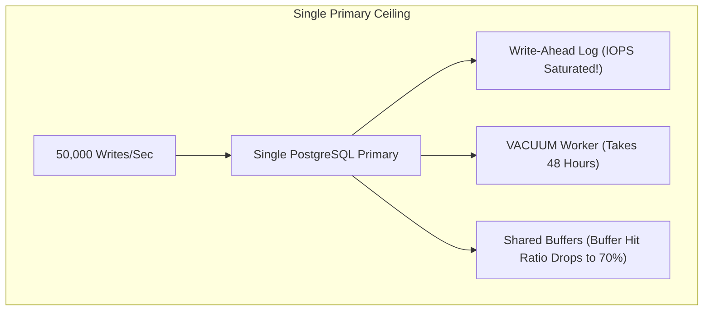
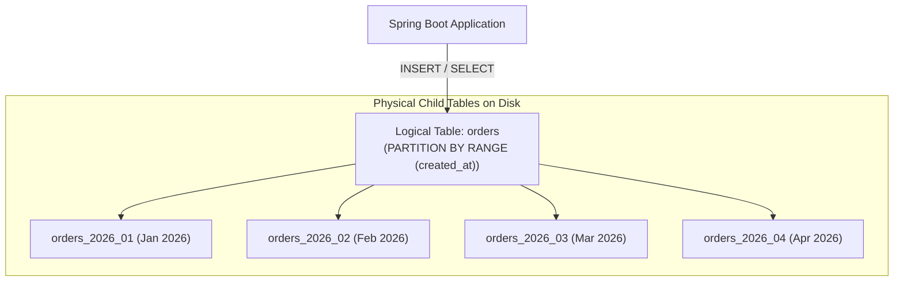

## 1. Mental Model: The Single-Node Saturation Wall

Every relational database begins life on a single primary server. For 95% of software applications, scaling vertically (upgrading an AWS RDS instance to 64 vCPUs and 512GB of RAM) paired with read replicas and Redis caching is entirely sufficient.

However, when a platform reaches true hyperscale—such as generating **50,000+ write transactions per second** or accumulating **10+ terabytes of data per month**—a single PostgreSQL primary reaches a hard physical wall:
- **Write IOPS Saturation**: All writes must flow through the single primary's Write-Ahead Log (WAL). A single disk controller cannot exceed its physical write bandwidth.
- **Maintenance Gridlock**: Routine operations like `VACUUM`, index rebuilds (`REINDEX`), and logical backups take days to complete and degrade live production traffic.
- **Buffer Pool Thrashing**: The working set size dwarfs available RAM, forcing the engine into constant disk paging.



To scale past this boundary, senior backend engineers must master **PostgreSQL Declarative Partitioning, Horizontal Database Sharding, and Alternative Storage Engines (LSM-Trees)**.

---

## 2. Single-Node Partitioning: PostgreSQL Declarative Partitioning

Before introducing the network latency and operational complexity of distributed multi-database sharding, first exploit **PostgreSQL Native Declarative Partitioning**.

Partitioning splits a single massive logical table into smaller, high-performance physical child tables on disk while presenting a unified table view to your Java application:



---

### The Three Partitioning Strategies:

<Tabs>
  <Tab title="1. Range Partitioning (Time-Series / Dates)">
    Ideal for time-stamped logs, audit trails, and financial ledgers:
    ```sql
    -- 1. Create root partitioned table
    CREATE TABLE audit_logs (
        id BIGSERIAL,
        user_id BIGINT NOT NULL,
        action VARCHAR(64) NOT NULL,
        created_at TIMESTAMP WITH TIME ZONE NOT NULL,
        PRIMARY KEY (id, created_at)
    ) PARTITION BY RANGE (created_at);

    -- 2. Create monthly child partitions
    CREATE TABLE audit_logs_2026_01 PARTITION OF audit_logs
        FOR VALUES FROM ('2026-01-01 00:00:00+00') TO ('2026-02-01 00:00:00+00');

    CREATE TABLE audit_logs_2026_02 PARTITION OF audit_logs
        FOR VALUES FROM ('2026-02-01 00:00:00+00') TO ('2026-03-01 00:00:00+00');
    ```
  </Tab>

  <Tab title="2. List Partitioning (Discrete Regions / Tenants)">
    Ideal for data sovereignty (GDPR) and routing by discrete categories (e.g., country code):
    ```sql
    CREATE TABLE customers (
        id BIGINT NOT NULL,
        country_code VARCHAR(2) NOT NULL,
        name VARCHAR(255) NOT NULL,
        PRIMARY KEY (id, country_code)
    ) PARTITION BY LIST (country_code);

    CREATE TABLE customers_us PARTITION OF customers
        FOR VALUES IN ('US', 'CA');

    CREATE TABLE customers_eu PARTITION OF customers
        FOR VALUES IN ('GB', 'DE', 'FR', 'NL');
    ```
  </Tab>

  <Tab title="3. Hash Partitioning (Uniform Disk Distribution)">
    Ideal when data lacks a natural time or category axis, spreading writes evenly across $N$ partitions:
    ```sql
    CREATE TABLE sensor_readings (
        device_id UUID NOT NULL,
        payload JSONB NOT NULL,
        PRIMARY KEY (device_id)
    ) PARTITION BY HASH (device_id);

    CREATE TABLE sensor_readings_p0 PARTITION OF sensor_readings
        FOR VALUES WITH (MODULUS 4, REMAINDER 0);
    CREATE TABLE sensor_readings_p1 PARTITION OF sensor_readings
        FOR VALUES WITH (MODULUS 4, REMAINDER 1);
    CREATE TABLE sensor_readings_p2 PARTITION OF sensor_readings
        FOR VALUES WITH (MODULUS 4, REMAINDER 2);
    CREATE TABLE sensor_readings_p3 PARTITION OF sensor_readings
        FOR VALUES WITH (MODULUS 4, REMAINDER 3);
    ```
  </Tab>
</Tabs>

---

### Verifying Partition Pruning via `EXPLAIN`

When an application executes a query with a partition boundary filter:
```sql
EXPLAIN (COSTS OFF)
SELECT * FROM audit_logs 
WHERE created_at >= '2026-02-15' AND created_at <= '2026-02-20';
```

The PostgreSQL query planner uses **Partition Pruning**: it consults table constraints and **completely skips reading `audit_logs_2026_01` from disk**:

```sql
Append
  ->  Seq Scan on audit_logs_2026_02 audit_logs_1
        Filter: ((created_at >= '2026-02-15'::timestamptz) AND (created_at <= '2026-02-20'::timestamptz))
```
Instead of scanning a 50-million-row table, it scans only the relevant 2-million-row child partition, keeping the entire index cached in RAM.

---

## 3. Horizontal Database Sharding: Dividing Data Across Clusters

When write throughput saturates the physical hardware limits of a single instance, data must be **Sharded** across independent database clusters:

```mermaid
flowchart TD
    Client["Application Layer / Sharding Router"] --> Router{Sharding Strategy}
    
    subgraph ShardCluster["Independent Database Clusters"]
        Router -->|murmur3(tenant_id) % 3 == 0| DB0[("PostgreSQL Shard 0\n(Tenants A-G)")]
        Router -->|murmur3(tenant_id) % 3 == 1| DB1[("PostgreSQL Shard 1\n(Tenants H-P)")]
        Router -->|murmur3(tenant_id) % 3 == 2| DB2[("PostgreSQL Shard 2\n(Tenants Q-Z)")]
    end
```

---

### The Golden Rule of Sharding: Co-Locate Related Entities
A catastrophic mistake in sharded architectures is sharding `users` by `user_id` and `orders` by `order_id`. 

Querying *"Get all orders for user 104"* would force the application to broadcast queries across **all 50 database shards** (a **Scatter-Gather query**), destroying throughput.

**The Production Rule**: Shard all child tables by the **same root sharding key** (`tenant_id` or `user_id`):
- Store `orders`, `order_items`, and `payments` on the shard determined by `user_id`.
- All joins between users and orders execute as **strictly local intra-shard joins**, requiring zero distributed cross-database transactions!

---

## 4. Production Spring Boot Dynamic Shard Routing Implementation

Below is a production-grade implementation of dynamic database shard routing using Spring's `AbstractRoutingDataSource` and a scoped context:

```java
package com.backend.mastery.database.sharding;

import com.google.common.hash.Hashing;
import org.springframework.jdbc.datasource.lookup.AbstractRoutingDataSource;

import javax.sql.DataSource;
import java.nio.charset.StandardCharsets;
import java.util.Map;

// 1. Thread-Local Context Holder for Current Shard Key
public final class ShardContextHolder {
    private static final ThreadLocal<String> CURRENT_SHARD = new ThreadLocal<>();

    public static void setShard(String shardKey) {
        CURRENT_SHARD.set(shardKey);
    }

    public static String getShard() {
        return CURRENT_SHARD.get();
    }

    public static void clear() {
        CURRENT_SHARD.remove();
    }
}

// 2. Dynamic Routing DataSource
public class ShardedRoutingDataSource extends AbstractRoutingDataSource {

    private final int totalShards;

    public ShardedRoutingDataSource(Map<Object, Object> targetDataSources, DataSource defaultDataSource, int totalShards) {
        setTargetDataSources(targetDataSources);
        setDefaultTargetDataSource(defaultDataSource);
        this.totalShards = totalShards;
    }

    @Override
    protected Object determineCurrentLookupKey() {
        String tenantId = ShardContextHolder.getShard();
        if (tenantId == null) {
            return "shard_0"; // Default fallback
        }

        // Consistent Hash routing: Murmur3(tenantId) % totalShards
        int shardIndex = Math.abs(
            Hashing.murmur3_32_fixed().hashString(tenantId, StandardCharsets.UTF_8).asInt()
        ) % totalShards;

        return "shard_" + shardIndex;
    }
}
```

---

## 5. Storage Engine Internals: B-Trees vs LSM-Trees

Why do high-throughput distributed databases (Apache Cassandra, ScyllaDB, RocksDB) write data 10x faster than PostgreSQL or MySQL?

### The B-Tree Random Write Penalty (PostgreSQL / MySQL)
A B-Tree stores data sorted in fixed 8KB pages. When you update or insert a row:
1. The target leaf page sits at a random location on disk.
2. The engine must perform **random disk I/O** to read the 8KB page into memory, update it, and write it back to disk.
3. This creates high **Write Amplification**: modifying a 50-byte record forces an entire 8,192-byte page write!

---

### The Log-Structured Merge-Tree (LSM-Tree) Architecture

LSM-Trees (used in Cassandra, RocksDB, TiKV) convert all writes into **strictly sequential append-only operations**:

```mermaid
flowchart TD
    Write["Incoming Write: PUT (key, value)"] --> WAL["1. Append to Sequential WAL on Disk<br/>(Zero random IOPS; sequential disk write)"]
    Write --> MemTable["2. Insert into In-Memory MemTable<br/>(Red-Black Tree in RAM: Fast O(log N))"]
    
    MemTable -.->|When MemTable fills (64MB)| Flush["3. Flush to Disk as Immutable SSTable<br/>(Sorted String Table: Sequential File Write)"]
    
    subgraph DiskStorage ["SSTable Levels on Disk"]
        Flush --> L0["Level 0 SSTables"]
        L0 -->|Background Compaction| L1["Level 1 SSTables (Merged & Sorted)"]
        L1 -->|Compaction| L2["Level 2 SSTables"]
    end
```

### The 4 Pillars of an LSM-Tree:
1. **MemTable (RAM)**: An in-memory concurrent skip-list or red-black tree. All `PUT` and `DELETE` (tombstone) operations write to RAM in nanoseconds.
2. **Commit Log / WAL (Disk)**: Writes append sequentially to a Write-Ahead Log to guarantee durability across power failure.
3. **Immutable SSTables (Disk)**: When the MemTable fills (e.g., 64MB), it is flushed to disk as a **Sorted String Table (SSTable)**. Once written, an SSTable is **never modified** (immutable).
4. **Bloom Filters & Compaction**:
   - Because keys are scattered across multiple SSTables, reading a key checks a **Bloom Filter** per SSTable to avoid searching files that do not contain the key.
   - Background threads run **Compaction** (merging and deduplicating old SSTables into new levels, removing deleted tombstone records).

---

## 6. Failure Modes & Edge Case Matrix

| Failure Mode | Architecture | Root Cause | Impact | Production Defense |
| :--- | :--- | :--- | :--- | :--- |
| **Scatter-Gather Exhaustion** | Sharded DB | Query omits sharding key; queries broadcast to all shards | Latency equals slowest shard; DB CPU spikes | Require sharding key on all OLTP queries; enforce with ArchUnit. |
| **Hot Partition Meltdown** | Hash Sharding | Uneven data distribution (viral customer on Shard 2) | Shard 2 runs out of disk; other shards idle | Apply **Hot Key Salting** or migrate large tenant to dedicated shard. |
| **Compaction Write Stalls** | LSM-Tree (Cassandra) | Write rate exceeds background SSTable compaction speed | Reads degrade; write requests stall | Tune compaction throughput; use Leveled Compaction (LCS). |
| **Cross-Shard Deadlock** | Distributed 2PC | Two transactions acquire distributed locks in different orders | Transactions hang indefinitely until timeout | Co-locate related entities to keep transactions intra-shard. |

---

## 7. Senior Interview Questions & Active Recall

<AccordionGroup>
  <Accordion title="1. What is the difference between single-node Table Partitioning and Horizontal Sharding?">
    **Table Partitioning** splits a large table into smaller physical child tables stored on the **same single database instance**, presenting a unified view to the application. It optimizes index sizes, enables partition pruning, and allows instant $O(1)$ historical data drops without network overhead. **Horizontal Sharding** distributes data across **multiple independent database servers**, each with its own CPU, RAM, and disk. Sharding is required when write throughput or storage capacity exceeds the physical limits of any single server.
  </Accordion>

  <Accordion title="2. Why is entity co-location considered the 'Golden Rule' of database sharding?">
    If related tables (e.g., `users` and `orders`) are sharded using different keys, queries joining users and orders must broadcast requests to all shards (Scatter-Gather) and coordinate distributed two-phase commits (2PC) for transactional updates, introducing massive network latency and deadlock risks. Co-locating related entities by the same root key (`user_id`) guarantees that all user-specific joins and transactions execute locally within a single database instance with zero distributed locking overhead.
  </Accordion>

  <Accordion title="3. How does an LSM-Tree achieve significantly higher write throughput than a B-Tree?">
    B-Trees update data in-place on 8KB disk pages. Because rows are scattered throughout the table, writes cause random disk I/O, dirtying an entire 8KB page for a small modification (high write amplification). LSM-Trees accept all writes into an in-memory MemTable and append them sequentially to a Write-Ahead Log (WAL). When the MemTable fills, it flushes sequentially to disk as an immutable SSTable. Converting all random writes into sequential disk operations allows LSM-Trees to achieve 5-10x higher write throughput on physical storage.
  </Accordion>
</AccordionGroup>

---

## 8. Done Checklist

<Check>
- [ ] Articulate the physical hardware bottlenecks of a single PostgreSQL primary (WAL saturation, buffer thrashing).
- [ ] Implement PostgreSQL Declarative Partitioning across Range, List, and Hash strategies.
- [ ] Verify Partition Pruning in execution plans via `EXPLAIN (COSTS OFF)`.
- [ ] Purge historical data in $O(1)$ time using `DROP TABLE partition_name;`.
- [ ] Architect a horizontal sharding cluster using entity co-location by root sharding key.
- [ ] Build dynamic multi-shard routing in Spring Boot using `AbstractRoutingDataSource`.
- [ ] Explain the internal mechanics of LSM-Trees (MemTable, WAL, SSTables, Bloom Filters, Compaction).
</Check>
