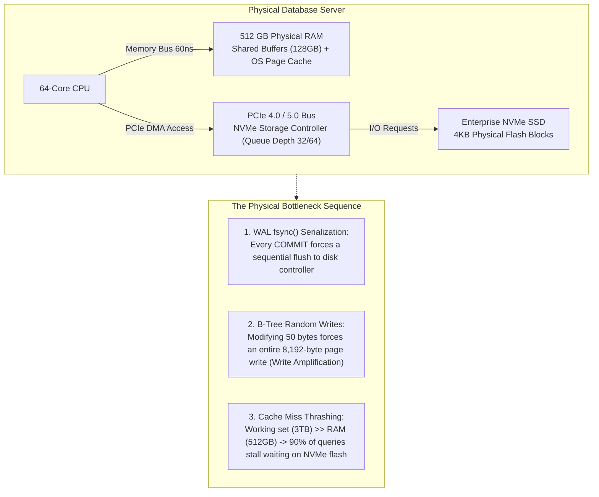
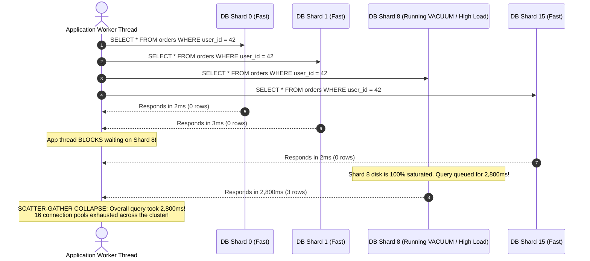
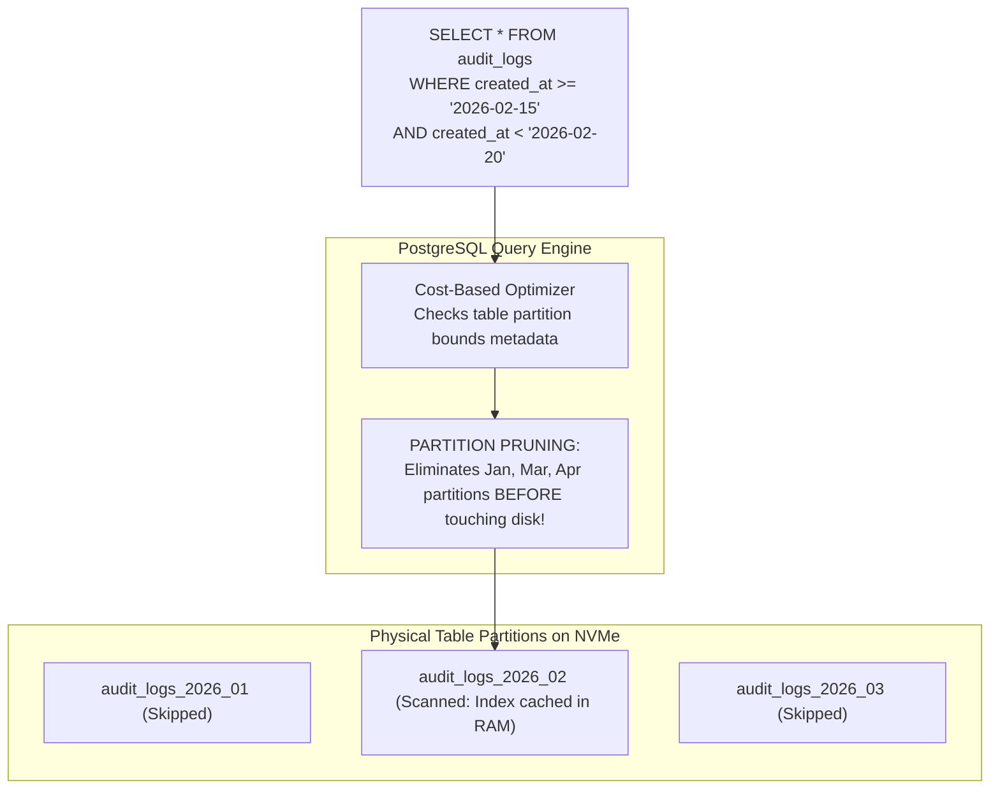
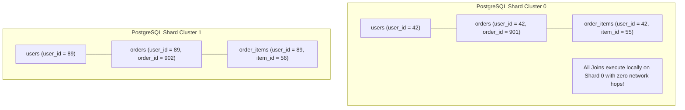
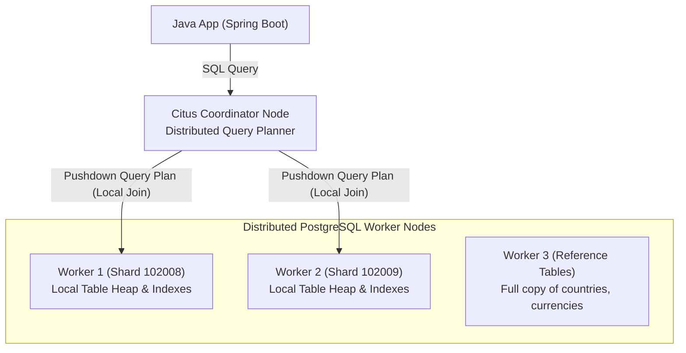
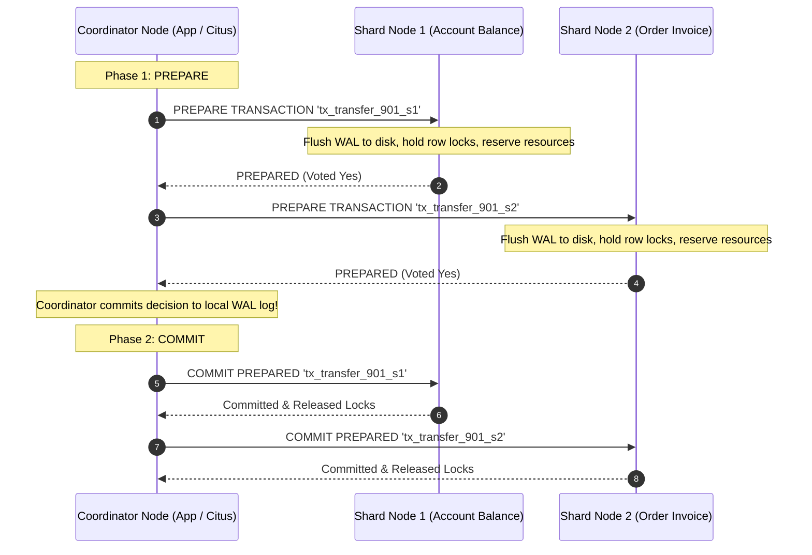
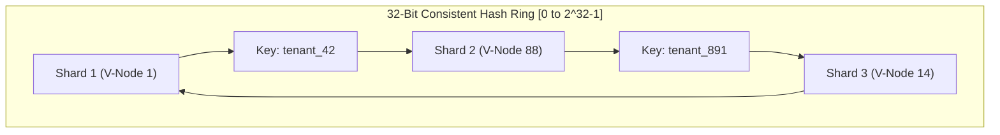
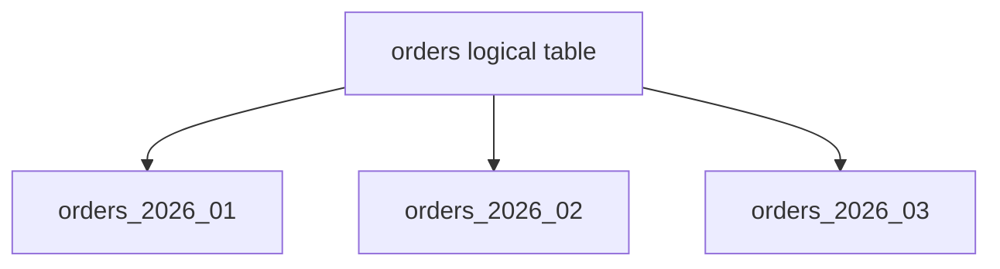
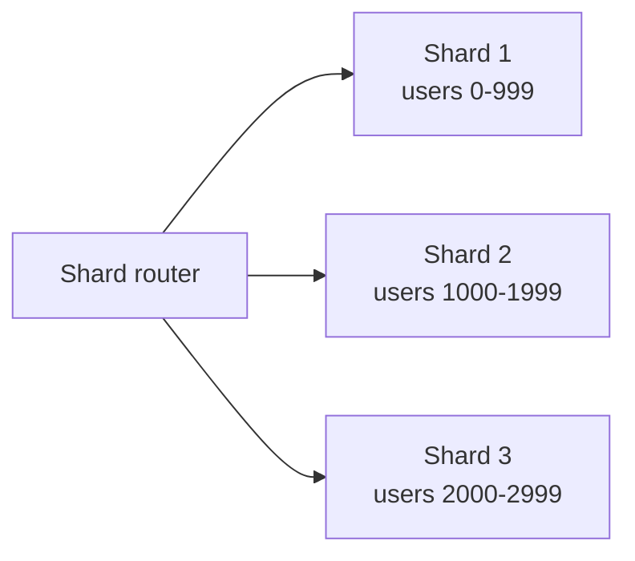

# Distributed Databases: Sharding, Partitioning & LSM-Trees

In high-throughput enterprise architectures, application scale is eventually constrained by physical database hardware. While 95% of web services can scale comfortably on a single PostgreSQL primary by adding read replicas and Redis caches, hyperscale platforms generating **30,000+ write transactions per second** or accumulating **dozens of terabytes per month** inevitably crash against the physical limits of single-node storage engines:
- **Write IOPS & WAL Saturation**: Every write transaction must call `fsync()` on the single primary's Write-Ahead Log (WAL). A single NVMe disk controller reaches a physical throughput ceiling.
- **Buffer Pool Thrashing**: When the active working dataset exceeds physical RAM, the database engine spends all its time reading 8KB pages from disk into memory, causing p99 latencies to spike from $2\text{ ms}$ to $800\text{ ms}$.
- **Maintenance Gridlock**: Operations like autovacuum, index rebuilding (`REINDEX`), and logical backups take days to complete, locking tables and degrading live production traffic.

Senior backend engineers do not wait for the primary database to crash. They understand the hardware mechanics of disk controllers and design systems using **PostgreSQL Declarative Partitioning, Horizontal Sharding with Consistent Hashing, and Append-Only Log-Structured Merge-Trees (LSM-Trees)**.

---

## Phase 1: Ground Floor (Physical First Principles)

To scale databases beyond a single node, you must understand the physical constraints of storage controllers, memory buses, and OS kernel page caches.



### 1. The WAL Serialization Bottleneck
In relational databases (PostgreSQL and MySQL InnoDB), ACID durability requires that when a client commits a transaction, the transaction's changes must be guaranteed to survive a power outage.
- The engine cannot write modified 8KB table pages to disk immediately because in-place page writes are random and slow.
- Instead, it writes a compact change record to the **Write-Ahead Log (WAL)** and issues a synchronous kernel call: `fdatasync()` or `fsync()`.
- **The Physical Limit**: Even on enterprise NVMe SSDs running on high-speed PCIe lanes, a single controller can only execute a finite number of synchronous flush operations per second. Once transaction throughput reaches this ceiling, all application threads stall waiting on the disk controller queue.

### 2. Random In-Place Writes vs Sequential Appends
- **B-Trees (PostgreSQL / MySQL)**: Organize data into sorted 8KB pages. Inserting or updating a record requires locating the target page, reading it into memory, modifying it, and later writing the full 8,192 bytes back to disk. Updating a 20-byte status field causes an **8,192-byte disk write** (a **Write Amplification factor of over $400\times$**!).
- **Append-Only Engines (LSM-Trees / Kafka)**: Never update data in-place on disk. All inserts, updates, and deletes are appended sequentially to the end of a log file, maximizing raw physical disk bandwidth.

---

## Phase 2: The Naive Code (The Production Crashes)

### Crash Scenario 1: The Cross-Shard Scatter-Gather Cluster Exhaustion

A development team shards their database across 16 PostgreSQL shards. They choose to shard `users` by `user_id` and `orders` by `order_id`:

```java
// DANGEROUS ANTI-PATTERN: Sharding related entities by different keys
@Service
public class OrderQueryService {

    @Autowired
    private ShardRouter shardRouter;

    public List<Order> getCustomerOrders(Long userId) {
        // FATAL MISTAKE: The orders table is sharded by order_id!
        // The router has NO IDEA which shard contains this user's orders!
        
        // SCATTER-GATHER DISASTER: Broadcast query to ALL 16 shards simultaneously!
        List<CompletableFuture<List<Order>>> futures = shardRouter.getAllShards()
            .stream()
            .map(shard -> CompletableFuture.supplyAsync(() -> 
                shard.query("SELECT * FROM orders WHERE user_id = ?", userId)))
            .toList();

        // Application thread blocks waiting for the SLOWEST shard to respond
        return futures.stream()
            .map(CompletableFuture::join)
            .flatMap(List::stream)
            .toList();
    }
}
```



#### What Happened in Production:
1. Every simple query for customer orders required opening connections and acquiring locks on **all 16 database shards**.
2. If any single shard suffered a transient latency spike (e.g., autovacuum or GC), the **overall query latency matched the slowest shard**.
3. Connection pools across all 16 shards were instantly exhausted, causing cascading timeouts across the entire platform.

---

### Crash Scenario 2: The Unsalted Celebrity / Hot Tenant Shard Meltdown

A multi-tenant SaaS application shards its database using naive modulo hashing:
`shardIndex = Math.abs(tenantId.hashCode()) % numShards;`

```java
// DANGEROUS ANTI-PATTERN: Naive tenant hashing without hot-key isolation
public class NaiveShardResolver {

    private final int totalShards = 8;

    public int resolveShard(String tenantId) {
        // Hash code maps tenant to a fixed shard index
        return Math.abs(tenantId.hashCode()) % totalShards;
    }
}
```

Line by line:

- `totalShards = 8` fixes the cluster size into the resolver. Adding or removing shards changes the modulo result for many tenants.
- `tenantId.hashCode()` produces a deterministic integer from the tenant string.
- `Math.abs(...)` tries to avoid negative shard indexes, but `Math.abs(Integer.MIN_VALUE)` is still negative because of integer overflow.
- `% totalShards` maps the hash into a shard number from 0 to 7.

What breaks:

```console
If totalShards changes from 8 to 9,
most tenantId % shardCount results change,
so the app starts looking for existing tenants on the wrong shard.
```

Safer direction:

```console
Use a shard mapping table or consistent hash ring.
Keep tenant -> shard assignment stable.
Move tenants deliberately with a migration plan.
Treat hot tenants as placement decisions, not random hash accidents.
```

Proof task:

```console
Hash 10,000 tenant IDs with 8 shards.
Hash the same IDs with 9 shards.
Count how many move.
Then compare with a consistent hash ring using virtual nodes.
```

#### What Happened in Production:
- 99% of tenants are small businesses generating 5 orders per day.
- Tenant `"enterprise-mega-corp"` signs up and is routed to **Shard 4**. They generate **15,000 orders per minute**.
- **The Hot Partition Meltdown**:
  - Shard 4's CPU hits $100\%$ and NVMe storage fills to $98\%$ capacity.
  - Shards 0, 1, 2, 3, 5, 6, and 7 sit idle at $4\%$ CPU.
  - Shard 4 crashes, taking down `"enterprise-mega-corp"` AND all 1,200 innocent small business tenants who happened to be hashed onto Shard 4.

---

### Crash Scenario 3: The Missing Default Partition New Year's Day Outage

A developer configures PostgreSQL declarative range partitioning for audit logs, partitioning by month:

```sql
-- DANGEROUS: Creating partitions manually without a DEFAULT partition
CREATE TABLE transaction_ledger (
    id BIGINT NOT NULL,
    amount NUMERIC(12, 2) NOT NULL,
    created_at TIMESTAMPTZ NOT NULL,
    PRIMARY KEY (id, created_at)
) PARTITION BY RANGE (created_at);

CREATE TABLE ledger_2026_11 PARTITION OF transaction_ledger
    FOR VALUES FROM ('2026-11-01 00:00:00+00') TO ('2026-12-01 00:00:00+00');

CREATE TABLE ledger_2026_12 PARTITION OF transaction_ledger
    FOR VALUES FROM ('2026-12-01 00:00:00+00') TO ('2027-01-01 00:00:00+00');
-- Developer forgot to create the 2027_01 partition!
```

Minimum defensive default:

```sql
CREATE TABLE transaction_ledger_default
PARTITION OF transaction_ledger DEFAULT;
```

Why this matters:

- `DEFAULT` catches rows that do not match any explicit partition.
- It prevents a total write outage when the next time-range partition is missing.
- It is not a substitute for creating future partitions. It is an emergency catch net.
- Monitoring must alert if rows appear in the default partition, because that means partition maintenance failed.

#### What Happened in Production:
- At precisely `2027-01-01 00:00:00 UTC`, the first transaction of the new year arrived.
- PostgreSQL attempted to insert the row, found no matching partition bounds, and threw a fatal error:
  `ERROR: no partition of relation "transaction_ledger" found for row`.
- Every checkout and financial transaction failed globally until engineers were paged out of bed on New Year's Day to manually alter the schema.

---

## Phase 3: Under the Hood (Mechanics, Engine Internals & Algorithms)

### 1. PostgreSQL Declarative Partitioning Internals

Before introducing the network latency and distributed failure modes of multi-server sharding, always exploit **single-node table partitioning**.



#### The Three Native Partitioning Strategies:

<Tabs>
  <Tab title="1. Range Partitioning (Time-Series & Ledgers)">
```sql
-- Root partitioned table
CREATE TABLE audit_logs (
    id BIGINT NOT NULL,
    tenant_id VARCHAR(64) NOT NULL,
    action VARCHAR(64) NOT NULL,
    created_at TIMESTAMPTZ NOT NULL,
    PRIMARY KEY (id, created_at)
) PARTITION BY RANGE (created_at);

-- Monthly child partitions
CREATE TABLE audit_logs_2026_01 PARTITION OF audit_logs
    FOR VALUES FROM ('2026-01-01 00:00:00+00') TO ('2026-02-01 00:00:00+00');

CREATE TABLE audit_logs_2026_02 PARTITION OF audit_logs
    FOR VALUES FROM ('2026-02-01 00:00:00+00') TO ('2026-03-01 00:00:00+00');

-- SAFETY CATCH: Always define a DEFAULT partition to prevent production crashes!
CREATE TABLE audit_logs_default PARTITION OF audit_logs DEFAULT;
```
  </Tab>

  <Tab title="2. List Partitioning (Discrete Regions / Tenants)">
```sql
CREATE TABLE tenant_profiles (
    id BIGINT NOT NULL,
    region_code VARCHAR(8) NOT NULL,
    data JSONB NOT NULL,
    PRIMARY KEY (id, region_code)
) PARTITION BY LIST (region_code);

CREATE TABLE tenant_profiles_eu PARTITION OF tenant_profiles
    FOR VALUES IN ('EU-WEST', 'EU-CENTRAL');

CREATE TABLE tenant_profiles_us PARTITION OF tenant_profiles
    FOR VALUES IN ('US-EAST', 'US-WEST');
```
  </Tab>

  <Tab title="3. Hash Partitioning (Uniform Disk Striping)">
```sql
CREATE TABLE high_throughput_events (
    event_id UUID NOT NULL,
    payload BYTEA NOT NULL,
    PRIMARY KEY (event_id)
) PARTITION BY HASH (event_id);

-- Distribute data across 4 physical partitions evenly
CREATE TABLE events_p0 PARTITION OF high_throughput_events FOR VALUES WITH (MODULUS 4, REMAINDER 0);
CREATE TABLE events_p1 PARTITION OF high_throughput_events FOR VALUES WITH (MODULUS 4, REMAINDER 1);
CREATE TABLE events_p2 PARTITION OF high_throughput_events FOR VALUES WITH (MODULUS 4, REMAINDER 2);
CREATE TABLE events_p3 PARTITION OF high_throughput_events FOR VALUES WITH (MODULUS 4, REMAINDER 3);
```
  </Tab>
</Tabs>

#### Verifying Partition Pruning via `EXPLAIN`:
```sql
EXPLAIN (COSTS OFF)
SELECT * FROM audit_logs 
WHERE created_at >= '2026-02-15 00:00:00+00' AND created_at < '2026-02-20 00:00:00+00';
```
```postgresql
Append
  ->  Seq Scan on audit_logs_2026_02 audit_logs_1
        Filter: ((created_at >= '2026-02-15 00:00:00+00'::timestamptz) AND (created_at < '2026-02-20 00:00:00+00'::timestamptz))
```
Notice that PostgreSQL **only scans `audit_logs_2026_02`**. All other partitions are completely pruned from the execution plan before physical disk reads occur.

#### Instant $O(1)$ Historical Data Purging:
In an unpartitioned 200-million row table, running `DELETE FROM audit_logs WHERE created_at < '2025-01-01'` writes millions of tombstone tuples, generates gigabytes of WAL logs, and causes massive autovacuum table bloat.

In a partitioned table, purging an entire month takes **under 5 milliseconds ($O(1)$)** and frees disk space immediately:
```sql
-- Detach partition safely with zero locks, then drop physical storage instantly
ALTER TABLE audit_logs DETACH PARTITION audit_logs_2025_01 CONCURRENTLY;
DROP TABLE audit_logs_2025_01;
```

---

### 2. Horizontal Sharding: Entity Co-Location & Consistent Hashing

When write throughput saturates physical hardware, you must shard data across independent database clusters.

#### The Golden Rule: Co-Locate Related Entities by Root Sharding Key
To avoid catastrophic Scatter-Gather queries, **shard all related child tables by the root entity key** (`user_id` or `tenant_id`):



---

### 3. Production Spring Boot Dynamic Shard Routing

Below is the production-grade implementation of dynamic multi-shard database routing using Spring's `AbstractRoutingDataSource` and a thread-safe context holder:

```java
package com.backend.database.sharding;

import com.google.common.hash.Hashing;
import org.springframework.jdbc.datasource.lookup.AbstractRoutingDataSource;

import javax.sql.DataSource;
import java.nio.charset.StandardCharsets;
import java.util.Map;

// 1. Context Holder: Tracks active shard key across the current request
public final class ShardContextHolder {
    private static final ThreadLocal<String> CURRENT_SHARD_KEY = new ThreadLocal<>();

    public static void setShardKey(String shardKey) {
        CURRENT_SHARD_KEY.set(shardKey);
    }

    public static String getShardKey() {
        return CURRENT_SHARD_KEY.get();
    }

    public static void clear() {
        CURRENT_SHARD_KEY.remove();
    }
}

// 2. Dynamic Routing DataSource
public class ShardedRoutingDataSource extends AbstractRoutingDataSource {

    private final int totalShards;

    public ShardedRoutingDataSource(Map<Object, Object> targetDataSources, DataSource defaultDataSource, int totalShards) {
        setTargetDataSources(targetDataSources);
        setDefaultTargetDataSource(defaultDataSource);
        this.totalShards = totalShards;
    }

    @Override
    protected Object determineCurrentLookupKey() {
        String shardKey = ShardContextHolder.getShardKey();
        if (shardKey == null) {
            return "shard_0"; // Fallback to primary admin shard
        }

        // Consistent Hash calculation using Murmur3 32-bit hash
        int hash = Hashing.murmur3_32_fixed().hashString(shardKey, StandardCharsets.UTF_8).asInt();
        int shardIndex = Math.abs(hash) % totalShards;

        return "shard_" + shardIndex;
    }
}
```

#### Safe Context Cleanup via Spring MVC Interceptor:
```java
@Component
public class ShardRoutingInterceptor implements HandlerInterceptor {

    @Override
    public boolean preHandle(HttpServletRequest request, HttpServletResponse response, Object handler) {
        String tenantId = request.getHeader("X-Tenant-ID");
        if (tenantId != null && !tenantId.isBlank()) {
            ShardContextHolder.setShardKey(tenantId);
        }
        return true;
    }

    @Override
    public void afterCompletion(HttpServletRequest request, HttpServletResponse response, Object handler, Exception ex) {
        // MANDATORY: Prevent ThreadLocal memory leaks in Tomcat worker threads
        ShardContextHolder.clear();
    }
}
```

---

### 4. Storage Engine Architecture: B-Trees vs LSM-Trees

Why can distributed databases like Apache Cassandra, ScyllaDB, and RocksDB sustain **1,000,000 writes/sec** while traditional relational databases bottleneck?

```mermaid
flowchart TD
    subgraph BTree["PostgreSQL / MySQL B-Tree (Random In-Place Writes)"]
        BW["Write: UPDATE orders SET status='PAID'"] --> BPage["Locate 8KB Leaf Page on Disk"]
        BPage --> BRead["Read 8KB Page into RAM Buffer Pool"]
        BRead --> BWrite["Write full 8,192 Bytes back to Disk (Random IOPS)"]
    end

    subgraph LSMTree["Cassandra / RocksDB LSM-Tree (Append-Only Sequential)"]
        LW["Write: PUT (order_id, PAID)"] --> LWAL["1. Append to Sequential Commit Log (Zero Random I/O)"]
        LW --> LMem["2. Insert into In-Memory MemTable (SkipList in RAM)"]
        LMem -.->|When MemTable fills (64MB)| LFlush["3. Sequential Flush to Disk as Immutable SSTable"]
        LFlush --> LSST["Immutable SSTables (Sorted String Tables) on NVMe"]
    end
```

#### The 4 Components of an LSM-Tree:
1. **MemTable (RAM)**: An in-memory sorted data structure (typically a Concurrent SkipList). Writes and updates complete in nanoseconds.
2. **Commit Log (Sequential Disk)**: Before updating the MemTable, writes append sequentially to a Write-Ahead Log to guarantee durability against power loss.
3. **Immutable SSTables (Disk)**: When the MemTable reaches its memory limit (e.g., 64MB), it freezes and flushes sequentially to disk as a **Sorted String Table (SSTable)**. Once written to disk, an SSTable is **completely immutable** (never modified).
4. **Bloom Filters & Background Compaction**:
   - Because reads may need to search multiple SSTables, each SSTable has an in-memory **Bloom Filter** that allows the engine to skip SSTables that definitely do not contain the requested key.
   - Background threads run **Compaction**: merging sorted SSTables, removing deleted records (tombstones), and writing new optimized SSTables sequentially.

---

### 5. Citus & Distributed PostgreSQL Query Planning (Reference vs. Distributed Tables)

When scaling beyond a single PostgreSQL node to a distributed cluster using **Citus** (or native distributed engines), query execution transforms from local pointer traversals to distributed network coordination.



#### The Three Table Archetypes:
1. **Distributed Tables**: Sharded by hash on a distribution column (e.g. `tenant_id`). The table is sliced into dozens of physical standard PostgreSQL tables (shards) scattered across worker nodes:
   ```sql
   SELECT create_distributed_table('orders', 'tenant_id');
   ```
2. **Reference Tables**: Small, slow-changing dimension tables replicated in full to **every single worker node** in the cluster (e.g. `currencies`, `countries`, `product_tax_categories`):
   ```sql
   SELECT create_reference_table('tax_rates');
   ```
   **Why this matters**: Any query joining a distributed table (`orders`) with a reference table (`tax_rates`) can be pushed down and executed **100% locally on the worker node**, with zero network data transfer!
3. **Local Coordinator Tables**: Tables that reside purely on the coordinator node (e.g. metadata tables or admin auth tables).

---

#### Distributed Join Physics:
- **Co-Located Join ($O(1)$ Network)**: When two distributed tables share the same distribution key (`tenant_id`) and are co-located in the same shard group:
  ```sql
  -- FAST: Executed 100% locally inside each worker's local storage engine!
  SELECT u.name, o.total_amount 
  FROM users u 
  JOIN orders o ON u.tenant_id = o.tenant_id AND u.id = o.user_id
  WHERE u.tenant_id = 'tenant_994';
  ```
- **Repartition Join ($O(N)$ Network Saturation)**: Occurs when joining two distributed tables on a column **other than the distribution key**:
  ```sql
  -- DANGEROUS: High network traffic between worker nodes!
  SELECT * FROM orders o JOIN payments p ON o.order_id = p.order_id;
  ```
  The distributed query planner must dynamically read millions of tuples from Worker 1, hash them by `order_id`, and transmit them over the network to Worker 2. Network switches become congested, and query latency degrades from 5ms to 8,000ms.

---

### 6. Distributed Two-Phase Commit (2PC) Mechanics & The Orphaned `pg_prepared_xacts` Outage

When a business transaction spans multiple database shards (e.g., deducting balance on Shard 1 and creating an invoice on Shard 2), single-node ACID transactions cannot guarantee consistency. The distributed coordinator must use **Two-Phase Commit (2PC)**.



---

#### The Catastrophe: In-Doubt Orphaned Transactions
What happens if the coordinator node experiences a network partition or power failure immediately after sending Phase 1 (`PREPARE TRANSACTION`)?

1. **The Distributed Deadlock**: Shard 1 and Shard 2 have both executed `PREPARE TRANSACTION`. They have promised to commit and have flushed this state to persistent disk. **Neither shard can unilaterally decide to abort or commit without the coordinator's order!**
2. **Perpetual Lock Grabbing**: The row locks acquired by the prepared transaction remain held in shared memory and on disk. Any live application query attempting to touch those rows will **block indefinitely**.
3. **Autovacuum Freezing Blockade**: Every prepared transaction has an active `xmin`. If an orphaned prepared transaction remains unresolved for days, it prevents PostgreSQL's autovacuum engine from advancing the table's freeze horizon, leading directly to the **Transaction ID ($XID$) Wraparound Emergency Shutdown**!

#### Diagnosing and Purging Orphaned Prepared Transactions:
Production monitoring must continuously inspect the `pg_prepared_xacts` system view:

```sql
-- 1. Identify transactions stuck in PREPARED state longer than 5 minutes:
SELECT 
    gid, 
    prepared, 
    owner, 
    database, 
    age(transaction) AS xid_age
FROM pg_prepared_xacts
WHERE prepared < now() - INTERVAL '5 minutes';

-- 2. Manually resolve the in-doubt transaction:
-- If the transaction committed upstream:
COMMIT PREPARED 'tx_transfer_901_s1';

-- If the transaction failed upstream:
ROLLBACK PREPARED 'tx_transfer_901_s1';
```

---

### 7. Consistent Hashing Virtual Node Math & Zero-Downtime Shard Rebalancing Lifecycle

The primary operational challenge in distributed database architecture is **resharding**: expanding a cluster from $N$ shards to $N+M$ shards as data grows.

#### The Modulo Hashing Rebalancing Catastrophe:
If an application routes data using naive modulo hashing:
$$\text{Shard Index} = \text{hash}(\text{key}) \pmod N$$

When expanding from $N = 4$ to $N = 5$ shards:
$$\text{Keys Moved} = \frac{N}{N + 1} = \frac{4}{5} = \mathbf{80\% \text{ of all database data!}}$$

An 80% data relocation requires streaming tens of terabytes across internal networks, causing massive replication lag, storage thrashing, and prolonged site outages.

---

#### The Consistent Hash Ring with Virtual Nodes:
Consistent hashing places shards and keys onto a circular 32-bit integer ring ($[0, 2^{32}-1]$).
- Each physical shard server is mapped to **$K$ virtual nodes ($V$-nodes)** (typically $K = 256$) distributed across the ring using multiple hashes of its identifier:
  $$\text{hash}(\text{"shard-1\#1"}), \quad \text{hash}(\text{"shard-1\#2"}), \quad \dots \quad \text{hash}(\text{"shard-1\#256"})$$
- A data key is hashed onto the ring and stored on the first virtual node encountered moving clockwise.



#### The Scaling Math Advantage:
When adding a 5th physical server to an existing 4-server cluster with $V$-nodes:
$$\text{Fraction of Keys Relocated} = \frac{1}{N + 1} = \frac{1}{5} = \mathbf{20\% \text{ of keys only!}}$$

Furthermore, because the 256 virtual nodes are interleaved uniformly around the ring, the relocated 20% of data is drawn **evenly from all 4 existing shards** (5% from each), avoiding localized hot-spot migrations!

---

#### The 4-Phase Online Rebalancing Lifecycle:
To migrate the 20% of keys without dropping customer transactions:

1. **Phase 1: Shadow Shard Allocation**:
   The new shard instance boots up and registers its virtual nodes with the cluster routing metadata service.
2. **Phase 2: Historical Bulk Streaming**:
   The orchestrator streams historical records for the migrated keys from source shards to the new shard using bulk `COPY` streams.
3. **Phase 3: CDC Catch-Up Replay**:
   The new shard connects to PostgreSQL logical replication slots (`pgoutput`) on the source shards, replaying concurrent writes in real time until replication lag drops below $50\text{ ms}$.
4. **Phase 4: Atomic Route Cutover**:
   The routing metadata service (e.g. Consul, Zookeeper, or Spring Cache) updates routing tables in an atomic operation. Application traffic switches to the new shard, and background cleaners asynchronously drop the old keys from source shards.

---

## Partitioning & Sharding Fundamentals Interview Map

Partitioning and sharding both split data. The difference is whether one database node still owns the whole system.

### 1. Partitioning

Partitioning splits one logical table into physical child tables inside the same database.



Benefits:

- Smaller indexes per partition.
- Partition pruning.
- Fast historical drops.
- Easier vacuum and maintenance windows.

### 2. Sharding

Sharding splits data across independent database servers.



Use sharding only when one node cannot handle write throughput, storage, or connection load.

### 3. Shard key choice

A good shard key:

- Appears in most queries.
- Co-locates related data.
- Distributes writes evenly.
- Avoids hot tenants or celebrity keys.
- Does not need frequent changes.

Bad shard key choices create scatter-gather queries across every shard.

### 4. Global uniqueness gets harder

Single-node PostgreSQL can enforce global unique constraints. Sharded systems usually cannot without coordination.

Options:

- Include shard key in unique constraints.
- Use globally unique IDs like UUIDv7 or Snowflake.
- Route uniqueness checks through a single authority.
- Accept scoped uniqueness, such as unique email per tenant.

### Build-Break-Fix Lab

<Steps>
  <Step title="Build">
    Partition an orders table by month and shard a toy data model by tenant ID.
  </Step>
  <Step title="Break">
    Query without the partition key and shard related tables by different keys.
  </Step>
  <Step title="Observe">
    See partition pruning fail and joins become scatter-gather operations.
  </Step>
  <Step title="Fix">
    Add partition-key predicates and co-locate entities by root aggregate key.
  </Step>
  <Step title="Prove">
    Use `EXPLAIN` to show partition pruning and integration tests to verify shard routing.
  </Step>
</Steps>

---

## Phase 4: Senior Interview Ace (Junior vs Staff Phrasing)

| Question / Scenario | Junior Developer Answer | Senior / Staff Backend Engineer Answer |
| :--- | :--- | :--- |
| **What is the fundamental difference between Table Partitioning and Database Sharding?** | "Partitioning splits a table into smaller tables, while sharding splits a database into different servers." | "**Table Partitioning** splits a large logical table into physical child tables managed by the **same database engine on a single server**. It optimizes index sizes, enables partition pruning, and allows instant $O(1)$ partition drops, but it is still bounded by the single node's CPU, RAM, and disk controller IOPS. **Horizontal Sharding** partitions data across **multiple autonomous, independent database servers**, each with its own CPU, RAM, and disk controllers. Sharding is required when write throughput, connection limits, or storage volume exceed physical single-node hardware limits." |
| **Why is entity co-location considered the non-negotiable rule of database sharding?** | "It keeps the data organized together so it doesn't get mixed up." | "If related entities (e.g., `users` and `orders`) are sharded by different keys, any query joining them degenerates into a **Scatter-Gather broadcast query** across every shard in the cluster. Overall latency becomes bottlenecked by the slowest responding shard, and connection pools across the entire cluster are rapidly exhausted. Furthermore, transactional updates would require distributed two-phase commit (2PC) protocols, which introduce network round-trips and deadlock risks. By co-locating child entities by the root entity key (`user_id`), all joins and transactions execute as **strictly local intra-shard operations** with zero distributed locking." |
| **How does an LSM-Tree achieve an order of magnitude higher write throughput than a B-Tree?** | "LSM-Trees are built for NoSQL and use faster memory algorithms." | "B-Trees update data in-place on fixed-size pages (8KB in PostgreSQL, 16KB in InnoDB). Modifying a 30-byte record dirtying an entire 8KB page creates **high Write Amplification** and forces **random disk I/O**, saturating storage controller queues. An LSM-Tree accepts all writes into an in-memory MemTable and appends them sequentially to a Commit Log. When the MemTable fills, it flushes to disk as an **immutable, sequentially written SSTable**. Converting random disk writes into high-speed sequential appends allows LSM-Trees to fully utilize physical NVMe flash bandwidth." |
| **Why does PostgreSQL Declarative Partitioning require the partition key to be part of the Primary Key?** | "Because Postgres needs to know where to find the row." | "PostgreSQL does **not support global unique indexes across partitions**; each child partition maintains its own local B-Tree indexes. If a primary key constraint did not include the partition key, PostgreSQL would have to check every child partition's index on every single `INSERT` to verify uniqueness, destroying write performance. Requiring the partition key in the composite primary key guarantees that uniqueness can be verified **locally within the target child partition's index alone**." |
| **How do you safely purge 100 million historical records without locking live production traffic?** | "Run `DELETE FROM table WHERE created_at < '2024-01-01'` during off-peak hours." | "Running a massive `DELETE` query on a standard table writes 100 million dead tuples, generates massive WAL bloat, and triggers aggressive autovacuum operations that thrash the buffer pool and cause high replication lag. In a partitioned table, historical data is partitioned by range (e.g., monthly). We purge an entire month in **$O(1)$ time** with zero locks by running: `ALTER TABLE table DETACH PARTITION part_2024_01 CONCURRENTLY;` followed by `DROP TABLE part_2024_01;`. This frees disk space immediately and generates negligible WAL records." |
| **What is an in-doubt prepared transaction in distributed 2PC, why is it dangerous, and how do you recover?** | "It is a transaction that is waiting for the user to confirm." | "In Two-Phase Commit, if the coordinator crashes after sending Phase 1 (`PREPARE TRANSACTION`), the participant shards remain in a prepared state. The shards cannot unilaterally commit or abort. The prepared transaction remains alive in memory and disk (`pg_prepared_xacts`), holding row and table locks perpetually, which halts concurrent application queries. Furthermore, its active `xmin` prevents autovacuum from freezing dead tuples, accelerating towards transaction ID wraparound shutdown. We monitor `pg_prepared_xacts` and resolve in-doubt transactions using manual `COMMIT PREPARED` or `ROLLBACK PREPARED` commands." |
| **Why does modulo sharding cause catastrophic rebalancing during cluster expansion, and how do virtual nodes solve it?** | "Modulo hashing is bad because prime numbers don't divide evenly." | "In modulo sharding ($H(k) \pmod N$), expanding from $N$ to $N+1$ shards reshuffles $N/(N+1)$ of all existing data (e.g., expanding from 4 to 5 shards moves 80% of all data across the network). Consistent hashing places shards onto a 32-bit circular ring where adding a server only moves $1/(N+1)$ of keys (20%). By assigning each physical server $K$ virtual nodes (e.g., 256 $V$-nodes) distributed around the ring, the relocated 20% of keys is drawn uniformly from across all existing shards, eliminating migration hot spots." |

---

## Production Debugging Checklist

<AccordionGroup>
  <Accordion title="1. Queries Scanning All Partitions (Partition Pruning Failure)">
    - [ ] Run `EXPLAIN (COSTS OFF) SELECT ...` on the slow query.
    - [ ] Inspect the plan: If multiple child partitions appear under an `Append` node, partition pruning is failing.
    - [ ] Verify that the `WHERE` clause directly references the partition column without function wrappers (e.g., `WHERE DATE(created_at) = ...` breaks static pruning; use `WHERE created_at >= ... AND created_at < ...`).
    - [ ] Check `SET enable_partition_pruning = on;` in PostgreSQL settings.
  </Accordion>

  <Accordion title="2. Diagnosing Hot Shard Imbalance">
    - [ ] Monitor CPU, IOPS, and disk usage across all shard instances.
    - [ ] If one shard exhibits disproportionate load, run `SELECT pg_size_pretty(pg_relation_size('table_name'))` across shards.
    - [ ] Identify high-volume tenant IDs and apply **Key Salting** (`tenantId + "_" + (orderId % 4)`) or migrate the enterprise tenant to a dedicated isolated shard.
  </Accordion>

  <Accordion title="3. Preventing Missing Partition Crashes">
    - [ ] Always ensure a `DEFAULT` partition exists for all range and list partitioned tables.
    - [ ] Deploy an automated cron job or pg_partman extension to pre-create future partitions at least 3 months in advance.
    - [ ] Configure Prometheus alerts for row insertions hitting the `_default` partition.
  </Accordion>

  <Accordion title="4. Detecting and Purging Orphaned 2PC Transactions (pg_prepared_xacts)">
    - [ ] Query `SELECT gid, prepared, age(transaction) FROM pg_prepared_xacts WHERE prepared < now() - INTERVAL '5 minutes';`.
    - [ ] Check `pg_locks` for locks held by virtual transactions corresponding to orphaned prepared transactions.
    - [ ] Check Prometheus metrics for transaction age towards `autovacuum_freeze_max_age`.
    - [ ] Resolve orphaned transactions manually using `ROLLBACK PREPARED 'gid'` or `COMMIT PREPARED 'gid'`.
  </Accordion>
</AccordionGroup>

---

## Done Checklist

<Check>
Physical disk I/O bottlenecks (WAL fsync serialization, random in-place page writes) are thoroughly understood.
</Check>
<Check>
Single-node PostgreSQL declarative partitioning is implemented across Range, List, and Hash strategies.
</Check>
<Check>
Partition pruning is verified using `EXPLAIN (COSTS OFF)` to ensure child partitions are excluded from execution plans.
</Check>
<Check>
All partitioned tables define a `DEFAULT` partition to prevent unhandled insertion errors in production.
</Check>
<Check>
Horizontal sharding architectures enforce entity co-location by root sharding key to eliminate Scatter-Gather queries.
</Check>
<Check>
Spring Boot multi-shard dynamic routing is implemented using `AbstractRoutingDataSource` and thread-safe interceptors.
</Check>
<Check>
The architectural trade-offs between B-Trees and LSM-Trees (Write Amplification, MemTable, SSTables, Compaction) are mastered.
</Check>
<Check>
Citus distributed query planning archetypes (Reference Tables vs Distributed Tables, Co-located vs Repartition Joins) are mastered.
</Check>
<Check>
Distributed Two-Phase Commit failure modes, orphaned `pg_prepared_xacts`, and autovacuum freeze blockades are diagnosed and remediated.
</Check>
<Check>
Consistent hashing virtual node math and 4-phase zero-downtime online shard rebalancing are mastered.
</Check>
