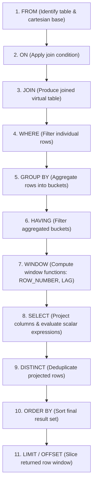
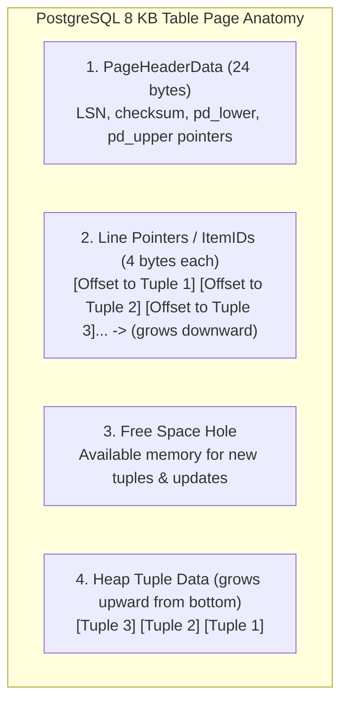
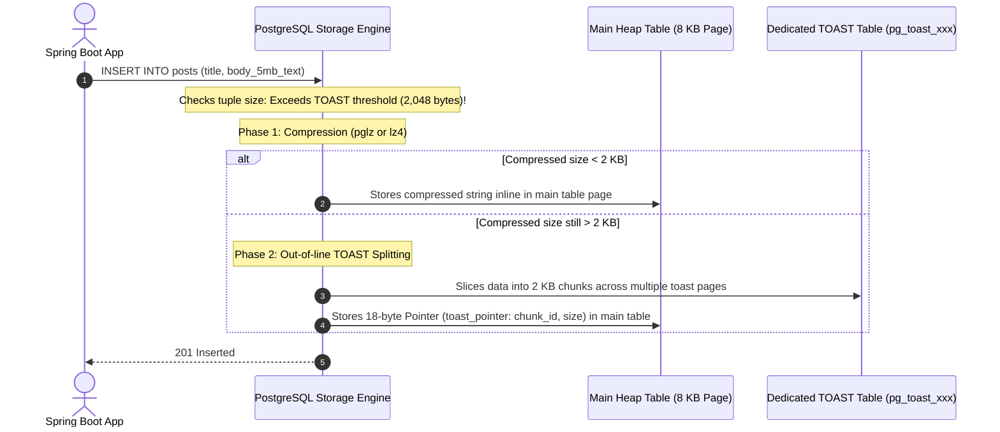
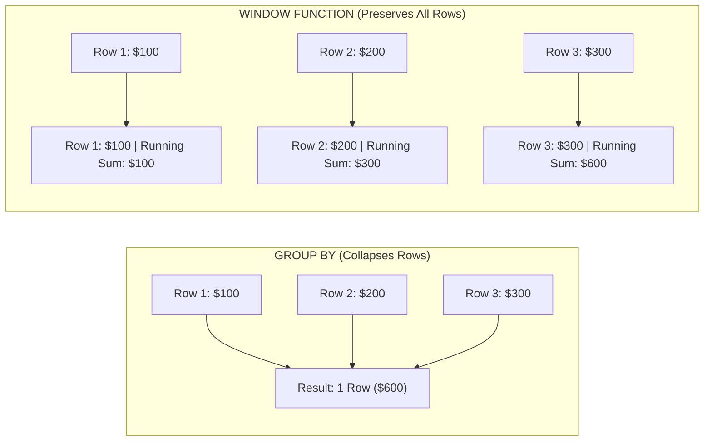
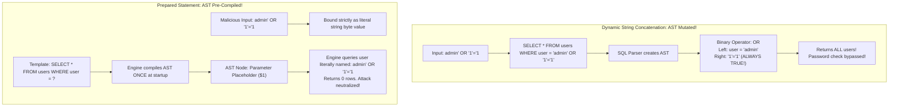
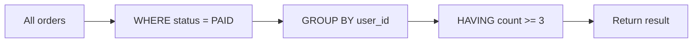
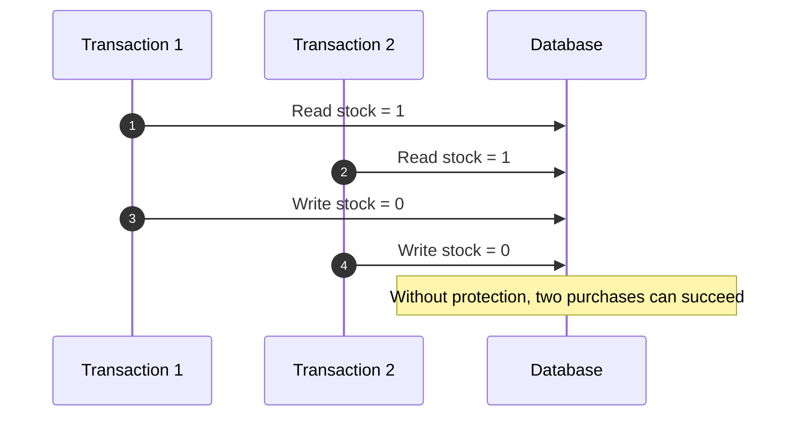

# SQL Query Lifecycle, Physical Storage Internals & Analytical Window Functions

Structured Query Language (SQL) is often taught superficially as simple CRUD statements (`SELECT * FROM users WHERE id = 1`).

However, in high-throughput enterprise backends, treating SQL as magic text strings leads to catastrophic production failures:
- Writing queries that fail with `column alias does not exist` because of a misunderstanding of the **logical query processing order**.
- Storing currency as `FLOAT` or `DOUBLE`, silently corrupting financial balances due to binary floating-point rounding errors.
- Triggering severe disk I/O stalls because table columns exceed the **PostgreSQL 2 KB TOAST threshold**, forcing out-of-line disk seeks.
- Causing security breaches because dynamic string concatenation mutates the database's **Abstract Syntax Tree (AST)**.

This masterclass provides an exhaustive, production-grade guide to the SQL query lifecycle, PostgreSQL physical storage page mechanics, advanced analytical window functions, recursive common table expressions (CTEs), and Prepared Statement internals.

---

## Logical Query Processing Order: How the Engine Executes SQL

When you write an SQL query, the syntactic order of clauses does **not** match the order in which the database engine logically executes them:



### The 11 Logical Processing Steps

| Order | Clause | Engine Action | Architectural Implication |
| :--- | :--- | :--- | :--- |
| **1** | `FROM` | Identifies primary tables and constructs the base dataset. | Base table locks are evaluated here. |
| **2** | `ON` | Evaluates join predicates for each joined relation. | Distinguishes between inner vs outer matching. |
| **3** | `JOIN` | Merges tables based on join algorithm (Nested Loop, Hash, Merge). | Preserves unmatched rows if `LEFT/RIGHT/FULL`. |
| **4** | `WHERE` | Filters rows **before** any grouping or aggregation takes place. | **Cannot use column aliases** created in `SELECT`. Cannot use aggregate functions (`SUM`, `AVG`). |
| **5** | `GROUP BY`| Collapses multiple rows sharing identical group keys into single buckets. | All unaggregated columns in `SELECT` must appear in `GROUP BY`. |
| **6** | `HAVING` | Filters aggregate buckets **after** grouping has occurred. | Filters on aggregate expressions (`HAVING COUNT(*) > 5`). |
| **7** | `WINDOW` | Calculates analytical window functions (`OVER (PARTITION BY ...)`). | Evaluated after `HAVING`; can access aggregate values. |
| **8** | `SELECT` | Projects requested columns, computes scalar expressions, and assigns column aliases. | Aliases become available **only from this point onward**. |
| **9** | `DISTINCT`| Sorts or hashes projected columns to eliminate duplicate tuples. | Expensive operation requiring memory (`work_mem`). |
| **10**| `ORDER BY`| Sorts the final output rows. | **Can use column aliases** defined in `SELECT`. |
| **11**| `LIMIT / OFFSET` | Slices the sorted rows to return a specific window to the client. | `OFFSET 100000` still reads 100,000 rows before discarding them! |

<Tip>
### The "Why Doesn't My Alias Work?" Mystery
```sql
-- FAILS with: ERROR: column "net_price" does not exist
SELECT (price_cents - discount_cents) AS net_price
FROM orders
WHERE net_price > 5000;
```
**Why it fails**: `WHERE` is step 4; `SELECT` (which creates `net_price`) is step 8! The alias does not exist when the `WHERE` clause executes.
**The Fix**: Use the raw expression in `WHERE`, wrap it in a CTE, or filter with a subquery:
```sql
SELECT (price_cents - discount_cents) AS net_price
FROM orders
WHERE (price_cents - discount_cents) > 5000;
```
</Tip>

---

## PostgreSQL Physical Storage Anatomy: The 8 KB Database Page

Relational databases do not write individual rows directly to disk files. PostgreSQL organizes all tables and indexes into **$8\text{ KB}$ fixed-size blocks (pages)**:



### The 4 Internal Page Sections

1. **`PageHeaderData` (24 bytes)**:
   - `pd_lsn`: The Log Sequence Number of the last Write-Ahead Log (WAL) record that updated this page.
   - `pd_lower`: Byte offset pointing to the end of the Line Pointers array.
   - `pd_upper`: Byte offset pointing to the start of the unallocated tuple space at the bottom of the page.
2. **Line Pointers / ItemIDs (4 bytes each)**:
   - An array of small pointers that grow **downward** from byte 24.
   - Each pointer contains `(offset, length)` pointing to the actual row data at the bottom of the page.
   - Allows index entries to point to `(PageNumber, ItemId)` rather than physical byte offsets. If the row moves within the page, only the line pointer changes; **indexes do not need to be updated**.
3. **Free Space**:
   - The unallocated buffer between `pd_lower` and `pd_upper`. When `pd_lower == pd_upper`, the page is $100\%$ full.
4. **Tuple Data (Heap Tuples)**:
   - Grows **upward** from the bottom of the 8 KB block.
   - Each tuple begins with a **$23\text{ byte}$ `HeapTupleHeaderData`**:
     - `xmin`: Transaction ID that inserted this row.
     - `xmax`: Transaction ID that deleted or updated this row (0 if active).
     - `t_ctid`: Physical tuple ID `(page, item)` pointing to itself, or to the newer version of the row if updated.
     - `t_infomask`: Bit flags storing commit status (e.g., `HEAP_XMIN_COMMITTED`).

---

## The TOAST Engine: Handling Oversized Attributes

Because PostgreSQL pages are strictly $8\text{ KB}$ and rows cannot span across multiple pages, how does PostgreSQL store a $5\text{ MB}$ PDF or a large JSON document in a single column?

PostgreSQL uses **TOAST (The Oversized-Attribute Storage Technique)**:



### The 4 TOAST Storage Strategies

| Strategy | Behavior | Typical Column Types |
| :--- | :--- | :--- |
| **`PLAIN`** | Prevents compression and out-of-line storage. Value must fit inline. | `INTEGER`, `BOOLEAN`, `BIGINT`, `DATE` |
| **`EXTENDED`** (Default) | Tries to compress inline; if still too large, moves out-of-line to TOAST table. | `TEXT`, `VARCHAR`, `JSONB`, `BYTEA` |
| **`EXTERNAL`** | Moves out-of-line to TOAST table **without** compression. | Large images/audio that are already compressed. |
| **`MAIN`** | Tries to compress inline; only moves out-of-line if page is completely full. | Short `VARCHAR` strings that fit inline if compressed. |

<Warning>
### The Performance Cost of TOAST Seeks
When you execute `SELECT * FROM posts`, PostgreSQL is forced to perform additional random disk seeks into `pg_toast` to reconstruct large text/json columns, even if your application only needed `title` and `id`!
**Rule**: Always specify explicit columns (`SELECT id, title FROM posts`) to avoid triggering unnecessary TOAST disk deserialization.
</Warning>

---

## Relational Data Types: Currency & Timestamp Precision

### 1. The Floating-Point Currency Disaster
Never store financial currency in `FLOAT` or `DOUBLE` (IEEE 754 floating-point standard). Floating-point numbers represent values in binary fractions ($1/2, 1/4, 1/8$), which cannot accurately represent decimal fractions ($1/10$ or $1/100$):

```sql
-- In PostgreSQL or Java:
SELECT 0.1::float + 0.2::float = 0.3::float;
-- Returns: FALSE! (Actual value is 0.30000000000000004)
```

#### The Production Standard: `NUMERIC` / `DECIMAL`
```sql
CREATE TABLE account_ledger (
    id BIGSERIAL PRIMARY KEY,
    -- Exact arbitrary precision: up to 19 total digits, 4 decimal places
    amount_cents NUMERIC(19, 4) NOT NULL,
    currency VARCHAR(3) NOT NULL DEFAULT 'USD'
);
```
Alternatively, store currency as an integer of atomic micro-units (`BIGINT price_in_cents`).

---

### 2. Timestamps: `TIMESTAMPTZ` vs `TIMESTAMP`
- **`TIMESTAMP` (without time zone)**: Stores raw year-month-day-hour-minute-second without timezone context. If a server in New York inserts `10:00:00`, and a server in London reads it, both read `10:00:00`, despite New York being 5 hours behind!
- **`TIMESTAMPTZ` (with time zone)**: **The Universal Standard**.
  - PostgreSQL converts the input timestamp into **UTC (Coordinated Universal Time)** before saving it to disk.
  - When retrieved, it displays in the requesting client session's timezone, preserving absolute historical time.

```sql
-- Always use TIMESTAMPTZ in production:
created_at TIMESTAMPTZ NOT NULL DEFAULT CURRENT_TIMESTAMP
```

---

## Analytical Window Functions Masterclass

Standard aggregate functions (`SUM`, `AVG`, `COUNT`) collapse multiple rows into a single summary row using `GROUP BY`.
**Window Functions** perform calculations across a set of table rows related to the current row **without collapsing individual rows**:



### Complete Schema & Test Data

```sql
CREATE TABLE financial_transactions (
    id BIGSERIAL PRIMARY KEY,
    account_id BIGINT NOT NULL,
    transaction_date DATE NOT NULL,
    category VARCHAR(50) NOT NULL,
    amount NUMERIC(12, 2) NOT NULL
);

INSERT INTO financial_transactions (account_id, transaction_date, category, amount) VALUES
(101, '2026-09-01', 'PAYROLL', 5000.00),
(101, '2026-09-03', 'GROCERIES', -150.00),
(101, '2026-09-05', 'UTILITIES', -200.00),
(101, '2026-09-07', 'DINING', -150.00),
(101, '2026-09-10', 'INVESTMENT', 1200.00),
(102, '2026-09-02', 'PAYROLL', 4200.00),
(102, '2026-09-04', 'RENT', -1800.00);
```

---

### 1. Ranking Functions: `ROW_NUMBER()` vs `RANK()` vs `DENSE_RANK()`

```sql
SELECT 
    account_id,
    category,
    amount,
    -- Strictly sequential 1, 2, 3, 4 (Arbitrary break on ties)
    ROW_NUMBER() OVER (PARTITION BY account_id ORDER BY amount DESC) as row_num,
    -- Leaves gaps on ties: 1, 2, 2, 4
    RANK() OVER (PARTITION BY account_id ORDER BY amount DESC) as rank_val,
    -- No gaps on ties: 1, 2, 2, 3
    DENSE_RANK() OVER (PARTITION BY account_id ORDER BY amount DESC) as dense_rank_val
FROM financial_transactions;
```

#### Execution Output

| account_id | category | amount | row_num | rank_val | dense_rank_val | Architectural Note |
| :--- | :--- | :--- | :--- | :--- | :--- | :--- |
| **101** | PAYROLL | 5000.00 | 1 | 1 | 1 | Highest transaction |
| **101** | INVESTMENT | 1200.00 | 2 | 2 | 2 | Second highest |
| **101** | GROCERIES | -150.00 | 3 | 3 | 3 | Tied value |
| **101** | DINING | -150.00 | 4 | 3 | 3 | Tied value (Both rank 3) |
| **101** | UTILITIES | -200.00 | 5 | 5 | 4 | Note: `RANK` skips to 5; `DENSE_RANK` assigns 4! |

---

### 2. Relative Value Extraction: `LAG()` and `LEAD()`

`LAG()` accesses data from a previous row, and `LEAD()` accesses data from a subsequent row without requiring self-joins:

```sql
SELECT 
    transaction_date,
    amount,
    -- Fetches the previous transaction amount for this account
    LAG(amount, 1, 0.00) OVER (PARTITION BY account_id ORDER BY transaction_date) as prev_amount,
    -- Calculates percentage change from previous transaction
    ROUND(
        (amount - LAG(amount, 1, amount) OVER (PARTITION BY account_id ORDER BY transaction_date)) / 
        NULLIF(ABS(LAG(amount, 1, amount) OVER (PARTITION BY account_id ORDER BY transaction_date)), 0) * 100, 
        2
    ) as pct_change
FROM financial_transactions
WHERE account_id = 101;
```

---

### 3. Sliding Window Frames: Running Balances & Moving Averages

The `ROWS BETWEEN` clause defines the explicit physical boundary of rows evaluated relative to the current row:

```sql
SELECT 
    transaction_date,
    amount,
    -- 1. Running cumulative account balance from start of time to current row:
    SUM(amount) OVER (
        PARTITION BY account_id 
        ORDER BY transaction_date 
        ROWS BETWEEN UNBOUNDED PRECEDING AND CURRENT ROW
    ) as running_balance,
    -- 2. Rolling 3-transaction moving average (Current row + 2 prior rows):
    AVG(amount) OVER (
        PARTITION BY account_id 
        ORDER BY transaction_date 
        ROWS BETWEEN 2 PRECEDING AND CURRENT ROW
    ) as moving_avg_3_tx
FROM financial_transactions
WHERE account_id = 101;
```

---

## Hierarchical Recursive CTEs with Cycle Detection

Common Table Expressions (CTEs) define temporary named result sets using `WITH`.
In PostgreSQL 12+, CTEs are automatically inlined by the optimizer unless explicitly marked `WITH my_cte AS MATERIALIZED (...)`.

### Traversal of Deeply Nested Comment Trees

When building discussion forums or organizational charts, relational databases must traverse recursive hierarchical trees:

```sql
CREATE TABLE comments (
    id BIGSERIAL PRIMARY KEY,
    parent_id BIGINT REFERENCES comments(id),
    post_id BIGINT NOT NULL,
    author VARCHAR(50) NOT NULL,
    body TEXT NOT NULL
);

-- Seed hierarchical data
INSERT INTO comments (id, parent_id, post_id, author, body) VALUES
(1, NULL, 99, 'alice', 'Top-level question?'),
(2, 1,    99, 'bob',   'Direct answer to Alice'),
(3, 2,    99, 'charlie','Follow-up reply to Bob'),
(4, 1,    99, 'david', 'Alternative answer to Alice');
```

```sql
-- Recursive Query with PostgreSQL 14+ Cycle Detection
WITH RECURSIVE comment_tree AS (
    -- Anchor Member: Find all root comments (parent_id IS NULL)
    SELECT 
        id, 
        parent_id, 
        author, 
        body, 
        1 as depth,
        ARRAY[id] as path
    FROM comments
    WHERE post_id = 99 AND parent_id IS NULL

    UNION ALL

    -- Recursive Member: Join children to parents
    SELECT 
        c.id, 
        c.parent_id, 
        c.author, 
        c.body, 
        ct.depth + 1,
        ct.path || c.id
    FROM comments c
    JOIN comment_tree ct ON c.parent_id = ct.id
)
CYCLE id SET is_cycle USING cycle_path
SELECT 
    id, 
    parent_id, 
    REPEAT('  --> ', depth - 1) || author || ': ' || body as indented_comment,
    depth,
    path
FROM comment_tree
ORDER BY path;
```

#### Output: Flawlessly Indented Comment Hierarchy
```console
alice: Top-level question?
  --> bob: Direct answer to Alice
  -->   --> charlie: Follow-up reply to Bob
  --> david: Alternative answer to Alice
```

---

## SQL Injection AST Deconstruction & Prepared Statements

Why is SQL injection so dangerous, and why do Prepared Statements make it mathematically impossible?



### The AST Mechanics
1. **Dynamic String Concatenation**:
   When you concatenate input strings (`"WHERE email = '" + input + "'"`), the SQL parser treats the user's quotes and operators as **syntactic control tokens**. The SQL engine builds a mutated **Abstract Syntax Tree (AST)** that contains new boolean logic clauses that the developer never intended.
2. **Prepared Statements (Parameterized Queries)**:
   In a prepared statement, the database engine compiles the SQL AST **first** with parameter placeholders (`$1`, `$2`). The execution plan is finalized.
   When the user parameters arrive over the network, the database engine treats them strictly as **scalar literal data values** assigned to memory slots in the execution plan. The string can contain semicolons, quotes, or `OR 1=1`—the engine will never execute them as code!

---

## SQL Fundamentals Interview Map

SQL questions look easy until the interviewer asks what the database actually executes.

### 1. `WHERE` vs `HAVING`

`WHERE` filters rows before grouping. `HAVING` filters groups after aggregation.

```sql
SELECT user_id, COUNT(*) AS order_count
FROM orders
WHERE status = 'PAID'
GROUP BY user_id
HAVING COUNT(*) >= 3;
```

Execution idea:



### 2. `NULL` Is Unknown, Not Empty

`NULL` means missing or unknown. It does not equal anything, even another `NULL`.

```sql
SELECT *
FROM users
WHERE deleted_at = NULL; -- wrong
```

Correct:

```sql
SELECT *
FROM users
WHERE deleted_at IS NULL;
```

Production trap:

```sql
SELECT *
FROM users
WHERE id NOT IN (SELECT user_id FROM bans);
```

If the subquery contains `NULL`, `NOT IN` can return no rows. Prefer `NOT EXISTS`.

### 3. Inner Join vs Left Join

`INNER JOIN` returns only matching rows. `LEFT JOIN` keeps every row from the left table and fills missing right-side values with `NULL`.

```sql
SELECT p.id, p.title, c.id AS comment_id
FROM posts p
LEFT JOIN comments c ON c.post_id = p.id;
```

Use `LEFT JOIN` when the parent should appear even if no child exists.

### 4. Why `SELECT *` Hurts Production

`SELECT *` reads columns you do not need.

Costs:

- More disk and buffer-pool reads.
- More network bytes.
- More JVM object allocation.
- More risk of pulling large TOAST values.
- Fragile API behavior when columns are added.

Use explicit projection:

```sql
SELECT id, title, created_at
FROM notes
WHERE user_id = ?
ORDER BY created_at DESC
LIMIT 50;
```

### 5. Transactions Are Not Just `BEGIN` and `COMMIT`

A transaction groups reads and writes into one atomic unit. But isolation controls what concurrent transactions can observe.



Do not answer transaction questions only with ACID definitions. Be ready to explain lost updates, locks, MVCC snapshots, and atomic SQL updates.

### Build-Break-Fix Lab

<Steps>
  <Step title="Build">
    Create `users`, `orders`, and `payments` tables with realistic constraints.
  </Step>
  <Step title="Break">
    Write queries using `SELECT *`, `NOT IN` with nullable subqueries, and unbounded result sets.
  </Step>
  <Step title="Observe">
    Compare result correctness and `EXPLAIN (ANALYZE, BUFFERS)` output.
  </Step>
  <Step title="Fix">
    Use explicit columns, `NOT EXISTS`, indexes that match filters, and bounded pagination.
  </Step>
  <Step title="Prove">
    Add SQL tests or integration tests for each query's expected rows.
  </Step>
</Steps>

---

## Active Recall & Interview Mastery

<AccordionGroup>
  <Accordion title="1. Walk through the physical 11 steps of the logical query processing order.">
    1. `FROM`: Evaluates table sources and cartesian cross-products.
    2. `ON`: Applies join condition predicates.
    3. `JOIN`: Merges relations into virtual joined tables.
    4. `WHERE`: Filters individual rows before grouping.
    5. `GROUP BY`: Groups rows sharing keys into aggregate buckets.
    6. `HAVING`: Filters aggregated buckets.
    7. `WINDOW`: Calculates analytical window functions (`OVER (PARTITION BY ...)`).
    8. `SELECT`: Projects columns, calculates expressions, assigns aliases.
    9. `DISTINCT`: Eliminates duplicate rows.
    10. `ORDER BY`: Sorts the final output rows (aliases become available here).
    11. `LIMIT / OFFSET`: Slices the returned row window.
  </Accordion>

  <Accordion title="2. What is the physical structure of an 8 KB PostgreSQL database page, and why are Line Pointers used?">
    An $8\text{ KB}$ PostgreSQL page consists of:
    1. **`PageHeaderData` (24 bytes)**: Contains the LSN, lower/upper free space pointers, and transaction checksums.
    2. **Line Pointers / ItemIDs**: 4-byte pointers that grow downward from the header, storing byte offsets to individual tuples.
    3. **Free Space**: Empty memory between lower and upper pointers.
    4. **Tuple Data**: Physical heap rows that grow upward from the bottom of the page, beginning with a 23-byte header (`xmin`, `xmax`, `t_ctid`).
    
    **Line Pointers** decouple physical byte locations from index pointers. Database indexes point to `(PageNumber, ItemId)`. If a row moves or is vacuumed within the page, only its line pointer offset is updated; table indexes do not need to be rewritten.
  </Accordion>

  <Accordion title="3. What is PostgreSQL TOAST, what triggers it, and what performance hazard does it create?">
    TOAST (The Oversized-Attribute Storage Technique) handles column values that exceed the $2\text{ KB}$ inline threshold, since rows cannot span across $8\text{ KB}$ pages.
    
    PostgreSQL first attempts to compress the column inline (`pglz` or `lz4`). If it still exceeds $2\text{ KB}$, it slices the data into $2\text{ KB}$ chunks and writes them to a separate out-of-line table (`pg_toast_xxx`), leaving an 18-byte pointer in the main table.
    
    **Performance Hazard**: Executing `SELECT *` forces PostgreSQL to perform random disk seeks into the TOAST table to reconstruct large text/json columns, degrading query throughput. Always select explicit columns to avoid reading unneeded TOAST data.
  </Accordion>

  <Accordion title="4. Explain the difference between ROW_NUMBER(), RANK(), and DENSE_RANK().">
    - `ROW_NUMBER()`: Assigns a strictly unique, sequential integer (1, 2, 3, 4) to each row within a partition, breaking ties arbitrarily if values match.
    - `RANK()`: Assigns the same rank to identical values, but leaves gaps in the sequence following ties (e.g., 1, 2, 2, 4).
    - `DENSE_RANK()`: Assigns the same rank to identical values, but leaves **no gaps** in the sequence following ties (e.g., 1, 2, 2, 3).
  </Accordion>

  <Accordion title="5. Why does storing currency as FLOAT or DOUBLE cause silent financial loss, and what should be used instead?">
    `FLOAT` and `DOUBLE` adhere to IEEE 754 floating-point standards that represent numbers in base-2 binary fractions. Decimal fractions like $0.10$ cannot be represented accurately in binary, producing precision errors such as $0.1 + 0.2 = 0.30000000000000004$. Over millions of transactions, rounding drift causes real financial balance discrepancies.
    
    **Solution**: Always use exact arbitrary precision types like `NUMERIC(19, 4)` / `DECIMAL(19, 4)`, or store financial amounts as whole integers representing atomic micro-units (`BIGINT amount_in_cents`).
  </Accordion>

  <Accordion title="6. How do Prepared Statements mathematically eliminate SQL Injection at the Abstract Syntax Tree (AST) level?">
    In dynamic string concatenation, user input is parsed alongside SQL keywords, allowing malicious quotes and operators (`OR '1'='1`) to alter the grammar and generate new boolean AST branches.
    
    In a Prepared Statement, the SQL engine parses and compiles the AST **once** using parameter placeholders (`$1`). When user input values are supplied during execution, the database engine binds them strictly as **scalar literal data values** into pre-allocated memory slots. The engine never passes the parameter bytes through the SQL lexer or parser again, making AST grammar mutation impossible.
  </Accordion>
</AccordionGroup>
