# SQL Query Lifecycle, Physical Storage Internals & Analytical Window Functions

Structured Query Language (SQL) is often taught superficially as simple CRUD statements (`SELECT * FROM users WHERE id = 1`).

However, in high-throughput enterprise backends, treating SQL as magic text strings leads to catastrophic production failures:
- Writing queries that fail with `column alias does not exist` because of a misunderstanding of the **logical query processing order**.
- Writing queries with `WHERE status != 'CANCELLED'` and silently losing thousands of unassigned orders due to **SQL Three-Valued Logic (3VL)**.
- Causing zero-row query blackouts on critical reporting pipelines because of the **`NOT IN (NULL)` subquery trap**.
- Storing currency as `FLOAT` or `DOUBLE`, silently corrupting financial balances due to binary floating-point rounding errors.
- Triggering severe disk I/O stalls because table columns exceed the **PostgreSQL 2 KB TOAST threshold**, forcing out-of-line disk seeks.
- Triggering multi-gigabyte disk spills during analytical queries because sorting and hashing exceed **`work_mem`**.
- Calculating incorrect cumulative balances due to the subtle, silent default frame behavior of **`RANGE BETWEEN UNBOUNDED PRECEDING AND CURRENT ROW`**.

This masterclass provides an exhaustive, production-grade guide to the SQL query lifecycle, PostgreSQL physical storage page mechanics, query execution engine operators, advanced analytical window functions, recursive common table expressions (CTEs), and Prepared Statement internals.

---

## Logical Query Processing Order: How the Engine Executes SQL

When you write an SQL query, the syntactic order of clauses does **not** match the order in which the database engine logically executes them:

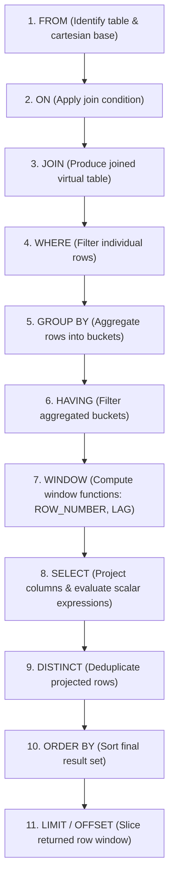

### The 11 Logical Processing Steps

| Order | Clause | Engine Action | Architectural Implication |
| :--- | :--- | :--- | :--- |
| **1** | `FROM` | Identifies primary tables and constructs the base dataset. | Base table locks are evaluated here. |
| **2** | `ON` | Evaluates join predicates for each joined relation. | Distinguishes between inner vs outer matching. |
| **3** | `JOIN` | Merges tables based on join algorithm (Nested Loop, Hash, Merge). | Preserves unmatched rows if `LEFT/RIGHT/FULL`. |
| **4** | `WHERE` | Filters rows **before** any grouping or aggregation takes place. | **Cannot use column aliases** created in `SELECT`. Cannot use aggregate functions (`SUM`, `AVG`). |
| **5** | `GROUP BY`| Collapses multiple rows sharing identical group keys into single buckets. | All unaggregated columns in `SELECT` must appear in `GROUP BY`. |
| **6** | `HAVING` | Filters aggregate buckets **after** grouping has occurred. | Filters on aggregate expressions (`HAVING COUNT(*) > 5`). |
| **7** | `WINDOW` | Calculates analytical window functions (`OVER (PARTITION BY ...)`). | Evaluated after `HAVING`; can access aggregate values. |
| **8** | `SELECT` | Projects requested columns, computes scalar expressions, and assigns column aliases. | Aliases become available **only from this point onward**. |
| **9** | `DISTINCT`| Sorts or hashes projected columns to eliminate duplicate tuples. | Expensive operation requiring memory (`work_mem`). |
| **10**| `ORDER BY`| Sorts the final output rows. | **Can use column aliases** defined in `SELECT`. |
| **11**| `LIMIT / OFFSET` | Slices the sorted rows to return a specific window to the client. | `OFFSET 100000` still reads 100,000 rows before discarding them! |

<Tip>
### The "Why Doesn't My Alias Work?" Mystery
```sql
-- FAILS with: ERROR: column "net_price" does not exist
SELECT (price_cents - discount_cents) AS net_price
FROM orders
WHERE net_price > 5000;
```
**Why it fails**: `WHERE` is step 4; `SELECT` (which creates `net_price`) is step 8! The alias does not exist when the `WHERE` clause executes.
**The Fix**: Use the raw expression in `WHERE`, wrap it in a CTE, or filter with a subquery:
```sql
SELECT (price_cents - discount_cents) AS net_price
FROM orders
WHERE (price_cents - discount_cents) > 5000;
```
</Tip>

### Query Walkthrough: Every Clause Has A Moment In Time

```sql
SELECT customer_id,
       COUNT(*) AS order_count,
       SUM(total_cents) AS total_spent_cents
FROM orders
WHERE status = 'PAID'
GROUP BY customer_id
HAVING SUM(total_cents) > 100000
ORDER BY total_spent_cents DESC
LIMIT 10;
```

Line by line:
- `SELECT customer_id, ...` describes the final columns returned to the client, but it is not logically evaluated first.
- `COUNT(*) AS order_count` counts rows inside each group after `GROUP BY`.
- `SUM(total_cents) AS total_spent_cents` adds paid order totals per customer.
- `FROM orders` selects the base table. PostgreSQL decides whether to read it through a sequential scan, index scan, or another plan.
- `WHERE status = 'PAID'` removes unpaid rows before grouping. This is the right place for row-level filters.
- `GROUP BY customer_id` turns many order rows into one group per customer.
- `HAVING SUM(total_cents) > 100000` filters grouped customers after aggregation. `WHERE SUM(...)` would be invalid because `WHERE` runs before aggregation exists.
- `ORDER BY total_spent_cents DESC` sorts the final grouped result. This can use the alias because `SELECT` has already created it.
- `LIMIT 10` returns only the first ten sorted groups. It does not make the earlier grouping free.

---

## SQL Three-Valued Logic (3VL) & The NULL Disaster

Most programming languages use two-valued boolean logic (`TRUE` or `FALSE`). SQL fundamentally adheres to **Three-Valued Logic (3VL)**: a boolean expression evaluates to **`TRUE`**, **`FALSE`**, or **`UNKNOWN`** (`NULL`).

### The 3VL Truth Tables

| A | B | `A AND B` | `A OR B` | `NOT A` |
| :--- | :--- | :--- | :--- | :--- |
| `TRUE` | `TRUE` | `TRUE` | `TRUE` | `FALSE` |
| `TRUE` | `FALSE` | `FALSE` | `TRUE` | `FALSE` |
| `TRUE` | `UNKNOWN` | **`UNKNOWN`** | `TRUE` | `FALSE` |
| `FALSE` | `FALSE` | `FALSE` | `FALSE` | `TRUE` |
| `FALSE` | `UNKNOWN` | `FALSE` | **`UNKNOWN`** | `TRUE` |
| `UNKNOWN` | `UNKNOWN` | **`UNKNOWN`** | **`UNKNOWN`** | **`UNKNOWN`** |

> **The Filtering Law**:
> In an SQL `WHERE` or `HAVING` clause, a row is returned **if and only if** the predicate evaluates strictly to **`TRUE`**. Rows where the predicate evaluates to `FALSE` **or `UNKNOWN`** are discarded!

### Trap 1: The Silent Dropped Row Bug (`!=`)
```sql
-- Table contains 3 rows:
-- id: 1, status: 'CANCELLED'
-- id: 2, status: 'COMPLETED'
-- id: 3, status: NULL (Unassigned order)

SELECT * FROM orders WHERE status != 'CANCELLED';
```
**The Disaster**: You expect rows 2 and 3. You **only get row 2**!
When evaluating row 3:
$$\mathtt{NULL \ne 'CANCELLED'} \implies \mathbf{UNKNOWN}$$
Because `UNKNOWN` is not `TRUE`, row 3 is silently eliminated. To include unassigned orders, you must explicitly handle nullability:
```sql
SELECT * FROM orders WHERE status != 'CANCELLED' OR status IS NULL;
```

### Trap 2: The Insidious `NOT IN (NULL)` Disaster
Suppose you want to find all users who have not received any warnings:

```sql
SELECT id, email 
FROM users 
WHERE id NOT IN (SELECT user_id FROM user_warnings);
```

If the `user_warnings` table contains even **a single row where `user_id IS NULL`**, the entire query returns **ZERO ROWS**, even if you have 10,000,000 users!

#### Why It Collapses:
`id NOT IN (1, 2, NULL)` expands logically to:
$$\mathtt{id \ne 1 \;\mathbf{AND}\; id \ne 2 \;\mathbf{AND}\; id \ne NULL}$$
Since $\mathtt{id \ne NULL}$ evaluates to `UNKNOWN`:
$$\mathtt{TRUE \;\mathbf{AND}\; TRUE \;\mathbf{AND}\; UNKNOWN} \implies \mathbf{UNKNOWN}$$
The expression can never evaluate to `TRUE` for any row!

#### The Production Defense: Always Use `NOT EXISTS`
```sql
-- Bulletproof: Immune to NULL values in the subquery!
SELECT u.id, u.email 
FROM users u
WHERE NOT EXISTS (
    SELECT 1 FROM user_warnings w WHERE w.user_id = u.id
);
```
`NOT EXISTS` checks whether the subquery produces at least one tuple. If `user_id IS NULL`, the join condition `w.user_id = u.id` evaluates to `UNKNOWN` (no match), preserving correct anti-join semantics.

---

## Physical Execution Engine Operators: Scans, Sorts & Aggregations

When PostgreSQL executes a query, the Executor interprets the execution plan as a physical tree of **Iterator Nodes**. Each node implements an iterator contract:
- `ExecInitNode`: Allocates memory structures and opens relation files.
- `ExecProcNode`: Called repeatedly to fetch the next single tuple (the Volcano iterator model).
- `ExecEndNode`: Releases buffers, closes files, and deallocates memory.

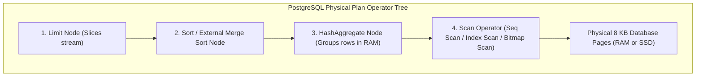

### 1. Physical Scan Operators Compared

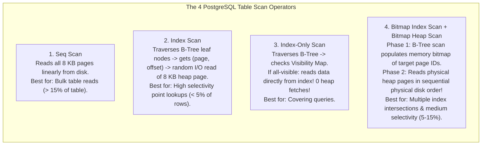

#### The Bitmap Index Scan Lossy Memory Fallback
When executing a Bitmap Index Scan:
1. PostgreSQL allocates an in-memory bitmap in `work_mem`.
2. If `work_mem` is large enough, the bitmap is **Exact**: it stores the exact byte offset of every matching tuple within each page.
3. If the number of matching rows is huge and exceeds `work_mem`, PostgreSQL downgrades the bitmap to **Lossy**: it only tracks which $8\text{ KB}$ pages contain matching rows, discarding the specific tuple offsets.
4. During the subsequent **Bitmap Heap Scan**, PostgreSQL reads the marked pages and must re-evaluate the query predicate on every row in those pages (`Recheck Cond: (status = 'PAID')`)!

### 2. Sort Operators: QuickSort vs External Merge Sort
When sorting rows (`ORDER BY`), PostgreSQL evaluates the estimated memory size of the result set against the session's **`work_mem`** (default $4\text{ MB}$):

| Sort Type | Location | Mechanics | Latency Impact |
| :--- | :--- | :--- | :--- |
| **`quicksort`** | In-Memory RAM | All tuples fit entirely within `work_mem`. Sorted in CPU cache. | Instantaneous ($< 1\text{ ms}$) |
| **`top-N heapsort`** | In-Memory RAM | Used for `ORDER BY ... LIMIT K`. Maintains a bounded binary min-heap of only $K$ elements. | Extremely fast ($< 2\text{ ms}$) |
| **`external merge disk`** | Disk (`pgsql_tmp/`) | Dataset exceeds `work_mem`. Engine partitions data into multiple sorted run files on disk, then executes an $N$-way merge! | Catastrophic latency spike ($100\text{ ms to }30\text{ s}$) |

<Tip>
**Diagnostic Rule**: If your `EXPLAIN (ANALYZE, BUFFERS)` reveals:
```console
Sort Method: external merge  Disk: 42180kB
```
Your query spilled $42\text{ MB}$ to disk temporary files. Increase `work_mem` for that session or query:
```sql
SET work_mem = '64MB';
```
</Tip>

### 3. Aggregate Operators: `HashAggregate` vs `GroupAggregate`
- **`HashAggregate`**: Builds an in-memory hash table where keys are the `GROUP BY` columns and values are the accumulated aggregate states (e.g., `sum`, `count`).
  - *Speed*: $O(N)$ single pass over data.
  - *Hazard*: If the number of distinct groups exceeds `work_mem`, PostgreSQL spills hash partitions to disk.
- **`GroupAggregate`**: Expects input data to arrive **already sorted** on the `GROUP BY` keys (either via an existing B-Tree index or an explicit prior `Sort` node).
  - *Speed*: Streams rows sequentially; emits aggregate result immediately when group key changes. Memory consumption is near-zero ($O(1)$).

---

### 4. Physical Set Operators: `UNION` vs `UNION ALL`, `INTERSECT`, and `EXCEPT`

Set operations combine the result sets of two independent queries. Choosing the wrong set operator in production introduces severe hidden sorting and memory penalties.

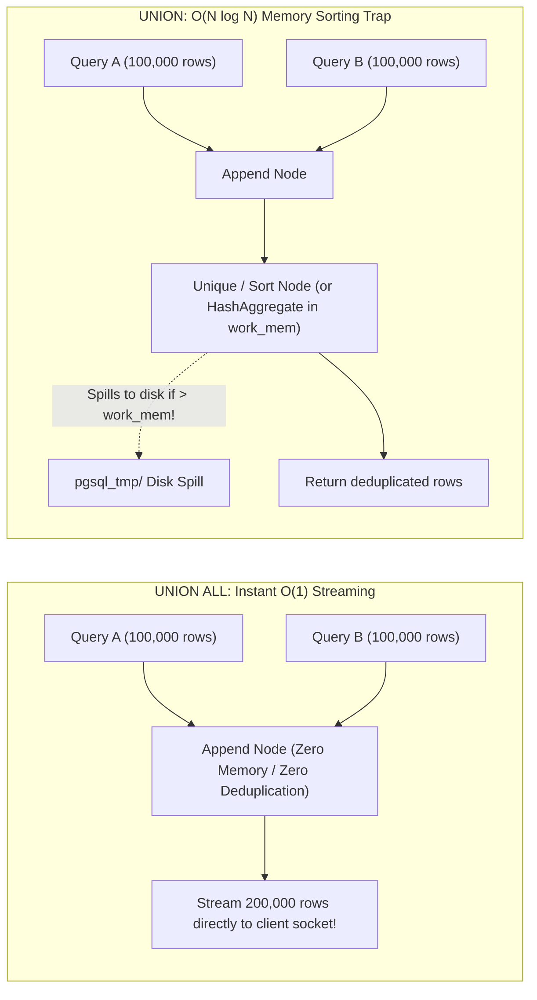

#### The Hidden Cost of Naive `UNION`:
Many developers write `UNION` when they simply mean *"combine these two lists"*.
- **`UNION` (Implicit Deduplication)**: Forces the database engine to eliminate duplicate rows across all projected columns. To do this, PostgreSQL must inject an expensive `Sort -> Unique` operator or a memory-hungry `HashAggregate` operator. If the combined datasets exceed `work_mem`, the sort spills to temporary disk files, turning a sub-millisecond query into a multi-second I/O bottleneck.
- **`UNION ALL` (Zero-Copy Append)**: Concatenates the two result sets without checking for duplicates. It compiles down to a lightweight **`Append`** node that immediately streams rows directly from the first query then the second query into the client socket with **zero memory allocation and zero CPU overhead**.

```sql
-- DANGEROUS IN HIGH-VOLUME OLTP: Spills to disk to deduplicate 2M rows!
SELECT user_id, email FROM archived_users
UNION
SELECT user_id, email FROM active_users;

-- PRODUCTION-GRADE STANDARD: Zero-overhead streaming append
SELECT user_id, email FROM archived_users
UNION ALL
SELECT user_id, email FROM active_users;
```

#### `INTERSECT` and `EXCEPT` Under the Hood:
- **`INTERSECT`**: Returns only rows that appear in **both** query result sets. The executor implements this using a **`HashSetOp Intersect`** node or rewrites it internally to an inner join / semi-join (`WHERE EXISTS (...)`).
- **`EXCEPT` (or `MINUS`)**: Returns rows that exist in the first query but do **not** exist in the second query. The executor processes this via **`HashSetOp Except`** or an anti-join (`WHERE NOT EXISTS (...)`).

<Tip>
**Staff Rule**: Prefer explicit **`WHERE NOT EXISTS`** anti-joins over `EXCEPT` whenever possible. The query planner has significantly greater flexibility to choose covering index scans and nested loop joins for `NOT EXISTS` than it does for rigid set operators.
</Tip>

---

## PostgreSQL Physical Storage Anatomy: The 8 KB Database Page

Relational databases do not write individual rows directly to disk files. PostgreSQL organizes all tables and indexes into **$8\text{ KB}$ fixed-size blocks (pages)**:

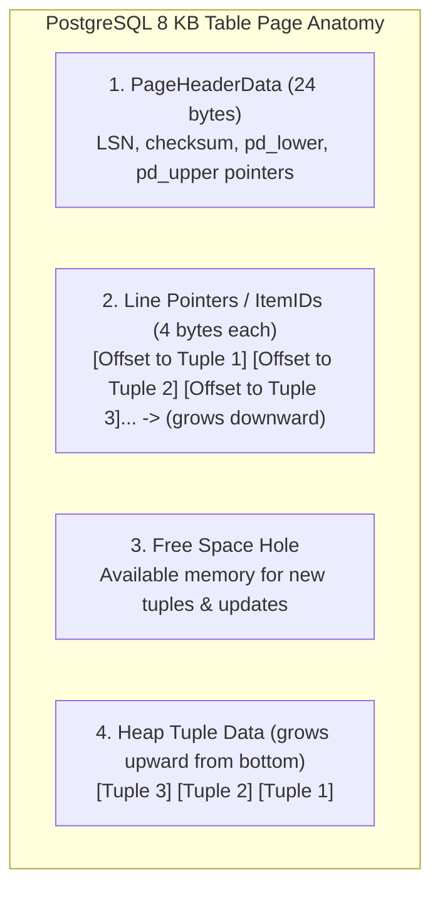

### The 4 Internal Page Sections

1. **`PageHeaderData` (24 bytes)**:
   - `pd_lsn`: The Log Sequence Number of the last Write-Ahead Log (WAL) record that updated this page.
   - `pd_lower`: Byte offset pointing to the end of the Line Pointers array.
   - `pd_upper`: Byte offset pointing to the start of the unallocated tuple space at the bottom of the page.
2. **Line Pointers / ItemIDs (4 bytes each)**:
   - An array of small pointers that grow **downward** from byte 24.
   - Each pointer contains `(offset, length)` pointing to the actual row data at the bottom of the page.
   - Allows index entries to point to `(PageNumber, ItemId)` rather than physical byte offsets. If the row moves within the page, only the line pointer changes; **indexes do not need to be updated**.
3. **Free Space**:
   - The unallocated buffer between `pd_lower` and `pd_upper`. When `pd_lower == pd_upper`, the page is $100\%$ full.
4. **Tuple Data (Heap Tuples)**:
   - Grows **upward** from the bottom of the 8 KB block.
   - Each tuple begins with a **$23\text{ byte}$ `HeapTupleHeaderData`**:
     - `xmin`: Transaction ID that inserted this row.
     - `xmax`: Transaction ID that deleted or updated this row (0 if active).
     - `t_ctid`: Physical tuple ID `(page, item)` pointing to itself, or to the newer version of the row if updated.
     - `t_infomask`: Bit flags storing commit status (e.g., `HEAP_XMIN_COMMITTED`).

---

## The TOAST Engine: Handling Oversized Attributes

Because PostgreSQL pages are strictly $8\text{ KB}$ and rows cannot span across multiple pages, how does PostgreSQL store a $5\text{ MB}$ PDF or a large JSON document in a single column?

PostgreSQL uses **TOAST (The Oversized-Attribute Storage Technique)**:

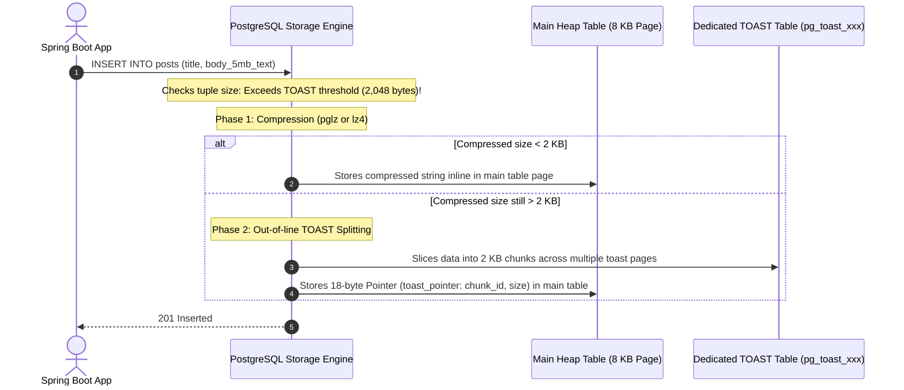

### The 4 TOAST Storage Strategies

| Strategy | Behavior | Typical Column Types |
| :--- | :--- | :--- |
| **`PLAIN`** | Prevents compression and out-of-line storage. Value must fit inline. | `INTEGER`, `BOOLEAN`, `BIGINT`, `DATE` |
| **`EXTENDED`** (Default) | Tries to compress inline; if still too large, moves out-of-line to TOAST table. | `TEXT`, `VARCHAR`, `JSONB`, `BYTEA` |
| **`EXTERNAL`** | Moves out-of-line to TOAST table **without** compression. | Large images/audio that are already compressed. |
| **`MAIN`** | Tries to compress inline; only moves out-of-line if page is completely full. | Short `VARCHAR` strings that fit inline if compressed. |

<Warning>
### The Performance Cost of TOAST Seeks
When you execute `SELECT * FROM posts`, PostgreSQL is forced to perform additional random disk seeks into `pg_toast` to reconstruct large text/json columns, even if your application only needed `title` and `id`!
**Rule**: Always specify explicit columns (`SELECT id, title FROM posts`) to avoid triggering unnecessary TOAST disk deserialization.
</Warning>

---

## Relational Data Types: Currency & Timestamp Precision

### 1. The Floating-Point Currency Disaster
Never store financial currency in `FLOAT` or `DOUBLE` (IEEE 754 floating-point standard). Floating-point numbers represent values in binary fractions ($1/2, 1/4, 1/8$), which cannot accurately represent decimal fractions ($1/10$ or $1/100$):

```sql
-- In PostgreSQL or Java:
SELECT 0.1::float + 0.2::float = 0.3::float;
-- Returns: FALSE! (Actual value is 0.30000000000000004)
```

#### The Production Standard: `NUMERIC` / `DECIMAL`
```sql
CREATE TABLE account_ledger (
    id BIGSERIAL PRIMARY KEY,
    -- Exact arbitrary precision: up to 19 total digits, 4 decimal places
    amount_cents NUMERIC(19, 4) NOT NULL,
    currency VARCHAR(3) NOT NULL DEFAULT 'USD'
);
```
Alternatively, store currency as an integer of atomic micro-units (`BIGINT price_in_cents`).

---

### 2. Timestamps: `TIMESTAMPTZ` vs `TIMESTAMP`
- **`TIMESTAMP` (without time zone)**: Stores raw year-month-day-hour-minute-second without timezone context. If a server in New York inserts `10:00:00`, and a server in London reads it, both read `10:00:00`, despite New York being 5 hours behind!
- **`TIMESTAMPTZ` (with time zone)**: **The Universal Standard**.
  - PostgreSQL converts the input timestamp into **UTC (Coordinated Universal Time)** before saving it to disk.
  - When retrieved, it displays in the requesting client session's timezone, preserving absolute historical time.

```sql
-- Always use TIMESTAMPTZ in production:
created_at TIMESTAMPTZ NOT NULL DEFAULT CURRENT_TIMESTAMP
```

---

### 3. Text Storage, Collation Mechanics & The `varchar_pattern_ops` Prefix Trap

In PostgreSQL, `TEXT`, `VARCHAR`, and `VARCHAR(N)` are physically identical on disk (implemented using the variable-length header struct `varlena`). `VARCHAR(255)` does not save a single byte of disk space; it merely introduces an in-memory check constraint check.

#### The Collation B-Tree Trap: Why `LIKE 'prefix%'` Abandons Indexes
When a database is initialized with standard localized collations (such as `en_US.UTF-8`), PostgreSQL sorts text according to complex linguistic rules (e.g., lowercase and uppercase letters interleaved, accents normalized).

```sql
-- Developer creates a standard B-Tree index:
CREATE INDEX idx_users_email ON users (email);

-- Query with leading prefix:
SELECT id, name FROM users WHERE email LIKE 'alice@%';
```

**The Disaster**: In PostgreSQL, the Cost-Based Optimizer **will NOT use `idx_users_email` for this query!** It will abandon the index and perform a full **Sequential Scan** (`Seq Scan`) across millions of rows!

#### Why the Optimizer Refuses the Index:
Under `en_US.UTF-8`, character ordering is non-deterministic at the raw byte level (for example, `'a'` and `'A'` might have identical primary collation weights). Because the B-Tree was sorted using linguistic collation, the engine cannot mathematically guarantee that all strings starting with byte `'a'` are clustered together in contiguous leaf pages!

#### The Two Production Solutions:
1. **Operator Classes (`varchar_pattern_ops` / `text_pattern_ops`)**:
   Tell PostgreSQL to sort the B-Tree strictly by **raw byte order** rather than linguistic rules:
   ```sql
   CREATE INDEX idx_users_email_prefix ON users (email varchar_pattern_ops);
   ```
   Now `WHERE email LIKE 'alice@%'` executes as an instant $O(\log N)$ **Index Scan**!
2. **Deterministic C Collation**:
   Specify `COLLATE "C"` explicitly:
   ```sql
   CREATE INDEX idx_users_email_c ON users (email COLLATE "C");
   ```

---

### 4. Generated Columns (`STORED`) vs. Functional / Expression Indexes

Modern relational applications frequently perform queries on derived or normalized expressions (such as case-insensitive lookups or calculated totals).

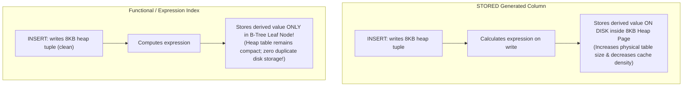

#### Generated Columns (`GENERATED ALWAYS AS ... STORED`):
```sql
CREATE TABLE orders (
    id BIGINT PRIMARY KEY,
    unit_price NUMERIC(12, 2) NOT NULL,
    quantity INT NOT NULL,
    -- Physically stored inside the 8KB heap page for every row:
    total_price NUMERIC(12, 2) GENERATED ALWAYS AS (unit_price * quantity) STORED
);
```
- **Advantage**: Simpler application queries (`SELECT total_price FROM orders`); PostgreSQL automatically collects statistics on the column.
- **Disadvantage**: Consumes physical heap storage and disk I/O on every insert and update. (PostgreSQL does not currently support non-stored virtual columns).

#### Functional / Expression Indexes:
When the goal is purely fast search without altering table heap geometry, use an expression index:

```sql
-- Creates an index strictly on the lowercased email expression:
CREATE INDEX idx_users_lower_email ON users (lower(email));

-- Fast O(log N) Index Scan:
SELECT id, name FROM users WHERE lower(email) = 'alice@example.com';
```
- **Advantage**: Zero extra bytes written to the table heap. The lowercased string exists only in B-Tree leaf pages.
- **Caveat**: The query predicate must match the indexed expression **character-for-character**. `WHERE lower(email) = ?` will use the index; `WHERE email = ?` will not!

---

## Analytical Window Functions Masterclass

Standard aggregate functions (`SUM`, `AVG`, `COUNT`) collapse multiple rows into a single summary row using `GROUP BY`.
**Window Functions** perform calculations across a set of table rows related to the current row **without collapsing individual rows**:

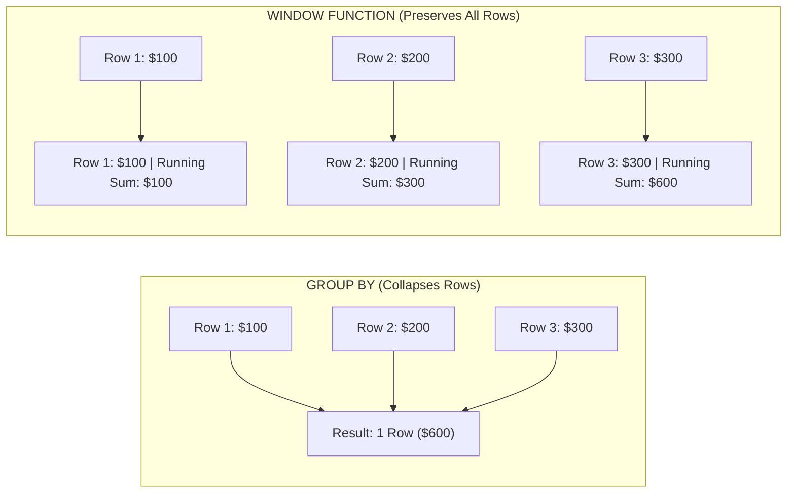

### Complete Schema & Test Data

```sql
CREATE TABLE financial_transactions (
    id BIGSERIAL PRIMARY KEY,
    account_id BIGINT NOT NULL,
    transaction_date DATE NOT NULL,
    category VARCHAR(50) NOT NULL,
    amount NUMERIC(12, 2) NOT NULL
);

INSERT INTO financial_transactions (account_id, transaction_date, category, amount) VALUES
(101, '2026-09-01', 'PAYROLL', 5000.00),
(101, '2026-09-03', 'GROCERIES', -150.00),
(101, '2026-09-05', 'UTILITIES', -200.00),
(101, '2026-09-07', 'DINING', -150.00),
(101, '2026-09-10', 'INVESTMENT', 1200.00),
(102, '2026-09-02', 'PAYROLL', 4200.00),
(102, '2026-09-04', 'RENT', -1800.00);
```

---

### 1. Ranking Functions: `ROW_NUMBER()` vs `RANK()` vs `DENSE_RANK()`

```sql
SELECT 
    account_id,
    category,
    amount,
    -- Strictly sequential 1, 2, 3, 4 (Arbitrary break on ties)
    ROW_NUMBER() OVER (PARTITION BY account_id ORDER BY amount DESC) as row_num,
    -- Leaves gaps on ties: 1, 2, 2, 4
    RANK() OVER (PARTITION BY account_id ORDER BY amount DESC) as rank_val,
    -- No gaps on ties: 1, 2, 2, 3
    DENSE_RANK() OVER (PARTITION BY account_id ORDER BY amount DESC) as dense_rank_val
FROM financial_transactions;
```

#### Execution Output

| account_id | category | amount | row_num | rank_val | dense_rank_val | Architectural Note |
| :--- | :--- | :--- | :--- | :--- | :--- | :--- |
| **101** | PAYROLL | 5000.00 | 1 | 1 | 1 | Highest transaction |
| **101** | INVESTMENT | 1200.00 | 2 | 2 | 2 | Second highest |
| **101** | GROCERIES | -150.00 | 3 | 3 | 3 | Tied value |
| **101** | DINING | -150.00 | 4 | 3 | 3 | Tied value (Both rank 3) |
| **101** | UTILITIES | -200.00 | 5 | 5 | 4 | Note: `RANK` skips to 5; `DENSE_RANK` assigns 4! |

---

### 2. Relative Value Extraction: `LAG()` and `LEAD()`

`LAG()` accesses data from a previous row, and `LEAD()` accesses data from a subsequent row without requiring self-joins:

```sql
SELECT 
    transaction_date,
    amount,
    -- Fetches the previous transaction amount for this account
    LAG(amount, 1, 0.00) OVER (PARTITION BY account_id ORDER BY transaction_date) as prev_amount,
    -- Calculates percentage change from previous transaction
    ROUND(
        (amount - LAG(amount, 1, amount) OVER (PARTITION BY account_id ORDER BY transaction_date)) / 
        NULLIF(ABS(LAG(amount, 1, amount) OVER (PARTITION BY account_id ORDER BY transaction_date)), 0) * 100, 
        2
    ) as pct_change
FROM financial_transactions
WHERE account_id = 101;
```

---

### 3. Sliding Window Frames: `ROWS` vs `RANGE` & The Default Frame Trap

The window frame clause defines the exact subset of rows in the partition evaluated for each row.

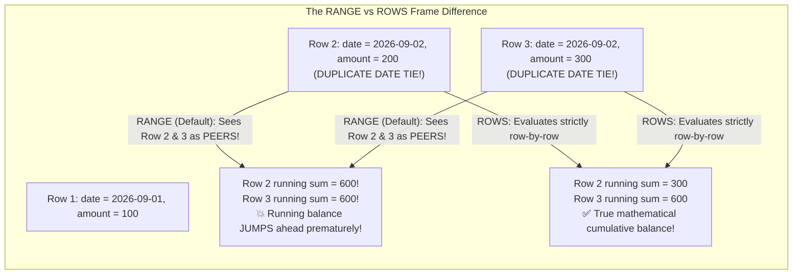

<Warning>
### The Treacherous Default Window Frame Trap
When you write:
```sql
SUM(amount) OVER (PARTITION BY account_id ORDER BY transaction_date)
```
SQL standards dictate a hidden default frame:
```sql
RANGE BETWEEN UNBOUNDED PRECEDING AND CURRENT ROW
```
Because `RANGE` operates on **value peers** rather than physical rows, if multiple rows share the exact same `transaction_date`, PostgreSQL aggregates all peer rows together for every peer! 

**Production Rule**: For true physical running totals, always specify **`ROWS`**:
```sql
SUM(amount) OVER (
    PARTITION BY account_id 
    ORDER BY transaction_date 
    ROWS BETWEEN UNBOUNDED PRECEDING AND CURRENT ROW
) as running_balance
```
</Warning>

### 4. Advanced Analytics: `NTILE`, `PERCENT_RANK`, and First/Last Values

```sql
SELECT 
    id,
    amount,
    -- Splits transactions into 4 equal quartiles (1, 2, 3, 4)
    NTILE(4) OVER (ORDER BY amount) AS quartile,
    -- Relative rank from 0.0 to 1.0 (percentile rank)
    ROUND(PERCENT_RANK() OVER (ORDER BY amount)::numeric, 3) AS pct_rank,
    -- First transaction amount in the account's history
    FIRST_VALUE(amount) OVER (
        PARTITION BY account_id 
        ORDER BY transaction_date
        ROWS BETWEEN UNBOUNDED PRECEDING AND UNBOUNDED FOLLOWING
    ) AS initial_deposit,
    -- Latest transaction amount in the account's history
    LAST_VALUE(amount) OVER (
        PARTITION BY account_id 
        ORDER BY transaction_date
        ROWS BETWEEN UNBOUNDED PRECEDING AND UNBOUNDED FOLLOWING
    ) AS most_recent_amount
FROM financial_transactions;
```

---

## Hierarchical Recursive CTEs with Cycle Detection

Common Table Expressions (CTEs) define temporary named result sets using `WITH`.

### PostgreSQL 12+ Inlining vs `MATERIALIZED` Optimization Fences
In PostgreSQL 11 and older, all CTEs acted as **strict optimization fences**: PostgreSQL computed the CTE in RAM completely before executing the outer query, preventing the query optimizer from pushing down `WHERE` filters into the CTE.

In PostgreSQL 12+, CTEs are automatically inlined into the main query plan. If you explicitly need to force PostgreSQL to evaluate a CTE once and prevent inlining:
```sql
WITH expensive_stats AS MATERIALIZED (
    SELECT category, AVG(amount) FROM financial_transactions GROUP BY category
)
SELECT * FROM expensive_stats WHERE category = 'UTILITIES';
```

### Traversal of Deeply Nested Comment Trees

```sql
CREATE TABLE comments (
    id BIGSERIAL PRIMARY KEY,
    parent_id BIGINT REFERENCES comments(id),
    post_id BIGINT NOT NULL,
    author VARCHAR(50) NOT NULL,
    body TEXT NOT NULL
);

INSERT INTO comments (id, parent_id, post_id, author, body) VALUES
(1, NULL, 99, 'alice', 'Top-level question?'),
(2, 1,    99, 'bob',   'Direct answer to Alice'),
(3, 2,    99, 'charlie','Follow-up reply to Bob'),
(4, 1,    99, 'david', 'Alternative answer to Alice');
```

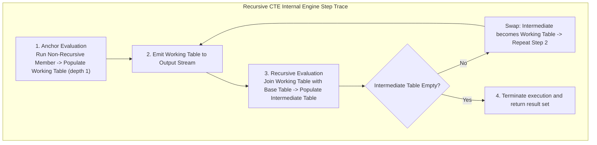

```sql
-- Recursive Query with PostgreSQL 14+ Cycle Detection
WITH RECURSIVE comment_tree AS (
    -- Anchor Member: Find all root comments (parent_id IS NULL)
    SELECT 
        id, 
        parent_id, 
        author, 
        body, 
        1 as depth,
        ARRAY[id] as path
    FROM comments
    WHERE post_id = 99 AND parent_id IS NULL

    UNION ALL

    -- Recursive Member: Join children to parents
    SELECT 
        c.id, 
        c.parent_id, 
        c.author, 
        c.body, 
        ct.depth + 1,
        ct.path || c.id
    FROM comments c
    JOIN comment_tree ct ON c.parent_id = ct.id
)
CYCLE id SET is_cycle USING cycle_path
SELECT 
    id, 
    parent_id, 
    REPEAT('  --> ', depth - 1) || author || ': ' || body as indented_comment,
    depth,
    path
FROM comment_tree
ORDER BY path;
```

---

## Atomic Conflict Handling: `UPSERT` (`ON CONFLICT`) vs Standard `MERGE`

Modern high-concurrency backends must handle concurrent inserts idempotently without throwing duplicate key errors.

```mermaid
sequenceDiagram
    autonumber
    actor Worker1 as Pod 1 (Concurrent User Sync)
    actor Worker2 as Pod 2 (Concurrent User Sync)
    participant DB as PostgreSQL Engine (Unique Index on email)

    Worker1->>DB: INSERT INTO users (email, login_count) VALUES ('alice@x.com', 1)
    Worker2->>DB: INSERT INTO users (email, login_count) VALUES ('alice@x.com', 1)
    
    Note over DB: Worker 1 inserts tuple first; acquires Row Exclusive lock.
    Note over DB: Worker 2 detects Unique Key Conflict!
    
    alt Standard INSERT without Conflict Handler
        DB-->>Worker2: 💥 ERROR: duplicate key value violates unique constraint "users_email_key"
    else ON CONFLICT (email) DO UPDATE
        Note over DB: Engine pivots Worker 2's statement into UPDATE on existing row!
        DB-->>Worker2: 200 OK (login_count incremented to 2)
    end
```

### The PostgreSQL `ON CONFLICT` Construct
```sql
INSERT INTO user_analytics (user_id, last_seen, event_count)
VALUES (42, NOW(), 1)
ON CONFLICT (user_id) 
DO UPDATE SET 
    last_seen = EXCLUDED.last_seen,
    event_count = user_analytics.event_count + 1
WHERE user_analytics.last_seen < EXCLUDED.last_seen;
```

Line by line:
- `INSERT INTO user_analytics ...`: The optimistic attempt to insert a new row.
- `ON CONFLICT (user_id)`: Specifies the unique index or primary key target. An explicit unique index on `user_id` **is mandatory**.
- `DO UPDATE SET`: If another transaction already committed `user_id = 42`, PostgreSQL acquires a row-level lock on the conflicting row and updates it.
- `EXCLUDED`: A special pseudo-relation containing the row proposed for insertion.
- `WHERE user_analytics.last_seen < EXCLUDED.last_seen`: Concurrency guard preventing older events from overwriting newer timestamps!

### `ON CONFLICT` vs SQL:2016 Standard `MERGE` (PostgreSQL 15+)
PostgreSQL 15 introduced standard SQL `MERGE`:
```sql
MERGE INTO customer_balance cb
USING incoming_payments ip ON cb.customer_id = ip.customer_id
WHEN MATCHED THEN
    UPDATE SET balance = cb.balance + ip.amount
WHEN NOT MATCHED THEN
    INSERT (customer_id, balance) VALUES (ip.customer_id, ip.amount);
```

| Feature | `INSERT ... ON CONFLICT` | `MERGE` (PostgreSQL 15+) |
| :--- | :--- | :--- |
| **Concurrency Safety** | **Atomic**: Specially handles concurrent inserts without race conditions. | Vulnerable to concurrent race conditions if two threads run `MERGE` simultaneously! |
| **Prerequisite** | Requires an explicit unique index on conflict target. | Operates on arbitrary join conditions. |
| **Use Case** | Single-row high-throughput OLTP upserts (APIs). | Bulk batch syncing from staging/ETL tables. |

---

## SQL Injection AST Deconstruction & Prepared Statements

Why is SQL injection so dangerous, and why do Prepared Statements make it mathematically impossible?

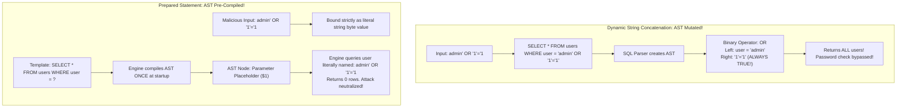

### The AST Mechanics
1. **Dynamic String Concatenation**:
   When you concatenate input strings (`"WHERE email = '" + input + "'"`), the SQL parser treats the user's quotes and operators as **syntactic control tokens**. The SQL engine builds a mutated **Abstract Syntax Tree (AST)** that contains new boolean logic clauses that the developer never intended.
2. **Prepared Statements (Parameterized Queries)**:
   In a prepared statement, the database engine compiles the SQL AST **first** with parameter placeholders (`$1`, `$2`). The execution plan is finalized.
   When the user parameters arrive over the network, the database engine treats them strictly as **scalar literal data values** assigned to memory slots in the execution plan. The string can contain semicolons, quotes, or `OR 1=1`—the engine will never execute them as code!

---

## Interactive SQL Hands-On Verification Sandbox

Test these physical behaviors directly in `psql` or your database GUI. This self-contained verification script proves the 3VL collapse, the window frame peer-sum bug, and recursive cycle detection:

```sql
-- ============================================================================
-- BACKEND MASTERY: SQL PHYSICAL INTERNALS LAB SANDBOX
-- ============================================================================

BEGIN;

-- ----------------------------------------------------------------------------
-- PROOF 1: The Three-Valued Logic (3VL) NULL Omission Trap
-- ----------------------------------------------------------------------------
CREATE TEMP TABLE test_orders (
    id INT PRIMARY KEY,
    status VARCHAR(20)
);

INSERT INTO test_orders VALUES (1, 'PAID'), (2, 'CANCELLED'), (3, NULL);

-- Naive query: Expects 2 rows (id 1 and 3), but returns ONLY id 1!
SELECT * FROM test_orders WHERE status != 'CANCELLED';
-- Proof output: Row 3 is silently excluded because (NULL != 'CANCELLED') evaluates to UNKNOWN!

-- Correct production query:
SELECT * FROM test_orders WHERE status IS DISTINCT FROM 'CANCELLED';
-- Proof output: Correctly returns id 1 and id 3!

-- ----------------------------------------------------------------------------
-- PROOF 2: The Default Window Frame Range Peer-Sum Trap
-- ----------------------------------------------------------------------------
CREATE TEMP TABLE test_ledger (
    tx_time DATE,
    amount INT
);

-- Note: Two transactions share the EXACT same date ('2026-03-02')
INSERT INTO test_ledger VALUES 
    ('2026-03-01', 100),
    ('2026-03-02', 200),
    ('2026-03-02', 300),
    ('2026-03-03', 400);

SELECT 
    tx_time, 
    amount,
    -- DANGEROUS DEFAULT: Uses RANGE (jumps to 600 prematurely for both March 2 rows!)
    SUM(amount) OVER (ORDER BY tx_time) AS dangerous_range_sum,
    -- SAFE PRODUCTION STANDARD: Uses ROWS (correctly yields 300 then 600!)
    SUM(amount) OVER (ORDER BY tx_time ROWS BETWEEN UNBOUNDED PRECEDING AND CURRENT ROW) AS true_cumulative_sum
FROM test_ledger;

-- ----------------------------------------------------------------------------
-- PROOF 3: UNION vs UNION ALL Execution Plan Inspection
-- ----------------------------------------------------------------------------
-- Notice the "Unique -> Sort" node in UNION versus the instant "Append" in UNION ALL:
EXPLAIN (COSTS OFF)
SELECT status FROM test_orders
UNION
SELECT status FROM test_orders;

EXPLAIN (COSTS OFF)
SELECT status FROM test_orders
UNION ALL
SELECT status FROM test_orders;

-- ----------------------------------------------------------------------------
-- PROOF 4: Recursive CTE with Cycle Detection Defense
-- ----------------------------------------------------------------------------
CREATE TEMP TABLE test_graph (
    node_id INT,
    next_node INT
);

-- Graph with an intentional infinite loop: 1 -> 2 -> 3 -> 1
INSERT INTO test_graph VALUES (1, 2), (2, 3), (3, 1);

-- Cycle detection stops infinite loop safely:
WITH RECURSIVE traverse AS (
    SELECT node_id, next_node, ARRAY[node_id] AS path, false AS is_cycle
    FROM test_graph WHERE node_id = 1
    UNION ALL
    SELECT g.node_id, g.next_node, path || g.node_id, g.node_id = ANY(path)
    FROM test_graph g
    JOIN traverse t ON g.node_id = t.next_node
    WHERE NOT t.is_cycle
)
SELECT * FROM traverse;

ROLLBACK; -- Clean rollback: leaves zero temporary data behind!
```

---

## SQL Fundamentals Interview Map

### 1. `WHERE` vs `HAVING`
`WHERE` filters rows before grouping. `HAVING` filters groups after aggregation.

```sql
SELECT user_id, COUNT(*) AS order_count
FROM orders
WHERE status = 'PAID'
GROUP BY user_id
HAVING COUNT(*) >= 3;
```

### 2. `NULL` Is Unknown, Not Empty
`NULL` means missing or unknown. It does not equal anything, even another `NULL`.
- `WHERE deleted_at = NULL` is always `UNKNOWN` (returns 0 rows).
- Use `WHERE deleted_at IS NULL`.
- `NOT IN (subquery with NULL)` fails completely; always use `NOT EXISTS`.

### 3. Inner Join vs Left Join
`INNER JOIN` returns only matching rows. `LEFT JOIN` keeps every row from the left table and fills missing right-side values with `NULL`.

### 4. Why `SELECT *` Hurts Production
- Forces unnecessary TOAST table out-of-line seeks.
- Evicts active pages from the shared buffer cache.
- Bypasses Index-Only scans.
- Increases JVM garbage collection overhead.

---

## Active Recall & Interview Mastery

<AccordionGroup>
  <Accordion title="1. Walk through the physical 11 steps of the logical query processing order.">
    1. `FROM`: Evaluates table sources and cartesian cross-products.
    2. `ON`: Applies join condition predicates.
    3. `JOIN`: Merges relations into virtual joined tables.
    4. `WHERE`: Filters individual rows before grouping.
    5. `GROUP BY`: Groups rows sharing keys into aggregate buckets.
    6. `HAVING`: Filters aggregated buckets.
    7. `WINDOW`: Calculates analytical window functions (`OVER (PARTITION BY ...)`).
    8. `SELECT`: Projects columns, calculates expressions, assigns aliases.
    9. `DISTINCT`: Eliminates duplicate rows.
    10. `ORDER BY`: Sorts the final output rows (aliases become available here).
    11. `LIMIT / OFFSET`: Slices the returned row window.
  </Accordion>

  <Accordion title="2. Why does WHERE status != 'CANCELLED' silently discard rows where status IS NULL?">
    SQL uses Three-Valued Logic (3VL). When evaluating `NULL != 'CANCELLED'`, the result is neither `TRUE` nor `FALSE`; it evaluates to `UNKNOWN`. In an SQL `WHERE` clause, a row is returned only if the condition evaluates strictly to `TRUE`. Because `UNKNOWN` is not `TRUE`, all NULL rows are silently filtered out.
  </Accordion>

  <Accordion title="3. Why does NOT IN return zero rows if the subquery contains a NULL value, and how does NOT EXISTS solve this?">
    `x NOT IN (1, 2, NULL)` expands to `x != 1 AND x != 2 AND x != NULL`. Because `x != NULL` evaluates to `UNKNOWN`, the entire logical `AND` chain evaluates to `UNKNOWN` or `FALSE`. It can never evaluate to `TRUE`, causing zero rows to be returned. `NOT EXISTS` tests for the existence of rows matching a correlated predicate, preserving correct three-valued anti-join semantics without collapsing.
  </Accordion>

  <Accordion title="4. What is the difference between Index Scan, Index-Only Scan, and Bitmap Index Scan?">
    - **Index Scan**: Traverses the B-Tree index to find tuple identifiers (`ctid`), then performs random disk seeks to fetch the physical 8 KB table heap page for every matching row.
    - **Index-Only Scan**: Fetches required column data directly from B-Tree leaf pages without visiting the table heap, verified via the Visibility Map.
    - **Bitmap Index Scan**: Scans the index to build an in-memory bitmap of target page numbers, then executes a Bitmap Heap Scan reading table pages in sequential physical disk block order, minimizing disk head movements.
  </Accordion>

  <Accordion title="5. Explain the dangerous default window frame in SQL running sums and how to fix it.">
    When specifying `OVER (ORDER BY date)` without an explicit frame, SQL defaults to `RANGE BETWEEN UNBOUNDED PRECEDING AND CURRENT ROW`. Because `RANGE` treats duplicate date values as peers, it sums all peer rows together for every peer row, causing running totals to jump ahead prematurely. To ensure true row-by-row cumulative sums, explicitly specify `ROWS BETWEEN UNBOUNDED PRECEDING AND CURRENT ROW`.
  </Accordion>

  <Accordion title="6. What is the difference between INSERT ... ON CONFLICT and standard SQL MERGE under high concurrency?">
    `INSERT ... ON CONFLICT` is atomic and explicitly engineered for high-concurrency OLTP workloads; if two threads attempt concurrent inserts on the same unique key, PostgreSQL safely pivots one into an update without failing. Standard SQL `MERGE` evaluates join conditions over an entire dataset and is susceptible to concurrent race conditions and serialization deadlocks if multiple threads run `MERGE` concurrently on overlapping rows.
  </Accordion>

  <Accordion title="7. Why does naive UNION cause massive performance degradation compared to UNION ALL?">
    `UNION` implies strict duplicate elimination across all projected columns. The query planner must inject a `Sort -> Unique` operator or a memory-intensive `HashAggregate` operator. If the combined datasets exceed `work_mem`, the sort spills multi-megabyte temporary run files to disk (`pgsql_tmp/`), causing heavy disk I/O. In contrast, `UNION ALL` performs zero deduplication; it compiles to an instantaneous $O(1)$ `Append` operator that streams rows directly to the client socket without CPU sorting or memory overhead.
  </Accordion>

  <Accordion title="8. Why does LIKE 'prefix%' fail to use a B-Tree index under default localized collations, and how do you fix it?">
    Under standard Unicode locales (such as `en_US.UTF-8`), PostgreSQL sorts text according to complex linguistic rules where lowercase and uppercase characters interleave. Because the physical B-Tree ordering does not match byte-by-byte string boundaries, the Cost-Based Optimizer cannot guarantee that all strings starting with the prefix lie in contiguous leaf pages, causing it to abandon the index for a full Sequential Scan. To fix this, create the index using an operator class (`CREATE INDEX ON table (column varchar_pattern_ops)`) or specify raw byte collation (`COLLATE "C"`).
  </Accordion>
</AccordionGroup>

---

## Done Checklist

<Check>
- [ ] Understand the physical 11 steps of the logical query processing order and explain why aliases fail in `WHERE`.
- [ ] Master SQL Three-Valued Logic (3VL) truth tables and eliminate silent NULL row omission in `!=` queries.
- [ ] Replace dangerous `NOT IN (NULL)` subqueries with safe `NOT EXISTS` anti-joins.
- [ ] Differentiate the 4 physical scan operators (`Seq Scan`, `Index Scan`, `Index-Only Scan`, `Bitmap Scan`) and bitmap lossy memory fallbacks.
- [ ] Diagnose sort and hash disk spills in `pgsql_tmp/` and tune session-level `work_mem`.
- [ ] Replace expensive CPU-bound `UNION` operators with zero-copy streaming `UNION ALL` appends.
- [ ] Master PostgreSQL 8 KB page storage geometry: PageHeaderData, ItemIDs, Free Space Hole, and Heap Tuples.
- [ ] Explain the TOAST out-of-line storage engine threshold (2 KB) and avoid high-cost TOAST seeks.
- [ ] Eliminate binary floating-point financial corruption by using arbitrary-precision `NUMERIC` or atomic integer micro-units.
- [ ] Prevent index abandonment on `LIKE 'prefix%'` queries using `varchar_pattern_ops` or `COLLATE "C"`.
- [ ] Implement advanced analytical window functions (`ROW_NUMBER`, `RANK`, `DENSE_RANK`, `LAG`, `LEAD`).
- [ ] Defend against the default window frame peer-sum trap by explicitly defining `ROWS BETWEEN UNBOUNDED PRECEDING AND CURRENT ROW`.
- [ ] Build hierarchical recursive CTEs with array-based cycle detection guards.
- [ ] Execute atomic concurrency-safe upserts using `INSERT ... ON CONFLICT (key) DO UPDATE`.
- [ ] Understand SQL injection AST manipulation and explain how Prepared Statements separate compilation from parameter assignment.
</Check>
