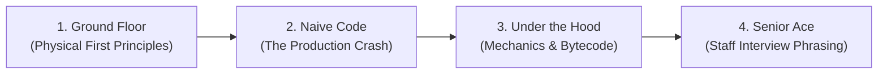

# Simple English & The "Zero Assumptions, Infinite Depth" Standard

Backend engineering is often taught with an invisible wall of gatekeeping. Documentation either treats readers like children with shallow "Hello World" tutorials, or writes like a senior architect speaking to another senior architect—skipping first principles and drowning in unexplained jargon.

Our standard is **Zero Assumptions, Infinite Depth**:
- **Zero Assumptions**: Assume the reader is a basic Java developer who knows primitive syntax, but has never touched production, never scaled a database, and never debugged a race condition.
- **Infinite Depth**: Do not water down the engineering. Take them all the way to staff-level mastery by building from physical hardware, CPU caches, RAM pointers, and TCP sockets.

---

## The 4-Phase Escalation Formula

Every deep chapter must follow this progressive bridge:

### 1. Ground Floor: Physical First Principles
Never start with an abstraction. Start with physical hardware:
- Don't start with "HikariCP pools connections." Start with: *What physically happens when a Java socket connects to port 5432 on a Linux server?* (TCP 3-way handshake, OS socket buffers, PostgreSQL forks a backend worker process consuming 5MB RAM).
- Don't start with `@Transactional`. Start with: *What happens if two threads update the same bank balance at the exact same millisecond in memory?*

### 2. The Naive Code: The Production Crash
Show what a beginner naturally writes, and show exactly how and why it blows up in production:
- Write the naive JDBC code, the raw `new Thread()`, or the `SELECT *` inside a `for` loop.
- Show the catastrophic failure: OutOfMemoryError, 100% CPU lock, connection pool exhaustion, or lost database updates.
- **Rule**: The learner must feel the pain of the problem before they appreciate the elegance of the solution.

### 3. Under the Hood: Demystifying the Magic
Strip away all framework magic. Never say "Spring handles this automatically."
- Show the CGLIB dynamic proxy bytecode wrapping the bean.
- Show the B-Tree node page split on disk.
- Show the PostgreSQL Write-Ahead Log (WAL) sequential disk append.
- When a beginner understands the physical mechanics behind the abstraction, they understand it better than 90% of senior developers who only memorized annotations.

### 4. Senior Interview Ace: Junior vs. Staff Phrasing
Arm the learner with the exact vocabulary and trade-offs required to ace senior/staff technical interviews:
- Provide explicit contrasts:
  - **Junior Answer**: *"We put `@Transactional` on the service method so it rolls back on errors."*
  - **Senior/Staff Answer**: *"Spring wraps the bean in an AOP proxy intercepting method invocations via `TransactionInterceptor`. If invoked internally via `this.method()`, the proxy is bypassed because Java resolves the call locally. Furthermore, checked exceptions do not trigger a rollback by default unless explicitly configured with `rollbackFor = Exception.class`..."*

---

## Editorial Checklist

1. **Explain the 'Why' Before the Tool**: Why was this invented in the 1990s or 2000s? What pain forced engineers to build it?
2. **Plain English First, Technical Term Second**: Use familiar, concrete words first. Introduce the formal technical term immediately after explaining its mechanical function.
3. **No Magical Jargon**: If you write "AOP Proxy," "Virtual Threads," or "Write-Ahead Log," explain the physical concept in the very next sentence.
4. **Concrete Over Abstract**: Replace abstract diagrams with concrete numbers (e.g., *1,000 requests/sec with 50ms database latency = 50 concurrent connections*).
5. **Interview-Ready Mental Models**: Every topic must equip the learner to explain trade-offs, limitations, and failure recovery in an interview room without hesitation.
