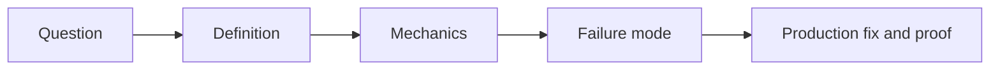

# Master Backend Question Bank

This page is not a list of trivia. It is a pressure system for learning. Every question should be answered in four layers:



When you answer, do not stop at "what it is." Say:

1. What problem it solves.
2. What happens under the hood.
3. What beginner mistake breaks production.
4. What code, SQL, test, metric, or diagram proves the fix.

---

## 1. Backend Fundamentals

| Question | What the interviewer is testing |
| --- | --- |
| What is a backend server, physically and logically? | Process, port, socket, request handling |
| What happens after a browser sends a request to your API? | DNS, TCP, TLS, load balancer, app, DB |
| What is the difference between frontend validation and backend validation? | Trust boundary |
| Why must the backend never trust the client? | Security and invariants |
| What is a port? | OS networking basics |
| What is a socket? | TCP connection anatomy |
| What is the difference between connection timeout and read timeout? | Failure isolation |
| Why does a slow downstream API break your backend? | Thread and connection exhaustion |
| What is horizontal scaling? | Stateless design |
| Why do sticky sessions hurt scaling? | State placement |
| What is a load balancer actually doing? | Routing and health checks |
| What is the difference between Layer 4 and Layer 7 load balancing? | TCP vs HTTP awareness |
| What is backpressure? | Controlling overload |
| What is graceful shutdown? | Draining in-flight work |
| What happens if a pod is killed during a request? | Termination and retry behavior |

Deep follow-ups:

| Follow-up | Expected depth |
| --- | --- |
| Draw the checkout request lifecycle. | Client to gateway to security filter to transaction to database to event |
| Where can latency enter the path? | DNS, TLS, queueing, app threads, DB locks, downstream calls |
| Where can duplicate work appear? | Retries, queue redelivery, webhook replay |
| Where do you put business invariants? | Server-side domain and database boundaries |
| How do you prove an endpoint is production-ready? | Tests, metrics, logs, failure drills |

---

## 2. Java Core & JVM

| Question | What the interviewer is testing |
| --- | --- |
| Is Java pass-by-value or pass-by-reference? | Stack frames and object references |
| What is the difference between heap and stack? | JVM memory model |
| What is an object header? | HotSpot object layout |
| Why can autoboxing hurt performance? | Allocation and GC pressure |
| Why is `String` immutable? | Pooling, safety, hashing |
| What is the difference between `==` and `.equals()`? | Reference vs logical equality |
| How should equals/hashCode work for entities? | Identity lifecycle |
| What are records good for? | Immutable DTOs and value carriers |
| Why can mutable records still be dangerous? | Shallow immutability |
| What is the classloader? | Runtime type loading |
| What is JIT compilation? | Hot path optimization |
| What is a safepoint? | GC and runtime coordination |
| What is the difference between G1GC and ZGC? | Pause-time trade-offs |
| What causes a memory leak in Java? | Retained references |
| How do you inspect a heap dump? | Dominator tree and retained size |

Code pressure:

| Task | Skill proven |
| --- | --- |
| Explain why this `HashMap` key disappears after mutation. | hashCode contract |
| Rewrite a loop to avoid boxing. | allocation control |
| Identify a retained object path in a heap dump. | memory forensics |
| Explain why `final` helps but does not make objects deeply immutable. | object graph reasoning |
| Compare virtual threads and platform threads. | Java 21 concurrency |

---

## 3. OOP, Collections, Generics & Streams

| Question | What the interviewer is testing |
| --- | --- |
| What is encapsulation in production code? | Invariant protection |
| Why is an anemic domain model dangerous? | Business logic scattering |
| Interface or abstract class? | Contract vs shared implementation |
| Inheritance or composition? | Change safety |
| What is polymorphism actually doing? | Dynamic dispatch |
| Why is `ArrayList` often faster than `LinkedList`? | CPU cache locality |
| How does `HashMap` find a key? | hash, bucket, equality |
| What is HashMap treeification? | collision defense |
| What is `ConcurrentModificationException`? | iterator fail-fast mechanics |
| What is the difference between immutable and unmodifiable collections? | mutation source |
| What is type erasure? | runtime generic metadata |
| What are bridge methods? | polymorphism after erasure |
| Explain PECS. | variance |
| Why are streams lazy? | pipeline execution |
| Why can `parallelStream()` be bad in web apps? | shared ForkJoinPool pressure |

Deep follow-ups:

| Follow-up | Expected depth |
| --- | --- |
| Show a rich domain method replacing a setter. | domain modeling |
| Explain why mutable map keys are dangerous. | collection invariants |
| Explain `List<? extends Number>` vs `List<? super Integer>`. | producer/consumer variance |
| Debug a slow stream pipeline. | boxing, stateful ops, parallelism |
| Design exception hierarchy for an API. | error boundaries |

---

## 4. Concurrency & Threads

| Question | What the interviewer is testing |
| --- | --- |
| What is a thread? | OS scheduling |
| What is a race condition? | shared mutable state |
| What is visibility? | CPU caches and JMM |
| What does `volatile` guarantee? | happens-before |
| Why is `volatile count++` broken? | compound atomicity |
| What is CAS? | lock-free primitive |
| What is a deadlock? | lock ordering |
| What is a thread pool? | bounded concurrency |
| Why are unbounded executor queues dangerous? | memory and latency |
| What is `ThreadLocal` used for? | request context |
| How can `ThreadLocal` leak memory? | pooled workers |
| What are virtual threads? | cheap blocking concurrency |
| What is carrier thread pinning? | virtual thread caveat |
| When should you use `ReentrantLock`? | explicit lock control |
| How do you test a race condition? | latches and concurrent execution |

Proof drills:

| Drill | Expected proof |
| --- | --- |
| Build a lost update with 50 threads. | incorrect final count |
| Fix with `AtomicInteger`. | correct final count |
| Create a deadlock. | thread dump shows waiting cycle |
| Remove ThreadLocal cleanup. | leaked context between requests |
| Compare platform vs virtual threads under blocking I/O. | throughput and memory observation |

---

## 5. Spring Core, MVC, AOP & Async

| Question | What the interviewer is testing |
| --- | --- |
| What is the Spring container? | bean lifecycle |
| What is dependency injection? | construction and wiring |
| Why prefer constructor injection? | immutability and testability |
| What is a bean scope? | object lifetime |
| What is a singleton bean in Spring? | one object shared by threads |
| Why is mutable state inside singleton services dangerous? | cross-request data leak |
| What is `BeanPostProcessor`? | lifecycle customization |
| What is `DispatcherServlet`? | MVC front controller |
| What is `HandlerMapping`? | route resolution |
| What is `HttpMessageConverter`? | JSON serialization |
| What is a Spring AOP proxy? | method interception |
| Why does self-invocation break `@Transactional`? | proxy bypass |
| What does `@Async` really do? | executor submission |
| Why can `@Scheduled` run multiple times in Kubernetes? | one schedule per pod |
| What is `@TransactionalEventListener`? | event phase binding |

Answer pressure:

| Follow-up | Expected depth |
| --- | --- |
| Draw request flow through Spring MVC. | servlet, mapping, adapter, converter |
| Explain JDK proxy vs CGLIB. | interface vs subclass proxy |
| Explain why private methods cannot be advised. | proxy override limitation |
| Configure a bounded executor. | thread, queue, rejection policy |
| Explain event before commit vs after commit. | transaction correctness |

---

## 6. JPA, Hibernate & Transactions

| Question | What the interviewer is testing |
| --- | --- |
| What is JPA? | specification vs implementation |
| What is Hibernate? | ORM implementation |
| What is Spring Data JPA? | repository abstraction |
| What is the persistence context? | first-level cache and unit of work |
| What is dirty checking? | snapshot comparison |
| What is flush? | SQL synchronization |
| What is commit? | transaction durability |
| What is lazy loading? | proxy and session boundary |
| What causes `LazyInitializationException`? | detached entity access |
| What is N+1 query problem? | query waterfall |
| How do you fix N+1? | fetch join, entity graph, batch, DTO |
| What is owning side in JPA relationship? | foreign key control |
| Why avoid `CascadeType.REMOVE` blindly? | accidental deletes |
| Why avoid Open Session In View? | hidden DB access during rendering |
| What does `@Transactional(readOnly = true)` do? | optimization and intent |
| What is transaction propagation? | logical vs physical transaction |
| Why can `REQUIRES_NEW` exhaust the pool? | nested connection usage |
| Why do checked exceptions not roll back by default? | Spring rollback rules |
| What is optimistic locking? | version-based conflict detection |
| What is pessimistic locking? | database row locks |

Production follow-ups:

| Follow-up | Expected depth |
| --- | --- |
| Show SQL produced by saving an entity. | ORM transparency |
| Explain `persist` vs `merge`. | entity state transitions |
| Explain why `save()` may not immediately hit DB. | flush timing |
| Debug connection pool exhaustion in a transaction-heavy app. | pool metrics and transaction length |
| Design checkout transaction boundaries. | external calls outside DB transaction |

---

## 7. SQL, PostgreSQL & Data Modeling

| Question | What the interviewer is testing |
| --- | --- |
| What is normalization? | data integrity |
| When do you denormalize? | read performance and snapshots |
| What is a primary key? | row identity |
| What is a foreign key? | referential integrity |
| Why index foreign keys? | delete/update lock performance |
| What is a B-Tree index? | sorted search structure |
| Why not index every column? | write amplification |
| What is selectivity? | planner usefulness |
| What is a covering index? | index-only scans |
| What is leftmost prefix rule? | composite index order |
| What is `EXPLAIN ANALYZE`? | actual execution evidence |
| What are buffers in query plans? | memory vs disk pressure |
| What is MVCC? | concurrent version visibility |
| What are `xmin` and `xmax`? | tuple visibility |
| What is vacuum? | dead tuple cleanup |
| What is autovacuum bloat? | table/index growth |
| What is WAL? | durable redo log |
| What is checkpointing? | dirty page flush boundary |
| What is replication lag? | stale replica delay |
| What is PgBouncer transaction pooling? | connection reuse semantics |

SQL pressure:

| Task | Skill proven |
| --- | --- |
| Rewrite `NOT IN` with nullable values. | anti-join correctness |
| Design index for `WHERE tenant_id=? AND status=? ORDER BY created_at DESC`. | composite index design |
| Explain why offset pagination slows down. | skipped rows |
| Replace with keyset pagination. | stable seek |
| Diagnose `Heap Fetches: 50000`. | visibility map and covering index |

---

## 8. Security, Auth & Authorization

| Question | What the interviewer is testing |
| --- | --- |
| Authentication vs authorization? | identity vs permission |
| Session vs JWT? | state placement |
| Access token vs refresh token? | short-lived auth and renewal |
| Why avoid localStorage for tokens? | XSS token theft |
| What is CSRF? | browser credential replay |
| Why does SameSite matter? | cookie behavior |
| What is CORS? | browser-enforced origin policy |
| Why is CORS not backend authorization? | client-side boundary |
| What is password hashing? | slow one-way verification |
| Why BCrypt/Argon2 instead of SHA-256? | brute force cost |
| What is JWT algorithm confusion? | signature verification bug |
| What is JWKS? | public key distribution |
| What is key rotation? | cryptographic lifecycle |
| What is BOLA/IDOR? | object-level authorization |
| What is RBAC? | role grants |
| What is ABAC? | attribute-based policy |
| What is ReBAC? | relationship graph policy |
| What is mTLS? | service identity |
| What is zero trust? | no implicit network trust |
| What is OAuth2 vs OIDC? | authorization vs identity |

Security proof:

| Drill | Expected proof |
| --- | --- |
| Change URL ID to another user's object. | blocked by owner-scoped query |
| Replay refresh token after rotation. | token family revoked |
| Send request from unapproved origin. | CORS preflight denied |
| Forge JWT with wrong key. | resource server rejects |
| Remove `@PreAuthorize`. | method-security test fails |

---

## 9. Docker & Kubernetes

| Question | What the interviewer is testing |
| --- | --- |
| Image vs container? | artifact vs running process |
| What is a layer? | image filesystem composition |
| Why use multi-stage Dockerfiles? | small secure runtime image |
| Why run as non-root? | container escape impact |
| What is `.dockerignore`? | build context hygiene |
| What is a pod? | smallest deployable unit |
| Pod vs container? | scheduling wrapper |
| Deployment vs ReplicaSet? | rollout controller |
| Service vs Ingress? | internal stable networking vs edge routing |
| What is EndpointSlice? | service backend tracking |
| What is readiness probe? | traffic gating |
| What is liveness probe? | restart decision |
| What is startup probe? | slow boot protection |
| Requests vs limits? | scheduling and enforcement |
| Why does CPU throttling hurt latency? | CFS quotas |
| What is OOMKilled? | memory cgroup enforcement |
| What is HPA? | horizontal scaling controller |
| Why does HPA need CPU requests? | utilization denominator |
| ConfigMap vs Secret? | configuration categories |
| What is NetworkPolicy? | pod network access control |

Kubernetes pressure:

| Task | Skill proven |
| --- | --- |
| Debug `CrashLoopBackOff`. | logs, describe, previous logs |
| Debug Service returning 503. | selector, endpoints, readiness |
| Explain rolling update with `maxUnavailable: 0`. | zero-downtime rollout |
| Explain why liveness can cause cascading failures. | wrong restart under load |
| Tune JVM container memory. | cgroup-aware runtime sizing |

---

## 10. Kafka, Redis & Distributed Systems

| Question | What the interviewer is testing |
| --- | --- |
| Queue vs log? | RabbitMQ vs Kafka mental model |
| What is a Kafka partition? | ordering and parallelism unit |
| How is order guaranteed? | key to partition |
| What is consumer group? | work sharing |
| Why can one partition have only one active consumer in a group? | ordering model |
| What is offset commit? | processing progress |
| Why is auto-commit dangerous? | data loss or duplicates |
| What is a DLT? | poison record isolation |
| What is idempotent consumer? | duplicate-safe processing |
| What is transactional outbox? | dual-write prevention |
| What is CDC? | database log capture |
| Cache-aside vs write-through? | cache topology |
| What is cache stampede? | hot miss collapse |
| What is cache penetration? | repeated missing key lookup |
| What is cache avalanche? | mass expiry |
| What is Redis Lua for? | atomic multi-step operation |
| What is circuit breaker? | downstream failure isolation |
| What is bulkhead? | resource partitioning |
| What is retry storm? | amplified outage |
| What is full jitter? | randomized backoff |

Deep follow-ups:

| Follow-up | Expected depth |
| --- | --- |
| Design retry topics without blocking the main partition. | Kafka retry architecture |
| Explain exactly-once effect vs exactly-once delivery. | practical distributed systems |
| Use Redis for rate limiting safely. | atomicity and failure policy |
| Prevent dual-write corruption. | local transaction plus outbox |
| Stop cascading failure from slow payment service. | timeout, breaker, bulkhead |

---

## 11. System Design

| Question | What the interviewer is testing |
| --- | --- |
| How do you start a system design interview? | requirements and constraints |
| Functional vs non-functional requirements? | product vs quality attributes |
| How do you estimate QPS? | traffic math |
| How do you estimate storage? | data size and retention |
| What is Little's Law? | concurrency estimation |
| How do you choose cache keys? | access patterns |
| How do you avoid hot partitions? | distribution and salting |
| What is consistent hashing? | rebalancing |
| What is CAP really saying? | partition behavior |
| What is PACELC? | normal-operation trade-offs |
| What is quorum? | `R + W > N` reasoning |
| What is split brain? | multiple leaders |
| What are fencing tokens? | stale leader defense |
| How do you design a rate limiter? | algorithm and storage |
| How do you design a URL shortener? | ID generation and redirect path |
| How do you design notifications? | queues, preferences, providers |
| How do you design search autocomplete? | prefix index and ranking |
| How do you design blob uploads? | presigned URL and metadata |
| How do you design financial ledger? | double-entry invariants |
| How do you design multi-region failover? | RTO/RPO and write fencing |

Architecture pressure:

| Follow-up | Expected depth |
| --- | --- |
| Draw data model before services. | state ownership |
| Identify the write path and read path. | CQRS thinking |
| Add failure modes to every component. | production realism |
| Explain why not use microservices. | trade-off maturity |
| Give migration plan from monolith. | strangler and data split |

---

## 12. Production Debugging & SRE

| Question | What the interviewer is testing |
| --- | --- |
| What do you check first during an incident? | impact and blast radius |
| What are the four golden signals? | latency, traffic, errors, saturation |
| What is p99 latency? | tail behavior |
| Why do averages lie? | distribution hiding |
| What is an SLO? | reliability target |
| What is an error budget? | release/risk control |
| How do you debug high CPU in Java? | profiling and thread dumps |
| How do you debug memory leak? | heap dump and retained size |
| How do you debug DB connection pool exhaustion? | Hikari metrics and `pg_stat_activity` |
| How do you debug database lock waits? | blocking PID chain |
| How do you debug slow SQL? | `EXPLAIN ANALYZE BUFFERS` |
| How do you debug Kafka lag? | consumer group and processing rate |
| How do you debug Redis timeout? | latency, hot keys, fallback |
| How do you debug `CrashLoopBackOff`? | previous logs and events |
| How do you debug Kubernetes 503? | service selector and endpoints |
| How do you debug invalid JWT? | issuer, audience, expiry, key |
| How do you debug CORS failure? | preflight and allowed origin |
| How do you debug webhook retries? | idempotency and response codes |
| How do you debug file upload failure? | presigned URL, size, checksum |
| How do you write a postmortem? | timeline, 5 Whys, action items |

Incident answer template:

```markdown
1. Confirm user impact and severity.
2. Check the golden signals.
3. Identify the saturated resource.
4. Mitigate before deep debugging.
5. Preserve evidence.
6. Find the causal chain.
7. Add a permanent guardrail.
```

---

## 13. Staff-Level Follow-Up Questions

These are the questions that separate memorized knowledge from real engineering judgment.

| Follow-up | What a strong answer includes |
| --- | --- |
| What would you measure before changing it? | baseline, SLI, metric ownership |
| What breaks at 10x traffic? | bottleneck and scaling strategy |
| What breaks at 100x data? | storage, index, archive, partition |
| What happens during partial failure? | timeout, retry, fallback, consistency |
| What is the rollback plan? | artifact rollback and schema compatibility |
| How do you know the fix worked? | metric, test, alert, replay |
| What can be simplified? | avoiding unnecessary distributed complexity |
| What invariant must never break? | business correctness |
| Where does the source of truth live? | data ownership |
| What is your migration path? | compatibility and phases |

---

## 14. Answer Scoring Rubric

| Score | Answer quality |
| --- | --- |
| 1/5 | Definition only. Sounds memorized. |
| 2/5 | Gives example but no mechanism. |
| 3/5 | Explains mechanism and common mistake. |
| 4/5 | Adds failure mode, trade-off, and production fix. |
| 5/5 | Adds proof: code, SQL, test, metric, diagram, or runbook. |

Use this bank with the rest of the curriculum:

- Read the topic chapter.
- Answer the question without notes.
- Draw the flow.
- Write a tiny code or SQL proof.
- Break the naive version.
- Fix it and explain the trade-off.

## Done Checklist

- [ ] You can answer each question in four layers.
- [ ] You can draw flows for backend, Spring, JPA, database, security, Kubernetes, Kafka, Redis, and system design questions.
- [ ] You can include one production failure mode in every answer.
- [ ] You can name one proof test or debugging command for every answer.
- [ ] You can explain when not to use a powerful technology.
