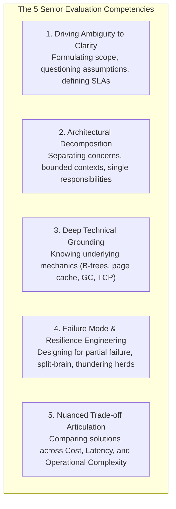
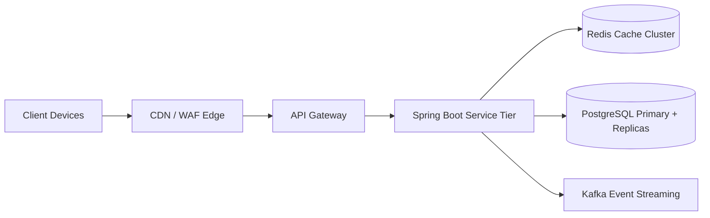

# Senior & Staff Technical Interview Playbook

At the Junior and Mid-level, technical interviews evaluate whether you can write syntactically correct code, implement clean Spring Boot APIs, write SQL queries, and solve LeetCode algorithmic problems.

At the **Senior (L5) and Staff (L6)** level, interviewers evaluate completely different dimensions: **navigating ambiguous requirements, identifying non-obvious engineering trade-offs, anticipating distributed failure modes, understanding hardware and financial costs, and demonstrating technical leadership**.

This playbook deconstructs the exact grading rubrics, 45-minute pacing strategies, and psychological frameworks used by hiring managers and principal engineers at FAANG, high-growth scale-ups, and tier-1 fintech companies.

---

## 1. How Senior Candidates Are Graded: The Evaluation Rubric

Top-tier engineering organizations score Senior and Staff candidates across five core competencies:



### Senior vs Mid-Level Behavioral Indicators

| Interview Moment | Mid-Level Engineer Reaction | Senior / Staff Engineer Reaction |
| :--- | :--- | :--- |
| **Vague Prompt** (*"Design YouTube"*) | Immediately starts drawing microservices boxes and databases. | Pauses. Clarifies functional scope (upload vs watch), traffic volume, global latency SLAs, and budget constraints. |
| **Technology Selection** | *"I'll use Kafka and MongoDB because they are fast and web-scale."* | Evaluates data access patterns: *"PostgreSQL handles our 5k QPS with standard B-Trees. We only need Kafka if write throughput exceeds 30k/sec."* |
| **Data Consistency** | Hand-waves: *"We will just use eventual consistency."* | Identifies invariants: *"User balances require linearizable consistency via database transactions; social like counts can use eventual consistency."* |
| **Distributed Locks** | *"I will lock the key using Redis SETNX with a 10s TTL."* | Spots the edge case: *"A long GC pause will expire the TTL, causing split-brain. We must validate a fencing token at the database storage layer."* |
| **Failure Scenarios** | Assumes the network and downstream services are always reliable. | Proactively introduces circuit breakers, bulkheads, exponential backoff with full jitter, and Dead-Letter Topics. |

---

## 2. The 45-Minute System Design Interview Blueprint

Mastering the clock is the single most critical tactical skill in a system design interview. 

Follow this **strict 5-phase pacing blueprint**:

```mermaid
gantt
    title The 45-Minute System Design Interview Blueprint
    dateFormat  m
    axisFormat %M min
    section Interview Phases
    1. Scope & Clarification (0-5m)       :active, p1, 0, 5m
    2. Capacity & Estimation (5-10m)      :p2, after p1, 5m
    3. High-Level Architecture (10-20m)   :p3, after p2, 10m
    4. Deep-Dive Bottlenecks (20-35m)     :p4, after p3, 15m
    5. Reliability & Trade-offs (35-45m)  :p5, after p4, 10m
```



---

### Phase 1: Scope & Clarification (Minutes 00:00 – 05:00)
**Goal**: Transform a vague 2-word problem into an unambiguous, agreed-upon technical specification.

1. **Functional Scope (Features)**:
   - *"What are the 2 or 3 core user journeys we must design in this 45-minute session?"*
   - Explicitly define what is **Out of Scope** (e.g. *"We will focus exclusively on URL creation and redirection; user authentication and custom reporting will be treated as out of scope"*).
2. **Non-Functional Requirements (SLAs)**:
   - **Availability vs Consistency (CAP Theorem)**: Is the system AP (high availability) or CP (strict consistency)?
   - **Latency Budget**: Redirection p99 under 10ms; write confirmation under 200ms.
   - **Scale**: Daily Active Users (DAU), read-to-write ratio.

---

### Phase 2: Back-of-the-Envelope Capacity Estimation (Minutes 05:00 – 10:00)
**Goal**: Prove that your upcoming architecture is mathematically grounded in realistic hardware constraints.

Calculate the **5 Core Dimensions**:
1. **Throughput (QPS)**: Average QPS and Peak QPS ($2\times$ to $4\times$ multiplier).
2. **Network Bandwidth**: Ingress bytes/sec and Egress bytes/sec.
3. **Storage (5-Year Capacity)**: Total disk storage including replication ($3\times$) and indexes ($1.3\times$).
4. **Memory (RAM - Pareto 80/20 Rule)**: Caching 20% of daily active working sets in Redis.
5. **Connection Concurrency (Little's Law)**: $L = \lambda \times W$ to calculate database connection pool limits.

---

### Phase 3: High-Level Architectural Design (Minutes 10:00 – 20:00)
**Goal**: Draw the end-to-end data flow from client devices down to persistent storage.



1. **Define API Contracts**: Clear HTTP methods, routes, request/response headers, and status codes (`201 Created` with Location header, `429 Too Many Requests`).
2. **Draft Data Models & DDL**: Primary keys, unique constraints, foreign keys, and indexing strategy.
3. **Draw Data Flow**: Connect client requests through CDN, API Gateway, application services, caches, and databases.

---

### Phase 4: Deep Dive into Core Bottlenecks (Minutes 20:00 – 35:00)
**Goal**: This is where Senior engineers win the interview. Pick the 2 hardest engineering problems in the architecture and drill down into microscopic detail.

Examples of Deep-Dive Topics:
- **Concurrency & Hotspots**: How do you prevent overselling when 1,000 users checkout the same item simultaneously? (*Answer: Atomic SQL decrements `WHERE stock >= qty`*).
- **Cache Invalidation & Stampedes**: What happens when a hot key expires under 10k QPS? (*Answer: Single-flight distributed mutex locking via Redisson*).
- **Database Partitioning & Locking**: How do you drop data older than 2 years without freezing the database? (*Answer: PostgreSQL declarative range partitioning and $O(1)$ partition drops*).
- **Distributed Consistency**: How do you prevent dual-write bugs between PostgreSQL and Kafka? (*Answer: Transactional Outbox pattern with Debezium CDC*).

---

### Phase 5: Reliability, Failure Scenarios & Trade-offs (Minutes 35:00 – 45:00)
**Goal**: Demonstrate operational maturity by breaking your own architecture before the interviewer does.

Proactively ask and answer:
- *"What happens if the primary database fails right now?"*
- *"What happens if an external payment gateway latency spikes from 100ms to 8,000ms?"* (resilience circuit breakers, fallback responses).
- *"How do we handle split-brain in our distributed lock coordinator?"* (fencing tokens).
- *"What are the financial cost trade-offs of this design?"* (provisioning costs vs operational complexity).

---

## 3. Navigating Interview Curveballs

Senior interviewers will intentionally throw sudden constraints to test your mental agility and architectural trade-off reasoning:

### Curveball 1: *"Traffic just grew 100x overnight. What breaks first?"*
- **Bad Answer**: *"I will just add more microservices and auto-scale Kubernetes pods."*
- **Senior Answer**: *"Scaling stateless web pods is trivial. The first failure point will be the **PostgreSQL database**: write IOPS will saturate the Write-Ahead Log (WAL), and connection pools will exhaust. To survive 100x traffic:
  1. We immediately push static and read-heavy assets to CDN edge caches.
  2. We shard the relational database horizontally across 16 shards by `user_id`.
  3. For write-heavy counters or analytics, we migrate off B-Trees to an append-only LSM-Tree store like Apache Cassandra."*

### Curveball 2: *"The cloud provider suffers a regional network partition. What happens?"*
- **Bad Answer**: *"Our system is highly available so it won't be affected."*
- **Senior Answer**: *"According to the PACELC theorem, during a partition, we must choose between Availability and Consistency:
  - For non-critical paths (e.g. social likes, comments, activity feeds), we choose Availability (AP) and allow clients in both regions to write locally, reconciling conflicts later via CRDTs or Last-Write-Wins.
  - For critical transactional paths (e.g. user balances, financial checkout), we choose Consistency (CP). The minority partitioned region must fail fast and reject writes to prevent double-spending and split-brain corruption."*

---

## 4. Top 10 Red Flags That Fail Senior Candidates

```text
1. The Premature Technology Jumper:
   Suggests Kafka, Cassandra, or Redis before understanding the data access pattern or QPS volume.

2. The Distributed Monolith Builder:
   Creates 15 microservices for a system with 50 QPS, introducing distributed transactions and network latency with zero justification.

3. The Hand-Waver:
   Uses buzzwords ("eventual consistency", "sharding", "machine learning") without knowing how they are implemented under the hood.

4. The Silent Thinker:
   Stares at the whiteboard for 4 minutes in silence without sharing their mental model or assumptions with the interviewer.

5. The Over-Engineer:
   Architects a globally distributed, multi-region active-active cluster for an internal company employee directory.

6. The Happy-Path Architect:
   Designs a system assuming the network never drops packets, third-party APIs never fail, and disks never fill up.

7. The Single Point of Failure (SPOF) Ignorer:
   Leaves single primary databases or single master orchestrators without failover automation or replication.

8. The Floating-Point Offender:
   Uses `float` or `double` when designing financial payment or wallet balances.

9. The Clock Synchronizer:
   Relies on system clocks (`System.currentTimeMillis()`) across distributed nodes to determine exact event ordering.

10. The Defensive Debater:
   Refuses to accept interviewer hints or becomes defensive when an interviewer points out an architectural flaw.
```

---

## 5. Active Recall Interview Mastery

<AccordionGroup>
  <Accordion title="1. What is the single most important rule during the first 5 minutes of a system design interview?">
    **Never draw an architecture box until you have clarified functional and non-functional requirements.** 
    
    Starting to draw components immediately signals a junior/mid-level candidate who makes unwarranted assumptions. The first 5 minutes must be dedicated to clarifying the problem scope, identifying the core 2 or 3 features, determining read/write QPS, defining latency SLAs, and establishing data consistency requirements.
  </Accordion>

  <Accordion title="2. How do you articulate architectural trade-offs to an interviewer?">
    Never declare an architectural choice as "the best." Frame decisions across three dimensions: **Cost, Latency, and Operational Complexity**. 
    
    For example: *"We could choose Cassandra for its extreme write throughput and horizontal scaling. However, it introduces eventual consistency anomalies and high operational complexity. Because our workload is only 2,000 writes/sec, a well-indexed PostgreSQL instance with read replicas gives us full ACID transactions and familiar tooling at a fraction of the operational cost."*
  </Accordion>

  <Accordion title="3. How do you handle an interview curveball where the interviewer asks you to cut infrastructure costs by 50%?">
    Demonstrate pragmatic business alignment:
    1. **Tiered Storage**: Move cold historical data (older than 90 days) from expensive NVMe SSD database storage to cheap cloud object storage (Amazon S3 / Glacier).
    2. **Cache Optimization**: Reduce Redis memory footprint by caching compressed binary payloads or switching from JSON strings to compact Redis Hashes.
    3. **Compute Efficiency**: Consolidate under-utilized microservices back into a modular monolith, eliminating inter-service network transit costs and gateway overhead.
  </Accordion>

  <Accordion title="4. Why is mentioning Little's Law impressive in an interview?">
    Little's Law ($L = \lambda \times W$) mathematically connects throughput ($\lambda$), latency ($W$), and concurrent capacity ($L$). 
    
    It proves that latency directly dictates capacity. For example, if an API handles 1,000 requests/sec ($\lambda = 1000$) and each request takes 100ms ($W = 0.1\text{s}$), the server holds 100 concurrent requests in flight ($L = 100$). If downstream database latency spikes to 1 second ($W = 1.0\text{s}$), concurrent in-flight requests instantly jump to 1,000, exhausting Tomcat thread pools and connection limits.
  </Accordion>

  <Accordion title="5. How should a candidate react if an interviewer points out a mistake in their design?">
    Treat the feedback as a collaborative pair-programming opportunity, not a failure. 
    
    Acknowledge the insight immediately: *"That's a great catch. If that worker crashes before committing, we have a dual-write inconsistency."* Then immediately propose a robust mitigation: *"To fix that, we can implement the Transactional Outbox pattern so the database and event publish commit atomically."* This demonstrates humility, composure under pressure, and senior problem-solving ability.
  </Accordion>
</AccordionGroup>

---

## 6. Done Checklist

<Check>
First 5 minutes of system design interviews are strictly dedicated to functional and non-functional requirements clarification.
</Check>
<Check>
All capacity estimates include QPS, bandwidth, 5-year storage, cache RAM, and Little's Law concurrency limits.
</Check>
<Check>
Architectural proposals explicitly articulate trade-offs across Cost, Latency, and Operational Complexity.
</Check>
<Check>
Distributed failure modes (GC pauses, network partitions, split-brain, cascading timeouts) are addressed proactively.
</Check>
<Check>
Interviewer prompts and curveballs are approached collaboratively with technical humility and systematic reasoning.
</Check>
