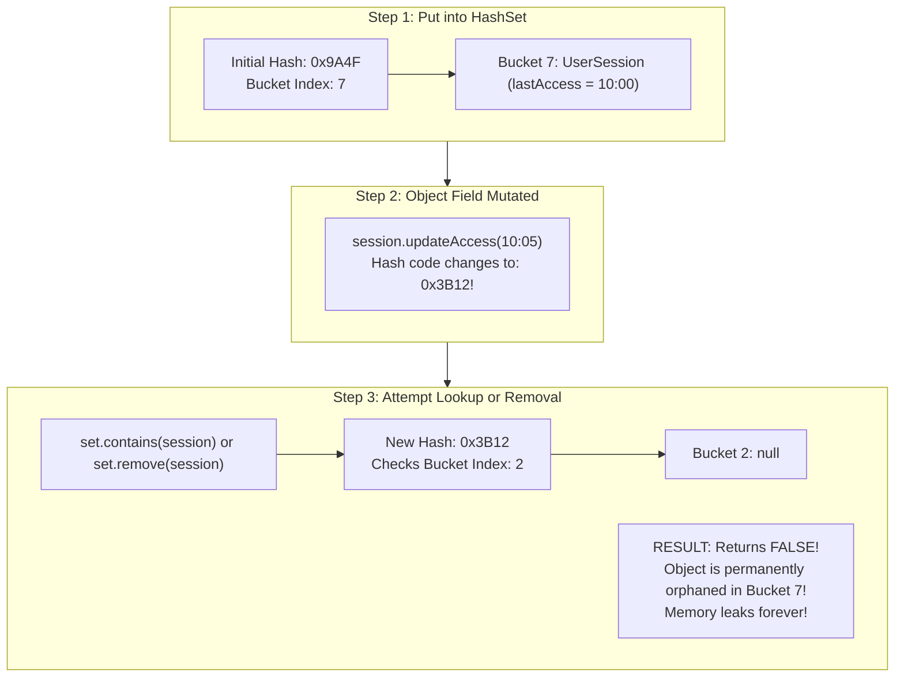
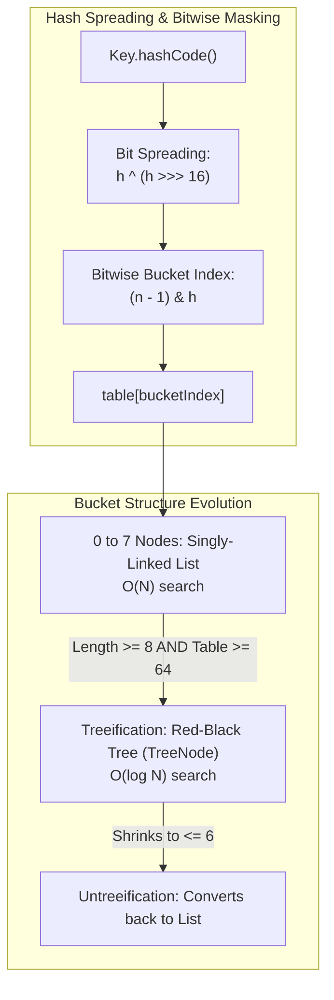
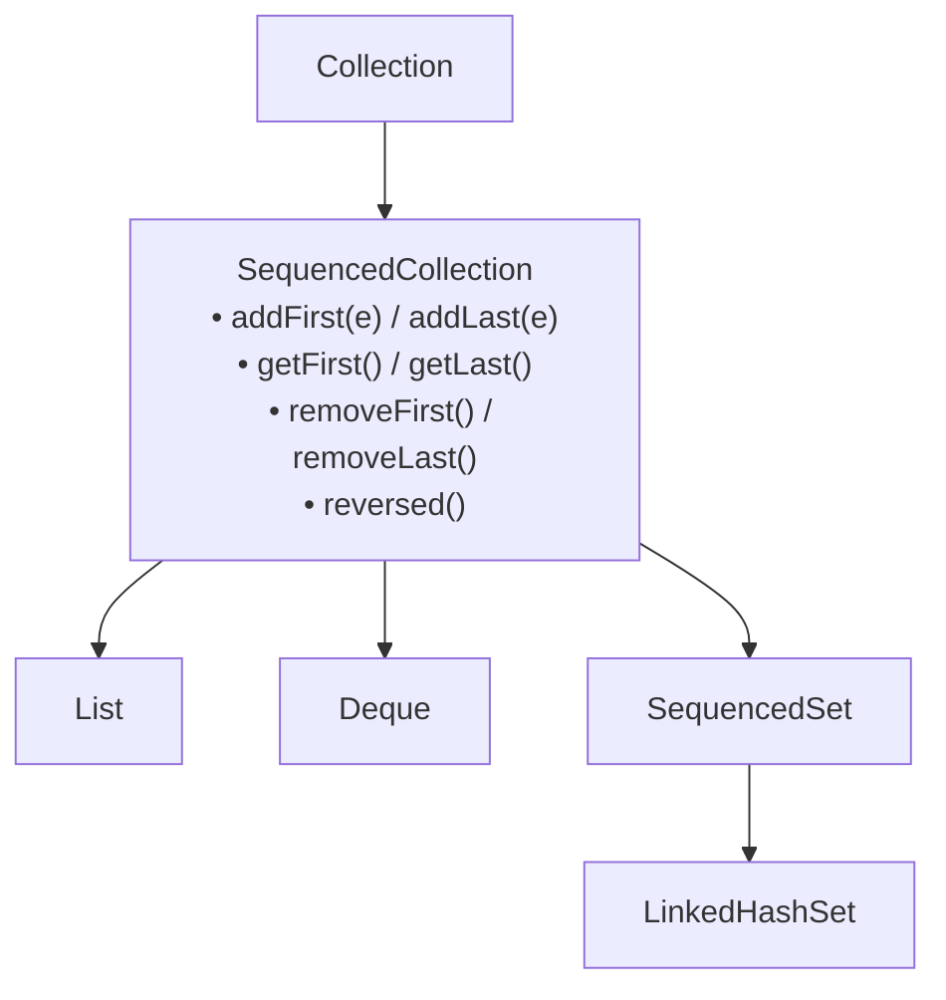

# Java Collections Framework: Internals, Memory Layout & Concurrency

In enterprise backend engineering, selecting the wrong collection or misunderstanding collection concurrency directly leads to high-severity production outages:
- **Severe Latency Spikes**: Traversing node-based data structures (`LinkedList`), incurring constant L1/L2 CPU cache misses and stalling thread execution on main memory (pointer chasing).
- **Silent Memory Leaks**: Mutating an object while it resides inside a `HashSet` or serves as a `HashMap` key, permanently orphaning the entry and rendering it impossible to retrieve or evict.
- **Worker Thread Crashes**: Triggering `ConcurrentModificationException` in high-throughput loops due to multi-threaded mutation or unsafe iteration.
- **Unbounded Resizing Pauses**: Allocating collections without initial capacity sizing, triggering cascade $O(N)$ memory allocations and array copy freezes under heavy traffic.

This masterclass examines the Java Collections Framework from physical hardware cache lines and bitwise math up to high-concurrency production architectures.

---

## Phase 1: Ground Floor (Physical First Principles)

To master collections, we must look past high-level interfaces (`List`, `Map`, `Set`) and observe how physical CPU cores read collection data from DDR4/DDR5 RAM.

```mermaid
flowchart TD
    subgraph CPUMemoryInterface["CPU Core & Cache Line Transfer"]
        CPU["CPU Execution Core\nRegisters (RAX, RDI, RSI)"]
        L1D["L1 Data Cache (32KB)\nTransfers 64-BYTE CACHE LINES in ~1 ns"]
        RAM["Physical RAM (DDR4/DDR5)\nLatency: 60 - 100 ns"]

        CPU <-->|1 ns| L1D
        L1D <-->|Cache Line Fill (64 Bytes)| RAM
    end

    subgraph DataStructuresInRAM["Physical Memory Layout Comparison"]
        subgraph ArrayListLayout["ArrayList: Contiguous Memory (Spatial Locality)"]
            A0["[0] 4B Ref"] --- A1["[1] 4B Ref"] --- A2["[2] 4B Ref"] --- A3["[3] 4B Ref"]
            NoteA["Single 64-byte L1 cache line fetch loads 16 consecutive references!\nCPU Hardware Pre-fetcher operates at 100% efficiency!"]
        end

        subgraph LinkedListLayout["LinkedList: Scattered Memory (Zero Locality)"]
            N1["Node 1 (0x1000)"] -.->|Pointer Jump 80ns| N2["Node 2 (0x8400)"]
            N2 -.->|Pointer Jump 80ns| N3["Node 3 (0x2100)"]
            NoteB["Every node dereference stalls the CPU waiting for RAM!\nConstant L1/L2 Cache Misses!"]
        end
    end
```

### 1.1 The 64-Byte Cache Line & Spatial Locality
When a CPU reads an address from main memory, it fetches a contiguous block of **64 bytes** called a **Cache Line**.
- **`ArrayList` & `ArrayDeque` (Contiguous Arrays)**: Elements are stored contiguously in memory. When the CPU reads index `0`, the CPU hardware prefetcher automatically loads indices `1` through `15` into the L1 cache. Sequential iteration completes in $\approx 1\text{ CPU cycle}$ per element.
- **`LinkedList` & `TreeMap` (Linked Node Structures)**: Every node is an independent heap object allocated at random physical memory addresses. Traversing a linked list requires the CPU to dereference a memory pointer, stall for $60\text{ to }100\text{ nanoseconds}$ while fetching from RAM, and repeat. This is known as **Pointer Chasing**.

### 1.2 The True Memory Cost of `LinkedList`
In a 64-bit JVM with Compressed OOPs:
- Every `LinkedList$Node` object requires:
  - 12 bytes HotSpot object header (Mark word + Klass word)
  - 4 bytes alignment padding
  - 4 bytes pointer to `item`
  - 4 bytes pointer to `next`
  - 4 bytes pointer to `prev`
  - Total = **24 bytes of overhead per single element**, excluding the actual payload!
- Storing 1,000,000 integers in an `ArrayList<Integer>` takes $\approx 20\text{ MB}$.
- Storing 1,000,000 integers in a `LinkedList<Integer>` takes $\approx 44\text{ MB}$ ($>2.2\times$ memory bloat).

<Tip>
**Production Rule**: In 99.9% of backend workloads, **never use `LinkedList`**. Even for queue operations (FIFO) or stack operations (LIFO), `ArrayDeque` dramatically outperforms `LinkedList` in both throughput and memory footprint.
</Tip>

---

## Phase 2: The Naive Code (The Production Crashes)

### Crash Scenario 1: The Disappearing Object in `HashSet` / `HashMap`

A developer implements a session management cache using a `HashSet` or `HashMap`. The key object is mutable:

```java
// DANGEROUS ANTI-PATTERN: Mutable Hash Key
public class UserSession {
    private String sessionId;
    private String status;
    private Instant lastAccessTime;

    public UserSession(String sessionId, String status, Instant lastAccessTime) {
        this.sessionId = sessionId;
        this.status = status;
        this.lastAccessTime = lastAccessTime;
    }

    @Override
    public boolean equals(Object o) {
        if (this == o) return true;
        if (!(o instanceof UserSession that)) return false;
        return Objects.equals(sessionId, that.sessionId) &&
               Objects.equals(status, that.status) &&
               Objects.equals(lastAccessTime, that.lastAccessTime);
    }

    @Override
    public int hashCode() {
        return Objects.hash(sessionId, status, lastAccessTime);
    }

    // Mutator method called during request handling
    public void updateAccess(Instant now) {
        this.lastAccessTime = now; // FATAL: Mutates the hash code!
    }
}
```



#### What Crashes in Production:
The application checks `set.contains(session)` to validate active sessions. Because the hash code mutated, the hash lookup routes to the wrong bucket index and returns `false`. 

Furthermore, `set.remove(session)` cannot find the object to delete it. The session is trapped in memory forever, leading to an **OutOfMemoryError (OOM)** over time.

---

### Crash Scenario 2: `ConcurrentModificationException` via Iteration Mutation

```java
// DANGEROUS ANTI-PATTERN: Mutating collection during enhanced for-loop
List<Order> orders = orderRepository.findAllPending();
for (Order order : orders) {
    if (order.isExpired()) {
        orders.remove(order); // FATAL: Throws ConcurrentModificationException!
    }
}
```

#### Why it Crashes:
Java collections maintain an internal integer counter named `modCount` (modification count). 

When an iterator is created (`for (Order o : orders)`), it caches `expectedModCount = modCount`. When `orders.remove(order)` is called directly on the list, `modCount` is incremented. On the next iteration step, `iterator.next()` checks:
```java
if (modCount != expectedModCount) {
    throw new ConcurrentModificationException();
}
```

---

## Phase 3: Under the Hood (Mechanics, Bitwise Math & Concurrency)

### 3.1 `ArrayList` Resizing & Zero-Copy Native Replication

An `ArrayList` is backed by a physical Object array (`Object[] elementData`).

```mermaid
flowchart LR
    Old["elementData (Length: 10)\n[0][1][2][3][4][5][6][7][8][9]"] -->|grow() triggers System.arraycopy| New["newElementData (Length: 15)\n[0][1][2][3][4][5][6][7][8][9] [ ][ ][ ][ ][ ]"]
```

#### The Expansion Formula:
When elements exceed current capacity:
```java
int newCapacity = oldCapacity + (oldCapacity >> 1); // 1.5x growth (50% increase)
```
1. Bitwise right shift (`oldCapacity >> 1`) divides by 2 in a single clock cycle.
2. If initial capacity is $10$, it grows: $10 \rightarrow 15 \rightarrow 22 \rightarrow 33 \rightarrow 49 \rightarrow 73\dots$
3. A new array is allocated on the heap.
4. `System.arraycopy(...)` is called. This is an **intrinsified JVM C++ call** that translates directly to native vectorized assembly instructions (`VMOVDQU` / `MEMCPY` via AVX registers), copying 32 or 64 bytes per CPU cycle.

<Tip>
**Sizing Best Practice**: If you know an API query fetches 10,000 records, always specify initial capacity: `new ArrayList<>(10_000)`. This completely eliminates 14 redundant array allocations and 14 memory copy operations.
</Tip>

---

### 3.2 `HashMap` Internals: Bitwise Math to Red-Black Trees

A `HashMap` stores key-value pairs in an array of buckets (`Node<K,V>[] table`).



#### 1. Why Table Capacity is Always a Power of Two ($2^k$)
When table capacity $n$ is a power of two ($16, 32, 64\dots$):
$$\text{bucketIndex} = \text{hash} \pmod n \equiv (\mathbf{n - 1}) \mathbin{\&} \mathbf{hash}$$

Computing modulo (`%`) on a CPU requires an integer division instruction (`IDIV`), which costs **15 to 40 CPU clock cycles**.
Computing bitwise AND (`&`) executes in **1 CPU clock cycle**.

For example, when $n = 16$, $n - 1 = 15$ (`00001111` in binary). Performing `(15 & hash)` masks out all upper bits and leaves only the lowest 4 bits, perfectly guaranteeing an index between $0$ and $15$.

#### 2. Hash Spreading Function (`hash ^ (hash >>> 16)`)
If a key's `hashCode()` has entropy only in the upper bits (e.g. `0xABCD0001`, `0x12340001`), masking with $n-1=15$ would always yield index $1$, causing massive collisions.

HotSpot fixes this by XOR-ing the upper 16 bits with the lower 16 bits:
```java
static final int hash(Object key) {
    int h;
    return (key == null) ? 0 : (h = key.hashCode()) ^ (h >>> 16);
}
```

#### 3. Treeification Thresholds:
- **`TREEIFY_THRESHOLD = 8`**: If a single bucket accumulates 8 nodes, it converts from a singly-linked list into a balanced **Red-Black Tree** (`TreeNode<K,V>`), improving lookup performance from $O(N)$ to $O(\log N)$.
- **`MIN_TREEIFY_CAPACITY = 64`**: If table capacity is $< 64$, HotSpot prefers to resize the table rather than treeify.
- **`UNTREEIFY_THRESHOLD = 6`**: When nodes are deleted and drop to 6, the tree converts back to a linked list to save memory.

---

### 3.3 `ConcurrentHashMap`: Segmentless Lock-Free Bin Architecture

Unlike the legacy `Hashtable` or `Collections.synchronizedMap(map)` which lock the **entire table** with a single mutex, Java 8+ `ConcurrentHashMap` uses **fine-grained bin-level synchronization**:

```mermaid
flowchart TD
    subgraph CHM["ConcurrentHashMap Table Architecture"]
        direction TB
        B0["Bin 0: Empty"] -->|CAS Insertion (Lock-Free!)| NewNode["New Node Inserted via CAS"]
        B1["Bin 1: Head Node"] -->|synchronized(headNode)| LockOnlyBin["Only Bin 1 is Locked!\nBins 2-15 remain 100% accessible!"]
        B2["Bin 2: Tree Head"]
        B3["Bin 3: ForwardingNode (Resizing in Progress)"]
    end
```

#### 1. Lock-Free CAS on First Insertion
When inserting into an empty bucket:
```java
if (casTabAt(tab, i, null, new Node<K,V>(hash, key, value, null)))
    break; // Zero locking! Atomic hardware CAS!
```
No mutex is acquired. The CPU executes an atomic hardware Compare-And-Swap.

#### 2. Bin-Level Synchronization on Collisions
If the bucket already contains a node, it locks **only the head node of that specific bucket**:
```java
synchronized (f) {
    // Only threads targeting bucket i are blocked!
    // Threads targeting bucket i+1 execute in parallel!
}
```

#### 3. Concurrent Table Resizing via `ForwardingNode`
When resizing, multiple worker threads assist in transferring buckets. Completed buckets are replaced with a `ForwardingNode`. If a reader thread hits a `ForwardingNode`, it transparently forwards lookups to the new table.

#### 4. High-Throughput Sizing via `CounterCell`
`ConcurrentHashMap.size()` does not increment a single shared `volatile long count` (which would cause massive CPU cache-line bouncing). It uses striped `CounterCell` arrays (the same architecture as `LongAdder`), distributing increments across separate cache lines.

---

### 3.4 `LinkedHashMap`: Production LRU Cache Implementation

`LinkedHashMap` maintains a doubly-linked list running through all of its entries:

```java
import java.util.LinkedHashMap;
import java.util.Map;

// Production-ready In-Memory LRU Cache
public class LruCache<K, V> extends LinkedHashMap<K, V> {
    private final int maxCapacity;

    public LruCache(int maxCapacity) {
        // initialCapacity, loadFactor = 0.75f, accessOrder = true
        // accessOrder = true orders entries from LEAST-RECENTLY to MOST-RECENTLY accessed!
        super(maxCapacity, 0.75f, true);
        this.maxCapacity = maxCapacity;
    }

    @Override
    protected boolean removeEldestEntry(Map.Entry<K, V> eldest) {
        // Automatically evicts the least recently used entry when capacity is exceeded
        return size() > maxCapacity;
    }
}
```

---

### 3.5 `ArrayDeque`: The High-Performance Queue & Stack

`ArrayDeque` is backed by a contiguous circular array:
```java
Deque<String> queue = new ArrayDeque<>();
queue.offer("task-1"); // Adds to tail
String next = queue.poll(); // Removes from head
```
- **Zero Pointer Chasing**: Stored contiguously in RAM.
- **Bitwise Circular Head/Tail**: Pointer wrap-around is calculated via bitwise masking: `head = (head - 1) & (elements.length - 1)`.
- **Replaces `Stack`**: `java.util.Stack` extends `Vector`, forcing unnecessary synchronized lock acquisitions on every `push()` and `pop()`.

---

### 3.6 Java 21 Sequenced Collections

Prior to Java 21, getting the first or last element of a collection required inconsistent, awkward APIs:
- `list.get(0)` vs `list.get(list.size() - 1)`
- `deque.getFirst()` vs `deque.getLast()`
- `sortedSet.first()` vs `sortedSet.last()`
- `linkedHashSet.iterator().next()`

Java 21 introduces `SequencedCollection`, `SequencedSet`, and `SequencedMap`:



#### Idiomatic Java 21 Sequenced Collections Usage:
```java
// Reversing order without copying elements!
SequencedCollection<String> items = new ArrayList<>(List.of("A", "B", "C"));
String first = items.getFirst(); // "A"
String last = items.getLast();   // "C"

// Constant-time reversed view (no array copy!)
SequencedCollection<String> reversedView = items.reversed();
System.out.println(reversedView.getFirst()); // "C"
```

---

## Phase 4: Senior Interview Ace (Junior vs Staff Phrasing)

### Interview Question: "How does `HashMap` work under the hood in Java, and why is `ConcurrentHashMap` better than `Collections.synchronizedMap()`?"

#### ❌ The Shallow Junior Answer:
> "`HashMap` uses an array of linked lists. When there are collisions, it adds nodes to the list. In Java 8, if the list gets longer than 8, it changes into a red-black tree. `ConcurrentHashMap` is better than `synchronizedMap` because `synchronizedMap` locks the whole map, but `ConcurrentHashMap` uses segments so multiple threads can write at once."

#### Staff / Principal Engineer Answer:
> "`HashMap` uses a power-of-two sized array of buckets (`Node<K,V>[]`). To map a key's 32-bit hash code to a bucket index, it avoids expensive integer division by using bitwise masking `(capacity - 1) & hash`. Because low-capacity tables only evaluate the lowest bits of the hash, it uses a high-to-low bit-spreading XOR function `h ^ (h >>> 16)` to minimize clustering collisions.
>
> When bucket collisions occur, entries form a singly-linked list. Under sustained collisions (such as deliberate hash-DoS attacks), when a bucket reaches `TREEIFY_THRESHOLD = 8` and the table capacity is at least 64, HotSpot treeifies the bucket into a balanced Red-Black Tree, bounding worst-case lookup from $O(N)$ to $O(\log N)$.
>
> Regarding concurrency: `Collections.synchronizedMap()` wraps the map in a coarse-grained mutex lock; every read and write contends for the exact same lock, completely serializing throughput. 
> 
> In contrast, modern `ConcurrentHashMap` discarded the Java 7 Segment array. It uses lock-free atomic CAS (`compareAndSetObject`) for initial bucket insertions, and locks only the specific bin's head node using intrinsic monitors (`synchronized (head)`) during collisions. Reads (`get`) are completely non-blocking without locking because node value and next pointers are marked `volatile`. Furthermore, table resizing is coordinated concurrently across worker threads using `ForwardingNode` markers, and map sizing uses striped `CounterCell` pads to eliminate CPU cache-line bouncing."

---

## Production Debugging Checklist

1. <Check>Never use mutable objects as `HashMap` keys or `HashSet` elements. If keys must be updated, remove the old key, mutate, and re-insert.</Check>
2. <Check>Always supply initial capacity for large collections: `new ArrayList<>(expectedSize)` or `new HashMap<>((int) (expectedSize / 0.75f) + 1)`.</Check>
3. <Check>Replace legacy `Vector`, `Hashtable`, and `Stack` with `ArrayList`, `ConcurrentHashMap`, and `ArrayDeque`.</Check>
4. <Check>Never remove items from a collection inside an enhanced `for` loop. Use `collection.removeIf(predicate)` or `iterator.remove()` to avoid `ConcurrentModificationException`.</Check>
5. <Check>Use `Collections.unmodifiableList()` or `List.copyOf()` when exposing internal domain collections to prevent unauthorized external mutations.</Check>

---

## Done Checklist
- [ ] Explain 64-byte CPU cache lines, spatial locality, and pointer chasing.
- [ ] Understand why `LinkedList` causes severe cache-miss latency and memory bloat.
- [ ] Master `ArrayList` 1.5x growth formula and native `System.arraycopy` mechanics.
- [ ] Master `HashMap` power-of-two sizing, bitwise index masking, and hash bit-spreading.
- [ ] Master `HashMap` treeification ($8$) and untreeification ($6$) thresholds.
- [ ] Explain `ConcurrentHashMap` lock-free CAS, bin-level synchronization, and `CounterCell` sizing.
- [ ] Build an LRU cache using `LinkedHashMap.removeEldestEntry()`.
- [ ] Understand Java 21 `SequencedCollection`, `SequencedSet`, and `SequencedMap`.
