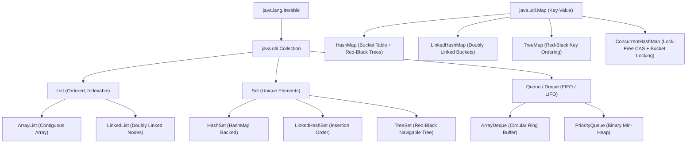
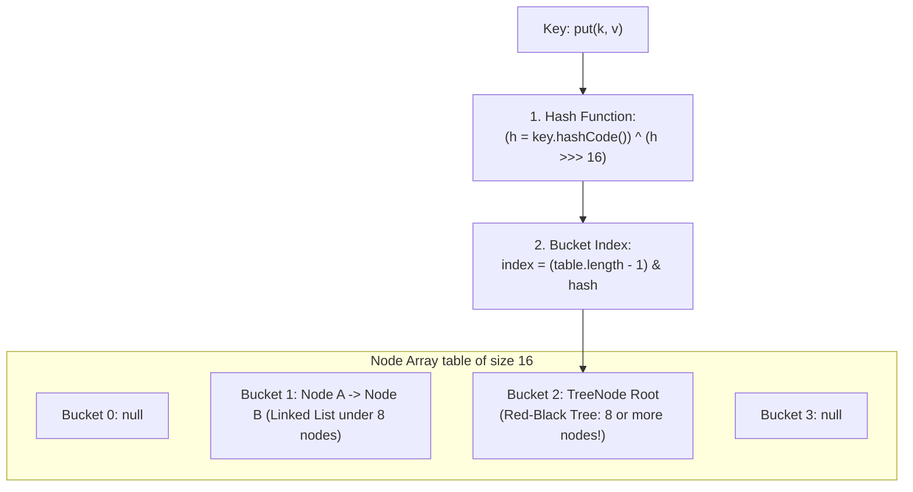
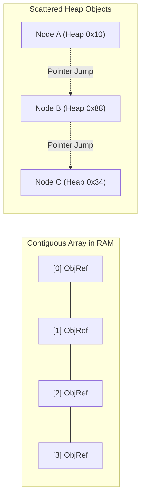
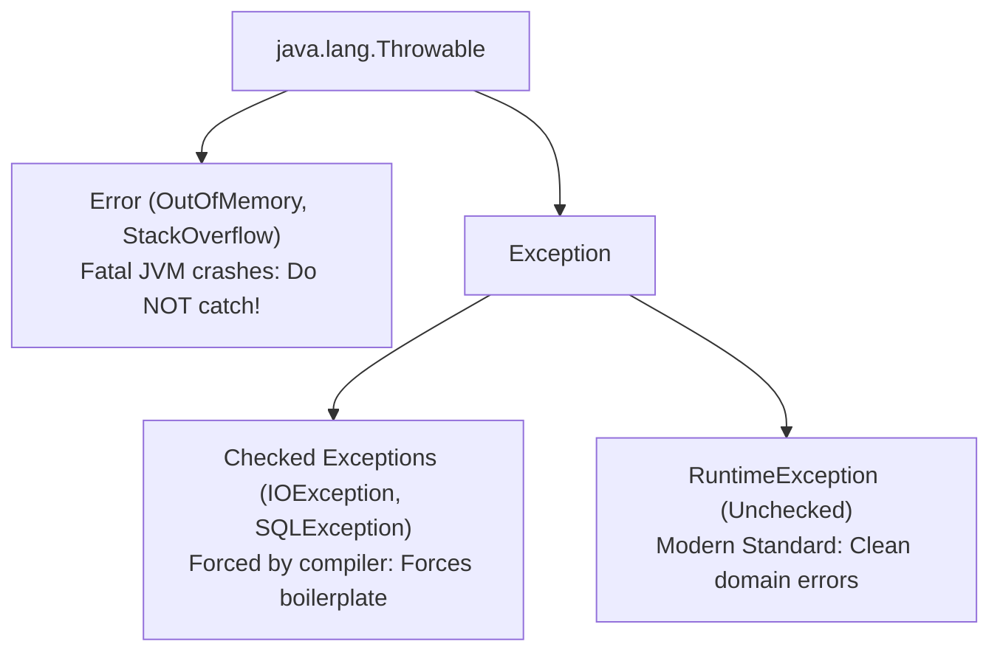
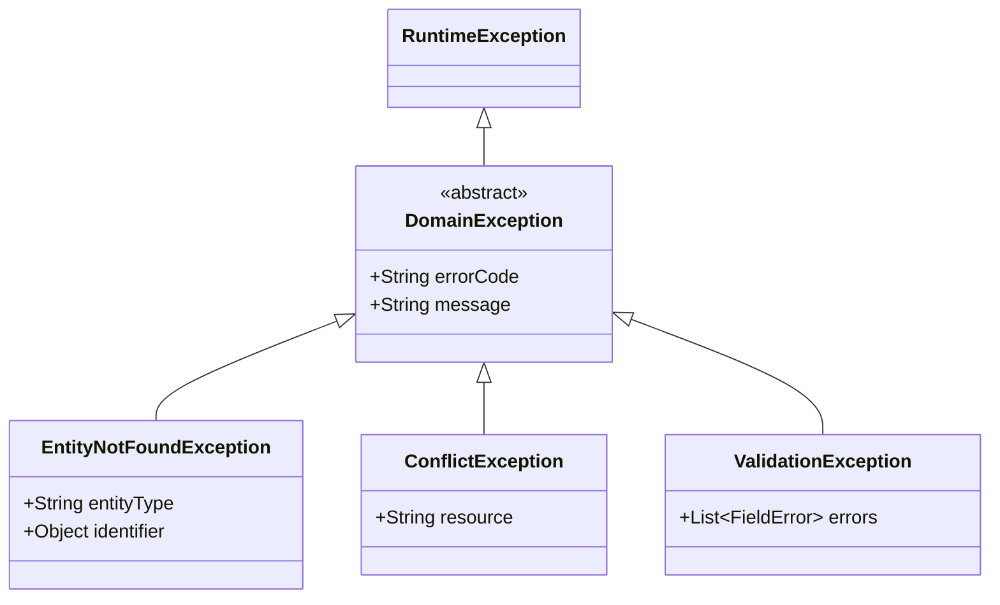

# Collections Framework Internals & Exception Architecture

In backend engineering, choosing the wrong data structure or mishandling exceptions leads directly to production incidents:
- High CPU spikes caused by $O(N)$ linear scans across linked structures.
- Silent hash collisions and lost entries caused by violating the `equals` and `hashCode` contract.
- Thread crashes triggered by `ConcurrentModificationException`.
- Severe memory allocation overhead caused by throwing exceptions inside high-frequency loops.

This guide provides an exhaustive, production-grade manual for the Java Collections Framework (JCF) internals, CPU cache locality, modern immutable factories, and robust domain exception hierarchies in Spring Boot 3.

---

## Collections Hierarchy & Big-O Complexity



### Time & Space Complexity Reference Matrix

| Data Structure | Get / Lookup | Add / Insert | Delete / Remove | Space Complexity | Best Production Use Case |
| :--- | :--- | :--- | :--- | :--- | :--- |
| **`ArrayList`** | **$O(1)$** (Direct index) | **$O(1)$ amortized** | $O(N)$ (Array copy shift) | Low ($O(N)$ contiguous) | Default choice for indexed read lists and API DTO lists |
| **`ArrayDeque`** | $O(N)$ | **$O(1)$** (Head/Tail) | **$O(1)$** (Head/Tail) | Low (Circular array) | High-performance LIFO stacks and FIFO queues |
| **`LinkedList`** | $O(N)$ (Pointer traverse) | $O(1)$ (At head/tail) | $O(1)$ (With iterator) | High (3 pointers/node) | **Avoid in modern backends** (Poor CPU cache locality) |
| **`HashSet`** | **$O(1)$** (Average) | **$O(1)$** (Average) | **$O(1)$** (Average) | Moderate (HashMap backed) | Fast uniqueness checks, membership testing |
| **`TreeSet`** | $O(\log N)$ | $O(\log N)$ | $O(\log N)$ | Moderate (Red-Black tree) | Sorted sets, range queries (`subSet`, `tailSet`) |
| **`HashMap`** | **$O(1)$** (Average) | **$O(1)$** (Average) | **$O(1)$** (Average) | Moderate ($O(N)$ buckets) | High-speed key-value lookups, caching, mappings |
| **`LinkedHashMap`**| **$O(1)$** (Average) | **$O(1)$** (Average) | **$O(1)$** (Average) | Higher (Extra linked pointers) | Stable insertion-order responses, LRU memory caches |
| **`TreeMap`** | $O(\log N)$ | $O(\log N)$ | $O(\log N)$ | Moderate (Red-Black tree) | Naturally sorted keys, prefix key scanning |
| **`ConcurrentHashMap`**| **$O(1)$** (Average) | **$O(1)$** (CAS / Sync) | **$O(1)$** | Moderate | High-concurrency multithreaded caching |

---

## `HashMap` Internals: From Buckets to Red-Black Trees

In Java 8+, `java.util.HashMap` was completely re-engineered to protect backend systems from **HashDoS (Hash Denial of Service) attacks**, where malicious clients send millions of colliding keys to force $O(N)$ linked list searches.



### The 4 Phases of a `put()` Operation

1. **Hash Spreading Function**:
   Raw `hashCode()` integers may have poor distribution. Java applies a bitwise XOR shift to mix the high-order bits into the low-order bits:
   ```java
   static final int hash(Object key) {
       int h;
       return (key == null) ? 0 : (h = key.hashCode()) ^ (h >>> 16);
   }
   ```
2. **Bitwise Modulo Index Calculation**:
   Because the internal table capacity is always a power of 2 ($2^N$), PostgreSQL and Java calculate the bucket index using fast bitwise AND instead of slow hardware modulo division (`%`):
   $$\text{index} = (\text{capacity} - 1) \ \& \ \text{hash}$$
3. **Collision Handling & Treeification Thresholds**:
   - **Chaining**: If two keys land in the same bucket, they form a singly-linked list.
   - **Treeification Threshold = 8**: When a bucket's linked list grows to **8 nodes** and the total table capacity is at least **64**, Java converts the bucket from a linked list into a **Red-Black Tree** (`TreeNode<K, V>`). This transforms lookup time from $O(N)$ linear scan to $O(\log N)$ logarithmic time!
   - **Untreeify Threshold = 6**: When table resizing reduces the elements in a tree bin to 6 or fewer, it is converted back to a linked list to save memory.
4. **Resizing and Load Factor (0.75)**:
   - **Initial Capacity**: 16 buckets.
   - **Threshold**: $\text{Capacity} \times \text{Load Factor} = 16 \times 0.75 = 12$.
   - When the 13th key is inserted, capacity doubles to 32, and all keys are rehashed using their new high-order bit.

<Warning>
**The `equals()` and `hashCode()` Invariant**:
If two objects are equal according to `equals(Object)`, they **MUST** produce the exact same integer `hashCode()`.
If you override `equals()` without overriding `hashCode()`, two identical objects will produce different hash codes, landing in different buckets. Your `map.get(key)` will return `null` even though the key exists!
</Warning>

---

## `ArrayList` Memory Growth & The CPU Cache Locality Truth

### Why `LinkedList` is an Anti-Pattern in Backend Engineering
Decades ago, computer science textbooks taught that `LinkedList` is superior to `ArrayList` for insertions ($O(1)$ vs $O(N)$). On modern multi-core hardware, **this is completely false**:
1. **CPU Cache Locality**: An `ArrayList` is a contiguous block of physical RAM. The CPU pre-fetches entire memory cache lines (64 bytes), making iteration blazing fast.
2. **Pointer Chasing**: A `LinkedList` allocates small `Node` objects scattered arbitrarily across the heap. Iterating through a linked list forces the CPU to stall on continuous L1/L2 cache misses.
3. **Memory Bloat**: Each `LinkedList.Node` requires 24 bytes of overhead (object header + forward pointer + backward pointer) to store a 4-byte reference!



### `ArrayList` Amortized Expansion Math
- Default initial capacity = 10 elements.
- When full, `ArrayList` grows by **50%** ($1.5\text{x}$) using a bitwise right-shift:
  ```java
  int newCapacity = oldCapacity + (oldCapacity >> 1); // 10 -> 15 -> 22 -> 33
  ```
- Elements are copied using low-level, zero-copy native memory replication: `System.arraycopy()`.
- **Production Tip**: If you know you are fetching 10,000 items from a database, always pre-size the list: `new ArrayList<>(10_000)` to eliminate 14 redundant re-allocations and memory copies.

---

## Concurrent Modification & Iteration Hazards

Attempting to modify a collection while iterating over it throws `ConcurrentModificationException`:

```java
// ANTI-PATTERN: Throws ConcurrentModificationException!
List<String> names = new ArrayList<>(List.of("Alice", "Bob", "Charlie"));
for (String name : names) {
    if ("Bob".equals(name)) {
        names.remove(name); // Modifies list while iterator is active!
    }
}
```

### Why it Fails: The `modCount` Mechanism
`ArrayList` maintains an internal integer `modCount` that increments on every structural modification (`add`, `remove`). When an `Iterator` is created, it takes a snapshot: `expectedModCount = modCount`.
On every `iterator.next()`, it verifies:
```java
if (modCount != expectedModCount) {
    throw new ConcurrentModificationException(); // Fail-fast check!
}
```

### Safe Production Solutions
```java
// Solution 1: Use removeIf (Preferred, cleanest)
names.removeIf("Bob"::equals);

// Solution 2: Explicit Iterator.remove()
Iterator<String> it = names.iterator();
while (it.hasNext()) {
    if ("Bob".equals(it.next())) {
        it.remove(); // Safely updates both modCount and expectedModCount!
    }
}
```

---

## Modern Immutable Collections: `List.of` vs `unmodifiableList`

Java 9 introduced compact, immutable collection factories:

```java
List<String> immutableList = List.of("A", "B", "C");
Set<String> immutableSet = Set.of("ADMIN", "USER");
Map<String, Integer> immutableMap = Map.of("key1", 100, "key2", 200);
```

### Structural Differences

| Feature | `Collections.unmodifiableList(list)` | `List.of(...)` (Java 9+) |
| :--- | :--- | :--- |
| **Mechanism** | Read-only view wrapper around underlying list | Compact, dedicated internal class |
| **True Immutability** | **No**: If the underlying list changes, the view changes! | **Yes**: Completely immutable, cannot be mutated |
| **Null Tolerance** | Permits `null` if underlying list contains it | **Strictly Null-Hostile**: Throws `NullPointerException` |
| **Memory Overhead** | Extra wrapper object on heap | Highly optimized zero-overhead field storage |

```java
// DEFENSIVE COPYING PATTERN:
// Return true immutable copies from domain entities:
public List<OrderItem> getItems() {
    return List.copyOf(this.items); // Guaranteed immutable snapshot
}
```

---

## Production Exception Architecture: Checked vs Unchecked



### Why Modern Architecture Rejects Checked Exceptions
1. **Signature Pollution**: Checked exceptions force intermediate service interfaces to declare `throws IOException`, leaking low-level infrastructure concerns into business boundaries.
2. **Incompatible with Functional Java**: Stream lambdas (`map`, `filter`) cannot throw checked exceptions without cumbersome try/catch wrappers.
3. **Transaction Rollback Standard**: By default, Spring's `@Transactional` **only rolls back on Unchecked Exceptions (`RuntimeException`)**! A checked exception does **NOT** trigger database rollback unless explicitly declared with `@Transactional(rollbackFor = Exception.class)`.

---

## Clean Domain Exception Hierarchy

In modern Spring Boot backends, build a decoupled, typed business exception hierarchy that maps directly to HTTP status codes:



### Implementation
```java
package com.example.common.exception;

public abstract class DomainException extends RuntimeException {
    private final String errorCode;

    protected DomainException(String message, String errorCode) {
        super(message);
        this.errorCode = errorCode;
    }

    public String getErrorCode() { return errorCode; }
}

public class OrderNotFoundException extends DomainException {
    public OrderNotFoundException(Long orderId) {
        super("Order not found with ID: " + orderId, "ORDER_NOT_FOUND");
    }
}

public class InsufficientInventoryException extends DomainException {
    public InsufficientInventoryException(Long productId, int requested, int available) {
        super("Product %d has only %d units available (requested: %d)"
              .formatted(productId, available, requested), "INSUFFICIENT_INVENTORY");
    }
}
```

---

## Global RFC 9457 Exception Handler in Spring Boot 3

Translate domain exceptions into standardized `application/problem+json` HTTP responses:

```java
package com.example.common.error;

import com.example.common.exception.DomainException;
import com.example.common.exception.OrderNotFoundException;
import org.springframework.http.HttpStatus;
import org.springframework.http.ProblemDetail;
import org.springframework.web.bind.annotation.ExceptionHandler;
import org.springframework.web.bind.annotation.RestControllerAdvice;

import java.net.URI;
import java.time.Instant;

@RestControllerAdvice
public class GlobalExceptionHandler {

    @ExceptionHandler(OrderNotFoundException.class)
    public ProblemDetail handleOrderNotFound(OrderNotFoundException ex) {
        ProblemDetail problem = ProblemDetail.forStatusAndDetail(HttpStatus.NOT_FOUND, ex.getMessage());
        problem.setTitle("Order Not Found");
        problem.setType(URI.create("https://api.store.com/errors/not-found"));
        problem.setProperty("error_code", ex.getErrorCode());
        problem.setProperty("timestamp", Instant.now());
        return problem;
    }

    @ExceptionHandler(Exception.class)
    public ProblemDetail handleUnhandled(Exception ex) {
        // Fallback for uncaught server errors (500)
        ProblemDetail problem = ProblemDetail.forStatusAndDetail(
            HttpStatus.INTERNAL_SERVER_ERROR, 
            "An unexpected server error occurred. Our engineers have been alerted."
        );
        problem.setTitle("Internal Server Error");
        problem.setProperty("timestamp", Instant.now());
        return problem;
    }
}
```

---

## Active Recall & Interview Mastery

<AccordionGroup>
  <Accordion title="1. Explain the internal put() process of a HashMap and how treeification prevents DoS attacks.">
    When `put(k, v)` is invoked, the key's `hashCode()` is processed through a bitwise shift mixer and mapped to a bucket index using `(capacity - 1) & hash`. If a collision occurs, the entry is chained in a singly linked list. When a bucket's list reaches 8 nodes and the table has at least 64 buckets, the list is converted into a balanced Red-Black Tree. This guarantees that even if a malicious client deliberately generates thousands of keys that hash to the exact same bucket, search time degrades gracefully to $O(\log N)$ instead of $O(N)$ linear scans, neutralizing HashDoS attacks.
  </Accordion>

  <Accordion title="2. Why is LinkedList almost always worse than ArrayList on modern computer hardware?">
    Modern CPU cores rely heavily on L1 and L2 memory caches. Because `ArrayList` stores elements in a contiguous block of memory, the CPU hardware pre-fetcher loads entire cache lines (64 bytes) in advance, making array iterations blazing fast. `LinkedList` allocates nodes scattered across unpredictable memory addresses on the heap; traversing it requires dereferencing pointers (pointer chasing), which causes frequent CPU cache misses and execution stalls. Additionally, each linked node consumes 24 bytes of overhead for pointers.
  </Accordion>

  <Accordion title="3. What causes a ConcurrentModificationException and how do you prevent it during iteration?">
    `ConcurrentModificationException` is thrown by fail-fast iterators when they detect that a collection was structurally modified (added to or removed from) while iteration was in progress. The iterator tracks `expectedModCount` and compares it to the collection's `modCount` on every step. It is prevented by either using `list.removeIf(predicate)`, using the explicit `Iterator.remove()` method (which synchronizes `expectedModCount`), or by iterating over an immutable defensive copy.
  </Accordion>

  <Accordion title="4. Why should backend services prefer Unchecked Exceptions over Checked Exceptions?">
    Checked exceptions force method signatures to declare `throws Exception`, which violates encapsulation by exposing infrastructure details (like `SQLException` or `IOException`) to upper business layers. They also break functional interfaces and Stream pipelines in Java. Furthermore, Spring's `@Transactional` boundary automatically triggers database rollback on unchecked exceptions (`RuntimeException`), whereas checked exceptions do not roll back transactions by default.
  </Accordion>

  <Accordion title="5. What is the difference between Collections.unmodifiableList() and List.of()?">
    `Collections.unmodifiableList(list)` is merely a wrapper view around an existing mutable list. If the underlying list is modified elsewhere, those changes are immediately visible through the unmodifiable view. In contrast, `List.of()` creates a truly immutable, compact, standalone collection that cannot be altered under any circumstances, and is strictly null-hostile (throws `NullPointerException` if any element is null).
  </Accordion>
</AccordionGroup>
