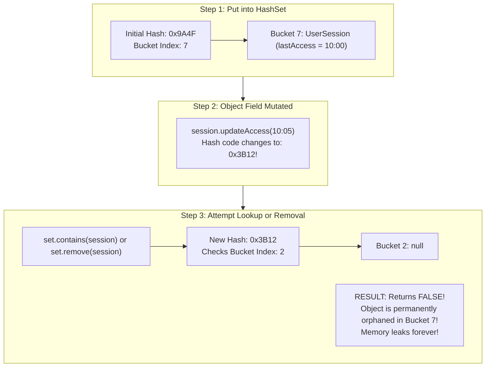
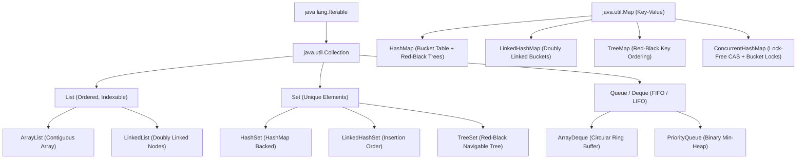
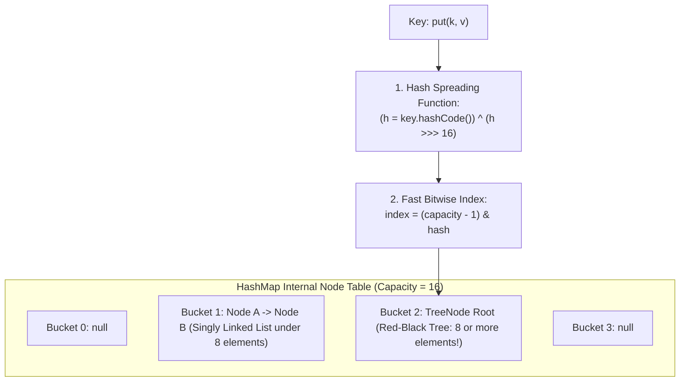
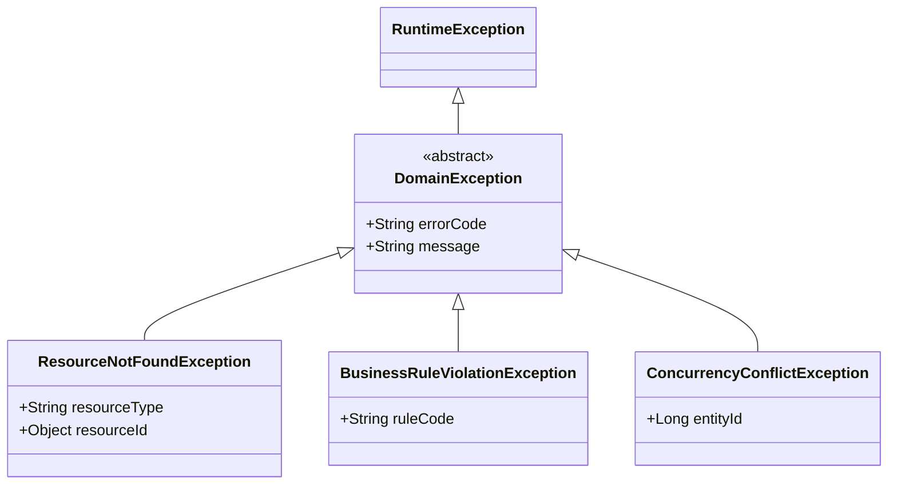
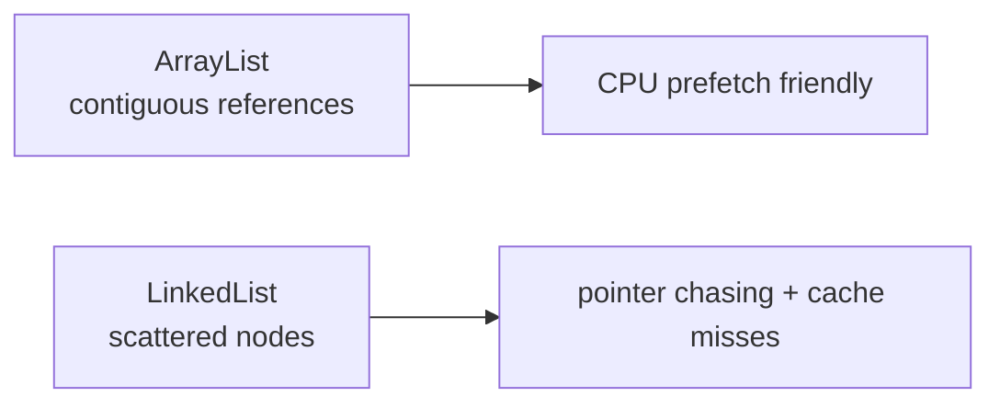

# Collections Framework Internals & Exception Architecture

In enterprise backend engineering, selecting the wrong data structure or treating exceptions as flow control leads directly to severe production outages:
- High CPU spikes caused by $O(N)$ linear scans across linked structures and cache misses.
- Silent memory leaks and orphaned entries caused by mutating objects used as `HashMap` or `HashSet` keys.
- Thread worker crashes triggered by `ConcurrentModificationException`.
- Complete CPU exhaustion caused by throwing exceptions inside high-frequency loops, forcing the JVM to repeatedly execute expensive native stack walks (`fillInStackTrace`).

Senior engineers understand the physical silicon reality of collections (CPU cache lines, spatial locality, and pointer chasing) and design resilient, RFC 9457-compliant domain error architectures.

---

## Phase 1: Ground Floor (Physical First Principles)

To write high-throughput Java backend code, you must understand how the CPU hardware interacts with objects allocated across physical memory.

```mermaid
flowchart TD
    subgraph CPUMemoryInterface["CPU Core & Cache Line Transfer"]
        CPU["CPU Execution Core\nRegisters (RAX, RDI, RSI)"]
        L1D["L1 Data Cache (32KB)\nTransfers 64-BYTE CACHE LINES in 1 ns"]
        RAM["Physical RAM (DDR5)\nLatency: 60 - 100 ns"]

        CPU <-->|1 ns| L1D
        L1D <-->|Cache Line Fill (64 Bytes)| RAM
    end

    subgraph DataStructuresInRAM["Memory Layout Comparison"]
        subgraph ArrayListLayout["ArrayList: Contiguous Memory (High Spatial Locality)"]
            A0["[0] 4B Ref"] --- A1["[1] 4B Ref"] --- A2["[2] 4B Ref"] --- A3["[3] 4B Ref"]
            NoteA["Single 64-byte L1 cache line fetch loads 16 consecutive references!\nCPU Hardware Pre-fetcher operates at peak efficiency!"]
        end

        subgraph LinkedListLayout["LinkedList: Scattered Memory (Zero Locality)"]
            N1["Node 1 (0x1000)"] -.->|Pointer Jump 80ns| N2["Node 2 (0x8400)"]
            N2 -.->|Pointer Jump 80ns| N3["Node 3 (0x2100)"]
            NoteB["Every node dereference stalls the CPU waiting for RAM!\nConstant L1/L2 Cache Misses!"]
        end
    end
```

### 1. The 64-Byte Cache Line Truth
When a CPU core reads an address from main memory, it does not fetch a single byte or a single 32-bit reference. It fetches a contiguous block of **64 bytes** called a **Cache Line**.
- **Contiguous Arrays (`ArrayList`, `ArrayDeque`)**: Elements are stored back-to-back in physical RAM. When the CPU accesses `array[0]`, the hardware pre-fetcher automatically pulls `array[1]` through `array[15]` into the L1 cache ahead of time. Iteration executes in $\approx 1\text{ CPU cycle}$ per element.
- **Node-Based Structures (`LinkedList`, `TreeMap`)**: Each node is an independent heap object allocated at an arbitrary memory address. Traversing a linked list requires the CPU to dereference a memory pointer, wait $60\text{ to }100\text{ nanoseconds}$ for RAM to respond, only to discover the next node is somewhere else entirely. This is called **Pointer Chasing**.

### 2. The Physical Cost of Exceptions (`fillInStackTrace`)
When an exception is thrown via `throw new CustomException()`, the expensive operation is **not** instantiating the Java object. 

The bottleneck is the native JVM method `Throwable.fillInStackTrace()`:
1. HotSpot suspends the executing thread's instruction flow.
2. The JVM walks backward through the native C++ call stack, inspecting the activation frames and register states for every method currently on the call stack.
3. It allocates native symbol tables and resolves class names, method names, and line numbers.
4. On a call stack of depth 40 (typical in Spring Boot filter chains), instantiating an exception is **$100\times \text{ to } 1,000\times$ slower** than creating a standard Java object.

---

## Phase 2: The Naive Code (The Production Crashes)

### Crash Scenario 1: The Disappearing Object in `HashSet` / `HashMap`

A developer implements a session management cache using a `HashSet` or `HashMap`. The key object is mutable.

```java
// DANGEROUS ANTI-PATTERN: Mutable Hash Key
public class UserSession {
    private String sessionId;
    private String status;
    private Instant lastAccessTime;

    public UserSession(String sessionId, String status, Instant lastAccessTime) {
        this.sessionId = sessionId;
        this.status = status;
        this.lastAccessTime = lastAccessTime;
    }

    // HashCode generated from ALL fields!
    @Override
    public boolean equals(Object o) {
        if (this == o) return true;
        if (!(o instanceof UserSession that)) return false;
        return Objects.equals(sessionId, that.sessionId) &&
               Objects.equals(status, that.status) &&
               Objects.equals(lastAccessTime, that.lastAccessTime);
    }

    @Override
    public int hashCode() {
        return Objects.hash(sessionId, status, lastAccessTime);
    }

    // Mutator method called during request handling
    public void updateAccess(Instant now) {
        this.lastAccessTime = now; // FATAL: Mutates the hash code!
    }
}
```



#### What Happened in Production:
1. The session was placed into the `HashSet`, landing in bucket index `7` based on its hash at 10:00.
2. An incoming HTTP request called `session.updateAccess(10:05)`, silently altering `lastAccessTime` and changing its hash code.
3. When the session expired, the cleanup worker called `activeSessions.remove(session)`.
4. The JVM recalculated the bucket index using the **new hash code**, checking bucket `2`.
5. Bucket `2` was empty. `remove()` returned `false`.
6. The session was never removed from bucket `7`. Over weeks, thousands of orphaned sessions accumulated, leading to an **unrecoverable heap OutOfMemoryError**.

#### Production Fix: Make Hash Identity Stable

```java
public final class UserSession {
    private final String sessionId;
    private String status;
    private Instant lastAccessTime;

    public UserSession(String sessionId, String status, Instant lastAccessTime) {
        this.sessionId = Objects.requireNonNull(sessionId, "sessionId required");
        this.status = Objects.requireNonNull(status, "status required");
        this.lastAccessTime = Objects.requireNonNull(lastAccessTime, "lastAccessTime required");
    }

    @Override
    public boolean equals(Object o) {
        return this == o || (o instanceof UserSession that
                && this.sessionId.equals(that.sessionId));
    }

    @Override
    public int hashCode() {
        return sessionId.hashCode();
    }

    public void updateAccess(Instant now) {
        this.lastAccessTime = Objects.requireNonNull(now, "now required");
    }
}
```

Line by line:

- `final class` prevents subclasses from changing equality behavior unexpectedly.
- `final String sessionId` makes the identity field impossible to reassign after construction.
- `status` and `lastAccessTime` may still change, but they are deliberately excluded from `equals` and `hashCode`.
- `Objects.requireNonNull(...)` prevents a broken key from entering the collection.
- `equals(...)` compares only `sessionId`, the stable identity.
- `hashCode()` uses only `sessionId`, so the bucket index remains stable even when access time changes.
- `updateAccess(...)` mutates non-identity state safely because hash identity does not depend on it.

Proof test:

```console
Add session to HashSet.
Call updateAccess(now.plusSeconds(300)).
Assert set.contains(session) is still true.
Assert set.remove(session) is true.
```

Rule: if an object is used as a `HashMap` key or `HashSet` member, every field used in `equals` and `hashCode` must be stable while the object lives inside that collection.

---

### Crash Scenario 2: The `ConcurrentModificationException` Web Crash

```java
// DANGEROUS ANTI-PATTERN: Structural mutation during iteration
@Service
public class OrderNotificationService {

    private final List<NotificationSubscriber> subscribers = new ArrayList<>();

    public void broadcastOrderEvent(OrderEvent event) {
        // Enhanced for-loop implicitly creates an Iterator
        for (NotificationSubscriber subscriber : subscribers) {
            try {
                subscriber.onEvent(event);
            } catch (SubscriptionExpiredException ex) {
                // FATAL BUG: Removing directly from the list while iterating!
                subscribers.remove(subscriber); 
            }
        }
    }
}
```

#### What Happened in Production:
- `ArrayList` tracks an internal integer counter called `modCount` that increments every time `add()` or `remove()` is called.
- When the `for` loop begins, it creates an `Iterator` with `expectedModCount = modCount`.
- When an expired subscriber throws an exception, `subscribers.remove(subscriber)` mutates `modCount`.
- On the very next iteration, `iterator.next()` detects `modCount != expectedModCount` and immediately throws `ConcurrentModificationException`.
- The notification loop crashes midway, leaving remaining customers without critical order confirmation emails.

---

### Crash Scenario 3: The Flow-Control Exception CPU Meltdown

An API receives a batch of 5,000 order lines. For every line item, the service verifies inventory using domain exceptions for control flow:

```java
// DANGEROUS ANTI-PATTERN: Exceptions used as normal business control flow
@Service
public class InventoryService {

    public void validateCartItems(List<CartItem> items) {
        for (CartItem item : items) {
            try {
                verifyStock(item.getProductId(), item.getQuantity());
            } catch (OutOfStockException ex) {
                // Handled as normal business flow!
                item.markOutOfStock();
            }
        }
    }

    private void verifyStock(Long productId, int quantity) {
        int available = stockRepository.getStock(productId);
        if (available < quantity) {
            // FATAL: Traverses entire 40-frame Spring stack for normal business check!
            throw new OutOfStockException(productId, quantity, available);
        }
    }
}
```

#### What Happened in Production:
- During flash sales, 40% of requested items are out of stock.
- The service throws **80,000 exceptions per second**.
- All CPU cores become locked at $100\%$ utilization inside HotSpot's `JVM_FillInStackTrace` C++ routine.
- Throughput collapses from 8,000 requests/sec down to 95 requests/sec, causing upstream API gateways to time out.

---

## Phase 3: Under the Hood (Mechanics, Bytecode & Algorithms)

### 1. Collections Hierarchy & Big-O Reference Matrix



| Data Structure | Get / Lookup | Add / Insert | Delete / Remove | Memory Locality | Production Verdict |
| :--- | :--- | :--- | :--- | :--- | :--- |
| **`ArrayList`** | **$O(1)$** | **$O(1)$ amortized** | $O(N)$ shift | **Superb** (Contiguous) | **Default choice** for lists, DTOs, and API responses |
| **`ArrayDeque`** | $O(N)$ | **$O(1)$** | **$O(1)$** | **Superb** (Circular array) | **Default choice** for FIFO queues and LIFO stacks |
| **`LinkedList`** | $O(N)$ | $O(1)$ at ends | $O(1)$ with iter | **Terrible** (Scattered) | **Strictly avoid**: Pointer chasing ruins CPU caching |
| **`HashMap`** | **$O(1)$** | **$O(1)$** | **$O(1)$** | Moderate | **Default choice** for key-value lookups |
| **`HashSet`** | **$O(1)$** | **$O(1)$** | **$O(1)$** | Moderate | **Default choice** for membership testing & uniqueness |
| **`ConcurrentHashMap`**| **$O(1)$** | **$O(1)$** | **$O(1)$** | Moderate | High-concurrency multithreaded caching |
| **`TreeSet` / `TreeMap`**| $O(\log N)$ | $O(\log N)$ | $O(\log N)$ | Poor (Tree pointers) | Range queries (`subMap`, `tailSet`), sorted keys |

---

### 2. `HashMap` Internals: From Buckets to Red-Black Trees

To protect systems from **HashDoS attacks** (where malicious payloads send millions of colliding keys to force $O(N)$ linked list searches), HotSpot re-engineered `HashMap` with balanced Red-Black trees.



#### Step 1: The Hash Spreading Function
Raw `hashCode()` integers may have poor bit distribution. Java mixes the high 16 bits into the low 16 bits using XOR:
```java
static final int hash(Object key) {
    int h;
    return (key == null) ? 0 : (h = key.hashCode()) ^ (h >>> 16);
}
```

#### Step 2: Bitwise Modulo Index Calculation
Because table capacity is always a power of 2 ($16, 32, 64, \dots, 2^N$), Java avoids the expensive hardware integer division instruction (`idiv`) and calculates the bucket index using bitwise AND:
$$\text{index} = (\text{capacity} - 1) \ \& \ \text{hash}$$

#### Step 3: Treeification & Untreeification Thresholds
- **Chaining**: In bucket collisions, entries form a singly linked list.
- **Treeification Threshold = 8**: When a bucket reaches **8 nodes** AND total table capacity is at least **64**, the bucket converts from a linked list to a **Red-Black Tree** (`TreeNode<K, V>`). Search complexity drops from $O(N)$ to $O(\log N)$.
- **Untreeify Threshold = 6**: When table resizing reduces the elements in a tree bin to 6 or fewer, it converts back to a linked list to save memory.
- **Load Factor = 0.75**: Capacity doubles when $\text{size} > \text{capacity} \times 0.75$ (e.g., at 13 elements for a 16-bucket table).

---

### 3. `ArrayList` Resizing & Zero-Copy Native Replication

- **Default Initial Capacity**: 10 elements.
- **Growth Math**: When full, `ArrayList` expands by **$50\%$** ($1.5\times$) using bitwise right-shift:
  ```java
  int newCapacity = oldCapacity + (oldCapacity >> 1); // 10 -> 15 -> 22 -> 33 -> 49
  ```
- **Zero-Copy Memory Transfer**: Memory copying is performed by the JVM native method `System.arraycopy()`, which translates to vectorized SIMD CPU instructions (`vmovdqu` on x86_64) that copy 32 to 64 bytes per CPU cycle directly in hardware.

<Tip>
**Production Rule**: Always pre-size collections if the size is known:
```java
// Avoids 14 redundant memory reallocations and array copies
List<UserDTO> users = new ArrayList<>(expectedUserCount);
```
</Tip>

---

### 4. Resolving Concurrent Modification Safely

To safely remove elements while iterating:

```java
// SOLUTION 1: Modern removeIf (Cleanest and optimal)
subscribers.removeIf(NotificationSubscriber::isExpired);

// SOLUTION 2: Explicit Iterator.remove()
Iterator<NotificationSubscriber> it = subscribers.iterator();
while (it.hasNext()) {
    NotificationSubscriber sub = it.next();
    if (sub.isExpired()) {
        it.remove(); // Safely synchronizes expectedModCount = modCount!
    }
}
```

---

### 5. Modern Immutable Collections: `List.of()` vs `unmodifiableList()`

| Feature | `Collections.unmodifiableList(list)` | `List.of(...)` / `List.copyOf(...)` (Java 9+) |
| :--- | :--- | :--- |
| **Mechanism** | Read-only wrapper view around existing list | Compact, dedicated internal array class |
| **True Immutability** | **No**: If underlying list changes, the view changes! | **Yes**: Completely immutable |
| **Null Tolerance** | Permits `null` if underlying list contains it | **Strictly Null-Hostile**: Throws `NullPointerException` |
| **Memory Overhead** | Extra wrapper object on heap | Highly optimized zero-overhead field storage |

```java
// PRODUCTION DEFENSIVE COPY:
public List<OrderItem> getItems() {
    // Guaranteed immutable snapshot; cannot be modified by callers
    return List.copyOf(this.items);
}
```

---

### 6. Production Exception Architecture & RFC 9457 Problem Details

Modern Spring Boot 3 services decouple internal domain exceptions from external HTTP representations using the **RFC 9457 (formerly RFC 7807) Problem Details standard**.



#### Why Backend Architecture Uses Unchecked Exceptions
1. **Transaction Rollback Safety**: Spring's `@Transactional` **only rolls back on Unchecked Exceptions (`RuntimeException`) by default**. Checked exceptions do NOT trigger rollback unless declared with `@Transactional(rollbackFor = Exception.class)`.
2. **Stream / Functional Compatibility**: Checked exceptions cannot be thrown from Java Stream lambdas (`map`, `filter`) without awkward wrapper try-catch boilerplate.

#### Production Global Exception Handler (`ProblemDetail`):

```java
package com.backend.common.exception;

import org.springframework.http.HttpStatus;
import org.springframework.http.ProblemDetail;
import org.springframework.web.bind.annotation.ExceptionHandler;
import org.springframework.web.bind.annotation.RestControllerAdvice;

import java.net.URI;
import java.time.Instant;

@RestControllerAdvice
public class GlobalApiExceptionHandler {

    @ExceptionHandler(ResourceNotFoundException.class)
    public ProblemDetail handleNotFound(ResourceNotFoundException ex) {
        ProblemDetail problem = ProblemDetail.forStatusAndDetail(HttpStatus.NOT_FOUND, ex.getMessage());
        problem.setTitle("Resource Not Found");
        problem.setType(URI.create("https://api.domain.com/errors/not-found"));
        problem.setProperty("error_code", ex.getErrorCode());
        problem.setProperty("resource_id", ex.getResourceId());
        problem.setProperty("timestamp", Instant.now());
        return problem;
    }

    @ExceptionHandler(BusinessRuleViolationException.class)
    public ProblemDetail handleBusinessViolation(BusinessRuleViolationException ex) {
        ProblemDetail problem = ProblemDetail.forStatusAndDetail(HttpStatus.UNPROCESSABLE_ENTITY, ex.getMessage());
        problem.setTitle("Business Rule Violation");
        problem.setType(URI.create("https://api.domain.com/errors/business-violation"));
        problem.setProperty("error_code", ex.getErrorCode());
        problem.setProperty("timestamp", Instant.now());
        return problem;
    }

    @ExceptionHandler(Exception.class)
    public ProblemDetail handleFallback(Exception ex) {
        ProblemDetail problem = ProblemDetail.forStatusAndDetail(
            HttpStatus.INTERNAL_SERVER_ERROR,
            "An unexpected internal server error occurred."
        );
        problem.setTitle("Internal Server Error");
        problem.setProperty("timestamp", Instant.now());
        return problem;
    }
}
```

---

## Collections & Exceptions Fundamentals Interview Map

Collections are not just API names. They are memory layouts, equality contracts, and concurrency choices.

### 1. `List` vs `Set` vs `Map`

| Type | Meaning | Production Use |
| :--- | :--- | :--- |
| `List` | Ordered sequence, duplicates allowed | API response order, line items |
| `Set` | Uniqueness by `equals`/`hashCode` | tags, unique permissions |
| `Map` | Key to value lookup | deduplication, registries, strategy maps |

Wrong collection choice creates bugs. A `List` of permissions can contain duplicates. A `HashSet` with broken equality can lose elements.

### 2. Big-O is not the whole answer

`LinkedList` has theoretical $O(1)$ insertion if you already hold the node. Most backend code does not. It traverses from the head, misses CPU cache repeatedly, and allocates one object per node.



### 3. Hash-based collections need immutable keys

Bad:

```java
record MutableKey(StringBuilder value) {}
```

If the value used for `hashCode()` changes after insertion, the key is stored in one bucket but looked up in another.

Use records or immutable fields for keys:

```java
public record OrderKey(Long tenantId, Long orderId) {}
```

### 4. Exceptions should represent exceptional paths

Bad high-volume path:

```java
try {
    return repository.findById(id).orElseThrow();
} catch (NoSuchElementException ex) {
    return null;
}
```

Better:

```java
return repository.findById(id)
        .map(NoteResponse::from);
```

Throw domain exceptions at boundaries where an error response is needed. Do not throw exceptions for normal loop decisions.

### Build-Break-Fix Lab

<Steps>
  <Step title="Build">
    Create a deduplication map keyed by an immutable `OrderKey`.
  </Step>
  <Step title="Break">
    Replace the key with a mutable class and mutate it after insertion.
  </Step>
  <Step title="Observe">
    `map.get(key)` fails even though the entry still consumes heap.
  </Step>
  <Step title="Fix">
    Use records or final fields for all hash keys.
  </Step>
  <Step title="Prove">
    Add unit tests for equality, duplicate suppression, and failed mutable-key lookup.
  </Step>
</Steps>

---

## Phase 4: Senior Interview Ace (Junior vs Staff Phrasing)

| Question / Scenario | Junior Developer Answer | Senior / Staff Backend Engineer Answer |
| :--- | :--- | :--- |
| **Why is `LinkedList` considered an anti-pattern in high-throughput backend services?** | "`ArrayList` is faster because it uses indexes, while `LinkedList` has to traverse nodes one by one." | "`LinkedList` suffers from **poor CPU cache locality and pointer chasing**. An `ArrayList` is a contiguous block of RAM; the CPU hardware pre-fetcher loads entire 64-byte cache lines, making iteration execute at L1 speed ($\approx 1\text{ ns}$). `LinkedList` scatters nodes across the heap, forcing the CPU to stall on continuous L1/L2 cache misses while waiting for DDR5 RAM ($60\text{ - }100\text{ ns}$). Furthermore, each `LinkedList.Node` imposes 24 bytes of object header and pointer overhead just to store a 4-byte reference." |
| **What happens if you mutate an object that is currently used as a key in a `HashMap`?** | "The map will update the key with the new values." | "The object becomes **permanently lost or orphaned inside the table**. The bucket index is calculated from `(capacity - 1) & hash(key)`. When a field that contributes to `hashCode()` is mutated, the hash code changes. Subsequent calls to `map.get(key)` or `map.remove(key)` calculate a completely different bucket index and return `null`. The old entry remains stuck in its original bucket, causing silent data corruption and uncollectible heap memory leaks. Hash keys must always be strictly immutable." |
| **How does `HashMap` treeification defend against HashDoS security vulnerabilities?** | "It converts lists to trees when there are too many items to make searches faster." | "Prior to Java 8, colliding keys formed an unbounded singly linked list with $O(N)$ lookup time. Malicious clients could exploit predictable string hashing algorithms to send HTTP requests with thousands of colliding query parameters, forcing the web server into millions of $O(N)$ string comparisons and locking CPU cores at 100%. HotSpot mitigates this by converting any bucket with **$\ge 8$ nodes (in tables $\ge 64$ capacity)** into a balanced **Red-Black Tree**, guaranteeing $O(\log N)$ worst-case search complexity and completely neutralizing HashDoS." |
| **Why should you never use exceptions for normal business control flow?** | "Throwing exceptions is bad practice and makes the code messy." | "The physical cost of `throw new Exception()` is dominated by HotSpot's native `fillInStackTrace()` routine, which halts thread execution to walk backwards through the entire C++ execution stack frame to resolve class and method symbols. In a Spring Boot microservice with 40 filter and proxy interceptors, throwing 50,000 exceptions per second will saturate CPU cores on stack walking alone. Normal business alternatives must return typed Result objects, records, or `Optional`." |
| **What is the difference between `Collections.unmodifiableList(list)` and `List.of(...)`?** | "Both make a list that you cannot change." | "`Collections.unmodifiableList()` is merely a **read-only wrapper view** around an existing list. If another thread mutates the underlying list, the mutation is immediately reflected in the unmodifiable view, and it permits nulls. `List.of()` creates an **independent, genuinely immutable, compact collection** that has no underlying list to mutate, consumes less heap memory, and is strictly null-hostile (throws `NullPointerException` if any element is null)." |

---

## Production Debugging Checklist

<AccordionGroup>
  <Accordion title="1. High CPU in JVM_FillInStackTrace">
    - [ ] Capture a 30-second CPU flame graph using `async-profiler`: `./asprof -d 30 -e cpu -f /tmp/cpu.html <PID>`.
    - [ ] Search for wide frames containing `Throwable.fillInStackTrace` or `JVM_FillInStackTrace`.
    - [ ] If found, identify the domain exception being thrown inside high-frequency loops and replace it with `Optional`, `Result`, or pre-allocated stackless exceptions (`class FastException extends RuntimeException { @Override public Throwable fillInStackTrace() { return this; } }`).
  </Accordion>

  <Accordion title="2. Diagnosing ConcurrentModificationException">
    - [ ] Inspect the stack trace for `ArrayList$Itr.checkForComodification`.
    - [ ] Check if a collection is being modified inside an enhanced `for` loop. Replace with `collection.removeIf(predicate)` or explicit `iterator.remove()`.
    - [ ] Check if a shared non-concurrent collection (`ArrayList`, `HashMap`) is being accessed across multiple threads without synchronization. Replace with `CopyOnWriteArrayList` or `ConcurrentHashMap`.
  </Accordion>

  <Accordion title="3. Investigating Disappearing Keys in Maps">
    - [ ] Verify that all objects used as `Map` keys or `Set` elements are **strictly immutable** (`record` or `final` fields).
    - [ ] Verify that the class adheres to the `equals` and `hashCode` contract: If `a.equals(b)` is true, `a.hashCode() == b.hashCode()` MUST be true.
  </Accordion>
</AccordionGroup>

---

## Done Checklist

<Check>
All collection iterations prioritize memory locality; `ArrayList` and `ArrayDeque` are used instead of `LinkedList`.
</Check>
<Check>
Keys in `HashMap` and elements in `HashSet` are strictly immutable; fields contributing to `hashCode()` cannot be modified after insertion.
</Check>
<Check>
Collections are pre-sized whenever size is known in advance to avoid redundant array reallocations and copies.
</Check>
<Check>
Structural modifications during iteration use `removeIf()` or explicit `iterator.remove()` to prevent `ConcurrentModificationException`.
</Check>
<Check>
Exceptions are never used for normal business control flow to avoid native `fillInStackTrace()` CPU saturation.
</Check>
<Check>
API domain exceptions map to standard RFC 9457 `ProblemDetail` structures via `@RestControllerAdvice`.
</Check>
