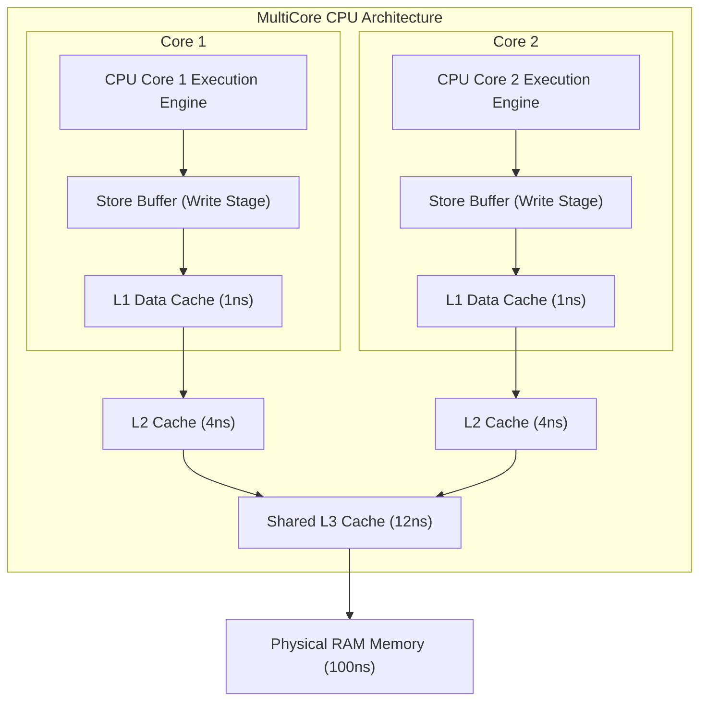
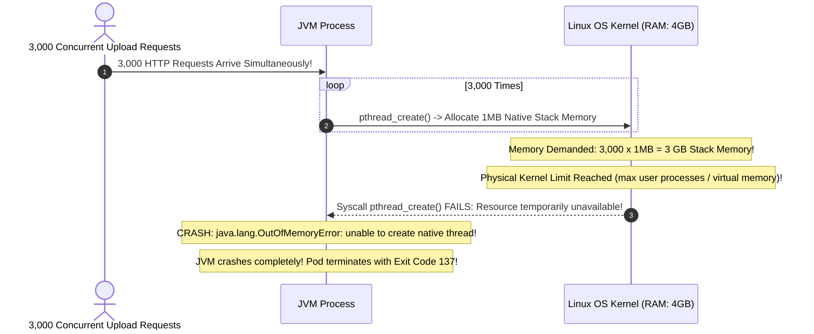
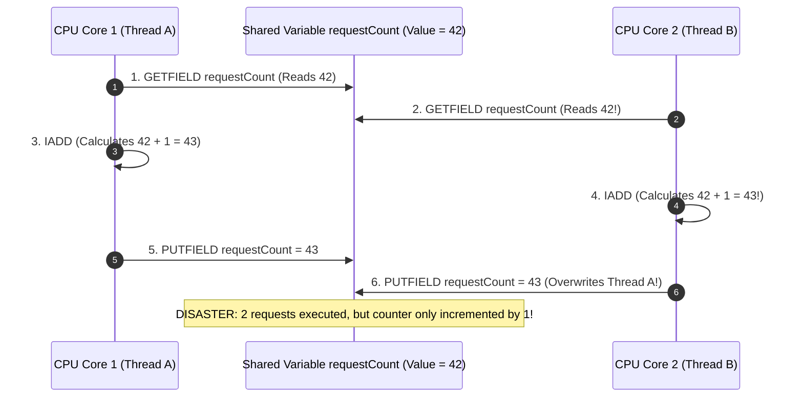
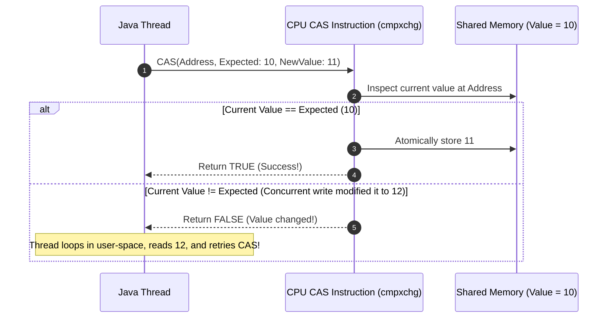
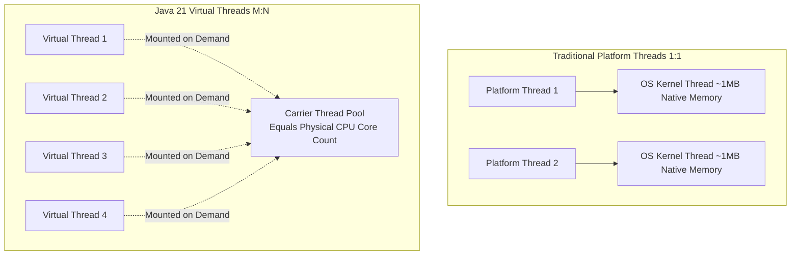
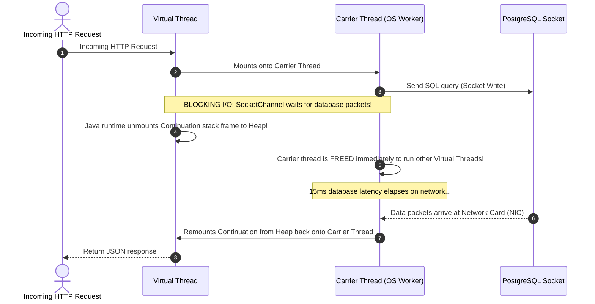
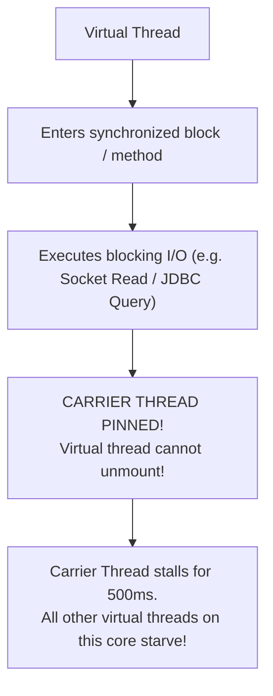
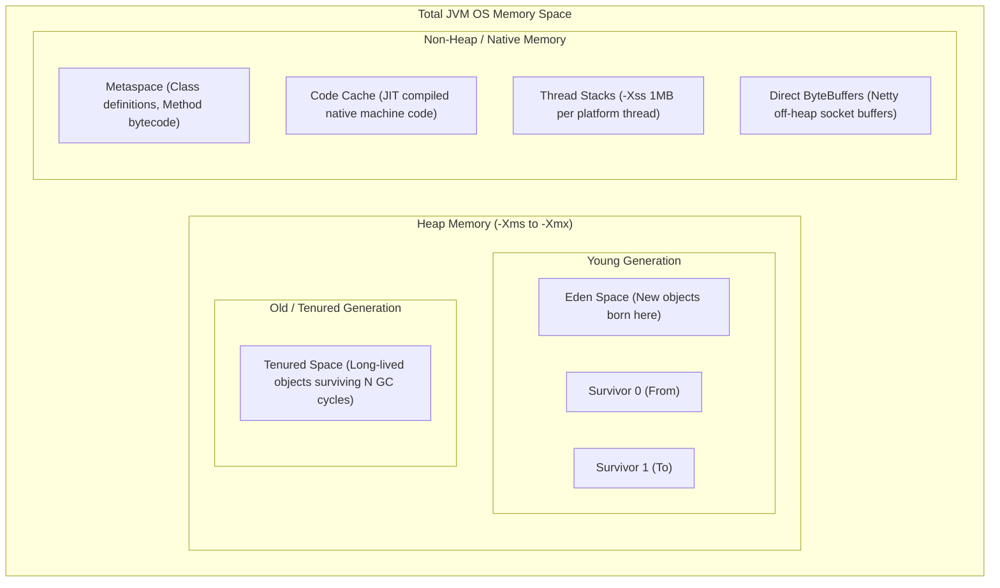

## Prerequisites: Before You Begin

Before studying Java concurrency and JVM internals, ensure you understand:
- Basic Java syntax: variables, methods, classes, and loops.
- What an operating system process is versus a thread.
- How memory references work in Java (heap objects versus primitive types).

---

# Phase 1: Ground Floor (Physical First Principles)

To understand multithreading, you must ground your thinking in the physical reality of computer hardware: **CPU cores, hardware registers, caches, and RAM**.



### 1. What Physically is a Platform Thread?
In traditional Java, every `java.lang.Thread` is a **Platform Thread** mapped 1:1 to an operating system kernel thread:
- **Physical Memory Cost**: The operating system pre-allocates **1 Megabyte of memory for the thread's execution stack** (`-Xss 1m`).
- **Physical Execution Limit**: An 8-core CPU can only physically execute **8 instructions simultaneously**.
- **The Kernel Context Switch**: To run 500 threads on an 8-core CPU, the Linux kernel interrupts threads thousands of times per second. It pauses Core 1, saves all CPU hardware registers to RAM, loads the next thread's registers, and invalidates CPU caches. This context switch costs **1 to 5 microseconds** of wasted CPU time per switch!

### 2. Why Concurrency is Hard: Hardware Latency & Store Buffers
Physical RAM is **100 times slower** than CPU registers. To avoid waiting 100ns on every variable read, CPUs use multi-level hardware caches:
- CPU Registers: **0.5 ns**
- L1 Data Cache: **1 ns**
- L2 Cache: **4 ns**
- L3 Cache: **12 ns**
- Main RAM: **100 ns**

To optimize writes, CPUs use **Store Buffers**. When Core 1 writes `ready = true`, the write sits in Core 1's private store buffer. 

**Core 2 running on another socket reading the same variable from its own cache sees `ready = false`!** Without synchronization rules, threads read stale data directly from hardware registers.

---

# Phase 2: The Naive Code (The Production Crash)

When a developer writes multi-threaded Java code without understanding hardware memory models, they trigger three classic production disasters.

### Catastrophe 1: The "New Thread per Request" OOM Crash

A developer receives requests to process image uploads. They decide to run each upload in its own thread:

```java
// NAIVE CODE: DESTROYS PRODUCTION PODS UNDER TRAFFIC!
@RestController
public class UploadController {

    @PostMapping("/upload")
    public String handleUpload(@RequestBody byte[] data) {
        // FATAL MISTAKE: Creating a raw OS platform thread per request!
        new Thread(() -> {
            processAndSaveImage(data);
        }).start();

        return "Processing started";
    }
}
```



#### Why Production Crashed:
Platform threads are heavy. Trying to spawn 3,000 platform threads demands 3GB of native operating system RAM just for empty execution stacks, exhausting kernel resources and terminating the JVM.

---

### Catastrophe 2: The `volatile int counter++` Silent Data Loss

A developer wants to track total API requests across threads. They know about visibility, so they use `volatile`:

```java
// NAIVE CODE: LOSES 30% TO 50% OF COUNTS UNDER TRAFFIC!
@Service
public class MetricsService {

    // Developer thinks volatile makes counter++ thread-safe!
    private volatile int requestCount = 0;

    public void recordRequest() {
        requestCount++; // NOT ATOMIC!
    }

    public int getCount() {
        return requestCount;
    }
}
```

#### The Bytecode Decompilation (Why Increments Vanish):
`requestCount++` looks like one line of Java, but compiling it to bytecode reveals **three separate CPU instructions**:

```java
GETFIELD requestCount // 1. Read current value into CPU register (e.g. reads 42)
ICONST_1              // 2. Load constant 1
IADD                  // 3. Add 1 (evaluates to 43)
PUTFIELD requestCount // 4. Write back to memory
```



`volatile` guarantees **Visibility** (Core 2 sees Core 1's write immediately), but it provides **zero Compound Atomicity**. If 1,000 threads execute `recordRequest()` 1,000 times each, the expected count is 1,000,000. In production, the actual count might be only 640,000!

---

### Catastrophe 3: ThreadLocal Memory Leaks in Pooled Web Workers

A developer uses `ThreadLocal` to store the authenticated user context:

```java
// NAIVE CODE: LEAKS SENSITIVE USER DATA AND CAUSES OOM!
public class UserContextHolder {
    private static final ThreadLocal<UserSession> CONTEXT = new ThreadLocal<>();

    public static void set(UserSession session) { CONTEXT.set(session); }
    public static UserSession get() { return CONTEXT.get(); }
    // FATAL MISTAKE: Never calling CONTEXT.remove()!
}
```

#### Why Production Leaks Memory and Security Data:
Tomcat web servers **pool and reuse worker threads**. A thread does **not** die when an HTTP request finishes; it returns to the pool to handle another user's request.
1. **Data Leak Across Users**: Thread 1 serves Alice. Alice's session stays in Thread 1's `ThreadLocalMap`. Next minute, Thread 1 serves Bob. Bob calls `UserContextHolder.get()` and sees **Alice's confidential account**!
2. **OutOfMemoryError**: Because the `ThreadLocal` map holds a strong reference to `UserSession` on a live thread, the Garbage Collector **cannot free the session object**. After 50,000 requests, the JVM heap fills with dead sessions, throwing `java.lang.OutOfMemoryError: Java heap space`.

---

# Phase 3: Under the Hood (Mechanics & Bytecode)

To master concurrency, you must understand the Java Memory Model, hardware atomic instructions, and modern Virtual Threads.

## 1. Hardware Compare-And-Swap (CAS) & `AtomicInteger`

Instead of blocking threads using heavy operating system kernel locks (`pthread_mutex`), non-blocking algorithms use the CPU's native `cmpxchg` assembly instruction:



`java.util.concurrent.atomic.AtomicInteger` executes this lock-free spin loop directly on CPU registers:

```java
// PRODUCTION-SAFE: Lock-free, zero OS context switching overhead!
private final AtomicInteger requestCount = new AtomicInteger(0);

public void recordRequest() {
    requestCount.incrementAndGet(); // Atomic cmpxchg loop!
}
```

---

## 2. Java 21 Virtual Threads (Project Loom)

Java 21 introduces **Virtual Threads** ($M:N$ threading), separating the concept of a thread from an operating system kernel thread.



### Platform Threads vs Virtual Threads

| Dimension | Platform Thread (Traditional) | Virtual Thread (Java 21) |
| :--- | :--- | :--- |
| **Mapping** | 1:1 with OS kernel pthread | $M:N$ multiplexed onto Carrier Threads |
| **Stack Memory** | **1 MB** pre-allocated in OS memory | **Few hundred bytes** allocated in JVM Heap |
| **Creation Overhead** | Expensive ($\sim 1\text{ ms}$, OS syscall) | Instantaneous ($\sim \text{few nanoseconds}$) |
| **Context Switch** | Heavy kernel space ($1,000 - 5,000\text{ ns}$) | Ultra-fast user space ($10 - 50\text{ ns}$) |
| **Capacity Limit** | $\sim 200 - 500$ threads per JVM | **Millions of concurrent threads** |

---

### The Continuation Unmount & Remount Lifecycle

How can a single CPU core execute 10,000 Virtual Threads without blocking?



When a Virtual Thread hits blocking I/O (JDBC query, HTTP client call, `Thread.sleep`), the JVM **unmounts its call stack to the heap** and immediately assigns the underlying OS Carrier Thread to another virtual thread. The operating system kernel **never blocks**!

---

### The Carrier Thread Pinning Trap

When a Virtual Thread is **pinned**, it cannot unmount from its underlying OS Carrier Thread during blocking I/O. If all Carrier Threads become pinned, your entire JVM freezes!



#### What Causes Pinning:
1. Executing blocking network/disk I/O inside a Java `synchronized` block or method.
2. Executing blocking I/O across a native method or JNI interface.

#### The Production Fix: Replace `synchronized` with `ReentrantLock`
`java.util.concurrent.locks.ReentrantLock` unmounts cleanly without pinning carrier threads:

```java
// ANTI-PATTERN: Pins carrier thread during network I/O
public synchronized byte[] fetchExternalData() {
    return restClient.get().uri("/data").retrieve().body(byte[].class);
}

// PRODUCTION PATTERN: Unmounts cleanly without pinning!
private final ReentrantLock lock = new ReentrantLock();

public byte[] fetchExternalDataSafe() {
    lock.lock();
    try {
        return restClient.get().uri("/data").retrieve().body(byte[].class);
    } finally {
        lock.unlock();
    }
}
```

---

## 3. JVM Memory Layout & Low-Latency Garbage Collection



### Production Garbage Collectors: G1GC vs Generational ZGC

| Dimension | G1GC (Default in Java 21) | Generational ZGC (Java 21 Flag) |
| :--- | :--- | :--- |
| **Heap Size Range** | 4 GB – 64 GB | 16 GB – 16 TB |
| **Target Pause Time** | 100 – 200 ms | **Under 1 ms (Sub-millisecond)** |
| **Mechanism** | Region-based evacuation with STW pauses | Colored pointers & load barriers (fully concurrent) |
| **Throughput Overhead** | Low ($\sim 2–5\%$ CPU overhead) | Moderate ($\sim 5–10\%$ CPU overhead) |
| **Recommended Use Case** | Standard Spring Boot APIs and microservices | Low-latency APIs, financial trading, massive heap caches |

#### Enabling Generational ZGC in Production:
```bash
java -XX:+UseZGC -XX:+ZGenerational -Xms8g -Xmx8g -jar app.jar
```

---

# Phase 4: Senior Interview Ace (Junior vs. Staff Phrasing)

Senior interviewers test concurrency to verify whether an engineer understands low-level hardware memory barriers and runtime thread scheduling.

### Q1: "Why does `volatile` guarantee visibility but not atomicity for `count++`?"

```diff
- JUNIOR ANSWER:
  "Volatile makes a variable thread-safe. But count++ is two operations, so you need synchronized."
```

```diff
+ SENIOR / STAFF ANSWER:
  "The volatile keyword enforces CPU memory barriers (instruction fences) that flush the CPU core's 
   store buffers upon write and bypass local registers upon read, guaranteeing that all threads read 
   the most recently written value in shared memory according to the JMM volatile-variable happens-before rule.
   
   However, count++ is a compound read-modify-write operation that compiles into 4 distinct bytecode instructions: 
   GETFIELD, ICONST_1, IADD, and PUTFIELD. Even though the read and write stages individually observe 
   memory barriers, an intervening context switch between the GETFIELD read and the PUTFIELD write 
   allows concurrent threads to overwrite each other's updates. 
   
   To achieve compound atomicity, we use hardware Compare-And-Swap primitives like AtomicInteger.incrementAndGet() 
   or explicit synchronization via ReentrantLock."
```

---

### Q2: "What is a Virtual Thread, and how does it achieve high throughput without consuming 1MB of stack memory?"

```diff
- JUNIOR ANSWER:
  "Virtual threads are lightweight threads in Java 21. They run faster because they don't use memory."
```

```diff
+ SENIOR / STAFF ANSWER:
  "Traditional platform threads map 1:1 with operating system kernel pthreads, pre-allocating a 1MB native 
   stack and requiring expensive OS kernel context switches (1-5 microseconds).
   
   Java 21 Virtual Threads (Project Loom) implement an M:N user-mode threading model. Their call stack frames 
   are dynamically allocated in the standard JVM Heap as Continuation objects, starting at only a few hundred bytes. 
   Virtual threads are multiplexed on demand onto a small pool of OS Carrier Threads (typically matching CPU core count).
   
   When a virtual thread initiates blocking I/O (such as a database query or network socket read), the JVM intercepts 
   the operation, unmounts the continuation stack to the heap, and immediately assigns the underlying Carrier Thread 
   to execute other virtual threads. When I/O completion packets arrive, the JVM remounts the continuation onto an 
   available carrier thread. This eliminates kernel context switching and permits millions of concurrent tasks 
   to run on a single machine."
```

---

### Q3: "What is Carrier Thread Pinning in Java 21, and how do you prevent it?"

```diff
- JUNIOR ANSWER:
  "Pinning happens when a virtual thread gets stuck. You fix it by not using locks."
```

```diff
+ SENIOR / STAFF ANSWER:
  "Carrier Thread Pinning occurs when a Virtual Thread executes a blocking operation while holding a 
   Java monitor lock (inside a synchronized block or method) or within native C/JNI code. 
   
   Under these conditions, the internal runtime continuation cannot safely detach from the underlying 
   operating system Carrier Thread. The carrier thread remains physically blocked for the entire duration 
   of the I/O operation. If concurrent requests pin all available carrier threads (which default to CPU core count), 
   the carrier thread pool is completely starved, causing a catastrophic application freeze.
   
   We prevent pinning by replacing synchronized blocks around I/O with java.util.concurrent.locks.ReentrantLock, 
   which unmounts cleanly without pinning. We detect pinning in staging by running with the JVM flag 
   '-Djdk.tracePinnedThreads=full'."
```

---

### Q4: "Why do uncleaned ThreadLocal variables cause memory leaks in Spring Boot web applications?"

```diff
- JUNIOR ANSWER:
  "ThreadLocal leaks memory if you forget to set it to null."
```

```diff
+ SENIOR / STAFF ANSWER:
  "Spring Boot applications run on web containers like Tomcat that maintain worker thread pools. 
   Threads are long-lived and reused across thousands of successive HTTP requests.
   
   Each Thread object maintains a private ThreadLocalMap where keys are weak references to the ThreadLocal object, 
   but values are strong references to the stored business objects. If an application sets a value without explicitly 
   calling 'ThreadLocal.remove()' inside a finally block, the pooled thread retains a strong reference to that object 
   indefinitely. 
   
   This causes two severe production hazards:
   1. Cross-Tenant Data Leaks: A subsequent request handled by that same worker thread will read the previous user's 
      uncleaned context, causing catastrophic privacy breaches.
   2. Heap OutOfMemoryError: Because the pooled thread is a Garbage Collection Root (GC Root), the retained objects 
      accumulate over time and can never be collected by the Garbage Collector, leading to OutOfMemoryError: Java heap space."
```

---

## Concurrency Fundamentals Interview Map

Concurrency questions are about what two threads can observe and modify at the same time.

### 1. Thread vs task

A task is work. A thread is an execution vehicle.


Platform threads are OS-backed and expensive. Virtual threads are JVM-managed and cheap for blocking I/O, but they do not make shared mutable state safe.

### 2. Race condition

This is not atomic:

```java
count++;
```

It is three steps:

```console
read count
add 1
write count
```

Two threads can both read `41`, both compute `42`, and both write `42`. One increment disappears.

### 3. Visibility vs atomicity

`volatile` gives visibility. It does not make compound operations atomic.

```java
private volatile int count;

void increment() {
    count++; // still unsafe
}
```

Use `AtomicInteger`, locks, or database atomic updates depending on the shared state location.

### 4. Locks protect critical sections

```java
lock.lock();
try {
    balance = balance.subtract(amount);
} finally {
    lock.unlock();
}
```

In backend systems, prefer database constraints and atomic SQL for persistent invariants. JVM locks protect only one process; they do not coordinate multiple pods.

### 5. ThreadLocal is request-scoped only if cleaned

A Tomcat thread can serve thousands of users over its lifetime. A `ThreadLocal` value left behind can leak one user's data into another request.

Always clean:

```java
try {
    CURRENT_USER.set(user);
    chain.doFilter(request, response);
} finally {
    CURRENT_USER.remove();
}
```

### Build-Break-Fix Lab

<Steps>
  <Step title="Build">
    Implement an inventory decrement using a shared counter and then a database row.
  </Step>
  <Step title="Break">
    Use `volatile int stock` and run 50 concurrent purchases.
  </Step>
  <Step title="Observe">
    Watch lost updates or negative stock under contention.
  </Step>
  <Step title="Fix">
    Use `AtomicInteger` for in-memory demos and atomic SQL for persistent inventory.
  </Step>
  <Step title="Prove">
    Add a `CountDownLatch` concurrency test where exactly `K` of `N` purchases succeed.
  </Step>
</Steps>

---

## Failure Modes & Edge Case Matrix

| Failure Mode | Root Cause | Impact | Production Defense |
| :--- | :--- | :--- | :--- |
| **Native Thread OOM** | Spawning raw `new Thread()` per request | `OutOfMemoryError: unable to create native thread` | Use Virtual Threads (`Executors.newVirtualThreadPerTaskExecutor()`). |
| **Lost Increments** | Using `volatile` for compound operations (`count++`) | Silent data loss under concurrent traffic | Use `AtomicInteger` or atomic database increments. |
| **Carrier Thread Starvation** | Blocking I/O inside `synchronized` blocks in Virtual Threads | Carrier threads pin; JVM freezes completely | Replace `synchronized` with `ReentrantLock` around I/O. |
| **ThreadLocal Memory Leak** | Omitting `ThreadLocal.remove()` in pooled web workers | Heap memory leak and cross-user data exposure | Always call `remove()` in a `try-finally` block or servlet filter. |
| **Common Pool Saturation** | Executing blocking I/O inside `parallelStream()` | Exhausts `ForkJoinPool.commonPool()`; freezes entire JVM | Never execute I/O inside `parallelStream()`; use dedicated executors. |

---

## Done Checklist

<Check>
- [ ] Understand the physical hardware latency hierarchy (CPU Registers vs L1/L2/L3 Caches vs RAM).
- [ ] Explain why `volatile` guarantees visibility but fails to guarantee atomicity for `count++`.
- [ ] Implement lock-free atomic counters using hardware Compare-And-Swap (`AtomicInteger`).
- [ ] Diagram the Java 21 Virtual Thread continuation unmount/remount lifecycle.
- [ ] Prevent Carrier Thread Pinning by replacing `synchronized` with `ReentrantLock` around I/O.
- [ ] Prevent ThreadLocal memory leaks by enforcing `ThreadLocal.remove()` in `finally` blocks.
- [ ] Compare G1GC with Generational ZGC for low-latency production microservices.
</Check>
