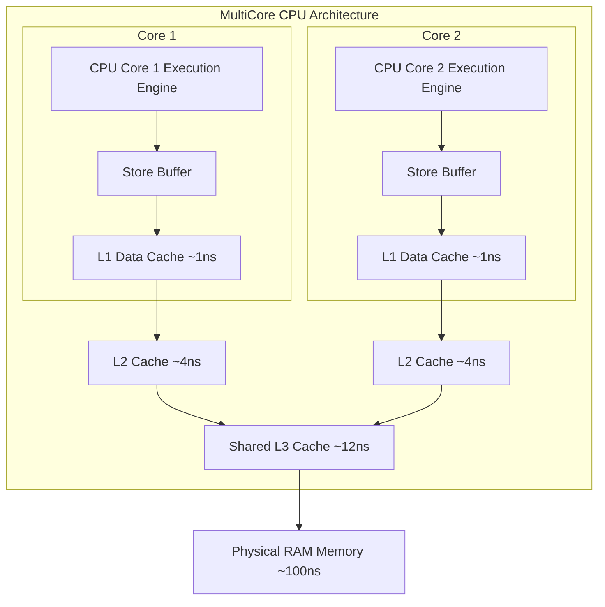
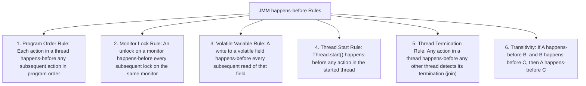
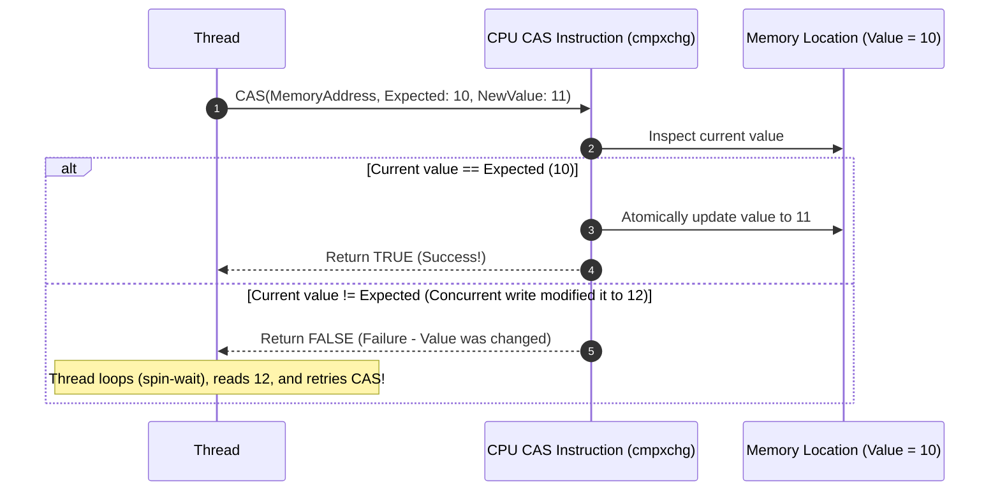
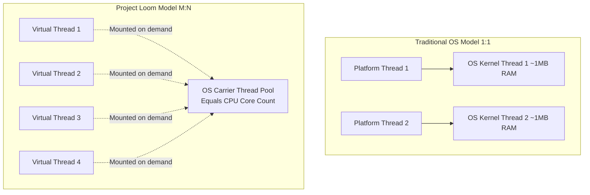
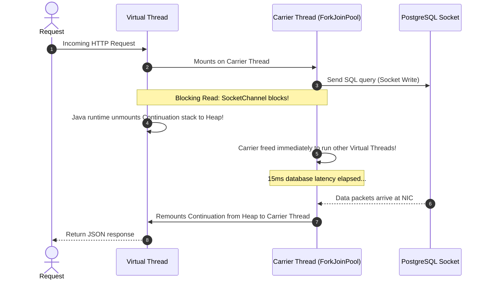
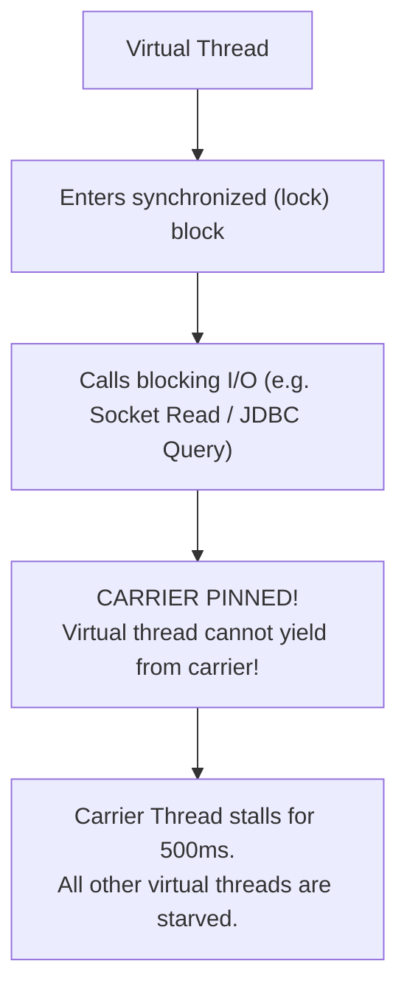
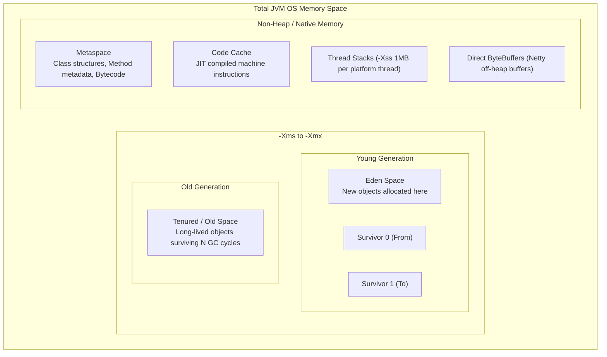
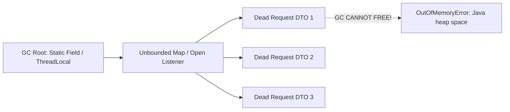
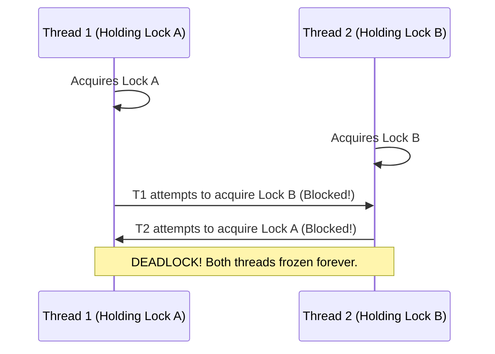

# Java Concurrency & JVM Internals: From JMM to Virtual Threads

In backend development, a single server handles thousands of concurrent HTTP requests, database connections, and background message streams. Every incoming request executes concurrently across shared CPU cores and memory.

Superficial knowledge of multithreading leads to catastrophic production failures: silent data corruption, thread starvation, deadlocks under load, and JVM OutOfMemory crashes that take down entire clusters.

This guide provides an exhaustive, production-grade manual for concurrency in modern Java 21, the Java Memory Model, Virtual Thread internals, and JVM performance tuning.

---

## The Hardware Reality & The Java Memory Model (JMM)

### Why Concurrency is Hard: Hardware Caches
Modern CPUs are thousands of times faster than physical RAM. To prevent execution stalls, CPU cores maintain multi-level hardware caches (L1, L2, L3) and speculative Store Buffers:



Because Core 1 buffers writes in its local cache, **Core 2 reading the same memory address does not see Core 1's updates immediately**. Furthermore, the compiler, JIT compiler, and CPU dynamically reorder machine instructions to maximize execution pipelining.

### The Two Concurrency Hazards

1. **Atomicity**: Can an operation be interrupted mid-execution?
   - *Example*: `count++` decomposes into 3 distinct CPU bytecode instructions (`getfield`, `iadd`, `putfield`).
2. **Visibility**: When Thread A mutates a variable in its CPU cache, when does Thread B on another core see that update?

### The `happens-before` Guarantee (JSR-133)
The Java Memory Model (JMM) provides formal ordering guarantees known as `happens-before`. If action $X$ `happens-before` action $Y$, the results of $X$ are guaranteed to be visible to $Y$:



### The `volatile` Keyword: Visibility Without Atomicity
Marking a variable as `volatile` instructs the JIT compiler to insert CPU **memory barriers** (fences). Every write flushes the CPU store buffer to main cache, and every read bypasses local registers to read from shared memory.

```java
// VISIBILITY SAFE, ATOMICITY BROKEN
private volatile int counter = 0;

public void increment() {
    // UNSAFE! Bytecode still decomposes into:
    // 1: GETFIELD counter (reads latest value)
    // 2: ICONST_1
    // 3: IADD
    // 4: PUTFIELD counter (overwrites concurrent writes)
    counter++; 
}
```

<Warning>
**`volatile` only guarantees Visibility**, not Mutual Exclusion or Compound Atomicity. If two threads invoke `increment()` concurrently, both read 0, both calculate 1, and both write 1 back. One increment is permanently lost.
</Warning>

---

## Synchronization Primitives: Locks vs CAS

### 1. Hardware Compare-And-Swap (CAS) & `Atomic*` Classes
Instead of blocking threads using operating system kernel locks, non-blocking algorithms use the CPU's native `cmpxchg` instruction:



`java.util.concurrent.atomic.AtomicInteger` and `AtomicReference` leverage CAS loops to achieve high-throughput thread safety without kernel context switches:

```java
// PRODUCTION-SAFE: Atomic, non-blocking counter
private final AtomicInteger requestCount = new AtomicInteger(0);

public void recordRequest() {
    requestCount.incrementAndGet(); // Atomic CAS loop
}
```

### 2. `synchronized` and JVM Lock Optimization
In modern Java, `synchronized` is a reentrant monitor lock managed by the JVM. The JVM optimizes lock overhead through **Lock Escalation**:
1. **Lightweight Lock (Thin Lock)**: When contention is low, the JVM avoids OS mutexes by swapping a pointer into the Object Header Mark Word using CAS.
2. **Heavyweight Lock (OS Monitor)**: When multiple threads contend simultaneously, the JVM inflates the lock into an OS-level mutex (`pthread_mutex`), parking waiting threads in the operating system kernel scheduler.

### 3. `ReentrantLock` & Explicit Concurrency
`java.util.concurrent.locks.ReentrantLock` provides explicit lock management built on the **AbstractQueuedSynchronizer (AQS)** framework:

```java
private final ReentrantLock lock = new ReentrantLock(true); // Fair lock

public void executeTransaction() {
    try {
        // Prevent thread starvation with bounded acquisition timeout
        if (lock.tryLock(5, TimeUnit.SECONDS)) {
            try {
                // Critical section
            } finally {
                lock.unlock(); // Always release in finally block!
            }
        } else {
            throw new LockTimeoutException("Could not acquire lock within 5 seconds");
        }
    } catch (InterruptedException e) {
        Thread.currentThread().interrupt(); // Restore interrupted status
        throw new RuntimeException(e);
    }
}
```

---

## Java 21 Virtual Threads (Project Loom)

Java 21 revolutionizes backend throughput by introducing **Virtual Threads** ($M:N$ threading).



### Platform vs Virtual Threads

| Metric | Traditional Platform Thread | Java 21 Virtual Thread |
| :--- | :--- | :--- |
| **Mapping** | 1:1 with OS kernel pthread | $M:N$ multiplexed onto Carrier Threads |
| **Stack Memory** | ~1 MB pre-allocated in OS memory | Starts at ~few hundred bytes in JVM Heap |
| **Creation Cost** | Expensive (~1-2ms, OS syscall) | Instantaneous (~few nanoseconds) |
| **Context Switch** | Kernel space (~1,000 - 5,000ns) | User space (~10 - 50ns) |
| **Maximum Limit** | 200 - 500 threads per JVM instance | Millions of concurrent threads |

### The Unmount & Remount Sequence



### Carrier Pinning in Java 21

<Note>
This section targets Java 21. JDK 24 changed monitor handling to reduce pinning caused by `synchronized`; check your runtime before changing locks. See [JDK 24 migration notes](https://docs.oracle.com/en/java/javase/24/migrate/significant-changes-jdk-24.html).
</Note>

When a Virtual Thread is **pinned**, it cannot unmount from its underlying OS Carrier Thread during blocking I/O. If all Carrier Threads become pinned, the entire JVM freezes, causing total outage!



#### Pinning Causes
1. Executing blocking I/O inside a `synchronized` block or method.
2. Executing blocking I/O across a native method or foreign function interface (JNI).

#### The Production Fix: Replace `synchronized` with `ReentrantLock`
```java
// ANTI-PATTERN: Pins carrier thread on blocking I/O
public synchronized byte[] fetchFromUpstream() {
    return restTemplate.getForObject("https://api.external.com/data", byte[].class);
}

// PRODUCTION PATTERN: Unmounts cleanly with ReentrantLock
private final ReentrantLock lock = new ReentrantLock();

public byte[] fetchFromUpstreamSafe() {
    lock.lock();
    try {
        return restTemplate.getForObject("https://api.external.com/data", byte[].class);
    } finally {
        lock.unlock();
    }
}
```

#### Detecting Pinning in Production
Add this JVM startup flag to log stack traces of pinned threads:
```bash
-Djdk.tracePinnedThreads=full
```

<Warning>
**Never Pool Virtual Threads**:
Do not use `ThreadPoolExecutor` or `Commons-Pool` for Virtual Threads. They are designed to be disposable short-lived objects. Create them per task:
`Executors.newVirtualThreadPerTaskExecutor()`.
</Warning>

---

## JVM Memory Architecture & Garbage Collection

### Complete JVM Memory Layout



### Production Garbage Collectors: G1GC vs Generational ZGC

Modern backend microservices run either **G1GC** or Java 21's **Generational ZGC**:

| Dimension | G1GC (Default) | Generational ZGC (Java 21) |
| :--- | :--- | :--- |
| **Heap Size Range** | 4 GB – 64 GB | 16 GB – 16 TB |
| **Target Pause Time** | 100 – 200 ms | Under 1 ms (Sub-millisecond) |
| **Mechanism** | Region-based evacuation with incremental STW pauses | Colored pointers & Load barriers (fully concurrent) |
| **Throughput Overhead** | Low (~2–5% CPU overhead) | Moderate (~5–10% CPU overhead) |
| **Recommended Use Case** | Standard APIs, general pods with standard latency SLA | Low-latency APIs, financial trading, massive in-memory caches |

#### Enabling Generational ZGC in Java 21
```bash
java -XX:+UseZGC -XX:+ZGenerational -Xms8g -Xmx8g -jar app.jar
```

---

## Memory Leaks in Java Backends

Although Java manages memory automatically, references held by live roots prevent the Garbage Collector from freeing dead objects, leading to `java.lang.OutOfMemoryError: Java heap space`.



### The 3 Most Common Backend Leaks

#### 1. Uncleaned `ThreadLocal` in Thread Pools
Platform threads in web servers (Tomcat/Jetty) are pooled and reused across thousands of requests:

```java
// ANTI-PATTERN: Causes silent memory leaks and data leakage across users!
public class UserContextHolder {
    private static final ThreadLocal<UserContext> CONTEXT = new ThreadLocal<>();

    public static void set(UserContext context) { CONTEXT.set(context); }
    public static UserContext get() { return CONTEXT.get(); }
    // OMITTING remove() LEAKS MEMORY FOREVER!
}

// RESOLUTION: Always clean up in a servlet filter finally block:
@Component
public class ContextCleanupFilter implements Filter {
    @Override
    public void doFilter(ServletRequest req, ServletResponse res, FilterChain chain) 
            throws IOException, ServletException {
        try {
            chain.doFilter(req, res);
        } finally {
            UserContextHolder.clear(); // Mandatory CONTEXT.remove()!
        }
    }
}
```

#### 2. Static Unbounded Collections
```java
// ANTI-PATTERN: Never use raw HashMaps as caches
private static final Map<String, Session> SESSIONS = new ConcurrentHashMap<>();

// RESOLUTION: Use Caffeine Cache with explicit TTL and maximumSize bounds
Cache<String, Session> sessionCache = Caffeine.newBuilder()
    .maximumSize(10_000)
    .expireAfterWrite(30, TimeUnit.MINUTES)
    .recordStats()
    .build();
```

#### 3. Reading Giant Files into `byte[]`
```java
// ANTI-PATTERN: Loading a 2GB video into byte array exhausts the Young Gen instantly
byte[] fileContent = multipartFile.getBytes(); 

// RESOLUTION: Stream chunks directly to disk or S3 via InputStream:
try (InputStream in = multipartFile.getInputStream();
     OutputStream out = Files.newOutputStream(targetPath)) {
    in.transferTo(out); // Zero-copy stream buffer
}
```

---

## Production Thread Dumps & Deadlock Diagnostics

### The 4 Coffman Conditions for Deadlock
A deadlock occurs when two or more threads are permanently blocked waiting for each other. All 4 conditions must be present:
1. **Mutual Exclusion**: Resources cannot be shared.
2. **Hold and Wait**: A thread holding Resource A waits to acquire Resource B.
3. **No Preemption**: Resources cannot be forcibly taken away.
4. **Circular Wait**: Thread 1 waits for Thread 2, which waits for Thread 1.



### Capturing and Reading Thread Dumps
In production Linux environments, generate a thread dump using `jcmd`:

```bash
# Capture full thread dump to file
jcmd <PID> Thread.dump_to_file -format=text /dumps/thread_dump.txt
```

#### Deadlock Output in Thread Dump
```console
Found one Java-level deadlock:
=============================
"http-nio-8080-exec-1":
  waiting to lock monitor 0x00007f9 (object 0x000000071, a java.lang.Object),
  which is held by "http-nio-8080-exec-2"
"http-nio-8080-exec-2":
  waiting to lock monitor 0x00007fa (object 0x000000072, a java.lang.Object),
  which is held by "http-nio-8080-exec-1"

Java stack information for the threads listed above:
===================================================
"http-nio-8080-exec-1":
  at com.example.service.TransferService.transfer(TransferService.java:45)
  - waiting to lock <0x000000071> (a com.example.model.Account)
  - locked <0x000000072> (a com.example.model.Account)
```

<Tip>
**Deadlock Prevention Rule**: Always acquire locks in a globally consistent canonical order (e.g., sort accounts by `accountId` before locking both).
</Tip>

---

## Common Concurrency Anti-Patterns in Spring Boot

<Warning>
### 1. Mutable Request State in Singleton Beans
Spring beans (`@Service`, `@Component`, `@RestController`) are **singletons by default**. Storing state in instance fields creates severe race conditions between concurrent requests:
```java
@Service
public class OrderService {
    private String currentOrderId; // DISASTER: Overwritten by concurrent threads!
}
```
</Warning>

<Warning>
### 2. Using `parallelStream()` in Web Request Threads
`Collection.parallelStream()` uses the shared JVM-wide `ForkJoinPool.commonPool()`. If a single request executes a slow I/O task inside a parallel stream, it saturates the common pool, freezing all other parallel streams across the entire application.
</Warning>

<Warning>
### 3. Missing Heap Dump on OOM Flags
If a container crashes from OOM, Kubernetes immediately terminates the pod and spins up a new one, destroying all diagnostic evidence. Always configure:
```bash
-XX:+HeapDumpOnOutOfMemoryError -XX:HeapDumpPath=/dumps/oom.hprof
```
</Warning>

---

## Active Recall & Interview Mastery

<AccordionGroup>
  <Accordion title="1. What is the happens-before relationship, and why is it necessary?">
    The `happens-before` relationship is the formal semantic specification in the Java Memory Model (JMM) that guarantees when memory writes by one thread are visibly observed by another thread. Modern CPUs and JIT compilers aggressively reorder instructions and buffer writes in local CPU caches. Without `happens-before` rules (such as monitor unlock happens-before lock, or volatile write happens-before read), threads could read stale or out-of-order data, corrupting state.
  </Accordion>

  <Accordion title="2. Why doesn't the volatile keyword make counter++ thread-safe?">
    `counter++` is a compound read-modify-write operation consisting of three distinct bytecode instructions: `getfield`, `iadd`, and `putfield`. While `volatile` guarantees visibility (providing the visibility and ordering guarantees of a volatile write followed by a read of that field), it does not guarantee mutual exclusion. If two threads execute `counter++` concurrently, both can read the same initial value before either writes the incremented result, causing lost updates.
  </Accordion>

  <Accordion title="3. What is carrier thread pinning in Java 21 Virtual Threads, and how do you avoid it?">
    Carrier thread pinning occurs when a Virtual Thread executes blocking I/O while holding a monitor lock (`synchronized` block or method) or inside native code (JNI). When pinned, the JVM cannot unmount the Virtual Thread from its underlying OS Carrier Thread. If multiple virtual threads pin all available carrier threads during slow I/O, the entire carrier thread pool is starved, causing catastrophic application freezes. It is avoided by replacing `synchronized` blocks around I/O with `java.util.concurrent.locks.ReentrantLock`.
  </Accordion>

  <Accordion title="4. How does Compare-And-Swap (CAS) differ from synchronized monitor locking?">
    `synchronized` is a pessimistic, blocking mechanism that acquires a monitor lock, potentially forcing waiting threads to be suspended by the operating system kernel and causing expensive context switches. CAS is an optimistic, non-blocking hardware instruction (`cmpxchg`) that compares memory to an expected value and updates it only if matched. If contention occurs, the thread spins in user-space and retries without entering kernel wait states, achieving much higher throughput under moderate contention.
  </Accordion>

  <Accordion title="5. Why do uncleaned ThreadLocal variables cause memory leaks in Spring Boot applications?">
    Spring Boot runs on web servers (Tomcat) that maintain worker thread pools. Threads do not terminate after completing an HTTP request; they return to the pool. If code puts objects into a `ThreadLocal` without calling `.remove()` in a `finally` block, the thread retains a strong reference to the value in its `threadLocals` map. Over time, as requests execute across pooled threads, retained objects accumulate in memory and cannot be garbage collected, leading to `OutOfMemoryError: Java heap space`.
  </Accordion>
</AccordionGroup>
