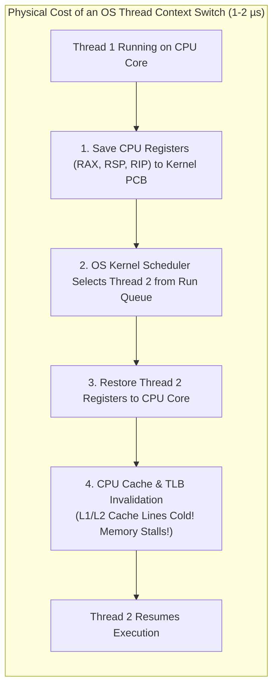
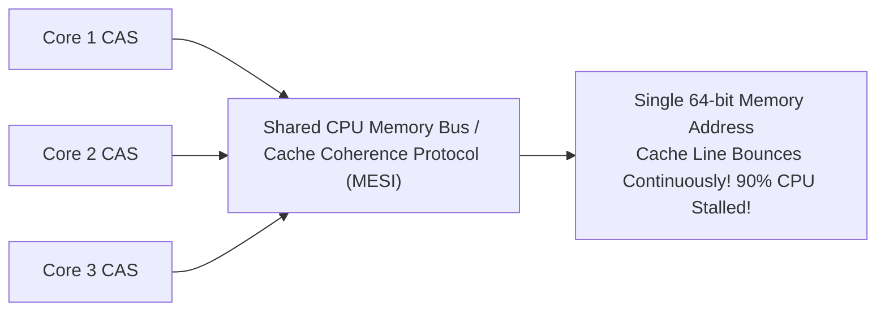

# Java Concurrent Utilities: Thread Pools, Locks & CompletableFuture

In enterprise backend engineering, multithreading and asynchronous execution are critical for achieving high throughput. 

However, misconfiguring concurrency primitives is one of the most common causes of high-severity production outages:
- **Catastrophic OutOfMemoryError via `Executors.newFixedThreadPool()`**: Unbounded internal task queues (`LinkedBlockingQueue`) that absorb millions of pending tasks when downstream services slow down, consuming all heap RAM.
- **CPU Context-Switch Thrashing via `Executors.newCachedThreadPool()`**: Spawning thousands of unconstrained platform threads during traffic spikes, exhausting memory and overwhelming the OS scheduler.
- **Thread Starvation Deadlocks**: Submitting interdependent parent-child tasks to the same thread pool, permanently deadlocking every worker thread.
- **Cache-Line Bouncing Under Contention**: Using simple atomic counters (`AtomicLong`) across dozens of CPU cores, causing extreme cache-coherence bus traffic and stalling execution.

This masterclass deconstructs `java.util.concurrent` from CPU run queues and cache-line bouncing up to production-grade asynchronous pipelines.

---

## Phase 1: Ground Floor (Physical First Principles)

To master thread pools and locks, we must understand the physical cost of thread scheduling in the operating system kernel and CPU hardware.



### 1.1 The Physical Overhead of Platform Threads
Every standard Java platform thread maps 1:1 to an underlying **Operating System kernel thread**:
- **Memory Footprint**: Each thread is allocated a private **$1\text{ MB}$ native stack memory** outside the JVM heap. Allocating 2,000 threads consumes $2\text{ GB}$ of physical RAM solely for thread stacks.
- **Context Switch Latency**: Switching execution between threads takes **$1\text{ to }2\text{ microseconds}$** ($1,000\text{–}2,000\text{ nanoseconds}$). While $1\text{ µs}$ sounds fast, in that time a $3\text{ GHz}$ CPU core could have executed over **3,000 instructions**.
- **Hardware Cache Pollution**: When a new thread is scheduled, the CPU core's fast L1/L2 caches contain the old thread's memory. The new thread incurs continuous cache misses, stalling the CPU while fetching from main memory.

---

### 1.2 Thread Pool Sizing Mathematics: Little's Law

How many threads should a thread pool have? Guessing causes either thread starvation or CPU thrashing.

The mathematically derived sizing formula is:
$$N_{\text{threads}} = N_{\text{CPU}} \times U_{\text{CPU}} \times \left(1 + \frac{W}{C}\right)$$

Where:
- $N_{\text{CPU}}$: Number of available CPU cores (`Runtime.getRuntime().availableProcessors()`).
- $U_{\text{CPU}}$: Target CPU utilization ($0 \le U_{\text{CPU}} \le 1$, e.g., $0.80$ for 80% CPU).
- $W/C$: **Wait time to Compute time ratio**:
  - $W$: Time spent waiting for external I/O (database queries, network HTTP calls, disk reads).
  - $C$: Time spent actively executing CPU instructions (JSON parsing, business logic calculation).

#### Concrete Sizing Examples:
1. **CPU-Bound Tasks (Image processing, cryptography, compression)**:
   - $W \approx 0$ (no waiting).
   - $N_{\text{threads}} = N_{\text{CPU}} + 1$. On an 8-core machine: **9 threads**.
2. **I/O-Bound Tasks (Spring Boot REST APIs with PostgreSQL)**:
   - Request takes $100\text{ ms}$ total: $90\text{ ms}$ waiting for database ($W$), $10\text{ ms}$ executing Java code ($C$).
   - $W/C = 90 / 10 = 9$.
   - $N_{\text{threads}} = 8 \times 1.0 \times (1 + 9) = \mathbf{80\text{ threads}}$.

---

## Phase 2: The Naive Code (The Production Crashes)

### Crash Scenario 1: The `Executors.newFixedThreadPool()` Heap Explosion

A developer creates a background email notification worker using Java's standard factory:

```java
// DANGEROUS ANTI-PATTERN: Using Executors factory methods in production
public class EmailService {
    // FATAL: Backed by an UNBOUNDED LinkedBlockingQueue!
    private final ExecutorService executor = Executors.newFixedThreadPool(10);

    public void queueEmail(Email email) {
        executor.submit(() -> sendEmailViaSmtp(email));
    }
}
```

#### Why it Crashes in Production:
Let's inspect the JDK source code for `Executors.newFixedThreadPool(n)`:
```java
public static ExecutorService newFixedThreadPool(int nThreads) {
    return new ThreadPoolExecutor(nThreads, nThreads,
                                  0L, TimeUnit.MILLISECONDS,
                                  new LinkedBlockingQueue<Runnable>()); // Capacity = Integer.MAX_VALUE!
}
```
The internal `LinkedBlockingQueue` defaults to `Integer.MAX_VALUE` ($2,147,483,647$ items).

When the SMTP mail server experiences network latency:
1. All 10 worker threads are blocked waiting for SMTP network sockets.
2. Incoming requests continue calling `queueEmail()`.
3. The queue silently absorbs **$1,500,000$ pending email tasks**.
4. Each pending task object holds memory pointers in the heap.
5. The JVM crashes with `java.lang.OutOfMemoryError: Java heap space`.

---

### Crash Scenario 2: The `Executors.newCachedThreadPool()` OS Meltdown

```java
// DANGEROUS ANTI-PATTERN: Unbounded thread creation
private final ExecutorService executor = Executors.newCachedThreadPool();
```
`newCachedThreadPool()` has `corePoolSize = 0`, `maximumPoolSize = Integer.MAX_VALUE`, and uses a `SynchronousQueue`. 

During a traffic spike of 8,000 concurrent requests, it attempts to spawn **8,000 native OS threads** simultaneously. The operating system runs out of thread handles, Linux kills the process, and the server crashes.

---

### Crash Scenario 3: Thread Starvation Deadlock

```java
// DANGEROUS ANTI-PATTERN: Submitting child tasks to the same thread pool
ExecutorService pool = Executors.newFixedThreadPool(2);

pool.submit(() -> {
    // Parent task 1 running on Worker Thread 1
    Future<String> childTask = pool.submit(() -> "Child Result");
    return childTask.get(); // Blocks Worker Thread 1 waiting for child task!
});

pool.submit(() -> {
    // Parent task 2 running on Worker Thread 2
    Future<String> childTask = pool.submit(() -> "Child Result");
    return childTask.get(); // Blocks Worker Thread 2 waiting for child task!
});
```

#### The Deadlock Sequence:
1. Thread 1 and Thread 2 are executing the two parent tasks.
2. Both parent tasks submit child tasks to the *same* pool.
3. Both child tasks are placed in the queue waiting for a free worker thread.
4. But Thread 1 and Thread 2 are blocked in `childTask.get()`, waiting for the child tasks to complete!
5. **Permanent deadlock**. The pool never recovers.

---

## Phase 3: Under the Hood (ThreadPoolExecutor, Locks & Atomics)

### 3.1 `ThreadPoolExecutor` Task Processing Architecture

To write safe production concurrency, you must instantiate `ThreadPoolExecutor` directly with an explicit, bounded configuration.

```mermaid
flowchart TD
    Task["New Task Submitted: executor.execute(task)"] --> CheckCore{"Active Threads < corePoolSize?"}
    
    CheckCore -->|YES| CreateCore["Spawn New Core Worker Thread"]
    CheckCore -->|NO| CheckQueue{"Is workQueue Full?\n(e.g. ArrayBlockingQueue)"}
    
    CheckQueue -->|NO (Room available)| Enqueue["Enqueue Task in Queue"]
    CheckQueue -->|YES (Queue Full!)| CheckMax{"Active Threads < maximumPoolSize?"}
    
    CheckMax -->|YES| CreateMax["Spawn New Non-Core Worker Thread"]
    CheckMax -->|NO (Max Threads Reached!)| Reject["Execute RejectedExecutionHandler!"]
```

#### The 4 Rejection Policies:
1. **`AbortPolicy` (Default)**: Throws `RejectedExecutionException`. Caller must handle the failure.
2. **`CallerRunsPolicy` (Production Recommended for Backpressure)**: The task is executed by the **thread that submitted it** (e.g. the Tomcat HTTP worker thread). This naturally slows down the incoming request rate, providing automatic backpressure!
3. **`DiscardPolicy`**: Silently drops the rejected task without notification.
4. **`DiscardOldestPolicy`**: Discards the unhandled task that has been sitting in the queue the longest and retries submission.

#### Production-Hardened `ThreadPoolExecutor` Template:
```java
package com.example.concurrency;

import java.util.concurrent.*;
import java.util.concurrent.atomic.AtomicInteger;

public final class SafeThreadPoolFactory {

    public static ThreadPoolExecutor createProductionPool(
        String poolName, 
        int corePoolSize, 
        int maxPoolSize, 
        int queueCapacity
    ) {
        return new ThreadPoolExecutor(
            corePoolSize,
            maxPoolSize,
            60L, TimeUnit.SECONDS,
            // 1. BOUNDED QUEUE: Never use unbounded queues in production!
            new ArrayBlockingQueue<>(queueCapacity),
            // 2. NAMED THREAD FACTORY: Essential for thread dump debugging!
            new NamedThreadFactory(poolName),
            // 3. BACKPRESSURE POLICY: Runs on caller thread when overwhelmed!
            new ThreadPoolExecutor.CallerRunsPolicy()
        );
    }

    private static class NamedThreadFactory implements ThreadFactory {
        private final String namePrefix;
        private final AtomicInteger threadNumber = new AtomicInteger(1);

        public NamedThreadFactory(String namePrefix) {
            this.namePrefix = namePrefix;
        }

        @Override
        public Thread newThread(Runnable r) {
            Thread thread = new Thread(r, namePrefix + "-" + threadNumber.getAndIncrement());
            thread.setDaemon(false);
            thread.setPriority(Thread.NORM_PRIORITY);
            return thread;
        }
    }
}
```

---

### 3.2 Explicit Locks: `ReentrantLock` vs `StampedLock`

While `synchronized` is simple, `java.util.concurrent.locks` provides advanced synchronization primitives:

#### 1. `ReentrantLock`
- Supports timed lock acquisition (`tryLock(5, TimeUnit.SECONDS)`).
- Supports interruptible locks (`lockInterruptibly()`).
- Supports fair scheduling (`new ReentrantLock(true)`), preventing thread starvation.
- Provides `Condition` variables for granular wait/notify signaling.

```java
ReentrantLock lock = new ReentrantLock();
if (lock.tryLock(2, TimeUnit.SECONDS)) {
    try {
        // Critical section
    } finally {
        lock.unlock(); // Always release in finally block!
    }
} else {
    // Handle lock acquisition timeout (avoid deadlock!)
}
```

#### 2. `StampedLock`: Zero-Contention Optimistic Reads
In read-heavy scenarios (99% reads, 1% writes), traditional `ReentrantReadWriteLock` suffers from lock contention and write starvation.

`StampedLock` provides **Optimistic Reading**—reads proceed **without acquiring any lock at all**:

```java
import java.util.concurrent.locks.StampedLock;

public class OptimisticAccountBalance {
    private double balance;
    private final StampedLock lock = new StampedLock();

    public double getBalance() {
        // 1. Try an OPTIMISTIC READ (Zero locking! No CAS! Zero lock contention!)
        long stamp = lock.tryOptimisticRead();
        double currentBalance = this.balance;

        // 2. Validate if a write occurred while reading
        if (!lock.validate(stamp)) {
            // Validation failed! A write occurred during read!
            // Fall back to a pessimistic read lock:
            stamp = lock.readLock();
            try {
                currentBalance = this.balance;
            } finally {
                lock.unlockRead(stamp);
            }
        }
        return currentBalance;
    }

    public void deposit(double amount) {
        long stamp = lock.writeLock(); // Exclusive write lock
        try {
            this.balance += amount;
        } finally {
            lock.unlockWrite(stamp);
        }
    }
}
```

---

### 3.3 Lock-Free Primitives: `AtomicLong` vs `LongAdder`

Under high concurrency across 32 or 64 CPU cores, `AtomicLong.incrementAndGet()` suffers severe performance degradation:



#### The Problem: Cache-Line Bouncing
Every CPU core tries to execute a CAS instruction on the exact same 64-bit memory address. The hardware cache coherence protocol (MESI) constantly invalidates the cache line across all CPU cores, saturating the CPU memory bus.

#### The Solution: `LongAdder`
Java 8 introduced `LongAdder`:
- It maintains a striped array of counter cells (`Cell[]`).
- Each thread hashes to a separate `Cell` allocated on a different cache line (padded with `@Contended` to prevent **False Sharing**).
- Reading the total calls `sum()`, which aggregates all cell values.
- **Throughput is $10\times\text{ to }50\times$ higher** than `AtomicLong` under heavy multi-core write contention.

---

### 3.4 Asynchronous Pipelines with `CompletableFuture`

`CompletableFuture` enables non-blocking, asynchronous task composition:

```java
package com.example.concurrency;

import java.util.concurrent.CompletableFuture;
import java.util.concurrent.ExecutorService;

public class OrderAggregationService {

    private final ExecutorService customExecutor;

    public OrderAggregationService(ExecutorService customExecutor) {
        this.customExecutor = customExecutor;
    }

    public CompletableFuture<OrderSummary> fetchOrderSummaryAsync(String orderId) {
        // ALWAYS pass custom executor! Never use common pool for I/O!
        CompletableFuture<Order> orderFuture = CompletableFuture.supplyAsync(
            () -> orderClient.getOrder(orderId), customExecutor
        );

        CompletableFuture<PaymentInfo> paymentFuture = CompletableFuture.supplyAsync(
            () -> paymentClient.getPayment(orderId), customExecutor
        );

        CompletableFuture<ShipmentStatus> shipmentFuture = CompletableFuture.supplyAsync(
            () -> shipmentClient.getShipment(orderId), customExecutor
        );

        // Fan-in: Combine all three asynchronous futures without blocking!
        return CompletableFuture.allOf(orderFuture, paymentFuture, shipmentFuture)
            .thenApply(voidResult -> {
                Order order = orderFuture.join();
                PaymentInfo payment = paymentFuture.join();
                ShipmentStatus shipment = shipmentFuture.join();
                return new OrderSummary(order, payment, shipment);
            })
            .exceptionally(throwable -> {
                log.error("Failed to aggregate order: {}", orderId, throwable);
                return OrderSummary.emptyFallback(orderId);
            });
    }
}
```

---

### 3.5 The Graceful Thread Pool Shutdown Pattern

Failing to cleanly shut down thread pools causes JVM processes to hang or active database transactions to be truncated:

```java
public static void shutdownGracefully(ExecutorService executor, String poolName) {
    log.info("Initiating graceful shutdown of pool: {}", poolName);
    executor.shutdown(); // 1. Disable new task submissions
    try {
        // 2. Wait up to 30 seconds for existing tasks to terminate
        if (!executor.awaitTermination(30, TimeUnit.SECONDS)) {
            log.warn("Pool {} did not terminate in 30s. Forcing shutdownNow().", poolName);
            executor.shutdownNow(); // 3. Cancel executing tasks via interrupt
            // 4. Wait another 10 seconds for tasks to respond to interrupt
            if (!executor.awaitTermination(10, TimeUnit.SECONDS)) {
                log.error("Pool {} failed to terminate cleanly.", poolName);
            }
        }
    } catch (InterruptedException ie) {
        executor.shutdownNow();
        Thread.currentThread().interrupt();
    }
}
```

---

## Phase 4: Senior Interview Ace (Junior vs Staff Phrasing)

### Interview Question: "Why is `Executors.newFixedThreadPool()` dangerous in production, and how does `ThreadPoolExecutor` handle task submission under the hood?"

#### ❌ The Shallow Junior Answer:
> "`newFixedThreadPool` is dangerous because it uses too many threads and makes your computer run out of memory. `ThreadPoolExecutor` just takes tasks, puts them in a queue, and runs them when a thread is free."

#### Staff / Principal Engineer Answer:
> "`Executors.newFixedThreadPool(n)` is a critical production hazard because it backs the pool with an unbounded `LinkedBlockingQueue` whose capacity defaults to `Integer.MAX_VALUE`. If downstream databases or third-party APIs suffer latency, worker threads become blocked. Incoming tasks accumulate in the queue without bound, consuming heap memory until the JVM dies with `OutOfMemoryError: Java heap space`. Similarly, `newCachedThreadPool()` is hazardous because it sets `maximumPoolSize = Integer.MAX_VALUE`, allowing traffic spikes to spawn thousands of 1MB platform threads and crashing the OS kernel scheduler.
>
> In production, we always instantiate `ThreadPoolExecutor` explicitly with a bounded queue (`ArrayBlockingQueue`).
> 
> Under the hood, `ThreadPoolExecutor` follows a strict 4-step task submission sequence:
> 1. If currently executing worker threads are fewer than `corePoolSize`, it allocates a new core worker thread immediately, even if existing threads are idle.
> 2. If core threads are busy, it attempts to enqueue the task into the bounded `workQueue`.
> 3. If the queue is completely full, it checks if running threads are fewer than `maximumPoolSize`. If so, it spawns a temporary non-core worker thread.
> 4. If running threads equal `maximumPoolSize` AND the queue is completely full, it delegates to the configured `RejectedExecutionHandler`. We recommend `CallerRunsPolicy`, which forces the calling thread to execute the task, creating natural, thread-safe backpressure that throttles upstream request rates."

---

## Production Debugging Checklist

1. <Check>Never use `Executors.newFixedThreadPool()` or `Executors.newCachedThreadPool()`. Always configure explicit, bounded `ThreadPoolExecutor` instances.</Check>
2. <Check>Always name your thread pools via a custom `ThreadFactory` to ensure readable thread names in stack traces and thread dumps (`jcmd <pid> Thread.dump_to_file`).</Check>
3. <Check>Use `CallerRunsPolicy` as the rejection policy for public API thread pools to establish natural upstream backpressure.</Check>
4. <Check>Never pass tasks that block on each other to the same thread pool to eliminate thread starvation deadlocks.</Check>
5. <Check>Replace `AtomicLong` with `LongAdder` in high-concurrency counter and metric recording paths to eliminate CPU cache-line bouncing.</Check>

---

## Done Checklist
- [ ] Understand the physical memory (1MB) and context-switch ($1\text{–}2\text{ µs}$) cost of OS platform threads.
- [ ] Calculate optimal thread pool size using Little's Law and the $W/C$ ratio.
- [ ] Explain why `Executors.newFixedThreadPool` causes heap exhaustion OOM crashes.
- [ ] Deconstruct the 4-step task submission sequence in `ThreadPoolExecutor`.
- [ ] Master explicit locks: `ReentrantLock` and `StampedLock` optimistic reads.
- [ ] Understand cache-line bouncing and why `LongAdder` outperforms `AtomicLong`.
- [ ] Compose non-blocking asynchronous workflows using `CompletableFuture`.
- [ ] Implement the 4-phase graceful thread pool shutdown sequence.
