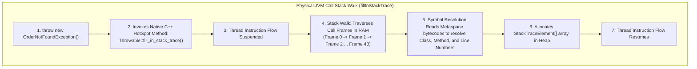
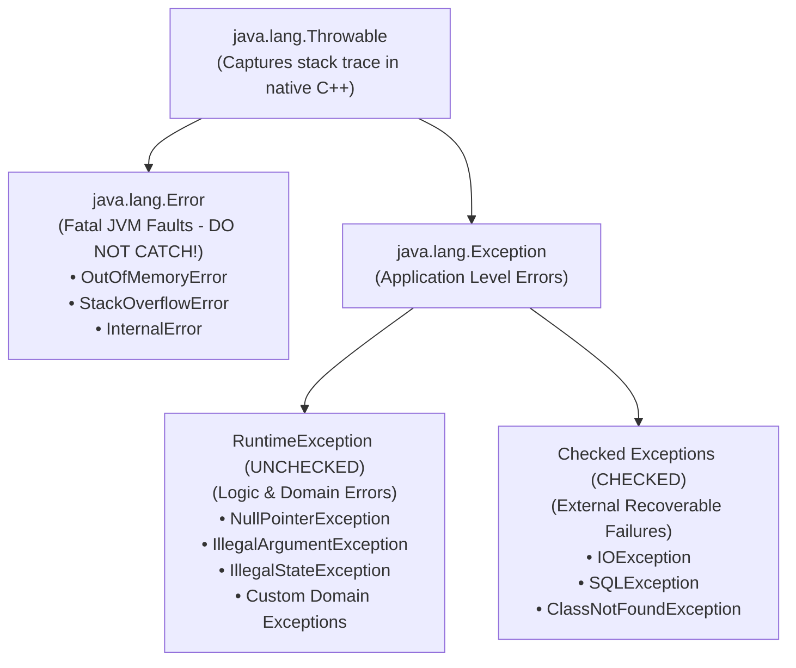
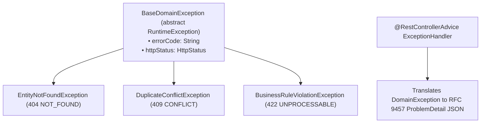

# Java Exception Architecture: Internals, Stack Traces & Resilience

In enterprise backend engineering, treating exceptions as an afterthought or using them for normal business control flow leads directly to catastrophic production failures:
- **100% CPU Starvation**: Throwing exceptions inside high-frequency request paths (such as cache misses or validation checks), forcing the JVM to repeatedly execute expensive native stack walks (`fillInStackTrace`).
- **Zombie Worker Threads**: Swallowing `InterruptedException` in background consumers, preventing thread interruption and causing Kubernetes graceful container shutdowns to hang until killed via `SIGKILL`.
- **Silent Data Corruption**: Catching `Throwable` or `Error` and suppressing unrecoverable JVM faults like `OutOfMemoryError` or `StackOverflowError`.
- **Resource Leaks**: Failing to use try-with-resources, leaving database connections and file descriptors open until the operating system runs out of sockets.

This chapter deconstructs Java exception mechanics from native JVM C++ stack frames up to production RFC 9457 problem detail architectures.

---

## Phase 1: Ground Floor (Physical First Principles)

To understand why exceptions are expensive, we must observe what physically happens inside the JVM when an exception object is instantiated.



### 1.1 The Physical Bottleneck: `Throwable.fillInStackTrace()`
When you execute:
```java
throw new CustomException("Something failed");
```
The latency bottleneck is **not** instantiating the Java heap object. 

The bottleneck is the native JVM method **`Throwable.fillInStackTrace()`**:
1. The executing thread's instruction pipeline is halted.
2. HotSpot inspects the thread's native OS activation stack frames in RAM.
3. It walks backward frame by frame, reading instruction pointers and program counters (`PC`).
4. It resolves each frame against class metadata in **Metaspace**, looking up class names, method signatures, source file names, and bytecodes to calculate the line number.
5. In modern enterprise applications with Spring Boot, Security filter chains, and Hibernate proxies, call stack depths frequently reach **40 to 80 frames**.

#### Latency Benchmark Comparison:
| Java Operation | Average Execution Latency | Relative Cost |
| :--- | :--- | :--- |
| Instantiating standard object (`new Order()`) | $\approx 2\text{ to }3\text{ nanoseconds}$ | $1\times$ (Baseline) |
| Throwing exception (Stack depth 5) | $\approx 250\text{ nanoseconds}$ | $100\times$ slower |
| Throwing exception (Stack depth 50 in Spring) | $\approx \mathbf{2,500\text{ to }5,000\text{ nanoseconds}}$ | $\mathbf{1,000\times\text{ to }2,000\times\text{ slower}}$ |

<Warning>
**The Golden Rule of Exception Engineering**:
Exceptions must **only** be thrown for exceptional, unpredicted error conditions. **NEVER** use exceptions for normal business control flow (e.g. checking if a user exists or validating expected user inputs).
</Warning>

---

## Phase 2: The Naive Code (The Production Crashes)

### Crash Scenario 1: Using Exceptions for Control Flow (CPU Starvation)

A developer implements a user lookup service:

```java
// DANGEROUS ANTI-PATTERN: Exceptions used as business flow control
public class UserService {
    public User findUser(String email) {
        try {
            return userRepository.findByEmail(email)
                .orElseThrow(() -> new UserNotFoundException(email));
        } catch (UserNotFoundException e) {
            // Business rule: If not found, register new guest user
            return registerGuestUser(email);
        }
    }
}
```

#### What Crashes in Production:
Under a flash sale with 50,000 requests/second, 30% of incoming users are guests. 

The service throws **15,000 exceptions per second**, forcing the JVM to execute 15,000 native stack walks across 45 Spring stack frames every single second. CPU utilization spikes to 100%, garbage collection pauses explode, and p99 API latency jumps from $15\text{ ms}$ to $4,500\text{ ms}$.

#### The Production Fix:
Return `Optional<User>` or a sealed result type. Avoid throwing exceptions for expected business paths:
```java
public User findOrCreateUser(String email) {
    return userRepository.findByEmail(email)
        .orElseGet(() -> registerGuestUser(email)); // Zero exceptions thrown!
}
```

---

### Crash Scenario 2: Swallowing `InterruptedException` (Zombie Workers)

A background queue processor handles message processing:

```java
// DANGEROUS ANTI-PATTERN: Swallowing InterruptedException
public class MessageWorker implements Runnable {
    @Override
    public void run() {
        while (true) {
            try {
                Message msg = queue.take(); // Blocking wait
                process(msg);
            } catch (InterruptedException e) {
                // FATAL: Swallows the interruption signal!
                log.error("Worker interrupted");
            }
        }
    }
}
```

#### What Crashes in Production:
When Kubernetes attempts to roll out a new deployment or scale down pods:
1. Kubernetes sends `SIGTERM` to the container.
2. Spring Boot initiates graceful shutdown and calls `executorService.shutdownNow()`, which interrupts worker threads.
3. The worker catches `InterruptedException`, logs an error, and loops right back to `queue.take()`. The thread's interrupted status was cleared by catching the exception!
4. The pod hangs for 30 seconds until Kubernetes issues `SIGKILL` (`kill -9`), abruptly dropping active transactions and corrupting in-flight payment state.

#### The Production Fix:
Always restore the thread interruption flag or bubble the exception:
```java
try {
    Message msg = queue.take();
    process(msg);
} catch (InterruptedException e) {
    // CRITICAL: Restore thread interrupted status!
    Thread.currentThread().interrupt();
    log.info("Worker received shutdown signal. Exiting loop.");
    break; // Exit worker loop cleanly
}
```

---

### Crash Scenario 3: Catching `Throwable` and Suppressing `OutOfMemoryError`

```java
// DANGEROUS ANTI-PATTERN: Catching Throwable
public void executeBatchJob(Task task) {
    try {
        task.run();
    } catch (Throwable t) { // FATAL: Catches VirtualMachineError and OOM!
        log.error("Task failed, continuing next task", t);
    }
}
```

#### Why it Crashes:
`Throwable` is the superclass of both `Exception` and `Error`.
If `task.run()` triggers an `OutOfMemoryError`, catching `Throwable` keeps the broken JVM process alive in an unrecoverable, corrupted state. Thread locks may be abandoned, data structures remain half-written, and subsequent queries return garbage data.

Never catch `Throwable` or `Error`. Catch `Exception`.

---

## Phase 3: Under the Hood (Mechanics, Bytecode & RFC 9457)

### 3.1 The `Throwable` Class Hierarchy



#### Checked vs Unchecked Philosophy in Modern Java:
- **Checked Exceptions (`Exception`)**: Enforced at compile-time (`throws IOException`). The caller *must* handle or rethrow. 
  - *Why modern backends avoid them*: Checked exceptions leak implementation details across architectural boundaries. If a repository throws `SQLException`, your domain service and controller must declare `throws SQLException`, completely breaking hexagonal architecture and encapsulation.
- **Unchecked Exceptions (`RuntimeException`)**: Not checked at compile time. Modern enterprise frameworks (Spring Boot, Hibernate, Kafka) translate all low-level checked exceptions into unchecked runtime exceptions.

---

### 3.2 Try-With-Resources & Suppressed Exceptions Bytecode

Introduced in Java 7, `try-with-resources` guarantees that any object implementing `AutoCloseable` is cleanly closed:

```java
public void processFile(Path path) throws IOException {
    try (InputStream is = Files.newInputStream(path);
         BufferedInputStream bis = new BufferedInputStream(is)) {
        bis.read();
    }
}
```

#### What the Java Compiler Physically Emits into Bytecode:
The compiler expands `try-with-resources` into a complex `try-catch-finally` block that handles **Suppressed Exceptions**:

```java
// Conceptual desugared bytecode generated by javac:
InputStream is = Files.newInputStream(path);
Throwable primaryException = null;
try {
    BufferedInputStream bis = new BufferedInputStream(is);
    try {
        bis.read();
    } finally {
        if (bis != null) bis.close();
    }
} catch (Throwable t) {
    primaryException = t;
    throw t;
} finally {
    if (is != null) {
        if (primaryException != null) {
            try {
                is.close();
            } catch (Throwable closeException) {
                // PRIMARY EXCEPTION IS PRESERVED!
                // Close exception is added as a SUPPRESSED exception!
                primaryException.addSuppressed(closeException);
            }
        } else {
            is.close();
        }
    }
}
```

If `bis.read()` fails (primary error) **AND** `is.close()` also fails (secondary error), legacy Java code would throw the `close()` exception, completely hiding the original read error.

`try-with-resources` preserves the **primary exception** and attaches the secondary error via `primaryException.addSuppressed(closeException)`.

---

### 3.3 High-Throughput Lightweight Exceptions (Zero-Cost Stack Walks)

If your backend must use exceptions for validation in high-throughput hot paths, you can eliminate the $1,000\times$ native stack walk cost by overriding `fillInStackTrace()`:

```java
// High-performance exception: Zero native stack walk overhead!
public class FastValidationException extends RuntimeException {
    public FastValidationException(String message) {
        super(message);
    }

    @Override
    public synchronized Throwable fillInStackTrace() {
        // NO-OP: Skips native C++ frame traversal!
        // Instantiates in ~2 nanoseconds instead of ~3,000 nanoseconds!
        return this;
    }
}
```

---

### 3.4 Production Domain Exception Architecture with RFC 9457

In a production Spring Boot backend, exceptions should be structured hierarchically and mapped to standardized **RFC 9457 Problem Details**:



#### 1. Base Domain Exception:
```java
package com.example.common.exception;

import org.springframework.http.HttpStatus;

public abstract class BaseDomainException extends RuntimeException {
    private final String errorCode;
    private final HttpStatus httpStatus;

    protected BaseDomainException(String errorCode, String message, HttpStatus httpStatus) {
        super(message);
        this.errorCode = errorCode;
        this.httpStatus = httpStatus;
    }

    public String getErrorCode() { return errorCode; }
    public HttpStatus getHttpStatus() { return httpStatus; }
}
```

#### 2. Concrete Domain Subclasses:
```java
public class EntityNotFoundException extends BaseDomainException {
    public EntityNotFoundException(String entityName, String id) {
        super(
            "ENTITY_NOT_FOUND",
            String.format("%s with identifier '%s' was not found", entityName, id),
            HttpStatus.NOT_FOUND
        );
    }
}

public class InsufficientStockException extends BaseDomainException {
    public InsufficientStockException(String sku, int requested, int available) {
        super(
            "INSUFFICIENT_STOCK",
            String.format("Requested %d units of SKU %s, but only %d available", requested, sku, available),
            HttpStatus.UNPROCESSABLE_ENTITY
        );
    }
}
```

#### 3. Global Exception Handler Mapping to RFC 9457:
```java
package com.example.common.exception;

import org.springframework.http.ProblemDetail;
import org.springframework.web.bind.annotation.ExceptionHandler;
import org.springframework.web.bind.annotation.RestControllerAdvice;

import java.net.URI;
import java.time.Instant;

@RestControllerAdvice
public class GlobalExceptionHandler {

    @ExceptionHandler(BaseDomainException.class)
    public ProblemDetail handleDomainException(BaseDomainException ex) {
        ProblemDetail problem = ProblemDetail.forStatusAndDetail(ex.getHttpStatus(), ex.getMessage());
        problem.setTitle(ex.getErrorCode());
        problem.setType(URI.create("https://api.example.com/errors/" + ex.getErrorCode().toLowerCase()));
        problem.setProperty("timestamp", Instant.now());
        return problem;
    }
}
```

---

## Phase 4: Senior Interview Ace (Junior vs Staff Phrasing)

### Interview Question: "Why are exceptions considered expensive in Java, and how do you design a resilient exception architecture in Spring Boot?"

#### ❌ The Shallow Junior Answer:
> "Exceptions are expensive because creating objects in Java takes time and memory. In Spring Boot, I use `@ControllerAdvice` and `@ExceptionHandler` to catch exceptions and return error messages so the user doesn't see a stack trace."

#### Staff / Principal Engineer Answer:
> "The physical performance cost of a Java exception is not object allocation; it is the native HotSpot method `Throwable.fillInStackTrace()`. When an exception is instantiated, HotSpot halts the thread's instruction pipeline and executes a native C++ stack walk backward through the thread's OS call frames in RAM, dereferencing symbols in Metaspace to resolve method signatures and line numbers. In deep Spring Boot and Hibernate filter stacks (50+ frames), this makes throwing an exception $1,000\times$ slower than normal object creation. Therefore, exceptions must never be used for expected business flow control; expected alternatives should be modeled via `Optional` or sealed Result types.
>
> For our domain error architecture:
> 1. All domain exceptions inherit from an abstract unchecked `BaseDomainException` that encapsulates a machine-readable error code and an HTTP status mapping.
> 2. We never swallow `InterruptedException`, always restoring the thread interruption flag via `Thread.currentThread().interrupt()` to respect Kubernetes container shutdown orchestration.
> 3. We use try-with-resources everywhere, ensuring `AutoCloseable` resources are closed with secondary exceptions correctly captured as suppressed exceptions via `addSuppressed()`.
> 4. In the web layer, a global `@RestControllerAdvice` translates domain exceptions into standard RFC 9457 `ProblemDetail` responses, eliminating internal implementation leaks while providing clear, structured error payloads to API consumers."

---

## Production Debugging Checklist

1. <Check>Never use exceptions for business control flow. Return `Optional<T>` or sealed record results for expected alternatives.</Check>
2. <Check>Never swallow `InterruptedException`. Always call `Thread.currentThread().interrupt()` before exiting the catch block.</Check>
3. <Check>Never catch `Throwable` or `Error`. Catch `Exception` or specific domain exception types.</Check>
4. <Check>Always use try-with-resources for streams, database connections, and sockets to guarantee resource release and capture suppressed exceptions.</Check>
5. <Check>Ensure all REST API exceptions return standardized RFC 9457 `ProblemDetail` structures rather than raw stack traces.</Check>

---

## Done Checklist
- [ ] Understand the native C++ mechanics and performance cost of `Throwable.fillInStackTrace()`.
- [ ] Understand why using exceptions for control flow causes 100% CPU starvation.
- [ ] Know how to handle `InterruptedException` without breaking graceful thread pool termination.
- [ ] Explain the `Throwable` hierarchy (`Error` vs `Exception`, Checked vs Unchecked).
- [ ] Deconstruct the bytecode expansion of `try-with-resources` and suppressed exceptions.
- [ ] Understand how to write zero-cost lightweight exceptions by overriding `fillInStackTrace()`.
- [ ] Design an enterprise domain exception hierarchy integrated with RFC 9457 Problem Details.
