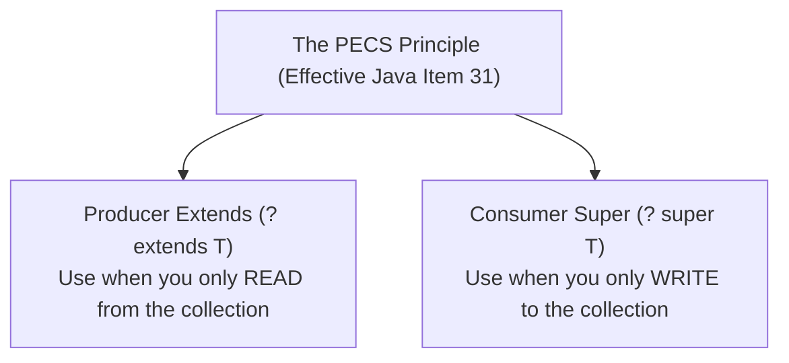
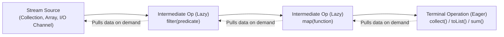
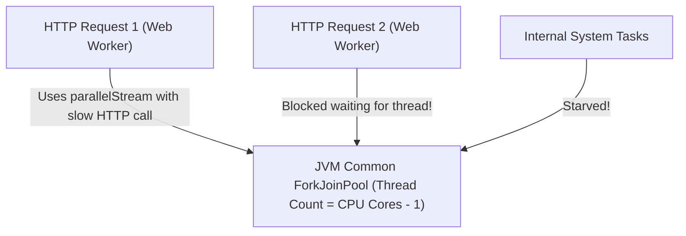

# Generics Type Erasure, PECS Variance & Stream Pipeline Architecture

In modern Java backends, Generics and the Stream API form the backbone of framework architectures, Spring Data repositories, DTO mapping pipelines, and reactive event flows.

However, treating Generics as simple angle-bracket templates (`<T>`) or Streams as simple `for` loop replacements leads to critical bugs:
- `ClassCastException` in production caused by Type Erasure and Heap Pollution.
- Severe garbage collection spikes and CPU stalls caused by primitive boxing in streams.
- Full JVM thread pool starvation caused by invoking `parallelStream()` inside web request threads.
- Unintended memory exhaustion from stateful stream operations buffering millions of database rows.

This guide provides an exhaustive, production-grade manual for Java 21 Generics type theory, bytecode bridge methods, the PECS variance rule, and Stream pipeline internals.

---

## Generics Under the Hood: Type Erasure & Bridge Methods

Java introduced Generics in Java 5 with a non-negotiable design constraint: **complete backward binary compatibility** with pre-existing Java 1.4 bytecode.

To achieve this without redesigning the JVM, the compiler implements Generics using **Type Erasure**:

```mermaid
sequenceDiagram
    autonumber
    participant Code as Java Source Code (Compile Time)
    participant Javac as Java Compiler (javac)
    participant Bytecode as Compiled JVM Bytecode (.class)
    participant JVM as JVM Runtime

    Code->>Javac: List<Order> orders = new ArrayList<>();
    Code->>Javac: Order o = orders.get(0);
    Note over Javac: 1. Verifies types compile-time<br/>2. ERASES type parameter <Order>!<br/>3. Replaces with raw type Object<br/>4. Synthesizes explicit (Order) checkcast instruction!
    Javac->>Bytecode: ALOAD 1; INVOKEINTERFACE get; CHECKCAST Order;
    Bytecode->>JVM: JVM executes raw Object manipulation in memory!
```

### Type Erasure Rules
1. **Unbounded type parameters** (`<T>`) are erased to `java.lang.Object`.
2. **Bounded type parameters** (`<T extends Comparable<T>>`) are erased to their first bound (`Comparable`).
3. The compiler automatically inserts synthetic `CHECKCAST` bytecode instructions at all call sites to ensure runtime type safety.
4. **Generic type arguments cannot be checked at runtime**:
   ```java
   // ILLEGAL COMPILATION ERRORS:
   if (obj instanceof List<String>) { ... } // Cannot verify erased String type!
   T instance = new T();                     // Cannot instantiate erased type!
   T[] array = new T[10];                   // Cannot create generic array!
   ```

### Synthetic Bridge Methods
When a class extends or implements a generic supertype with a specific type parameter, the compiler synthesizes hidden **Bridge Methods** to preserve polymorphic method overriding in the JVM:

```java
public interface Node<T> {
    void setData(T data);
}

public class StringNode implements Node<String> {
    @Override
    public void setData(String data) { ... }

    // SYNTHETIC BRIDGE METHOD GENERATED BY COMPILER:
    // public void setData(Object data) {
    //     setData((String) data); // Casts Object to String and calls real method
    // }
}
```

---

## Variance & The PECS Rule (Producer Extends, Consumer Super)

Unlike Java arrays, **generic types are invariant**:
`String[]` is a subtype of `Object[]` (covariant), but `List<String>` is **NOT** a subtype of `List<Object>`.

```java
// Why Generics are Invariant:
List<String> strings = new ArrayList<>();
List<Object> objects = strings; // COMPILE ERROR! If allowed:
objects.add(Integer.valueOf(42)); // Disastrous! Injected an Integer into a List<String>!
String s = strings.get(0);        // Crashes with ClassCastException at runtime!
```

To enable flexible APIs without sacrificing type safety, Java provides **Use-Site Variance Wildcards**:



### 1. Producer Extends (`? extends T`)
If a parameterized type represents a producer of data, use `? extends T`. You can safely **read** from it, but you cannot write to it:

```java
// PRODUCER: Reads values from the source list
public double calculateTotalWeight(List<? extends CargoItem> cargoList) {
    double total = 0.0;
    for (CargoItem item : cargoList) { // Safe: everything in list is a CargoItem
        total += item.getWeightKg();
    }
    // cargoList.add(new CargoItem()); // COMPILE ERROR! Compiler cannot know specific subtype!
    return total;
}
```

### 2. Consumer Super (`? super T`)
If a parameterized type represents a consumer of data, use `? super T`. You can safely **write** to it, but reads only yield `Object`:

```java
// CONSUMER: Writes values into the destination list
public void populateDefaultTags(List<? super String> tagList) {
    tagList.add("spring-boot"); // Safe: tagList can store Strings
    tagList.add("production");
    // String s = tagList.get(0); // COMPILE ERROR! Only guaranteed to be Object!
}
```

### The Canonical PECS Example: `Collections.copy`
Inspect the standard JDK implementation of `Collections.copy`:
```java
public static <T> void copy(List<? super T> dest, List<? extends T> src) {
    for (int i = 0; i < src.size(); i++) {
        dest.set(i, src.get(i)); // Read from Producer (src), write to Consumer (dest)
    }
}
```

---

## Stream Pipeline Architecture & Spliterators

A Java Stream is not a data structure; it is a **declarative description of a computation graph**:



### Stateless vs Stateful Intermediate Operations

| Operation Type | Examples | Execution Behavior | Memory Impact |
| :--- | :--- | :--- | :--- |
| **Stateless** | `filter()`, `map()`, `flatMap()`, `peek()` | Elements processed one-by-one; zero memory buffering | $O(1)$ memory; ideal for infinite streams |
| **Stateful** | `sorted()`, `distinct()`, `limit()`, `skip()` | **Must buffer entire upstream dataset** before producing first output element! | $O(N)$ memory; breaks stream pipelining |

<Warning>
**The Stateful Stream Memory Trap**:
If you query a database for 500,000 orders and call `.stream().sorted(Comparator.comparing(Order::getDate))`, the JVM must allocate a contiguous array and buffer all 500,000 orders into RAM before emitting a single element. **Always sort in the database (`ORDER BY`) rather than in Java streams**.
</Warning>

### The Engine: `java.util.Spliterator`
Every stream is backed by a `Spliterator` ("Splitable Iterator"), which partitions elements for parallel or sequential traversal:

```java
public interface Spliterator<T> {
    boolean tryAdvance(Consumer<? super T> action); // Step-by-step element consumption
    Spliterator<T> trySplit();                       // Divides work in half for ForkJoinPool!
    long estimateSize();                             // Number of remaining elements
    int characteristics();                           // Optimization metadata flags
}
```

#### Spliterator Characteristics Optimization
When a stream knows its characteristics (`SIZED`, `DISTINCT`, `SORTED`), the JVM optimizer eliminates redundant computation:
- Calling `.distinct()` on a stream originating from a `TreeSet` is a **no-op** because the spliterator already declares `DISTINCT` and `SORTED`.
- Calling `.count()` on an `ArrayList.stream()` does not traverse the elements; it returns `size()` in $O(1)$ constant time.

---

## Stream Hazards & Production Anti-Patterns

### 1. The Primitive Boxing Memory Disaster
Using generic streams (`Stream<T>`) for numeric calculations allocates millions of wrapper objects:

```java
// ANTI-PATTERN: Allocates 10,000,000 Long wrapper objects on the Heap!
long total = Stream.iterate(0L, i -> i + 1)
                   .limit(10_000_000)
                   .reduce(0L, Long::sum);

// PRODUCTION PATTERN: Zero heap allocation, pure CPU registers!
long total = LongStream.range(0, 10_000_000)
                       .sum();
```

Always use specialized primitive streams:
- `IntStream` instead of `Stream<Integer>`
- `LongStream` instead of `Stream<Long>`
- `DoubleStream` instead of `Stream<Double>`

---

### 2. The Parallel Stream Disaster in Web Backends
`Collection.parallelStream()` offloads chunks of work to the shared JVM-wide `ForkJoinPool.commonPool()`:



<Warning>
**Golden Rule of Production Backends**:
**Never use `parallelStream()` in Spring Boot web request threads**. The common pool has a fixed number of threads equal to your CPU cores. If a single request executes blocking I/O (like a database query or external REST call) inside a parallel stream, all worker threads in the entire JVM freeze, causing application-wide timeouts.
</Warning>

---

## Custom Collectors: High-Throughput Batching

While `Collectors.toList()` and `groupingBy()` satisfy 95% of use cases, high-throughput systems require custom collectors to stream items directly into batches (e.g., partitioning an event stream into batches of 500 for bulk SQL `INSERT`):

```java
package com.example.common.stream;

import java.util.*;
import java.util.function.*;
import java.util.stream.Collector;

public class BatchCollector<T> implements Collector<T, List<List<T>>, List<List<T>>> {

    private final int batchSize;

    public BatchCollector(int batchSize) {
        if (batchSize <= 0) throw new IllegalArgumentException("Batch size must be > 0");
        this.batchSize = batchSize;
    }

    @Override
    public Supplier<List<List<T>>> supplier() {
        return () -> {
            List<List<T>>> list = new ArrayList<>();
            list.add(new ArrayList<>());
            return list;
        };
    }

    @Override
    public BiConsumer<List<List<T>>, T> accumulator() {
        return (batches, item) -> {
            List<T> currentBatch = batches.get(batches.size() - 1);
            if (currentBatch.size() >= batchSize) {
                currentBatch = new ArrayList<>();
                batches.add(currentBatch);
            }
            currentBatch.add(item);
        };
    }

    @Override
    public BinaryOperator<List<List<T>>> combiner() {
        return (left, right) -> {
            throw new UnsupportedOperationException("Parallel collection not supported");
        };
    }

    @Override
    public Function<List<List<T>>, List<List<T>>> finisher() {
        return Function.identity();
    }

    @Override
    public Set<Characteristics> characteristics() {
        return Set.of(Characteristics.IDENTITY_FINISH);
    }
}
```

### Usage
```java
List<OrderEvent> events = ...;
List<List<OrderEvent>> chunks = events.stream()
    .collect(new BatchCollector<>(500));

for (List<OrderEvent> batch : chunks) {
    orderJdbcRepository.batchInsert(batch); // Executes fast batch insert!
}
```

---

## Active Recall & Interview Mastery

<AccordionGroup>
  <Accordion title="1. What is Type Erasure and why does the JVM implement Generics this way?">
    Type Erasure is the compiler process where all generic type parameters are stripped out of class definitions and replaced with raw types (`Object` or the upper bound) during bytecode compilation. The compiler automatically synthesizes explicit casts at call sites. This was chosen to preserve backward binary compatibility with legacy Java 1.4 bytecode without requiring changes to the JVM instruction set.
  </Accordion>

  <Accordion title="2. Explain the PECS rule with an example of Producer Extends vs Consumer Super.">
    PECS stands for **Producer Extends, Consumer Super**:
    - Use `? extends T` when your method reads from a collection (it *produces* data for your method). You can read objects as type `T`, but you cannot add anything to it.
    - Use `? super T` when your method writes into a collection (it *consumes* data from your method). You can safely add instances of `T` to it, but reads only yield generic `Object`.
  </Accordion>

  <Accordion title="3. What are synthetic bridge methods and why does javac generate them?">
    A bridge method is a synthetic method generated by the Java compiler to preserve polymorphism when a class implements a generic interface or extends a generic class with parameterized types. Because type erasure changes the method signature in the interface to take `Object`, the compiler creates an intermediate bridge method in the subtype taking `Object` that casts the argument and delegates to the strongly-typed method.
  </Accordion>

  <Accordion title="4. Why should parallelStream() be avoided in Spring Boot web applications?">
    `parallelStream()` executes tasks across the JVM-wide `ForkJoinPool.commonPool()`, which has a thread pool size equal to `Runtime.getRuntime().availableProcessors() - 1`. If an incoming HTTP request triggers a parallel stream that performs blocking I/O or takes excessive CPU time, it saturates the shared common pool, starving all other threads and background tasks across the application and causing global latency spikes.
  </Accordion>

  <Accordion title="5. What is the difference between a Stateless and Stateful Intermediate Stream operation?">
    A **Stateless** operation (like `filter()` or `map()`) processes elements individually on-the-fly without needing knowledge of preceding or succeeding elements, requiring $O(1)$ memory. A **Stateful** operation (like `sorted()` or `distinct()`) must accumulate and buffer the entire dataset in memory before it can emit its first transformed element, requiring $O(N)$ memory and preventing short-circuit evaluation on large or infinite streams.
  </Accordion>
</AccordionGroup>
