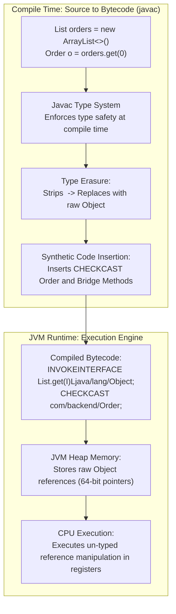
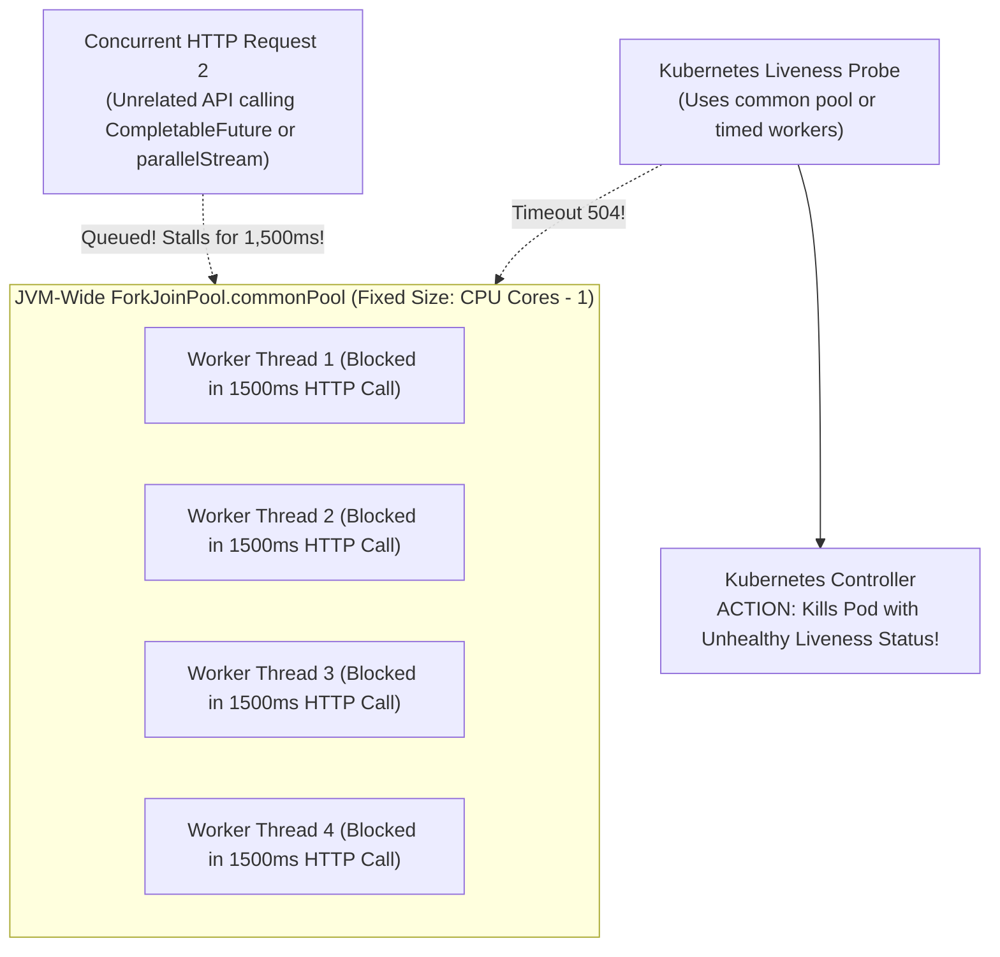
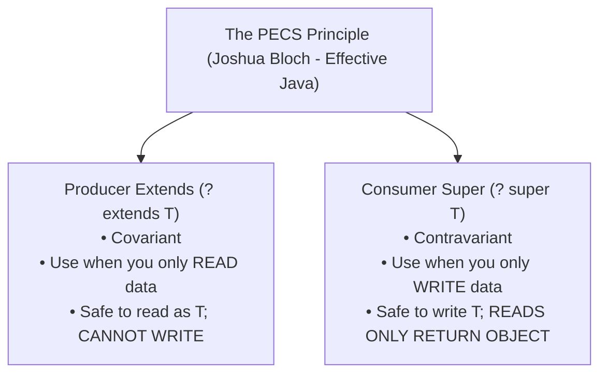

# Generics Type Erasure, PECS Variance & Stream Pipeline Architecture

In modern Java backend engineering, Generics and the Stream API form the bedrock of production architectures: Spring Data repositories, Jackson JSON serialization, event streaming pipelines, and domain mapping layers.

However, treating Generics as simple C++ template angle-brackets (`<T>`) or Streams as cosmetic replacements for `for` loops leads directly to severe production outages:
- **`ClassCastException` and Heap Pollution** crashing running services hours after corrupted records bypassed compile-time checks.
- **`ForkJoinPool.commonPool()` thread starvation** when `parallelStream()` is invoked inside web worker threads, freezing health checks and bringing down entire Kubernetes pods.
- **Catastrophic heap memory exhaustion** when stateful intermediate stream operations (`sorted()`, `distinct()`) buffer millions of database records in RAM.
- **Severe Garbage Collection pauses** caused by primitive boxing churn in stream reduction loops.

Senior backend engineers do not rely on surface syntax. They understand the **physical bytecode mechanics of Type Erasure, the mathematical derivation of the PECS rule, the internal execution graphs of `Spliterator`, and the CPU cache behavior of stream pipelines**.

---

## Phase 1: Ground Floor (Physical First Principles)

To master Java Generics and Streams, you must understand how the HotSpot JVM executes bytecode instructions and manages CPU registers.



### 1. The Design Constraint of 2004: Binary Compatibility
When Generics were introduced in Java 5 (2004), the Java language architects faced a non-negotiable constraint: **100% backward binary compatibility** with billions of lines of existing Java 1.1 to 1.4 bytecode.
- If the JVM had been redesigned with reified generics (like C# .NET), existing pre-compiled `.class` and `.jar` libraries would have broken instantly.
- The solution was **Type Erasure**: generic type parameters exist **only at compile time**. The compiler validates type constraints, discards the generic parameters, replaces them with raw types (`Object` or the bound), and inserts synthetic bytecode casting instructions (`CHECKCAST`).

### 2. Primitive Types vs Generic Invariance in Hardware
Because generic types are erased to `java.lang.Object`, and `Object` on the JVM is an 8-byte pointer to a heap-allocated memory block:
- **Primitives (`int`, `long`, `double`) cannot be generic parameters**: You cannot declare `List<int>` or `Map<long, double>`. Primitives live directly in CPU registers or on the stack; they have no object headers and cannot be cast to `Object`.
- **The Boxing Penalty**: To store an `int` in a generic collection, the JVM must allocate a 16-byte `java.lang.Integer` heap object (**Autoboxing**). A stream processing 10 million integers forces the memory allocator to churn through **160 MB of heap garbage**, triggering Stop-The-World GC pauses instead of executing in CPU registers!

---

## Phase 2: The Naive Code (The Production Crashes)

### Crash Scenario 1: Heap Pollution & The Delayed `ClassCastException` Crash

A developer mixes raw legacy collections with generic types or uses unchecked varargs:

```java
// DANGEROUS ANTI-PATTERN: Heap Pollution via Raw Types
@Service
public class CacheWarmupService {

    private final Map<String, List<String>> userRolesCache = new ConcurrentHashMap<>();

    // Legacy helper method using raw types:
    @SuppressWarnings("unchecked")
    public void populateLegacyMetadata(Map rawCache, String userId) {
        // FATAL: Injects a List<Integer> into a Map declared as Map<String, List<String>>!
        // The compiler issues a warning, but compiles successfully due to Type Erasure!
        rawCache.put(userId, List.of(101, 102, 103)); 
    }

    public List<String> getUserRoles(String userId) {
        // Looks 100% type-safe at compile time!
        return userRolesCache.get(userId);
    }
}
```

In the calling security filter:
```java
// PRODUCTION RUNTIME CRASH:
List<String> roles = cacheWarmupService.getUserRoles("user_42");

// Crashes at this exact line with ClassCastException!
for (String role : roles) {
    // Javac synthesized: CHECKCAST java/lang/String
    // But the object in the list is a java.lang.Integer!
    if (role.startsWith("ROLE_")) { ... }
}
```

#### What Happened in Production:
1. Heap pollution occurred silently during cache warming. The corrupt data was accepted into memory without errors because the JVM runtime only saw raw `List` objects.
2. Hours later, an innocent HTTP request attempted to iterate over the roles.
3. The JVM executed the compiler-generated `CHECKCAST java/lang/String` on an `Integer` object.
4. The thread crashed with `java.lang.ClassCastException: class java.lang.Integer cannot be cast to class java.lang.String`.
5. The security filter aborted, locking valid users out of the application.

---

### Crash Scenario 2: The `ForkJoinPool.commonPool()` Thread Starvation Outage

A developer attempts to speed up a batch invoice reconciliation job by using `parallelStream()`:

```java
// DANGEROUS ANTI-PATTERN: parallelStream() executing blocking network I/O
@RestController
@RequestMapping("/api/v1/invoices")
public class InvoiceController {

    @Autowired
    private TaxComplianceClient taxClient; // External 3rd-party REST API

    @PostMapping("/verify-batch")
    public ResponseEntity<Void> verifyBatch(@RequestBody List<InvoiceDTO> invoices) {
        
        // FATAL DISASTER: parallelStream() uses the JVM-wide ForkJoinPool.commonPool()!
        invoices.parallelStream().forEach(invoice -> {
            // External HTTP call takes 1,500ms to respond!
            taxClient.validateTaxId(invoice.getTaxId());
        });

        return ResponseEntity.ok().build();
    }
}
```



#### What Happened in Production:
- The microservice was deployed on an 8-core AWS EC2 instance (`commonPool` size = 7 threads).
- A batch of 50 invoices arrived. 7 worker threads were immediately assigned and blocked waiting on the 3rd-party tax API.
- All subsequent background jobs, parallel streams, and async `CompletableFuture` pipelines stalled waiting for common pool threads.
- Kubernetes liveness probes timed out, causing the pod to be killed and restarted in an endless cascade.

---

### Crash Scenario 3: The Stateful Stream Memory Exhaustion ($O(N)$ RAM Spike)

An engineer retrieves orders from a database and uses streams to find the top 10 highest-value transactions:

```java
// DANGEROUS ANTI-PATTERN: In-memory stateful stream operations on large datasets
@Service
public class OrderReportingService {

    @Autowired
    private OrderRepository orderRepository;

    public List<OrderDTO> getTop10Orders() {
        // Database contains 2,000,000 orders
        Stream<Order> orderStream = orderRepository.streamAll();

        return orderStream
            .filter(Order::isCompleted)
            // FATAL: sorted() is a STATEFUL intermediate operation!
            // It MUST buffer all 2,000,000 records in RAM before it can emit 1 record!
            .sorted(Comparator.comparing(Order::getTotalAmountCents).reversed())
            .limit(10) // limit(10) CANNOT short-circuit sorted()!
            .map(OrderDTO::from)
            .toList();
    }
}
```

#### What Happened in Production:
- The developer assumed `.limit(10)` would optimize the pipeline and keep memory small.
- However, `.sorted()` is a **Stateful Intermediate Operation**: mathematically, a stream cannot know which element is the largest until it has inspected and buffered **every single element**.
- The JVM allocated a contiguous array to buffer all 2 million `Order` entities.
- JVM heap spiked from 1.5GB to 8GB, triggering an unrecoverable `OutOfMemoryError: Java heap space`.

---

## Phase 3: Under the Hood (Mechanics, Bytecode & Kernel Interfaces)

### 1. Bytecode Deconstruction: Bridge Methods & Type Erasure

What does `javac` physically emit when compiling generic inheritance?

```java
public interface Transformer<T> {
    T transform(T input);
}

public class StringUpperTransformer implements Transformer<String> {
    @Override
    public String transform(String input) {
        return input.toUpperCase();
    }
}
```

Disassembling the compiled `StringUpperTransformer.class` via `javap -c -v` reveals **two** methods:

```bytecode
// 1. The Real Developer Method:
public java.lang.String transform(java.lang.String);
  descriptor: (Ljava/lang/String;)Ljava/lang/String;
  flags: (0x0001) ACC_PUBLIC
  Code:
     0: aload_1
     1: invokevirtual #7 // Method java/lang/String.toUpperCase:()Ljava/lang/String;
     4: areturn

// 2. The Synthetic Bridge Method (Emitted automatically by javac):
public java.lang.Object transform(java.lang.Object);
  descriptor: (Ljava/lang/Object;)Ljava/lang/Object;
  flags: (0x1041) ACC_PUBLIC, ACC_BRIDGE, ACC_SYNTHETIC
  Code:
     0: aload_0
     1: aload_1
     2: checkcast     #1 // class java/lang/String (Verifies cast!)
     5: invokevirtual #8 // Method transform:(Ljava/lang/String;)Ljava/lang/String;
     8: areturn
```

#### Why the Bridge Method is Mandatory:
- Due to type erasure, `Transformer`'s interface signature became `transform(Object)Object`.
- If `StringUpperTransformer` only declared `transform(String)String`, it would **overload** rather than **override** the interface method! Polymorphic calls would fail at the JVM level.
- The synthetic bridge method satisfies the raw interface signature, casts the argument, and delegates to the strongly-typed method.

---

### 2. Variance: The Mathematical Derivation of PECS

Why are generic collections invariant (`List<String>` is not a `List<Object>`)?
- If `List<String>` were a subtype of `List<Object>`, you could store an `Integer` in it via the `Object` reference, violating type safety.

To allow flexible, polymorphic APIs, Java uses **Use-Site Variance Wildcards**:



#### The Canonical Implementation: `Collections.copy`
```java
// src produces elements of type T (Producer Extends)
// dest consumes elements of type T (Consumer Super)
public static <T> void copy(List<? super T> dest, List<? extends T> src) {
    for (int i = 0; i < src.size(); i++) {
        dest.set(i, src.get(i)); // Read from producer, write to consumer
    }
}
```

#### Generic Domain Repository Pattern:
```java
public interface BatchEntityWriter<T> {
    // Accepts any list that produces entities of type T or its subtypes:
    void saveAll(Iterable<? extends T> entities);
}
```

---

### 3. Super Type Tokens: Capturing Erased Types at Runtime

Because generic parameters are erased, you cannot write `T.class` or `new T()`. 
However, **class metadata preserves generic superclass definitions** in Metaspace (the `Signature` attribute).

Spring and Jackson use **Super Type Tokens** (originated by Neal Gafter) to capture generic types at runtime:

```java
// How Spring's ParameterizedTypeReference extracts erased types:
public abstract class TypeReference<T> {
    private final Type type;

    protected TypeReference() {
        Type superClass = getClass().getGenericSuperclass();
        this.type = ((ParameterizedType) superClass).getActualTypeArguments()[0];
    }

    public Type getType() { return type; }
}

// Usage: Anonymous inner subclass captures the type parameter in bytecode!
TypeReference<List<UserDTO>> token = new TypeReference<>() {};
// System outputs: java.util.List<com.backend.dto.UserDTO>!
System.out.println(token.getType());
```

---

### 4. Stream Pipeline Internals: Spliterators & Characteristics

A Java Stream is an execution graph backed by a `java.util.Spliterator`:

```java
public interface Spliterator<T> {
    boolean tryAdvance(Consumer<? super T> action); // Step-by-step sequential fetch
    Spliterator<T> trySplit();                       // Divides dataset in half for parallelism
    long estimateSize();                             // Estimated elements remaining
    int characteristics();                           // Bitwise optimization flags
}
```

#### Spliterator Optimization Flags:
| Flag | Meaning | Pipeline Optimization |
| :--- | :--- | :--- |
| `SIZED` | Exact size is known in advance | Pre-sizes destination arrays in `.toList()` without dynamic reallocation |
| `DISTINCT` | All elements are guaranteed unique | `.distinct()` becomes an instantaneous no-op! |
| `SORTED` | Elements follow a natural order | `.sorted()` is skipped entirely! |
| `ORDERED` | Elements have a defined sequence | Required for `.findFirst()`; can be disabled via `.unordered()` for faster parallelism |

---

### 5. High-Throughput Stream Batching: Custom `BatchCollector`

In enterprise data pipelines, you frequently need to stream millions of records and group them into fixed-size chunks (e.g., 500 records) for batch SQL operations without memory bloat:

```java
package com.backend.stream;

import java.util.*;
import java.util.function.*;
import java.util.stream.Collector;

public class BatchCollector<T> implements Collector<T, List<List<T>>, List<List<T>>> {

    private final int batchSize;

    public BatchCollector(int batchSize) {
        if (batchSize <= 0) throw new IllegalArgumentException("Batch size must be positive");
        this.batchSize = batchSize;
    }

    @Override
    public Supplier<List<List<T>>> supplier() {
        return () -> {
            List<List<T>> list = new ArrayList<>();
            list.add(new ArrayList<>(batchSize));
            return list;
        };
    }

    @Override
    public BiConsumer<List<List<T>>, T> accumulator() {
        return (batches, item) -> {
            List<T> currentBatch = batches.get(batches.size() - 1);
            if (currentBatch.size() >= batchSize) {
                currentBatch = new ArrayList<>(batchSize);
                batches.add(currentBatch);
            }
            currentBatch.add(item);
        };
    }

    @Override
    public BinaryOperator<List<List<T>>> combiner() {
        return (left, right) -> {
            throw new UnsupportedOperationException("Parallel collection not supported for BatchCollector");
        };
    }

    @Override
    public Function<List<List<T>>, List<List<T>>> finisher() {
        return Function.identity();
    }

    @Override
    public Set<Characteristics> characteristics() {
        return Set.of(Characteristics.IDENTITY_FINISH);
    }
}
```

---

## Phase 4: Senior Interview Ace (Junior vs Staff Phrasing)

| Question / Scenario | Junior Developer Answer | Senior / Staff Backend Engineer Answer |
| :--- | :--- | :--- |
| **What is Type Erasure, and why doesn't Java have Reified Generics?** | "Type erasure removes the angle brackets when compiling so that Java runs faster." | "Type Erasure was an architectural compromise introduced in Java 5 to guarantee **100% backward binary compatibility** with legacy Java 1.4 bytecode. The compiler validates generic constraints at compile time, strips out type parameters, translates them to raw types (`Object` or bounds), and inserts synthetic `CHECKCAST` instructions. Reified generics would have required breaking existing pre-compiled JAR ecosystems. Because types are erased, generic arrays (`new T[]`) and `instanceof List<T>` checks are prohibited at runtime." |
| **Explain the PECS rule with a production use case.** | "PECS means Producer Extends, Consumer Super; it helps you write wildcards." | "PECS governs use-site variance. Use `? extends T` when your method **reads data** from a collection (the collection *produces* items for your logic). You can safely read elements as type `T`, but you cannot write anything into it. Use `? super T` when your method **writes data** into a collection (the collection *consumes* your items). You can safely insert instances of `T`, but reads only yield raw `Object`. The classic example is `Collections.copy(dest, src)`: `src` is `? extends T` (Producer), and `dest` is `? super T` (Consumer)." |
| **Why is `parallelStream()` strictly forbidden inside web request worker threads?** | "It can cause race conditions or make the server run out of memory." | "`parallelStream()` defaults to using the shared `ForkJoinPool.commonPool()`, which has a fixed size equal to `availableProcessors() - 1`. In a multi-threaded web server (Tomcat/Jetty), if an incoming HTTP request triggers a parallel stream that executes blocking I/O (database queries, external REST calls), it **saturates the entire JVM's common pool**. All other requests, async tasks, and health checks across the microservice stall waiting for threads, causing catastrophic cluster-wide timeouts." |
| **What is the difference between a Stateless and Stateful Intermediate Stream Operation?** | "Stateless operations don't change the data, while stateful ones do." | "A **Stateless** operation (`filter()`, `map()`) processes each element in isolation in $O(1)$ memory without needing to know preceding or future elements. A **Stateful** operation (`sorted()`, `distinct()`) **must buffer the entire upstream dataset in physical RAM** before it can emit its first output element. If applied to a 5-million-row database query, `.sorted()` breaks streaming execution, allocates gigabytes of heap memory, and triggers OutOfMemoryErrors. Sorting and deduplication must always be delegated to SQL database indexes." |
| **What are synthetic bridge methods, and how do you inspect them?** | "They are internal methods used by the compiler for lambdas." | "A bridge method is a synthetic method generated by `javac` (marked with `ACC_BRIDGE` and `ACC_SYNTHETIC` in bytecode) to **preserve polymorphic method overriding** across generic class hierarchies after type erasure. When a class implements `Comparable<String>`, type erasure converts the interface signature to `compareTo(Object)`. To satisfy this at the JVM bytecode level, the compiler generates a synthetic `compareTo(Object)` bridge that casts the argument to `String` and delegates to the developer's strongly-typed `compareTo(String)` method. You inspect them using `javap -c -v`." |

---

## Production Debugging Checklist

<AccordionGroup>
  <Accordion title="1. CommonPool Starvation Outages">
    - [ ] Inspect thread dumps: `jcmd <PID> Thread.print`. Look for `ForkJoinPool.commonPool-worker-*` threads blocked in socket reads.
    - [ ] Audit the codebase for `parallelStream()` and `.parallel()`: `grep -rn "parallelStream" src/main/java`.
    - [ ] Replace parallel streams with standard sequential streams or dedicated custom `ThreadPoolExecutor` pools.
  </Accordion>

  <Accordion title="2. Diagnosing Stream Heap OutOfMemoryErrors">
    - [ ] Review heap dump in Eclipse Memory Analyzer (MAT): Check for large object arrays allocated by `SpinedBuffer` or `StreamSupport`.
    - [ ] Search for `.sorted()` or `.distinct()` called on large collection streams.
    - [ ] Push sorting and uniqueness down to the relational database: use `ORDER BY` and `DISTINCT` on indexed columns.
  </Accordion>

  <Accordion title="3. Investigating ClassCastException from Heap Pollution">
    - [ ] Inspect raw type compiler warnings (`-Xlint:unchecked`).
    - [ ] Audit methods using `@SuppressWarnings("unchecked")` or raw collection signatures.
    - [ ] Enforce generic type constraints across all public APIs and DTO boundaries.
  </Accordion>
</AccordionGroup>

---

## Done Checklist

<Check>
Type Erasure and synthetic bridge method bytecode mechanics are thoroughly understood.
</Check>
<Check>
The PECS variance rule (Producer Extends, Consumer Super) is applied to all generic library and repository interfaces.
</Check>
<Check>
`parallelStream()` is banned from web request worker threads to prevent `ForkJoinPool.commonPool()` starvation.
</Check>
<Check>
Stateful stream operations (`sorted()`, `distinct()`) are replaced by indexed database queries to prevent $O(N)$ heap buffering.
</Check>
<Check>
Primitive streams (`IntStream`, `LongStream`) are used for numerical reductions to eliminate autoboxing heap churn.
</Check>
<Check>
Super Type Tokens (`ParameterizedTypeReference`) are used to safely capture erased generic types at runtime.
</Check>
