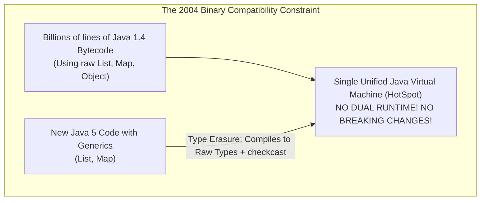
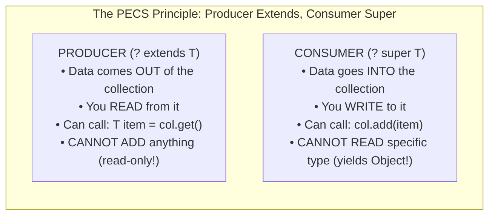

# Java Generics & Type System: Type Erasure, Variance & Super Type Tokens

In enterprise backend engineering, Generics are frequently treated as simple compile-time syntax markers (`<T>`) to avoid manual type casting.

However, a shallow understanding of Generics leads to severe production issues:
- **Delayed `ClassCastException` in Production Consumers**: Heap pollution caused by raw types or unsafe varargs, corrupting collections in memory until an innocent reader thread crashes hours later.
- **API Gridlock**: Designing inflexible service contracts where `List<Child>` cannot be accepted by a method expecting `List<Parent>`, forcing callers to write expensive memory-copying adapter loops.
- **Serialization Failures**: Inability to deserialize generic responses (such as `ResponseEntity<List<Order>>`) in Spring REST clients because runtime type erasure strips type arguments.

This masterclass examines the Java generic type system from HotSpot bytecode and synthetic bridge methods up to advanced framework runtime reflection.

---

## Phase 1: Ground Floor (Physical First Principles)

To master Generics, we must understand the engineering decision made by the Java language designers in 2004 (Java 5).



### 1.1 Why Type Erasure Exists: The Binary Compatibility Constraint
In 2004, Java was already the dominant enterprise programming language worldwide. When introducing generics, the designers had two choices:
1. **Reified Generics (The C# / .NET CLR Approach)**:
   - Change the bytecode and JVM runtime so the JVM knows about generic types at runtime (`List<String>` and `List<Integer>` are distinct runtime classes).
   - *The Trade-off*: Broke backward compatibility with existing compiled `.class` files, requiring a dual-runtime transition.
2. **Type Erasure (The Java Approach)**:
   - Enforce type safety strictly at **compile-time**.
   - Strip away all generic type parameters during compilation, emitting legacy raw types (`List`, `Map`) with automatic bytecode cast instructions (`CHECKCAST`).
   - *The Benefit*: 100% binary backward compatibility. Pre-Java 5 libraries and new Java 5 code ran seamlessly on the exact same JVM.

### 1.2 Primitive Types vs Generic Invariance
Why does `List<int>` not exist in Java?
- Every Java object on the heap requires a HotSpot object header (16 bytes) and is referenced via a 32-bit or 64-bit memory address.
- Primitive types (`int`, `long`, `double`) are raw binary bits allocated directly on thread execution stacks or in CPU registers. They have no object headers.
- Because generic type parameters erase to `java.lang.Object`, and an `int` cannot be addressed as an `Object` reference without autoboxing, Java generics only operate on reference types.

---

## Phase 2: The Naive Code (The Production Crashes)

### Crash Scenario 1: Heap Pollution & The Delayed `ClassCastException`

A developer mixes raw types with parameterized types in an event processing pipeline:

```java
// DANGEROUS ANTI-PATTERN: Raw types causing Heap Pollution
public class EventBus {
    public static void registerConsumer(List rawList) {
        // Raw type accepts ANY object!
        rawList.add(Integer.valueOf(42)); // FATAL: Pollutes List<String>!
    }
}

public class Application {
    public static void main(String[] args) {
        List<String> stringList = new ArrayList<>();
        stringList.add("Valid Event");

        // Passes stringList as a raw list
        EventBus.registerConsumer(stringList); // Compiles with only a warning!

        // Minutes later, an innocent consumer reads the list:
        for (String event : stringList) {
            System.out.println(event.toUpperCase()); // CRASH! ClassCastException!
        }
    }
}
```

#### Why it Crashes:
1. At compile time, `EventBus.registerConsumer` accepts raw `List`. The compiler allows adding `Integer.valueOf(42)`.
2. The memory space of `stringList` is now **polluted**: it contains both a `String` and an `Integer`.
3. When `event.toUpperCase()` is called, the compiler's emitted `CHECKCAST java/lang/String` instruction executes on the `Integer` object, immediately throwing:
   `java.lang.ClassCastException: class java.lang.Integer cannot be cast to class java.lang.String`.

The developer investigating the stack trace looks at `stringList.add()` and cannot understand how an `Integer` got into a `List<String>`.

---

### Crash Scenario 2: Array Covariance vs Generic Invariance

```java
// DANGEROUS JAVA LEGACY FLAW: Arrays are Covariant!
String[] stringArray = new String[5];
Object[] objectArray = stringArray; // Compiles cleanly! (Array Covariance)

objectArray[0] = Integer.valueOf(99); 
// FATAL RUNTIME CRASH: java.lang.ArrayStoreException: java.lang.Integer!
```

#### Why Generic Arrays Are Forbidden:
In Java, arrays know their component type at runtime. The JVM checks every write to an array and throws `ArrayStoreException` if types mismatch.

Because generics use **Type Erasure**, generic types do not exist at runtime! If Java allowed creating generic arrays:
```java
// COMPILER ERROR: Cannot create a generic array of List<String>
List<String>[] array = new List<String>[10]; 
```
If this were allowed, type erasure would erase `List<String>[]` to `List[]`, completely disabling runtime type checks and silently corrupting memory.

---

## Phase 3: Under the Hood (Mechanics, Bytecode & PECS)

### 3.1 Bytecode Deconstruction: Type Erasure & Synthetic Bridge Methods

Consider this simple generic class:
```java
public class Node<T> {
    private T data;
    public Node(T data) { this.data = data; }
    public void setData(T data) { this.data = data; }
    public T getData() { return data; }
}

public class StringNode extends Node<String> {
    public StringNode(String data) { super(data); }
    @Override
    public void setData(String data) { super.setData(data); }
}
```

#### The Java Compiler Problem:
After type erasure:
- `Node` has method: `public void setData(Object data)`
- `StringNode` declares: `public void setData(String data)`

In Java bytecode, `setData(String)` does **not** override `setData(Object)` because the parameter types are completely different! Polymorphism would be broken!

#### The Compiler's Solution: Synthetic Bridge Methods
To fix this, the Java compiler silently generates a synthetic **Bridge Method** inside `StringNode`:

```java
// Emitted into StringNode.class by javac:
public synthetic bridge void setData(Object data) {
    // 1. Casts Object to String
    // 2. Dispatches to the real setData(String)
    this.setData((String) data);
}
```

You can verify this using `javap -c -p StringNode.class`:
```console
public void setData(java.lang.String);
  descriptor: (Ljava/lang/String;)V

public void setData(java.lang.Object);
  descriptor: (Ljava/lang/Object;)V
  flags: (0x1041) ACC_PUBLIC, ACC_BRIDGE, ACC_SYNTHETIC
  Code:
    aload_0
    aload_1
    checkcast     #2 // class java/lang/String
    invokevirtual #3 // Method setData:(Ljava/lang/String;)V
    return
```

---

### 3.2 Variance & The Mathematical Derivation of PECS

Generics in Java are **Invariant** by default:
- Even though `Integer` is a subtype of `Number`, `List<Integer>` is **NOT** a subtype of `List<Number>`.

```java
List<Integer> ints = List.of(1, 2, 3);
List<Number> nums = ints; // COMPILE ERROR! Invariance prevents this!
```
*Why?* If `nums = ints` were allowed, you could execute `nums.add(Double.valueOf(3.14))`, which would inject a `Double` into a `List<Integer>`.

To allow flexible API design, Java uses **Use-Site Variance Wildcards**:
- `? extends T`: **Covariant** (*Producer Extends*)
- `? super T`: **Contravariant** (*Consumer Super*)



#### The Definitive Example: `Collections.copy`
```java
public static <T> void copy(List<? super T> dest, List<? extends T> src) {
    for (int i = 0; i < src.size(); i++) {
        // src is a PRODUCER: We READ T from src
        T item = src.get(i);
        
        // dest is a CONSUMER: We WRITE T into dest
        dest.set(i, item);
    }
}
```

---

### 3.3 Super Type Tokens: Recovering Erased Types at Runtime

Because of Type Erasure, calling `Order.class` works, but `List<Order>.class` is **illegal syntax**.

When using Spring's `RestTemplate` / `WebClient` or Jackson's `ObjectMapper`:
```java
// BUG: Jackson deserializes into List<LinkedHashMap> instead of List<Order>!
List<Order> orders = objectMapper.readValue(json, List.class);
```

#### How Frameworks Recover Erased Types:
While generic type parameters on *instances* are erased, generic type parameters on **class declarations and class extensions are preserved in bytecode metadata** (accessible via `Class.getGenericSuperclass()`).

In 2006, Neal Gafter invented the **Super Type Token** pattern:

```java
import java.lang.reflect.ParameterizedType;
import java.lang.reflect.Type;

// Abstract generic class: Forces creation of an anonymous subclass!
public abstract class TypeReference<T> {
    private final Type type;

    protected TypeReference() {
        // 1. Get the generic superclass of the anonymous subclass
        Type superClass = getClass().getGenericSuperclass();
        
        // 2. Cast to ParameterizedType to extract the actual generic type arguments!
        ParameterizedType parameterized = (ParameterizedType) superClass;
        this.type = parameterized.getActualTypeArguments()[0];
    }

    public Type getType() { return type; }
}
```

#### Idiomatic Production Usage in Spring Boot:
```java
// Anonymous inner class syntax: new ParameterizedTypeReference<List<Order>>() {}
// The trailing {} creates an anonymous subclass that preserves generic metadata!
ResponseEntity<List<Order>> response = restTemplate.exchange(
    "https://api.example.com/orders",
    HttpMethod.GET,
    null,
    new ParameterizedTypeReference<List<Order>>() {}
);

List<Order> orders = response.getBody(); // Type-safe at runtime!
```

---

## Phase 4: Senior Interview Ace (Junior vs Staff Phrasing)

### Interview Question: "Explain Type Erasure in Java. Why was it designed that way, and what are Bridge Methods?"

#### ❌ The Shallow Junior Answer:
> "Type Erasure means that at runtime, Java deletes the generic types between `< >` and replaces them with `Object`. It was designed that way to save memory. Bridge methods are methods that connect two classes."

#### Staff / Principal Engineer Answer:
> "Type Erasure was introduced in Java 5 to maintain 100% binary backward compatibility with existing pre-Java 5 bytecode. Rather than reifying generics in the JVM runtime (which would have required dual runtime execution engines like .NET), Java enforced generic type constraints purely at compile time. During compilation, generic type parameters are erased to their upper bounds (typically `Object` or the specified bound `<T extends Comparable<T>>`), and the compiler automatically injects `CHECKCAST` instructions at call sites where generic types are extracted.
>
> Because type erasure alters method parameter signatures in class hierarchies, it introduces a polymorphic problem: an overriding method in a subclass (such as `setData(String)`) no longer matches the erased signature in the superclass (`setData(Object)`). To preserve runtime polymorphism and the Java `vtable` contract, the Java compiler automatically generates synthetic, compiler-marked **Bridge Methods** in the subclass bytecode. The bridge method shares the superclass's erased signature, accepts `Object`, executes a `checkcast` to the concrete type, and dispatches directly to the typed subclass method."

---

## Production Debugging Checklist

1. <Check>Never use raw types (`List list = new ArrayList()`). Always specify type parameters.</Check>
2. <Check>Follow the PECS rule for public API methods: use `? extends T` for input arguments you only read from, and `? super T` for collections you write to.</Check>
3. <Check>Never attempt to create generic arrays (`new T[]`). Use `new ArrayList<T>()` or pass an explicit `Class<T>` token with `Array.newInstance(clazz, length)`.</Check>
4. <Check>When deserializing complex generic collections in Spring or Jackson, always use `ParameterizedTypeReference<T>` or `TypeReference<T>` anonymous subclasses.</Check>
5. <Check>Mark methods using generic varargs with `@SafeVarargs` only if the method never stores or escapes the varargs array.</Check>

---

## Done Checklist
- [ ] Understand why Type Erasure was chosen in 2004 for binary compatibility.
- [ ] Know why generic types cannot be primitive (`List<int>` vs `List<Integer>`).
- [ ] Understand Heap Pollution and delayed `ClassCastException` failures.
- [ ] Deconstruct synthetic compiler-generated Bridge Methods in bytecode (`javap`).
- [ ] Master the mathematical derivation and application of the PECS principle.
- [ ] Explain Super Type Tokens and how Spring/Jackson recover generic types at runtime.
