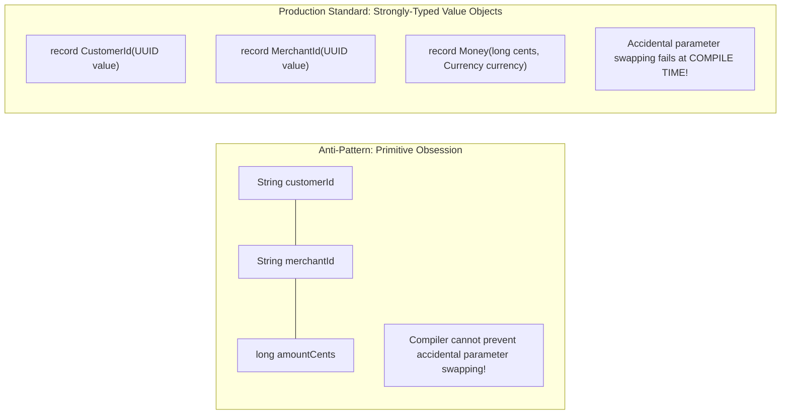
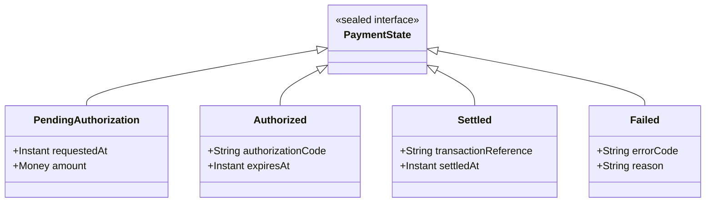
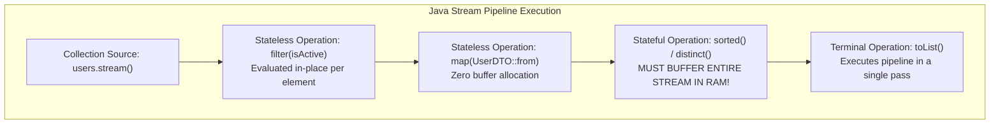

# Modern Java 21 for Backend Engineering

Spring Boot, Quarkus, and Micronaut are frameworks built entirely upon the foundations of the Java language and the HotSpot Virtual Machine.

When engineers treat Java as a syntactic formality and rely solely on framework annotations (`@Autowired`, `@Service`, `@Transactional`), their code degenerates into fragile, copy-pasted anti-patterns:
- **Primitive Obsession** causing parameter swaps that silently charge the wrong customer accounts.
- **Unchecked `null` dereferences** and `.get()` invocations on empty `Optional` values crashing production request worker threads.
- Broken `equals` and `hashCode` implementations on mutable domain entities corrupting `HashSet` collections and triggering unique key constraint failures.
- Misconfigured Java Streams creating massive heap churn and saturating CPU cores through shared ForkJoin pools.

Senior backend architects treat Java with deep mechanical sympathy: understanding how types map to CPU registers, designing type-safe **Rich Value Objects**, leveraging **Java 21 Data-Oriented Programming (Sealed Interfaces, Records, Exhaustive Pattern Matching)**, and protecting business invariants before frameworks ever touch them.

---

## Phase 1: Ground Floor (Physical First Principles)

To build high-performance backend systems, you must understand how Java source code is transformed, verified, and executed on physical silicon.

```mermaid
flowchart TD
    subgraph CompilationPhase["1. Ahead-of-Time Bytecode Compilation (javac)"]
        Src["OrderService.java (Human Readable Source)"]
        Javac["javac Compiler"]
        Bytecode["OrderService.class (Platform-Agnostic Bytecode)"]
        Src --> Javac --> Bytecode
    end

    subgraph HotSpotJVM["2. HotSpot JVM Runtime Execution"]
        ClassLoader["ClassLoaders (Bootstrap, Platform, App)\nLoads bytecode into Metaspace"]
        Bytecode --> ClassLoader
        
        subgraph ExecutionEngine["HotSpot Execution Engine"]
            Interpreter["Interpreter (Zero compilation overhead;\nExecutes bytecode instructions directly)"]
            C1["C1 Client JIT Compiler\n(Rapid compilation with basic profiling counters)"]
            C2["C2 Server JIT Compiler\n(Aggressive optimization: Inlining, Loop Unrolling,\nEscape Analysis, Vectorization)"]
            
            ClassLoader --> Interpreter
            Interpreter -->|Method Invocation Threshold (10,000 calls)| C1
            C1 -->|Hot Loop / Method Counter| C2
        end
    end

    subgraph PhysicalHardware["3. Physical CPU & Registers"]
        CPU_ASM["x86-64 / ARM64 Machine Code\n(Direct CPU execution in RAX, RDX registers)"]
        C2 --> CPU_ASM
    end
```

### 1. The Tiered Compilation Pipeline
Java is neither purely interpreted nor purely compiled ahead of time. It uses **Tiered Compilation**:
1. **Tier 0 (Interpreter)**: When your Spring Boot microservice starts, the JVM interprets bytecode directly. This allows instantaneous startup without waiting for long compiler passes.
2. **Tier 1 - 3 (C1 Client JIT Compiler)**: As methods are invoked repeatedly, HotSpot compiles bytecode into machine code with minimal optimizations, instrumenting performance profiling counters (branch frequencies, receiver types).
3. **Tier 4 (C2 Server JIT Compiler)**: When a method becomes "hot" (typically $\ge 10,000$ invocations), the C2 compiler executes heavy optimizations:
   - **Monomorphic Inlining**: Replaces polymorphic method calls with direct inlined machine code.
   - **Loop Unrolling**: Eliminates loop branch condition checks to maximize CPU instruction pipelining.
   - **Escape Analysis**: If an object allocated inside a method does not escape the current stack frame, C2 eliminates the heap allocation entirely and maps the object's fields directly into **CPU registers (Scalar Replacement)**!

### 2. Primitive Types vs Reference Types in Physical Memory
- **Primitive Types (`int`, `long`, `boolean`, `double`)**: Stored as raw binary numbers directly in physical **CPU registers** or on the method's **Stack Frame**. A `long` consumes exactly 8 bytes of contiguous memory and requires zero pointer dereferencing ($0\text{ ns}$ lookup).
- **Reference Types (`Integer`, `Long`, `String`, `BigDecimal`)**: An object header (12 to 16 bytes) plus instance fields allocated on the **Garbage-Collected Heap**. Accessing an `Integer` requires the CPU to dereference an 8-byte pointer, wait for a potential L1/L2 cache miss ($3\text{ to }15\text{ ns}$), and inspect the heap.

---

## Phase 2: The Naive Code (The Production Crashes)

### Crash Scenario 1: The Primitive Obsession Stringly-Typed Billing Disaster

A development team implements a payment gateway integration using raw primitive types and strings:

```java
// DANGEROUS ANTI-PATTERN: Stringly-typed primitive obsession
@Service
public class PaymentDisbursementService {

    // 4 string and numeric parameters side-by-side!
    public void disburseFunds(String sourceAccountId, String targetAccountId, long amount, String currency) {
        // Business logic to execute transfer...
        bankClient.transfer(sourceAccountId, targetAccountId, amount, currency);
    }
}
```

In the calling controller or workflow orchestrator:
```java
// PRODUCTION DISASTER: The caller accidentally swapped sourceAccountId and targetAccountId!
// The compiler cannot detect this because both parameters are identical types (String)!
disbursementService.disburseFunds(
    userProfile.getDebitAccountId(),    // Sits in parameter slot 1 (source)
    userProfile.getMerchantAccountId(), // Sits in parameter slot 2 (target)
    500000L,                            // Amount: Is this $5,000.00 or 500,000 cents?
    "USD"
);
```

#### What Happened in Production:
- During a major refactoring, an engineer swapped the order of `sourceAccountId` and `targetAccountId`.
- Because both parameters were raw `String` objects, the Java compiler reported **zero compilation errors**.
- In production, the system debited merchant escrow accounts and credited random shopper debit accounts.
- Furthermore, because `amount` was a raw `long`, one caller sent dollars while another sent cents ($100\times$ discrepancy), resulting in **$420,000 in erroneous funds transfers**.

---

### Crash Scenario 2: The `Optional.get()` Webhook Consumer Crash

A developer receives real-time customer update events over Kafka or HTTP webhooks:

```java
// DANGEROUS ANTI-PATTERN: Naive Optional.get() without presence verification
@Service
public class WebhookOrderProcessingService {

    @Autowired
    private CustomerRepository customerRepository;

    public void processOrderWebhook(OrderWebhookPayload payload) {
        // Find customer by email: Returns Optional<Customer>
        Optional<Customer> customerOpt = customerRepository.findByEmail(payload.customerEmail());

        // FATAL CRASH: Calling .get() directly!
        // If customer does not exist in DB, throws NoSuchElementException!
        Customer customer = customerOpt.get(); 
        
        applyCustomerDiscount(customer, payload.orderId());
    }
}
```

#### What Happened in Production:
- An external partner dispatched 100,000 webhooks containing legacy guest-checkout transactions without registered customer accounts.
- The `findByEmail()` query returned `Optional.empty()`.
- The call to `.get()` threw `java.util.NoSuchElementException: No value present`.
- Because the exception was unhandled, the Kafka consumer thread crashed, consumer partition rebalances triggered across the cluster, and incoming event processing halted globally for 4 hours.

---

### Crash Scenario 3: The Broken Domain Equality in Set Collections

A developer defines a JPA entity and implements `equals` and `hashCode` using the database primary key:

```java
// DANGEROUS ANTI-PATTERN: Relying on mutable, null-until-persisted IDs in hashCode()
@Entity
public class OrderLineItem {

    @Id
    @GeneratedValue(strategy = GenerationType.IDENTITY)
    private Long id; // NULL until entity is saved to database!

    private String productSku;
    private int quantity;

    @Override
    public boolean equals(Object o) {
        if (this == o) return true;
        if (!(o instanceof OrderLineItem that)) return false;
        return id != null && id.equals(that.id);
    }

    @Override
    public int hashCode() {
        return getClass().hashCode(); // Or Objects.hash(id)
    }
}
```

In the order processing logic:
```java
Set<OrderLineItem> items = new HashSet<>();
OrderLineItem item = new OrderLineItem("SKU-LAPTOP-101", 1);

// Step 1: Add to HashSet before persisting (id is currently NULL!)
items.add(item); // Lands in bucket based on hash(null)

// Step 2: Persist order to database
orderRepository.save(order); // Database assigns id = 40592L!

// Step 3: Check if item is in the set
boolean exists = items.contains(item); 
// FATAL: Returns FALSE! HashCode changed or equals failed!
// Memory leaks or duplicate items added to order!
```

#### What Happened in Production:
- When the entity was instantiated, its `id` was `null`. It was added to a `HashSet`.
- Calling `repository.save()` generated a database ID (`id = 40592`).
- When the system later checked `items.contains(item)`, the hash code changed, or the `id` comparison failed.
- The system concluded the item was not in the cart, added duplicate line items, and charged the customer twice for the same physical merchandise.

---

## Phase 3: Under the Hood (Mechanics, Java 21 Features & Domain-Driven Design)

### 1. Eliminating Primitive Obsession: Strongly-Typed Value Objects

In enterprise backend engineering, raw primitives (`long`, `String`) must never represent domain concepts like monetary amounts, account identifiers, or tax percentages.

Java 21 **Records** provide the optimal mechanism for creating zero-boilerplate, immutable value objects:



#### Production Implementation:
```java
package com.backend.domain.value;

import java.util.Currency;
import java.util.Objects;

public record Money(long cents, Currency currency) {

    // Compact Constructor: Enforces domain invariants at creation time
    public Money {
        if (cents < 0) {
            throw new IllegalArgumentException("Monetary value cannot be negative: " + cents);
        }
        Objects.requireNonNull(currency, "Currency must not be null");
    }

    public static Money ofUsd(long cents) {
        return new Money(cents, Currency.getInstance("USD"));
    }

    public Money add(Money other) {
        if (!this.currency.equals(other.currency)) {
            throw new IllegalArgumentException(
                "Cannot add mismatched currencies: %s and %s".formatted(this.currency, other.currency)
            );
        }
        return new Money(this.cents + other.cents, this.currency);
    }
}
```

```java
public record AccountId(String value) {
    public AccountId {
        if (value == null || !value.matches("^ACC-[0-9]{8}$")) {
            throw new IllegalArgumentException("Invalid account ID format: " + value);
        }
    }
}
```
Now, signature swapping is **physically impossible**:
```java
// COMPILE ERROR: Cannot pass AccountId where CustomerId is expected!
disburseFunds(targetAccountId, sourceAccountId, money);
```

---

### 2. Java 21 Data-Oriented Programming: Sealed Types & Exhaustive Pattern Matching

Modern backend architecture models business states as closed algebraic data types (ADTs) using **Sealed Interfaces** paired with **Pattern Matching**:



#### Domain Model Definition:
```java
package com.backend.domain.payment;

import com.backend.domain.value.Money;
import java.time.Instant;

public sealed interface PaymentState 
    permits PaymentState.Pending, PaymentState.Authorized, PaymentState.Settled, PaymentState.Failed {

    record Pending(Money amount, Instant requestedAt) implements PaymentState {}
    
    record Authorized(Money amount, String authCode, Instant expiresAt) implements PaymentState {}
    
    record Settled(Money amount, String transactionRef, Instant settledAt) implements PaymentState {}
    
    record Failed(String errorCode, String reason, Instant failedAt) implements PaymentState {}
}
```

#### Exhaustive Pattern Matching in Business Services:
In Java 21, the `switch` expression evaluates sealed hierarchies **exhaustively at compile time**:

```java
@Service
public class PaymentAuditService {

    public String generateStatusReport(PaymentState state) {
        // EXHAUSTIVE: No 'default' clause required!
        // If a new state (e.g. Refunded) is added to the sealed interface,
        // the Java compiler REFUSES to compile until this switch handles it!
        return switch (state) {
            case PaymentState.Pending p -> 
                "Payment of %s pending since %s".formatted(p.amount(), p.requestedAt());
                
            case PaymentState.Authorized a -> 
                "Authorized with code %s (expires %s)".formatted(a.authCode(), a.expiresAt());
                
            case PaymentState.Settled s -> 
                "Settled successfully. Ref: %s at %s".formatted(s.transactionRef(), s.settledAt());
                
            case PaymentState.Failed f -> 
                "FAILED [%s]: %s".formatted(f.errorCode(), f.reason());
        };
    }
}
```

---

### 3. Idiomatic `Optional`: Defensive Handling Without Crashes

`Optional<T>` was designed by the JDK team for **method return types to indicate absent values without using `null`**. It was never designed to be stored in entity fields or passed as method parameters.

| Usage Pattern | Code Shape | Production Verdict |
| :--- | :--- | :--- |
| **Direct Unchecked `.get()`** | `userOpt.get()` | **Strictly Banned**: Throws `NoSuchElementException` |
| **Explicit `.orElseThrow()`** | `userOpt.orElseThrow(() -> new UserNotFoundException(id))` | **Recommended**: Clean fail-fast error translation |
| **Functional Mapping** | `userOpt.map(User::getProfile).map(Profile::getEmail)` | **Recommended**: Safe traversal without null checks |
| **Default Fallback** | `configOpt.orElse(DefaultConfig.INSTANCE)` | **Recommended**: Safe fallbacks for read-only values |
| **Fields / Parameters** | `private Optional<String> middleName;` | **Anti-Pattern**: Wastes heap memory; breaks serialization |

---

### 4. Java Streams in High-Throughput Services: Rules of Engagement

Java Streams provide declarative transformations, but misusing them in high-throughput backend services degrades latency.



#### The 4 Production Rules for Java Streams:
1. **Never use `parallelStream()` in Web Worker Threads**:
   `parallelStream()` executes tasks on the JVM-wide `ForkJoinPool.commonPool()`. If 50 incoming Tomcat HTTP requests call `parallelStream()`, all common pool threads become saturated, starving other microservice components.
2. **Beware of Stateful Intermediate Operations**:
   Operations like `.sorted()` and `.distinct()` cannot process items one by one; they must **buffer the entire stream in memory** before proceeding, destroying the streaming benefit.
3. **Prefer Explicit Loops for Complex Business Logic**:
   If a Stream pipeline requires nested `flatMap()`, external mutable accumulators, or multi-line lambdas with checked exception handling, rewrite it as a standard Java `for` loop with private helper methods.
4. **Avoid Primitive Boxing Churn**:
   Use `IntStream` or `LongStream` when computing sums or statistics:
   ```java
   // BAD: Boxes 1,000,000 Long objects onto the heap
   orders.stream().map(Order::getAmount).reduce(0L, Long::sum);

   // GOOD: Uses unboxed primitive long registers directly
   orders.stream().mapToLong(Order::getAmountCents).sum();
   ```

---

## Phase 4: Senior Interview Ace (Junior vs Staff Phrasing)

| Question / Scenario | Junior Developer Answer | Senior / Staff Backend Engineer Answer |
| :--- | :--- | :--- |
| **Why should you avoid Primitive Obsession and use Records for Domain Identifiers?** | "Using records makes the code look cleaner and object-oriented." | "Primitive Obsession uses raw strings or longs for domain entities. This creates subtle, catastrophic bugs where parameters of identical types (e.g. `sourceAccountId` vs `targetAccountId`) are accidentally swapped by callers, and the Java compiler cannot detect the error. Wrapping identifiers in Java 21 Records (`record AccountId(UUID value)`) enforces **compile-time type safety**, eliminates parameter confusion, and provides a central location for validating format invariants (e.g., regex checks, non-null guarantees) via compact constructors." |
| **What is the difference between `==` and `.equals()` in Java, and why is this critical in JPA?** | "`==` compares references and `.equals()` compares values." | "In physical memory, `==` compares whether two reference pointers hold the exact same 64-bit address on the heap. `.equals()` evaluates logical equivalence. In JPA entities, relying on database-generated primary keys (`id`) inside `equals` and `hashCode` is dangerous: before persistence, `id` is `null`. If an entity is added to a `HashSet` before saving, its hash code is based on `null`. After saving, the database assigns an ID, **mutating the hash code and orphaning the entity inside the set**. JPA entities should base equality on immutable business keys or strict reference identity." |
| **Why should you never use `parallelStream()` inside a Spring Boot web service?** | "Parallel streams can make code harder to debug and trace." | "`parallelStream()` defaults to using the shared `ForkJoinPool.commonPool()`, which has a fixed number of worker threads equal to available CPU cores minus one. In a web server handling hundreds of concurrent HTTP requests, worker threads invoking parallel streams quickly exhaust the shared pool. This causes thread starvation, head-of-line blocking, and unpredictable tail latency across unrelated endpoints. Concurrency in web services must be handled at the request level (via Virtual Threads or controlled executor pools), not inside stream pipelines." |
| **How does Java 21 Data-Oriented Programming improve domain modeling?** | "It gives us records and pattern matching to write less boilerplate code." | "Java 21 introduces closed Algebraic Data Types (ADTs) by combining **Sealed Interfaces** (defining a finite, controlled set of possible states) with **Records** (immutable data carriers). Paired with **Exhaustive Pattern Matching**, the C2 compiler guarantees that all domain states are handled without needing fallback `default` branches. If an engineer introduces a new payment state (e.g., `Chargeback`), the compiler immediately flags every unhandled pattern match across the entire codebase, eliminating runtime `IllegalStateException` bugs." |
| **When should `Optional` be used, and where is it considered an architectural anti-pattern?** | "Optional should be used everywhere to prevent NullPointerExceptions." | "`Optional<T>` was engineered strictly as a **method return type** to signify potential absence in APIs without returning `null`. Using `Optional` as class instance fields, entity attributes, or method parameters is an architectural anti-pattern: it adds 16 bytes of wrapper object overhead to the heap, fails Java Serialization by default, and adds awkward unwrapping syntax to callers. Furthermore, calling `.get()` without checking `.isPresent()` defeats the purpose of the abstraction and causes `NoSuchElementException` crashes." |

---

## Production Debugging Checklist

<AccordionGroup>
  <Accordion title="1. High CPU Utilization from ForkJoinPool.commonPool">
    - [ ] Generate a thread dump: `jcmd <PID> Thread.print`.
    - [ ] Search for threads named `ForkJoinPool.commonPool-worker-*`.
    - [ ] If worker threads are blocked in database calls or HTTP I/O, audit the codebase for `parallelStream()` invocations and replace them with sequential streams or dedicated `ExecutorService` pools.
  </Accordion>

  <Accordion title="2. Diagnosing NoSuchElementException / Missing Optional Checks">
    - [ ] Search the codebase for bare `.get()` invocations: `grep -rn "\.get()" src/main/java`.
    - [ ] Replace all `.get()` calls with `.orElseThrow(() -> new SpecificDomainException())` or functional `.map()` pipelines.
    - [ ] Ensure that repository interfaces never return `null`; always return `Optional.empty()`.
  </Accordion>

  <Accordion title="3. Investigating Disappearing Entities in Collections">
    - [ ] Check `equals()` and `hashCode()` implementations on domain entities.
    - [ ] Ensure `hashCode()` does not depend on mutable fields (like database auto-incrementing `@Id` or updated timestamps).
    - [ ] Prefer immutable business keys (UUID generated in constructor, natural keys) for entity equality.
  </Accordion>
</AccordionGroup>

---

## Done Checklist

<Check>
Primitive Obsession is eliminated in domain models by using immutable Java 21 Records with compact constructor validation.
</Check>
<Check>
Business state transitions are modeled as Sealed Interfaces with exhaustive pattern matching.
</Check>
<Check>
`Optional` is used strictly as a method return type; bare `.get()` invocations are eliminated in favor of `.orElseThrow()`.
</Check>
<Check>
`parallelStream()` is banned from web worker execution paths to protect `ForkJoinPool.commonPool()`.
</Check>
<Check>
Domain entity equality relies on immutable business keys rather than database-generated primary keys.
</Check>
<Check>
Stream pipelines prioritize unboxed primitive streams (`IntStream`, `LongStream`) to prevent heap allocation churn.
</Check>
