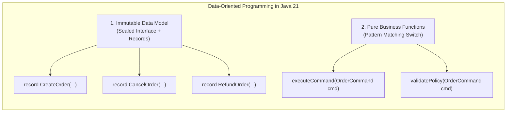

# Modern Java 21 Syntax, Control Flow & Data-Oriented Programming

In backend engineering, control flow and syntax are frequently dismissed as basic, beginner-level mechanics. 

However, flawed control flow and outdated syntax choices are directly responsible for catastrophic production failures:
- **Financial Ledger Disasters**: Using binary floating-point types (`double`, `float`) for monetary transactions, accumulating rounding errors that break accounting audits and violate regulatory laws.
- **Silent Integer Overflow**: Accumulating high-volume counters with primitive `int` or `long`, causing values to silently roll over into negative numbers and bypass security rate limits.
- **Switch Fall-Through Vulnerabilities**: Forgetting a `break` statement in a legacy switch block, silently executing administrative privilege escalation code.
- **NullPointerExceptions in Unchecked Casting**: Writing verbose `if (obj instanceof Order)` chains followed by manual type casting, crashing worker threads when unexpected types are deserialized.

Modern Java (Java 17 through 21) introduces **Data-Oriented Programming (DOP)**—a programming paradigm that models data as immutable values (records), models alternatives as sealed hierarchies, and processes data using pattern matching and exhaustive switch expressions.

This chapter deconstructs modern Java syntax from physical CPU branch prediction and IEEE-754 silicon hardware up to production-grade domain modeling.

---

## Phase 1: Ground Floor (Physical First Principles)

Before writing modern control flow logic, we must understand how physical CPU execution units process decisions and numbers in silicon.

```mermaid
flowchart TD
    subgraph CPU_Core["CPU Core Execution Pipeline"]
        Fetch["1. Instruction Fetch"] --> Decode["2. Instruction Decode"]
        Decode --> BPU{"Branch Predictor Unit (BPU)\nPredicts: Jump Taken or Fall-Through?"}
        
        BPU -->|Predicted Correctly| ExecFast["Speculative Execution\nPipeline Full (1-2 clock cycles)"]
        BPU -->|Predicted Wrong (MISPREDICTION)| Flush["PIPELINE FLUSH!\nDiscard 15-20 Instructions!\nStall CPU for 15-20 Cycles!"]
    end
```

### 1.1 CPU Branch Prediction & The Cost of Misprediction
CPUs do not execute code line-by-line in lockstep. Modern x86-64 and ARM CPUs use **instruction pipelining**, pre-fetching and decoding 15 to 20 instructions ahead of time.

When the CPU encounters a conditional jump (`if`, `switch`, ternary `?:`):
1. The **Branch Prediction Unit (BPU)** consults the **Branch Target Buffer (BTB)**—an internal hardware cache of past branch decisions.
2. The CPU speculatively executes down the predicted branch before the condition calculation completes.
3. If the prediction is **correct**, execution continues with zero stall cycles.
4. If the prediction is **wrong (Branch Misprediction)**:
   - The CPU must abort all speculatively executed instructions.
   - The entire pipeline is flushed.
   - The CPU stalls for **15 to 20 clock cycles** while it reloads instructions from L1 cache or RAM.

In high-throughput loops (processing 100,000 requests/sec), predictable code paths and clean jump tables outperform deeply nested, branchy conditional trees.

---

### 1.2 IEEE 754 Floating-Point Silicon vs Decimal Reality

Computers use binary hardware (base-2). They cannot accurately represent most base-10 fractions (like $0.1$ or $0.2$) in binary, exactly as a human cannot write $\frac{1}{3}$ in finite base-10 decimals ($0.3333\dots$).

In binary IEEE-754 representation:
$$0.1_{10} = 0.0001100110011001100110011\dots_2 \text{ (repeats infinitely)}$$

When stored in a 64-bit `double` (1 sign bit, 11 exponent bits, 52 mantissa bits), the number is truncated:
$$0.1 \rightarrow 0.1000000000000000055511151231257827021181583404541015625$$
$$0.2 \rightarrow 0.20000000000000002220446049250313080847263336181640625$$

When added together:
$$0.1 + 0.2 = \mathbf{0.3000000000000000444089209850062616169452667236328125}$$

```java
// FATAL: Evaluates to FALSE!
if (0.1 + 0.2 == 0.3) {
    // This code NEVER executes!
}
```

<Warning>
**The Golden Rule of Backend Engineering**:
**NEVER** use `float` or `double` for money, stock quantities, balances, or financial calculations. Always use `BigDecimal` or store currency in integer minor units (e.g. cents, satoshis).
</Warning>

---

### 1.3 Two's Complement Integer Overflow

Java signed integers (`int` = 32-bit, `long` = 64-bit) use **Two's Complement** binary representation:
- The highest bit is the sign bit ($0 = \text{positive}$, $1 = \text{negative}$).
- Max `int`: `01111111 11111111 11111111 11111111` ($2^{31} - 1 = 2,147,483,647$).
- Adding $1$ flips the sign bit: `10000000 00000000 00000000 00000000` ($-2^{31} = -2,147,483,648$).

By default, Java does **not** throw an exception on integer overflow. It silently wraps around to negative values.

---

## Phase 2: The Naive Code (The Production Crashes)

### Crash Scenario 1: The Billing Ledger Rounding Drift

A junior developer writes a payment discount service using `double`:

```java
// DANGEROUS ANTI-PATTERN: Floating point for financial calculations
public class DiscountCalculator {
    public static double applyDiscount(double originalPrice, double discountPercentage) {
        return originalPrice - (originalPrice * (discountPercentage / 100.0));
    }
}
```

#### What Crashes in Production:
A client purchases an item for $\$100.00$ with three successive $33.3333\%$ discounts. Over 1,000,000 monthly orders, tiny fractions like $\$0.00000000000004$ accumulate. 

At the end of the month, the accounting general ledger fails reconciliation by $\$4,218.42$. Auditors freeze payment processing, and engineering is forced to run emergency database remediation scripts.

---

### Crash Scenario 2: The Silent Stock Overflow Exploit

An e-commerce service calculates available warehouse inventory:

```java
// DANGEROUS ANTI-PATTERN: Primitive math without overflow checks
public class WarehouseService {
    public void addInventory(int currentStock, int incomingShipment) {
        int total = currentStock + incomingShipment; // SILENT OVERFLOW!
        if (total < 0) {
            // Unreachable if developer assumes incomingShipment is positive
        }
        database.updateStock(total);
    }
}
```

#### What Crashes in Production:
`currentStock` is $2,147,483,600$. A shipment of $100$ items arrives.
`total` evaluates to $-2,147,483,596$.
The inventory becomes negative, automated replenishment orders $2\text{ billion}$ units from suppliers, and fraud detection flags the warehouse as bankrupt.

---

### Crash Scenario 3: The Switch Fall-Through Privilege Escalation

A legacy authorization handler evaluates user permission tiers:

```java
// DANGEROUS ANTI-PATTERN: Legacy switch with missing break
public class RoleEvaluator {
    public static Set<String> getPermissions(UserRole role) {
        Set<String> permissions = new HashSet<>();
        switch (role) {
            case ADMIN:
                permissions.add("DELETE_DATABASE");
            case MANAGER: // BUG: ADMIN falls through into MANAGER!
                permissions.add("APPROVE_EXPENSE");
            case VIEWER: // BUG: MANAGER falls through into VIEWER!
                permissions.add("READ_REPORTS");
                break;
            default:
                throw new IllegalArgumentException("Unknown role");
        }
        return permissions;
    }
}
```

If an engineer re-orders the cases or accidentally comments out a `break`, viewers gain administrative privileges or admins lose expected capabilities.

---

## Phase 3: Under the Hood (Modern Java 21 Solutions)

Java 17 and 21 completely eliminate these error classes using modern syntax, exact math, and Data-Oriented Programming.

### 3.1 Eliminating Math Traps: `BigDecimal` & `Math.addExact`

For monetary values, use `BigDecimal` with an explicit `RoundingMode`:

```java
import java.math.BigDecimal;
import java.math.RoundingMode;

public final class SafeFinancialCalculator {
    // 1. NEVER construct BigDecimal with double: new BigDecimal(0.1) retains double error!
    // ALWAYS use BigDecimal.valueOf(0.1) or new BigDecimal("0.1")
    private static final BigDecimal HUNDRED = new BigDecimal("100");

    public static BigDecimal applyDiscount(BigDecimal price, BigDecimal discountPercent) {
        Objects.requireNonNull(price, "price cannot be null");
        Objects.requireNonNull(discountPercent, "discountPercent cannot be null");

        // Calculate discount amount with 4 decimal places of internal precision
        BigDecimal discountFactor = discountPercent.divide(HUNDRED, 4, RoundingMode.HALF_EVEN);
        BigDecimal discountAmount = price.multiply(discountFactor);

        // Subtract and round final price to currency scale (2 decimal places) using Banker's Rounding
        return price.subtract(discountAmount).setScale(2, RoundingMode.HALF_EVEN);
    }
}
```

For integer math where overflow must be detected immediately:
```java
// Throws ArithmeticException on overflow instead of silently corrupting data
long safeTotal = Math.addExact(existingStock, incomingStock);
long safeMultiplication = Math.multiplyExact(unitPrice, quantity);
```

---

### 3.2 Enhanced `switch` Expressions

Modern Java transforms `switch` from a dangerous statement into a type-safe **expression** that returns a value:

```java
public enum OrderStatus {
    PENDING_PAYMENT,
    PAID,
    SHIPPED,
    DELIVERED,
    CANCELLED
}

public class OrderWorkflowEngine {
    // Expression switch: Returns a value, uses arrows (->), NO fall-through possible!
    public static boolean canCancel(OrderStatus status) {
        return switch (status) {
            case PENDING_PAYMENT, PAID -> true;
            case SHIPPED, DELIVERED, CANCELLED -> false;
            // No default needed! If a new OrderStatus is added, COMPILER FAILS TO BUILD!
        };
    }

    // Complex block in switch expression using 'yield'
    public static int calculatePriority(OrderStatus status, boolean isVip) {
        return switch (status) {
            case PENDING_PAYMENT -> isVip ? 10 : 5;
            case PAID -> 8;
            case SHIPPED, DELIVERED -> {
                int base = 1;
                yield isVip ? base * 2 : base; // 'yield' returns value from code block
            }
            case CANCELLED -> 0;
        };
    }
}
```

#### Key Properties of `switch` Expressions:
1. **Arrow Syntax (`->`)**: Eliminates fall-through. Only the matched branch executes. No `break` statement exists.
2. **Exhaustiveness**: When switching over an `enum` or `sealed` hierarchy, the compiler guarantees that **all possible branches are handled**. If someone adds `REFUNDED` to `OrderStatus`, every switch expression in the codebase produces a compile-time error until handled.
3. **The `yield` Keyword**: Returns a value from a multi-line `{ ... }` block inside a switch branch.

---

### 3.3 Pattern Matching for `switch` & Guards (`when`)

In Java 21, `switch` can evaluate the runtime type and content of any object:

```java
public sealed interface PaymentMethod permits CreditCard, BankTransfer, Crypto {}

public record CreditCard(String cardNumber, String cvv, YearMonth expiry) implements PaymentMethod {}
public record BankTransfer(String iban, String swiftBic) implements PaymentMethod {}
public record Crypto(String walletAddress, String network) implements PaymentMethod {}

public class PaymentProcessor {
    public static String inspectPayment(PaymentMethod payment) {
        return switch (payment) {
            // 1. Type pattern: Matches type and binds variable in one step
            case BankTransfer bt -> "Bank transfer via IBAN: " + bt.iban();
            
            // 2. Guard with 'when': Evaluates extra boolean condition
            case CreditCard cc when cc.cardNumber().startsWith("4") -> 
                "Visa Card ending in " + cc.cardNumber().substring(12);
            case CreditCard cc -> 
                "Standard Card ending in " + cc.cardNumber().substring(12);

            // 3. Null handling directly in switch! (No NullPointerException before switch!)
            case null -> "Payment method is null";

            case Crypto crypto -> "Crypto payment on " + crypto.network();
        };
    }
}
```

---

### 3.4 Record Patterns & Nested Deconstruction

Java 21 introduces **Record Patterns** (JEP 440), enabling you to deconstruct records directly in pattern matching without calling getter methods:

```java
public record Money(long amountInCents, String currency) {}
public record CustomerId(String value) {}
public record OrderItem(String sku, int quantity, Money unitPrice) {}
public record Order(String orderId, CustomerId customer, List<OrderItem> items) {}

public class OrderInspector {
    public static void printOrderSummary(Object obj) {
        // Nested record deconstruction in pattern matching!
        if (obj instanceof Order(String id, CustomerId(String customerEmail), List<OrderItem> items)) {
            System.out.printf("Order %s for customer %s with %d items%n", 
                id, customerEmail, items.size());
        }
    }

    public static String evaluateItem(OrderItem item) {
        return switch (item) {
            // Deconstruct unitPrice inside OrderItem pattern matching!
            case OrderItem(String sku, int qty, Money(long cents, String curr)) 
                when cents > 100_000 && curr.equals("USD") -> 
                "High-value bulk item: " + sku + " total cents: " + (qty * cents);

            case OrderItem(String sku, int qty, Money(long cents, _)) -> 
                "Standard item: " + sku + ", quantity: " + qty;
        };
    }
}
```

#### Line-by-Line Explanation of Record Patterns:
- `OrderItem(String sku, int qty, Money(long cents, String curr))`:
  - `OrderItem(...)` matches if the object is an instance of `OrderItem`.
  - Automatically extracts components `sku` and `qty`.
  - Recursively deconstructs `unitPrice` into `cents` and `curr`.
  - Eliminates all boilerplate `item.getUnitPrice().getAmountInCents()` calls.
- `when cents > 100_000`: Evaluates the boolean condition **after** pattern binding but **before** executing the branch body.

---

### 3.5 Data-Oriented Programming (DOP) Architecture

In backend engineering, business rules change frequently. Object-Oriented programming binds data and behavior tightly together in class hierarchies. 

**Data-Oriented Programming** models:
1. **Data as immutable structures** using Java `record`.
2. **Alternatives as closed sets** using `sealed interface`.
3. **Behavior as separate functions** using pattern matching `switch`.



#### Complete Real-World DOP Implementation:
```java
package com.example.order;

import java.math.BigDecimal;
import java.time.Instant;
import java.util.Objects;

// 1. Sealed interface defines a closed set of domain events
public sealed interface OrderEvent {
    Instant timestamp();

    record OrderCreated(String orderId, String customerId, BigDecimal total, Instant timestamp) 
        implements OrderEvent {}

    record OrderPaid(String orderId, String transactionId, Instant timestamp) 
        implements OrderEvent {}

    record OrderShipped(String orderId, String trackingNumber, Instant timestamp) 
        implements OrderEvent {}

    record OrderCancelled(String orderId, String reason, Instant timestamp) 
        implements OrderEvent {}
}

// 2. Pure business function operating on the domain model
public final class OrderEventHandler {

    public static String generateAuditMessage(OrderEvent event) {
        Objects.requireNonNull(event, "event must not be null");

        // Exhaustive switch: No default needed. Compiler enforces handling of all events.
        return switch (event) {
            case OrderEvent.OrderCreated(var id, var cust, var total, var ts) ->
                String.format("[%s] New order %s created by %s for $%s", ts, id, cust, total);

            case OrderEvent.OrderPaid(var id, var txId, var ts) ->
                String.format("[%s] Order %s paid via transaction %s", ts, id, txId);

            case OrderEvent.OrderShipped(var id, var tracking, var ts) ->
                String.format("[%s] Order %s shipped with tracking %s", ts, id, tracking);

            case OrderEvent.OrderCancelled(var id, var reason, var ts) ->
                String.format("[%s] Order %s CANCELLED. Reason: %s", ts, id, reason);
        };
    }
}
```

---

## Phase 4: Senior Interview Ace (Junior vs Staff Phrasing)

### Interview Question: "Why does Java 21 promote Data-Oriented Programming, and how does it differ from traditional OOP?"

#### ❌ The Shallow Junior Answer:
> "Java 21 added records to get rid of Lombok and getters/setters. It also added pattern matching so we don't have to write `instanceof` followed by casting. Data-Oriented Programming just means using records and switch expressions because the syntax is cleaner and shorter."

#### Staff / Principal Engineer Answer:
> "Traditional OOP tightly encapsulates state and polymorphic behavior within class hierarchies. While this works well for UI widgets and domain simulation, it creates significant friction in modern distributed backends:
>
> 1. **Data Transit Friction**: In microservices, services receive dumb, stateless JSON or Protocol Buffer payloads over the wire. Forcing that data into behavior-rich, state-mutating class hierarchies causes anemic anti-patterns, serialization leaks, and ORM friction.
> 2. **Algebraic Data Types (ADTs)**: Java 21 brings Algebraic Data Types to the JVM via **Product Types** (`record`—a tuple of named components) and **Sum Types** (`sealed` interfaces—a finite set of alternative states).
> 3. **Exhaustiveness & Refactoring Safety**: When behavior is modeled via exhaustive pattern matching over sealed types, the compiler acts as a static verification engine. If a payment status transitions from 4 states to 5, every controller, consumer, and billing worker across the enterprise immediately flags a compile error at the exact call sites that need remediation.
> 4. **Hardware & JIT Benefits**: Records provide deep transparency to HotSpot's escape analysis. The C2 JIT compiler can aggressively perform scalar replacement, decomposing record components into CPU registers and eliminating heap allocations entirely in hot execution paths."

---

## Production Debugging Checklist

When reviewing modern control flow and arithmetic logic:
1. <Check>Verify no monetary calculations use `float` or `double`. Ensure all currency operations use `BigDecimal` with explicit scale and `RoundingMode.HALF_EVEN`, or store integers in minor units (e.g. cents).</Check>
2. <Check>Verify `BigDecimal` instances are initialized via `BigDecimal.valueOf(double)` or `new BigDecimal(String)`. Never use `new BigDecimal(0.1)`.</Check>
3. <Check>Check loop counters and inventory tallies for overflow. Replace `a + b` with `Math.addExact(a, b)` where overflow is catastrophic.</Check>
4. <Check>Verify all `switch` statements over enums or sealed classes have been converted to `switch` expressions without redundant `default:` branches to retain compiler exhaustiveness checking.</Check>
5. <Check>Ensure records used in pattern matching do not expose mutable collections without defensive copies.</Check>

---

## Done Checklist
- [ ] Understand CPU branch prediction, branch mispredictions, and pipeline flushes.
- [ ] Understand IEEE-754 floating-point representation and why `0.1 + 0.2 != 0.3`.
- [ ] Know how Two's Complement integer overflow silently wraps around in Java.
- [ ] Master enhanced `switch` expressions (`->`, `yield`, and exhaustiveness).
- [ ] Master pattern matching for `instanceof` and `switch` with type guards (`when`).
- [ ] Master record patterns and nested deconstruction in Java 21.
- [ ] Apply Data-Oriented Programming (DOP) principles using sealed interfaces and records.
