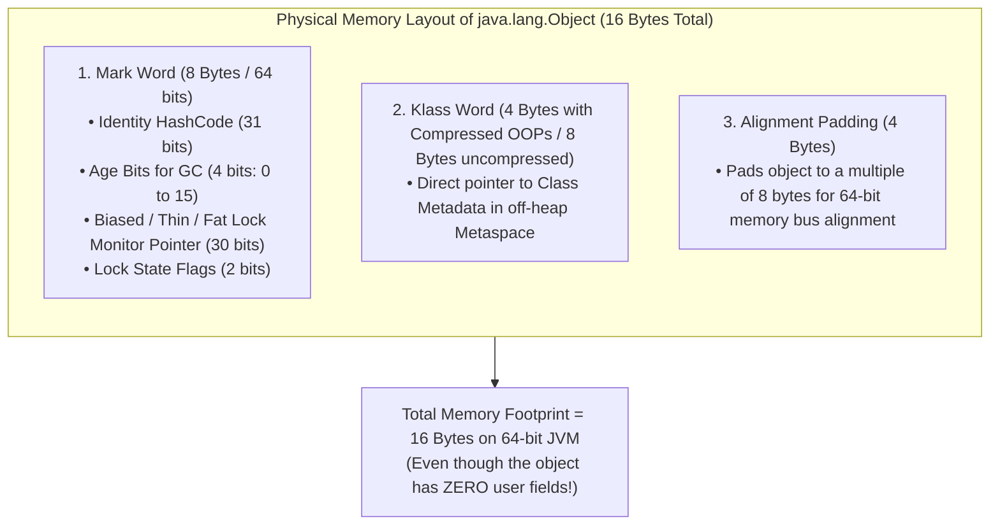
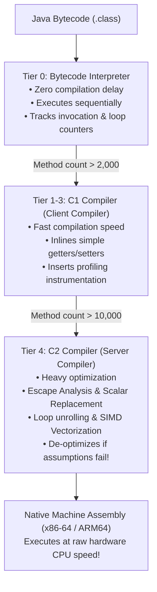
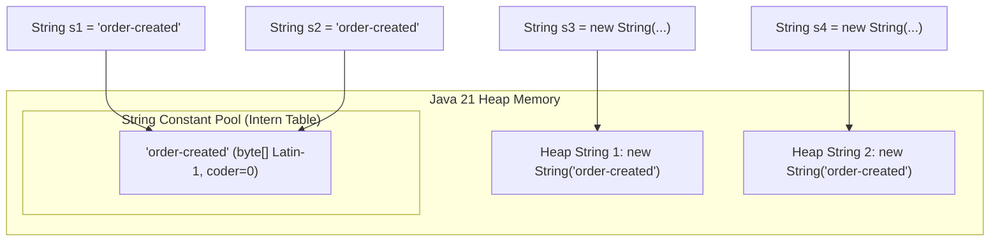

# Java 21 Core: Memory Layout, Bytecode & Language Mastery

In backend engineering, Java is frequently misunderstood as a high-level "managed" language where the developer never needs to think about physical hardware, CPU registers, or memory addresses.

Beginners assume that because the Java Virtual Machine (JVM) provides an automatic Garbage Collector, memory management is "free."

However, in high-throughput production backends, treating Java as an abstract sandbox leads to catastrophic performance failures:
- **Massive GC Thrashing**: Allocating millions of unnecessary object wrappers (`Long`, `Double`) inside accounting loops, spiking p99 API latency from 5ms to 2,000ms.
- **The 32GB Heap Cliff**: Increasing heap size from 31GB to 33GB and watching performance *drop* because 64-bit pointers deactivate Compressed OOPs, swelling memory consumption by 40%.
- **Heap Exhaustion via String Concatenation**: Using the `+` operator in bulk loops, allocating gigabytes of short-lived `byte[]` buffers.
- **Security Breaches via Mutable Records**: Assuming Java 21 records are deeply immutable, only to have external threads mutate internal collections and escalate privileges.

This masterclass deconstructs core Java from physical memory bits and HotSpot bytecode up to Staff-level performance engineering.

---

## Phase 1: Ground Floor (Physical First Principles)

To master Java, we must discard high-level syntax and observe how Java data physically exists on hardware silicon.

### 1.1 What Is an Object in Physical RAM?
Physical computer memory (DDR4/DDR5 RAM) is a vast linear array of bytes, each with a unique 64-bit physical address. CPUs read data from RAM into L1/L2/L3 caches in **64-byte blocks called Cache Lines**.

When you write:
```java
Object obj = new Object();
```

What physically happens inside RAM?



#### The HotSpot Object Anatomy:
Every single Java object allocated on the heap consists of three distinct physical segments:
1. **The Mark Word (8 bytes / 64 bits)**:
   - Encodes runtime object state without needing extra fields.
   - Stores the object's identity hash code (computed on first call to `System.identityHashCode()`).
   - Stores the **GC Age** (4 bits, values 0 to 15), representing how many garbage collection cycles the object has survived in the Young Generation before being tenured to Old Generation.
   - Stores synchronization lock states (unlocked, biased, lightweight thin-lock pointer on thread stack, or heavyweight fat monitor pointer).
2. **The Klass Word (4 or 8 bytes)**:
   - A pointer to the class's metadata structure in **Metaspace** (telling the JVM that this object is an instance of `com.example.Order`).
3. **Instance Data Fields**:
   - The actual fields declared in the class (`int`, `boolean`, reference pointers).
4. **Alignment Padding**:
   - The 64-bit CPU memory bus reads memory most efficiently on 8-byte boundaries. If the sum of headers and fields is not a multiple of 8, HotSpot pads the object with 1 to 7 unused bytes.

---

### 1.2 The Compressed OOPs 32GB Memory Cliff

In a 64-bit architecture, native memory pointers require **8 bytes (64 bits)**. If every object reference in your Java application consumed 8 bytes, your application would suffer severe cache bloat:
- Fewer reference pointers fit into the CPU's fast 64-byte L1/L2 cache lines.
- Total heap consumption expands by 30% to 40%.

To solve this, HotSpot uses **Compressed Ordinary Object Pointers (Compressed OOPs)** (`-XX:+UseCompressedOops`).

```mermaid
flowchart LR
    Comp["32-bit Compressed Pointer (0x12345678)"] -->|Left Shift by 3 Bits (x 8)| Real["64-bit Physical Heap Address (0x91A2B3C0)"]
```

#### The Mathematics of Compressed OOPs:
Because HotSpot aligns every object on an **8-byte boundary**, the lowest 3 bits of every physical object address are always `000` (e.g. `...0000`, `...1000`, `...10000`).

The JVM exploits this:
1. It stores object pointers as **32-bit integers**.
2. When the CPU needs to dereference the pointer, it bitwise **shifts the 32-bit integer to the left by 3 bits** (`pointer << 3`), effectively multiplying by 8.
3. This allows a 32-bit pointer to address:
   $$\text{Max Addressable Memory} = 2^{32} \times 8\text{ bytes} = 4,294,967,296 \times 8 = \mathbf{34,359,738,368\text{ bytes}} = \mathbf{32\text{ GB}}$$

<Warning>
**The 32GB Production Trap**:
If you configure your JVM with `-Xmx31g`, Compressed OOPs are enabled. Pointers consume **4 bytes**.
If an uninformed engineer increases heap to `-Xmx33g`, the 32GB limit is breached! HotSpot immediately deactivates Compressed OOPs, expanding every reference pointer from **4 bytes to 8 bytes**.

The application suddenly consumes **more memory on a 33GB heap than on a 31GB heap**, and cache miss rates jump by 20%! Never size a JVM heap between 32GB and 40GB.
</Warning>

---

### 1.3 Primitives vs Object Wrappers: The $6\times$ Memory Inflation

Consider the physical memory cost of storing numbers in Java:

```java
int primitiveVal = 42;             // 4 bytes in memory
Integer wrapperVal = Integer.valueOf(42); // 16 to 24 bytes in memory!
```

Now compare storing 1,000,000 numbers in an array:
- `int[1_000_000]`: Allocates a single contiguous memory block:
  $$\text{Array Header (16 bytes)} + (1,000,000 \times 4\text{ bytes}) \approx \mathbf{4\text{ MB}}$$
- `Integer[1_000_000]`: Allocates an array of pointers plus 1,000,000 individual heap objects:
  $$\text{Pointer Array } (1,000,000 \times 4\text{ bytes}) + \text{Heap Objects } (1,000,000 \times 16\text{ bytes}) \approx \mathbf{20\text{ MB to } 24\text{ MB}}$$

The wrapper approach consumes **$5\times$ to $6\times$ more memory** and forces the CPU to chase scattered memory pointers across the heap, triggering continuous L1 cache misses.

---

## Phase 2: The Naive Code (The Production Crash)

Let's inspect the code beginners write and deconstruct the exact sequence of the production crash under enterprise load.

### Crash Scenario 1: The String Concatenation Loop Heap Explosion

```java
// NAIVE CODE: BUILDING EXPORT CSV IN A LOOP
public String exportOrderAuditLog(List<AuditRecord> records) {
    String csv = "ID,ACTION,TIMESTAMP\n";
    for (AuditRecord record : records) {
        // BUG: String concatenation in loop!
        csv += record.getId() + "," + record.getAction() + "," + record.getTimestamp() + "\n";
    }
    return csv;
}
```

#### What Happens Under the Hood:
In Java, strings are **immutable**. When you execute `csv += record...`:
1. The compiler transforms `csv += ...` into `new StringBuilder(csv).append(...).toString()`.
2. For an export of 100,000 records:
   - On iteration 1: Allocates buffer of size $\sim 50$ bytes.
   - On iteration 50,000: Allocates buffer of size $\sim 2.5\text{ MB}$, copies all preceding $2.5\text{ MB}$ byte-for-byte, appends 50 bytes, and creates a new `String` object.
   - Total memory allocated during the loop:
     $$\text{Total Memory} \approx \sum_{k=1}^{100,000} (k \times 50\text{ bytes}) \approx \mathbf{250\text{ Gigabytes of intermediate garbage!}}$$
3. **The Production Crash**:
   - The Young Generation heap fills in milliseconds.
   - Minor GCs trigger every 200ms, stalling CPU cores.
   - Long-lived strings survive into Old Generation, triggering an emergency **Full Stop-The-World GC pause** lasting 15 to 30 seconds.
   - Kubernetes liveness probes time out (`HTTP 504 Gateway Timeout`), the container is killed (`Exit Code 137`), and all active customer requests are aborted.

#### The Production Fix:
```java
// PRODUCTION FIX: Pre-sized StringBuilder or direct Streaming
public String exportOrderAuditLog(List<AuditRecord> records) {
    // Pre-size capacity to eliminate re-allocations (estimated 60 bytes per row)
    StringBuilder sb = new StringBuilder(records.size() * 60);
    sb.append("ID,ACTION,TIMESTAMP\n");
    for (AuditRecord record : records) {
        sb.append(record.getId()).append(',')
          .append(record.getAction()).append(',')
          .append(record.getTimestamp()).append('\n');
    }
    return sb.toString(); // Exactly ONE allocation!
}
```

---

### Crash Scenario 2: Autoboxing in High-Frequency Accounting Loops

```java
// NAIVE CODE: FINANCIAL RECONCILIATION
public Long calculateTotalSettlementCents(List<Transaction> transactions) {
    Long total = 0L; // OBJECT WRAPPER!
    for (Transaction tx : transactions) {
        // BUG: Unboxes 'total', adds primitive, boxes back to 'new Long' on heap!
        total += tx.getAmountCents(); 
    }
    return total;
}
```

#### What Happens Under the Hood:
Java's `Long.valueOf(long l)` maintains an in-memory cache for values between `-128` and `127`. 

For any financial total exceeding $1.27:
1. `total += tx.getAmountCents()` is compiled to:
   ```bytecode
   invokevirtual java/lang/Long.longValue:()J
   ladd
   invokestatic  java/lang/Long.valueOf:(J)Ljava/lang/Long;
   ```
2. In a batch of 10,000,000 daily transactions:
   - HotSpot allocates **10,000,000 individual `Long` objects on the heap** ($24\text{ bytes} \times 10,000,000 = \mathbf{240\text{ MB}}$ of pure garbage).
   - CPU cycles are wasted allocating memory, setting headers, and triggering young-generation GC sweeps instead of computing numbers.
3. Simply changing `Long total = 0L;` to `long total = 0L;` executes the addition entirely inside a **64-bit CPU register (`%rax`)**, reducing execution time by **$15\times$** and allocating **zero bytes of heap memory**.

---

### Crash Scenario 3: The Mutable Record Security Breach

A beginner learns that Java 21 Records are "immutable data carriers" and writes:

```java
public record UserSecurityContext(
    String userId,
    String role,
    List<String> permissions // MUTABLE COLLECTION!
) {}
```

```java
// ATTACKER EXPLOITATION SEQUENCE:
List<String> perms = new ArrayList<>(List.of("READ_PROFILE"));
UserSecurityContext context = new UserSecurityContext("user_101", "GUEST", perms);

// Later in the application...
// An untrusted worker thread mutates the original list!
perms.add("ROLE_SUPER_ADMIN");

// DISASTER: context.permissions() now contains ROLE_SUPER_ADMIN!
// The user bypassed all security authorization checks!
```

#### The Production Rule: Records Are Only Shallowly Immutable
A record's fields are `private final`, meaning the reference pointer cannot be reassigned. However, the **object referenced by the pointer remains completely mutable**!

#### The Production Fix: Defensive Copying in Compact Constructor
```java
public record UserSecurityContext(
    String userId,
    String role,
    List<String> permissions
) {
    // Compact Constructor with strict defensive copying
    public UserSecurityContext {
        Objects.requireNonNull(userId, "userId required");
        Objects.requireNonNull(role, "role required");
        // Creates a truly immutable, unmodifiable copy (null-hostile)
        permissions = List.copyOf(permissions); 
    }
}
```

---

## Phase 3: Under the Hood (Mechanics, Bytecode & JIT)

Let's demystify how the JVM executes code at the machine assembly level.

### 3.1 The 4-Tier HotSpot JIT Compilation Pipeline

Java code does not execute purely as interpreted bytecode. HotSpot uses **Tiered Compilation** (`-XX:+TieredCompilation`):



### 3.2 Escape Analysis & Scalar Replacement: Eliminating Heap Allocations
One of the most powerful C2 compiler optimizations is **Escape Analysis** (`-XX:+DoEscapeAnalysis`):

```java
public long calculateDistance(int x1, int y1, int x2, int y2) {
    Point p1 = new Point(x1, y1);
    Point p2 = new Point(x2, y2);
    return Math.abs(p1.x() - p2.x()) + Math.abs(p1.y() - p2.y());
}
```

1. **Escape Detection**: The C2 compiler analyzes whether `p1` and `p2` escape the `calculateDistance` method (e.g. stored in a static variable, returned, or passed to an external un-inlined method).
2. **Scalar Replacement**: If the objects do **not** escape, the JIT compiler does **not allocate `Point` objects on the heap at all**!
3. Instead, it breaks the object down into its scalar primitives (`int p1_x`, `int p1_y`) and stores them directly in **CPU registers (`%rdi`, `%rsi`)**.
4. Result: Zero heap allocation, zero garbage collection, and raw CPU speed.

---

### 3.3 The String Constant Pool & Compact Strings



#### Compact Strings Mechanics (Java 9 through 21):
- Historically, Java stored every character in a string as a 2-byte `char[]` (UTF-16).
- Because 85% of real-world enterprise strings contain only Latin-1 characters (English text, JSON keys, HTTP headers), half of all string memory was wasted as zero-bytes (`0x00`).
- Modern Java uses **Compact Strings**:
  ```java
  public final class String {
      private final byte[] value; // Raw byte array
      private final byte coder;   // 0 = LATIN1 (1 byte/char), 1 = UTF16 (2 bytes/char)
  }
  ```
- If a string contains only ASCII/Latin-1 characters, it stores **1 byte per character**, instantly cutting heap string memory by **50%**.

---

## Phase 4: Senior Interview Ace (Junior vs Staff Phrasing)

When interviewers test your Java core knowledge, they want to hear about hardware cache lines, pointer compression, and memory mechanics—not just abstract textbook definitions.

| Topic | Junior Developer Answer | Senior / Staff Engineer Answer |
| :--- | :--- | :--- |
| **Pass-by-Value vs Reference** | *"Java passes primitives by value and objects by reference."* | *"Java is strictly 100% pass-by-value, without exception. When an object is passed to a method, the variable does not hold the object; it holds a 64-bit (or 32-bit compressed) memory pointer to the heap. The JVM makes a bitwise copy of that pointer value and pushes it onto the target method's stack frame. If the method reassigns the parameter (`u = new User()`), it only mutates its local copied pointer on its own stack frame—the caller's pointer remains completely unchanged. However, invoking a mutator method (`u.setName()`) dereferences the copied pointer to mutate the same physical object in heap memory."* |
| **Compressed OOPs & 32GB Limit** | *"I always configure the heap as large as possible. If 32GB is good, 34GB is better."* | *"Increasing heap from 31GB to 33GB triggers a performance cliff. On 64-bit architectures, HotSpot uses Compressed OOPs (`-XX:+UseCompressedOops`), storing 32-bit pointers and shifting them left by 3 bits to address 8-byte aligned memory up to $2^{32} \times 8 = 32\text{ GB}$. If heap size exceeds 32GB, pointer compression is deactivated, and all references expand from 4 bytes to 8 bytes. This bloats heap footprint by 30-40%, degrades L1/L2 CPU cache line density, and worsens GC pause times. The optimal production sizing rule is to stay below 31GB (`-Xmx31g`), or jump straight past 48GB if scaling further."* |
| **Object Memory Footprint** | *"An empty object takes zero memory because it has no fields."* | *"Every Java object on a 64-bit JVM with Compressed OOPs has a mandatory physical overhead of 16 bytes: an 8-byte Mark Word (storing hashcode, GC age bits, and lock state), a 4-byte Klass Word (pointing to class metadata in Metaspace), and 4 bytes of 8-byte alignment padding. An `Integer` wrapping a 4-byte `int` consumes 16 to 24 bytes in RAM. In collections like `ArrayList<Integer>`, pointer arrays plus object wrappers consume $6\times$ more memory than primitive arrays (`int[]`) and destroy CPU cache prefetching."* |
| **Java 21 Records Immutability** | *"Records are immutable classes that replace Lombok `@Data`."* | *"Records provide shallow immutability: their fields are `private final` and cannot be reassigned. However, records do NOT provide deep immutability. If a record holds a reference to a mutable collection (`List`, `Map`), external threads can mutate the underlying elements. To guarantee absolute immutability, you must enforce defensive copying in the compact constructor (e.g. `this.items = List.copyOf(items)`). Furthermore, records leverage pattern matching with sealed interfaces to enforce compile-time exhaustive checking, eliminating unhandled branch bugs."* |

---

## Active Recall & Mastery Verification

<AccordionGroup>
  <Accordion title="1. What is the physical structure of an object header in HotSpot JVM?">
    An object header consists of:
    1. **Mark Word (8 bytes / 64 bits)**: Stores runtime metadata including the object's identity hash code, GC generation age (4 bits, max 15), lock status flags (biased, thin, fat monitor), and thread ownership pointers.
    2. **Klass Word (4 bytes with Compressed OOPs, 8 bytes uncompressed)**: Contains the direct memory pointer to the class metadata structure in Metaspace.
    3. **Alignment Padding**: Pads the total object size to a multiple of 8 bytes to align with 64-bit CPU memory buses.
  </Accordion>

  <Accordion title="2. Why does configuring a 33GB JVM heap use more memory and perform worse than a 31GB heap?">
    HotSpot enables Compressed OOPs for heaps up to 32GB. Because objects are aligned on 8-byte boundaries, a 32-bit integer shifted left by 3 bits addresses up to $2^{32} \times 8 = 32\text{ GB}$. When the heap exceeds 32GB, Compressed OOPs are turned off, and reference pointers expand from 4 bytes to 8 bytes. This expands memory footprint by 30-40% and reduces the number of pointers that fit into 64-byte L1/L2 CPU cache lines.
  </Accordion>

  <Accordion title="3. How does JIT Escape Analysis eliminate heap allocations?">
    The HotSpot C2 compiler analyzes the scope of an object. If the object does not escape the allocating method (it is not returned, stored in a field, or passed to an un-inlined method), the compiler performs **Scalar Replacement**: it disassembles the object into its primitive fields and assigns them directly to CPU registers or thread stack frames, bypassing heap allocation and Garbage Collection entirely.
  </Accordion>

  <Accordion title="4. How do Compact Strings save memory in Java 9+?">
    Earlier Java versions stored characters as 2-byte UTF-16 code units in a `char[]`. Modern Java replaces this with a `byte[]` and a 1-byte `coder` flag. If all characters in the string fit within the Latin-1 character set (`ISO-8859-1`), the `coder` is set to 0 and each character consumes only 1 byte of memory, instantly reducing String heap consumption by 50%.
  </Accordion>
</AccordionGroup>

---

## Done Checklist

<Check>
- [ ] Diagram the HotSpot object memory layout: Mark Word (8 bytes), Klass Word (4 bytes), and 8-byte alignment padding.
- [ ] Explain the mathematics of Compressed OOPs and avoid the 32GB to 40GB heap size trap.
- [ ] Understand why primitive arrays (`long[]`) perform up to $6\times$ faster than object wrapper collections (`Long[]`).
- [ ] Eliminate $O(N^2)$ memory allocations in bulk loops by using pre-sized `StringBuilder` or direct socket streaming.
- [ ] Implement deep immutability in Java 21 Records using compact constructors with `List.copyOf()`.
- [ ] Trace HotSpot JIT Tiered Compilation from Interpreter (Tier 0) to C2 Compiler (Tier 4) with Escape Analysis.
</Check>
