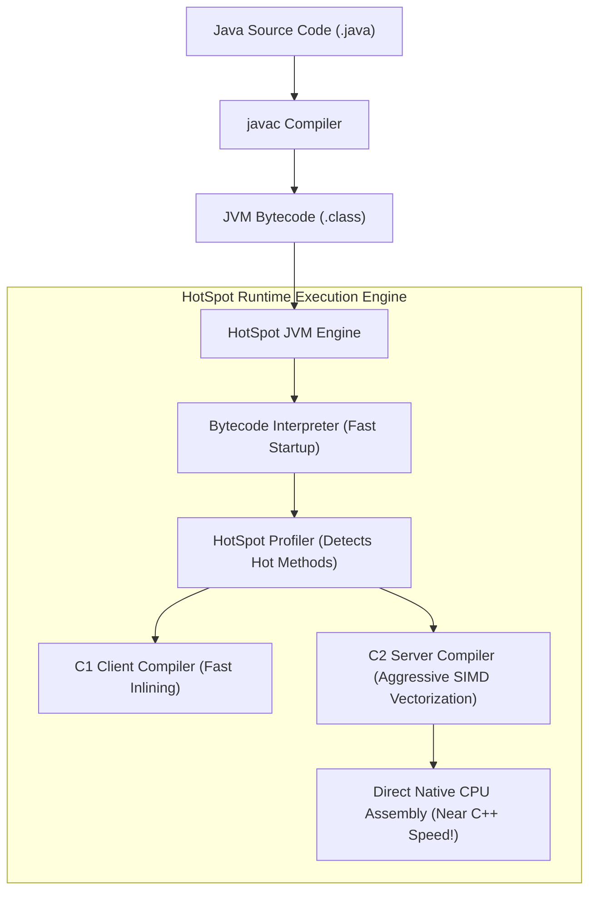
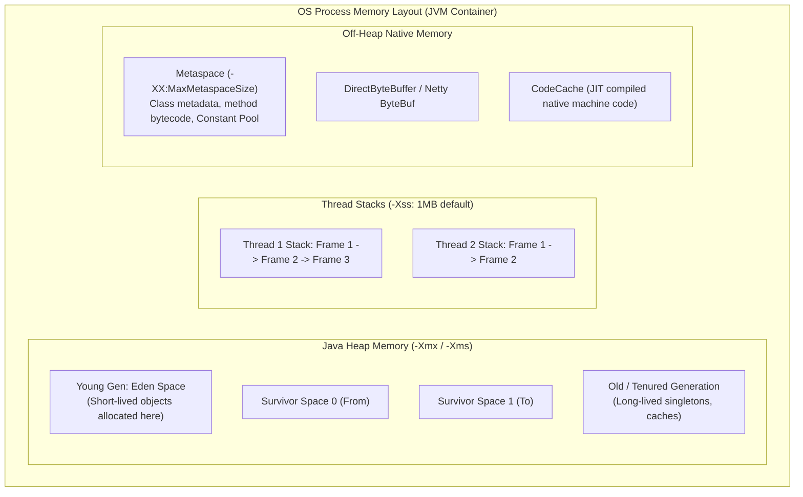
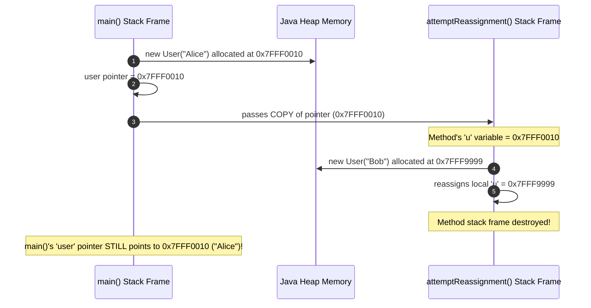
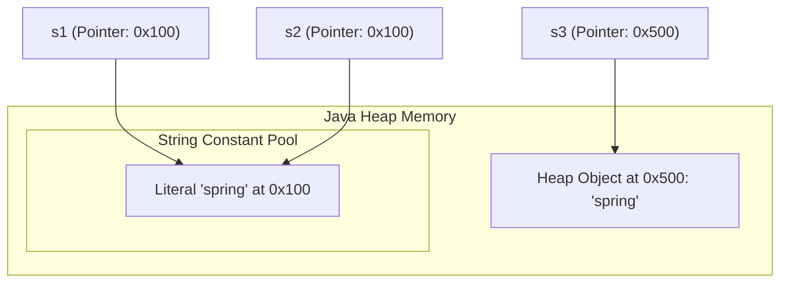
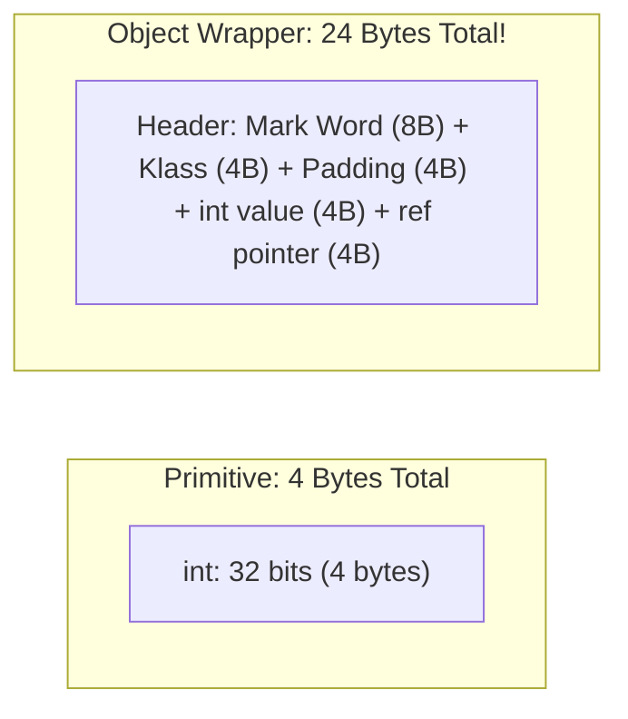

## 1. Mental Model: What Java Actually Does on Hardware

Java source code does not compile directly to machine assembly. The `javac` compiler compiles `.java` files into platform-independent **Bytecode** stored in `.class` files.

At runtime, the **Java Virtual Machine (JVM)** executes bytecode through two complementary execution engines:
1. **The Interpreter**: Reads bytecode instructions sequentially and executes them immediately.
2. **The Just-In-Time (JIT) Compiler (HotSpot C1/C2)**: Detects frequently executed loops and methods ("hot spots"), profiling them dynamically and compiling them into hyper-optimized, native machine assembly (x86-64 / ARM64 instructions).



---

## 2. JVM Memory Layout: Stack, Heap & Metaspace

Understanding memory layout is essential for diagnosing memory leaks, thread starvation, and `OutOfMemoryError` incidents:



### The Three Memory Regions Deconstructed:

1. **Thread Stacks (Per-Thread Memory)**:
   - Every OS platform thread has its own private stack (default `-Xss1m`).
   - Stores **Stack Frames**: local primitive variables (`int`, `long`, `boolean`), object reference pointers, operand stacks, and method return addresses.
   - Stack memory is automatically deallocated in $O(1)$ time when a method returns (zero Garbage Collection overhead).
2. **Java Heap (Shared Object Space)**:
   - Shared across all threads in the JVM (`-Xmx`).
   - All instantiated objects (`new User()`, arrays, strings) reside on the heap.
   - Divided into **Young Generation** (Eden, S0, S1) and **Old Generation** to exploit the **Weak Generational Hypothesis**: *most objects die shortly after allocation*.
3. **Metaspace (Off-Heap Native Memory)**:
   - Replaced PermGen in Java 8. Resides in native operating system memory (outside the Java heap).
   - Stores class metadata, static fields, method bytecode, and the runtime constant pool.

---

## 3. The Pass-by-Value Proof

A perennial interview trap is: *"Does Java pass objects by reference or by value?"*

> **Axiom**: **Java is strictly 100% Pass-by-Value.** There is zero pass-by-reference in Java.

When you pass an object to a method, you are **not** passing the object itself. You are passing a **copy of the pointer (reference) value**:

```java
public class PassByValueProof {

    public static void main(String[] args) {
        User user = new User("Alice");
        
        attemptReassignment(user);
        System.out.println(user.getName()); // Prints "Alice", NOT "Bob"!

        modifyInternalState(user);
        System.out.println(user.getName()); // Prints "Charlie"!
    }

    public static void attemptReassignment(User u) {
        // 'u' is a local copy of the memory pointer.
        // Reassigning 'u' modifies ONLY the local stack variable!
        u = new User("Bob"); 
    }

    public static void modifyInternalState(User u) {
        // Mutates the actual object referenced by the copied pointer in the heap
        u.setName("Charlie"); 
    }
}
```



---

## 4. String Pool & Immutability Internals

Strings are the most heavily allocated objects in backend services. To conserve memory, the JVM maintains the **String Constant Pool** in heap memory:

```java
String s1 = "spring";            // Placed in String Pool
String s2 = "spring";            // Reuses exact same pooled object
String s3 = new String("spring");// Forces NEW object on heap outside pool!

System.out.println(s1 == s2); // true  (Identical memory address!)
System.out.println(s1 == s3); // false (Different memory addresses!)
```



### Compact Strings in Modern Java:
Prior to Java 9, every character in a `String` was stored as a 2-byte `char[]` (UTF-16), wasting 50% of heap memory on standard Latin text. 
In modern Java (Java 9 through Java 21), strings use **Compact Strings**: an internal `byte[]` accompanied by a 1-byte `coder` flag:
- If a string contains only Latin-1 characters (`ISO-8859-1`), it stores 1 byte per character.
- If it contains non-Latin characters (e.g., Chinese, emoji), it stores 2 bytes per character (UTF-16).

---

## 5. Primitives vs Object Wrappers: The Autoboxing Tax

Every Java object carries an **Object Header** overhead:
- **Mark Word (8 bytes)**: Identity hashcode, GC age bits, locking pointers.
- **Klass Pointer (8 bytes / 4 bytes with Compressed OOPs)**: Pointer to class metadata in Metaspace.



### The Performance Penalty of Autoboxing in Loops:
```java
// CATASTROPHIC PERFORMANCE ANTI-PATTERN:
Long sum = 0L; // Object wrapper!
for (long i = 0; i < 10_000_000; i++) {
    sum += i; // Unboxes to long, adds, and boxes back to NEW Long object!
}
```
**Impact**: The loop above instantiates **10,000,000 temporary `Long` objects on the heap**, triggering continuous Young Generation garbage collection pauses. Changing `Long sum` to primitive `long sum` accelerates execution by **10x** with zero heap allocations!

---

## 6. Modern Java 21 Records, Pattern Matching & Sealed Classes

Modern backend development in Java 21 abandons verbose boilerplate (getters, setters, manual `toString`) in favor of **Records**, **Sealed Classes**, and **Pattern Matching**:

```java
package com.backend.mastery.domain;

import java.time.Instant;

// 1. Sealed Interface: Restricts implementations to a closed set
public sealed interface PaymentMethod 
    permits CreditCard, BankTransfer, CryptoWallet {

    record CreditCard(String cardNumber, String cvv, Instant expiryDate) implements PaymentMethod {}
    record BankTransfer(String iban, String swiftCode) implements PaymentMethod {}
    record CryptoWallet(String walletAddress, String network) implements PaymentMethod {}
}

// 2. Exhaustive Switch Pattern Matching (No default branch required!)
public class PaymentProcessor {

    public String processPayment(PaymentMethod method, long amountCents) {
        return switch (method) {
            case PaymentMethod.CreditCard cc -> 
                "Charging card ending in " + cc.cardNumber().substring(12) + " for " + amountCents;
            case PaymentMethod.BankTransfer bt -> 
                "Initiating wire to IBAN " + bt.iban() + " for " + amountCents;
            case PaymentMethod.CryptoWallet cw -> 
                "Broadcasting " + amountCents + " to wallet " + cw.walletAddress();
        };
    }
}
```

### Why Records are Superior to Lombok `@Value`:
1. **True Immutability**: Record fields are `final` and private by definition.
2. **Built-in Canonical Constructors**: Enables concise validation guards without reflection.
3. **Serialization Safety**: Java deserialization reconstructs records exclusively through their canonical constructor, preventing bypass of validation invariants.

---

## 7. Failure Modes & Edge Case Matrix

| Failure Mode | Root Cause | Impact | Production Defense |
| :--- | :--- | :--- | :--- |
| **`StackOverflowError`** | Unbounded recursion or infinite loop | Thread stack exhaustion (`-Xss`) | Convert deep recursion into iterative loops; check base case. |
| **`OutOfMemoryError: Java heap space`** | Large memory leaks; unbounded caching | JVM crashes due to lack of heap | Profile heap dump with Eclipse MAT; configure `-Xmx`. |
| **`OutOfMemoryError: Metaspace`** | Dynamic class generation leak (CGLIB/ByteBuddy) | JVM native memory exhaustion | Set `-XX:MaxMetaspaceSize=512m`; avoid leaking classloaders. |
| **Autoboxing GC Churn** | Using `Long` instead of `long` in high-throughput loops | Thousands of objects allocated per second | Use primitive collections (`LongStream`, Fastutil) in hot loops. |
| **Floating Point Precision Drift** | Using `double` or `float` for currency calculations | `0.1 + 0.2 = 0.30000000000000004` | Always use atomic micro-units (`long`) or `BigDecimal`. |

---

## 8. Senior Interview Questions & Active Recall

<AccordionGroup>
  <Accordion title="1. Prove that Java is strictly Pass-by-Value using memory stack diagrams.">
    Java variables holding objects do not contain the object itself; they contain a memory pointer (reference value) pointing to an object residing on the heap. When an object is passed as an argument to a method, the JVM makes a bitwise copy of that memory pointer and pushes it onto the new method's stack frame. If the method reassigns the local parameter (`u = new User()`), it only modifies the copied pointer inside its own stack frame. The caller's stack frame continues pointing to the original memory address, proving pass-by-value semantics.
  </Accordion>

  <Accordion title="2. What is the difference between the JVM Stack and the JVM Heap?">
    The **Stack** is thread-private memory allocated per thread (`-Xss`). It stores stack frames containing method parameters, local primitives, and object references. Deallocation is automatic and instant upon method return with zero GC overhead. The **Heap** is shared across all threads (`-Xmx`). It stores all instantiated objects and arrays. Allocation requires runtime memory management, and deallocation is governed by the Garbage Collector (G1GC or ZGC).
  </Accordion>

  <Accordion title="3. How do Sealed Classes and Records improve architectural domain modeling in Java 21?">
    Sealed classes allow developers to define a closed, bounded inheritance hierarchy using the `permits` keyword. When combined with Records and `switch` pattern matching, the Java compiler enforces **exhaustive pattern matching**: if a developer adds a new payment method to a sealed interface, every `switch` statement in the codebase will fail compilation until the new case is handled, eliminating runtime `UnhandledException`s.
  </Accordion>
</AccordionGroup>

---

## 9. Done Checklist

<Check>
- [ ] Diagram the HotSpot JVM execution engine: Interpreter, Profiler, and C1/C2 JIT compilers.
- [ ] Distinguish between Thread Stacks, the Java Heap, and off-heap Metaspace.
- [ ] Understand why Java is 100% Pass-by-Value with stack pointer diagrams.
- [ ] Explain how the String Constant Pool and Compact Strings conserve heap memory.
- [ ] Eliminate the autoboxing performance penalty in high-throughput loops.
- [ ] Implement robust domain models using Java 21 Records, Sealed Classes, and exhaustive pattern matching.
</Check>
